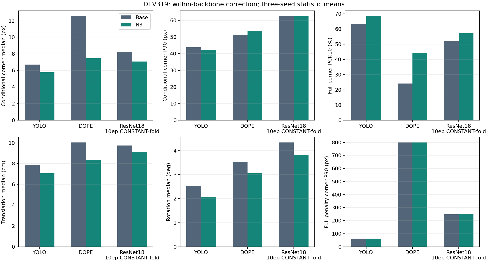
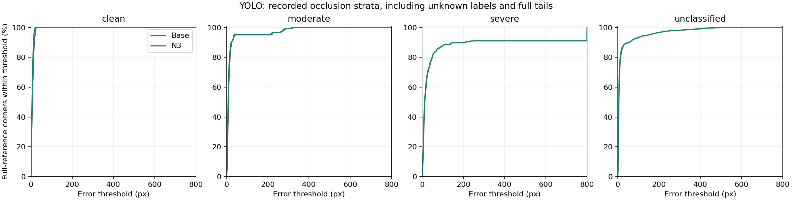

# N3 비리프터 결과: GitHub 확인 안내

2026-10-03 공개 정리. 완료한 실험·재집계·검산 결과를 사용자 요청에 따라 `main`에 게시하는 단계다. **이번 게시 단계의 신규 학습과 optimizer update는 모두 0회**다. 기존 실행 기록의 `push: false`와 “push하지 않았다”는 앞선 로컬 마감 시점의 사실이며, 그 기록은 수정하지 않았다.

[상세 결과 보고서](FINAL_REPORT_KO.md) · [결과 반영 국문 v3](manuscript_ko_v3_static_closeout.md) · [남은 x와 이유](REMAINING_X.md)

## 실제로 사용한 모델과 결과

세 기반의 **N3 보정 모듈은 이미지 특징과 실제 W,D,H 치수를 함께 입력받고 대칭 감독을 포함**한다. 각 기반에 별도 학습한 3개 seed를 사용했다. 기반 모델 자체는 RGB 입력이다. ResNet은 실제 **10-epoch CONSTANT-fold RGB/DSNT** 모델이며, 오래된 60-epoch/argmax 설명은 [별도 정정 기록](PROTOCOL_CORRECTIONS.md)으로 구분했다. [학습 재사용·체크포인트 검증](TRAINING_REUSE_VERIFICATION.json)에서 확인할 수 있다.

DEV319의 보정 전후 결과다. N3 숫자는 3개 seed별 통계의 평균이다. 코너 중앙값/P90은 매칭된 유효 코너, PCK10은 전체 참조 2,499점 분모이며, T/R은 자세 산출 성공 프레임에 대한 조건부 통계다. 기반마다 매칭·자세 산출 집합이 다르므로 기반 사이의 성능 순위를 인과적으로 해석하지 않는다.

| Backbone | Path | Median px | P90 px | PCK10 % | T med cm | R med deg | Matched frames | Observed corners | Pose frames | Pose % |
| --- | --- | --- | --- | --- | --- | --- | --- | --- | --- | --- |
| yolo | Base | 6.721 | 43.890 | 63.425 | 7.897 | 2.539 | 311 | 2445 | 319 | 100.000 |
| yolo | N3 | 5.778 | 42.134 | 68.587 | 7.068 | 2.070 | 311 | 2445 | 319 | 100.000 |
| dope | Base | 12.570 | 51.282 | 24.170 | 10.046 | 3.530 | 233 | 1797 | 210 | 65.831 |
| dope | N3 | 7.469 | 53.570 | 44.338 | 8.356 | 3.051 | 233 | 1797 | 210 | 65.831 |
| ResNet18 RGB 10ep CONSTANT-fold | Base | 8.223 | 62.638 | 52.261 | 9.739 | 4.342 | 292 | 2291 | 319 | 100.000 |
| ResNet18 RGB 10ep CONSTANT-fold | N3 | 7.085 | 62.371 | 57.223 | 9.134 | 3.832 | 292 | 2291 | 319 | 100.000 |

세 기반의 T/R 중앙값 평균은 낮아졌지만, **ResNet T 중앙값의 95% 구간은 0을 포함**한다. DOPE 회전 P90과 ResNet 이동 P90은 악화했다. 보정 전후 성공 프레임 ID 집합은 같았으며 신규 자세 실패·복구는 0이다. DOPE의 자세 실패 109장은 전체 산출률과 AUC 분모에 남겼다. 이 결과는 반복 사용한 DEV의 사후 분석이고 독립 물리 6D 시험이 아니다.

13개 세션, 10,000회 동일 재표집, 3 seed의 통계 차이를 평균했다. [프레임별 짝지은 분석](PAIRED_POSE_ANALYSIS.json)은 `median(after)-median(before)`와 `median(after-before)`를 구분한다. 일반적인 백본 전체에 대한 강건성이나 동일 가중치의 전이를 입증했다고 주장하지 않는다.

## 실제 영상과 가림 결과

노랑 +는 기존 참조, 파랑 원은 Base, 분홍 ×는 N3 seed1이다. 개선·무차이·악화 각 집단에서 ID 사전순 첫 영상을 고른 설명용 예시이며, 집단에 영상이 없으면 그대로 표시했다. PnP 재투영점이 아니라 실제 예측 코너다. [영상 ID·선택 규칙](EXAMPLE_SELECTION.json)과 [그림별 수치 출처](FIGURE_PROVENANCE.json)를 함께 제공한다.

가림은 현재 clean 29 / moderate 20 / severe 79 / 미분류 191장이다. 이전 29/21/78과 다른 단일 프레임 ID와 주석 출처는 [주석 감사](STATIC_LABEL_AUDIT.md)에 있다. 미분류를 임의 확정하지 않았다. [검수 안내](review/README.md)의 HTML과 원영상 연결은 로컬 전용이다. GitHub에서는 위 결과 이미지 4장을 직접 볼 수 있으며, 로컬 검수용 319개 절대경로 symlink는 게시하지 않는다.

## 검산·원고 반영·남은 항목

- N0/N1 누락 6D 평가: 2구성 × 3 seed × 319장 = **1,914행** 계산. [seed별 결과](N0_N1_POSE_RESULTS.csv).
- 기존 R0/P/N2/N3 및 D/L/PoseFix·공통128장 자기학습 패널 회귀검산. 정사각형 602점/600점 모드를 분리했다. [생성 표](generated_tables/).
- 테스트 **43개 통과**, 표 숫자 **1,676개 대조 통과**, 보호 원본 **103개 해시 불변**. 이 숫자는 검산한 수치 칸 수이며, 새로 채운 원래 x의 수가 아니다. [검증 결과](VERIFY_STATIC_RESULTS.json), [초기 로그](TESTS_INITIAL.txt), [경로 복원 후 로그](TESTS_AFTER_INPUT_PATH_REPAIR.txt).
- 결과를 국문 v3 **Markdown 복사본에 실제 반영**했다. 동일 국문 v3 LaTeX 원본이 없어 `.tex` 교체 조각까지만 준비했다. [변경 목록](PAPER_RESULTS_PATCH_KO.md), [칸별 출처·반영 상태](PAPER_GAP_MATRIX.md), [전체 CSV](PAPER_GAP_MATRIX.csv).
- 기존 원고의 정적 도식 3개는 소스가 없으므로 복사본의 해당 이미지가 표시되지 않을 수 있다. 이 페이지의 결과 이미지 4개는 실제 PNG 파일로 게시한다. PDF는 생성하지 않았다.
- 미분류191장·미확인 가시성·정사각형 독립 6D 참조는 여전히 필요하다. 정사각형 N3가 N2보다 일부 악화하고, PoseFix의 중앙 오차가 N3보다 낮은 결과도 보존했다. **논문 전체 완료로 표시하지 않는다.** 리프터 장·표는 변경하지 않았고 실행 범위에서 제외했다.

## 비용과 계산 근거 확인

YOLO 새 측정의 Base / N3 전체 / 보정 단독 중앙시간은 **11.195 / 15.138 / 3.432 ms**다. DOPE는 **62.736 / 65.807 / 2.838 ms**, ResNet은 **8.890 / 11.592 / 2.632 ms**의 기존 동일 계약 결과를 재사용했다. RTX3080은 같지만 YOLO의 라이브러리 환경은 달라 별도 패널로 취급하며, 절대 속도의 기반 간 순위로 주장하지 않는다. 고정26프레임, warmup20, 5반복 조건과 계측 경계는 [비용 표](RUNTIME_PANEL.json)에 있다.

[공개 프레임 점수·자세·bootstrap·시간 원시 근거](evidence/README.md)에는 원본과 동일한 gzip 사본 및 SHA-256 매핑이 있다. 전체 학습 데이터와 가중치를 포함하는 재현 패키지는 아니다. [평가 코드](../../../scripts/research/pallet_n3_static_closeout_v1/) · [실제 실행 명령과 환경](README_RUN.md) · [실행 비용](EXECUTION_COST.json).

검산 기록을 바꾸거나 실험을 다시 실행하지 않고 게시했다. [게시 파일 검증](PUBLICATION_VALIDATION.json)은 게시 파일·압축 무결성·이 페이지 링크 및 이미지의 별도 확인 기록이다.
