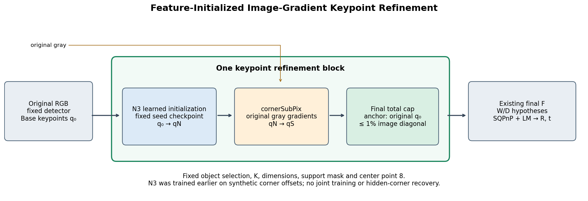
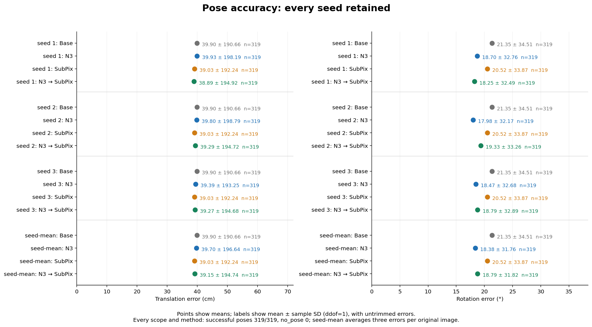
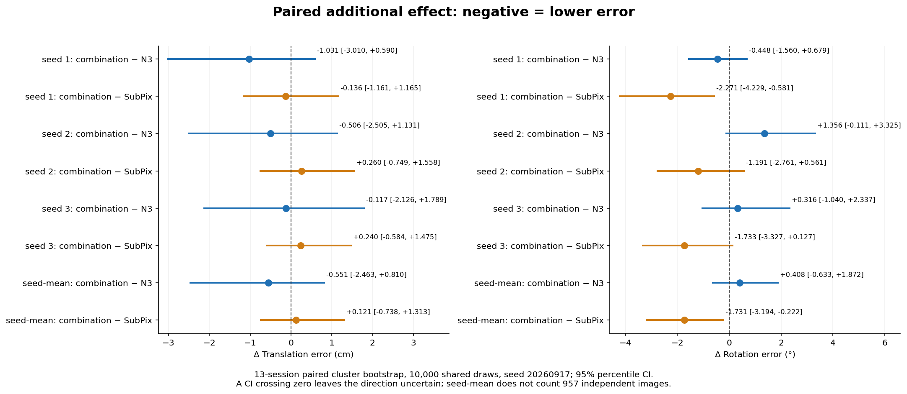
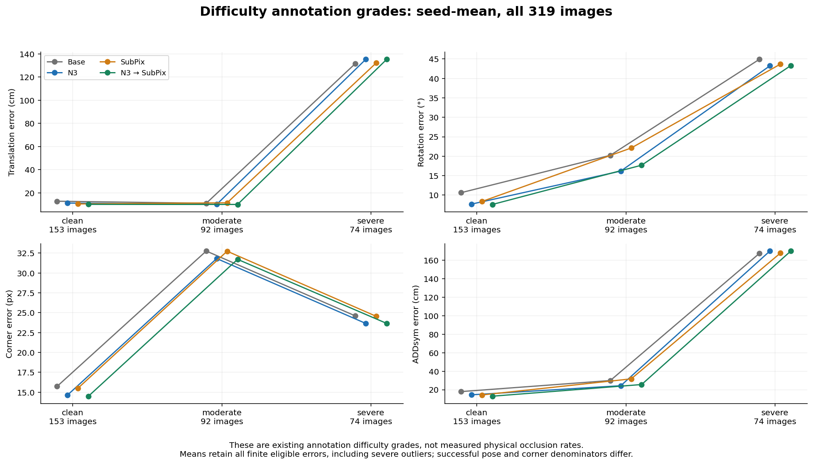
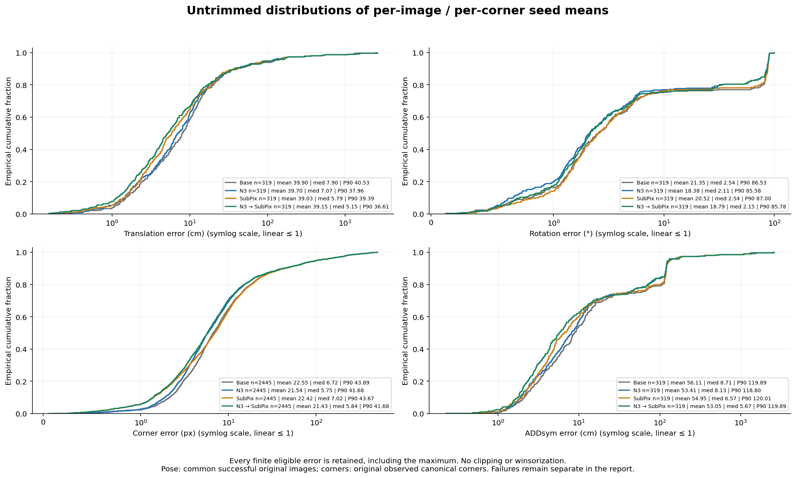
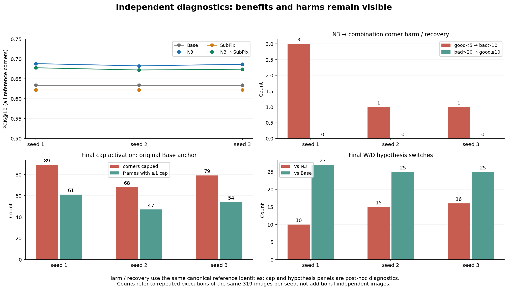
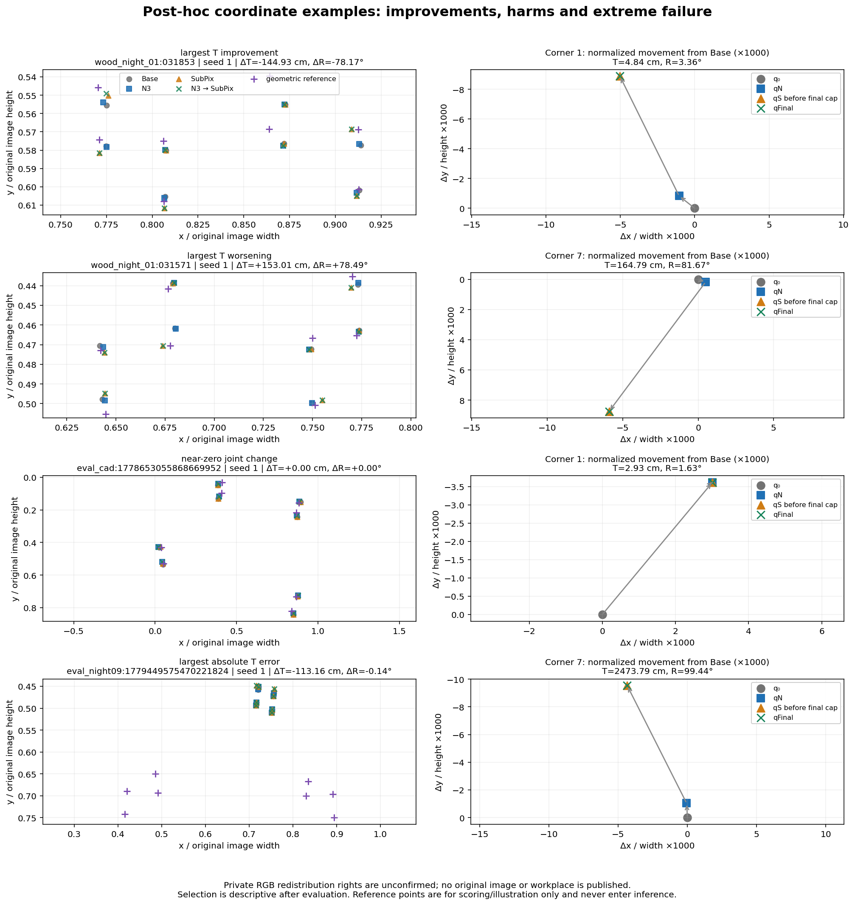

# N3→cornerSubPix 3-seed 동일 REAL_DEV 검증 보고서

N3→cornerSubPix를 3-seed 동일 실사 평가에서 검증한 결과, N3 대비 seed-mean 위치 평균은 0.551 cm 감소, 회전 평균은 0.408° 증가했으며 위치·회전의 결합−N3 95% 구간이 0을 포함한다.
SUBPIX 대비 위치 변화는 0.121 cm [-0.738, 1.313], 회전 변화는 -1.731° [-3.194, -0.222]다. 이 반복 개발자료만으로 독립 테스트의 확정 우위를 주장할 수 없다.
코너 PCK@10은 N3 0.685874 → 결합 0.674803이고 손상·큰 오류도 아래에 보존했다.

상태: **COMPLETE**. 2026-10-10 실행. 이 문서는 저장소 실험 보고서이며 논문·초록·LaTeX·PDF·PPT를 수정하지 않았다.

## 1. 문제와 고정 방법

초기 영상 키포인트의 작은 위치 오차가 PnP와 가로/깊이 가설 선택을 흔들 수 있다. N3는 기존 영상 특징과 canonical 치수 문맥으로 초기점을 이동하고, OpenCV cornerSubPix는 현재 원영상의 국소 밝기 기울기로 그 시작점을 정제한다. 둘을 순서대로 연결하는 표준 후처리의 검증이다. 설명용 이름은 **Feature-Initialized Image-Gradient Keypoint Refinement**이며 새로운 최적화 알고리즘의 독창성 주장이 아니다.

N3와 cornerSubPix를 공동 학습하지 않았다. N3의 기존 합성 코너 이동 후보 확률 학습과 이번 영상 기울기 정제는 분리되어 있다. 단일 end-to-end loss, 미분 가능한 PnP, 전체 방법의 train-free 성격, 가린 코너의 별도 복구, 모든 기반 모델에서의 검증을 주장하지 않는다.



원영상 좌표의 Base 코너를 q₀, seed s의 기존 N3 결과를 qN, cornerSubPix 반환을 qS라고 둔다. N3는 221개 이동 후보와 0 이동 null 후보(총 222개)에 대해 `p_j = softmax(logit_j / T_s)`를 계산하고 `δ = λ Σ_j p_j d_j`를 적용한다. 기존 `λ=1`, seed별 합성 calibration에서 확정된 `T_s`와 checkpoint를 보존했다. N3 내부의 기존 float32 상한도 변경하지 않고 그 출력 캐시를 재사용했다.

`qS = cornerSubPix(gray_uint8, qN, winSize=(5,5), zeroZone=(-1,-1), criteria=(EPS|COUNT,40,0.001))`이다. SUBPIX 단독은 q₀에서 시작한다. 각 코너 0–7에만 적용하고 원영상 밖 초기점·오류·비유한 출력에서는 시작점을 유지한다. 중심점 8과 미지원·결측 슬롯을 보존한다.

cornerSubPix의 공식 설명은 국소점 pᵢ의 영상 기울기 gᵢ에 대해 `εᵢ=gᵢᵀ(q−pᵢ)`를 줄이는 정상방정식 `Gq=b`, `G=Σᵢgᵢgᵢᵀ`, `b=Σᵢgᵢgᵢᵀpᵢ`, `q=G⁻¹b`를 반복하는 방식이다. 새 q로 창을 옮겨 수렴 또는 최대 반복에서 멈춘다. winSize=(5,5)는 11×11 창이고 zeroZone=(−1,−1)는 중앙 제외 영역 없음이다. 실제 수치 처리는 고정 OpenCV 구현 그대로다. [OpenCV 4.9.0 공식 cornerSubPix 설명](https://docs.opencv.org/4.9.0/dd/d1a/group__imgproc__feature.html).

최종 상한은 **원래 Base 기준으로 마지막에 한 번** 적용한다. `c = 0.01 sqrt(W_image²+H_image²)`, `Δ = qS−q₀`, `qFinal = q₀ + Δ min(1,c/||Δ||₂)`이며 0 이동은 그대로 둔다. N3 기준으로 추가 1%를 허용하지 않는다. 640×480 원영상이면 c=8 px다. 기존 캐시 float32 반올림에 따른 미세 상한 초과는 원행/입력 감사에 남기고 결합의 float64 최종 상한에서만 엄격히 제한한다.

최종 좌표마다 기존 F를 실제 실행한다. prediction-only 가로/깊이 가설 선택, SQPnP와 `solvePnPRefineLM`을 보존했다. 객체 검출 후보·선택 index·점수·박스·지원 마스크·K·canonical 치수·proper 대칭 계약을 고정했다. 참조 코너, 사람이 표시한 가시성, 참조로 고른 코너 재배열은 추론 입력이 아니다.

## 2. 자료와 실행 계약

REAL_DEV **319장, 13세션**, 객체 매칭 311장, 유효 참조 코너 2,499개와 관측 코너 2,445개다. clean 153 / moderate 92 / severe 74는 기존 주석 난도 등급이며 물리적인 외부 가림률 측정이 아니다. severe를 포함한 전체 319장을 주평가로 유지했다. 이 DEV는 여러 설계에 반복 노출됐으므로 새 독립 실사 테스트라고 부르지 않는다.

참조는 2D 및 등록 치수로 만든 기하 재구성값이고 물리 장치로 독립 실측한 GT가 아니다. 문맥 치수는 canonical `[W,D,H]`, 기존 PnP API의 치수 배열은 `[W,H,D]`다. 이 순서를 혼동하지 않고 `fixed_metadata.dimensions_pnp_WH_D_m` 및 lock의 두 배열을 그대로 보존했다. 허용 proper symmetry와 두 가설을 동등한 것으로 합치지 않았다.

실행 당시 최신 원격 main에서 분리한 worktree의 기준 SHA는 `7e92fdcefb0a37bdee0aef95d3e86c572e23b967`다. 사용자 원래 checkout과 기존 결과/입력은 별도 보존했다. 입력 해시 [감사](INPUT_AUDIT.json), [방법·319입력 lock](INPUT_AND_METHOD_LOCK.json), [실행/검증](EXECUTION_AND_VERIFICATION.json), [seed1 parity](SEED1_PARITY.json), [독립 검산](INDEPENDENT_VERIFICATION.json)을 공개했다.

정확도는 N3 seed별 기존 REAL_DEV 좌표 캐시를 재사용해 detector **0회**, N3 forward **0회**, 실제 최종 F **2552회**다. BASE/SUBPIX는 실제 F를 각각 319회 실행한 같은 결과를 seed 2/3에 공유했다. N3와 결합은 seed별 새 좌표로 F를 실행했다. 저장 원행은 4방법×3seed×319 = **3828행**이다. 새 학습/optimizer update **0**, 추가 합성 영상 **0**, 신규 시간측정 **0**이다.

seed1은 **전체 319장×4방법**의 기존 좌표를 정확 일치 비교하고 자세 오차 및 가능한 기존 R/t 벡터를 절대 오차 `1e−7`로 비교한 뒤 seed2/3을 실행했다. 과거 BASE/SUBPIX의 R/t 벡터는 26장에만 저장돼 그 범위만 직접 벡터 비교가 가능했지만, 좌표·가설·오차는 319장 모두 비교했다. 이번 원행에는 모든 실제 R/t가 있다.

## 3. 전체 정확도: seed별 결과와 seed-mean

모든 SD는 **오차의 표본 표준편차(ddof=1)**이며 평균의 표준오차·신뢰구간·학습 seed 산포가 아니다. 코너 평균은 관측 코너 풀링(n=2,445), 자세 평균은 실제 성공 영상당 오차(n=319)다. 유한 큰 오류는 제거하지 않았다. 아래 `평균 ± SD; [95% CI]`의 CI는 13세션 단위 cluster bootstrap 10,000회다.

N3 checkpoint와 고정 temperature (temperature를 다시 튜닝하지 않았다):

| seed | temperature | checkpoint SHA256 | REAL_DEV prediction SHA256 |
| --- | --- | --- | --- |
| 1 | 1.0 | `ceea743b7b8467cf43eef66582b923dd980e5b2fb27f5575af5df185109f22dd` | `f1a7d520f164b9ec8a2600a54aad1d8df4cca87fcb86b8eb8bd6f7f7275691cf` |
| 2 | 1.0 | `9731a0d269799c28e54a9a7c7c9de3a06cd05f75e7c0786e62f5eea65f8b953d` | `5398a9613afc4407de11c25bd20aca4870bdbd2cb73f7d9afd0e91863359aba4` |
| 3 | 1.0 | `4b04cae793c9a74fd346b84501eed1bac2e689fac257727ff1489e1235c208e3` | `ba7cece6ed37544ce8fa1435518c9d2eeaa4f668aaf9948b241cb64fc7f2cefe` |

감사 기록 보존: 정확도 실행 시작의 INPUT_AUDIT 원본을 [INPUT_AUDIT_AT_EVALUATION_START.json](INPUT_AUDIT_AT_EVALUATION_START.json)에 보존했고 현재 INPUT_AUDIT도 그 원본 바이트로 유지하여 lock에 저장한 SHA와 일치한다. 이후 기존 runtime 독립 검산을 추가한 [INPUT_AUDIT_SUPPLEMENT.json](INPUT_AUDIT_SUPPLEMENT.json)은 별도 증거 부가본이다. 평가 입력이나 과거 lock을 결과에 맞춰 변경한 것이 아니다. [HISTORICAL_EVIDENCE_VERIFICATION.json](HISTORICAL_EVIDENCE_VERIFICATION.json)이 과거 runtime 원시간과 seed1 역순의 고정 commit 출처를 검산했다.

[EVALUATOR_CONTRACT_REVIEW.json](EVALUATOR_CONTRACT_REVIEW.json)은 공개 R/t에서 T·R·ADDsym 오차와 참조 코너 거리·최종 cap을 별도로 재계산해 최대 절대 차이 0을 확인했다. 기존 N3 pose 캐시와도 세 seed 각각 319장이 일치했다. seed1 캐시 해시는 과거 lock과 연결됐고 seed2/3 pose 캐시 해시는 이번 추가 parity 증거로 기록되어 과거에 인증된 해시라고 혼용하지 않는다.

| seed | 방법 | T cm: 평균±SD; 95% CI | R °: 평균±SD; 95% CI | ADDsym cm: 평균±SD; 95% CI | 자세 성공/실패 |
| --- | --- | --- | --- | --- | --- |
| 1 | BASE | 39.897 ± 190.661; [12.236, 94.210] | 21.352 ± 34.509; [12.615, 31.158] | 56.109 ± 192.485; [23.458, 111.285] | 319/0 |
| 1 | N3_DIM_SYM | 39.926 ± 198.194; [11.282, 97.148] | 18.700 ± 32.756; [11.087, 27.367] | 54.037 ± 199.776; [21.219, 111.214] | 319/0 |
| 1 | SUBPIX | 39.031 ± 192.244; [10.731, 95.387] | 20.523 ± 33.870; [12.689, 29.681] | 54.950 ± 194.073; [22.225, 112.045] | 319/0 |
| 1 | N3_THEN_SUBPIX | 38.895 ± 194.917; [9.888, 96.493] | 18.252 ± 32.493; [10.177, 27.334] | 52.423 ± 196.558; [19.235, 110.039] | 319/0 |
| 2 | BASE | 39.897 ± 190.661; [12.236, 94.210] | 21.352 ± 34.509; [12.615, 31.158] | 56.109 ± 192.485; [23.458, 111.285] | 319/0 |
| 2 | N3_DIM_SYM | 39.797 ± 198.795; [11.018, 97.305] | 17.976 ± 32.166; [10.757, 25.938] | 52.999 ± 200.326; [20.191, 111.756] | 319/0 |
| 2 | SUBPIX | 39.031 ± 192.244; [10.731, 95.387] | 20.523 ± 33.870; [12.689, 29.681] | 54.950 ± 194.073; [22.225, 112.045] | 319/0 |
| 2 | N3_THEN_SUBPIX | 39.291 ± 194.719; [10.306, 96.629] | 19.332 ± 33.257; [11.359, 28.529] | 53.764 ± 196.465; [20.062, 113.168] | 319/0 |
| 3 | BASE | 39.897 ± 190.661; [12.236, 94.210] | 21.352 ± 34.509; [12.615, 31.158] | 56.109 ± 192.485; [23.458, 111.285] | 319/0 |
| 3 | N3_DIM_SYM | 39.388 ± 193.251; [11.626, 94.893] | 18.474 ± 32.681; [10.613, 27.340] | 53.201 ± 194.954; [20.898, 109.018] | 319/0 |
| 3 | SUBPIX | 39.031 ± 192.244; [10.731, 95.387] | 20.523 ± 33.870; [12.689, 29.681] | 54.950 ± 194.073; [22.225, 112.045] | 319/0 |
| 3 | N3_THEN_SUBPIX | 39.271 ± 194.681; [10.563, 96.673] | 18.790 ± 32.890; [11.306, 27.291] | 52.964 ± 196.405; [20.265, 110.848] | 319/0 |
| seed-mean | BASE | 39.897 ± 190.661; [12.236, 94.210] | 21.352 ± 34.509; [12.615, 31.158] | 56.109 ± 192.485; [23.458, 111.285] | 319/0 |
| seed-mean | N3_DIM_SYM | 39.704 ± 196.644; [11.325, 96.448] | 18.383 ± 31.758; [10.858, 26.891] | 53.412 ± 198.067; [20.795, 110.743] | 319/0 |
| seed-mean | SUBPIX | 39.031 ± 192.244; [10.731, 95.387] | 20.523 ± 33.870; [12.689, 29.681] | 54.950 ± 194.073; [22.225, 112.045] | 319/0 |
| seed-mean | N3_THEN_SUBPIX | 39.152 ± 194.744; [10.263, 96.613] | 18.792 ± 31.817; [10.991, 27.695] | 53.050 ± 196.177; [19.884, 111.428] | 319/0 |

| seed | 방법 | 코너 px: 평균±SD; 95% CI | 관측/참조 코너 | PCK@10 | gross20 개수/비율 |
| --- | --- | --- | --- | --- | --- |
| 1 | BASE | 22.552 ± 54.645; [16.026, 30.519] | 2445/2499 | 0.634254 | 498/0.199280 |
| 1 | N3_DIM_SYM | 21.498 ± 54.686; [15.183, 29.140] | 2445/2499 | 0.688275 | 439/0.175670 |
| 1 | SUBPIX | 22.422 ± 54.669; [15.943, 30.422] | 2445/2499 | 0.622249 | 503/0.201281 |
| 1 | N3_THEN_SUBPIX | 21.415 ± 54.705; [15.161, 29.093] | 2445/2499 | 0.677871 | 443/0.177271 |
| 2 | BASE | 22.552 ± 54.645; [16.026, 30.519] | 2445/2499 | 0.634254 | 498/0.199280 |
| 2 | N3_DIM_SYM | 21.558 ± 54.644; [15.271, 29.184] | 2445/2499 | 0.682673 | 444/0.177671 |
| 2 | SUBPIX | 22.422 ± 54.669; [15.943, 30.422] | 2445/2499 | 0.622249 | 503/0.201281 |
| 2 | N3_THEN_SUBPIX | 21.464 ± 54.687; [15.208, 29.143] | 2445/2499 | 0.672269 | 450/0.180072 |
| 3 | BASE | 22.552 ± 54.645; [16.026, 30.519] | 2445/2499 | 0.634254 | 498/0.199280 |
| 3 | N3_DIM_SYM | 21.549 ± 54.607; [15.242, 29.188] | 2445/2499 | 0.686675 | 434/0.173669 |
| 3 | SUBPIX | 22.422 ± 54.669; [15.943, 30.422] | 2445/2499 | 0.622249 | 503/0.201281 |
| 3 | N3_THEN_SUBPIX | 21.418 ± 54.558; [15.134, 29.116] | 2445/2499 | 0.674270 | 437/0.174870 |
| seed-mean | BASE | 22.552 ± 54.645; [16.026, 30.519] | 2445/2499 | 0.634254 | 498.0/0.199280 |
| seed-mean | N3_DIM_SYM | 21.535 ± 54.639; [15.241, 29.171] | 2445/2499 | 0.685874 | 439.0/0.175670 |
| seed-mean | SUBPIX | 22.422 ± 54.669; [15.943, 30.422] | 2445/2499 | 0.622249 | 503.0/0.201281 |
| seed-mean | N3_THEN_SUBPIX | 21.432 ± 54.635; [15.162, 29.121] | 2445/2499 | 0.674803 | 443.3333333333333/0.177404 |

seed-mean의 PCK/gross20는 세 seed별 비율/개수의 산술 평균이고 개수가 소수가 될 수 있다. 평균 오차에 임계값을 적용한 값은 별도 `threshold_of_seed_mean_errors`에 보존했다. seed-mean의 오차 분포는 같은 ID의 세 seed **오차**를 먼저 산술 평균한 뒤 319영상/2,445코너의 분포를 계산한다. R/t를 평균해 새로운 자세를 만든 것이 아니다. 957장을 독립 영상으로 계산하지 않았다. BASE/SUBPIX는 N3 seed와 무관해 세 seed에서 같다. seed별 SD를 단순 평균한 값은 seed-mean SD와 다르며 보조 배열 `arithmetic_mean_of_seed_metrics`로만 제공한다.



<details>
<summary>전체 표본분산·중앙값·P90·최댓값 (원행 재계산)</summary>

**코너 (px)**

| seed | 방법 | n | 표본분산 | SD | 중앙값 | P90 | 최댓값 |
| --- | --- | --- | --- | --- | --- | --- | --- |
| 1 | BASE | 2445 | 2986.117 | 54.645 | 6.721 | 43.890 | 495.262 |
| 1 | N3_DIM_SYM | 2445 | 2990.575 | 54.686 | 5.745 | 42.320 | 498.832 |
| 1 | SUBPIX | 2445 | 2988.706 | 54.669 | 7.020 | 43.667 | 495.262 |
| 1 | N3_THEN_SUBPIX | 2445 | 2992.610 | 54.705 | 5.837 | 42.351 | 498.832 |
| 2 | BASE | 2445 | 2986.117 | 54.645 | 6.721 | 43.890 | 495.262 |
| 2 | N3_DIM_SYM | 2445 | 2985.971 | 54.644 | 5.768 | 41.872 | 501.411 |
| 2 | SUBPIX | 2445 | 2988.706 | 54.669 | 7.020 | 43.667 | 495.262 |
| 2 | N3_THEN_SUBPIX | 2445 | 2990.658 | 54.687 | 5.829 | 41.872 | 501.411 |
| 3 | BASE | 2445 | 2986.117 | 54.645 | 6.721 | 43.890 | 495.262 |
| 3 | N3_DIM_SYM | 2445 | 2981.957 | 54.607 | 5.822 | 42.209 | 498.498 |
| 3 | SUBPIX | 2445 | 2988.706 | 54.669 | 7.020 | 43.667 | 495.262 |
| 3 | N3_THEN_SUBPIX | 2445 | 2976.593 | 54.558 | 5.875 | 42.057 | 497.845 |
| seed-mean | BASE | 2445 | 2986.117 | 54.645 | 6.721 | 43.890 | 495.262 |
| seed-mean | N3_DIM_SYM | 2445 | 2985.438 | 54.639 | 5.755 | 41.680 | 498.656 |
| seed-mean | SUBPIX | 2445 | 2988.706 | 54.669 | 7.020 | 43.667 | 495.262 |
| seed-mean | N3_THEN_SUBPIX | 2445 | 2985.023 | 54.635 | 5.839 | 41.680 | 498.438 |

**위치 T (cm)**

| seed | 방법 | n | 표본분산 | SD | 중앙값 | P90 | 최댓값 |
| --- | --- | --- | --- | --- | --- | --- | --- |
| 1 | BASE | 319 | 36351.514 | 190.661 | 7.897 | 40.530 | 2563.837 |
| 1 | N3_DIM_SYM | 319 | 39280.995 | 198.194 | 7.039 | 38.136 | 2586.949 |
| 1 | SUBPIX | 319 | 36957.877 | 192.244 | 5.794 | 39.390 | 2453.731 |
| 1 | N3_THEN_SUBPIX | 319 | 37992.819 | 194.917 | 4.953 | 35.709 | 2473.792 |
| 2 | BASE | 319 | 36351.514 | 190.661 | 7.897 | 40.530 | 2563.837 |
| 2 | N3_DIM_SYM | 319 | 39519.417 | 198.795 | 6.790 | 37.412 | 2599.518 |
| 2 | SUBPIX | 319 | 36957.877 | 192.244 | 5.794 | 39.390 | 2453.731 |
| 2 | N3_THEN_SUBPIX | 319 | 37915.401 | 194.719 | 5.305 | 37.829 | 2480.655 |
| 3 | BASE | 319 | 36351.514 | 190.661 | 7.897 | 40.530 | 2563.837 |
| 3 | N3_DIM_SYM | 319 | 37346.082 | 193.251 | 7.374 | 37.879 | 2603.019 |
| 3 | SUBPIX | 319 | 36957.877 | 192.244 | 5.794 | 39.390 | 2453.731 |
| 3 | N3_THEN_SUBPIX | 319 | 37900.737 | 194.681 | 5.202 | 37.597 | 2484.859 |
| seed-mean | BASE | 319 | 36351.514 | 190.661 | 7.897 | 40.530 | 2563.837 |
| seed-mean | N3_DIM_SYM | 319 | 38668.706 | 196.644 | 7.072 | 37.955 | 2596.495 |
| seed-mean | SUBPIX | 319 | 36957.877 | 192.244 | 5.794 | 39.390 | 2453.731 |
| seed-mean | N3_THEN_SUBPIX | 319 | 37925.208 | 194.744 | 5.146 | 36.609 | 2479.769 |

**회전 R (°)**

| seed | 방법 | n | 표본분산 | SD | 중앙값 | P90 | 최댓값 |
| --- | --- | --- | --- | --- | --- | --- | --- |
| 1 | BASE | 319 | 1190.888 | 34.509 | 2.539 | 86.527 | 98.574 |
| 1 | N3_DIM_SYM | 319 | 1072.955 | 32.756 | 2.110 | 85.931 | 99.585 |
| 1 | SUBPIX | 319 | 1147.174 | 33.870 | 2.541 | 86.997 | 99.465 |
| 1 | N3_THEN_SUBPIX | 319 | 1055.813 | 32.493 | 2.100 | 85.877 | 99.441 |
| 2 | BASE | 319 | 1190.888 | 34.509 | 2.539 | 86.527 | 98.574 |
| 2 | N3_DIM_SYM | 319 | 1034.634 | 32.166 | 2.073 | 85.878 | 99.930 |
| 2 | SUBPIX | 319 | 1147.174 | 33.870 | 2.541 | 86.997 | 99.465 |
| 2 | N3_THEN_SUBPIX | 319 | 1106.019 | 33.257 | 2.129 | 86.074 | 99.276 |
| 3 | BASE | 319 | 1190.888 | 34.509 | 2.539 | 86.527 | 98.574 |
| 3 | N3_DIM_SYM | 319 | 1068.073 | 32.681 | 2.028 | 85.950 | 100.358 |
| 3 | SUBPIX | 319 | 1147.174 | 33.870 | 2.541 | 86.997 | 99.465 |
| 3 | N3_THEN_SUBPIX | 319 | 1081.729 | 32.890 | 2.124 | 86.032 | 99.396 |
| seed-mean | BASE | 319 | 1190.888 | 34.509 | 2.539 | 86.527 | 98.574 |
| seed-mean | N3_DIM_SYM | 319 | 1008.554 | 31.758 | 2.106 | 85.581 | 99.958 |
| seed-mean | SUBPIX | 319 | 1147.174 | 33.870 | 2.541 | 86.997 | 99.465 |
| seed-mean | N3_THEN_SUBPIX | 319 | 1012.297 | 31.817 | 2.151 | 85.783 | 99.371 |

**ADDsym (cm)**

| seed | 방법 | n | 표본분산 | SD | 중앙값 | P90 | 최댓값 |
| --- | --- | --- | --- | --- | --- | --- | --- |
| 1 | BASE | 319 | 37050.309 | 192.485 | 8.714 | 119.889 | 2565.357 |
| 1 | N3_DIM_SYM | 319 | 39910.257 | 199.776 | 8.055 | 119.220 | 2588.474 |
| 1 | SUBPIX | 319 | 37664.398 | 194.073 | 6.573 | 120.007 | 2455.409 |
| 1 | N3_THEN_SUBPIX | 319 | 38635.073 | 196.558 | 5.350 | 119.956 | 2475.467 |
| 2 | BASE | 319 | 37050.309 | 192.485 | 8.714 | 119.889 | 2565.357 |
| 2 | N3_DIM_SYM | 319 | 40130.509 | 200.326 | 7.733 | 118.808 | 2601.044 |
| 2 | SUBPIX | 319 | 37664.398 | 194.073 | 6.573 | 120.007 | 2455.409 |
| 2 | N3_THEN_SUBPIX | 319 | 38598.363 | 196.465 | 5.730 | 119.776 | 2482.329 |
| 3 | BASE | 319 | 37050.309 | 192.485 | 8.714 | 119.889 | 2565.357 |
| 3 | N3_DIM_SYM | 319 | 38007.163 | 194.954 | 8.261 | 118.864 | 2604.549 |
| 3 | SUBPIX | 319 | 37664.398 | 194.073 | 6.573 | 120.007 | 2455.409 |
| 3 | N3_THEN_SUBPIX | 319 | 38574.925 | 196.405 | 5.661 | 120.048 | 2486.542 |
| seed-mean | BASE | 319 | 37050.309 | 192.485 | 8.714 | 119.889 | 2565.357 |
| seed-mean | N3_DIM_SYM | 319 | 39230.409 | 198.067 | 8.128 | 118.798 | 2598.022 |
| seed-mean | SUBPIX | 319 | 37664.398 | 194.073 | 6.573 | 120.007 | 2455.409 |
| seed-mean | N3_THEN_SUBPIX | 319 | 38485.314 | 196.177 | 5.672 | 119.891 | 2481.446 |

</details>

ADDsym는 기존 cuboid의 허용 proper 대칭 대응 오차다. m→cm 변환에서 평균/SD는 ×100, 분산은 ×10,000이다. 양자화·결측·대칭 참조 매칭 규칙을 모든 비교에 동일 적용했다. 모든 집합·seed의 원정밀 숫자는 [RESULTS.csv](RESULTS.csv)에 있다.

자세 오차는 기존 코드의 정의를 그대로 쓴다. `T=100||t_est−t_ref||₂` cm, `R=min_Q (180/π) acos(clip((tr((R_ref Q)ᵀR_est)−1)/2,−1,1))` degree, `ADDsym=100 min_Q mean_i ||R_est X_i+t_est−(R_ref Q X_i+t_ref)||₂` cm다. Q는 canonical 계약의 C1/C2/C4 proper 회전만, Xᵢ는 기존 cuboid 8코너다. 회전과 ADDsym가 각각 최소 proper 대응을 취하는 기존 정의를 변경하지 않았다.

역순 `SUBPIX_THEN_N3`는 별도 [2026-10-09 seed1 탐색 결과](https://github.com/CanelE452/pallet-6d-pose/blob/d2ecb51c11886e45e8752226d3a2d33c65daed80/_docs/experiments/pallet_subpix_order_20261009_v1/RESULT_KO.md)의 출처를 인용한다. 이번 3-seed 정방향 실험에는 역순을 추가하지 않았고, 서로 다른 seed 수의 평균으로 우열을 계산하지 않는다. 과거 동일 seed1 역순 T=39.4083 cm/R=18.5055°, 역순−정방향 T +0.5133 [−0.5968, 1.5617] cm/R +0.2532 [−0.6461, 1.0151]°다. 두 구간은 모두 0을 포함하는 탐색 결과다.

## 4. 단독 방법 대비 추가 효과와 불확실성

아래는 결합−비교방법이다. **음수=오차 감소**. 같은 영상의 차이를 계산하고, 13개 원세션을 균등 중복 추출하되 포함된 원영상·원코너 수로 풀링했다. 모든 seed/방법/지표/등급이 같은 fixed draws를 재사용한다. 평균 주변차이와 공통 유효 짝차이를 JSON에 별도로 보존했다. CI에 0이 있으면 차이 방향의 불확실성이 남으며 동등성의 증거도 아니다.

| seed | 결합−기준 | 코너 Δ px [CI] | T Δ cm [CI] | R Δ ° [CI] | ADDsym Δ cm [CI] | 공통 자세/전체 |
| --- | --- | --- | --- | --- | --- | --- |
| 1 | N3_DIM_SYM | -0.083 [-0.295, 0.092] | -1.031 [-3.010, 0.590] | -0.448 [-1.560, 0.679] | -1.614 [-4.665, 0.832] | 319/319 |
| 1 | SUBPIX | -1.006 [-1.559, -0.610] | -0.136 [-1.161, 1.165] | -2.271 [-4.229, -0.581] | -2.527 [-5.043, -0.341] | 319/319 |
| 1 | BASE | -1.137 [-1.634, -0.711] | -1.002 [-3.719, 2.310] | -3.100 [-5.224, -0.610] | -3.686 [-8.455, 0.754] | 319/319 |
| 2 | N3_DIM_SYM | -0.094 [-0.289, 0.065] | -0.506 [-2.505, 1.131] | 1.356 [-0.111, 3.325] | 0.765 [-2.302, 3.938] | 319/319 |
| 2 | SUBPIX | -0.957 [-1.480, -0.563] | 0.260 [-0.749, 1.558] | -1.191 [-2.761, 0.561] | -1.186 [-3.637, 1.622] | 319/319 |
| 2 | BASE | -1.088 [-1.551, -0.666] | -0.606 [-3.384, 2.635] | -2.020 [-4.542, 1.155] | -2.345 [-7.602, 3.355] | 319/319 |
| 3 | N3_DIM_SYM | -0.132 [-0.339, 0.024] | -0.117 [-2.126, 1.789] | 0.316 [-1.040, 2.337] | -0.237 [-3.240, 3.267] | 319/319 |
| 3 | SUBPIX | -1.004 [-1.566, -0.608] | 0.240 [-0.584, 1.475] | -1.733 [-3.327, 0.127] | -1.986 [-4.238, 0.595] | 319/319 |
| 3 | BASE | -1.135 [-1.620, -0.724] | -0.626 [-3.167, 2.546] | -2.562 [-5.291, 0.921] | -3.145 [-8.159, 2.287] | 319/319 |
| seed-mean | N3_DIM_SYM | -0.103 [-0.306, 0.054] | -0.551 [-2.463, 0.810] | 0.408 [-0.633, 1.872] | -0.362 [-3.226, 2.257] | 319/319 |
| seed-mean | SUBPIX | -0.989 [-1.532, -0.595] | 0.121 [-0.738, 1.313] | -1.731 [-3.194, -0.222] | -1.900 [-4.039, 0.278] | 319/319 |
| seed-mean | BASE | -1.120 [-1.597, -0.702] | -0.745 [-3.390, 2.464] | -2.560 [-4.941, 0.319] | -3.059 [-8.011, 1.941] | 319/319 |



N3_DIM_SYM 대비 위치 방향: seed1 -1.031 cm, seed2 -0.506 cm, seed3 -0.117 cm. 회전 방향: seed1 -0.448°, seed2 +1.356°, seed3 +0.316°. seed 하나가 좋다는 이유로 다른 seed를 제외하지 않았다.

SUBPIX 대비 위치 방향: seed1 -0.136 cm, seed2 +0.260 cm, seed3 +0.240 cm. 회전 방향: seed1 -2.271°, seed2 -1.191°, seed3 -1.733°. seed 하나가 좋다는 이유로 다른 seed를 제외하지 않았다.

단독 SUBPIX 대비 seed-mean의 T 변화는 0.121 cm이며, 양수는 악화다. 구간 [-0.738, 1.313]를 함께 보아야 한다. 추가 R 효과는 -1.731° [-3.194, -0.222]다. N3 대비 코너·ADDsym P90 변화는 각각 0.000 px, 1.092 cm다. 평균 이득·tail·코너 손상을 합친 임의 가중 점수로 단일 승자를 만들지 않는다.

bootstrap draw SHA256: `63e288a51d7b0612616beefac28fcc625e76e8c5d7b5a0ecc5e8b85c73048fa5`; seed `20260917`, 10,000회. seed-mean CI는 세 seed를 고정한 상태의 세션 불확실성이다. 학습 seed 모집단 전체의 불확실성을 세 seed로 확증한 것은 아니다. 다중 비교 보정도 적용하지 않았다.

## 5. 난도 등급·손상·큰 실패

전체 319장 결과를 먼저 유지하고 기존 난도 주석으로만 분해한다. 가설 전환 및 참조 기반 변화는 사후 원인 분석이며 추론 게이트를 바꾸는 규칙이 아니다.

| 등급 | 방법 | T cm 평균±SD | R ° 평균±SD | 코너 px 평균±SD | ADDsym cm 평균±SD | 성공/전체 | PCK@10 |
| --- | --- | --- | --- | --- | --- | --- | --- |
| clean | BASE | 12.846 ± 28.115 | 10.628 ± 24.832 | 15.736 ± 48.305 | 17.939 ± 35.621 | 153/153 | 0.742226 |
| clean | N3_DIM_SYM | 11.252 ± 26.108 | 7.694 ± 20.061 | 14.646 ± 48.195 | 14.475 ± 30.733 | 153/153 | 0.807420 |
| clean | SUBPIX | 10.544 ± 27.641 | 8.375 ± 21.502 | 15.509 ± 48.343 | 14.313 ± 33.249 | 153/153 | 0.732406 |
| clean | N3_THEN_SUBPIX | 10.150 ± 29.166 | 7.601 ± 20.832 | 14.499 ± 48.217 | 12.964 ± 33.486 | 153/153 | 0.796781 |
| moderate | BASE | 11.094 ± 11.039 | 20.228 ± 34.564 | 32.761 ± 71.892 | 29.905 ± 42.758 | 92/92 | 0.619048 |
| moderate | N3_DIM_SYM | 10.135 ± 11.196 | 16.173 ± 30.796 | 31.819 ± 72.011 | 24.302 ± 37.669 | 92/92 | 0.665266 |
| moderate | SUBPIX | 11.484 ± 13.270 | 22.110 ± 35.734 | 32.740 ± 71.866 | 31.729 ± 45.141 | 92/92 | 0.605042 |
| moderate | N3_THEN_SUBPIX | 10.088 ± 11.365 | 17.693 ± 31.281 | 31.716 ± 71.968 | 25.597 ± 38.559 | 92/92 | 0.653128 |
| severe | BASE | 131.634 ± 381.373 | 44.922 ± 40.109 | 24.596 ± 35.232 | 167.608 ± 374.105 | 74/74 | 0.419183 |
| severe | N3_DIM_SYM | 135.290 ± 393.461 | 43.233 ± 38.750 | 23.649 ± 35.140 | 170.109 ± 386.146 | 74/74 | 0.448194 |
| severe | SUBPIX | 132.177 ± 384.359 | 43.667 ± 39.842 | 24.545 ± 35.263 | 167.839 ± 377.056 | 74/74 | 0.404973 |
| severe | N3_THEN_SUBPIX | 135.251 ± 388.699 | 43.294 ± 37.600 | 23.653 ± 35.131 | 170.063 ± 381.134 | 74/74 | 0.437537 |





그림 05는 전체 유한 오류를 유지하며 1 이하 선형/그 이상 로그인 symlog 축을 명시했다. 중앙값·P90·최댓값과 평균을 구분한다. 자세 실패는 임의 0 또는 1e6 오차로 대치하지 않는다. 공통 자세 산출 영상의 비교와 전체 운영 실패율은 각각 위 표/원행에 남긴다.

| seed | Base→결합 양호 손상 | N3→결합 양호 손상 | N3→결합 큰오류 회복 | N3→SubPix 추가 이동 px 평균±SD | 총상한 코너/영상 | 가설 전환 vs N3/Base |
| --- | --- | --- | --- | --- | --- | --- |
| 1 | 1 | 3 | 0 | 1.614 ± 1.920 | 89/61 | 10/27 |
| 2 | 2 | 1 | 0 | 1.583 ± 1.886 | 68/47 | 15/25 |
| 3 | 3 | 1 | 0 | 1.613 ± 1.924 | 79/54 | 16/25 |

양호 손상은 `before<5px → after>10px`, 큰오류 회복은 `before>20px → after≤10px`이며 같은 canonical 참조 코너 ID에서 계산했다. 임계점의 `<`/`≤` 차이를 원행 검산에도 유지했다. 이동상한은 모든 지원 코너에 적용되지만 손상 판정은 유효 참조 코너만 사용한다. 세 seed의 횟수 합은 같은 이미지의 반복 실행 횟수이며 신규 독립 표본 수가 아니다.



| seed | 비교 | T/R 모두 감소 | T↓R↑ | T↑R↓ | 모두 증가 | 불변 | 미산출 |
| --- | --- | --- | --- | --- | --- | --- | --- |
| 1 | N3_DIM_SYM | 93 | 96 | 55 | 75 | 0 | 0 |
| 1 | SUBPIX | 133 | 60 | 65 | 61 | 0 | 0 |
| 2 | N3_DIM_SYM | 82 | 97 | 56 | 84 | 0 | 0 |
| 2 | SUBPIX | 129 | 66 | 68 | 56 | 0 | 0 |
| 3 | N3_DIM_SYM | 94 | 101 | 56 | 68 | 0 | 0 |
| 3 | SUBPIX | 142 | 62 | 62 | 53 | 0 | 0 |

원본 RGB의 공개 유통 권한은 확인되지 않았다. 원본 RGB·작업장·제3자 식별 가능한 사진은 공개하지 않고 **비식별 좌표 이동 그림**으로 대체했다. 참조는 평가 후 저장된 기하 재구성 코너만 사용한다. 추론으로 참조를 전달하지 않았다.



| 사후 선택 범주 | ID | seed | ΔT cm | ΔR ° | 선택 규칙 |
| --- | --- | --- | --- | --- | --- |
| largest T improvement | wood_night_01:031853 | 1 | -144.934 | -78.165 | minimum combined − N3 translation error |
| largest T worsening | wood_night_01:031571 | 1 | 153.005 | 78.494 | maximum combined − N3 translation error |
| near-zero joint change | eval_cad:1778653055868669952 | 1 | 0.000 | 0.000 | minimum \|ΔT (cm)\| + \|ΔR (degree)\|; descriptive only; not necessarily exactly zero |
| largest absolute T error | eval_night09:1779449575470221824 | 1 | -113.157 | -0.144 | maximum combined translation error |

사례는 seed1에서 결합−N3 T 변화의 최솟값/최댓값, `|ΔT cm|+|ΔR degree|`가 가장 작은 프레임, 결합 T 절대오차 최댓값으로 선택하고 ID 사전순으로 tie를 깼다. 서로 다른 단위를 더한 무차이 사례 점수는 사례를 고르는 설명용 규칙이며 방법의 성능 순위가 아니다. 좌표는 x/width, y/height로 정규화하고 이동 확대부만 ×1000 했다. 가장 큰 추가 이동의 지원 코너를 확대하며 조작된 위치/합성 영상은 없다. 이 사후 사례로 전체 성능을 입증하지 않는다.

**가장 큰 실제 자세 오류를 삭제하지 않은 ID** (각 seed 결합 T 상위 3장):

| seed | ID | 주석 등급 | T cm |
| --- | --- | --- | --- |
| 1 | eval_night09:1779449575470221824 | severe | 2473.792 |
| 1 | eval_night09:1779449596017728000 | severe | 1530.234 |
| 1 | eval_night09:1779449602689248000 | severe | 1347.459 |
| 2 | eval_night09:1779449575470221824 | severe | 2480.655 |
| 2 | eval_night09:1779449596017728000 | severe | 1526.607 |
| 2 | eval_night09:1779449602689248000 | severe | 1349.768 |
| 3 | eval_night09:1779449575470221824 | severe | 2484.859 |
| 3 | eval_night09:1779449596017728000 | severe | 1529.158 |
| 3 | eval_night09:1779449602689248000 | severe | 1346.773 |

| seed | 방법 | no_pose 수 | 실패 ID |
| --- | --- | --- | --- |
| 1 | BASE | 0 | 없음 |
| 1 | N3_DIM_SYM | 0 | 없음 |
| 1 | SUBPIX | 0 | 없음 |
| 1 | N3_THEN_SUBPIX | 0 | 없음 |
| 2 | BASE | 0 | 없음 |
| 2 | N3_DIM_SYM | 0 | 없음 |
| 2 | SUBPIX | 0 | 없음 |
| 2 | N3_THEN_SUBPIX | 0 | 없음 |
| 3 | BASE | 0 | 없음 |
| 3 | N3_DIM_SYM | 0 | 없음 |
| 3 | SUBPIX | 0 | 없음 |
| 3 | N3_THEN_SUBPIX | 0 | 없음 |
| seed-mean | BASE | 0 | 없음 |
| seed-mean | N3_DIM_SYM | 0 | 없음 |
| seed-mean | SUBPIX | 0 | 없음 |
| seed-mean | N3_THEN_SUBPIX | 0 | 없음 |

cornerSubPix fallback은 자세 실패와 다르다. 실패한 코너는 qS에서 시작점을 유지한 뒤 모든 결합 코너에 원래 Base 기준 최종 cap을 적용한다. 기존 N3 float32 미세 초과 때문에 fallback의 qFinal이 qN과 미세하게 달라질 수 있다. seed별 실패 반환의 이유·빈도:

| seed | 방법 | fallback 코너/영상 | 이유/수 |
| --- | --- | --- | --- |
| 1 | SUBPIX | 107/60 | {"outside_initial": 106, "function_error": 1} |
| 1 | N3_THEN_SUBPIX | 106/58 | {"outside_initial": 105, "function_error": 1} |
| 2 | SUBPIX | 107/60 | {"outside_initial": 106, "function_error": 1} |
| 2 | N3_THEN_SUBPIX | 107/59 | {"outside_initial": 105, "function_error": 2} |
| 3 | SUBPIX | 107/60 | {"outside_initial": 106, "function_error": 1} |
| 3 | N3_THEN_SUBPIX | 104/58 | {"outside_initial": 104} |

| seed | OpenCV corner 호출 | fallback 이유/수 | 최종 N3와 완전 동일 영상 | 최종 SUBPIX와 완전 동일 영상 |
| --- | --- | --- | --- | --- |
| 1 | 2447 | {"outside_initial": 105, "function_error": 1} | 0 | 0 |
| 2 | 2447 | {"outside_initial": 105, "function_error": 2} | 0 | 0 |
| 3 | 2448 | {"outside_initial": 104} | 0 | 0 |

모든 손상 ID/코너 index·회복 ID·cap ID·가설 전환 ID는 [METRICS.json](METRICS.json)의 `diagnostics.by_seed`에 있다. 원본 이미지 없이 같은 행을 추적할 수 있다.

## 6. 비용: 기존 같은 환경 전체 경로의 실제 측정

새 시간 벤치마크를 실행하지 않았다. **2026-10-08 seed1**의 같은 하드웨어·시점·패널에서 측정한 네 방법의 기존 실제 전체 경로 [RUNTIME.json](../pallet_n3_subpix_20261008_v1/RUNTIME.json)을 재사용한다. seed2/3의 새 측정값으로 부르지 않으며 다른 시점/모델 숫자와 섞지 않는다.

| 방법 (과거 seed1) | n | 평균±SD ms | 분산 ms² | 중앙값 ms | P90 ms |
| --- | --- | --- | --- | --- | --- |
| BASE | 130 | 11.713 ± 1.240 | 1.538 | 11.397 | 13.399 |
| N3_DIM_SYM | 130 | 15.278 ± 1.308 | 1.710 | 15.138 | 16.964 |
| SUBPIX | 130 | 12.296 ± 1.336 | 1.786 | 11.964 | 14.033 |
| N3_THEN_SUBPIX | 130 | 15.830 ± 1.419 | 2.015 | 15.685 | 17.687 |

RTX 3080, torch 2.1.1+cu118, OpenCV 4.9.0, batch 1, torch 4 threads/OpenCV 1 thread다. 기존 13세션×2장=26프레임, 방법별 warmup 20회와 5반복(각 130개 측정행), 고정 교차 실행 순서와 GPU 동기화를 사용했다. RAM 원영상→검출/객체선택→보정→실제 기존 F를 연속 측정했다. 파일 디코딩·모델 로딩·정답 채점·receipt 작성은 제외했다. 캐시 재생 시간이나 단계 시간의 합산이 아니다. 원시간 [RUNTIME_ROWS.jsonl.gz](../pallet_n3_subpix_20261008_v1/RUNTIME_ROWS.jsonl.gz)와 간섭 점검 기록도 보존했다.

당시 평균 전체경로 결합 추가시간은 N3 대비 0.553 ms, SUBPIX 대비 3.534 ms다. 현재 정확도 재생 시간 21.188초는 캐시 기반 검증 실행 소요시간이며 배포 전체 경로 latency가 아니다. N3 자체는 과거 합성 학습이 필요했고 cornerSubPix 단계만 새 학습 없이 동작한다.

## 7. 검산·한계·최종 판정

입력 감사 `PASS`, seed1 전319 parity `PASS`, 독립 원행 검산 `PASS`다. [verify.py](../../../scripts/research/pallet_n3_subpix_final_20261010/verify.py)는 집계 생성 코드와 별도 구현으로 n/평균/표본분산/SD/중앙값/P90/최대, cm 변환, 공통 분모, 13세션 CI, seed-mean과 그림 SHA256을 점검한다. PNG의 실제 시각 검토 상태는 [EXECUTION_AND_VERIFICATION.json](EXECUTION_AND_VERIFICATION.json)에 기록한다.

원행/표/짝비교/그림은 같은 고정 입력을 따른다. 중심점8·미지원점·K·치수·원본 검출 metadata·선택 index와 1% 총이동 계약을 보존했다. GT는 평가에만 사용하고 추론 입력에 쓰지 않았다. 성공 표본 제외에 따른 개선 주장·실패를 임의 큰 숫자로 대치·나쁜 seed 선택 제외는 하지 않았다.

확인 가능한 주장은 이 동일 개발자료·고정 세 seed에서 관측된 평균 변화와 분포/손상/시간 trade-off다. N3 대비 추가 T/R 효과, SUBPIX 대비 추가 가치, CI의 0 포함 여부, PCK·gross20·P90 악화 여부를 서로 구분해 해석해야 한다. 코너 관측 정밀화와 극단 자세 실패 복구는 다른 문제이며 작은 이동 상한이 큰 실패를 해결했다는 주장은 이 결과로 뒷받침되지 않는다.

논문에 쓸 수 있는 범위: 고정 N3 초기화 뒤 원영상 기울기 정제를 연결한 재현 가능한 경로, 같은 REAL_DEV에서의 세 seed 수치, 불확실성과 부정적 결과. 아직 주장할 수 없는 범위: 독립 real GT로 검증한 보편 우위, 모든 가림 해결, 공동학습된 새 알고리즘, 새로운 독립 테스트 결과. 세 seed와 13세션의 제한, 반복 DEV 사용, 기하 참조의 편향, 다중 비교 미보정을 함께 밝혀야 한다.

## 8. 재현

기존 Python 환경을 그대로 사용한다. 새 설치·학습·데이터 생성은 필요 없다. 아래 변수 값은 사용자가 보유한 기존 환경과 원본 입력 루트로 바꾼다. 공개 저장소만 받은 독자는 두 번째 묶음으로 원행→표→그림을 검산할 수 있다.

```bash
export PALLET_PYTHON="/path/to/existing/environment/bin/python"
export PALLET_SOURCE_ROOT="/path/to/original/pallet-pose"
export PALLET_BASELINE_ROOT="/path/to/unchanged/a22-worktree"
export PALLET_FINAL_OUTPUT="/path/to/new-accuracy-output"
export PALLET_FINAL_PRIVATE="/path/to/private/audit-output"
export PYTHONDONTWRITEBYTECODE=1
```

원본을 갖고 정확도부터 다시 실행하려면 `PALLET_FINAL_OUTPUT`을 기존 PREDICTIONS가 없는 새 디렉터리로 정한다. `replay`가 그 위치로만 새 산출물을 기록하고 게시 원행은 보존한다. 다른 실행의 출력이 있으면 삭제하지 말고 새 경로를 사용한다.

```bash
"$PALLET_PYTHON" -m scripts.research.pallet_n3_subpix_final_20261010.preflight --source-root "$PALLET_SOURCE_ROOT" --output "$PALLET_FINAL_OUTPUT/INPUT_AUDIT.json" --private-dir "$PALLET_FINAL_PRIVATE"
"$PALLET_PYTHON" -m scripts.research.pallet_n3_subpix_final_20261010.replay --output "$PALLET_FINAL_OUTPUT"
"$PALLET_PYTHON" -m scripts.research.pallet_n3_subpix_final_20261010.summarize --doc "$PALLET_FINAL_OUTPUT"
"$PALLET_PYTHON" -m scripts.research.pallet_n3_subpix_final_20261010.figures --doc "$PALLET_FINAL_OUTPUT"
"$PALLET_PYTHON" -m scripts.research.pallet_n3_subpix_final_20261010.verify --doc "$PALLET_FINAL_OUTPUT" --require-figures
"$PALLET_PYTHON" -m scripts.research.pallet_n3_subpix_final_20261010.report --doc "$PALLET_FINAL_OUTPUT"
```

공개 원행만으로 다시 검산·집계·그림 생성하기:

```bash
"$PALLET_PYTHON" -m scripts.research.pallet_n3_subpix_final_20261010.summarize
"$PALLET_PYTHON" -m scripts.research.pallet_n3_subpix_final_20261010.figures
"$PALLET_PYTHON" -m scripts.research.pallet_n3_subpix_final_20261010.verify --require-figures
"$PALLET_PYTHON" -m scripts.research.pallet_n3_subpix_final_20261010.report
```

원본 필요 항목은 N3 seed 1/2/3 checkpoint와 REAL_DEV prediction JSON, 기존 detector-feature 캐시, 원본 RGB, K 및 평가 참조다. `PALLET_BASELINE_ROOT`는 기존 immutable `a22fb14beb5e8df08076385000e0d53503c1ae29`의 scorer/자료 binding이 남아 있는 worktree이며 기존 resolver가 파일 바이트를 확인한다. 모든 상대경로와 SHA256은 [INPUT_AUDIT.json](INPUT_AUDIT.json)에 있다. checkpoint는 `data/pallet/results/pallet_dim_conditioned_p_v1/runs/N3_DIM_SYM_seed{1,2,3}/last.pt`, N3 예측은 같은 결과 루트 `predictions/REAL_DEV/N3_DIM_SYM_seed{1,2,3}.json`이다. `preflight`가 TRAINING_COMPLETE/DEV_INFERENCE_COMPLETE와 해시를 대조하므로 누락·변조를 새 학습이나 추정 필드로 채우지 않는다.

캐시 정확도 재생에는 GPU가 필요 없다. 기존 torch/OpenCV/NumPy 및 후단 F 의존성이 필요하고 checkpoint 검사는 CPU에서 수행한다. detector/N3 신경망 재추론을 하지 않는다. 공개 통계·검산·그림 생성에는 원본 RGB·checkpoint·GPU가 필요 없다. 기존 시간 측정의 GPU 사용 조건은 정확도 재생과 구분한다. 이 명령들은 원고·LaTeX·PDF를 수정하지 않는다.

## 9. 산출물 연결

[원행](PREDICTIONS.jsonl.gz) · [집계 JSON](METRICS.json) · [결과 CSV](RESULTS.csv) · [짝비교 CI](PAIRED_COMPARISONS.json) · [그림 manifest](FIGURE_INDEX.json) · [행 추적 안내](REVIEW_GUIDE_KO.md) · [목록](README.md)
