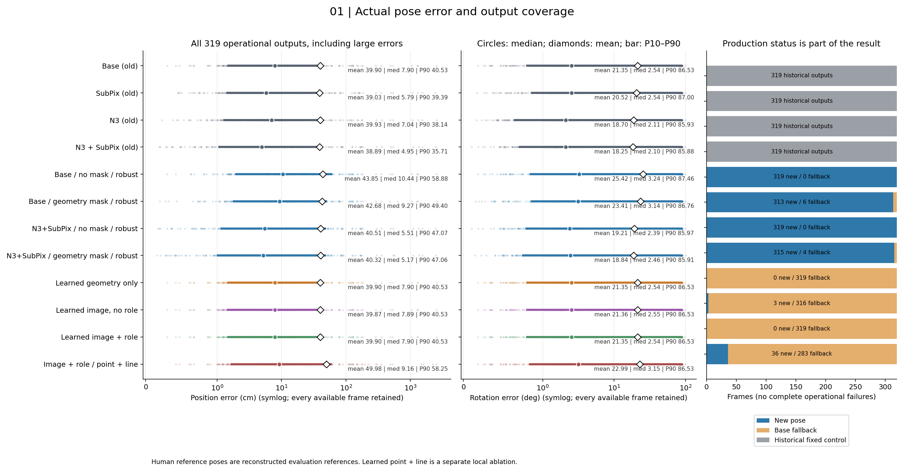
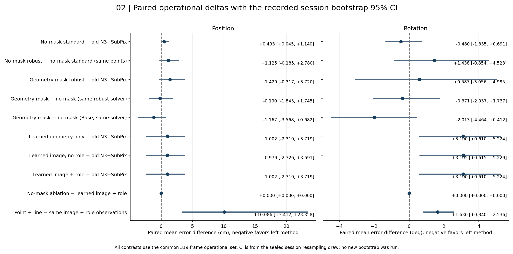
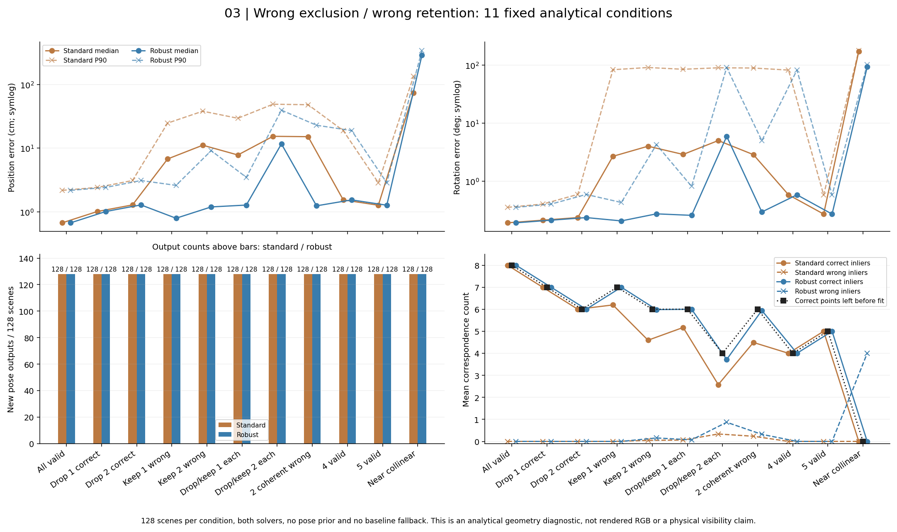
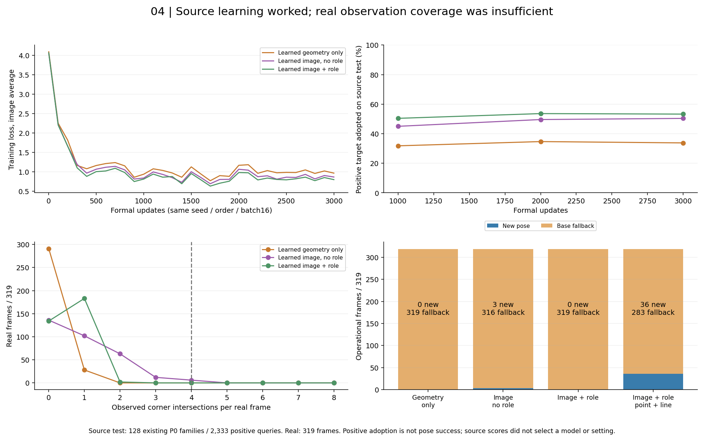
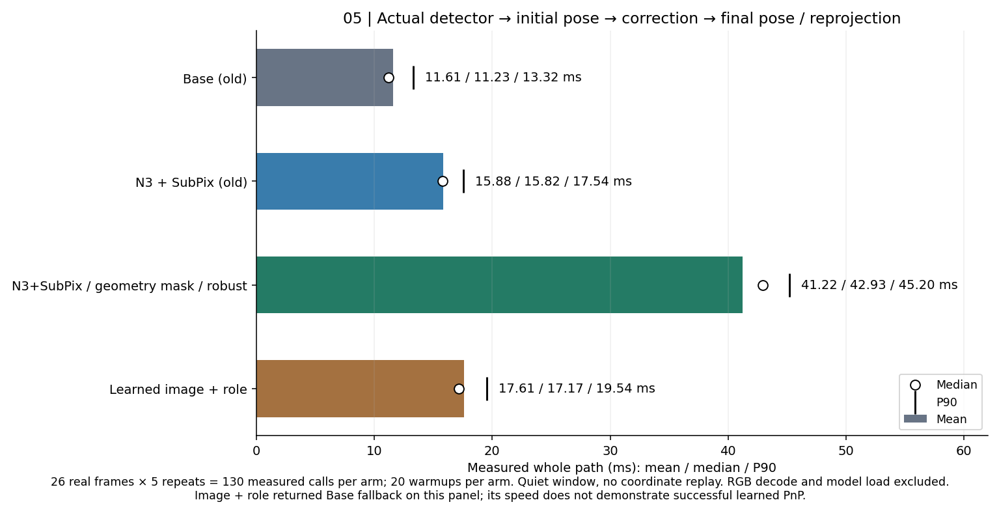
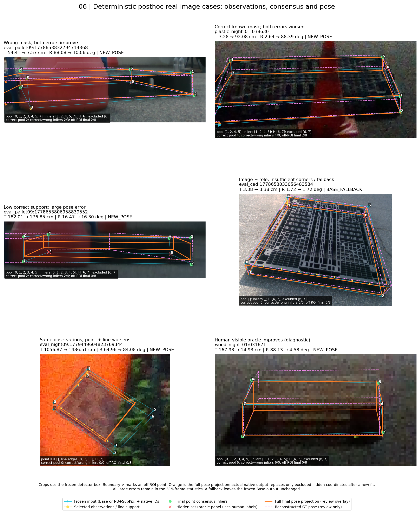
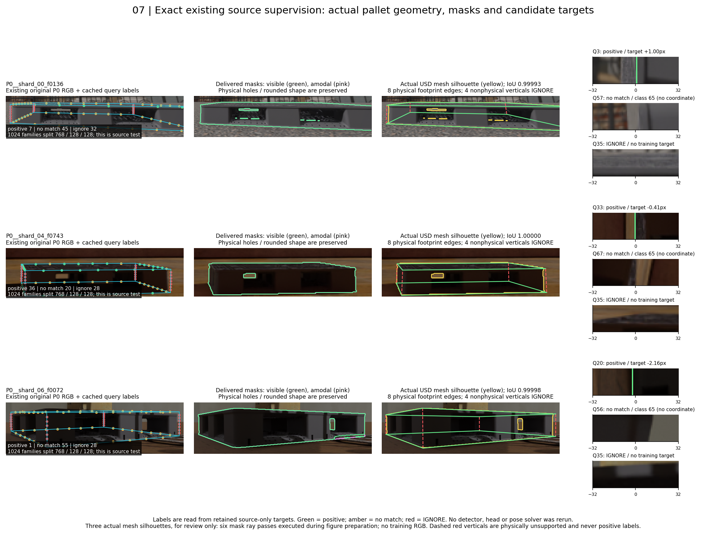

아니요. 전체 319장 기준의 평균 위치·회전을 기존 단순 대조보다 함께 개선했다는 근거를 확보하지 못했다.

검증 질문: **“가림 판단이 일부 틀려도 다른 유효 대응점으로 자세를 구하고 자기 가림 코너를 재투영했을 때, 기존 단순 대조보다 실제 위치·회전이 좋아졌는가?”**

가림 오판이 있는 개별 프레임에서도 유효 대응으로 새 자세를 구하고 숨은 초기 좌표를 재투영하는 구현은 작동했다. 수학적 스트레스에서 일부 이상치를 견뎠지만, 그 사실이 실사 전체 성능 개선으로 이어진 것은 아니다. 실사 참조는 기존 기하 재구성값이며 독립적으로 측정한 물리적 위치·회전 정답이 아니다.

## 전체 운용 결과

13세션·319개 ID를 모두 유지했다. 아래는 fallback을 실제 적용한 전체 운용 결과의 평균 ± 표본 표준편차다. T와 ADDsym 단위는 cm, R은 degree다. 표본분산은 n−1이며 SD는 원프레임 오차 산포다. seed 변동·표준오차·신뢰구간을 뜻하지 않는다. 모든 평균·분산·SD·중앙값·P90·최대값과 신규 자세 조건부 통계는 [METRICS.csv](METRICS.csv)에 있다.

| 방법 | T 평균±SD cm | R 평균±SD deg | ADDsym 평균±SD cm | 새 자세 / fallback / 완전실패 |
|---|---:|---:|---:|---:|
| BASE | 39.90 ± 190.66 | 21.35 ± 34.51 | 56.11 ± 192.48 | 고정 대조 / 0 / 0 |
| SUBPIX | 39.03 ± 192.24 | 20.52 ± 33.87 | 54.95 ± 194.07 | 고정 대조 / 0 / 0 |
| N3 | 39.93 ± 198.19 | 18.70 ± 32.76 | 54.04 ± 199.78 | 고정 대조 / 0 / 0 |
| N3_SUBPIX | 38.89 ± 194.92 | 18.25 ± 32.49 | 52.42 ± 196.56 | 고정 대조 / 0 / 0 |
| BASE_NO_MASK_STANDARD | 40.83 ± 190.64 | 21.74 ± 34.72 | 56.87 ± 192.50 | 319 / 0 / 0 |
| BASE_NO_MASK_ROBUST | 43.85 ± 190.40 | 25.42 ± 36.47 | 61.28 ± 192.12 | 319 / 0 / 0 |
| BASE_GEOM_NOSELF_STANDARD | 41.17 ± 192.09 | 21.53 ± 34.62 | 56.91 ± 193.90 | 318 / 1 / 0 |
| BASE_GEOM_NOSELF_ROBUST | 42.68 ± 191.89 | 23.41 ± 35.35 | 59.28 ± 193.62 | 313 / 6 / 0 |
| N3_SUBPIX_NO_MASK_STANDARD | 39.39 ± 194.90 | 17.77 ± 32.02 | 52.17 ± 196.53 | 319 / 0 / 0 |
| N3_SUBPIX_NO_MASK_ROBUST | 40.51 ± 194.76 | 19.21 ± 32.90 | 53.76 ± 196.33 | 319 / 0 / 0 |
| N3_SUBPIX_GEOM_NOSELF_STANDARD | 38.99 ± 197.01 | 18.03 ± 32.63 | 52.19 ± 198.73 | 318 / 1 / 0 |
| N3_SUBPIX_GEOM_NOSELF_ROBUST | 40.32 ± 198.06 | 18.84 ± 32.64 | 53.72 ± 199.66 | 315 / 4 / 0 |
| SHARED_BOUNDARY_GEOM_ROBUST | 43.21 ± 191.50 | 27.22 ± 39.84 | 61.56 ± 193.01 | 32 / 287 / 0 |
| GEOMETRY_ONLY | 39.90 ± 190.66 | 21.35 ± 34.51 | 56.11 ± 192.48 | 0 / 319 / 0 |
| IMAGE_NO_ROLE | 39.87 ± 190.66 | 21.36 ± 34.51 | 56.10 ± 192.49 | 3 / 316 / 0 |
| IMAGE_ROLE | 39.90 ± 190.66 | 21.35 ± 34.51 | 56.11 ± 192.48 | 0 / 319 / 0 |
| IMAGE_ROLE_NO_MASK_ROBUST | 39.90 ± 190.66 | 21.35 ± 34.51 | 56.11 ± 192.48 | 0 / 319 / 0 |
| IMAGE_ROLE_STANDARD | 39.90 ± 190.66 | 21.35 ± 34.51 | 56.11 ± 192.48 | 0 / 319 / 0 |
| IMAGE_ROLE_POINT_LINE | 49.98 ± 230.05 | 22.99 ± 34.39 | 66.40 ± 230.86 | 36 / 283 / 0 |
| BASE_ORACLE_NOSELF_ROBUST | 43.07 ± 191.21 | 23.10 ± 35.03 | 59.00 ± 192.84 | 311 / 8 / 0 |
| BASE_ORACLE_VISIBLE_ROBUST | 44.42 ± 190.71 | 20.96 ± 33.50 | 57.87 ± 192.34 | 273 / 46 / 0 |
| N3_SUBPIX_ORACLE_NOSELF_ROBUST | 39.92 ± 195.88 | 19.13 ± 33.10 | 53.43 ± 197.55 | 314 / 5 / 0 |
| N3_SUBPIX_ORACLE_VISIBLE_ROBUST | 41.22 ± 194.75 | 16.67 ± 30.16 | 51.95 ± 196.09 | 277 / 42 / 0 |

ORACLE 두 조건은 사람 상태와 고정 기준선의 평가 순열을 쓰는 `ORACLE_MASK_AND_PHASE` 진단이다. 배포 결과로 해석하지 않는다. `IMAGE_ROLE_POINT_LINE`은 같은 원시 IMAGE_ROLE 관측의 지역 비선형 정제다. 4점 독립 PnP와 같은 산출로 부르지 않는다.

## 공통집합과 개선의 원천

각 비교는 둘 다 자세가 있는 공통집합과 둘 다 새 자세를 계산한 공통집합을 별도로 보존했다. fallback을 포함하는 운영 비교와 신규 복원 조건부 평균을 섞지 않는다. 13세션의 기존 10,000 bootstrap draw를 실제 파일에서 재사용했다. 음수는 오차 감소이며 95% CI에 0이 있으면 방향이 불확실하다. 반복 개발 DEV319·단일 seed라는 한계는 유지된다.

- N3_SUBPIX_GEOM_NOSELF_ROBUST−N3_SUBPIX, 319/319 (operational): T cm Δ평균 1.43, 95% CI [-0.32, 3.72]; R deg Δ평균 0.59, 95% CI [-3.06, 4.98].
- BASE_NO_MASK_ROBUST−BASE_NO_MASK_STANDARD, 319/319 (operational): T cm Δ평균 3.02, 95% CI [0.79, 6.35]; R deg Δ평균 3.68, 95% CI [0.06, 9.18].
- N3_SUBPIX_NO_MASK_ROBUST−N3_SUBPIX_NO_MASK_STANDARD, 319/319 (operational): T cm Δ평균 1.13, 95% CI [-0.19, 2.78]; R deg Δ평균 1.44, 95% CI [-0.85, 4.52].
- N3_SUBPIX_GEOM_NOSELF_ROBUST−N3_SUBPIX_NO_MASK_ROBUST, 319/319 (operational): T cm Δ평균 -0.19, 95% CI [-1.84, 1.75]; R deg Δ평균 -0.37, 95% CI [-2.04, 1.74].
- IMAGE_ROLE−BASE, 319/319 (operational): T cm Δ평균 0.00, 95% CI [0.00, 0.00]; R deg Δ평균 0.00, 95% CI [0.00, 0.00].
- IMAGE_ROLE−N3_SUBPIX, 319/319 (operational): T cm Δ평균 1.00, 95% CI [-2.31, 3.72]; R deg Δ평균 3.10, 95% CI [0.61, 5.22].
- IMAGE_ROLE−GEOMETRY_ONLY, 319/319 (operational): T cm Δ평균 0.00, 95% CI [0.00, 0.00]; R deg Δ평균 0.00, 95% CI [0.00, 0.00].
- IMAGE_ROLE−IMAGE_NO_ROLE, 319/319 (operational): T cm Δ평균 0.02, 95% CI [0.00, 0.06]; R deg Δ평균 -0.01, 95% CI [-0.02, 0.00].
- IMAGE_ROLE_NO_MASK_ROBUST−IMAGE_ROLE, 319/319 (operational): T cm Δ평균 0.00, 95% CI [0.00, 0.00]; R deg Δ평균 0.00, 95% CI [0.00, 0.00].
- IMAGE_ROLE_STANDARD−IMAGE_ROLE, 319/319 (operational): T cm Δ평균 0.00, 95% CI [0.00, 0.00]; R deg Δ평균 0.00, 95% CI [0.00, 0.00].
- IMAGE_ROLE_POINT_LINE−IMAGE_ROLE, 319/319 (operational): T cm Δ평균 10.09, 95% CI [3.41, 23.36]; R deg Δ평균 1.64, 95% CI [0.84, 2.54].

신규 자세만의 공통집합:

- N3_SUBPIX_GEOM_NOSELF_ROBUST−N3_SUBPIX, 315/319 (new_pose_common): T cm Δ평균 1.45, 95% CI [-0.32, 3.79]; R deg Δ평균 0.59, 95% CI [-3.07, 5.12].
- IMAGE_ROLE−N3_SUBPIX, 0/319 (new_pose_common): T cm Δ평균 NA, 95% CI NA; R deg Δ평균 NA, 95% CI NA.
- IMAGE_ROLE_POINT_LINE−IMAGE_ROLE, 0/319 (new_pose_common): T cm Δ평균 NA, 95% CI NA; R deg Δ평균 NA, 95% CI NA.

강건 PnP만으로 충분한지는 NO_MASK_ROBUST 대 같은 새 STANDARD에서 직접 검사했다. 가림 마스크는 같은 강건 솔버의 masked/unmasked 대조에서 분리했다. 재투영은 최종 자세에서 숨은 좌표를 바꾸는 단계이며 그 자체로 R,t를 다시 개선하지 않는다. 최종 fit에 숨은 초기 좌표나 재투영 좌표를 넣지 않았다.

## 가림 오판과 남은 대응

마스크 오류 수와 자세 성능을 별도 사건으로 집계했다. ‘정확한 대응’은 추론 뒤 고정 기준선 순열에서 기존 참조까지 8 px 이하인 입력점이라는 진단 정의다. 사람 직접 가시와 좌표 정확성을 구별했고, 미주석·결측·미매칭 참조는 채워 넣지 않았다. 숨은 참조의 일부가 PnP에서 유래했으므로 그 정확성은 독립 물리 증거가 아니다.

| 예측 자기 가림+robust | 틀린 마스크에서 T/R 모두 개선 | 맞는 알려진 마스크에서 T/R 모두 악화 | 정확한 입력 오제외 수 | 참조상 부정확한 최종 inlier 수 |
|---|---:|---:|---:|---:|
| BASE_GEOM_NOSELF_ROBUST | 18 | 74 | 183 | 703 |
| N3_SUBPIX_GEOM_NOSELF_ROBUST | 21 | 77 | 185 | 620 |

전체 프레임의 남은 정확한 대응 개수·3D 배치·최종 정확/오답 inlier ID·조건수는 [REAL_CORRESPONDENCE_ROWS.jsonl.gz](REAL_CORRESPONDENCE_ROWS.jsonl.gz), 집계는 [REAL_CORRESPONDENCE_AUDIT.json](REAL_CORRESPONDENCE_AUDIT.json)에 있다. 한 점의 마스크 변화 때문에 성공을 취소하지 않았고, 새 자세와 hidden 집합 변화도 별도 기록했다.

대표 행은 사후 오류 유형 설명용이다. 아래 두 예는 참조상 정확한 pool이 4개 이상인 행 중 ID 순서의 첫 행을 보여준다. 전체 행과 저정확도 사례도 감사 파일에 유지했다:

- wrong_mask:both_improved: `eval_noapril:1775201415399297536`. pool 7, 참조상 정확한 pool 7, 최종 inlier 7 중 정확 7; T Δ -0.24 cm, R Δ -0.22 deg.
- correct_mask_on_known:both_worsened: `eval_noapril:1775201443822140928`. pool 6, 참조상 정확한 pool 6, 최종 inlier 6 중 정확 6; T Δ 0.21 cm, R Δ 0.02 deg.

실사 사람 마스크에 한 점을 오제외/오잔류시키는 두 조건도 각각 319장을 유지했다:

| 사람 마스크 오염 | 변형 가능 / 불가 | 새 자세 / fallback / 실패 | T 평균 cm | R 평균 deg |
|---|---:|---:|---:|---:|
| DROP_ONE_VISIBLE | 319 / 0 | 291 / 28 / 0 | 42.69 | 22.68 |
| KEEP_ONE_HIDDEN | 315 / 4 | 318 / 1 / 0 | 40.72 | 18.09 |

렌더링 없이 고정 seed 128×11×2=2,816개 기하 경로를 수행했다. σ=1 px, 오답 이동 24 px를 사전에 고정했다. 아래 숫자는 수학적 진단이며 실사 성능 증거가 아니다.

| 기하 조건 | 일반 T/R 평균 cm/deg | 강건 T/R 평균 cm/deg |
|---|---:|---:|
| VALID_ONLY | 1.04 / 0.38 | 1.04 / 0.38 |
| DROP_ONE_CORRECT | 1.24 / 0.42 | 1.24 / 0.42 |
| DROP_TWO_CORRECT | 1.87 / 1.81 | 1.87 / 1.81 |
| KEEP_ONE_WRONG | 10.66 / 12.78 | 1.21 / 0.41 |
| KEEP_TWO_WRONG | 16.87 / 21.62 | 4.71 / 5.75 |
| DROP_KEEP_ONE_EACH | 12.21 / 13.84 | 3.00 / 2.78 |
| DROP_KEEP_TWO_EACH | 21.93 / 27.38 | 18.23 / 25.24 |
| TWO_COHERENT_WRONG | 21.06 / 19.81 | 6.38 / 6.64 |
| FOUR_VALID | 5.45 / 13.06 | 5.45 / 13.06 |
| FIVE_VALID | 1.52 / 0.52 | 1.52 / 0.52 |
| NEAR_COLLINEAR | 76.35 / 173.93 | 286.36 / 94.06 |

오답 1개는 합의가 대체로 흡수했지만, 정확한 점 2개를 지우고 오답 2개를 남긴 조건은 크게 악화했다. 같은 대체 자세를 지지하는 두 오답도 검사했다. 공선에 가까운 오대응에서는 네 개의 틀린 점이 합의를 이루어 큰 T/R 오류를 반환했다. ‘수치 자세 산출’과 ‘정확한 자세 성공’을 구별해야 하는 이유다. 딱 4 inlier는 약한 합의로 표시했고 대안 해·점수 차이·기하조건을 저장했다.

## 직접 가시 손상과 숨은 재투영

| 방법 | 직접 가시 평균 전→후 px | 직접 가시 <5→>10 손상 | 자기 가림 평균 전→후 px |
|---|---:|---:|---:|
| BASE_GEOM_NOSELF_ROBUST | 28.29 → 28.25 | 0 | 45.01 → 47.09 |
| N3_SUBPIX_GEOM_NOSELF_ROBUST | 27.03 → 27.10 | 0 | 44.13 → 44.19 |
| IMAGE_ROLE | 28.29 → 28.29 | 0 | 45.01 → 45.01 |
| IMAGE_ROLE_POINT_LINE | 28.29 → 28.29 | 0 | 45.01 → 51.29 |

외부 가림·잘림·미주석도 [VISIBILITY_DAMAGE.json](VISIBILITY_DAMAGE.json)에 별도 유지했다. 숨은 좌표 오차 감소를 실제 T/R 개선이라고 부르지 않았다.

## 실제 감독과 소형 학습

G38/P0/TEX 총 60,000개 원천을 감사했다. 실제 scene.usd 삼각형과 RGB에 연결된 기존 visible/amodal 마스크로 정확한 감독을 만들 수 있는 P0 부분집합을 사용했다. 1,024개 기존 RGB·장면 family를 재사용했고 새 RGB·새 기본 장면은 0개다. 같은 family의 파생본을 함께 두는 분할은 train768/calibration128/source-test128이다. 실제 메쉬에 없는 수직 bounding 경계는 ignore였고 박스 hull을 팔레트 마스크로 쓰지 않았다.

기존 P0 원본에서 정확한 감독을 만들 수 있어 새 RGB를 생성하지 않는 우선순위를 적용했다. 따라서 원본/외부가림/방해물/저대비의 네 통제 변형은 이번 자료에 표현되지 않았으며 E6는 미실행이다. 일반 가림 source target 학습을 네 변형 절제 완료라고 보고하지 않는다.

동일 5,890-parameter 대응 선택기를 GEOMETRY_ONLY / IMAGE_NO_ROLE / IMAGE_ROLE 세 입력 조건으로 각각 3,000 update, batch16 학습했다. 같은 초기 텐서와 배치 순서·정규화·예산, seed1, 마지막 checkpoint를 유지했다. 정식 업데이트 9,000, 정식 RGB 노출 144,000; 버린 preflight 100 update는 별도 비용이다. 양성/미대응 gradient는 실제 비영이고 ignore gradient는 0이었다. 가림 분류 합격선으로 실사 후단 평가를 생략하지 않았다.

| 모델 | source-test 양성 채택률 | 채택 양성 후보 오차 px | no-match 오채택률 | 실사 새 point 자세 /319 |
|---|---:|---:|---:|---:|
| GEOMETRY_ONLY | 33.78% | 1.14 | 1.25% | 0 |
| IMAGE_NO_ROLE | 50.36% | 0.92 | 2.13% | 3 |
| IMAGE_ROLE | 53.28% | 0.88 | 0.97% | 0 |

실사 새 point 자세는 GEOMETRY_ONLY 0/319, IMAGE_NO_ROLE 3/319, IMAGE_ROLE 0/319였다. IMAGE_ROLE의 전체 평균은 319장의 기존 Base fallback이며 새 기하 복원 성공이 아니다. POINT_LINE은 36/319 신규 지역 정제였고 그 신규 조건부 평균은 T196.35 cm/R24.90 deg로 나빴다. source 양성 후보를 찾은 것과 실사에서 서로 다른 두 물리 경계로 충분한 코너를 확보한 것은 구별된다. 관측 no-match를 초기 좌표로 채워 수를 맞추지 않았다. 역할·영상의 추가 가치는 동일 IMAGE_ROLE/IMAGE_NO_ROLE/GEOMETRY_ONLY 자세 대조에서 판단하며 source 분류 점수만으로 필수 모듈을 선언하지 않는다.

## 전체 경로 비용과 검산

동일 26장·13세션에서 경로당 준비20회와 26×5회 본 측정을 실제 실행했다. RAM 원영상→고정 detector 1회→정제/관측→초기 자세→새 강건 자세→숨은 좌표 재투영을 포함했다. 캐시 재생이나 기존 시간의 합산이 아니다. 모델 로딩·파일 decode·GT 채점·패리티 검사는 측정 구간에서 제외했다. GPU 동기화·CPU 스레드·버전·온도·다른 작업의 부재를 원행에 저장했다.

| 경로 | 실제 전체 평균 ms | 중앙값 ms | P90 ms | 측정 횟수 |
|---|---:|---:|---:|---:|
| BASE | 11.61 | 11.23 | 13.32 | 130 |
| N3_SUBPIX | 15.88 | 15.82 | 17.54 | 130 |
| N3_SUBPIX_GEOM_NOSELF_ROBUST | 41.22 | 42.93 | 45.20 | 130 |
| IMAGE_ROLE | 17.61 | 17.17 | 19.54 | 130 |

전체 작업은 한국시간 2026-10-10 00:42:32 시작부터 01:23:40 보고 스냅샷까지 2,468초(41분8초)였다. 코드 구현·검산·조정을 포함하는 실제 경과시간이며 게시 시간은 이후다. source cache 준비144.98초, 정식 학습과 probe/preflight64.35초, 봉인 실사 관측 추론18.49초를 각각 기록했다. 완료 head forward9,268회, 학습/probe/preflight RGB노출148,288회이며 정식노출144,000회와 구별한다. 추가 미봉인 추론319회와 dtype 실패1회도 비용에서 제외하지 않았다. 실제 호출·재실행·실패 시도와 단계별 wall time은 [EXECUTION_LEDGER.json](EXECUTION_LEDGER.json)에 있다. 독립 감사와 학습은 일부 겹쳤으므로 단계 시간을 더해 전체 경과시간처럼 제시하지 않았다. 소스 캐시 준비, 학습, 실사 특징/관측 추론, 실제 전체 경로 측정을 각각 기록했다.

[VERIFICATION.json](VERIFICATION.json)은 39개 독립 검산을 통과했다. T/R/ADDsym은 기존 함수와 별도 구현이 일치했고 숨은 최종 좌표는 실제 최종 R,t의 투영과 일치했다. 원본319장·가중치·사용자 변경·마감 출력의 해시/상태를 보존했다. Python Path.open canary 누락, dtype, 출력명 충돌은 구현 수리로 기록했으며 실제 성능을 보고 설정을 조절하지 않았다. 이전 실패/검산 원행도 보존했다.

## 질문별 실행 상태

| ID | 상태 | 근거/한계 |
|---|---|---|
| E0 | 실행 | 좌표·K·단위·C2 대칭·물리 메쉬/경계 계약 감사와 round-trip |
| E1 | 기존 결과 재사용 | small/wide/shared 원행 재사용; 같은 창 실험 반복0 |
| E2 | 실행 | 예측 cuboid 자기 가림 대 사람 known 상태; 분류를 pose 성공 gate로 쓰지 않음 |
| E3 | 실행 | 12×319 무학습 arm,2,816기하,638실사 마스크 오판 |
| E4 | 실행 | 숨은 초기 관측 제외→새 R,t 재투영; T/R와 좌표 개선 분리 |
| E5 | 실행 | source true intersection/ignore/no-match 및 source 후보 오차 |
| E6 | 미실행 | 기존 유효 감독 재사용/새 RGB0 우선; 네 통제 변형 미보유 |
| E7 | 실행 | 동일 모델 세 입력 조건×3,000 update 및 실사 자세 절제 |
| E8 | 실행 | 동일 IMAGE_ROLE 원시 관측 point/point+line; 중복 edge factor 제거 |
| E9 | 실행 | 319장 신규/공통/전체 운용·손상·실제 전체 경로 시간 |

## 유지·제거 판단과 게시

현재 고정 N3→SubPix 단순 대조를 유지한다. 유한 부분집합 PnP와 재투영 구현은 오류 진단 도구로 보존한다. 이번 실사 평균에서 강건화·예측 가림·학습 역할을 필수 성능 기여로 주장할 근거는 확보하지 못했다. point+line 결과는 표에 그대로 보존하고 정확도·산출률·비용을 함께 평가한다. source-to-real 관측 충분성은 남은 공백이며 같은 합성을 더 늘리거나 설정을 바꾸어 재시도하지 않았다.

원 실험의 코드·원행·검산·실행량은 전용 브랜치 `research/observation-refiner-robust-pnp-20261009`에 정상 게시했다. 최초 게시 commit과 원격 확인은 `PUBLICATION.json`에 보존했다. 상세 설명·파생 그림·공개 검산 도구의 이번 개정은 `REVIEW_MANIFEST.json`으로 구별하며, 개정 후 최종 원격 SHA를 다시 확인한다. main 병합·force push·원고 변경은 수행하지 않는다.

## 연구자가 검토할 수 있는 실행 방법과 그림

아래 그림은 저장된 원행을 읽어 만든 검토 자료다. 결과를 본 뒤 threshold·mask·checkpoint·pose를 바꾸지 않았다. 그래프의 모든 프레임 분모와 자세 상태는 본문의 표와 원행에 유지된다. 그림의 frame/source 선택·원본 binding·표시 좌표·파생 PNG 해시는 [VISUAL_REVIEW_CASES.json](VISUAL_REVIEW_CASES.json)에 있다. 원본 RGB 파일을 Git에 추가하지 않고 기존 영상의 주석 montage만 게시했다.

실제 후단은 `고정 RGB 키포인트 → 관측 후보 선택/경계 교점 → 예측 자기 가림 제외 → 유한 4점 부분집합 PnP → 최종 H 재투영`이다. masked/unmasked와 일반/강건 대조는 같은 native 좌표·K·치수 후보를 사용한다. 첫 robust 실행에서 생성한 가설은 마스크 사이에 재사용하지만, 각 arm은 허용 generator와 같은 자기 U에서 scoring한다. 최종 R,t가 없는 경우에는 고정 초기 자세 fallback을 별도 상태로 반환한다.

자세 산출률·평가 분모·axis·실제 source target·5,890 parameter head·28개 channel·loss·AdamW·동일 초기값/배치·원행 key와 frame drilldown은 [REVIEW_GUIDE_KO.md](REVIEW_GUIDE_KO.md)에 자세히 설명했다. 공개 원행만 검산하려면 저장소 루트에서 아래 명령을 실행한다. Python 3.9 이상 표준 라이브러리만 필요하고 모델 추론·private source·GPU가 필요하지 않다.

```bash
python3 scripts/research/pallet_observation_refiner_20261009_v1/review_verify.py
python3 scripts/research/pallet_observation_refiner_20261009_v1/review_verify.py \
  --frame-id eval_noapril:1775201415399297536
```

`--frame-id`는 설명을 추가하면서 전체319 검사도 유지한다. `--root`는 repo 또는 결과 디렉터리, `--output`은 별도 검산 JSON, `--require-manifest`는 게시 manifest 필수 검사 옵션이다. 공개 검산은 저장된 metric·투영·관측 decode·time의 일관성을 검사한다. 원본 RGB에서 detector/N3/head를 다시 실행하거나 물리 정답 자체를 인증하는 전체 재현과는 범위가 다르다. 전체 원본 의존 재현은 [REPRODUCE.md](REPRODUCE.md)에 있다.

### 그림 1 — 전체 자세 결과와 실제 새 산출



출처: [METRICS.json](METRICS.json), [METRICS.csv](METRICS.csv)의 전체 운용 통계와 `new_pose_estimated/fallback_used/no_pose`. T/ADDsym은 cm, R은 degree다. 큰 오차도 전체 원행에 남아 있다. 학습 모델0/3/0 새 산출과319/316/319 fallback을 구별해야 한다. IMAGE_ROLE의 BASE와 같은 평균은 새 자세 개선의 증거가 아니다. 원프레임 SD는 CI가 아니다.

### 그림 2 — 같은 프레임의 짝차이



출처: [PAIRED_COMPARISONS.json](PAIRED_COMPARISONS.json). 부호는 새 방법−대조이며 음수가 오차 감소다. 본문/그림에 표시된 비교 scope와 공통 분모를 함께 읽는다. CI는13세션의 기존10,000 bootstrap draw이고 SD나 추가 seed 변동이 아니다. 단일 seed·반복 개발 DEV319·다중비교 보정 없음의 한계가 있다. 양쪽 방법의 새 산출 공통집합이0인 비교에서 신규 개선량을 주장하지 않았다.

### 그림 3 — 가림 마스크 오판과 기하 실패



출처: [GEOMETRY_STRESS_SUMMARY.json](GEOMETRY_STRESS_SUMMARY.json), [GEOMETRY_STRESS.jsonl.gz](GEOMETRY_STRESS.jsonl.gz), [REAL_MASK_STRESS_SUMMARY.json](REAL_MASK_STRESS_SUMMARY.json). analytic128×11×2 경로는 렌더0인 수학적 진단이다. 실사 사람 마스크의 한 점 오제외/오잔류638행과 구별한다. 정확한 점 수·배치·오답의 일관성이 합의의 한계를 만든다. 공선에 가까운 false consensus의 큰 T/R도 삭제하지 않았다. 수치 pose 반환은 정확한 pose 성공과 다르다.

### 그림 4 — source에서의 대응 점수와 real 관측 부족



출처: [TRAIN_LOGS.jsonl](TRAIN_LOGS.jsonl)의 고정 source-test probe, [CORRESPONDENCE_COUNTS.json](CORRESPONDENCE_COUNTS.json), [METRICS.json](METRICS.json). source에서 채택된 양성 후보의 오차는 조건부 오차다. source 양성 채택률과 실사4개 이상 교점 수를 같은 성공률이라고 부르지 않는다. 실사 raw4교점 이상은0/6/0, 최종 새 point 자세는0/3/0이었다. 가림 분류 점수로 후단 평가를 생략하지 않았고 no-match를 초기 좌표로 채우지 않았다.

### 그림 5 — 실제 전체 경로 시간



출처: [RUNTIME_ROWS.jsonl.gz](RUNTIME_ROWS.jsonl.gz), [RUNTIME.json](RUNTIME.json). 각4경로의 warmup20회 및 본 측정130회가 실제 실행되어 총600행이다. 본 측정에는 고정 detector, 초기 자세, 정제/관측, 실제 새 PnP 시도와 hidden 재투영 경로를 포함했다. 캐시 재생 시간이나 과거 평균의 합산이 아니다. 모델 로딩·영상 decode·GT 채점·parity 검사는 측정 밖이다. ROLE17.61ms는 측정 패널에서도 point 자세 fallback인 경로의 시간이며, 빠른 새 기하 복원을 달성한 결과가 아니다.

### 그림 6 — 실사에서 한 행씩 확인하는 사례



출처: 기존 실사 RGB와 봉인된 [PREDICTIONS.jsonl.gz](PREDICTIONS.jsonl.gz)/[LEARNED_PREDICTIONS.jsonl.gz](LEARNED_PREDICTIONS.jsonl.gz), 사후 [REAL_CORRESPONDENCE_ROWS.jsonl.gz](REAL_CORRESPONDENCE_ROWS.jsonl.gz). panel ID·method·선택 기준과 legend는 [VISUAL_REVIEW_CASES.json](VISUAL_REVIEW_CASES.json)에 기록한다. 저장된 초기점·최종 input/inlier·excluded hidden과 최종 투영을 구분한다. reference overlay는 GT 봉인 뒤 그린 평가용 표시이고 solver의 관측이었다는 뜻이 아니다.

그림의 여섯 사례는 유형별 위치오차/위치차이 극값과 frame ID tie-break로 정한 사후 설명용 선택이다. 고정 detector ROI를 crop하고 ROI 밖 투영은 clip/marker로 표시한다. 아래 본문의 ID-첫행 예시와 그림의 극값 사례 선택은 별개이며 대표성이나 평균 개선을 보장하지 않는다.

주황8코너 wireframe은 최종 자세 투영이며 출력 `native_points` 전체가 아니다. H의 초기 좌표만 투영으로 교체하고 nonhidden 관측을 투영으로 덮어쓰지 않았다. cyan 입력은 Base 또는 N3→SubPix, yellow는 관측/line support, green은 point consensus, magenta 점선은 review-only 재구성 reference다. 지역 point+line에는 point consensus를 주장하지 않았다.

| panel·유형 | method | 사후 선택 기준 |
|---|---|---|
| 1, wrong mask·T/R 개선 | `N3_SUBPIX_GEOM_NOSELF_ROBUST` | T 감소 최대; ID tie-break |
| 2, correct mask·T/R 악화 | `N3_SUBPIX_GEOM_NOSELF_ROBUST` | T 증가 최대; ID tie-break |
| 3, 저정확 pool·큰 오차 | `N3_SUBPIX_GEOM_NOSELF_ROBUST` | accurate pool≤2, wrong inlier≥2, T≥100cm 중 T 최대 |
| 4, ROLE fallback | `IMAGE_ROLE` | 선이 있으나 코너0인 fallback 중 ID 첫 행 |
| 5, ROLE point+line 악화 | `IMAGE_ROLE_POINT_LINE` | T/R 모두 악화한 새 지역 정제 중 T 증가 최대 |
| 6, 가시 oracle 개선 | `N3_SUBPIX_ORACLE_VISIBLE_ROBUST` | T/R 모두 개선 중 T 감소 최대 |

| panel | ID | pool 총/참조8px 정확 | 합의 총/참조8px 정확 | T cm 전→후 | R deg 전→후 |
|---|---|---:|---:|---:|---:|
| 1, wrong mask·개선 | `eval_pallet09:1778653832794714368` | 7/2 | 5/2 | 54.41→7.57 | 88.08→10.06 |
| 2, correct mask·악화 | `plastic_night_01:038630` | 4/4 | 4/4 | 3.28→92.08 | 2.64→88.39 |
| 3, 저정확 pool·큰 오차 | `eval_pallet09:1778653806958839552` | 6/2 | 6/2 | 182.01→176.85 | 16.47→16.30 |
| 4, ROLE fallback | `eval_cad:1778653033056483584` | 0/0 | 0/0 | 3.38→3.38 | 1.72→1.72 |
| 5, ROLE point+line 악화 | `eval_night09:1779449604823769344` | 0/0 | 해당 없음 | 1056.87→1486.51 | 64.96→84.08 |
| 6, 가시 oracle 개선 | `wood_night_01:031671` | 6/6 | 6/6 | 167.93→14.93 | 88.13→4.58 |

panel1–3은 N3_SUBPIX_GEOM_NOSELF_ROBUST, panel6은 N3_SUBPIX_ORACLE_VISIBLE_ROBUST다. panel2처럼 참조상 정확한4점과 맞는 mask여도 나쁜 자세가 나올 수 있다. panel4는 query14개/선2개가 있지만 코너0이고, panel5는 line rank6의 지역 정제를 point 합의로 표시하지 않았다.

wrong mask이지만 T/R 모두 개선된 `eval_noapril:1775201415399297536`과 알려진 mask는 맞지만 T/R 모두 악화된 `eval_noapril:1775201443822140928`의 원행도 직접 조회할 수 있다. 이 두 예는 정확한 pool4개 이상인 해당 유형에서 ID 순서 첫 행이라는 사후 설명용 선택이다. 사례를 잘 보여주는 그림은 전체319 성능의 증거가 아니며, 그림의 정확한 대응 수는 기존 참조8px 정의이지 독립 물리 측정이 아니다.

### 그림 7 — source의 실제 마스크와 감독 의미



출처: 이미 존재하던 P0 RGB·delivered visible/amodal mask, 실제 scene.usd 삼각형과 공개 source audit/학습 규약. source ID·split·mask binding·target 의미를 manifest와 [REVIEW_GUIDE_KO.md](REVIEW_GUIDE_KO.md)에서 확인한다. 팔레트의 실제 형상 마스크와 projected virtual cuboid edge를 구별한다. 물리적으로 없는 수직 bounding edge는 ignore이며 box/hull을 실제 마스크로 사용하지 않았다. source의 형상·depth·마스크 감독을 설명하는 그림이 실사에서 같은 edge를 유효하게 관측했다는 증거는 아니다.

source-test P0 세 원본의 retained target bin을 사용하며, 표시 수리 전후3개 distinct source 프레임에서 수행한 auxiliary CPU ray pass6회는 검토 그림 작성량으로 따로 기록한다. 원 실험의 학습·감독 준비를 다시 실행한 것이 아니고 새 RGB도 생성하지 않았다. 60,000개 inventory 확인과 P0 128+G38 32/TEX32 정밀 패널 감사의 범위를 구별한다. 실제 edge 순서의 물리 ID는0/2/4/6/8/9/10/11, unsupported vertical ID는1/3/5/7이다.

| panel | source-test ID·선택 기준 | positive / no-match / ignore | 실제 메쉬/기존 amodal IoU |
|---|---|---:|---:|
| 1 | `P0__shard_00_f0136`, ID 순서 첫 eligible | 7 / 45 / 32 | 0.999927 |
| 2 | `P0__shard_04_f0743`, positive query 최다 | 36 / 20 / 28 | 1.000000 |
| 3 | `P0__shard_06_f0072`, no-match query 최다 | 1 / 55 / 28 | 0.999981 |

stripe patch는 기존 RGB를 표시용 sampling한 것이고 `lo/hi/weight/valid` target은 retained source cache에서 가져왔다. source-test 사례 선택으로 학습 모델을 재선택하지 않았다.

### 검토 범위와 남은 공백

추가 [REVIEW_LOSS_MASK_CHECK.json](REVIEW_LOSS_MASK_CHECK.json)은 실제 첫 정식 배치16장의 positive249/no-match635/ignore460 target에 대해 per-logit ignore gradient0을 확인한 CPU loss-only 검산이다. 원 학습의 all-invalid mask 검사보다 실제 ignore 분리를 직접 확인한다. 추가 detector/head forward나 update는0이며 원9000 업데이트와 구별한다. 실행 명령과 세부 loss 정의는 [REVIEW_GUIDE_KO.md](REVIEW_GUIDE_KO.md)에 있다.

고정 대조1,276행 중586행에는 과거 actual_pose R/t가 저장되지 않았다. 원래 metric과 좌표는 보존했고 저장 metric 재집계는 가능하지만, 누락한 과거 R/t를 새로 복원해 독립 검산한 것처럼 표시하지 않았다. source 특징 준비 내부 OpenCV primitive 호출 수와 point+line finite-difference까지 포함한 전체 residual 호출 수는 NA다. 네 통제 변형은 유효 기존 source 재사용·새 RGB0 우선에 따라 미실행 E6로 남았다. [CHECKS.json](CHECKS.json)의 item12는 기존 family 분리 PASS와 네 변형 NOT_EXECUTED를 별도 표시한다.

[PUBLICATION_PRECHECK.json](PUBLICATION_PRECHECK.json)/[PUBLICATION.json](PUBLICATION.json)은 원 실험의 이전 게시 스냅샷이다. 이번 문서·그림·공개 검산 확장은 [REVIEW_MANIFEST.json](REVIEW_MANIFEST.json)의 현 bundle binding으로 검토한다. 수치 원행은 변경하지 않았고 이번 추가 작업은 설명·이미지·검토 도구 작성이다.

공개 파일만 복사한 별도 폴더에서 원본 영상·가중치·private cache·GPU·PALLET 환경변수 없이 검사를 실제 실행했다. 정상 파일은 통과했고 평균값 변경, 예측 행 누락, 숨은 재투영 좌표 변경, 그림 파일 변경은 해당 검사에서 실패로 검출됐다. 명령의 expected/actual exit와 실패 key는 [REVIEW_VALIDATION_TESTS.json](REVIEW_VALIDATION_TESTS.json)에 있다. 원 실험86파일의 해시 보존과 이번 추가 실행량(loss-only CPU2회·기존3장면 mesh mask ray6회·detector/head/PnP/update0)은 [REVIEW_BUILD.json](REVIEW_BUILD.json)에 별도로 기록했다.
