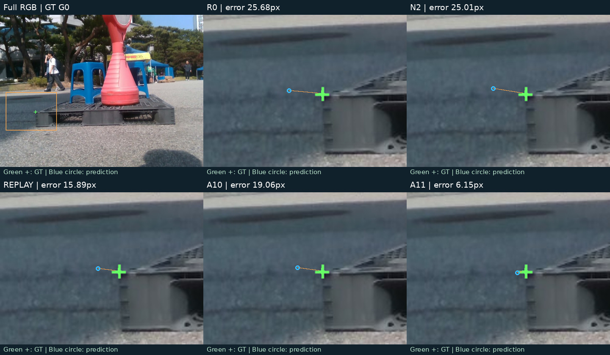
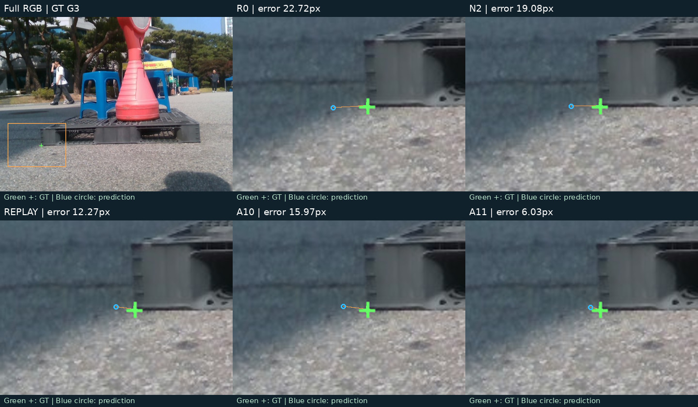
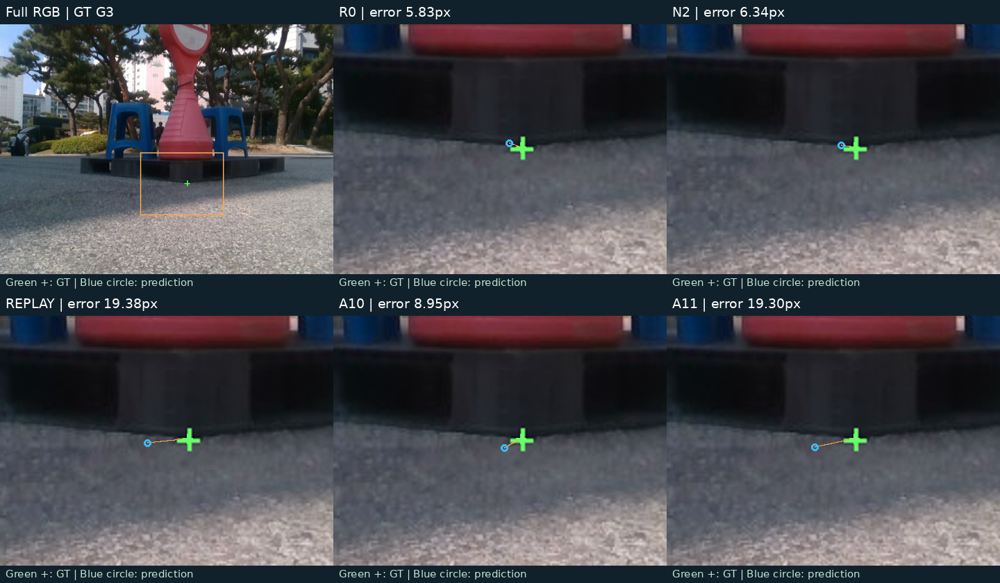
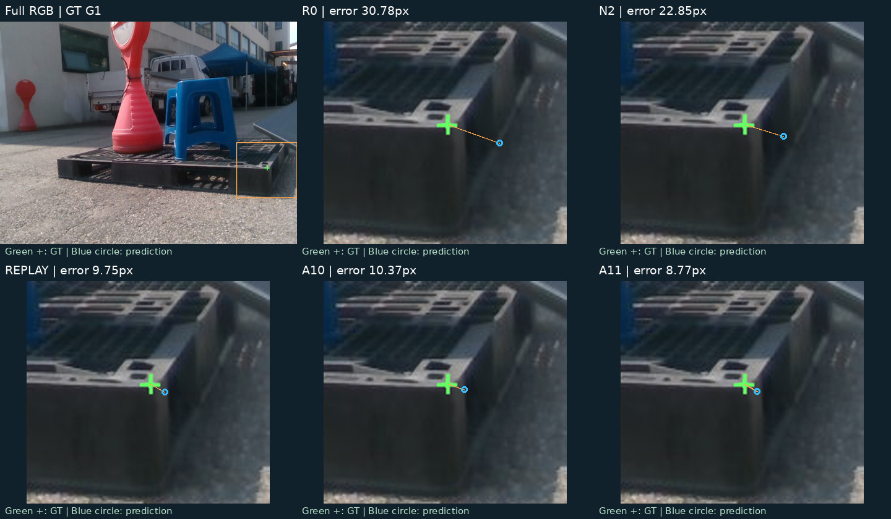
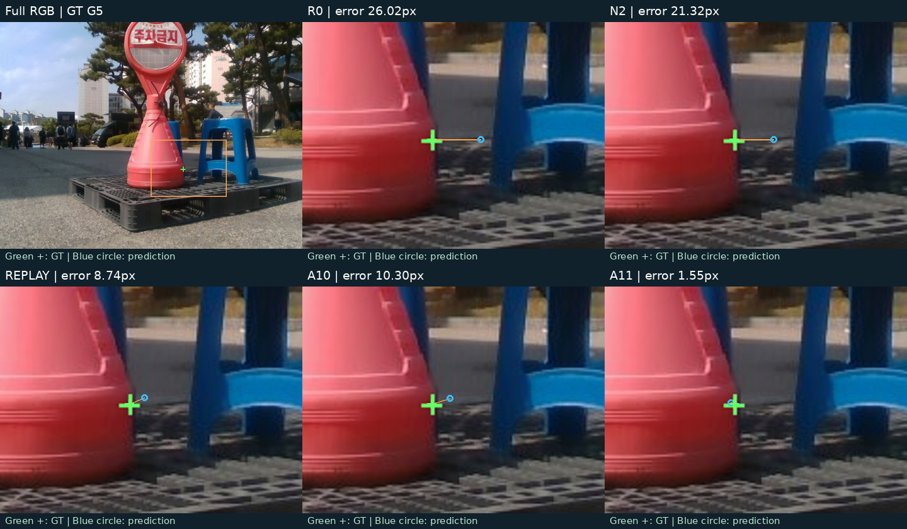
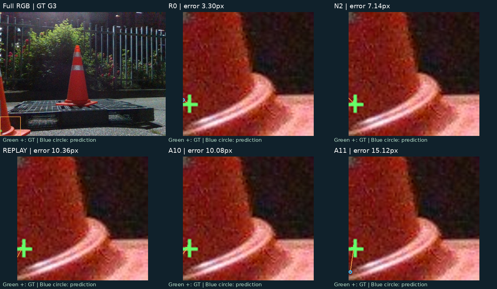
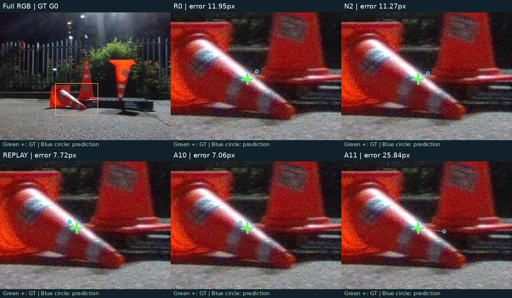
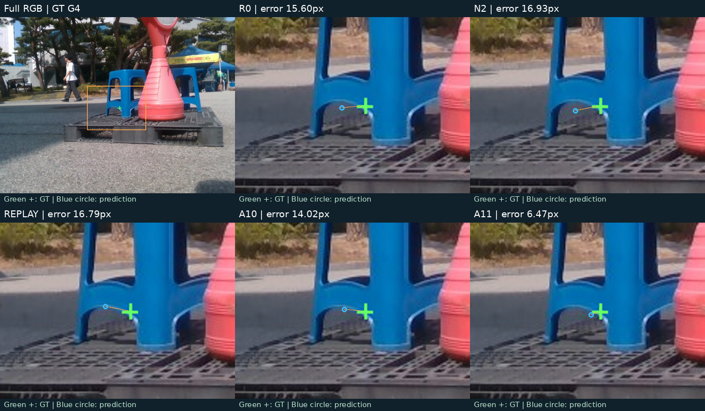

# Post-E2 원인분해 최종 보고

[확인] 기존 결과를 재채점/분해한 진단이다. **NOT_SUPPORTED_IN_THIS_RUN**, 기존 판정 PARTIAL 보존. 새 학습 없음.

## 1. 왜 A11이 A10보다 6코너 낮았나?

| [확인] A10 \ A11 | 10px 이내 | 10px 초과 |
|---|---|---|
| 10px 이내 | 331 | 25 |
| 10px 초과 | 19 | 338 |

[확인] 25개 손실 − 19개 획득 = 6개 순손실. A10 356/713 → A11 350/713. 20px 전이는 획득/손실 각각 14/14로 순변화가 없다. [D1](D1_SUMMARY.md).

## 2. 어느 초기 오류에서 복구했나?

[확인] 10px 정답 획득 B0/B1/B2/B3/B4 = 2/4/6/7/0개. R0>20px hard recovery는 9개이며 {'B3': 9}에 속한다. >40px 복구는 확인하지 못했다. [D2](D2_ERROR_BANDS.md).

## 3. 실제 외부 가림 코너가 복구됐나?

[확인] **확정 불가**. hard recovery 9개 중 manual generic occluded는 1개지만 external/self subtype은 검증되지 않았다. 사람 검토 가시성 기록은 169코너에 있고, 나머지는 auto/unknown과 분리했다. `EXTERNAL_OCCLUSION_CORNER_RECOVERY_UNVERIFIED`. [D3](D3_VISIBILITY_STATS.md).

## 4. 정상/중간 코너 손상은 어디에서 생겼나?

[확인] A10-only 손실 25개는 모두 R0 5–20px: B1 16, B2 9. R0<5 → A11>10 손상 1개는 `eval_night08:1779449501478488320/G3`이며 전이 상태 ['BAD->BAD']. 초기 정상점 손상과 A10 대비 손실은 다른 집계다.

## 5. 후보들은 보완적인가?

[확인] A11이 A10보다 낮은 프레임 평균오차 41장, 반대 44장, 동률 8장. A11 단독 best 24장으로 아주 소수의 hard 사례에서만 best인 것은 아니다. 모든 후보가 실패하는 코너는 308/713이다.

## 6. frame oracle headroom은?

[확인] frame oracle PCK10 52.03%, N2/A10/A11 대비 +2.945302/+2.103787/+2.945302pp. 점별 비배포 upper bound는 56.80%. [D4](D4_ORACLE_HEADROOM.md).

## 7. selector를 만들 가치가 있나?

[추정] 우선순위는 낮다. 지정된 frame oracle 기준 2.945302pp<3이다. 후보 차이의 크기는 관측되지만 방향을 고르는 신호는 검증하지 못했다. near-threshold인 점과 단일 DEV의 한계는 남는다. [D5](D5_FAILURE_CLUSTERS.md).

## 8. geometry/visibility 분리가 더 직접적인가?

[추정] 구조적으로 가능한 가설이지만 현재 subtype GT와 primary geometry headroom이 없어 다음 1순위로 확정할 근거가 부족하다. 현재 geometry proxy를 실제 외부 가림 복구 증거로 격상하지 않는다.

## 9. 데이터 다양성 문제는 남았나?

[확인] 253장은 한 촬영분의 인접 이미지다. 합성 stress에서 A10/A11이 초기보다 좋아졌지만 실제 가림 direct contrast는 음수다. [추정] 데이터/도메인 차이는 남은 후보 원인이지, 이 분석으로 확정된 단일 원인이 아니다.

## 10. 다음 한 가지 primary 실험

[추정] **ROUTE C: 다중 세션 clean 8/32/128 × CLEAN/OCC, 동일 총 노출의 보정기 통제 실험.** 보조 route 없음. [계획만 작성](NEXT_STAGE_PLAN.md).

## 보정 전후 비교 이미지

[확인] GitHub 본문에서 직접 볼 수 있는 비교 그림이다. 각 그림은 **위: 원본 RGB / R0 / N2, 아래: Replay / A10 / A11** 순서다. 초록 십자는 GT, 파란 원은 해당 코너 예측, 주황 선은 GT와 예측 사이 오차다. 같은 그림의 다섯 비교 패널은 동일 영역을 확대했다.

[확인] 개선/악화는 해당 전이 그룹에서 A11−A10 변화가 큰 순서로 각 2코너, 큰 오류 복구는 R0 오차가 큰 순서로 2코너, 정상점 손상은 전부 1코너, 랜덤은 기존 seed 1 목록의 앞 2코너다. 그룹 간 중복과 동일 프레임의 다른 코너가 포함되며, 성능 집계를 대체하지 않는다. 새 추론·학습 없이 저장 좌표만 시각화했다.

### A11이 새로 맞힌 사례

[확인] `eval_pallet07:1778652127361815808` / **G0** — R0 25.68px → A10 19.06px → A11 6.15px. 외부/자기 가림 subtype은 미확인이다.

[확인] `eval_pallet07:1778652127361815808` / **G3** — R0 22.72px → A10 15.97px → A11 6.03px. 외부/자기 가림 subtype은 미확인이다.

### A10은 맞았지만 A11이 놓친 사례

[확인] `eval_night09:1779449580573721600` / **G0** — R0 11.95px → A10 7.06px → A11 25.84px. 외부/자기 가림 subtype은 미확인이다.

[확인] `eval_pallet09:1778653664407620608` / **G3** — R0 5.83px → A10 8.95px → A11 19.30px. 외부/자기 가림 subtype은 미확인이다.

### R0의 큰 오류를 복구한 사례

[확인] `eval_pallet07:1778652152626116352` / **G1** — R0 30.78px → A10 10.37px → A11 8.77px. 외부/자기 가림 subtype은 미확인이다.

[확인] `eval_pallet07:1778652140531310080` / **G5** — R0 26.02px → A10 10.30px → A11 1.55px. 외부/자기 가림 subtype은 미확인이다.

### 원래 정상점이 손상된 사례

[확인] `eval_night08:1779449501478488320` / **G3** — R0 3.30px → A10 10.08px → A11 15.12px. 외부/자기 가림 subtype은 미확인이다.

### 기존 고정 랜덤 대조 사례

[확인] `eval_night09:1779449580573721600` / **G0** — R0 11.95px → A10 7.06px → A11 25.84px. 외부/자기 가림 subtype은 미확인이다.

[확인] `eval_pallet07:1778652128369383168` / **G4** — R0 15.60px → A10 14.02px → A11 6.47px. 외부/자기 가림 subtype은 미확인이다.

## 검토 자료 및 무결성

[확인] [코너 검토 갤러리](D3_REVIEW_GALLERY.html): 65코너/48프레임. GT·R0·N2·Replay·A10·A11, full RGB와 bbox crop. 새 annotation 입력 없음.

[확인] [입력 감사](PRECHECK.md), [역사적 gate 재해석](DECISION_REINTERPRETATION.md), [분석 당시 검증](AUDIT.json). 원본 E2 및 checkpoint는 불변이며 새 학습은 없다. 분석 당시에는 commit/push하지 않았고, 이후 사용자 승인으로 게시했다. 이번 변경은 본문 이미지 추가이며 분석 수치는 그대로다. 과거 AUDIT의 보고서 해시는 이미지 추가 전 버전을 가리킨다. [이미지 게시 변경 기록](INLINE_PUBLICATION.json).
