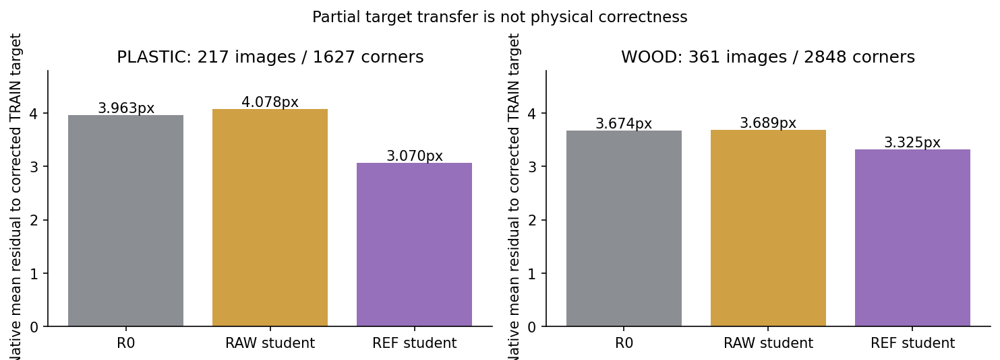
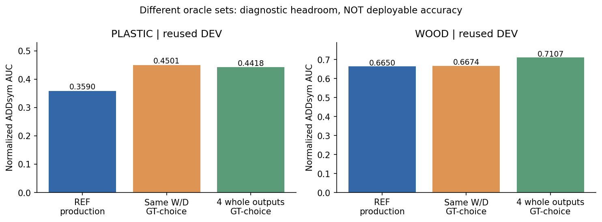
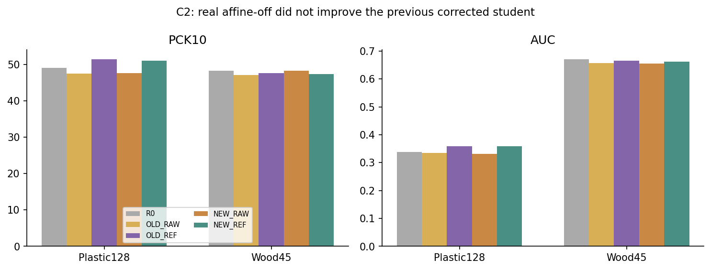
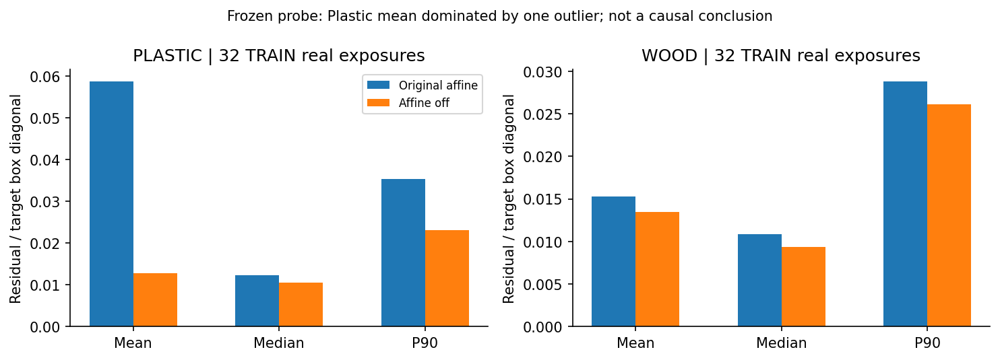
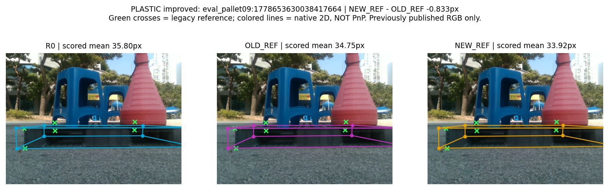
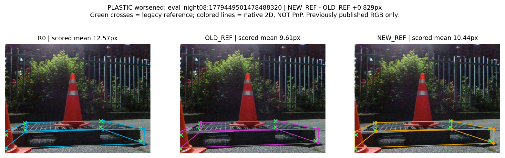
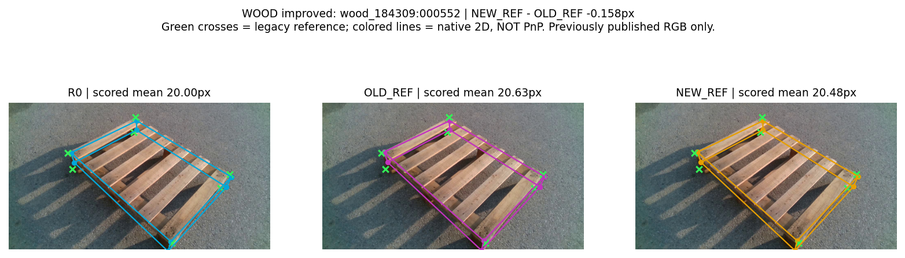
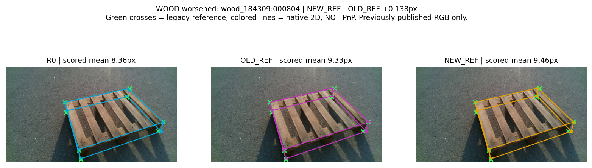
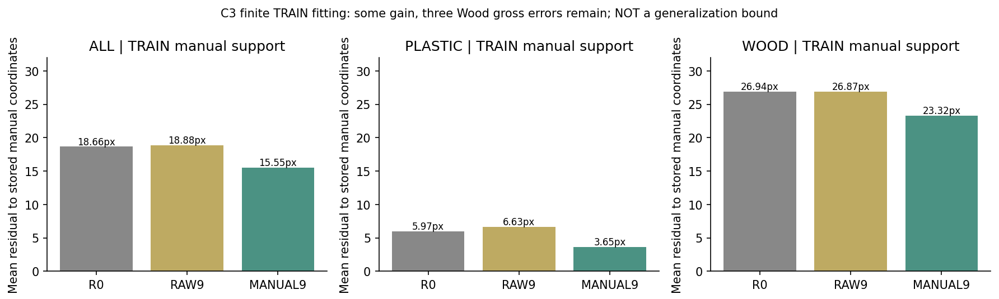
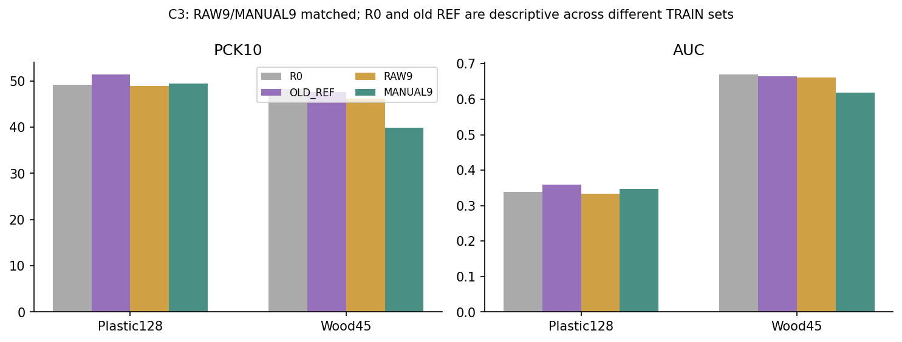

# 보정 자기학습 후속 원인 진단과 제한된 대조

## 1. 무엇이 문제였고 무엇을 아직 모르는가

[확인] 기존 Plastic에서는 보정 자기학습이 RAW와 R0를 모두 넘지만 Wood에서는 RAW보다 조금 좋고 R0에는 못 미쳤다. 이번 세 사이클에서도 기존 REF를 대체할 개선은 확인하지 못했다. 확인한 것은 **정보가 전혀 전달되지 않는 문제가 아니라, 일부 타깃 전달과 평가 전이·자세 선택의 문제가 함께 남아 있다는 것**이다. 이를 단일한 원인으로 확정하지 않는다.

| 재료 / 모집단 | R0 PCK10 / AUC | RAW PCK10 / AUC | REF PCK10 / AUC | REF−RAW | REF−R0 |
| --- | --- | --- | --- | --- | --- |
| Plastic 128장 / 985점 | 484/985 / .337965 | 468/985 / .334723 | 507/985 / .359016 | +39점, +3.9594pp / +.024293 | +23점, +2.3350pp / +.021051 |
| Wood 45장 / 346점 | 167/346 / .670500 | 163/346 / .656433 | 165/346 / .665033 | +2점, +.5780pp / +.008600 | −2점, −.5780pp / −.005467 |

같은 frozen Replay 교사(기존 수동 9장·38코너), 실사 Plastic217장/Wood361장, real512+source512 슬롯/epoch, pose/flow-only, AdamW 1e-5, 320 update 기준이다. 검출부·backbone·모든 buffer를 고정했다. teacher의 Wood 노출이 있어 unseen-material 실험이 아니다. 두 모집단은 모두 반복 DEV이고, 6D 참조는 독립 계측 pose가 아니다. Wood의 direct-visible 출처가 검증된 평가점은 0개다. 이는 Wood 좌표가 모두 틀렸다는 뜻이 아니다.

기존 native TRAIN에서 학생→보정 타깃 평균 잔차는 Plastic RAW4.078→REF3.070px, Wood3.689→3.325px다. 보정 방향과 학생 변화가 같은 방향인 비율은82.64%/77.18%, 타깃 이동 방향으로 전달된 분율 중앙값은0.319/0.129다. **보정 타깃을 일부 따라갔다**는 관찰이지, 물리적으로 맞는 점을 배웠다는 판정은 아니다. 고유 이미지 균등 집계와 occurrence 가중 집계는 [TRAIN_TARGET_TRANSFER.json](TRAIN_TARGET_TRANSFER.json)에 분리했다.

## 2. 이전 실패에서 재사용한 범위

실제 실행/조건 변경/미실행을 구분한 30개 기록은 [PRIOR_ATTEMPTS.md](PRIOR_ATTEMPTS.md)에 있다. 같은 낮은 학습률로320→640 update 연장한 실험은 재실행하지 않았다. 검수66점의 RAW/REF가43/43→44/44였고 전체 손익도 혼합이므로, 단순 연장으로 보정 우위가 생긴다는 근거가 없었다. 이것이 모든 최적화의 불가능성을 뜻하지는 않는다.

과거 source-off는 real 노출이2배가 되었고, 과거 agreement/stability 필터는 일관되게 틀린 점을 해결하지 못했다. 여러 교사의 median/medoid 융합과 oracle, 학생 증류 미실행을 구분했다. H_MANUAL·S1·GEO 계열은 감독 예산과 모델이 달라 이번 주표에 합치지 않았다. 이번 C2의 **실사 translate/scale만 제거하고 source/HSV/RNG를 보존하는 짝지은 대조**는 같은 계약의 기존 실행이 없었다.

## 3. 현재 oracle 수치와 한계

| 범위 | Plastic REF 기준 | Wood REF 기준 | 실제로 추가한 정보 |
| --- | --- | --- | --- |
| 같은 W/D pose 후보 | AUC .359016→.450094, gap .091078 | .665033→.667400, gap .002367 | GT pose로 후보 선택 |
| R0/교사/RAW/REF 중 전체 pose 선택 | .359016→.441824 | .665033→.710689 | GT pose로 모델 선택 |
| 같은4출력 중 전체 좌표 선택, PCK10 | 507→589/985 | 165→210/346 | 참조로 frame별 선택 |
| 같은4출력의 같은 의미 코너별 선택 | 507→613/985 | 165→228/346 | 참조로 점별 선택 |
| 정답 방향8px 이동의 원판 낙관치 | 507→700/985 | 165→252/346 | 정답 방향; 구조·영상 단서 무시 |

서로 다른 후보·정보의 gap은 더하지 않는다. per-point 혼합을 강체6D oracle로 보고하지 않았다. Plastic 검수66점에서는 교사50, RAW43, REF43, 전체출력/점별 oracle53점이다. 교사만10px 이내10점, 학생만3점, 둘 다40점, 둘 다 아님13점이다. **그 평가점을 학생에게 가르쳤다는 의미가 아니다.**

Plastic REF의 W/D 선택에는 여지가 있지만, Wood REF의 완벽한 W/D 선택(.667400)도 R0 production(.670500)에 못 미친다. 따라서 Wood의 R0 미달을 현재 W/D 선택 하나로 설명할 수 없다. 그렇다고 Wood 전체 출력에 정보가 없다는 뜻도 아니다.

검출 미매칭 Plastic8장의 저장 후보만 검사하면 REF best-keypoint 선택은507→510점으로 제한적이다. 검출이 정상인 Wood45장은 이 진단을 반복하지 않았다. 실제 legacy 참조 xy를 D9에 넣은 AUC1.0은 같은 기하 경로의 순환적 일관성이다. 합성64 exact projection의 production AUC는.905797이고, C1 6개의180도 역할 모호성이 남았다. renderer의 정확한 대응까지 제공한 검사는 최대 재투영오차8.13e-6px로 수치 구현을 확인했으나, 실사 지각 정확도를 보장하지 않는다. 합성에서 역할 convention이 다른 axis 점수는 NA로 남겼다.

분모·실패 처리·전체 oracle 표·재현 경로는 [ORACLE_REPORT_KO.md](ORACLE_REPORT_KO.md)에 있다. GT crop과 추가 검수점 치환은 필수 원인 판정에 필요하지 않아 수행하지 않았다.

## 4. 선행연구에서 가져온 원리와 제외한 것

19개 원문/공식 자료의 열람 범위와 접근 한계는 [RELATED_WORK_AND_TRANSFER.md](RELATED_WORK_AND_TRANSFER.md), [SOURCE_REGISTRY.json](SOURCE_REGISTRY.json)에 기록했다. 초록/README만 확인한 자료를 본문 구현을 재현했다고 쓰지 않았다.

- 강건 회귀의 단순 기준선으로 같은 후보 점수의 RMSE 항만 Huber12로 바꿨다. EPro-PnP 전체를 구현한 것이 아니다.
- PoseFix의 합성 오류와 실사 오류 분포 차이를 현재 교사 계약에 대조했다. 이름이 같다는 이유로 새 refiner를 만들지 않았다.
- Soft Teacher와 Unbiased Teacher v2의 핵심은 검출 confidence와 위치 감독 신뢰성이 다르다는 점이다. 보정 전 confidence 보존을 새 좌표의 정확도 측정으로 취급하지 않았다. 기존 안정성 실패와 TRAIN calibration 공백 때문에 새 필터를 만들지 않았다.
- PCGrad는 source/real gradient 간섭을 검사할 동기다. 실제 부호가 batch·조건에 따라 혼합이고 소수 batch이므로 gradient surgery를 자동 채택하지 않았다.
- 강한 증강이 전이에 도움이 될 수 있다는 FixMatch 등의 반론을 인정하면서, 현재 실사 기하 증강만 제거한 통제 실험으로 검사했다.
- Self6D++에는 RGB-only 경로가 있지만 CAD/mask/rendering 전제가 남는다. ONDA-Pose·Pseudo Flow·MegaPose의 렌더링 경로, CRISP의 RGB-D/shape 조건을 현재 RGB+기존 K/치수 계약과 혼동하지 않고 보류했다.

이는 논문 전체 기법의 실패 판정이 아니라 이번 입력·예산에서 옮길 수 있는 원리의 선택이다.

## 5. 수행한 대조와 공정성

| 사이클 | 바꾼 축 | 정보·대조 | 판정 |
| --- | --- | --- | --- |
| C1 Huber D9 | 같은 후보 점수의 RMSE9만 Huber12 | R0/교사/RAW/REF의 frozen 후보·penalty·pose 동일, 학습0 | 선택 변화0, AUC 차이0 |
| C2 REAL_AFFINE_OFF | 실사 translate/scale만OFF | Plastic RAW/REF와 Wood RAW/REF 각각320 update, 총4 fits | 기존 REF 주목표 개선 없음 |
| C3 MANUAL38_CAPABILITY | 동일 기존38점 support에서 raw좌표 vs 직접 클릭좌표 | 기존9장 수동정보의 직접 학생 학습 가능성; 별도 명세 | TRAIN32→35/38점, Wood DEV 악화; 기존REF 미달 |

C2의 실제320 batch 모두에서 RAW/REF의 RGB·box·support·노출·순서가 같고 좌표값만 달랐다. 4개 checkpoint 모두 정확한 R0 초기화, 보호 tensor747개 exact, 실제320 update를 확인했다. 마지막 checkpoint만 사용하고 DEV raw/pose 예측을 먼저 저장·잠근 뒤 참조를 읽었다. 기존 main과 teacher를 바꾸지 않았다. 실사 geometric transform 제거로 transformed-out-of-view support도 달라질 수 있어 단순 loss 변경으로 해석하지 않는다.

C3는 이미 교사에 사용한 Plastic3장/15점+Wood6장/23점만 사용했다. 학생은 두 재료가 섞인 같은9장에 학습하므로 main의 재료별217/361장 학생과는 다른 모집단이다. RAW9도 수동으로 확인된 support 위치를 공유하며 좌표값만 raw다. center·PnP 보완점은 true-ignore다. 신규 annotation은0이다. 두 arm 모두 real affine OFF/HSV와 source 증강 유지로 먼저 고정했다. 실제 원래 affine576노출에서는9개에서 raw/manual mask가 달랐으나, 고정한 OFF에서는576개 모두38점 support가 유지됐다. 실제320개 학습 batch도 RGB/box/mask/order가 일치했고, real/source 각각2,560회 노출, real 감독점10,880회로 동일했다. 이는 인위적인 마스크 불일치를 피한 별도 capability 계약이지 C2의 negative 결과를 구제하기 위한 조건 변경이 아니다.

## 6. 실제 이득·손상과 비용

| 재료 | 기존 RAW | 기존 REF | C2 NEW_RAW | C2 NEW_REF | NEW_REF−기존REF |
| --- | --- | --- | --- | --- | --- |
| Plastic PCK10 | 468/985 | 507/985 | 469/985 | 503/985 | −4점 / −.4061pp |
| Plastic AUC | .334723 | .359016 | .331742 | .358734 | −.000281 |
| Wood PCK10 | 163/346 | 165/346 | 167/346 | 164/346 | −1점 / −.2890pp |
| Wood AUC | .656433 | .665033 | .655056 | .662567 | −.002467 |

C2 Plastic NEW_REF는 NEW_RAW보다34점/AUC .026992, R0보다19점/.020770 좋지만 **기존 REF를 넘지는 못했다.** Wood NEW_REF−NEW_RAW는 PCK10 −3점/AUC +.007511이고, R0 대비 −3점/−.007933이다. 보정의 추가 가치와 새 recipe의 가치를 분리했다. 검수66의 REF43→44 한 점을 전체128장 성공으로 바꾸지 않았다.

PCK5/20·median/P90·pose R/yaw/t/axis·source32·난도/recording/LORO·손상은 [C2 상세 보고서](cycles/C2_REAL_AFFINE_OFF/REPORT_KO.md)에 모두 있다. Plastic PCK20은7점 늘었으나 PCK5는5점 감소했다. 정답10px 진입/이탈은 Plastic10/14, Wood2/3이었다. Wood Severe는 없으므로 NA다. 점들을 독립66/985개 표본으로 검정하지 않았다.

사전 TRAIN 증강 진단의 큰 Plastic 평균 차이는 **한 영상에서 최고 confidence 검출이 다른 instance를 선택한 현상**에 지배됐다. 기존 affine에서 선택 box와 TRAIN pseudo box의 IoU0(다른 후보 최대.8753), OFF에서.9695였다. 평균 잔차만 보고 광범위한 좌표 전달 실패로 해석할 수 없다는 중요한 반대 증거다. 타깃 기준 best box를 실제 배포 선택에 쓰지 않았다.

아래 사례는 **이미 공개된 RGB만** 대상으로 기존REF→NEW_REF 평균 오차 변화가 가장 개선/악화된 것을 같은 규칙으로 골랐다. 전체 데이터의 대표성이나 성공률 추정용이 아니다. R0를 왼쪽에 보존했고, 선은 native2D 예측이지 PnP 투영이 아니다. 녹색 십자는 legacy 참조다.

C1 fixed-set gap 회수율은0%다. C2는 출력과 후보를 바꾼 학습이라 이전 fixed-set gap의 회수율을 적용하지 않는다. C2는 학습4회/1,280 update, 계측 GPU305.201초(학습296.156+DEV추론7.957+TRAIN진단1.088)였다. 프로젝트 전체 누계는 [RESOURCE_LEDGER.json](RESOURCE_LEDGER.json)에 따로 남겼다. C2 결과 확인 전 잠근 재현 조건이 충족되지 않아 seed43 추가4fit은 실행하지 않았다.

### C3: 직접 찍은 점도 일부만 따라갔고, Wood 전이는 악화됐다

| 지표 | R0 | RAW9 | MANUAL9 |
| --- | --- | --- | --- |
| TRAIN38 수동점 평균 / 중앙값px | 18.661 / 5.380 | 18.880 / 4.974 | 15.555 / 2.810 |
| TRAIN38 PCK10 / >20px | 32/38 / 3점 | 32/38 / 3점 | 35/38 / 3점 |
| Plastic DEV PCK10 / AUC | 484/985 / .337965 | 482/985 / .334086 | 487/985 / .346543 |
| Wood DEV PCK10 / AUC | 167/346 / .670500 | 160/346 / .661300 | 138/346 / .618033 |

직접 수동 감독은 RAW9 대비 TRAIN 중앙값과 PCK10을 개선했다. 하지만 큰 오류3점은 모두 Wood에 남았고, Wood TRAIN P90은124.903→104.252px로 여전히 크다. 따라서 '정확한 타깃은 완벽히 배웠고 전이만 문제'라고 할 수 없다. 반대로15개 Plastic TRAIN점이 모두10px 안에 들어온 결과를 무시하고 '학습 능력이 전혀 없다'고 할 수도 없다. 이는 한 LR·320update·pose/flow 고정 범위에서의 부분 적합 결과다.

MANUAL9−RAW9의 DEV 변화는 Plastic+5/985점(+.5076pp), AUC+.012457이고 Wood−22/346점(−6.3584pp), AUC−.043267이다. 기존 REF와 비교하면 Plastic−20/985점/AUC−.012473, Wood−27/346점/AUC−.047000이다. 좋은 좌표를 직접 넣는 이9장 recipe도 현재 main을 대체하지 못했다. `camera_dynamic_0123_v4 / UNCONFIRMED_SIGNED_AXIS / MANUAL_REVIEW_REQUIRED` 메타데이터는 그대로여서, 저장된 index에 맞춘 학습이지 물리 signed-axis 정답이나 전체실사 GT 학습 upper bound가 아니다.

C3 Plastic 검수66점도 RAW9의44/66→MANUAL9의41/66으로 낮아졌다. 전체 legacy Plastic의+5점과 함께 공개하며 하나로 대체하지 않는다. C3는 2fits/640update, 학습137.865초+고정추론8.353초 GPU였다. 처음 sandbox 시도는 모델/optimizer 생성 전 CUDA 접근 검사에서 종료했고 학습0/step0으로 기록했다. host GPU에서는 두 fit 모두320 update를 완료했다. source32·검수66·난도/recording 및 전체 pose 손익은 [C3 상세](cycles/C3_MANUAL38_CAPABILITY/REPORT_KO.md), [전체 수치표](FINAL_TABLES.md), 각 RESULTS.json에 보존했다. 총 신규 학습은6fits/1,920update, 계측 GPU483.055초(약8.05분)이며 추가 학습을 실행하지 않는다.

## 7. 해결·부분 확인·미해결

[확인] 기존 numeric parity·후보 정의·감독 마스크·동결 상태를 검증했고, oracle 정보가 실제 추론/학습으로 넘어가지 않도록 경로를 분리했다. C1의 단순 강건 점수와 C2의 실사 affine 제거는 현재 main을 개선하지 못했다. 실패한 실행과 보조 지표의 이득도 함께 남겼다.

[부분 확인] 학생은 corrected target의 일부를 모방한다. 후보 집합에 상보적 정보가 남는다. Wood REF에서 W/D 선택만 완벽하게 해도 R0를 넘지 못한다. 이 세 관찰은 단일한 '보정기 불가능' 또는 '학습량 부족' 결론보다 범위가 좁다.

[미확정] 실사217/361의 물리적인 타깃 정확도, 새로운 recording으로의 전이, oracle를 GT 없이 고를 실제 단서, 동결 표현·최적화·감독 품질의 개별 인과 기여는 여전히 분리되지 않았다. Wood trusted-visible와 독립 물리6D 참조의 공백도 그대로다.

최종 판정은 `EVIDENCE_VALIDITY=LIMITED`(짝지은 연산은 유효하지만 DEV/참조 범위 제한), `HEADROOM=MEASURED`(현재 후보에 한함), `RECOVERY=NOT_DEMONSTRATED`(기존REF를 넘는 배포 개선 없음), `CAUSE=MULTIPLE_EXPLANATIONS`다. C3의 TRAIN 개선과 재료별 혼합 효과는 따로 남겼다. 이 결론은 모든 머신러닝 방법이 불가능하다는 판정이 아니다.

새 namespace의34개 단위·산출물 테스트와 기존 pair/true-ignore18개 테스트가 통과했다. [AUDIT.json](AUDIT.json)은 baseline·원고31개 hash, 후보/분모/수치, C2 전체 배치·보호 state, 좌표 oracle 재집계, 공개 배열·그림 출처·예산을 검사한다. [C3 별도 사후 감사](AUDIT_C3_INDEPENDENT.md)는 실제 두 checkpoint의747개 보호 state,320 paired trace,364개 검출 비교 및 실제 평가 재계산까지 확인했다. 별도 검토자의 재계산이지 새로운 독립 TEST가 아니다. 물리 참조의 한계를 연산 감사 PASS로 해소했다고 쓰지 않는다.

## 8. 다음 결정

세 사이클을 완료했으므로 추가 sweep·teacher 교체·새 레이블·새 architecture로 자동 확대하지 않고 종료한다. 최종 실행 판정과 하나의 후속 질문은 [NEXT_DECISION.md](NEXT_DECISION.md), 기존 논문에 대한 **수정 제안만** [CLAIM_IMPACT.md](CLAIM_IMPACT.md)에 남겼다. 이번 진단으로 기존 논문 main을 best-run으로 교체하지 않는다. 공개 이미지·표·재현 경로는 같은 폴더에 있고 원본 RGB/좌표/가중치는 비공개 결과에 보존한다.
