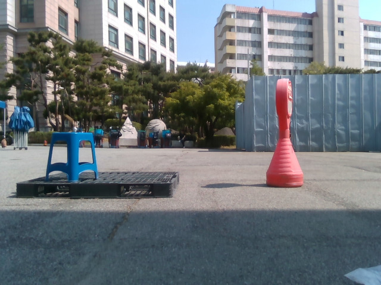

# 목적별 oracle 재검산 결과와 이미지 보고

이번 보고는 새 학습 결과가 아니라 **저장된 7개 모델 예측의 재분석**이다. 새 학습은 0회이며, LoRA는 계획만 작성했다. 사람 가시성 검토는 아직 대기 중이다.

## 핵심 결과

| 방법 | PCK10 정답/713 | PCK10 | PCK20 정답/713 | PCK20 |
|---|---:|---:|---:|---:|
| N2 | 350 | 49.09% | 485 | 68.02% |
| A10 | 356 | 49.93% | 481 | 67.46% |
| A11 | 350 | 49.09% | 481 | 67.46% |
| 평균오차 최소 frame oracle | 371 | 52.03% | 499 | 69.99% |
| PCK10 최대 frame oracle | 389 | **54.56%** | 495 | 69.42% |
| PCK20 최대 frame oracle | 368 | 51.61% | 506 | **70.97%** |
| 점별 최소 오류 oracle, 보조 상한 | 405 | 56.80% | 509 | 71.39% |

기존 평균오차 oracle 371/713을 재현했다. PCK10 목적에 맞게 고르면 389/713으로 **18코너 더 맞힌다**. N2 대비 +39코너, **+5.47%p**, A10 대비 +33코너, **+4.63%p**다. A10/A11만 고르는 경우는 370/713, 51.89%다.

즉, 평균오차 최소화와 PCK10 최대화는 다른 문제다. 이전 평균오차 oracle만으로 선택기의 여지가 작다고 확정하면 안 된다. 다만 이 결과는 **GT를 보고 고르는 사후 상한**이다. 배포 가능한 선택기가 54.56%를 달성했다는 뜻은 아니다. 점별 oracle 또한 실행 가능한 3D pose의 성능 보장이 아니다.

93프레임·713코너를 동일하게 사용했다. 매칭 실패 8장·54코너도 분모에 유지하며, median/P90은 매칭 659코너 기준이다. 세션별 획득·손실 및 선택 빈도는 [상세 감사](ORACLE_OBJECTIVE_AUDIT.md)에 있다.

## 기존 예측으로 확인하는 복구와 손상

아래는 이미 공개된 E2 후속 분석 이미지를 그대로 연결한 것이다. 이번에 새로 학습하거나 좌표를 수정한 이미지가 아니다. **대표 사례이므로 전체 개선율을 나타내지 않는다.** GT는 평가·사후 분석용이며 아래 숫자는 해당 코너의 2D 오차다. 실제 외부 가림인지 자기 가림인지는 아직 미확정이다.

### A11이 A10의 오류를 복구한 사례

G0: R0 **25.68px → A10 19.06px → A11 6.15px**. 한 모델이 모든 사례에서 최선인 것은 아니라는 사례다.

### 반대로 A10이 맞힌 점을 A11이 손상한 사례

G0: R0 **11.95px → A10 7.06px → A11 25.84px**. 복구만 보고 적응 성공으로 결론낼 수 없는 이유다.

### R0의 20–40px 오류를 복구한 사례

G5: R0 **26.02px → A10 10.30px → A11 1.55px**. 개선 자체는 존재하지만, 가시성 독립 검토 전에는 외부 가림 복원이라고 단정하지 않는다.

### 원래 잘 맞던 점도 손상될 수 있다

G3: R0 **3.30px → A10 10.08px → A11 15.12px**. 이 사례는 A10 단계에서도 이미 손상되어 있었으며 A11만의 신규 손상으로 세지 않는다.

## 새로 준비한 블라인드 이미지 검토

기존 선정 그대로 **65코너 / 48이미지**다. [검토 HTML](BLINDED_REVIEW.html)과 연결 원본 RGB 48개를 함께 보관한다. 아래는 익명 원본 RGB 예시이며 GT·예측 오버레이가 없다.

모든 응답은 `UNREVIEWED`, 상태는 `REVIEW_PENDING`이다. 공개 보고서에는 위 예측 비교가 있으므로 **독립 검토자에게 이 보고서나 저장소 전체를 보내지 말고 HTML과 blinded_assets만 전달해야 한다**. 기존 비교를 본 검토자는 prior prediction exposure를 YES로 기록해야 한다. private mapping은 별도 파일이고 검토 HTML에서 읽지 않는다.

## LoRA 계획의 의미와 남은 조건

[계획서](LORA_PRESERVATION_PLAN.md)는 실제 PRIOR1 CNN을 CPU에서 확인하고, 후기 1×1 Conv2d 6개에 제한적 저랭크 적응을 적용하는 후보를 정리했다. Transformer의 q_proj/v_proj를 가정하지 않는다. 같은 base에서 full-refiner 적응, LoRA, 출력 보존 손실 유무, head-only를 비교하는 설계다.

원래 weight를 고정하는 것과 **adapter를 켰을 때 정상점 정확도를 유지하는 것**은 다르다. 그래서 정상점 손상 감소와 오류 복구를 함께 검증하도록 계획했다. 아직 wrapper·LoRA 학습·효과 검증은 하지 않았다. 학습률·rank·손실 가중치·독립 확인 조건과 사람 검토가 미확정이다. 이번 결과로 다음 방법의 성공을 확정하지 않는다.

## 공개 이력

이전 로컬 `STATUS.json`의 `commit=false`, `push=false`는 진단 종료 당시 기록으로 보존한다. 이후 사용자가 결과·이미지 push를 명시적으로 요청하여 이번에 공개용 문서 4개와 익명 RGB 48장을 공개한다. 비공개 매핑·원본 경로를 담은 감사 메타데이터와 응답 관리 자료는 로컬에만 남겼다. 공개 문서의 로컬 전용 JSON 링크는 설명문으로 바꾸었으며 원본 실험 결과·checkpoint·annotation은 수정하지 않았다. 관련 없는 미추적 작업은 포함하지 않는다.
