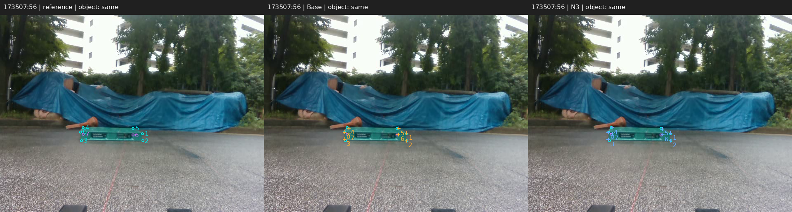
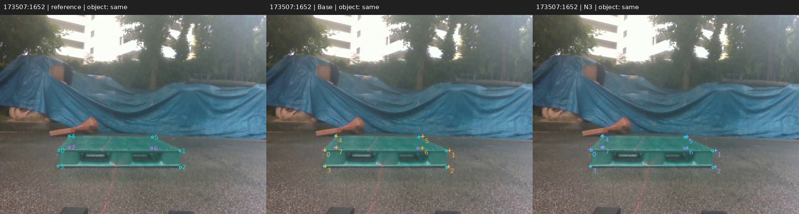
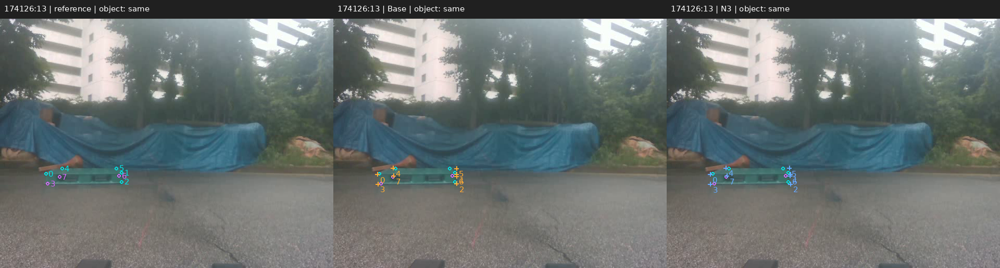

# 리프터 고정 12장 전체 비교

기존 G 저장 참조 8점×12장을 모두 표시합니다. 왼쪽 참조(청록=직접 입력, 보라=PnP 보완), 가운데 Base, 오른쪽 N3입니다. 원은 참조, 십자는 예측입니다. 성능으로 사진을 골라내지 않았습니다.

[전체 결과와 제한](README_KO.md) · [96점별 오차](evidence/lifter/ASSISTED_POINT_ERRORS.csv) · [12장별 JSON](evidence/lifter/ASSISTED_FRAME_RESULTS.json)

## 173507:56

이 프레임의 코너 중앙값: **3.577 → 2.538px**, 변화 -1.039px.

## 173507:1652

이 프레임의 코너 중앙값: **3.365 → 3.916px**, 변화 0.551px.

## 173507:3655

이 프레임의 코너 중앙값: **8.357 → 8.222px**, 변화 -0.136px.

## 174126:13

이 프레임의 코너 중앙값: **4.562 → 5.752px**, 변화 1.190px.

## 174126:419

이 프레임의 코너 중앙값: **5.137 → 5.301px**, 변화 0.164px.

## 174126:744

이 프레임의 코너 중앙값: **3.685 → 4.484px**, 변화 0.799px.

## 174342:41

이 프레임의 코너 중앙값: **3.214 → 3.352px**, 변화 0.138px.

## 174342:1190

이 프레임의 코너 중앙값: **4.705 → 4.229px**, 변화 -0.476px.

## 174342:2447

이 프레임의 코너 중앙값: **5.503 → 3.836px**, 변화 -1.666px.

## 174925:32

이 프레임의 코너 중앙값: **3.242 → 3.850px**, 변화 0.608px.

## 174925:1002

이 프레임의 코너 중앙값: **3.685 → 3.447px**, 변화 -0.238px.

## 174925:1892

이 프레임의 코너 중앙값: **6.088 → 6.511px**, 변화 0.422px.

