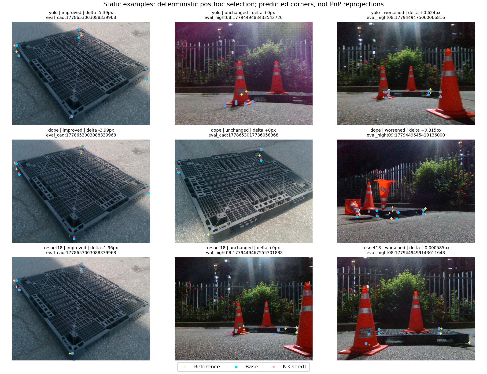
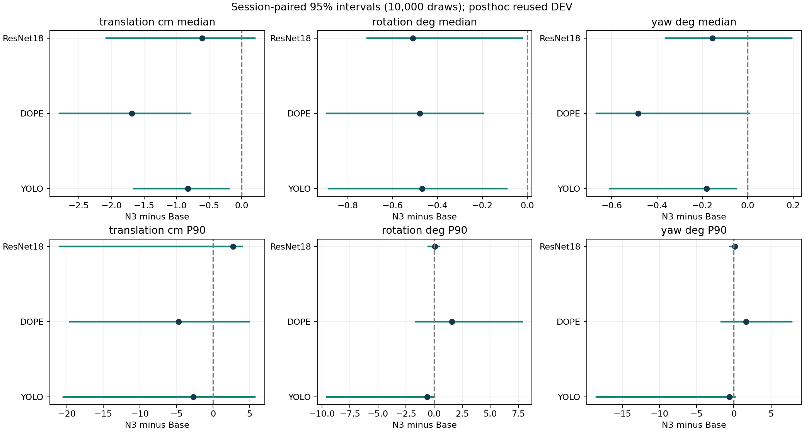

# N3 실험·원고 검토 자료 — 2026-10-06

**YOLO·DOPE·ResNet-18의 완료한 N3 실험, 재집계·검산, 원고 반영 결과를 GitHub에서 확인하는 자료입니다.** 추가 근거가 필요한 세 항목(리프터 공식 120장/반복 24장, 정지 잡음, 정사각형·리프터 독립 실측 T/R)은 이번 완료 범위와 분리했습니다.

전체 정적 319장에서는 세 기반 모두 중앙 코너 오차와 중앙 이동·회전 오차가 감소했습니다. 일부 P90·어려움 집단은 악화됐습니다. 리프터 12장 보조 평가는 중앙값 악화, P90·PCK10 개선의 혼합 결과입니다. 모든 조건에서 안정적으로 개선되었다고 주장하지 않습니다.

[전체 원고 Markdown](paper_text/manuscript_ko.md) · [보충 원고 Markdown](paper_text/supplement_ko.md) · [12장 전체 비교 이미지](LIFTER_12_ALL_IMAGES_KO.md) · [모든 숫자의 출처](REVIEW_CELL_MAP.json) · [복사 원본 경로·크기·SHA-256](SOURCE_MANIFEST.json) · [문서·해시 검산](PUBLICATION_VALIDATION.json)

## 1. 무엇을 실제로 학습하고 평가했는가

| 구분 | 실제 입력·감독 | 공개하는 결과 |
| --- | --- | --- |
| Base | 동결된 RGB 초기 추정기 | YOLO, DOPE, ResNet-18 각각의 기존 출력 |
| N3 | 이미지 내부 특징 + 초기 코너 + 박스 + 등록 물리 치수 W/D/H; 대칭 감독 포함 | 각 기반에서 따로 학습한 보정기 seed 1·2·3 |
| ResNet Base | 실제 10-epoch CONSTANT-fold RGB; DSNT 공간 softmax 기댓값 decoder | epoch 10, step 34,990 체크포인트와 접기 근거 |
| N0 / N1 | YOLO 통제 재현 국소 보정 / 대칭만 포함 | 기존 각 3seed 원시 코너의 빠졌던 동일 PnP 평가 |

세 Base 자체를 모두 ‘이미지+치수 입력 모델’로 다시 학습한 결과가 아닙니다. **이미지 특징과 치수를 함께 받아 학습하는 부분은 N3 보정기입니다.** 세 기반이 동일한 보정 구조·규약을 사용하지만 가중치는 각각 따로 학습했습니다. 하나의 가중치를 다른 기반에 그대로 전이한 실험이 아닙니다.

기존 N3는 기반마다 3seed, 각 batch 16·6,000 optimizer updates·96,000 표본 노출의 완료 결과를 재사용합니다. DOPE와 ResNet의 유효 고유 합성 학습 행은 각각 44,063 / 55,806개이며, 초기 모델까지의 총학습량이 같다는 뜻은 아닙니다. 이번 마감과 공개 자료 생성의 **신규 학습·optimizer update·새 모델 추론은 0회**입니다.

ResNet의 옛 60-epoch/argmax 설명은 [정정 기록](evidence/contracts/PROTOCOL_CORRECTIONS.md)으로 분리했습니다. 원본 protocol·receipt·가중치를 소급 변경하지 않았습니다. [실제 모델 명세와 해시](evidence/contracts/RESNET_EFFECTIVE_PROTOCOL.json), [DOPE/ResNet 완료 checkpoint 연결](evidence/contracts/TRAINING_REUSE_VERIFICATION.json), [YOLO 완료 기록](evidence/contracts/YOLO_PAPER_TRAINING_COMPLETE.json)으로 확인할 수 있습니다.

## 2. 동일 319장의 세 기반 Base → N3

코너 0–7만 평가하고 중심점 8은 제외합니다. 같은 프레임·카메라·치수·물체 전체 대칭·PnP·실패 규약을 유지합니다. N3 headline은 **각 seed에서 먼저 계산한 통계의 평균**이며 seed 예측을 합치거나 좋은 seed를 선택하지 않았습니다.

| 기반 | 코너 중앙값 px | 코너 P90 px | PCK≤10px % | T 중앙값 cm | R 중앙값 ° | 유효 / 참조 코너 | 자세 산출 |
| --- | --- | --- | --- | --- | --- | --- | --- |
| YOLO | 6.721 → 5.778 | 43.890 → 42.134 | 63.425 → 68.587 | 7.897 → 7.068 | 2.539 → 2.070 | 2445 / 2499 | 319 / 319 |
| DOPE | 12.570 → 7.469 | 51.282 → 53.570 | 24.170 → 44.338 | 10.046 → 8.356 | 3.530 → 3.051 | 1797 / 2499 | 210 / 319 |
| ResNet-18 | 8.223 → 7.085 | 62.638 → 62.371 | 52.261 → 57.223 | 9.739 → 9.134 | 4.342 → 3.832 | 2291 / 2499 | 319 / 319 |

중앙값/P90은 유효 예측 또는 산출된 자세의 조건부 통계입니다. PCK는 전체 2,499개 참조 코너, 자세 산출률은 전체 319장 분모를 유지합니다. DOPE의 109장 자세 실패와 702개 미관측 참조 코너를 성공 집단에 숨기지 않습니다. 직사각형 T/R은 영상 코너·기하로 재구성한 참조에 대한 값이며 독립 물리 실측 정확도가 아닙니다.

DOPE 코너 P90 51.282→53.570px, 회전 P90 80.583→82.173°와 ResNet 이동 P90 97.545→100.304cm는 악화됩니다. 상대적인 기반 순위에는 서로 다른 초기 모델·훈련 이력·유효 예측 수의 영향이 있습니다.


위 그림은 기존 검산된 전체 결과를 그대로 복사했습니다. 마지막 패널의 ‘full-penalty P90’은 결측에 영상 대각선 벌점을 준 프로젝트 지표이며 조건부 코너 P90과 다른 값입니다. [그림 출처](evidence/figures/FIGURE_PROVENANCE.json), [전체·등급·재질·seed별 CSV](evidence/static/DEV319_HEADLINE_AND_SEED.csv), [최신 원시 지표 JSON](evidence/static/STATIC_REAGGREGATION.json)이 연결됩니다.

### 모든 N3 seed

| 기반 | 실행 | 중앙값 px | P90 px | PCK10 % | T cm | R ° | 자세 |
| --- | --- | --- | --- | --- | --- | --- | --- |
| YOLO | N3_DIM_SYM_seed1 | 5.745 | 42.320 | 68.828 | 7.039 | 2.110 | 319/319 |
| YOLO | N3_DIM_SYM_seed2 | 5.768 | 41.872 | 68.267 | 6.790 | 2.073 | 319/319 |
| YOLO | N3_DIM_SYM_seed3 | 5.822 | 42.209 | 68.667 | 7.374 | 2.028 | 319/319 |
| DOPE | n3_seed1 | 7.570 | 54.678 | 44.138 | 8.447 | 3.136 | 210/319 |
| DOPE | n3_seed2 | 7.430 | 53.135 | 44.418 | 8.273 | 3.091 | 210/319 |
| DOPE | n3_seed3 | 7.408 | 52.898 | 44.458 | 8.348 | 2.925 | 210/319 |
| ResNet-18 | n3_seed1 | 7.091 | 62.575 | 57.143 | 9.069 | 3.807 | 319/319 |
| ResNet-18 | n3_seed2 | 7.150 | 62.141 | 57.023 | 9.210 | 3.905 | 319/319 |
| ResNet-18 | n3_seed3 | 7.013 | 62.397 | 57.503 | 9.124 | 3.784 | 319/319 |

### 실제 예측점을 그린 개선·무차이·악화 예시



노란 +는 기하 참조, 청록 원은 Base, 붉은 ×는 N3 seed 1입니다. PnP 재투영점을 모델 예측처럼 표시한 그림이 아닙니다. 각 기반의 개선·무차이·악화 범주에서 첫 사전식 frame ID를 고르는 기존 사후 규칙을 재사용했습니다. 질적 예시이며 전체 집단을 대표하는 무작위 표본은 아닙니다. [9개 예시 frame ID·원사진 해시·선택 규칙](evidence/figures/EXAMPLE_SELECTION.json).

## 3. N0/N1 누락 6D 계산과 짝지은 불확실성

기존 reuse.py의 CORE_ARMS 대상 밖이던 N0_BASE_REPLAY/N1_SYM_ONLY의 원시 코너를 읽어 동일 PnP 평가를 보완한 완료본을 재사용했습니다. 새 학습을 하지 않았고 R0/P/N2/N3는 같은 규약으로 회귀검산했습니다.

| YOLO 구성 | T 중앙값 / P90 cm | R 중앙값 / P90 ° | 방향각 중앙값 / P90 ° | IoU3D 중앙값 | ADDsym AUC 전체 | 자세 |
| --- | --- | --- | --- | --- | --- | --- |
| Base | 7.897 / 40.530 | 2.539 / 86.527 | 1.316 / 86.240 | 0.594 | 0.377 | 319/319 |
| P | 7.153 / 38.664 | 2.154 / 85.987 | 1.151 / 85.824 | 0.637 | 0.408 | 319/319 |
| N0 | 7.260 / 38.391 | 2.176 / 85.973 | 1.173 / 85.801 | 0.639 | 0.408 | 319/319 |
| N1 | 7.274 / 39.128 | 2.183 / 85.989 | 1.129 / 85.851 | 0.636 | 0.408 | 319/319 |
| N2 | 7.011 / 38.108 | 2.090 / 85.819 | 1.142 / 85.611 | 0.634 | 0.413 | 319/319 |
| N3 | 7.068 / 37.809 | 2.070 / 85.919 | 1.134 / 85.670 | 0.631 | 0.412 | 319/319 |

[N0/N1 seed별 계산 CSV](evidence/pose/N0_N1_POSE_RESULTS.csv) · [원시 지표·분모·규약 JSON](evidence/pose/N0_N1_POSE_RESULTS.json).

같은 frame ID의 Base→N3 자세 성공 집합을 대조했습니다. 세 기반·세 seed 모두 전후 성공 집합이 같고, 신규 실패·복구는 실제 0건입니다. DOPE의 성공 집합은 210장으로 제한되지만 실패 109장은 전체 분모에 유지합니다. [전체 성공 집합과 공통 성공 보조 분석](evidence/pose/PAIRED_POSE_ANALYSIS.json).

| 기반 | seed | Base 성공 | N3 성공 | 공통 성공 | 새 실패 | 복구 |
| --- | --- | --- | --- | --- | --- | --- |
| YOLO | 1 | 319 | 319 | 319 | 0 | 0 |
| YOLO | 2 | 319 | 319 | 319 | 0 | 0 |
| YOLO | 3 | 319 | 319 | 319 | 0 | 0 |
| DOPE | 1 | 210 | 210 | 210 | 0 | 0 |
| DOPE | 2 | 210 | 210 | 210 | 0 | 0 |
| DOPE | 3 | 210 | 210 | 210 | 0 | 0 |
| ResNet-18 | 1 | 319 | 319 | 319 | 0 | 0 |
| ResNet-18 | 2 | 319 | 319 | 319 | 0 | 0 |
| ResNet-18 | 3 | 319 | 319 | 319 | 0 | 0 |

기존 **13세션 단위 paired bootstrap 10,000회, 난수 seed 20260917**을 재사용했습니다. 같은 재표집을 모든 기반·seed에 적용하고 각 재표집 안에서 seed별 통계 변화의 평균을 냈습니다. 아래 값은 `통계량(after)−통계량(before)`이며 `median(after−before)`가 아닙니다. 95% percentile 구간·seed 표준편차·최솟값·최댓값을 그대로 공개합니다.

| 기반 | 통계·단위 | 평균 변화 | 95% 구간 | seed SD | seed 최소 / 최대 |
| --- | --- | --- | --- | --- | --- |
| YOLO | translation_cm_median | -0.829 | [-1.653, -0.195] | 0.293 | -1.107 / -0.523 |
| YOLO | translation_cm_P90 | -2.721 | [-20.493, 5.710] | 0.367 | -3.118 / -2.394 |
| YOLO | rotation_deg_median | -0.468 | [-0.886, -0.092] | 0.041 | -0.511 / -0.429 |
| YOLO | rotation_deg_P90 | -0.608 | [-9.538, -0.071] | 0.037 | -0.650 / -0.577 |
| YOLO | yaw_deg_median | -0.182 | [-0.607, -0.052] | 0.025 | -0.210 / -0.162 |
| YOLO | yaw_deg_P90 | -0.571 | [-18.475, 0.132] | 0.056 | -0.616 / -0.508 |
| DOPE | translation_cm_median | -1.690 | [-2.796, -0.786] | 0.087 | -1.773 / -1.599 |
| DOPE | translation_cm_P90 | -4.739 | [-19.564, 4.923] | 1.016 | -5.829 / -3.818 |
| DOPE | rotation_deg_median | -0.479 | [-0.893, -0.196] | 0.111 | -0.605 / -0.394 |
| DOPE | rotation_deg_P90 | 1.590 | [-1.659, 7.847] | 0.881 | 0.573 / 2.118 |
| DOPE | yaw_deg_median | -0.483 | [-0.667, 0.007] | 0.039 | -0.528 / -0.455 |
| DOPE | yaw_deg_P90 | 1.645 | [-1.664, 7.780] | 0.995 | 0.496 / 2.233 |
| ResNet-18 | translation_cm_median | -0.604 | [-2.077, 0.202] | 0.071 | -0.670 / -0.529 |
| ResNet-18 | translation_cm_P90 | 2.759 | [-20.988, 3.960] | 0.695 | 2.091 / 3.479 |
| ResNet-18 | rotation_deg_median | -0.510 | [-0.714, -0.022] | 0.064 | -0.558 / -0.437 |
| ResNet-18 | rotation_deg_P90 | 0.061 | [-0.520, 0.432] | 0.069 | -0.019 / 0.109 |
| ResNet-18 | yaw_deg_median | -0.156 | [-0.361, 0.194] | 0.060 | -0.198 / -0.088 |
| ResNet-18 | yaw_deg_P90 | 0.143 | [-0.533, 0.346] | 0.024 | 0.123 / 0.170 |

이 구간은 재사용 DEV에 대한 사후 분석이며 독립 TEST의 확증 구간이 아닙니다. 다중비교 보정은 없습니다. 0을 포함하는 구간이나 악화 값을 임의로 개선 판정하지 않습니다. [짝지은 불확실성 CSV](evidence/pose/PAIRED_POSE_ANALYSIS.csv), [절제 구성 불확실성](evidence/pose/ABLATION_POSE_UNCERTAINTY.json), [2D 불확실성](evidence/pose/PAIRED_2D_UNCERTAINTY.json), [코너·프레임 개선/악화·큰 오류·손상·복구](evidence/pose/POSE_TRACE_AND_TAIL.json).



## 4. 최신 가림 등급과 가시성

직사각형 319장의 최신 사람 입력은 **없음 153 / 중간 92 / 어려움 74**입니다. 정사각형 119장은 **3 / 85 / 31**입니다. 세부 등급 판정 기준은 `NOT_CONFIRMED`로 남겨 사용자 입력 등급에 따른 보조 분석으로 제시합니다. 외부 차폐 비율이나 독립 블라인드 가림 강건성의 확증으로 바꾸지 않습니다. 이전 128장 가림 패널(29/20/79, 미분류191)과 최신 전체319장 등급을 섞지 않습니다.

| 기반 | 사람 입력 등급 | 영상 | 중앙값 px | P90 px | PCK10 % | T 중앙값 cm | R 중앙값 ° | 자세 |
| --- | --- | --- | --- | --- | --- | --- | --- | --- |
| YOLO | 없음 | 153 | 5.275 → 4.547 | 18.965 → 15.301 | 74.223 → 80.742 | 4.668 → 4.361 | 1.716 → 1.503 | 153 / 153 |
| YOLO | 중간 | 92 | 7.603 → 6.256 | 103.611 → 102.597 | 61.905 → 66.527 | 7.851 → 6.124 | 1.999 → 1.841 | 92 / 92 |
| YOLO | 어려움 | 74 | 11.045 → 10.117 | 55.149 → 55.929 | 41.918 → 44.819 | 16.047 → 17.481 | 46.101 → 26.483 | 74 / 74 |
| DOPE | 없음 | 153 | 11.736 → 6.667 | 27.086 → 24.059 | 34.043 → 61.948 | 8.122 → 5.725 | 2.835 → 2.252 | 131 / 153 |
| DOPE | 중간 | 92 | 13.750 → 9.028 | 91.896 → 94.378 | 17.087 → 33.427 | 15.499 → 16.867 | 9.218 → 8.936 | 51 / 92 |
| DOPE | 어려움 | 74 | 15.980 → 11.135 | 87.432 → 87.861 | 11.723 → 19.953 | 14.327 → 16.818 | 8.759 → 7.728 | 28 / 74 |
| ResNet-18 | 없음 | 153 | 6.462 → 5.280 | 23.787 → 22.460 | 68.985 → 74.932 | 4.951 → 4.580 | 2.626 → 2.164 | 153 / 153 |
| ResNet-18 | 중간 | 92 | 11.086 → 9.678 | 134.893 → 136.823 | 42.577 → 46.499 | 12.373 → 12.246 | 4.908 → 4.611 | 92 / 92 |
| ResNet-18 | 어려움 | 74 | 14.970 → 13.309 | 72.755 → 73.555 | 28.242 → 32.386 | 33.668 → 34.043 | 51.270 → 54.608 | 74 / 74 |

YOLO 어려움의 T 중앙값 16.047→17.481cm, DOPE 중간 15.499→16.867cm, ResNet 어려움의 T 33.668→34.043cm·R 51.270→54.608° 악화도 그대로 유지했습니다. 재질별·등급별·각 seed의 모든 행은 [전체 CSV](evidence/static/DEV319_HEADLINE_AND_SEED.csv)와 [행별 JSON 포인터](evidence/static/SUBGROUP_REVIEW.json)에 있습니다.

가시성은 원래 좌표를 바꾸지 않고 기존 71개와 이번 3,030개 상태를 합쳐 **3,101개 참조 코너**를 연결했습니다. 전체 합계는 직접 가시 2,313 / 외부 가림 281 / 자체 가림 462 / 화면 밖 45 / UNKNOWN 0입니다. 참조 좌표가 없는 직사각형 53개·정사각형 350개 슬롯에 상태나 좌표를 새로 만들어 넣지 않았습니다.

아래는 직사각형 2,499점의 YOLO 예시이고, 모든 기반·정사각형 두 모드·각 seed는 별도 CSV에 있습니다. 물체 전체 대칭을 영상별로 먼저 정한 뒤 원래 참조 ID의 상태로 분리하며 상태별로 대칭을 재최적화하지 않습니다.

| 상태 | 방법 | 참조 / 유효 코너 | 중앙값 px | P90 px | PCK10 % |
| --- | --- | --- | --- | --- | --- |
| DIRECT_VISIBLE | Base | 1776 / 1759 | 5.829 | 25.761 | 70.946 |
| EXTERNAL_OCCLUDED | Base | 218 / 195 | 19.485 | 80.896 | 27.523 |
| SELF_OCCLUDED | Base | 462 / 448 | 8.874 | 41.132 | 53.247 |
| OUT_OF_FRAME | Base | 43 / 43 | 12.159 | 224.325 | 44.186 |
| DIRECT_VISIBLE | N3 | 1776 / 1759 | 4.975 | 23.571 | 77.646 |
| EXTERNAL_OCCLUDED | N3 | 218 / 195 | 18.269 | 81.568 | 25.688 |
| SELF_OCCLUDED | N3 | 462 / 448 | 8.143 | 38.356 | 55.988 |
| OUT_OF_FRAME | N3 | 43 / 43 | 10.864 | 223.509 | 47.287 |

[가시성 모든 기반·모드 CSV](evidence/visibility/VISIBILITY_RESULTS.csv) · [각 seed CSV](evidence/visibility/VISIBILITY_PER_SEED.csv) · [분모·회귀검산](evidence/audits/VISIBILITY_SQUARE_VALIDATION.json).


## 5. 정사각형 119장: 602점과 600점 분리

`manual_declared`는 저장된 수동 참조 **602점**, `manual_in_frame`은 그 중 화면 밖 2점을 제외한 **600점**입니다. 모든 방법에 같은 모드·분모를 적용했습니다. 한 촬영 세션이고 등록 치수는 [1.1,1.1,0.15]m입니다. 독립 물리 6D 참조가 없어 T/R은 x, 세션 간 일반화 구간은 NA입니다.

| 기반 | 모드 | 방법 | 중앙값 px | P90 px | PCK10 % | 유효 / 참조 | T / R |
| --- | --- | --- | --- | --- | --- | --- | --- |
| YOLO | manual_declared | Base | 5.526 | 11.439 | 85.216 | 597 / 602 | x / x |
| YOLO | manual_declared | P | 4.991 | 10.088 | 89.037 | 597 / 602 | x / x |
| YOLO | manual_declared | N2 | 4.949 | 9.882 | 89.590 | 597 / 602 | x / x |
| YOLO | manual_declared | N3 | 5.004 | 9.932 | 89.258 | 597 / 602 | x / x |
| DOPE | manual_declared | Base | 11.748 | 30.226 | 36.711 | 549 / 602 | x / x |
| DOPE | manual_declared | N3 | 7.037 | 28.244 | 64.618 | 549 / 602 | x / x |
| ResNet-18 | manual_declared | Base | 6.584 | 17.073 | 72.425 | 592 / 602 | x / x |
| ResNet-18 | manual_declared | N3 | 5.891 | 15.872 | 78.350 | 592 / 602 | x / x |
| YOLO | manual_in_frame | Base | 5.521 | 11.473 | 85.333 | 595 / 600 | x / x |
| YOLO | manual_in_frame | P | 4.975 | 10.096 | 89.056 | 595 / 600 | x / x |
| YOLO | manual_in_frame | N2 | 4.940 | 9.867 | 89.667 | 595 / 600 | x / x |
| YOLO | manual_in_frame | N3 | 4.980 | 9.919 | 89.333 | 595 / 600 | x / x |
| DOPE | manual_in_frame | Base | 11.748 | 30.226 | 36.833 | 549 / 600 | x / x |
| DOPE | manual_in_frame | N3 | 7.037 | 28.244 | 64.833 | 549 / 600 | x / x |
| ResNet-18 | manual_in_frame | Base | 6.595 | 17.078 | 72.333 | 590 / 600 | x / x |
| ResNet-18 | manual_in_frame | N3 | 5.898 | 15.891 | 78.278 | 590 / 600 | x / x |

YOLO 602점 모드에서 N3는 Base보다 중앙값 0.522px·P90 1.507px 개선, PCK10 +4.042%p입니다. **N2 대비로는 중앙값 +0.055px·P90 +0.050px·PCK10 −0.332%p로 악화**됩니다. 치수와 대칭의 추가 효과를 Base 대비 효과와 혼동하지 않습니다. 단일 치수·단일 세션만으로 치수 입력의 인과 효과를 주장하지 않습니다.

[두 모드 전체 결과·각 seed](evidence/square/SQUARE119_RESULTS.json) · [두 모드 headline CSV](evidence/square/SQUARE119_RESULTS.csv) · [각 seed CSV](evidence/square/SQUARE119_PER_SEED.csv) · [N3 대 Base / N2 변화](evidence/square/SQUARE119_COMPARISONS.csv).

과거 정사각형 150장(7세션)은 별도 결과로 보존했습니다. 직접 클릭 681점과 PnP 포함 1,200점 proxy를 별도 모드로 유지하고 119장에 합산하지 않았습니다. 해당 150장 동일 계약 N3/DOPE/ResNet 결과는 x입니다. [별도 150장 출처·모드·제한](evidence/square/HISTORICAL_SQUARE150.json).

## 6. 보정 비교군 319장과 학생 128장

### 동일 319장·8코너 보정 비교

| 방법 | 중앙값 px | P90 px | PCK10 % | T 중앙값 cm | R 중앙값 ° |
| --- | --- | --- | --- | --- | --- |
| R0 | 6.721 | 43.890 | 63.425 | 7.897 | 2.539 |
| P | 5.938 | 42.631 | 67.494 | 7.153 | 2.154 |
| D | 6.504 | 42.992 | 64.372 | 7.597 | 2.274 |
| L | 6.146 | 42.984 | 66.867 | 7.548 | 2.233 |
| PoseFix | 5.561 | 43.907 | 68.707 | 6.951 | 2.028 |
| N3 | 5.778 | 42.134 | 68.587 | 7.068 | 2.070 |

D/L/PoseFix의 기존 3seed 원시 결과를 검산해 재사용했습니다. PoseFix는 팔레트 9점용 변형이며 원 논문 전체 수렴 학습 재현과 동일하지 않습니다. PoseFix가 N3보다 낮은 중앙값을 보이고 N3가 더 낮은 P90을 보이는 결과도 공개합니다. 비교군 전체 사전학습·튜닝·감독·비용이 완전히 같다고 소급 가정하지 않습니다. [같은 319장 각 seed CSV](evidence/static/COMPARATOR319_HEADLINE_AND_SEED.csv), [최신 재질·등급 재집계](evidence/static/COMPARATOR_REAGGREGATION.json), [기존 원시 파일 해시 검산](evidence/audits/REUSED_RESULT_AUDIT.json).

### 공통 비노출 128장 학생 대안

| 방법 | 영상 | 참조 코너 | 중앙값 px | P90 px | PCK10 % | T 중앙값 cm | R 중앙값 ° |
| --- | --- | --- | --- | --- | --- | --- | --- |
| R0 | 128 | 985 | 9.565 | 40.902 | 49.137 | 9.353 | 3.530 |
| source_only_update | 128 | 985 | 9.741 | 41.776 | 48.629 | 9.203 | 3.507 |
| raw_pseudo_student | 128 | 985 | 9.961 | 41.958 | 47.513 | 9.226 | 3.942 |
| corrected_pseudo_student | 128 | 985 | 8.954 | 42.085 | 51.472 | 9.186 | 3.766 |
| R0_plus_N3 | 128 | 985 | 8.290 | 40.089 | 56.244 | 8.117 | 2.900 |

이 표의 R0와 N3도 같은 128장을 사용합니다. 전체 319장 기준선을 옆에 붙여 비교하지 않습니다. 기존 고정 학생을 재사용했으며 학생 결과를 N3의 3seed 평균으로 소급 기록하지 않습니다. 이번에 자기학습을 하지 않았습니다. 노출 조건이 맞는 공통 128장 패널이지 새로운 독립 TEST가 아닙니다. [128장 frame ID·노출 조건·분모](evidence/static/STUDENT128_REAGGREGATION.json), [같은 128장 실행별 CSV](evidence/static/STUDENT128_HEADLINE_AND_SEED.csv).

## 7. 비용: 같은 GPU, 실행 환경 별도 표시

기존 측정은 RTX 3080, 고정 26프레임·13세션·batch 1·N3 seed 1·경로별 warmup 20·프레임당 5반복입니다. 전체 130개 측정에서 중앙값/P90을 계산했고 가장 빠른 반복을 골라 쓰지 않았습니다. 이미지 파일 읽기는 제외하고 전처리→동결 Base→decode→N3→고정 prediction-only PnP까지의 전체 경로와 보정 단독 경계를 분리했습니다. YOLO와 DOPE/ResNet의 Python/PyTorch 환경이 달라 별도 패널로 공개합니다.

| 환경 | 기반 | 경로 | 추가 params | CUDA 중앙 ms | CUDA P90 ms | 동기화 wall 중앙 ms | N3 단독 중앙 ms | Peak MiB |
| --- | --- | --- | --- | --- | --- | --- | --- | --- |
| pallet-yolo26 | YOLO | Base | 0 | 11.195 | 13.712 | 11.237 | NA | 62.24 |
| pallet-yolo26 | YOLO | N3 | 20259 | 15.138 | 17.212 | 15.179 | 3.432 | 64.52 |
| pallet-pose | DOPE | Base | 0 | 62.736 | 77.585 | 62.779 | NA | 342.39 |
| pallet-pose | DOPE | N3 | 23331 | 65.807 | 80.927 | 65.838 | 2.838 | 342.39 |
| pallet-pose | ResNet-18 | Base | 0 | 8.890 | 9.573 | 8.933 | NA | 98.85 |
| pallet-pose | ResNet-18 | N3 | 23331 | 11.592 | 12.747 | 11.632 | 2.632 | 98.85 |

전체 중앙값의 차이와 N3 단독 중앙값은 다른 계측량입니다. 이 표를 Jetson 성능 또는 모든 비교군의 동일 환경 효율 순위로 해석하지 않습니다. 과거 시간을 이번 재측정값처럼 복사하지 않았습니다. [장비·라이브러리·계측 경계·raw 해시](evidence/runtime/RUNTIME_PANEL.json), [비용 CSV](evidence/tables/tab_cost.csv).

## 8. 리프터에서 이미 완료한 부분

### 고정 8910프레임 출력 연속성

| 방법 | 저장 프레임 | fresh | no-pose | held | fresh 비율 % | 유효 인접쌍 |
| --- | --- | --- | --- | --- | --- | --- |
| Base | 8910 | 8772 | 138 | 0 | 98.451 | 8737 |
| N3 | 8910 | 8772 | 138 | 0 | 98.451 | 8737 |

네 촬영 세션의 frame ID·선택 객체·코너 결측 마스크를 전수 대조했고 두 방법이 일치합니다. 위 수치는 출력 가용성·연속성이며 참조가 필요한 정확도나 사람이 확인한 정지 잡음이 아닙니다. 실제 장비를 제어하거나 운용 모델을 바꾸지 않았습니다. [연속성 JSON](evidence/lifter/LIFTER_CONTINUITY_SUMMARY.json), [세션별 CSV](evidence/lifter/LIFTER_CONTINUITY_SUMMARY.csv), [검증 receipt](evidence/lifter/CONTINUITY_VALIDATION_RECEIPT.json).


### 사람이 확인한 PnP 보조 참조 12장·96점

기존 G 저장본의 직접 입력 66점+PnP 보완 30점, 8코너×12장(4세션)을 그대로 사용합니다. 이후 추가 수동 72점 버전으로 참조를 바꾸거나 좋은 결과를 만드는 주석을 선택하지 않았습니다. 실제 대상 확인은 **12장 모두 same**으로 저장됐고 같은 대상·같은 결측 규약으로 비교했습니다. PnP 보조 주석은 기하 참조로 활용할 수 있지만 독립 물리 계측 정답이나 모든 점이 직접 보인다는 뜻은 아닙니다.

| 방법 | 중앙값 px | P90 px | 전체96점 PCK≤10px | 유효점 | 실패점 |
| --- | --- | --- | --- | --- | --- |
| Base | 3.974 | 9.643 | 88/96 (91.667%) | 96 | 0 |
| N3 | 4.184 | 8.977 | 91/96 (94.792%) | 96 | 0 |

중앙값 변화는 **+0.210px(악화)**, P90 변화는 **-0.666px(개선)**, PCK10은 **+3.125%p**입니다. 점별 46개선/50악화, 프레임 중앙값 5개선/7악화입니다. `median(N3)−median(Base)`는 0.209650px이고 `median(N3−Base)`는 0.089809px로 서로 다릅니다.

이 패널은 **YOLO Base training seed 42, N3 seed 1의 탐색적 기하 참조 결과**입니다. 정적 319장·3seed와 분모를 섞지 않고 원래 120장/반복 24장 가시 코너 평가를 완료 처리하지 않습니다. 저장 시 이전 예측을 보지 않았다는 실제 답변은 있으나 최초 G 작성 시점의 독립 기록이 없어 블라인드 참조라는 주장은 하지 않습니다. 현재 선택 박스 노출은 대상 대응 검수 이력으로 분리했습니다.

[96점별 오차 CSV](evidence/lifter/ASSISTED_POINT_ERRORS.csv) · [12장별 JSON](evidence/lifter/ASSISTED_FRAME_RESULTS.json) · [전체 수치·원시 참조/예측/프로토콜 SHA](evidence/lifter/ASSISTED_RESULT.json) · [12장 전체 비교 이미지](LIFTER_12_ALL_IMAGES_KO.md).

## 9. 실제 원고에 반영한 내용과 아직 남은 x

기존 정적 원고 복사본에 본문 162개·보충 237개 숫자 셀을 연결하고, 634개 개별 출처 포인터를 검증했습니다. 최신 PnP 패널은 별도 복사본에 72개 수치 셀·표·설명·모든 12장 그림을 추가했습니다. 이는 전체 본문의 숫자 개수가 471개라는 뜻이 아니라 **두 작업에서 변경·연결한 셀 수**입니다.

| 완료 항목 | 결과 확보 | 실제 원고 반영 | 확인 근거 |
| --- | --- | --- | --- |
| 세 기반 319장·3seed | 완료 | 본문·보충표 | [원고 셀 634포인터](evidence/paper/STATIC_PAPER_CELL_MAP.json) |
| N0/N1 6D·짝지은 구간 | 완료 | 보충표·설명 | [독립 1465개 검산](evidence/audits/INDEPENDENT_PAPER_AUDIT.json) |
| 최신 등급 153/92/74·가시성 3101 | 완료 | 본문·보충표; 상세 행은 CSV | [정적 표 반영 검산](evidence/paper/STATIC_CLOSEOUT_VALIDATION.json) |
| 정사각형 119·602/600 | 완료 | 본문·보충표 | [602/600 동일 분모](evidence/square/SQUARE119_RESULTS.json) |
| D/L/PoseFix 319·학생 128·환경별 시간 | 완료 | 본문·보충표 | [원시 파일 대조](evidence/audits/REUSED_RESULT_AUDIT.json) |
| 리프터 8910 출력 연속성 | 완료 | 사례·보충표·시계열 | [연속성 결과](evidence/lifter/LIFTER_CONTINUITY_SUMMARY.json) |
| PnP 보조 12장·96점 | 완료 | 최신 LaTeX/MD 복사본·표·그림 | [72셀 실제 삽입 receipt](evidence/paper/ASSISTED_PAPER_INTEGRATION_RECEIPT.json) |

| 이번 추가 계산 대상에서 제외한 항목 | 유지 값 | 필요한 추가 근거 |
| --- | --- | --- |
| 리프터 공식 120장·반복 24장 가시 코너 평가 | x | 해당 고정 표본의 기존 참조·대상 대응·실제 반복 검수 |
| 리프터 정지 잡음 | x | 실제 카메라·파렛트가 정지한 원영상 구간과 확인 근거 |
| 정사각형·리프터 독립 물리 T/R | x | 촬영 당시 별도 실측 거리·각도·시각/좌표계 대응 |

그 외 정의되지 않는 값은 NA, 실제 측정된 무차이·실패 복구 0은 0으로 구분했습니다. 과거 150장에 같은 계약의 N3/DOPE/ResNet이 없는 것은 별도 역사 패널의 x이며, 현재 완료한 119장 결과를 삭제하거나 대체하지 않습니다. 비교군의 완전한 예산 동등성·초기 모델 선택 독립성 같은 미확인 방법론도 확인된 것처럼 쓰지 않았습니다.

실제 소스는 [최신 본문 LaTeX](../pallet_combined_closeout_20261003_v1/pnp_assisted_lifter_20261006_v1/paper_updated/main.tex)·[최신 보충 LaTeX](../pallet_combined_closeout_20261003_v1/pnp_assisted_lifter_20261006_v1/paper_updated/supplement.tex)에 있습니다. [정적 통합 patch](evidence/paper/STATIC_INTEGRATED.patch)와 [최신 PnP 추가 patch](evidence/paper/ASSISTED_PAPER.patch)를 구분했습니다. 원본과 이전 복사본을 보존했고 PDF를 생성하거나 컴파일하지 않았습니다. 투고용 영문화·최종 편집·저자/소속 확정·교수님 검토는 별도 투고 준비입니다.

## 10. GitHub에서 검산하는 방법

1. 이 README의 표와 이미지를 읽고 원고 Markdown을 확인합니다.
2. [SOURCE_MANIFEST.json](SOURCE_MANIFEST.json)의 published_path·original_path·SHA-256으로 각 파일이 원본의 정확한 복사본인지 확인합니다.
3. [REVIEW_CELL_MAP.json](REVIEW_CELL_MAP.json)의 JSON 포인터 또는 CSV 행·열, 단위·분모·seed를 따라 표시 수치의 출처를 확인합니다.
4. [공개 파일 SHA 목록](CHECKSUMS.sha256)을 이 폴더에서 `sha256sum -c CHECKSUMS.sha256`으로 확인합니다.

원시 대형 예측·영상·모델 파일은 이번 문서에 모두 복사하지 않았습니다. [원시 입력 경로·크기·SHA 인덱스](RAW_SOURCE_INDEX.csv)에 로컬 보존 위치와 연결 근거를 기록했습니다. 표·그림·각 seed 지표·96점별 오차는 이 폴더에서 직접 열 수 있습니다.

GitHub를 새로 내려받은 환경에서도 저장된 결과를 검산할 수 있도록 [압축 원시 근거와 독립 검산 안내](portable_evidence/README_KO.md)를 함께 제공합니다. 아래 verifier는 Python 표준 라이브러리만 사용해 8,910행의 두 방법 frame ID·결측 마스크와 12장·96점의 코너 오차·분모를 대조합니다. 모델을 불러오거나 새 추론을 실행하지 않습니다.

```bash
git clone https://github.com/CanelE452/pallet-6d-pose.git
cd pallet-6d-pose
python3 scripts/research/pallet_github_publication_20261006_v1/verify_published_evidence.py
```

코드·protocol·완료 학습 receipt·모델 SHA-256은 공개 자료에서 연결합니다. **새 모델 실행에는 인덱스에 적힌 원래 checkpoint와 데이터가 별도로 필요합니다.** 문서·압축 근거의 검산이 모델 재학습 완료를 뜻하지 않습니다. 출처 모델을 받았다면 파일 크기와 SHA-256이 잠금 값과 일치하는지 먼저 확인합니다.

공개 과정의 추가 검증은 가시성 분모·대칭 집계와 PnP 보조 지표의 안전 조건을 확인하는 **13개 fixture test**입니다. 세 기반 전체 학습을 새로 테스트했다는 의미가 아닙니다. 프로젝트의 NumPy/OpenCV 의존성을 갖춘 Python 환경에서 다음 명령으로 해당 평가 규약을 확인할 수 있습니다.

```bash
python3 -m unittest discover -s scripts/research/pallet_combined_closeout_20261003_v1 -p 'test*.py' -v
```

기존 완료본의 주요 검산은 정적 전체 불변 100/100, 기존 모델/대조군/학생 원시 36/36, 가시성·정사각형 72개, 원고 독립 1465/1465 PASS입니다. 최신 PnP 원고 삽입은 이전 원고 161파일의 해시 보존과 patch 적용 검산을 통과했습니다. 원고 페이지 모양은 PDF를 컴파일하지 않아 NA입니다.

이미 실행된 CPU 재집계 명령은 아래와 같습니다. 당시 실제 시간은 [정적 ledger](evidence/static/EXECUTION_COST_LEDGER.json)·[가시성 ledger](evidence/audits/VISIBILITY_CPU_COST_LEDGER.json)·[PnP 계산 기록](evidence/lifter/ASSISTED_EVALUATION_STATUS.json)에 있습니다. 서로 병행한 wall 시간을 합쳐 총작업 시간이나 CPU 사용초로 부르지 않습니다.

```bash
/home/minjae/anaconda3/envs/pallet-yolo26/bin/python -m scripts.research.pallet_static_registry_review_20261003_v1.reaggregate_native_closeout_20261006
/home/minjae/anaconda3/envs/pallet-yolo26/bin/python scripts/research/pallet_combined_closeout_20261003_v1/closeout_latest.py lifter-audit
/home/minjae/anaconda3/envs/pallet-yolo26/bin/python scripts/research/pallet_combined_closeout_20261003_v1/closeout_latest.py finalize
/home/minjae/anaconda3/envs/pallet-yolo26/bin/python scripts/research/pallet_combined_closeout_20261003_v1/evaluate_pnp_assisted_lifter_20261006.py
```

이 자료 묶음은 기존 결과를 읽어 복사·표현·링크 검산만 수행했습니다. 모델·주석·protocol 원본을 수정하지 않습니다. 공개 승인에 따른 commit/push 상태는 최종 Git commit에서 확인하며, 이 문서 생성 검산을 새 학습이나 새 측정으로 기록하지 않습니다.
