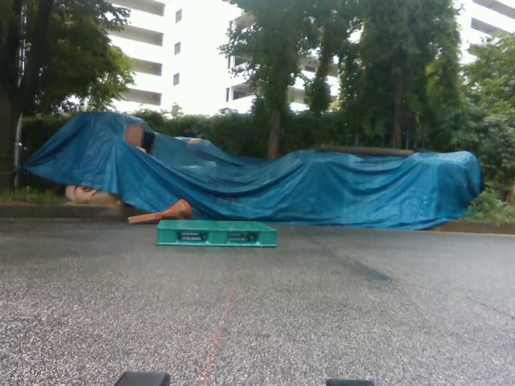

# 공개 결과 독립 검산 자료

완료한 원시 예측과 기존 G 저장 주석을 보존한 채, 새 GitHub clone에서 원본 컴퓨터의 경로 없이 검산할 수 있도록 만들었습니다. 학습·추론·PnP 재계산·외부 통신은 실행하지 않습니다.

```bash
python3 scripts/research/pallet_github_publication_20261006_v1/verify_published_evidence.py
```

저장된 [검산 기록](VERIFICATION.json)은 **29,747개 검사 PASS, 실패 0개**, 실제 CPU 시간 **1.269초**입니다. 실행 환경에 따라 시간은 달라집니다. 별도 계약 회귀 검사는 6개 모두 통과했습니다.

## 연결과 보존

- 최신 결과의 평가 코드·주석·원시 예측·실행 식별자·실제 사람의 대상 판정·검수 큐·평가 규약·프레임 명세 등 **8개 입력 SHA-256**을 확인합니다.
- 원시 예측 **8,910행** 모두의 프레임 중복, Base/N3 선택 대상과 결측 마스크가 같은지 확인합니다. 양쪽 모두 자세 산출 8,772행, 산출 실패 138행입니다.
- 기존 G 저장본 12개에서 8점을 그대로 읽었는지 확인합니다. 직접 클릭 66점과 PnP 보조 30점의 출처는 유지합니다. 이후 직접 클릭 버전으로 바꾸거나 유리한 점만 고르지 않았습니다.
- 사람이 실제 제출한 12개 대상 대응 판정과 원시 프레임·카메라 시각·영상 해시를 연결합니다.
- 원사진 12장과 비교 PNG 12장 모두의 해시를 확인하고, 전체 96점의 오차를 다시 계산합니다.

## 다시 계산한 12장·96점 결과

| 방법 | 중앙값(px) | P90(px) | PCK≤10px | 유효점/전체점 |
|---|---:|---:|---:|---:|
| Base | 3.973987 | 9.643121 | 88/96 (91.666667%) | 96/96 |
| N3 | 4.183637 | 8.976669 | 91/96 (94.791667%) | 96/96 |

중앙값의 차이는 **+0.209650px**, 점별 차이의 중앙값은 **+0.089809px**입니다. 서로 다른 값으로 보존합니다. 점별 개선 46개, 악화 50개이며 중앙값은 악화, P90과 10픽셀 이내 비율은 개선됐습니다.

이 결과는 **PnP 보조 기하 참조에 대한 2D 부분 평가**입니다. 직접 가시 코너만의 정확도, 전체 120장·반복 24장 평가, 정지 잡음, 독립 실측 T/R로 바꾸지 않습니다. 해당 미완료 값은 x로 유지합니다.

## 원시 파일의 무손실 압축 사본

[출판 사본 명세](PORTABLE_EVIDENCE_MANIFEST.json)는 원본 경로·크기·SHA-256, 압축 사본 경로·크기·SHA-256, 복원 SHA-256을 함께 기록합니다. 원본 JSON/JSONL을 수정하지 않았습니다. gzip의 시간과 파일명 필드는 고정해 동일 입력의 압축 결과를 재현할 수 있게 했습니다.

| 원본 | 원본 바이트 | gzip 사본 바이트 | 사본 |
|---|---:|---:|---|
| `data/pallet/results/pallet_combined_closeout_20261003_v1/pnp_assisted_lifter_20261006_v1/ALL_STORED_FRAMES_EVALUATOR.jsonl` | 50,221,756 | 7,371,114 | [gzip](compressed/01_ALL_STORED_FRAMES_EVALUATOR.jsonl.gz) |
| `data/pallet/results/pallet_static_registry_review_20261003_v1/native_corner_visibility/STATIC_CORNER_VISIBILITY_INPUTS.json` | 23,214,979 | 445,662 | [gzip](compressed/02_STATIC_CORNER_VISIBILITY_INPUTS.json.gz) |
| `data/pallet/results/pallet_lifter_case_review_20261003_v1/raw_predictions/ALL_STORED_FRAMES.jsonl` | 51,380,472 | 7,449,306 | [gzip](compressed/03_ALL_STORED_FRAMES.jsonl.gz) |
| `data/pallet/results/pallet_lifter_case_review_20261003_v1/raw_predictions/ALL_STORED_FRAMES_L4.jsonl` | 50,216,280 | 7,369,128 | [gzip](compressed/04_ALL_STORED_FRAMES_L4.jsonl.gz) |
| `data/pallet/results/pallet_lifter_case_review_20261003_v1/metrics_l4/LIFTER_METRICS.json` | 10,866,192 | 1,132,234 | [gzip](compressed/05_LIFTER_METRICS.json.gz) |

합계 **185,899,679 → 23,767,444바이트**입니다. 압축 사본 전체를 해제한 해시가 원본과 같음을 검산합니다. 정적 가시성 입력과 과거 L4 파생 파일은 이 명령에서 무결성을 확인하며, 해당 수치 재집계는 기존 별도 실행 기록을 참고합니다.

## 전체 비교 이미지와 원사진

아래는 고정된 12장 전부입니다. 비교 그림은 참조·Base·N3를 같은 프레임에 표시합니다. 성능으로 샘플을 골라내지 않았습니다.

| 프레임 | 원사진 | 참조/Base/N3 비교 |
|---|---|---|
| 173507:56 | [원사진](reference_images/173507_00056.png) | [비교 PNG](../images/lifter_12/173507_56.png) |
| 173507:1652 | [원사진](reference_images/173507_01652.png) | [비교 PNG](../images/lifter_12/173507_1652.png) |
| 173507:3655 | [원사진](reference_images/173507_03655.png) | [비교 PNG](../images/lifter_12/173507_3655.png) |
| 174126:13 | [원사진](reference_images/174126_00013.png) | [비교 PNG](../images/lifter_12/174126_13.png) |
| 174126:419 | [원사진](reference_images/174126_00419.png) | [비교 PNG](../images/lifter_12/174126_419.png) |
| 174126:744 | [원사진](reference_images/174126_00744.png) | [비교 PNG](../images/lifter_12/174126_744.png) |
| 174342:41 | [원사진](reference_images/174342_00041.png) | [비교 PNG](../images/lifter_12/174342_41.png) |
| 174342:1190 | [원사진](reference_images/174342_01190.png) | [비교 PNG](../images/lifter_12/174342_1190.png) |
| 174342:2447 | [원사진](reference_images/174342_02447.png) | [비교 PNG](../images/lifter_12/174342_2447.png) |
| 174925:32 | [원사진](reference_images/174925_00032.png) | [비교 PNG](../images/lifter_12/174925_32.png) |
| 174925:1002 | [원사진](reference_images/174925_01002.png) | [비교 PNG](../images/lifter_12/174925_1002.png) |
| 174925:1892 | [원사진](reference_images/174925_01892.png) | [비교 PNG](../images/lifter_12/174925_1892.png) |



[전체 결과 설명으로 돌아가기](../README_KO.md)
