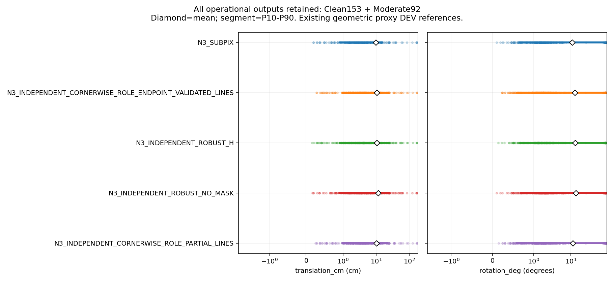
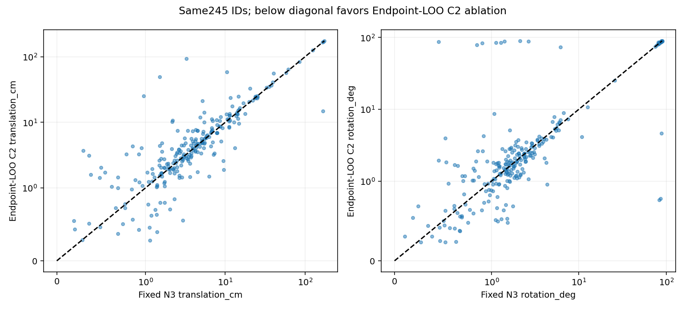
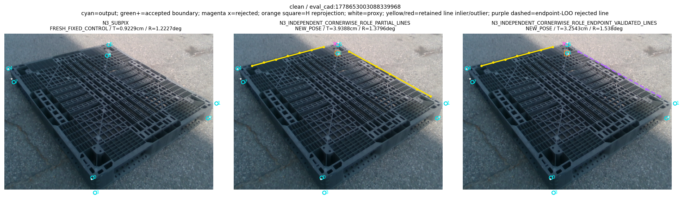
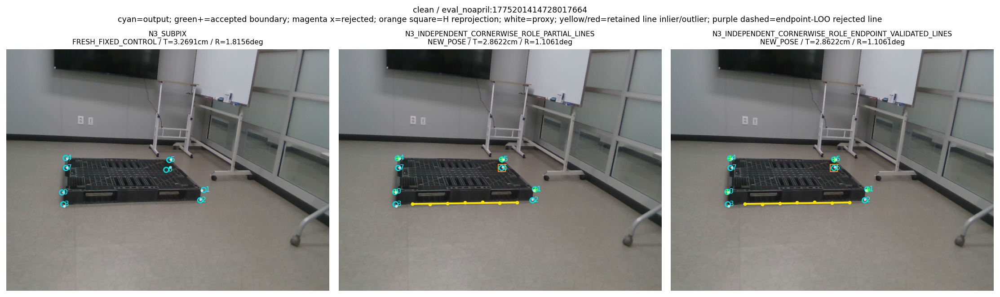
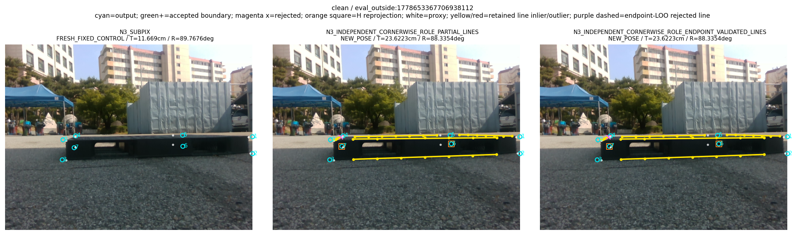
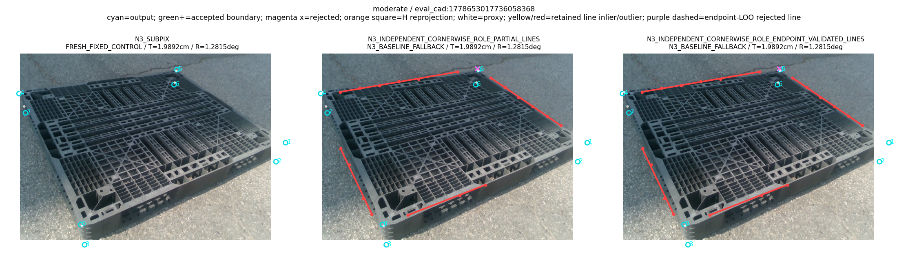
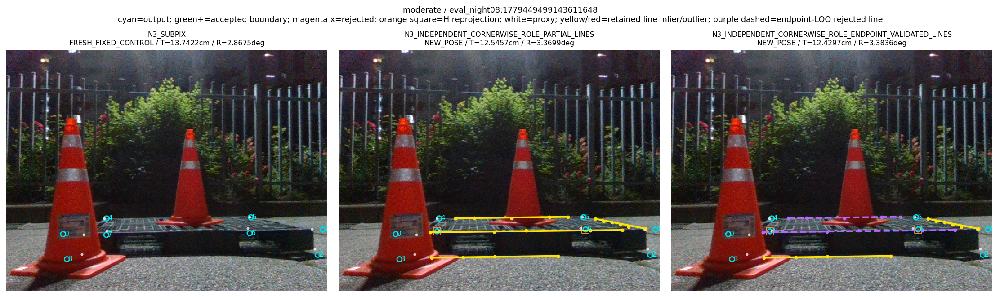
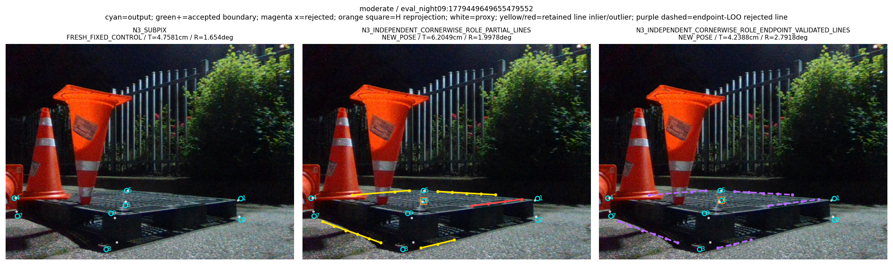

“가림 판단이 일부 틀려도 다른 유효 대응점으로 자세를 구하고 자기 가림 코너를 재투영했을 때, 기존 단순 대조보다 실제 위치·회전이 좋아졌는가?”

**아니다.** 이번 v6은 쉬움153장·중간92장, 전체245장의 실제 새 경로를 실행했지만, 위치·회전 평균을 고정 N3→cornerSubPix보다 함께 낮추지 못했다. 주 방법의 전체 운용 위치 오차는 **10.521308897cm**, 회전 오차는 **13.006502170°**, ADDsym은 **19.664573781cm**다. 고정 N3는 **9.754548029cm / 10.914841863° / 17.028646667cm**다. 주 방법241장은 새 자세,4장은 N3 기본 출력 반환, 완전 실패0장이며 모두245장 운용 집계에 남겼다.

선의 두 끝점과 H를 뺀 native N3 점으로 검증 자세를 구하는 구조는 실제로 추가했다. 그러나 이 선 검증은 변경 없는 v5 C2보다도 회전 평균을 악화시켰다. v5 C2는 **10.294998444cm / 11.522039836° / 18.039196674cm**이고, v6−v5의 회전 평균 차이는 **+1.484462334°**, session bootstrap95% CI는 **[+0.436580,+3.082136]°**다. 구조적 제외 조건을 지켰다는 것과 보정 성공을 구분한다. 이 결과가 모든 heldout 검증의 무용함이나 실제 경계 소유권 오류 비율을 증명하지는 않는다.

이 보고서는 완료된 inference·seal·score·METRICS·독립 VERIFY/VALIDATION·fresh600 runtime·scalar H 검산·gate 품질 감사·8개 그림·공개 byte 복원 영수증을 근거로 작성했다. 공개 원행을 별도 새 evidence bundle에 복원하고 검산하는 작업도 완료됐다. 실행 완료와 최상위 성능 목표 달성을 구분하며, 원격 게시 SHA는 별도 publication receipt가 authority다.

## 이번에 고정하고 실제로 바꾼 것

원 초기 detector와 N3 seed1·SubPix, corrected IMAGE_ROLE 마지막 step3000 checkpoint, 기존 source-only CAL, Base anchor의 query/좌표/feature rounding은 고정했다. source 감독 수리 후3×3000=9000 학습은 이전 단계에서 이미 완료했고 이번 학습·RGB 생성은0이다. 이번 formal [PROTOCOL.json](PROTOCOL.json)의 SHA는 `1de41781e280963c16486e828990ba9d4c4e1556c45faedd5ddc7edd2b55ce2c`다. 새 실사 GT/reference 접근 전 CPU 검사와 code/input/평가 계약을 freeze했다. 완전한 [평가 계약](EVALUATION_CONTRACT_KO.md)과 [정적 재사용 감사](STATIC_REUSE_AUDIT_KO.md)를 별도로 보존했다.

v6의 변화는 **관측 선의 채택 여부** 한 단계다. 기존 코너별 native N3 heldout strict-improvement 선택과8px native basin, 실제 관측 선·corner 좌표는 그대로다. 같은 edge에서 만들어 채택한 corner가 최종 point pool에 있으면 해당 선은 consumed로 제거한다. 나머지 unused 선 e=(a,b)마다 원 native N3 bank의 `hidden=H`, `excluded={a,b}`로 새 prior-free point-only 자세를 실제 구한다. 검사 선·다른 선 factor·채택 boundary 좌표·초기 R,t·초기 dimension prior는 이 검증 fit에 넣지 않는다. [solver.py:202](../../../scripts/research/pallet_partial_line_heldout_20261010_v6/solver.py#L202), [pipeline.py:45](../../../scripts/research/pallet_partial_line_heldout_20261010_v6/pipeline.py#L45).

검증 가능한 NEW 자세가 있으면 등록3D endpoints의 projection과 정규화한 관측 선 사이 signed normal distance의 RMS를 비교한다. 기존8px 정의를 그대로 사용해 ≤8은 `SUPPORTED_RETAIN`, >8은 `CONTRADICTED_REJECT`, 실제 점 수·배치·수치·다중해로 검증할 수 없으면 `UNVERIFIED_RETAIN`이다. UNVERIFIED를 physical NONE이나 틀린 관측으로 단정하지 않는다. 실제 unused edge마다 한 solve request를 남기며 original observation의 deep copy에서 contradicted 선만 제거한다. [solver.py:207](../../../scripts/research/pallet_partial_line_heldout_20261010_v6/solver.py#L207), [218](../../../scripts/research/pallet_partial_line_heldout_20261010_v6/solver.py#L218), [245](../../../scripts/research/pallet_partial_line_heldout_20261010_v6/solver.py#L245).

최종 solver는 변경 없는 v5 C2다. retained point/line마다 한 factor, actual4point·pointinlier4개 이상, 같은 factor pool로 모든 가설 비교, 기존 soft_l1/f_scale8/max_nfev50·최대3개 시작, modeled-normal local rank6·cheirality·다중해 처리를 보존했다. 같은 선에서 만든 점과 선을 중복 관측으로 세지 않는다. 새 R,t가 나오면 H의 초기 좌표를 최종 projection으로 교체하며, projection을 다시 독립 관측처럼 fit하지 않는다. 새 자세가 없으면 N3 기본 출력으로 반환한다.

두 치수 분기를 유지했고 independently known dimension 없이 dim0를 고정하지 않았다. 전역 numeric cache에는 다른 mask의 제외ID를 포함한 primitive가 있을 수 있다. 실제 해당 검증의 active generator/scoring/refit candidate만 H∪{a,b}를 제외한다. 기존 v4 all8 equivalence는 **후보 자세의 모델 projection끼리** 비교하며 heldout 영상 좌표와의 잔차가 아니다. 시스템 전체의 통계적 독립성과도 다르다. 초기 H와 Base proposal 의존성, 남은 native N3의 잘못된 강건 합의 가능성은 유지된다. [v4 pose.py:124](../../../scripts/research/pallet_cornerwise_independent_20261010_v4/pose.py#L124), [186](../../../scripts/research/pallet_cornerwise_independent_20261010_v4/pose.py#L186).

## role 특징과 감독 수리의 정확한 의미

role3 채널은 초기 projection으로 만든 virtual convex hull의 boundary/internal/초기 pose unavailable 특징이다. 실제 영상의 모든 물리 경계가 어느 등록 corner/edge에 속하는지 인증하는 classifier가 아니다. 현재 코드가 정의한 role과 실제 physical ownership의 문제를 같은 것으로 부르지 않는다. [원 model.py:47](../../../scripts/research/pallet_observation_refiner_20261009_v1/model.py#L47).

과거 numerical ray miss를 no_match로 만든 오류는 연구 selector의 source 감독 오류였다. historical [training.targets():59](../../../scripts/research/pallet_observation_refiner_20261009_v1/training.py#L59)와 [94행](../../../scripts/research/pallet_observation_refiner_20261009_v1/training.py#L94)은 원형대로 보존됐다. 수리는 기존 RGB·실제 mesh·wire·mask·depth와 ownership/enclosure 증거로 READY의 POS/NONE/IGNORE를 만들고 [retrain.load_arrays():100](../../../scripts/research/pallet_kp_supervision_repair_20261010_v1/retrain.py#L100)에서 그 배열을 읽는 경로다. [152행 target SHA](../../../scripts/research/pallet_kp_supervision_repair_20261010_v1/retrain.py#L152)와 [376행 checkpoint binding](../../../scripts/research/pallet_kp_supervision_repair_20261010_v1/retrain.py#L376)이 수정 감독을 확인한다. 고정 main N3→SubPix 함수의 오류나 historical 함수가 재작성됐다는 뜻이 아니다.

수정 학습과 현재 역할 feature를 사용하는 방법의 위치·회전 성공은 다른 질문이다. 초기 ray miss2164건 수리와 추가 front-depth13757query 준비, corrected9000 학습은 완료된 이전 증거다. 이것만으로 실사 boundary 교점이 native N3보다 정확해지거나 현재 선 gate가 유효하다고 말할 수 없다. source P0 wire의 감독 지원을 실사 physical absence로 일반화하지 않으며 source CAL unsupported edge는 새 모델 선 제안을 abstain하는 coverage 제한이다.

## 모집단·봉인과 동일 대조군

최신 사용자 범위는 기존 난도 annotation의 clean153+moderate92=245,13session이다. severe74는 새 정확도와 runtime panel에서 제외했고 원319자료·평가는 보존했다. middle label에 부분 가림이 있을 수 있으며 쉬움/중간을 무가림이라고 재정의하지 않았다. [기존 COHORT](../pallet_kp_corrected_supervision_20261010_v1/COHORT.json)과 protocol binding이 정확한 ID를 고정한다.

새4방법980행+fresh BASE/N3490행+OBS245행을 GT-free로 완성·봉인한 뒤에만 기존 reference를 읽었다. [INFERENCE_RECEIPT.json](INFERENCE_RECEIPT.json)은245/980/490 complete, cleanup_error=None, GT_access_during_inference=False다. scorer는 complete cleanup receipt·seal·SHA·method/ID·GT-free field를 먼저 검사하며 새 fit이 금지된 후단에서1470행을 점수화했다. [evaluate.py:111](../../../scripts/research/pallet_partial_line_heldout_20261010_v6/evaluate.py#L111), [SCORING_RECEIPT.json](SCORING_RECEIPT.json).

변경 없는 v5 C2 control은 reference 읽기 **이전**에 과거 v5 geometry와 비교했다. [V5_CONTROL_PARITY.json](V5_CONTROL_PARITY.json)의245행은 모두 확인한 수치가 exact였고 fixed atol1e−7/rtol0와 categorical/실제 C2 field presence 검사를 통과했다. null field끼리 같은 결과를 actual C2 parity로 부르지 않는다. fixed Base/N3의 좌표·phase·점수는 [BASE_N3_PARITY.json](BASE_N3_PARITY.json), [SCORING_PARITY.json](SCORING_PARITY.json)에 보존된다.

alias는 다음 표의 이름을 원행에 그대로 쓴다. 이후 표에서는 읽기 쉬운 label을 쓰며 새로운 method를 추가하지 않는다.

| 보고서 label | 실제 method |
|---|---|
| V6 endpoint gate | `N3_INDEPENDENT_CORNERWISE_ROLE_ENDPOINT_VALIDATED_LINES` |
| V5 C2 control | `N3_INDEPENDENT_CORNERWISE_ROLE_PARTIAL_LINES` |
| Native H robust | `N3_INDEPENDENT_ROBUST_H` |
| Native no-mask robust | `N3_INDEPENDENT_ROBUST_NO_MASK` |
| Base | `BASE` |
| N3+SubPix | `N3_SUBPIX` |

## 전체 운용 결과와 분산

다음 표는 기존 [METRICS.json](METRICS.json)/[METRICS.csv](METRICS.csv)의 기록값을 옮겼다. 새 분석 설정이나 재점수화가 아니다. 모든245 출력이 존재하므로 전체 운용과 common operational의 모집단은245다. fallback을 제외하거나 큰 오차를 실패로 숨기지 않았다. 표본분산은ddof1이고 T/ADDsym 단위는cm, R은degree다.

| 방법 | 전체 | 산출 | NEW | fallback | no_pose | T 평균cm | R 평균° | ADDsym 평균cm |
| --- | --- | --- | --- | --- | --- | --- | --- | --- |
| Base | 245 | 245 | 0 | 0 | 0 | 12.18835 | 14.23284 | 22.43195 |
| N3+SubPix | 245 | 245 | 0 | 0 | 0 | 9.75455 | 10.91484 | 17.02865 |
| V6 endpoint gate | 245 | 245 | 241 | 4 | 0 | 10.52131 | 13.00650 | 19.66457 |
| V5 C2 control | 245 | 245 | 241 | 4 | 0 | 10.29500 | 11.52204 | 18.03920 |
| Native H robust | 245 | 245 | 238 | 7 | 0 | 10.62196 | 13.11272 | 19.68147 |
| Native no-mask robust | 245 | 245 | 244 | 1 | 0 | 11.59638 | 13.89985 | 20.51034 |

| 방법 | 집합 | metric | n | 평균 | 표본분산 | SD | 중앙값 | P90 | 최대 |
| --- | --- | --- | --- | --- | --- | --- | --- | --- | --- |
| Base | operational | T(cm) | 245 | 12.18835 | 538.57907 | 23.20731 | 6.01080 | 23.19187 | 183.07850 |
| Base | operational | R(°) | 245 | 14.23284 | 851.38416 | 29.17849 | 1.83974 | 82.81064 | 90.00917 |
| Base | operational | ADDsym(cm) | 245 | 22.43195 | 1506.00220 | 38.80724 | 6.40506 | 110.03653 | 188.99152 |
| N3+SubPix | operational | T(cm) | 245 | 9.75455 | 575.93602 | 23.99867 | 3.59735 | 15.08501 | 174.75683 |
| N3+SubPix | operational | R(°) | 245 | 10.91484 | 665.18060 | 25.79110 | 1.66599 | 76.09532 | 89.77763 |
| N3+SubPix | operational | ADDsym(cm) | 245 | 17.02865 | 1298.81087 | 36.03902 | 3.93694 | 68.43149 | 180.98844 |
| V6 endpoint gate | operational | T(cm) | 245 | 10.52131 | 532.17151 | 23.06884 | 3.94401 | 22.57783 | 174.06959 |
| V6 endpoint gate | operational | R(°) | 245 | 13.00650 | 793.06630 | 28.16143 | 1.82384 | 83.31093 | 89.69806 |
| V6 endpoint gate | operational | ADDsym(cm) | 245 | 19.66457 | 1449.19102 | 38.06824 | 4.40851 | 79.05136 | 180.56839 |
| V5 C2 control | operational | T(cm) | 245 | 10.29500 | 522.86732 | 22.86629 | 3.93884 | 21.54687 | 174.03042 |
| V5 C2 control | operational | R(°) | 245 | 11.52204 | 706.94108 | 26.58836 | 1.68751 | 78.57988 | 89.69806 |
| V5 C2 control | operational | ADDsym(cm) | 245 | 18.03920 | 1316.59090 | 36.28486 | 4.17250 | 72.17789 | 180.53426 |
| Native H robust | operational | T(cm) | 245 | 10.62196 | 536.23843 | 23.15682 | 3.92262 | 24.06498 | 169.89322 |
| Native H robust | operational | R(°) | 245 | 13.11272 | 791.16155 | 28.12759 | 1.89309 | 83.08608 | 90.10153 |
| Native H robust | operational | ADDsym(cm) | 245 | 19.68147 | 1478.19924 | 38.44736 | 4.15549 | 87.36127 | 176.47061 |
| Native no-mask robust | operational | T(cm) | 245 | 11.59638 | 621.46600 | 24.92922 | 3.93352 | 24.97292 | 174.75683 |
| Native no-mask robust | operational | R(°) | 245 | 13.89985 | 831.97883 | 28.84404 | 2.02219 | 83.54838 | 89.81269 |
| Native no-mask robust | operational | ADDsym(cm) | 245 | 20.51034 | 1513.11172 | 38.89874 | 4.33745 | 86.24036 | 180.98844 |

주 방법의 rotation P90은83.31093°로, 중앙값1.82384°만 보고 안정된 보정이라고 할 수 없다. 최대 위치 오차174.06959cm도 전체 운용 집계에 남는다. 선 gate의 산출률과 불량 consensus의 위치·회전은 별개다.

## 쉬움153장·중간92장

### 쉬움153

| 방법 | 산출 | NEW | fallback | no_pose | T 평균cm | R 평균° | ADDsym 평균cm |
| --- | --- | --- | --- | --- | --- | --- | --- |
| Base | 153 | 0 | 0 | 0 | 12.84635 | 10.62820 | 17.93860 |
| N3+SubPix | 153 | 0 | 0 | 0 | 10.10707 | 7.58458 | 12.91513 |
| V6 endpoint gate | 153 | 152 | 1 | 0 | 9.76429 | 7.60064 | 12.70640 |
| V5 C2 control | 153 | 152 | 1 | 0 | 9.71723 | 6.93640 | 12.24374 |
| Native H robust | 153 | 152 | 1 | 0 | 9.62631 | 7.64049 | 12.52183 |
| Native no-mask robust | 153 | 153 | 0 | 0 | 10.64309 | 8.33607 | 13.64369 |

| 방법 | 집합 | metric | n | 평균 | 표본분산 | SD | 중앙값 | P90 | 최대 |
| --- | --- | --- | --- | --- | --- | --- | --- | --- | --- |
| Base | operational | T(cm) | 153 | 12.84635 | 790.45143 | 28.11497 | 4.66821 | 19.83660 | 183.07850 |
| Base | operational | R(°) | 153 | 10.62820 | 616.62479 | 24.83193 | 1.71556 | 50.87362 | 89.47928 |
| Base | operational | ADDsym(cm) | 153 | 17.93860 | 1268.88588 | 35.62142 | 5.51616 | 53.33234 | 188.99152 |
| N3+SubPix | operational | T(cm) | 153 | 10.10707 | 859.71747 | 29.32094 | 2.69188 | 12.76265 | 174.75683 |
| N3+SubPix | operational | R(°) | 153 | 7.58458 | 435.54458 | 20.86970 | 1.54165 | 5.92315 | 89.76764 |
| N3+SubPix | operational | ADDsym(cm) | 153 | 12.91513 | 1130.58451 | 33.62417 | 2.96620 | 14.83117 | 180.98844 |
| V6 endpoint gate | operational | T(cm) | 153 | 9.76429 | 704.65331 | 26.54531 | 3.22106 | 13.35970 | 174.06959 |
| V6 endpoint gate | operational | R(°) | 153 | 7.60064 | 435.56667 | 20.87023 | 1.59184 | 6.65286 | 89.63322 |
| V6 endpoint gate | operational | ADDsym(cm) | 153 | 12.70640 | 986.52075 | 31.40893 | 3.58696 | 14.85780 | 180.56839 |
| V5 C2 control | operational | T(cm) | 153 | 9.71723 | 705.10928 | 26.55389 | 3.11350 | 14.85379 | 174.03042 |
| V5 C2 control | operational | R(°) | 153 | 6.93640 | 397.00890 | 19.92508 | 1.43551 | 5.85803 | 89.31078 |
| V5 C2 control | operational | ADDsym(cm) | 153 | 12.24374 | 968.18108 | 31.11561 | 3.54980 | 15.14173 | 180.53426 |
| Native H robust | operational | T(cm) | 153 | 9.62631 | 706.77618 | 26.58526 | 2.86150 | 15.47787 | 169.89322 |
| Native H robust | operational | R(°) | 153 | 7.64049 | 432.16215 | 20.78851 | 1.50644 | 7.22163 | 87.87444 |
| Native H robust | operational | ADDsym(cm) | 153 | 12.52183 | 987.95095 | 31.43169 | 3.11109 | 16.16024 | 176.47061 |
| Native no-mask robust | operational | T(cm) | 153 | 10.64309 | 862.20456 | 29.36332 | 2.96464 | 15.45832 | 174.75683 |
| Native no-mask robust | operational | R(°) | 153 | 8.33607 | 476.11369 | 21.82003 | 1.70511 | 7.33482 | 89.81269 |
| Native no-mask robust | operational | ADDsym(cm) | 153 | 13.64369 | 1152.87957 | 33.95408 | 3.30787 | 16.48938 | 180.98844 |

### 중간92

| 방법 | 산출 | NEW | fallback | no_pose | T 평균cm | R 평균° | ADDsym 평균cm |
| --- | --- | --- | --- | --- | --- | --- | --- |
| Base | 92 | 0 | 0 | 0 | 11.09407 | 20.22752 | 29.90457 |
| N3+SubPix | 92 | 0 | 0 | 0 | 9.16828 | 16.45321 | 23.86960 |
| V6 endpoint gate | 92 | 89 | 3 | 0 | 11.78027 | 21.99668 | 31.23632 |
| V5 C2 control | 92 | 89 | 3 | 0 | 11.25585 | 19.14815 | 27.67730 |
| Native H robust | 92 | 86 | 6 | 0 | 12.27777 | 22.21327 | 31.58826 |
| Native no-mask robust | 92 | 91 | 1 | 0 | 13.18176 | 23.15265 | 31.92988 |

| 방법 | 집합 | metric | n | 평균 | 표본분산 | SD | 중앙값 | P90 | 최대 |
| --- | --- | --- | --- | --- | --- | --- | --- | --- | --- |
| Base | operational | T(cm) | 92 | 11.09407 | 121.84909 | 11.03853 | 7.85139 | 26.03609 | 60.43186 |
| Base | operational | R(°) | 92 | 20.22752 | 1194.68846 | 34.56427 | 1.99878 | 86.15921 | 90.00917 |
| Base | operational | ADDsym(cm) | 92 | 29.90457 | 1828.21440 | 42.75762 | 8.14224 | 116.22280 | 121.23895 |
| N3+SubPix | operational | T(cm) | 92 | 9.16828 | 107.70000 | 10.37786 | 5.22047 | 23.63732 | 61.92360 |
| N3+SubPix | operational | R(°) | 92 | 16.45321 | 1006.40056 | 31.72382 | 1.98130 | 85.51016 | 89.77763 |
| N3+SubPix | operational | ADDsym(cm) | 92 | 23.86960 | 1518.31450 | 38.96556 | 5.43609 | 112.13137 | 121.34477 |
| V6 endpoint gate | operational | T(cm) | 92 | 11.78027 | 247.35213 | 15.72743 | 5.71041 | 24.70954 | 93.90218 |
| V6 endpoint gate | operational | R(°) | 92 | 21.99668 | 1268.07835 | 35.61009 | 2.25628 | 87.46817 | 89.69806 |
| V6 endpoint gate | operational | ADDsym(cm) | 92 | 31.23632 | 2021.14841 | 44.95718 | 6.56588 | 118.58230 | 138.00278 |
| V5 C2 control | operational | T(cm) | 92 | 11.25585 | 222.71432 | 14.92362 | 5.64711 | 24.40218 | 93.90218 |
| V5 C2 control | operational | R(°) | 92 | 19.14815 | 1138.24699 | 33.73792 | 2.04453 | 86.00781 | 89.69806 |
| V5 C2 control | operational | ADDsym(cm) | 92 | 27.67730 | 1762.63331 | 41.98373 | 6.42133 | 114.90323 | 138.00278 |
| Native H robust | operational | T(cm) | 92 | 12.27777 | 252.83832 | 15.90089 | 6.26949 | 31.20445 | 92.07825 |
| Native H robust | operational | R(°) | 92 | 22.21327 | 1265.42525 | 35.57282 | 2.58477 | 86.90999 | 90.10153 |
| Native H robust | operational | ADDsym(cm) | 92 | 31.58826 | 2083.80469 | 45.64871 | 6.73833 | 118.58081 | 137.23432 |
| Native no-mask robust | operational | T(cm) | 92 | 13.18176 | 222.11356 | 14.90347 | 6.45866 | 32.54463 | 63.60210 |
| Native no-mask robust | operational | R(°) | 92 | 23.15265 | 1296.93215 | 36.01294 | 2.22438 | 87.51993 | 89.77763 |
| Native no-mask robust | operational | ADDsym(cm) | 92 | 31.92988 | 1920.33112 | 43.82158 | 7.05659 | 114.72815 | 125.04820 |

각 stratum의 원행 ID, 모든 moments와 subset은 METRICS에 있다. source나 GT로 유리한 subset을 추가 선택하지 않았다. 두 strata 합245 결과가 primary 판정의 authority다.

## 같은 frame의 차이와 session bootstrap

기존10000×13 session draw를 재사용했고 새 draw0이다. Δ는 앞 방법−뒤 방법이며 음수가 개선이다. 모든 pair ID와 nonempty/empty resample 수는 METRICS의 각 stratum/contrast/scope에 남는다. 아래는 전체245 common operational이다.

| contrast | pairs | ΔTcm [95%CI] | ΔR° [95%CI] | ΔADDsym cm [95%CI] |
| --- | --- | --- | --- | --- |
| V6 endpoint gate − N3+SubPix | 245 | 0.76676 [-0.73424, 2.21303] | 2.09166 [0.25731, 4.63756] | 2.63593 [0.10620, 5.68151] |
| V6 endpoint gate − V5 C2 control | 245 | 0.22631 [-0.27651, 0.66765] | 1.48446 [0.43658, 3.08214] | 1.62538 [0.33040, 3.50242] |
| V6 endpoint gate − Native H robust | 245 | -0.10065 [-0.89501, 0.41032] | -0.10622 [-1.06304, 0.74426] | -0.01690 [-1.33453, 0.81571] |
| V6 endpoint gate − Native no-mask robust | 245 | -1.07507 [-3.17272, 0.79331] | -0.89334 [-2.97434, 1.08618] | -0.84576 [-3.66910, 1.71923] |
| V6 endpoint gate − Base | 245 | -1.66704 [-3.55025, 0.99773] | -1.22634 [-4.41814, 3.53650] | -2.76737 [-7.83869, 3.47682] |
| Native H robust − Native no-mask robust | 245 | -0.97442 [-2.90535, 0.97681] | -0.78713 [-3.46917, 1.87903] | -0.82887 [-4.05608, 2.43262] |
| Native no-mask robust − N3+SubPix | 245 | 1.84183 [0.40328, 4.16891] | 2.98500 [0.76049, 6.54428] | 3.48169 [0.81506, 7.93452] |

v6−N3의 위치 CI는0을 포함하므로 위치 악화를 유의하다고 주장하지 않는다. 회전 CI와 ADDsym CI는0보다 높다. v6−v5 C2의 회전 CI도0보다 높아 이번 fixed gate는 해당 비교에서 회전을 악화시켰다. 이 CI는13session의 기존 DEV proxy 결과이며 독립적 실사 일반화나 physical ground truth 인증은 아니다.

| contrast | 집합 | pairs | 전체분모 | 유효draw | ΔTcm [95%CI] | ΔR° [95%CI] | ΔADDsym cm [95%CI] |
| --- | --- | --- | --- | --- | --- | --- | --- |
| V6 endpoint gate − N3+SubPix | common_operational | 245 | 245 | 10000 | 0.76676 [-0.73424, 2.21303] | 2.09166 [0.25731, 4.63756] | 2.63593 [0.10620, 5.68151] |
| V6 endpoint gate − N3+SubPix | candidate_new_pose | 241 | 245 | 10000 | 0.77949 [-0.74212, 2.25489] | 2.12638 [0.25908, 4.80711] | 2.67968 [0.10735, 5.86134] |
| V6 endpoint gate − N3+SubPix | both_new_pose | 0 | 245 | 0 | NA | NA | NA |
| V6 endpoint gate − V5 C2 control | common_operational | 245 | 245 | 10000 | 0.22631 [-0.27651, 0.66765] | 1.48446 [0.43658, 3.08214] | 1.62538 [0.33040, 3.50242] |
| V6 endpoint gate − V5 C2 control | candidate_new_pose | 241 | 245 | 10000 | 0.23007 [-0.27875, 0.68805] | 1.50910 [0.44038, 3.15880] | 1.65235 [0.33421, 3.57249] |
| V6 endpoint gate − V5 C2 control | both_new_pose | 241 | 245 | 10000 | 0.23007 [-0.27875, 0.68805] | 1.50910 [0.44038, 3.15880] | 1.65235 [0.33421, 3.57249] |
| V6 endpoint gate − Native H robust | common_operational | 245 | 245 | 10000 | -0.10065 [-0.89501, 0.41032] | -0.10622 [-1.06304, 0.74426] | -0.01690 [-1.33453, 0.81571] |
| V6 endpoint gate − Native H robust | candidate_new_pose | 241 | 245 | 10000 | -0.10232 [-0.90932, 0.41339] | -0.10798 [-1.07211, 0.77406] | -0.01718 [-1.34765, 0.84124] |
| V6 endpoint gate − Native H robust | both_new_pose | 238 | 245 | 10000 | -0.10021 [-0.91861, 0.41973] | -0.41598 [-1.26465, 0.02593] | -0.26140 [-1.55037, 0.46255] |
| V6 endpoint gate − Native no-mask robust | common_operational | 245 | 245 | 10000 | -1.07507 [-3.17272, 0.79331] | -0.89334 [-2.97434, 1.08618] | -0.84576 [-3.66910, 1.71923] |
| V6 endpoint gate − Native no-mask robust | candidate_new_pose | 241 | 245 | 10000 | -0.68022 [-2.49128, 1.00394] | -0.17717 [-1.86236, 1.53229] | -0.00152 [-2.27018, 2.17571] |
| V6 endpoint gate − Native no-mask robust | both_new_pose | 240 | 245 | 10000 | -0.67799 [-2.50654, 1.00886] | -0.45863 [-2.32387, 1.42492] | -0.22559 [-2.65854, 2.08963] |
| V6 endpoint gate − Base | common_operational | 245 | 245 | 10000 | -1.66704 [-3.55025, 0.99773] | -1.22634 [-4.41814, 3.53650] | -2.76737 [-7.83869, 3.47682] |
| V6 endpoint gate − Base | candidate_new_pose | 241 | 245 | 10000 | -1.68821 [-3.57375, 1.04431] | -1.23860 [-4.43296, 3.70618] | -2.80772 [-7.86635, 3.62330] |
| V6 endpoint gate − Base | both_new_pose | 0 | 245 | 0 | NA | NA | NA |
| Native H robust − Native no-mask robust | common_operational | 245 | 245 | 10000 | -0.97442 [-2.90535, 0.97681] | -0.78713 [-3.46917, 1.87903] | -0.82887 [-4.05608, 2.43262] |
| Native H robust − Native no-mask robust | candidate_new_pose | 238 | 245 | 10000 | -0.55454 [-2.25622, 1.20912] | -0.00789 [-2.11560, 2.32392] | 0.05903 [-2.64082, 3.02956] |
| Native H robust − Native no-mask robust | both_new_pose | 238 | 245 | 10000 | -0.55454 [-2.25622, 1.20912] | -0.00789 [-2.11560, 2.32392] | 0.05903 [-2.64082, 3.02956] |
| Native no-mask robust − N3+SubPix | common_operational | 245 | 245 | 10000 | 1.84183 [0.40328, 4.16891] | 2.98500 [0.76049, 6.54428] | 3.48169 [0.81506, 7.93452] |
| Native no-mask robust − N3+SubPix | candidate_new_pose | 244 | 245 | 10000 | 1.84938 [0.40328, 4.21168] | 2.99724 [0.76049, 6.61453] | 3.49596 [0.81680, 8.00890] |
| Native no-mask robust − N3+SubPix | both_new_pose | 0 | 245 | 0 | NA | NA | NA |

fixed BASE/N3는 새 pose status가 아니라 fixed control이므로 both_new_pose n=0이다. 이를 fixed 출력 실패로 해석하지 않는다. candidate NEW만 보는 비교에서도 excluded fallback ID와 denominator245를 그대로 기록한다. full moments, candidate-new, both-new를 함께 제시해 산출 선택으로 평균이 좋아 보이는 일을 막는다.

| 방법 | 집합 | metric | n | 평균 | 표본분산 | SD | 중앙값 | P90 | 최대 |
| --- | --- | --- | --- | --- | --- | --- | --- | --- | --- |
| Base | new_pose | T(cm) | 0 | NA | NA | NA | NA | NA | NA |
| Base | new_pose | R(°) | 0 | NA | NA | NA | NA | NA | NA |
| Base | new_pose | ADDsym(cm) | 0 | NA | NA | NA | NA | NA | NA |
| Base | fallback | T(cm) | 0 | NA | NA | NA | NA | NA | NA |
| Base | fallback | R(°) | 0 | NA | NA | NA | NA | NA | NA |
| Base | fallback | ADDsym(cm) | 0 | NA | NA | NA | NA | NA | NA |
| N3+SubPix | new_pose | T(cm) | 0 | NA | NA | NA | NA | NA | NA |
| N3+SubPix | new_pose | R(°) | 0 | NA | NA | NA | NA | NA | NA |
| N3+SubPix | new_pose | ADDsym(cm) | 0 | NA | NA | NA | NA | NA | NA |
| N3+SubPix | fallback | T(cm) | 0 | NA | NA | NA | NA | NA | NA |
| N3+SubPix | fallback | R(°) | 0 | NA | NA | NA | NA | NA | NA |
| N3+SubPix | fallback | ADDsym(cm) | 0 | NA | NA | NA | NA | NA | NA |
| V6 endpoint gate | new_pose | T(cm) | 241 | 10.66848 | 539.69795 | 23.23140 | 4.04788 | 23.22040 | 174.06959 |
| V6 endpoint gate | new_pose | R(°) | 241 | 13.20455 | 803.86943 | 28.35259 | 1.84229 | 83.44709 | 89.69806 |
| V6 endpoint gate | new_pose | ADDsym(cm) | 241 | 19.95915 | 1468.00098 | 38.31450 | 4.53002 | 81.54060 | 180.56839 |
| V6 endpoint gate | fallback | T(cm) | 4 | 1.65433 | 0.87625 | 0.93608 | 1.96167 | 2.28202 | 2.40750 |
| V6 endpoint gate | fallback | R(°) | 4 | 1.07434 | 0.18497 | 0.43008 | 1.14594 | 1.43554 | 1.50155 |
| V6 endpoint gate | fallback | ADDsym(cm) | 4 | 1.91630 | 0.48508 | 0.69648 | 2.14850 | 2.41626 | 2.44591 |
| V5 C2 control | new_pose | T(cm) | 241 | 10.43841 | 530.30581 | 23.02837 | 3.98364 | 21.61398 | 174.03042 |
| V5 C2 control | new_pose | R(°) | 241 | 11.69545 | 716.87168 | 26.77446 | 1.72674 | 79.41940 | 89.69806 |
| V5 C2 control | new_pose | ADDsym(cm) | 241 | 18.30680 | 1334.12365 | 36.52566 | 4.31792 | 72.48118 | 180.53426 |
| V5 C2 control | fallback | T(cm) | 4 | 1.65433 | 0.87625 | 0.93608 | 1.96167 | 2.28202 | 2.40750 |
| V5 C2 control | fallback | R(°) | 4 | 1.07434 | 0.18497 | 0.43008 | 1.14594 | 1.43554 | 1.50155 |
| V5 C2 control | fallback | ADDsym(cm) | 4 | 1.91630 | 0.48508 | 0.69648 | 2.14850 | 2.41626 | 2.44591 |
| Native H robust | new_pose | T(cm) | 238 | 10.87659 | 549.78029 | 23.44739 | 4.02901 | 24.18759 | 169.89322 |
| Native H robust | new_pose | R(°) | 238 | 13.43315 | 810.81185 | 28.47476 | 1.90569 | 83.24007 | 90.10153 |
| Native H robust | new_pose | ADDsym(cm) | 238 | 20.18313 | 1512.96095 | 38.89680 | 4.24058 | 94.78097 | 176.47061 |
| Native H robust | fallback | T(cm) | 7 | 1.96473 | 0.69739 | 0.83510 | 1.98922 | 2.69500 | 2.76937 |
| Native H robust | fallback | R(°) | 7 | 2.21811 | 4.28748 | 2.07062 | 1.28154 | 4.86902 | 6.13669 |
| Native H robust | fallback | ADDsym(cm) | 7 | 2.62495 | 2.08277 | 1.44318 | 2.34707 | 4.25721 | 5.38301 |
| Native no-mask robust | new_pose | T(cm) | 244 | 11.63307 | 623.69241 | 24.97383 | 3.96720 | 24.98140 | 174.75683 |
| Native no-mask robust | new_pose | R(°) | 244 | 13.93166 | 835.15359 | 28.89902 | 2.01484 | 83.84649 | 89.81269 |
| Native no-mask robust | new_pose | ADDsym(cm) | 244 | 20.57234 | 1518.39295 | 38.96656 | 4.32077 | 86.30628 | 180.98844 |
| Native no-mask robust | fallback | T(cm) | 1 | 2.64541 | NA | NA | 2.64541 | 2.64541 | 2.64541 |
| Native no-mask robust | fallback | R(°) | 1 | 6.13669 | NA | NA | 6.13669 | 6.13669 | 6.13669 |
| Native no-mask robust | fallback | ADDsym(cm) | 1 | 5.38301 | NA | NA | 5.38301 | 5.38301 | 5.38301 |

## mask 오판·보이는 점·숨은 점은 다른 평가다

| 방법 | mask 상태 | T/R 둘 개선 | T/R 둘 악화 | mixed/unchanged | pose 없음 |
| --- | --- | --- | --- | --- | --- |
| V6 endpoint gate | known mask 틀림 | 13 | 19 | 29 | 0 |
| V6 endpoint gate | known mask 일치 | 40 | 49 | 95 | 0 |
| V6 endpoint gate | mask 없음 | 0 | 0 | 0 | 0 |
| V6 endpoint gate | known label 없음 | 0 | 0 | 0 | 0 |
| V5 C2 control | known mask 틀림 | 13 | 17 | 31 | 0 |
| V5 C2 control | known mask 일치 | 39 | 52 | 93 | 0 |
| V5 C2 control | mask 없음 | 0 | 0 | 0 | 0 |
| V5 C2 control | known label 없음 | 0 | 0 | 0 | 0 |
| Native H robust | known mask 틀림 | 12 | 23 | 26 | 0 |
| Native H robust | known mask 일치 | 49 | 54 | 81 | 0 |
| Native H robust | mask 없음 | 0 | 0 | 0 | 0 |
| Native H robust | known label 없음 | 0 | 0 | 0 | 0 |
| Native no-mask robust | known mask 틀림 | 0 | 0 | 0 | 0 |
| Native no-mask robust | known mask 일치 | 0 | 0 | 0 | 0 |
| Native no-mask robust | mask 없음 | 18 | 51 | 176 | 0 |
| Native no-mask robust | known label 없음 | 0 | 0 | 0 | 0 |

known mask가 틀렸지만 T/R이 둘 나아진13프레임을 실패로 제거하지 않았다. known mask가 맞지만 둘 나빠진49프레임도 남겼다. mask가 알려진 label에 맞는 것만으로 pose 품질이 보장되지 않는다. NOMASK arm의 known-mask correctness는 NA이며 human H와 excluded-set 차이 진단을 pose 실패로 바꾸지 않는다.

| 집합 | 좌표 | n | 평균px | 표본분산 | SD | 중앙값 | P90 | 최대 |
| --- | --- | --- | --- | --- | --- | --- | --- | --- |
| DIRECT_VISIBLE | N3 | 1503 | 19.85302 | 3580.83292 | 59.84006 | 4.42804 | 21.43421 | 498.83233 |
| DIRECT_VISIBLE | input | 1503 | 19.83353 | 3581.55872 | 59.84613 | 4.40149 | 21.32859 | 498.83233 |
| DIRECT_VISIBLE | output | 1503 | 19.82854 | 3578.28467 | 59.81877 | 4.40029 | 21.32859 | 498.83233 |
| SELF_OCCLUDED | N3 | 335 | 19.65428 | 2632.32883 | 51.30623 | 7.06714 | 26.52356 | 470.48548 |
| SELF_OCCLUDED | input | 335 | 19.65428 | 2632.32883 | 51.30623 | 7.06714 | 26.52356 | 470.48548 |
| SELF_OCCLUDED | output | 335 | 19.59276 | 2844.29293 | 53.33191 | 4.30914 | 28.32506 | 470.48548 |
| ACTUALLY_REPROJECTED | N3 | 294 | 20.05370 | 2426.43522 | 49.25886 | 7.07529 | 27.44243 | 350.08430 |
| ACTUALLY_REPROJECTED | input | 294 | 20.05370 | 2426.43522 | 49.25886 | 7.07529 | 27.44243 | 350.08430 |
| ACTUALLY_REPROJECTED | output | 294 | 19.90840 | 2649.97796 | 51.47794 | 4.05182 | 38.32456 | 341.54617 |

주 방법의 DIRECT1503corner 평균은 N3 19.85302px→최종19.82854px이고,5px 이하였던 직접 가시점이10px를 넘는 손상은0개다. 실제 재투영한 H294corner의 평균은20.05370px→19.90840px로 낮아졌지만 P90은27.44243px→38.32456px로 높아졌다. hidden 좌표 평균 개선만으로 실제 pose 개선을 선언하지 않는다. human SELF335와 알고리즘 실제 재투영 H294는 다른 집합이다.

| 방법 | 집합 | 후보 | N3비교known | 개선 | 악화 | 동일 | Δreference error 평균px |
| --- | --- | --- | --- | --- | --- | --- | --- |
| V6 endpoint gate | all_candidate_boundary_quality | 447 | 447 | 192 | 255 | 0 | 0.66234 |
| V6 endpoint gate | adopted_boundary_quality | 133 | 133 | 80 | 53 | 0 | -0.24975 |
| V6 endpoint gate | displayed_boundary_quality | 133 | 133 | 80 | 53 | 0 | -0.24975 |
| V5 C2 control | all_candidate_boundary_quality | 447 | 447 | 192 | 255 | 0 | 0.66234 |
| V5 C2 control | adopted_boundary_quality | 133 | 133 | 80 | 53 | 0 | -0.24975 |
| V5 C2 control | displayed_boundary_quality | 133 | 133 | 80 | 53 | 0 | -0.24975 |

코너 후보·adoption과 최종 표시 좌표를 구분한다. 두 C2 arm의 corner selection은 같으며 v6의 새 gate는 partial line pool에서만 변화를 준다. boundary error는 fixed N3 phase의 기존 geometric proxy reference에 대한 상대 정확도이고 물리 소유권 오류 원인 비율은 아니다.

## 실제 선 gate의 품질·현재 남은 문제

현재 inference receipt의 실제 선 양끝점 검증 호출은793이다. 코너 LOO423회와 final980경로는 별도다. endpoint LOO가 실제 호출됐다는 사실과 proxy-compatible 선을 거절하거나 incompatible 선을 유지했는지는 다르다. 같은 source된 선에 대해 GT proxy endpoint와 관측 선의 normal RMS를 보는 후행 [GATE_QUALITY_CHECKS.json](GATE_QUALITY_CHECKS.json)은245행을 한 번 산술로 감사해 PASS했고 wall13.33775초다. 그 감사는 score/statistics **이후** 별도 입력/code를 own arithmetic 전에 freeze한 supplemental 작업이며 core의 pre-GT accuracy protocol과 구분한다. [GATE_QUALITY_PROTOCOL.json](GATE_QUALITY_PROTOCOL.json) SHA는 `49b262cb3aba046f4dc33033f82be2d5f3811f0cdb1436743a5e3529fd6e332a`, code SHA는 `907d3bcc0ab244aed1e971ff159736f8ac3702c171423b8bbb35ce03e87ff6e4`다. 모델·PnP·optimizer·ray·RGB·학습·GT pose scoring은0이다.

저장행 scalar [VALIDATION_CHECKS.json](VALIDATION_CHECKS.json)은793개 명시 endpoint LOO 중 SUPPORTED_RETAIN504, CONTRADICTED_REJECT179, UNVERIFIED_RETAIN110을 확인했다. 그 중683개는 검증 가능한 NEW point 자세다. unavailable110의 실제 이유는 observations 부족68, consensus 부족41, numerical generation failure1이다. frame 전체를 이 이유로 실패시키지 않고 원 선을 UNVERIFIED_RETAIN으로 남겼다. 각 frame/edge와 validator fit/inlier ID는 GATE_QUALITY_ROWS와 CHECKS의 IDs에 보존된다.

독립 proxy line 품질은 **같은 fixed N3 phase의 known reference 두 끝점**에서 observed infinite line까지의 normalized normal RMS다. ≤8px는 proxy-compatible, >8px는 proxy-incompatible이고 either endpoint가 알려지지 않으면 UNKNOWN이다. 이 scalar와 deployed validator의 model-projected endpoint RMS는 서로 다른 정의다. 어느 것도 실제 visible physical ownership·finite edge의 along-edge fraction·GT 진위 인증이 아니다.

| 실제 gate decision | records | proxy≤8px | proxy>8px | UNKNOWN |
|---|---:|---:|---:|---:|
| SUPPORTED_RETAIN | 504 | 454 | 48 | 2 |
| CONTRADICTED_REJECT | 179 | 130 | 45 | 4 |
| UNVERIFIED_RETAIN | 110 | 70 | 29 | 11 |

따라서179개를 거절한 gate가 **proxy-compatible130개를 제거했고 incompatible45개를 제거**했다. retained pool에는 incompatible77개가 남았으며 supported48·unverified29로 나뉜다. 이 수를130개의 실제 물리 경계 오판 또는 모든 회전 악화의 원인으로 확정하지 않는다. 고정 proxy와 deployed gate의 불일치를 원행에서 확인한 수다. unavailable은 오판 classifier negative label이 아니다.

| 선 pool | distinct frame-edge | proxy≤8px | proxy>8px | UNKNOWN |
|---|---:|---:|---:|---:|
| 전체 source | 1014 | 865 | 132 | 17 |
| adopted corner에 consumed | 221 | 211 | 10 | 0 |
| 원 unused eligible | 793 | 654 | 122 | 17 |
| gate 후 retained | 614 | 524 | 77 | 13 |
| 승인 NEW의 final line inlier | 586 | 512 | 68 | 6 |

pool flag는 중첩되므로 위 행을 모두 더해 전체 관측 수로 쓰지 않는다. 여러 query를 하나의 semantic edge factor로 세었고 final inlier586은 NEW 승인 결과만이다. fallback candidate inlier는 별도 scope로 저장된다. 최종 inlier에도 incompatible68개가 있어 강건 합의가 모든 의미 오류를 제거했다고 주장하지 않는다.

검증 자세의 remaining native N3 품질을 같은 proxy로 보면 다음과 같다. 단위는 **validator-record/corner incidence**이며 한 frame의 같은 corner가 여러 edge 검증에 반복될 수 있다. 서로 다른 독립 관측 개수나 frame 개수가 아니다.

| gate | validator pool | proxy≤8px point incidence | proxy>8px | UNKNOWN |
|---|---|---:|---:|---:|
| SUPPORTED_RETAIN | used | 1880 | 554 | 0 |
| SUPPORTED_RETAIN | selected fit | 1865 | 536 | 0 |
| SUPPORTED_RETAIN | raw final point inlier | 1870 | 536 | 0 |
| CONTRADICTED_REJECT | used | 439 | 381 | 4 |
| CONTRADICTED_REJECT | selected fit | 422 | 341 | 4 |
| CONTRADICTED_REJECT | raw final point inlier | 422 | 342 | 4 |
| UNVERIFIED_RETAIN | used | 152 | 200 | 7 |
| UNVERIFIED_RETAIN | selected fit witness | 52 | 111 | 1 |
| UNVERIFIED_RETAIN | raw candidate point inlier | 32 | 50 | 1 |

거절된179검사 중 remaining used proxy-correct count가0/1/2/3/4/5였던 record 수는20/26/40/50/32/11이다. SUPPORTED의 같은 histogram은38/17/37/76/119/217이다. 즉 point solver의 NEW·inlier label과 proxy-correct observation count는 같지 않다. available validator683중107record는 fixed N3와 반환 W/D branch가 달랐고576은 같았다(110unavailable은 UNKNOWN).107은 validator-edge 수이며107frame 또는107개의 잘못된 치수를 뜻하지 않는다.

| validator 집합 | RMS 정의 | n | 평균px | 중앙값px | P90px | 최대px |
|---|---|---:|---:|---:|---:|---:|
| SUPPORTED | projection→observed line normal RMS | 504 | 3.54685 | 3.23334 | 6.40224 | 7.91449 |
| SUPPORTED | projection→proxy endpoint Euclidean RMS | 502 | 16.09083 | 5.29915 | 21.89209 | 404.34852 |
| CONTRADICTED | projection→observed line normal RMS | 179 | 24.54653 | 14.61944 | 48.31985 | 170.13797 |
| CONTRADICTED | projection→proxy endpoint Euclidean RMS | 175 | 52.88434 | 22.83508 | 137.73762 | 377.16391 |

두 RMS의 분모 차이는 unknown reference다. observed line에서8px 이내인 projection이라고 proxy vertex를8px 이내로 맞춘 것은 아니다. 거절 검사에는341개의 proxy>8px selected-fit incidence가 있고 endpoint projection의 proxy RMS도 크다는 연관이 있다. 실제 영상 boundary ownership·dimension branch·잔류 대응 오류가 각각 회전 악화에서 차지한 causal fraction은 이 산술로 식별하지 않았다.

frame 수준에서 v6는 fixed N3 대비53둘 개선/68둘 악화/124mixed이고, unchanged v5 C2 대비20둘 개선/31둘 악화/194mixed 또는 동일이다. 많은 frame의 중앙 Δv5가0이어도 일부 큰 오차가 평균을 움직인다. pose·branch·retained line·mask·native-quality bin의 frame IDs와 모든 변화는 saved rows에 남겨 평균만으로 설명을 끝내지 않았다.

현재 결과로 확인할 수 있는 문제는 “두 endpoint와 H를 fit에서 뺐다”만으로 올바른 외부 검증 근거가 보장되지 않는다는 점이다. 위 저장행 감사는 proxy에 맞는 선130개를 배제하고 proxy와 다른 선77개를 남긴 것을 확인했다. 남은 native N3의 잘못된 합의나 검증 자세의 치수/방향 branch는 이 현상과 양립하는 메커니즘이지만, 이 집계만으로 각 물리적 원인의 비율을 분해할 수는 없다. source role/mesh 감독 수리, RGB/feature 입력 parity와 실사 상대 좌표/선 선택의 성공 여부는 분리한다.

## 세 학습 조건의 기존 자세 평가는 이미 완료됐다

수정 감독의 GEOM/NO_ROLE/ROLE은 같은 source split·초기화·배치순서·각3000update를 사용했고 [TRAINING_COMPLETION](../pallet_kp_corrected_supervision_20261010_v1/TRAINING_COMPLETION.json)이3head9000을 확인한다. 수정 후 기존66-way decoder를 유지한 실제245×3 observation735와6path1470의 후단 자세 평가도 [SUBSET_EVALUATE_ADAPTER_RECEIPT](../pallet_kp_corrected_supervision_20261010_v1/SUBSET_EVALUATE_ADAPTER_RECEIPT.json)에서 완료됐다. 현재 v6 비교와 decoder가 다르므로 이 표를 v6 head 절제로 대신 쓰지 않는다.

| corrected head, 당시 원 decoder | 실제 frame | NEW | Base fallback | 완전 실패 | T 평균cm | R 평균° |
|---|---:|---:|---:|---:|---:|---:|
| GEOMETRY_ONLY | 245 | 236 | 9 | 0 | 15.77039 | 20.66581 |
| IMAGE_NO_ROLE | 245 | 193 | 52 | 0 | 14.20976 | 14.60772 |
| IMAGE_ROLE | 245 | 220 | 25 | 0 | 15.20239 | 14.56122 |

corrected GEOM/NO_ROLE/ROLE checkpoint SHA는 각각 `d188dcc68bd8795c88232d5bf1b85259d684695723b96809017abd47d6ac009b`, `9c52a2e2036ee8f65ba2e191bdcbebe93ac3ecde60a6aa31e71a4ffbadc0f835`, `882a6eddc964258abfbc1ad3baeee380ab9fac42b3b90c7f64166bd98d777d5d`다. 당시 fallback은 Base이며 현재 N3 fallback과 혼동하지 않는다. 기존 자세 평균의 상세분산·모집단은 [당시 RESULT](../pallet_kp_corrected_supervision_20261010_v1/RESULT_KO.md)와 원행에 있다.

원래 미수정3head의 full319 평가는 별도로 완료됐다(OBS957·pose1914). GEOM0NEW/319fallback, NO_ROLE3/316, ROLE0/319였다. 이 오래된319 결과를 수정 감독 이후의 상태로 쓰지 않는다. corrected downstream은 최신 사용자 범위245였고 full319를 재실행했다고 주장하지 않는다.

이후 v2 confidence/line decoder와 v3/v4 cornerwise·v5/v6 C2는 **corrected ROLE만** 사용한다. 따라서 현재 decoder에서 ROLE이 GEOM/NO_ROLE보다 필요하거나 영상·역할이 개선을 만들었다는 결론은 입증되지 않았다. 수정된 세 head의 CAL128 logits/계수를 같은규칙으로 준비해 현재 decoder에 적용한 결과와 원래66-way decoder의 세 head 평가는 다른 실험이다. 이번 결과를 본 뒤 head·threshold를 선택해 바꾸지 않았다.

## 시간·검산·그림·게시 상태

[RUNTIME.json](RUNTIME.json)은 실제600 fresh path가 모두 완료됐고 parity·resource·cleanup 조건을 통과한 `DONE`/statistics_official=True다.4arm마다 warmup20회와 measured130회, frozen eligible26panel×5repeat를 사용했다. 아래는130개 실제 full interval이며 stage의 기존평균을 합산하거나 cache를 재생한 값이 아니다.

| 경로 | n | 평균ms | 표본분산 | SDms | 중앙값ms | P90ms | 최대ms |
|---|---:|---:|---:|---:|---:|---:|---:|
| Base | 130 | 13.00413 | 2.40020 | 1.54926 | 12.99465 | 15.04873 | 17.30045 |
| N3+SubPix | 130 | 17.04843 | 2.85121 | 1.68855 | 17.13754 | 18.76165 | 23.46758 |
| Native no-mask robust | 130 | 72.27651 | 4795.07218 | 69.24646 | 66.68989 | 70.81803 | 700.52072 |
| V6 endpoint gate | 130 | 147.36318 | 9206.09728 | 95.94841 | 127.09367 | 220.01397 | 773.35829 |

detector/N3/초기pose/featurepose/ROLE/코너LOO/선 dualendpointLOO/finalC2/H재투영을 모두 포함한다. model/checkpoint load·26RGB file/decode·GT score·parity/resource/journal은 timer 밖이다. 이번 measured maximum도 빼지 않았다. timing600 자체는 한 번 실행했고, 그 전 `measure` stage를 누락한 CLI는 argparse exit2로 model·timer 전에 실패했다. [RUNTIME_CLI_FAILURE.json](RUNTIME_CLI_FAILURE.json)에 보존하며 CLI2회/numeric measurement1회로 기록한다.

실제 timer의 detector call600·initialpose600·N3450·ROLE150에 model initialization detector1회가 별도 포함되어 model-forward601/450/150이다. corner LOO197회·endpoint LOO523회·final pose300회·C2optimizer387회, OpenCV solvePnP1800/Generic45624/LM4289/SubPix3513를 실제 receipt로 남겼다. 시간의 단순합이나 캐시시간으로 이 비용을 대체하지 않는다. ROOT가 조용한 측정 창을 확보했고 다른 benchmark 병렬=False, 기록된 foreign research workload 없음과54–55°C·resource snapshot을 보존했다. 순간 간섭을 모든 시간에 완벽히 검출했다는 주장은 하지 않는다.

기록 환경은 RTX3080, Python3.10.20·Torch2.1.1+cu118·CUDA11.8·OpenCV4.9.0·NumPy1.26.4·Ultralytics8.4.60, actualTorch thread4/OpenCV thread1이다. runtime elapsed41.64664초는 준비·timer밖 검사까지 포함한 작업 wall이며 표의 영상 full latency와 다르다.

frozen 전 실제 [ENDPOINT_VALIDATION_CHECKS.json](ENDPOINT_VALIDATION_CHECKS.json)은11synthetic test group PASS이며 Generic1651·LM89·projectPoints336·SciPy least_squares38을 실행했다. model·ray·학습·실사pose·latency0이다. fixture PASS는 실사 ownership이나 성능 개선의 증거가 아니다.

완료 후 [VERIFICATION.json](VERIFICATION.json)은 statistics.py import 없이 saved1470score/posthoc980·기존draw를 읽어63paired group·189CI를 한 번 독립 산술로 확인했다. exact211222·numeric33941 check, failure0, 최대차이9.094947017729282e−13이다. [VALIDATION_CHECKS.json](VALIDATION_CHECKS.json)은 한 번3500726개 scalar 계약을 검사해 failure0이었다. 모델·GT loader·PnP·optimizer·ray·새RGB·학습 호출은0이며 Jacobian/SVD를 재실행하지 않았다.93583개 저장 candidate와 actualH879corner/acceptedNEW964행, active excluded-ID witness·line gate/factorpool·operation count를 구분해 확인했다. accepted total은 네 arm 합계이고 PRIMARY241과 혼동하지 않는다. 상대 허용오차가 있는 큰 조건수 비교의 최대절대차이1.8358230590820312e−05도 receipt에 그대로 남긴다.

[REPROJECTION_CHECKS.json](REPROJECTION_CHECKS.json)은 한 번의 독립 scalar 행렬 산술로980행·964NEW·실제로 재투영한 H879개·non-H 관측6833개·center980개를 확인해 PASS였다. 저장 R,t와 최종 H 출력의 최대 차이는2.2737367544323206e−13px, 허용오차는1e−9px다. 새 model·PnP·optimizer·GT 점수화를 실행하지 않았다. 이 계약 검산은 숨은 코너의 실제 정답 오차가 작다는 인증과 다르다.

[PUBLIC_REVIEW.json](PUBLIC_REVIEW.json)은 public saved1470행·245frame·6method의972moment와47개 공개 frozen binding을 한 번 확인했다. 이후 아래의 새 공개 bundle에서도 [PUBLIC_ARCHIVE_REVIEW.json](PUBLIC_ARCHIVE_REVIEW.json)이 같은972/47 검사를 PASS했다. 따라서 public review 실행은 합계2회이며, 공개 검사는 private reference·weight·GPU accuracy를 다시 실행하지 않는다. CI189개는 별도의 VERIFY가 검사했고 public_review의 CI_checked_here는False다. 모든 산술 PASS가 existing GEOMETRIC_PROXY의 물리적 진실성이나 NEW 자세 정확도를 증명하지 않는다.

## 실제 영상과 분포 그림

원 RGB와 이미 봉인된 출력만으로 renderer를 한 번 실행해8개 PNG를 저장했다. detector·새 pose·RGB 생성은0이다. 그림과18개 사례 행의 byte/SHA는 [FIGURE_BINDINGS.json](FIGURE_BINDINGS.json)에 있다. 사례 ID6개는 이전 [VISUAL_CASE_PROTOCOL](../pallet_boundary_corner_refiner_20261010_v2/VISUAL_CASE_PROTOCOL.json)을 재사용했고 이번 결과를 보고 재선택하지 않았다. [VISUAL_REVIEW_KO.md](VISUAL_REVIEW_KO.md)는 실제 연 전체 분포와 사례02의 검토 기록이다. 보고서 작성자는 추가로 사례01·03·04·05·06의 저장 PNG를 열어 표기와 아래 설명을 확인했다. 그림 검토는 실사 경계 소유권 인증이나 추가 수치 실험이 아니다.

전체245 출력의 분포이며 평균·분위·큰 오차를 함께 표시한다. NEW만 추려 나온 작은 평균이 아니다. 원행 집계는 위 표와 METRICS가 authority다.

같은 frame의 paired 결과를 비교한다. 위치·회전을 함께 개선했는지는 분리된 축과 표의 CI로 확인해야 한다.

사례01 `eval_cad:1778653003088339968`: N3는0.9229cm/1.2227°, v5는3.9388cm/1.3796°, v6은3.2543cm/1.5380°다. v6은 edge9를 배제했지만 N3보다 두 오차가 모두 크다. v5 대비 위치 개선과 회전 악화를 그대로 보인다.

사례02 `eval_noapril:1775201414728017664`: N3는3.2691cm/1.8156°, 두 C2는 모두2.8622cm/1.1061°다. N3 대비 함께 개선된 예지만 v6 gate가 추가 개선했다고 볼 수 없다. 채택 corner0·1·4·5와 실제 unused line2, H6의 최종 projection을 구분한다.

사례03 `eval_outside:1778653367706938112`: N3는11.6690cm/89.7676°, 두 C2는23.6223cm/88.3354°다. 거의90° 회전 오차와 더 큰 위치 오차를 NEW 원행과 전체 통계에 남겼다. 회전의 작은 수치 감소만으로 보정 성공이라고 하지 않는다.

사례04 `eval_cad:1778653017736058368`: 두 C2 모두 `N3_BASELINE_FALLBACK`이며 N3의1.9892cm/1.2815°를 그대로 반환했다. 화면에 있는 raw retained 선은 accepted NEW의 최종 line inlier가 아니며, 이 frame의 final line inlier는0개다.

사례05 `eval_night08:1779449499143611648`: N3는13.7422cm/2.8675°, v5는12.5457cm/3.3699°, v6은12.4297cm/3.3836°다. edge0·4 배제 후 위치는 좋아졌지만 회전은 나빠졌다. 둘 다 개선된 사례로 세지 않는다.

사례06 `eval_night09:1779449649655479552`: N3는4.7581cm/1.6540°, v5는6.2049cm/1.9978°, v6은4.2388cm/2.7918°다. v6의 unused 선0·2·4·9·11을 모두 배제했지만 회전 악화를 막지 못했다.

범례의 청록은 실제 출력, 초록+는 채택 boundary, 자홍X는 제외 corner proposal, 주황사각은 새 자세가 있을 때 실제 H 재투영이다. 흰 점은 fixed phase GEOMETRIC_PROXY이며 새 수동 annotation이 아니다. 선의 노랑/빨강은 retained pool의 inlier/outlier 표기, 보라 점선은 endpoint gate 배제다. fallback에서는 raw 후보와 accepted final 증거를 혼동하지 않는다. 전체 wireframe projection과 일부 H를 대체한 native output도 구분한다.

## 공개 원행 보존과 실제 복원

큰 원 gzip3개는 그대로 보존하고 공개 byte part12개로 나눴다. part 크기40MiB, 총 원 byte476488594이며 [ARCHIVE_MANIFEST.json](ARCHIVE_MANIFEST.json)의 순서를 연결한다. 재압축·압축률 개선·수치 재생성은 하지 않았고 원 seal/SHA도 바꾸지 않았다. 공개 검토 시 큰 파일 링크 대신 manifest와 [복원 안내](REPRODUCE.md#공개-large-raw-복원)를 먼저 사용한다.

| 원 gzip | byte | 원 SHA256 | 공개 part |
|---|---:|---|---:|
| GEOMETRY_SEALED.jsonl.gz | 198198150 | `1a30f0f8ab3302583a1fcf1fd9b770ef315d2545618bf42032fd4d2b6105777c` | 5 |
| PREDICTIONS.jsonl.gz | 199275445 | `41f694e87d6760097970ca4ddc4b7e06c883f72d4fc69bba976a8979cd94acc0` | 5 |
| RUNTIME_ROWS.jsonl.gz | 79014999 | `7fe9937e2ce4795fe5d33adde7de9774453b9a23fd38e7cc032aa62e54a75bc7` | 2 |

[PUBLIC_ARCHIVE_PREPARATION.json](PUBLIC_ARCHIVE_PREPARATION.json)은94개 공개 파일·1275529095byte의 새 evidence bundle을 기록한다. 이것은 Git clone이 아니라 공개 원행·공개 의존성만 모은 별도 bundle이며 private weight·RGB·GT를 넣지 않았다. v4/v5/v6의 큰 원gzip9개는 처음에 모두 없었다. 실제 복원은 v4→v5→v6 각1회, 총3stage였고 [V4 restore](PUBLIC_ARCHIVE_RESTORE_V4.json), [V5 restore](PUBLIC_ARCHIVE_RESTORE_V5.json), [V6 restore](PUBLIC_ARCHIVE_RESTORE.json)의9개 파일 모두 새 byte 생성·SHA 확인 PASS였다(`existing_unchanged=False`). 그 복원물에서 공개1470행/972moment/47binding 검토도 PASS했다. restore 실패0회이며 모델·새 accuracy 호출은0이다.

보호 대상의 기존 원본 checkout은 main의 `7e92fdcefb0a37bdee0aef95d3e86c572e23b967`, 기존 사용자 상태449entry를 보존했다. score receipt는16905 protected repository file과 완료된 local audit 보호를 확인한다. 이 보고서 작성 중 main 자동 merge/force push를 하지 않았으며 원격 게시 SHA는 root의 publication receipt 완료 후에만 확정한다. 외부에서 바뀐 원격 main의 시간 전체를 불변이었다고 주장하지 않는다.

## 지금 사용할 수 있는 범위와 남은 검증

새 알고리즘 경로와 실제245 평가·H교체·fallback·원행 점수는 만들어졌다. 그러나 현재 fixed N3보다 위치·회전이 좋아졌다는 최상위 목표는 미달이다. v6을 성공한 배포 보정기로 권하지 않는다. 완벽한 가림 분류를 요구해서 실패한 것도 아니며, mask가 맞았던 frame에서도 나빠진 결과를 남겼다.

현재 관측 선택에는 native N3 consensus의 신뢰성과 source CAL에서 지원된 boundary proposal의 실사 상대 정확도라는 문제가 남는다. 선의 양끝점을 제외하는 것은 자기 일관성 검사를 강화한 구조 조건이고, 남은 관측이 옳다는 외부 정답은 아니다. 역할 feature의 의미를 physical ownership으로 확대하지 말고 실제 잔류 대응·선 gate·최종 pose를 나누어 확인해야 한다. source controlled4variants의 coverage gap과 초기 Base featurepose 미보유로 독립 semantic role replay가 불가능한 제한도 이번 실행이 해결하지 않았다.

독립적으로 남은 비교는 corrected GEOM/NO_ROLE/ROLE에 같은 decoder·선 정책을 적용하는 고정3조건 평가다. 과거245장66-way decoder 결과를 현재 decoder의 ROLE 필요성 증거로 대신할 수 없다. 이번 보고서는 그 새 비교를 실행했다고 주장하지 않는다. 현재 raw 품질과 다음 최소 비교를 결정할 때 성능이 나쁘다는 이유로 threshold/seed/weight를 반복 탐색하지 않는다. 가림·관측 선택·강건 PnP·재투영 중 무엇이 효과를 냈는지는 각 고정 대조와 실제 행이 지지하는 범위에서만 보고한다. 실제 시도 수·primitive·보호·후행 감사 시점은 [BUILD_LEDGER.json](BUILD_LEDGER.json)에, 재현 명령은 [REPRODUCE.md](REPRODUCE.md)에 있다.
