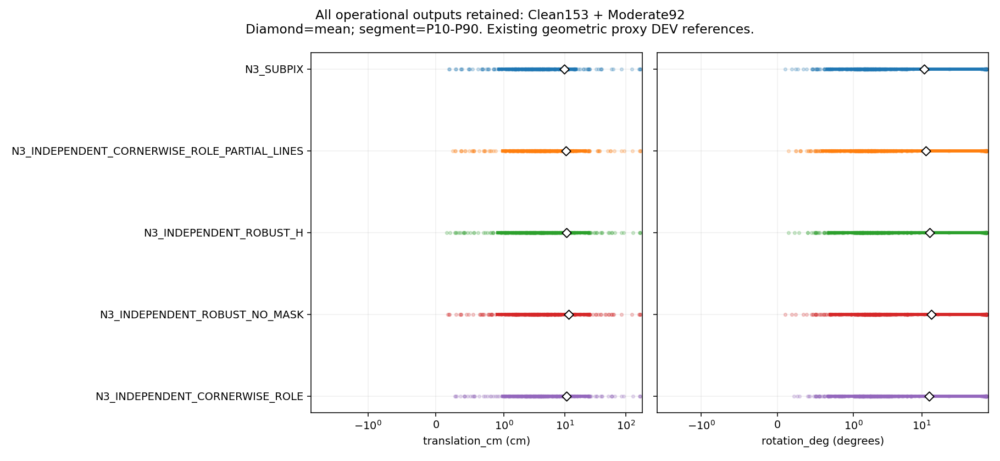
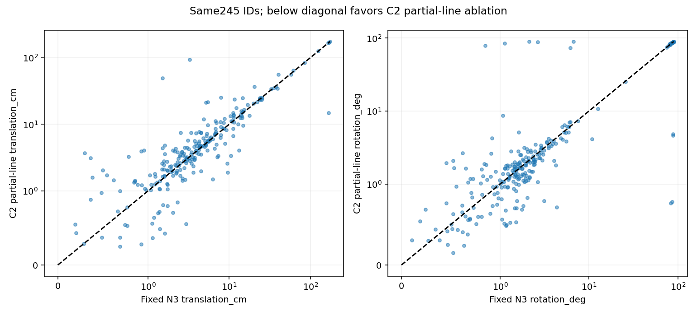
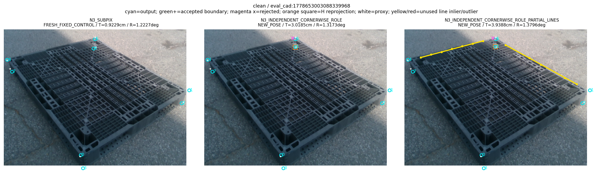
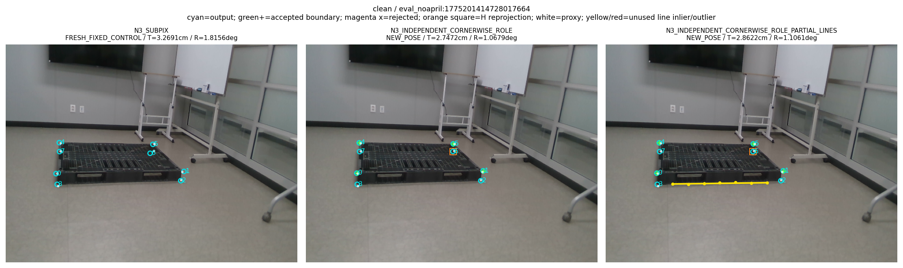
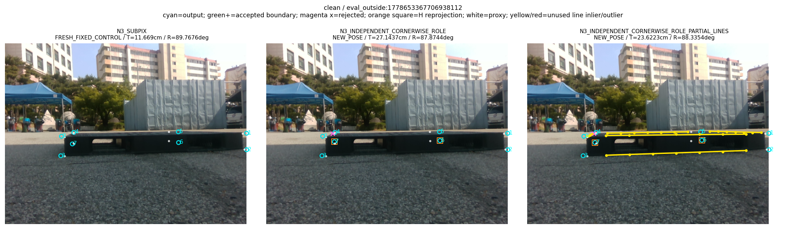
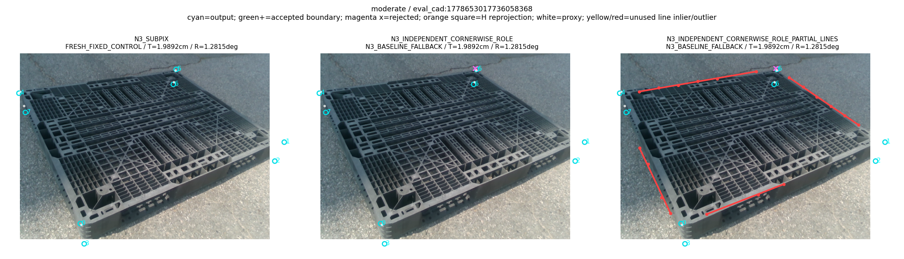
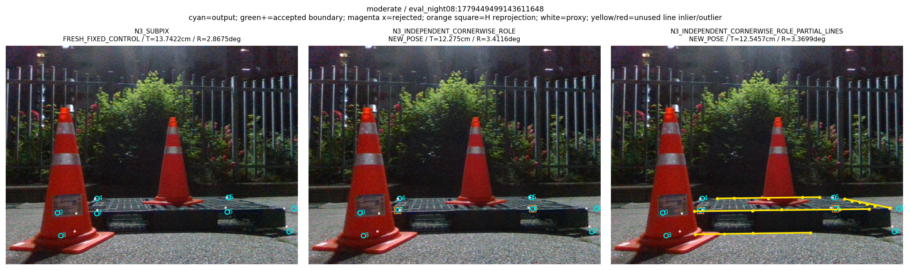
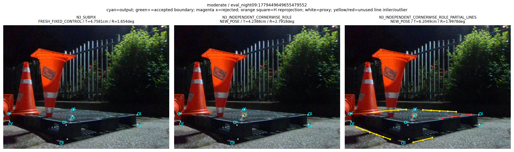

“가림 판단이 일부 틀려도 다른 유효 대응점으로 자세를 구하고 자기 가림 코너를 재투영했을 때, 기존 단순 대조보다 실제 위치·회전이 좋아졌는가?”

**고정 N3→cornerSubPix와 비교하면 아직 아니다.** 쉬움·중간 245장의 전체 운용 출력에서 v5 C2의 위치 평균은 **10.294998cm**, 회전 평균은 **11.522040°**다. 고정 N3의 **9.754548cm / 10.914842°**보다 두 평균 모두 높다. ADDsym도 **18.039197cm 대 17.028647cm**다. 따라서 원래 최상위 목표는 미달성이다. 이 답은 4개의 기본 출력 반환을 포함한 동일한 245장에 근거한다.

이번 부분 선 절제는 같은 관측을 사용한 v4 점 전용 경로의 **10.703396cm / 12.770245°**보다 두 평균을 낮췄고, Base의 **12.188351cm / 14.232844°**보다도 낮다. v5−v4의 세 평균 차이에 대한 기존 session bootstrap 95% CI는 모두 0 아래다. 그러나 v5−N3의 CI는 모두 0을 포함하므로, 관측된 평균 악화를 모집단의 유의한 악화로 확대하지 않는다. v4 대비 개선과 N3 대비 목표 실패를 함께 보고한다.

이 보고서는 [PROTOCOL.json](PROTOCOL.json) SHA256 `0e66102ea9345f6d66e94441506fa796417ad9e340ad008591f4606bf668956a`로 고정한 **같은 IMAGE_ROLE 관측의 C2 부분 선 절제** 결과다. 실사 결과를 본 뒤 head·calibration·8px 기준·seed·최적화량을 바꾸지 않았다. 새 학습, 새 RGB, 새 수동 어노테이션은 각각 0이다. 원행·코드·실행량과 독립 산술 검산을 공개하며, 이 단계의 게시 SHA는 루트의 별도 publication receipt를 따른다.

## 이번에 바꾼 단계와 코너 특성의 정확한 의미

코너 후보는 고정 Base 키포인트가 정의하는 12개 semantic edge의 각 7개 query에서 출발한다. 각 query는 법선 방향 −32…+32px의 65개 후보와 NONE 한 항목을 예측한다. 두 관측 선의 교점, 지지 query의 수·간격, 마지막 선 fit의 지지 반경, 교차각·외삽·공분산을 사용해 코너 후보를 만든다. 초기 virtual cuboid의 hull 역할은 보조 특징이다. [기존 model.py:47](../../../scripts/research/pallet_observation_refiner_20261009_v1/model.py#L47)의 role은 초기 자세 재투영 8점의 convex hull에 포함되는 변 / 내부 변 / 초기 자세 없음이다. **실사에서 물리적으로 어느 팔레트 경계를 관측했는지 인증하는 분류가 아니다.**

학습 objective도 모든 가림 종류를 분류하는 것이 아니라 해당 query의 후보 위치 또는 대응 없음을 예측한다. 초기 Base 특징·role·H가 남아 있으므로 후단 numeric pose prior를 없앴다고 모델 전체의 통계적 독립성을 주장하지 않는다. 실사 선을 source의 physical wire registry에 대응시킨 semantic 가정과 실제 물리 경계 소유권 검증은 다른 문제다.

v4에서 이미 수리한 코너별 LOO를 그대로 유지했다. 검사 코너 k와 자기 가림 H의 초기 좌표를 실제 fit pool에서 제외하고 다른 N3 대응점으로 자세를 구한다. solver에는 초기 R,t·8점 재투영·초기 치수 분기를 넘기지 않는다. 같은 고정 8px N3 basin 안의 실제 경계 후보가 heldout 재투영 잔차를 엄격히 낮출 때만 채택한다. [v5 pipeline.py:28](../../../scripts/research/pallet_partial_line_independent_20261010_v5/pipeline.py#L28)의 두 경계 경로는 같은 LOO 선택을 공유한다. 선은 LOO 선택에 들어가지 않는다.

**v5의 새 변화는 최종 자세 fit에서 아직 코너를 만드는 데 쓰이지 않은 같은 IMAGE_ROLE 선을 추가한 것**이다. [pipeline.py:42](../../../scripts/research/pallet_partial_line_independent_20261010_v5/pipeline.py#L42)와 [solver.py:27](../../../scripts/research/pallet_partial_line_independent_20261010_v5/solver.py#L27)에 고정 정책이 있다. 동일 코너 좌표가 실제 채택되고 fit pool에 있을 때 그 코너의 incident edge를 제거한다. 다른 선은 각 semantic edge당 한 factor만 남긴다. [solver.py:148](../../../scripts/research/pallet_partial_line_independent_20261010_v5/solver.py#L148)는 중복·소유 ID·지지 query·최종 선 잔차를 검사한다. 동일 선의 여러 query나 두 3D 끝점을 독립 관측 수로 세지 않는다.

같은 좌표·K·등록 치수·4점 ID의 SQPnP/IPPE 가설을 재사용하며, 두 등록 치수 분기를 모두 유지한다. 모든 가설을 같은 허용 point/line pool로 채점하고 최대 3개 시작 해를 `soft_l1`, f_scale8px, max_nfev50으로 정제한다. 실제 point inlier가 최소4개 있어야 한다. 전체 point+edge inlier 수를 우선하므로 4점+7선이 7점+0선보다 높은 점수를 받을 수 있다. 이 절제가 기존 point consensus를 항상 보존한다는 주장은 하지 않는다.

모델 법선으로 평가한 local joint rank6, cheirality, 물리적 다중해 처리를 확인한 해만 NEW로 채택한다. rank6은 국소 조건이며 전역 유일성이나 실제 물리 대응의 정확도를 보증하지 않는다. 선 pool이 비면 변경 없는 v4 점 솔버로 정확히 위임한다. 실제 점4개를 확보하지 못하면 독립 global PnL로 구조를 구제하지 않고 `SUPPLEMENTAL_LINE_UNAVAILABLE`을 남긴다.

NEW R,t가 얻어진 뒤에만 H 코너의 초기 좌표를 재투영으로 교체한다. H가 어떤 선의 등록 끝점이더라도 보이는 선 관측 자체는 이용할 수 있다. H의 초기 2D 좌표는 fit에 넣지 않으며 재투영점을 다시 관측처럼 fit하지 않는다. NEW가 없을 때 기존 N3 출력 반환은 실패 대신 **fallback**으로 별도 기록한다.

## 평가 모집단과 봉인

최신 사용자 범위에 따라 기존 UI label `clean` 153장과 `moderate` 92장만 포함했다. `severe` 74장은 이번 모든 정확도·시간 panel에서 제외했다. 원래 전체319 자료는 기존 게시 이력에 보존되어 있다. 중간 label에는 부분 가림이 있을 수 있으며, 이 245장을 무가림이라고 부르지 않는다. [COHORT.json](../pallet_kp_corrected_supervision_20261010_v1/COHORT.json)에 319개 원래 label 출처·245 ID·13 session이 고정되어 있다. 성능으로 frame을 고르지 않았다.

fresh RGB245를 실제 detector/N3/ROLE에 통과시켜 4방법 geometry980행과 Base/N3 고정 control490행, observation245행을 먼저 봉인했다. [INFERENCE_RECEIPT.json](INFERENCE_RECEIPT.json)은 complete=true, cleanup_error=null, GT 접근 false다. [evaluate.py:85](../../../scripts/research/pallet_partial_line_independent_20261010_v5/evaluate.py#L85)는 완전 seal·245 ID·980/490행·GT-free 필드를 검사한다. 그 뒤 기존 v4 control의 좌표·R,t·치수·branch·상태·inlier·결정 parity를 먼저 확인하고 reference를 읽는다. [V4_CONTROL_PARITY.json](V4_CONTROL_PARITY.json)의 245 control geometry는 실제 수치 모두 정확히 일치했다.

GT/reference scoring은 seal 후 한 번 수행했다. 점수 단계에서는 PnP/모델 fit을 canary로 금지했다. 실제 위치·회전·ADDsym은 기존 고정 평가 reference로 계산하며, 아래 코너/선 오차는 **같은 고정 N3 phase의 GEOMETRIC_PROXY**와의 좌표 일치다. 이 공개 산술은 독립 실측 GT나 visible physical edge ownership을 인증하지 않는다. [SCORING_RECEIPT.json](SCORING_RECEIPT.json)에 원행 SHA·axis alias·reference 계약과 새 fit0이 남아 있다.

## 전체 운용 결과 245장

표본분산은 `ddof=1`, 표준편차는 그 제곱근이다. 단위별 분산은 cm² 또는 degree²다. 원행에서 계산한 모든 큰 오차와 최대값을 유지했다. [METRICS.json](METRICS.json), [METRICS.csv](METRICS.csv), [PER_FRAME.csv](PER_FRAME.csv)에 반올림하지 않은 수치와 ID가 있다.

| 방법 | 전체 분모 | 운용 출력 | 새 자세 | 기본 출력 반환 | 완전 실패 | 고정 대조 |
|---|---:|---:|---:|---:|---:|---:|
| Base | 245 | 245 | 0 | 0 | 0 | 245 |
| 고정 N3+SubPix | 245 | 245 | 0 | 0 | 0 | 245 |
| v5 C2 점+부분 선 | 245 | 245 | 241 | 4 | 0 | 0 |
| v4 점 전용 | 245 | 245 | 238 | 7 | 0 | 0 |
| N3 무학습 강건+예측 H | 245 | 245 | 238 | 7 | 0 | 0 |
| N3 무학습 강건·마스크 없음 | 245 | 245 | 244 | 1 | 0 | 0 |

| 방법 | 척도 | n | 평균 | 표본분산 | 표준편차 | 중앙값 | P90 | 최대 |
|---|---|---:|---:|---:|---:|---:|---:|---:|
| Base | 위치 cm | 245 | 12.188351 | 538.579067 | 23.207306 | 6.010803 | 23.191872 | 183.078505 |
| Base | 회전 ° | 245 | 14.232844 | 851.384155 | 29.178488 | 1.839738 | 82.810639 | 90.009175 |
| Base | ADDsym cm | 245 | 22.431946 | 1506.002205 | 38.807244 | 6.405062 | 110.036532 | 188.991522 |
| 고정 N3+SubPix | 위치 cm | 245 | 9.754548 | 575.936024 | 23.998667 | 3.597350 | 15.085014 | 174.756827 |
| 고정 N3+SubPix | 회전 ° | 245 | 10.914842 | 665.180601 | 25.791095 | 1.665993 | 76.095325 | 89.777634 |
| 고정 N3+SubPix | ADDsym cm | 245 | 17.028647 | 1298.810870 | 36.039019 | 3.936935 | 68.431494 | 180.988442 |
| v5 C2 점+부분 선 | 위치 cm | 245 | 10.294998 | 522.867317 | 22.866292 | 3.938841 | 21.546865 | 174.030423 |
| v5 C2 점+부분 선 | 회전 ° | 245 | 11.522040 | 706.941077 | 26.588364 | 1.687514 | 78.579875 | 89.698056 |
| v5 C2 점+부분 선 | ADDsym cm | 245 | 18.039197 | 1316.590904 | 36.284858 | 4.172495 | 72.177892 | 180.534265 |
| v4 점 전용 | 위치 cm | 245 | 10.703396 | 534.421608 | 23.117561 | 3.922615 | 23.998861 | 169.893223 |
| v4 점 전용 | 회전 ° | 245 | 12.770245 | 771.380692 | 27.773741 | 1.823836 | 82.422410 | 90.101532 |
| v4 점 전용 | ADDsym cm | 245 | 19.460018 | 1438.098940 | 37.922275 | 4.219500 | 79.839997 | 176.470605 |
| N3 무학습 강건+예측 H | 위치 cm | 245 | 10.621961 | 536.238431 | 23.156823 | 3.922615 | 24.064985 | 169.893223 |
| N3 무학습 강건+예측 H | 회전 ° | 245 | 13.112718 | 791.161552 | 28.127594 | 1.893088 | 83.086081 | 90.101532 |
| N3 무학습 강건+예측 H | ADDsym cm | 245 | 19.681472 | 1478.199236 | 38.447357 | 4.155492 | 87.361273 | 176.470605 |
| N3 무학습 강건·마스크 없음 | 위치 cm | 245 | 11.596382 | 621.465996 | 24.929220 | 3.933522 | 24.972917 | 174.756827 |
| N3 무학습 강건·마스크 없음 | 회전 ° | 245 | 13.899846 | 831.978834 | 28.844043 | 2.022187 | 83.548376 | 89.812692 |
| N3 무학습 강건·마스크 없음 | ADDsym cm | 245 | 20.510338 | 1513.111722 | 38.898737 | 4.337446 | 86.240358 | 180.988442 |

모든 방법의 공통 운용 산출집합은 245장이다. v5의 NEW241장만 골라서 전체 결과처럼 비교하지 않는다. 완전 실패는0이지만 fallback4개가 존재하므로 새 자세 산출률과 전체 반환율도 구별한다. Base/N3는 `FRESH_FIXED_CONTROL`이며 이 통계에서 NEW로 이름을 바꾸지 않는다.

같은245장 위치·회전·ADDsym 분포다. 큰 오차를 지우지 않았으며 분포와 꼬리를 함께 보여준다.

### 쉬움 153장

| 방법 | 전체 분모 | 운용 출력 | 새 자세 | 기본 출력 반환 | 완전 실패 | 고정 대조 |
|---|---:|---:|---:|---:|---:|---:|
| Base | 153 | 153 | 0 | 0 | 0 | 153 |
| 고정 N3+SubPix | 153 | 153 | 0 | 0 | 0 | 153 |
| v5 C2 점+부분 선 | 153 | 153 | 152 | 1 | 0 | 0 |
| v4 점 전용 | 153 | 153 | 152 | 1 | 0 | 0 |
| N3 무학습 강건+예측 H | 153 | 153 | 152 | 1 | 0 | 0 |
| N3 무학습 강건·마스크 없음 | 153 | 153 | 153 | 0 | 0 | 0 |

| 방법 | 척도 | n | 평균 | 표본분산 | 표준편차 | 중앙값 | P90 | 최대 |
|---|---|---:|---:|---:|---:|---:|---:|---:|
| Base | 위치 cm | 153 | 12.846348 | 790.451432 | 28.114968 | 4.668214 | 19.836603 | 183.078505 |
| Base | 회전 ° | 153 | 10.628205 | 616.624794 | 24.831931 | 1.715556 | 50.873619 | 89.479285 |
| Base | ADDsym cm | 153 | 17.938605 | 1268.885882 | 35.621424 | 5.516163 | 53.332337 | 188.991522 |
| 고정 N3+SubPix | 위치 cm | 153 | 10.107073 | 859.717470 | 29.320939 | 2.691885 | 12.762646 | 174.756827 |
| 고정 N3+SubPix | 회전 ° | 153 | 7.584578 | 435.544581 | 20.869705 | 1.541652 | 5.923153 | 89.767637 |
| 고정 N3+SubPix | ADDsym cm | 153 | 12.915132 | 1130.584507 | 33.624166 | 2.966195 | 14.831169 | 180.988442 |
| v5 C2 점+부분 선 | 위치 cm | 153 | 9.717230 | 705.109279 | 26.553894 | 3.113505 | 14.853794 | 174.030423 |
| v5 C2 점+부분 선 | 회전 ° | 153 | 6.936403 | 397.008898 | 19.925082 | 1.435510 | 5.858028 | 89.310784 |
| v5 C2 점+부분 선 | ADDsym cm | 153 | 12.243736 | 968.181082 | 31.115608 | 3.549798 | 15.141727 | 180.534265 |
| v4 점 전용 | 위치 cm | 153 | 9.775721 | 704.946412 | 26.550827 | 3.018543 | 15.477871 | 169.893223 |
| v4 점 전용 | 회전 ° | 153 | 7.640959 | 432.212582 | 20.789723 | 1.582494 | 7.221626 | 87.874438 |
| v4 점 전용 | ADDsym cm | 153 | 12.649798 | 985.779039 | 31.397118 | 3.325252 | 16.160239 | 176.470605 |
| N3 무학습 강건+예측 H | 위치 cm | 153 | 9.626309 | 706.776184 | 26.585263 | 2.861502 | 15.477871 | 169.893223 |
| N3 무학습 강건+예측 H | 회전 ° | 153 | 7.640489 | 432.162151 | 20.788510 | 1.506441 | 7.221626 | 87.874438 |
| N3 무학습 강건+예측 H | ADDsym cm | 153 | 12.521833 | 987.950955 | 31.431687 | 3.111095 | 16.160239 | 176.470605 |
| N3 무학습 강건·마스크 없음 | 위치 cm | 153 | 10.643086 | 862.204558 | 29.363320 | 2.964637 | 15.458323 | 174.756827 |
| N3 무학습 강건·마스크 없음 | 회전 ° | 153 | 8.336070 | 476.113687 | 21.820029 | 1.705115 | 7.334818 | 89.812692 |
| N3 무학습 강건·마스크 없음 | ADDsym cm | 153 | 13.643686 | 1152.879568 | 33.954080 | 3.307872 | 16.489381 | 180.988442 |

### 중간 92장

| 방법 | 전체 분모 | 운용 출력 | 새 자세 | 기본 출력 반환 | 완전 실패 | 고정 대조 |
|---|---:|---:|---:|---:|---:|---:|
| Base | 92 | 92 | 0 | 0 | 0 | 92 |
| 고정 N3+SubPix | 92 | 92 | 0 | 0 | 0 | 92 |
| v5 C2 점+부분 선 | 92 | 92 | 89 | 3 | 0 | 0 |
| v4 점 전용 | 92 | 92 | 86 | 6 | 0 | 0 |
| N3 무학습 강건+예측 H | 92 | 92 | 86 | 6 | 0 | 0 |
| N3 무학습 강건·마스크 없음 | 92 | 92 | 91 | 1 | 0 | 0 |

| 방법 | 척도 | n | 평균 | 표본분산 | 표준편차 | 중앙값 | P90 | 최대 |
|---|---|---:|---:|---:|---:|---:|---:|---:|
| Base | 위치 cm | 92 | 11.094074 | 121.849087 | 11.038527 | 7.851390 | 26.036089 | 60.431862 |
| Base | 회전 ° | 92 | 20.227517 | 1194.688456 | 34.564266 | 1.998780 | 86.159213 | 90.009175 |
| Base | ADDsym cm | 92 | 29.904567 | 1828.214398 | 42.757624 | 8.142242 | 116.222803 | 121.238948 |
| 고정 N3+SubPix | 위치 cm | 92 | 9.168284 | 107.699997 | 10.377861 | 5.220474 | 23.637317 | 61.923605 |
| 고정 N3+SubPix | 회전 ° | 92 | 16.453215 | 1006.400563 | 31.723817 | 1.981300 | 85.510157 | 89.777634 |
| 고정 N3+SubPix | ADDsym cm | 92 | 23.869600 | 1518.314503 | 38.965555 | 5.436086 | 112.131374 | 121.344766 |
| v5 C2 점+부분 선 | 위치 cm | 92 | 11.255852 | 222.714317 | 14.923616 | 5.647105 | 24.402182 | 93.902180 |
| v5 C2 점+부분 선 | 회전 ° | 92 | 19.148153 | 1138.246994 | 33.737916 | 2.044532 | 86.007813 | 89.698056 |
| v5 C2 점+부분 선 | ADDsym cm | 92 | 27.677299 | 1762.633313 | 41.983727 | 6.421333 | 114.903226 | 138.002780 |
| v4 점 전용 | 위치 cm | 92 | 12.246160 | 251.608547 | 15.862173 | 6.417617 | 30.733489 | 92.078251 |
| v4 점 전용 | 회전 ° | 92 | 21.300470 | 1228.580824 | 35.051117 | 2.448320 | 86.909988 | 90.101532 |
| v4 점 전용 | ADDsym cm | 92 | 30.785711 | 2001.766625 | 44.741107 | 6.738329 | 117.257672 | 137.234322 |
| N3 무학습 강건+예측 H | 위치 cm | 92 | 12.277774 | 252.838319 | 15.900890 | 6.269494 | 31.204446 | 92.078251 |
| N3 무학습 강건+예측 H | 회전 ° | 92 | 22.213271 | 1265.425247 | 35.572816 | 2.584769 | 86.909988 | 90.101532 |
| N3 무학습 강건+예측 H | ADDsym cm | 92 | 31.588264 | 2083.804690 | 45.648710 | 6.738329 | 118.580808 | 137.234322 |
| N3 무학습 강건·마스크 없음 | 위치 cm | 92 | 13.181756 | 222.113562 | 14.903475 | 6.458656 | 32.544634 | 63.602098 |
| N3 무학습 강건·마스크 없음 | 회전 ° | 92 | 23.152649 | 1296.932146 | 36.012944 | 2.224381 | 87.519935 | 89.777634 |
| N3 무학습 강건·마스크 없음 | ADDsym cm | 92 | 31.929879 | 1920.331117 | 43.821583 | 7.056594 | 114.728146 | 125.048200 |

### NEW 산출집합과 fallback의 분리

다음 표는 combined245에서 방법별 NEW subset이다. 고정 control의 NEW n=0은 출력 부재가 아니라 status 정의다. fallback의 개별 moment는 METRICS의 `metrics.fallback`에 별도 보존한다.

| 방법 | 척도 | n | 평균 | 표본분산 | 표준편차 | 중앙값 | P90 | 최대 |
|---|---|---:|---:|---:|---:|---:|---:|---:|
| Base | 위치 cm | 0 | NA | NA | NA | NA | NA | NA |
| Base | 회전 ° | 0 | NA | NA | NA | NA | NA | NA |
| Base | ADDsym cm | 0 | NA | NA | NA | NA | NA | NA |
| 고정 N3+SubPix | 위치 cm | 0 | NA | NA | NA | NA | NA | NA |
| 고정 N3+SubPix | 회전 ° | 0 | NA | NA | NA | NA | NA | NA |
| 고정 N3+SubPix | ADDsym cm | 0 | NA | NA | NA | NA | NA | NA |
| v5 C2 점+부분 선 | 위치 cm | 241 | 10.438412 | 530.305813 | 23.028370 | 3.983645 | 21.613977 | 174.030423 |
| v5 C2 점+부분 선 | 회전 ° | 241 | 11.695446 | 716.871680 | 26.774459 | 1.726739 | 79.419400 | 89.698056 |
| v5 C2 점+부분 선 | ADDsym cm | 241 | 18.306797 | 1334.123649 | 36.525657 | 4.317921 | 72.481178 | 180.534265 |
| v4 점 전용 | 위치 cm | 238 | 10.960415 | 547.866733 | 23.406553 | 4.025256 | 24.115178 | 169.893223 |
| v4 점 전용 | 회전 ° | 238 | 13.080602 | 790.670067 | 28.118856 | 1.851366 | 83.073865 | 90.101532 |
| v4 점 전용 | ADDsym cm | 238 | 19.955168 | 1471.904459 | 38.365407 | 4.329586 | 85.009504 | 176.470605 |
| N3 무학습 강건+예측 H | 위치 cm | 238 | 10.876586 | 549.780290 | 23.447394 | 4.029008 | 24.187595 | 169.893223 |
| N3 무학습 강건+예측 H | 회전 ° | 238 | 13.433147 | 810.811853 | 28.474758 | 1.905686 | 83.240066 | 90.101532 |
| N3 무학습 강건+예측 H | ADDsym cm | 238 | 20.183135 | 1512.960952 | 38.896799 | 4.240576 | 94.780968 | 176.470605 |
| N3 무학습 강건·마스크 없음 | 위치 cm | 244 | 11.633067 | 623.692407 | 24.973834 | 3.967202 | 24.981396 | 174.756827 |
| N3 무학습 강건·마스크 없음 | 회전 ° | 244 | 13.931663 | 835.153588 | 28.899024 | 2.014836 | 83.846494 | 89.812692 |
| N3 무학습 강건·마스크 없음 | ADDsym cm | 244 | 20.572335 | 1518.392947 | 38.966562 | 4.320765 | 86.306280 | 180.988442 |

## 동일 영상의 평균 차이와 불확실성

아래는 **후보−비교**이며 음수일수록 후보의 오차가 작다. 기존 13 session의 10,000×13 draw를 그대로 재사용했다. 새 draw0, 설정선택0이다. 같은 session 영상은 함께 재표집하므로 영상별 독립 bootstrap으로 표본 수를 부풀리지 않았다. 모든 pair ID, nonempty resample 수와 strata/scope/metric을 저장했다. 비교대상이 fixed control이면 both-NEW는 정의상 n=0/CI=NA이며, common operational n=245 비교가 사라지는 것은 아니다.

| 후보 − 비교 | 산출집합 | n | 위치 Δ cm [95% CI] | 회전 Δ ° [95% CI] | ADDsym Δ cm [95% CI] |
|---|---|---:|---|---|---|
| v5 C2 점+부분 선 − 고정 N3+SubPix | 공통 운용 | 245 | 0.540450 [-0.817336, 2.016955] | 0.607198 [-0.628239, 2.276099] | 1.010550 [-0.690953, 3.247997] |
| v5 C2 점+부분 선 − 고정 N3+SubPix | 후보 새 자세 | 241 | 0.549421 [-0.827494, 2.055200] | 0.617276 [-0.631169, 2.357573] | 1.027323 [-0.695485, 3.335565] |
| v5 C2 점+부분 선 − 고정 N3+SubPix | 양쪽 새 자세 | 0 | NA | NA | NA |
| v5 C2 점+부분 선 − v4 점 전용 | 공통 운용 | 245 | -0.408397 [-0.833330, -0.034991] | -1.248205 [-2.674569, -0.304531] | -1.420822 [-3.311159, -0.178191] |
| v5 C2 점+부분 선 − v4 점 전용 | 후보 새 자세 | 241 | -0.415176 [-0.866048, -0.035091] | -1.268922 [-2.715044, -0.312616] | -1.444404 [-3.375905, -0.185456] |
| v5 C2 점+부분 선 − v4 점 전용 | 양쪽 새 자세 | 238 | -0.417009 [-0.885406, -0.034488] | -1.591556 [-3.287570, -0.498665] | -1.706616 [-3.805974, -0.352104] |
| v5 C2 점+부분 선 − N3 무학습 강건+예측 H | 공통 운용 | 245 | -0.326963 [-0.990476, 0.137824] | -1.590678 [-3.215484, -0.538423] | -1.642275 [-3.833148, -0.261460] |
| v5 C2 점+부분 선 − N3 무학습 강건+예측 H | 후보 새 자세 | 241 | -0.332389 [-1.021861, 0.138913] | -1.617079 [-3.267192, -0.550759] | -1.669533 [-3.892790, -0.264871] |
| v5 C2 점+부분 선 − N3 무학습 강건+예측 H | 양쪽 새 자세 | 238 | -0.333180 [-1.046401, 0.138913] | -1.944101 [-3.747487, -0.733952] | -1.934583 [-4.323027, -0.408589] |
| v5 C2 점+부분 선 − N3 무학습 강건·마스크 없음 | 공통 운용 | 245 | -1.301384 [-3.435916, 0.502452] | -2.377807 [-4.954687, -0.474871] | -2.471141 [-5.664455, -0.025711] |
| v5 C2 점+부분 선 − N3 무학습 강건·마스크 없음 | 후보 새 자세 | 241 | -0.910282 [-2.715093, 0.689746] | -1.686266 [-3.696872, -0.145948] | -1.653877 [-4.264470, 0.409507] |
| v5 C2 점+부분 선 − N3 무학습 강건·마스크 없음 | 양쪽 새 자세 | 240 | -0.909015 [-2.730286, 0.689746] | -1.974016 [-4.454851, -0.189661] | -1.884831 [-4.868818, 0.343069] |
| v5 C2 점+부분 선 − Base | 공통 운용 | 245 | -1.893353 [-4.030302, 1.015867] | -2.710805 [-5.749249, 1.408653] | -4.392749 [-9.833321, 1.330661] |
| v5 C2 점+부분 선 − Base | 후보 새 자세 | 241 | -1.918274 [-4.061906, 1.058684] | -2.747697 [-5.788542, 1.459046] | -4.460075 [-9.899232, 1.370778] |
| v5 C2 점+부분 선 − Base | 양쪽 새 자세 | 0 | NA | NA | NA |
| N3 무학습 강건+예측 H − N3 무학습 강건·마스크 없음 | 공통 운용 | 245 | -0.974421 [-2.905347, 0.976808] | -0.787129 [-3.469172, 1.879035] | -0.828866 [-4.056081, 2.432616] |
| N3 무학습 강건+예측 H − N3 무학습 강건·마스크 없음 | 후보 새 자세 | 238 | -0.554539 [-2.256221, 1.209123] | -0.007887 [-2.115601, 2.323923] | 0.059031 [-2.640821, 3.029556] |
| N3 무학습 강건+예측 H − N3 무학습 강건·마스크 없음 | 양쪽 새 자세 | 238 | -0.554539 [-2.256221, 1.209123] | -0.007887 [-2.115601, 2.323923] | 0.059031 [-2.640821, 3.029556] |
| N3 무학습 강건·마스크 없음 − 고정 N3+SubPix | 공통 운용 | 245 | 1.841834 [0.403284, 4.168906] | 2.985004 [0.760492, 6.544283] | 3.481691 [0.815058, 7.934522] |
| N3 무학습 강건·마스크 없음 − 고정 N3+SubPix | 후보 새 자세 | 244 | 1.849383 [0.403284, 4.211677] | 2.997238 [0.760492, 6.614527] | 3.495961 [0.816799, 8.008896] |
| N3 무학습 강건·마스크 없음 − 고정 N3+SubPix | 양쪽 새 자세 | 0 | NA | NA | NA |

v5−N3의 전체 평균 차이는 위치+0.540450cm, 회전+0.607198°, ADDsym+1.010550cm이며 CI가 모두0을 포함한다. v5−v4는 위치−0.408397cm, 회전−1.248205°, ADDsym−1.420822cm이고 세 CI가0 아래다. 같은 관측의 부분 선 효과를 v4 대비 개선으로 보고할 수 있지만 원래 N3 대비 목표 성공으로 바꾸지 않는다. 7개 contrast를 함께 공개하므로 일부 유리한 값만 선택한 유의성 주장은 하지 않는다.

쉬움 strata의 primary 공통 운용 비교:

| 후보 − 비교 | 산출집합 | n | 위치 Δ cm [95% CI] | 회전 Δ ° [95% CI] | ADDsym Δ cm [95% CI] |
|---|---|---:|---|---|---|
| v5 C2 점+부분 선 − 고정 N3+SubPix | 공통 운용 | 153 | -0.389842 [-2.051985, 1.125936] | -0.648175 [-1.491261, 0.045406] | -0.671396 [-2.340503, 0.754822] |
| v5 C2 점+부분 선 − v4 점 전용 | 공통 운용 | 153 | -0.058491 [-0.745791, 0.347332] | -0.704556 [-2.104570, -0.062634] | -0.406062 [-1.836459, 0.296370] |
| v5 C2 점+부분 선 − N3 무학습 강건+예측 H | 공통 운용 | 153 | 0.090921 [-0.750993, 0.678166] | -0.704086 [-2.106310, -0.059622] | -0.278097 [-1.815979, 0.588346] |
| v5 C2 점+부분 선 − N3 무학습 강건·마스크 없음 | 공통 운용 | 153 | -0.925856 [-2.330517, 0.464789] | -1.399666 [-2.648308, -0.222422] | -1.399950 [-2.869094, 0.291843] |
| v5 C2 점+부분 선 − Base | 공통 운용 | 153 | -3.129118 [-5.949445, 1.039290] | -3.691802 [-6.904241, 1.218315] | -5.694869 [-12.140635, 1.315807] |

중간 strata의 primary 공통 운용 비교:

| 후보 − 비교 | 산출집합 | n | 위치 Δ cm [95% CI] | 회전 Δ ° [95% CI] | ADDsym Δ cm [95% CI] |
|---|---|---:|---|---|---|
| v5 C2 점+부분 선 − 고정 N3+SubPix | 공통 운용 | 92 | 2.087568 [0.366290, 4.822776] | 2.694938 [0.042661, 6.596928] | 3.807700 [0.629191, 9.174753] |
| v5 C2 점+부분 선 − v4 점 전용 | 공통 운용 | 92 | -0.990307 [-2.067417, -0.048700] | -2.152317 [-5.706804, 1.098738] | -3.108412 [-7.504583, 0.682475] |
| v5 C2 점+부분 선 − N3 무학습 강건+예측 H | 공통 운용 | 92 | -1.021921 [-2.260216, 0.177824] | -3.065118 [-6.800247, 0.426064] | -3.910964 [-8.608204, 0.308161] |
| v5 C2 점+부분 선 − N3 무학습 강건·마스크 없음 | 공통 운용 | 92 | -1.925903 [-7.939293, 2.119889] | -4.004496 [-11.489160, 0.622223] | -4.252580 [-13.392730, 1.754937] |
| v5 C2 점+부분 선 − Base | 공통 운용 | 92 | 0.161779 [-1.383651, 2.358528] | -1.079364 [-5.620831, 4.180895] | -2.227268 [-7.922507, 4.687072] |

각 점은 같은 frame의 N3와 v5 오차다. 대각선 아래·위가 각각 v5 개선·악화다. 전체 평균과 달리 어느 영상이 바뀌었는지 확인할 수 있으며 사례 선택이나 threshold 결정에 쓰지 않았다.

## 가림 판단, 코너 선택, 강건 합의, 재투영의 효과를 분리

가림을 완벽하게 맞추는 것을 성공 조건으로 삼지 않았다. 알려진 사람 visibility와 초기 N3 H의 차이가 있어도 남은 대응점으로 solver를 실행했다. 최종 H가 초기 H와 바뀐 frame10개도 별도 기록하며 frame 전체 실패로 바꾸지 않았다. primary의 known-mask 결과는 다음과 같다. 모든 개선/악화는 fixed N3의 위치·회전 두 척도에 대한 엄격한 비교다.

| 초기 H의 known-label 관계 | 위치·회전 모두 개선 | 모두 악화 | 혼합 또는 동일 | 합계 |
|---|---:|---:|---:|---:|
| 틀림 | 13 | 17 | 31 | 61 |
| known label과 일치 | 39 | 52 | 93 | 184 |

`known label과 일치`는 알려진 코너에 대한 일치이며 모든 가림 유형의 완전 정답을 뜻하지 않는다. 가림이 틀려도 자세가 좋아진13개와 맞아도 나빠진52개가 공존한다. 따라서 가림 분류 오류 수로 최종 성능을 대체하지 않는다. 정확한 ID와 NEW/fallback 구분은 METRICS의 diagnostics와 [POSTHOC_ROWS.jsonl.gz](POSTHOC_ROWS.jsonl.gz)에 남겼다.

새 ROLE 보정이 꼭 필요하다는 결론도 아직 없다. 같은 fixed N3의 무학습·maskless robust control은 전체 위치11.596382cm/회전13.899846°이며, masked native control은10.621961cm/13.112718°다. v5는 이 두 control의 회전 평균을 낮췄지만 simple N3를 이기지 못한다. 마스크 효과는 native-H 대 no-mask CI로, 경계 선택 효과는 point-only boundary 대 native-H의 전체 raw 결과로, 부분 선 효과는 v5 대 v4의 고정 절제로 구별한다. 이번에는 새 role classifier를 따로 학습하거나 oracle 사람 mask를 배포 input으로 사용하지 않았다.

코너 단계에서는 admission을 통과한447개 후보 중 proxy 오차가 N3보다 작은192개와 큰255개가 있었다. 기존 prior-free point-only LOO가 실제423회 구해졌고 최종 boundary133개를 채택했다. 채택133개는 **80개 개선·53개 악화**, 평균 좌표 오차 차이−0.249754px다. 후보447개의 평균 차이는+0.662342px다. 선택은 불리한 후보를 상당수 제외하지만 매번 더 정확한 대응을 고르는 것은 아니다. source covariance와 작은 선 RMS가 실사 절대·상대 정확도를 보증한다는 증거는 없다. 이 관측은 후단 자세 오차의 물리적 원인 비율을 식별한 결과가 아니다.

| 후보 판단 | 후보 수 |
|---|---:|
| 고정 N3 8px basin 밖 | 24 |
| heldout 자세가 경계를 지지하지 않음 | 137 |
| heldout 자세 불가 | 19 |
| heldout 자세가 N3 선호 | 131 |
| heldout 자세가 실제 경계 후보 선호 | 133 |
| heldout 자세 다중해 | 3 |

### 실제 부분 선과 proxy의 일치

[LINE_QUALITY_PROTOCOL.json](LINE_QUALITY_PROTOCOL.json)은 **기하 봉인·점수화·통계가 완료된 뒤**, 기존8px 정의를 재사용해 별도 산술 code·입력(PREDICTIONS SHA 포함)을 해당 산술 실행 전에 freeze한 추가 감사다. 이 supplemental protocol을 accuracy 실험의 사전등록이라고 부르지 않는다. 실제 성능 방법과8px 기준은 이전 core v5 PROTOCOL로 GT 접근 전에 고정됐으며, 이 감사에서 real-score tuning은0이다. [LINE_QUALITY_CHECKS.json](LINE_QUALITY_CHECKS.json)은 실제 unused pool, consumed edge, final NEW inlier, fallback 후보를 나눠 한 번 검산했다. 선 metric은 정규화 normal/offset과 **기존 proxy의 두 등록 끝점** 사이 법선 거리의 RMS다. 선 위에서의 3D 지지 비율, 실사 visible boundary 또는 실제 mesh 소유권을 측정한 것이 아니다. unmatched·끝점 미확인·invalid reference는 UNKNOWN이다.

| 선 집합 | proxy RMS≤8px | RMS>8px | reference 미확인 | 합계 |
|---|---:|---:|---:|---:|
| 같은 IMAGE_ROLE source 선 | 865 | 132 | 17 | 1014 |
| 최종 C2 unused pool | 654 | 122 | 17 | 793 |
| 채택 코너에 의해 consumed | 211 | 10 | 0 | 221 |
| 실제 fit에 쓰인 선 | 579 | 89 | 6 | 674 |
| 승인 NEW의 최종 line inlier | 636 | 101 | 8 | 745 |

source 지지 query5732개 중 unused4448개는 선 factor793개를 지지한다. query4448개를 독립 선4448개라고 세지 않았다. 같은 선의 점과 선을 중복 fit하지 않았음을 candidate15,827개에 대해 확인했다. source-present-but-excluded 추가 line0개이고, point-only delegate86개는 다른 schema로 분리 검산했다.

NEW 최종 line inlier 중101개는 proxy RMS8px를 초과했다. 알려진737개 final line의 RMS는 평균8.742048px, 중앙값2.861861px, P9010.357527px, 최대295.280794px다. **pose에 대한 inlier와 기존 reference에 대한 정확한 대응은 다르다.** 여러 대응이 일관되게 잘못되어도 합의할 수 있고, proxy mismatch가 있는 frame이 실제 pose 개선을 보일 수도 있다. 이101개를 “물리 소유권을 틀린 선101개”라고 재명명하지 않는다. 표와 frame별 group은 [LINE_QUALITY_ROWS.jsonl.gz](LINE_QUALITY_ROWS.jsonl.gz)에 전부 있다.

점의 동일한 구분은 아래와 같다. actual fit 입력, 최종 NEW inlier, fallback에서 거절된 candidate inlier를 혼동하지 않는다.

| 방법·집합 | proxy ≤8px | proxy >8px | 미확인 |
|---|---:|---:|---:|
| v5 C2 점+부분 선 / 허용 대응 pool | 1116 | 465 | 5 |
| v5 C2 점+부분 선 / 실제 fit 입력 | 1056 | 370 | 4 |
| v5 C2 점+부분 선 / 채택 NEW 최종 inlier | 1083 | 383 | 4 |
| v5 C2 점+부분 선 / 반환되지 않은 후보 inlier | 0 | 0 | 0 |
| v4 점 전용 / 허용 대응 pool | 1116 | 465 | 5 |
| v4 점 전용 / 실제 fit 입력 | 1085 | 390 | 4 |
| v4 점 전용 / 채택 NEW 최종 inlier | 1079 | 384 | 2 |
| v4 점 전용 / 반환되지 않은 후보 inlier | 9 | 8 | 2 |
| N3 무학습 강건+예측 H / 허용 대응 pool | 1117 | 464 | 5 |
| N3 무학습 강건+예측 H / 실제 fit 입력 | 1085 | 389 | 4 |
| N3 무학습 강건+예측 H / 채택 NEW 최종 inlier | 1080 | 382 | 2 |
| N3 무학습 강건+예측 H / 반환되지 않은 후보 inlier | 9 | 8 | 2 |
| N3 무학습 강건·마스크 없음 / 허용 대응 pool | 1281 | 599 | 5 |
| N3 무학습 강건·마스크 없음 / 실제 fit 입력 | 1230 | 491 | 5 |
| N3 무학습 강건·마스크 없음 / 채택 NEW 최종 inlier | 1240 | 493 | 5 |
| N3 무학습 강건·마스크 없음 / 반환되지 않은 후보 inlier | 2 | 2 | 0 |

v5 primary의 최종 NEW point inlier는 proxy≤8px1083개, >8px383개, 미확인4개다. 4점 최소조건과 local rank6을 통과했어도 오차가 모두 작다는 뜻은 아니다. primary의 실제 반환 치수는 fixed N3와 같음235장, W/D 교환10장이다. native-H는233/12, no-mask235/10, v4 point-only234/11이다. 분기 변화와 성능의 동반관계는 기록하지만, source 물리 소유권·GT 치수 잘못을 원인으로 단정하지 않는다.

### 직접 가시 손상과 실제 H 재투영

| 코너 집합·좌표 | n | 평균 px | 표본분산 px² | SD px | 중앙값 px | P90 px | 최대 px |
|---|---:|---:|---:|---:|---:|---:|---:|
| 사람 직접 가시 / N3 | 1503 | 19.853024 | 3580.832918 | 59.840061 | 4.428044 | 21.434211 | 498.832332 |
| 사람 직접 가시 / input | 1503 | 19.833529 | 3581.558716 | 59.846125 | 4.401487 | 21.328592 | 498.832332 |
| 사람 직접 가시 / output | 1503 | 19.825251 | 3577.940317 | 59.815887 | 4.400291 | 21.328592 | 498.832332 |
| 사람 자기 가림 / N3 | 335 | 19.654282 | 2632.328827 | 51.306226 | 7.067136 | 26.523562 | 470.485479 |
| 사람 자기 가림 / input | 335 | 19.654282 | 2632.328827 | 51.306226 | 7.067136 | 26.523562 | 470.485479 |
| 사람 자기 가림 / output | 335 | 18.495557 | 2815.270270 | 53.059121 | 4.261768 | 25.315527 | 470.485479 |
| 실제로 재투영한 H / N3 | 294 | 20.053696 | 2426.435224 | 49.258859 | 7.075291 | 27.442433 | 350.084300 |
| 실제로 재투영한 H / input | 294 | 20.053696 | 2426.435224 | 49.258859 | 7.075291 | 27.442433 | 350.084300 |
| 실제로 재투영한 H / output | 294 | 18.641720 | 2615.742311 | 51.144328 | 4.084865 | 26.694107 | 341.546173 |

직접 가시1503개에서 N3 평균19.853024px가 출력19.825251px로 소폭 낮아졌고, 기존≤5px점이 출력>10px로 손상된 개수는0이다. 사람 자기 가림335개와 실제로 NEW에서 재투영한 H294개는 서로 다른 집합이다. 실제 H294개의 평균은20.053696→18.641720px, 중앙값7.075291→4.084865px로 낮아졌다. 해당 hidden 오차 감소를 최종 위치·회전 개선으로 대신하지 않는다. 최종 pose는 N3 대비 여전히 평균 두 척도가 높다. H reference 미확인 출력0, scalar reproject 검사는 NEW961/H876개 전체4arm에 대해 별도로 완료했다.

## 실제 영상의 고정 사례 6개

사례 ID는 기존 [VISUAL_CASE_PROTOCOL.json](../pallet_boundary_corner_refiner_20261010_v2/VISUAL_CASE_PROTOCOL.json)에서 먼저 고정했다. 새 v5 score로 사례를 고르지 않았다. 파생 annotated 이미지이며 새로운 촬영·수동 정답·RGB 생성은 아니다. 원 RGB SHA·사례 선택 규칙·그림 SHA는 [FIGURE_BINDINGS_REPAIR1.json](FIGURE_BINDINGS_REPAIR1.json)에 묶었다. 각 행은 N3 / 변경 없는 v4 점 전용 / v5 C2 순서다.

시안 원과 숫자는 **실제 반환 좌표**다. 초록+는 채택 경계 후보, 분홍×는 거절 후보, 주황 사각형은 실제 H 재투영, 흰 점은 기존 geometric proxy다. v5의 노랑 선·지지점은 unused line inlier, 빨강은 outlier다. 이 색의 inlier 표시는 물리 정답 표시가 아니다. fallback은 후보가 아니라 기본 N3 출력이 그려지며 final inlier로 표현하지 않는다.

### 사례 1: `eval_cad:1778653003088339968`

새 자세이지만 N3보다 위치·회전이 악화한 예. v5의 unused선 [4,9]가 final inlier로 남아도 정확성은 보증되지 않는다.

| 출력 | 상태 | 위치 cm | 회전 ° | 실제 H 교체 ID | 최종 C2 line inlier |
|---|---|---:|---:|---|---|
| 고정 N3+SubPix | FRESH_FIXED_CONTROL | 0.922897 | 1.222749 | [] | [] |
| v4 점 전용 | NEW_POSE | 3.018543 | 1.317331 | [6] | [] |
| v5 C2 점+부분 선 | NEW_POSE | 3.938841 | 1.379636 | [6] | [4, 9] |

### 사례 2: `eval_noapril:1775201414728017664`

N3보다 위치·회전이 개선한 예. 채택 boundary [0,1,4,5]의 consumed edge를 제외하고 선[2]만 추가했다. v4보다 v5 두 오차는 조금 높다.

| 출력 | 상태 | 위치 cm | 회전 ° | 실제 H 교체 ID | 최종 C2 line inlier |
|---|---|---:|---:|---|---|
| 고정 N3+SubPix | FRESH_FIXED_CONTROL | 3.269089 | 1.815560 | [] | [] |
| v4 점 전용 | NEW_POSE | 2.747238 | 1.067934 | [6] | [] |
| v5 C2 점+부분 선 | NEW_POSE | 2.862188 | 1.106088 | [6] | [2] |

### 사례 3: `eval_outside:1778653367706938112`

약90° 회전 오차를 그대로 보여주는 큰 오차 예. v5는 v4보다 위치를 낮췄지만 N3보다 위치가 높다. 이런 frame을 실패로 빼지 않는다.

| 출력 | 상태 | 위치 cm | 회전 ° | 실제 H 교체 ID | 최종 C2 line inlier |
|---|---|---:|---:|---|---|
| 고정 N3+SubPix | FRESH_FIXED_CONTROL | 11.668960 | 89.767637 | [] | [] |
| v4 점 전용 | NEW_POSE | 27.143735 | 87.874438 | [6, 7] | [] |
| v5 C2 점+부분 선 | NEW_POSE | 23.622327 | 88.335418 | [6, 7] | [0, 2, 4, 8, 9] |

### 사례 4: `eval_cad:1778653017736058368`

v4와 v5 모두 N3 fallback인 예. source 선이 있어도 NEW 조건을 충족하지 못했으며 final line inlier는 비어 있다.

| 출력 | 상태 | 위치 cm | 회전 ° | 실제 H 교체 ID | 최종 C2 line inlier |
|---|---|---:|---:|---|---|
| 고정 N3+SubPix | FRESH_FIXED_CONTROL | 1.989218 | 1.281543 | [] | [] |
| v4 점 전용 | N3_BASELINE_FALLBACK | 1.989218 | 1.281543 | [] | [] |
| v5 C2 점+부분 선 | N3_BASELINE_FALLBACK | 1.989218 | 1.281543 | [] | [] |

### 사례 5: `eval_night08:1779449499143611648`

위치는 N3보다 낮고 회전은 높은 혼합 예. 위치 개선만으로 최종 성공이라고 하지 않는다.

| 출력 | 상태 | 위치 cm | 회전 ° | 실제 H 교체 ID | 최종 C2 line inlier |
|---|---|---:|---:|---|---|
| 고정 N3+SubPix | FRESH_FIXED_CONTROL | 13.742245 | 2.867459 | [] | [] |
| v4 점 전용 | NEW_POSE | 12.274998 | 3.411623 | [6, 7] | [] |
| v5 C2 점+부분 선 | NEW_POSE | 12.545733 | 3.369919 | [6, 7] | [0, 2, 4, 9] |

### 사례 6: `eval_night09:1779449649655479552`

v5 위치·회전이 N3보다 모두 높은 예. 선[2,4,9,11]은 final inlier이나 후단 성능은 별개다.

| 출력 | 상태 | 위치 cm | 회전 ° | 실제 H 교체 ID | 최종 C2 line inlier |
|---|---|---:|---:|---|---|
| 고정 N3+SubPix | FRESH_FIXED_CONTROL | 4.758075 | 1.654020 | [] | [] |
| v4 점 전용 | NEW_POSE | 4.238799 | 2.791780 | [6] | [] |
| v5 C2 점+부분 선 | NEW_POSE | 6.204941 | 1.997844 | [6] | [2, 4, 9, 11] |

## fresh 600회 실제 전체 경로 시간

기존26개 eligible frame·13session을 사용해 4경로별 warmup20회와 공식 측정130회를 실제 실행했다. 총600 complete, parity600 PASS다. detector부터 N3, 초기 자세, feature용 Base 초기 자세, ROLE, 실제 LOO, 최종 point/point+line fit과 H 재투영까지 포함한다. 모델 로드·원 RGB decode26회·GT scoring·parity 검사·durable journal·resource snapshot은 구간 밖이다. 기존 좌표 cache 재생이나 기존 단계 평균의 합으로 만든 시간이 아니다.

| 실제 전체 경로 | 측정 n | 평균 ms | 표본분산 ms² | SD ms | 중앙값 ms | P90 ms | 최대 ms |
|---|---:|---:|---:|---:|---:|---:|---:|
| Base | 130 | 12.316076 | 1.833237 | 1.353971 | 12.024922 | 13.856911 | 20.180712 |
| 고정 N3+SubPix | 130 | 16.473185 | 2.577463 | 1.605448 | 16.571596 | 18.323216 | 22.949733 |
| N3 무학습 강건·마스크 없음 | 130 | 69.111671 | 2363.226824 | 48.613031 | 65.466275 | 68.445134 | 513.583991 |
| v5 C2 점+부분 선 | 130 | 134.575178 | 9017.248510 | 94.959194 | 111.756299 | 205.477931 | 687.985087 |

이번 C2 평균134.575178ms는 N3 평균16.473185ms보다 크다. P90205.477931ms, 최대687.985087ms까지 공개했다. 품질이 미달인 상태에서 비용을 줄이면 사용할 수 있다고 결론 내리지 않는다. 이는 batch1, RTX3080 10GB, PyTorch2.1.1+cu118/CUDA11.8/cuDNN8700/OpenCV4.9.0/NumPy1.26.4/Ultralytics8.4.60, torch thread4·OpenCV1의 기록이다. TF32 matmul=false/cuDNN=true, cudnn_benchmark=false, cudnn_deterministic=false였다. 실행 중 다른 연구 timing을 멈추고 resource snapshot을 남겼다. Rustdesk desktop은 예외로 기록했으며 snapshot 사이 순간 간섭까지 배제했다고 주장하지 않는다.

runtime의 실제 detector601회에는 초기화1회가 들어 있고, N3450·ROLE150회다. pipeline600·initial600·final300·featureinitial150·LOO197·C2opt438회다. OpenCV entry는 solvePnP1800, Generic45256, LM2973, cornerSubPix3513이다. elapsed37.255055s는 전체 실행 wall이며 공식 per-frame latency의 단순 합산 대체값이 아니다. [RUNTIME.json](RUNTIME.json)의 schema 문자열은 이전 v4 이름을 상속하지만 `arms`·경로 boundary·현재 code hash·v5 protocol binding은 실제 C2 경로다. 문자열만 보고 v4 cache 측정으로 오해하지 않도록 원래 파일을 보존한다.

## 실패 시도·검산·공개 바이트

CPU 검사는 첫 시도에서12그룹 중7 PASS/5 FAIL이었다. `best_candidate`를 result에 저장하기 전에 읽는 명백한 코드 순서 오류가 원인이었다. 실패 solver/test/receipt를 `cpu_attempts/01`에 그대로 보존했다. 고친 code를 protocol에 freeze한 뒤 두 번째 검사12개가 모두 PASS했다. 이는 성능 결과를 보고 설정을 바꾼 반복이 아니다. 두 시도 모두 synthetic numeric 검사이며 실제 RGB/학습/ray/실사평가는0이다.

두 번째 CPU 검사는 실제4점 planar/nonplanar·5점, 다중해·표준 해법, H/k 좌표 변경 불변성, 동일 query 복제의 one-edge factor, 잘못된 선의 outlier 제외, 올바른점1/2개 오제외와 틀린점1/2개 유지·복합, 공유 finite hypothesis 재사용, noisy observed-line rank6과 true modeled-normal rank5 구분을 확인했다. 특정 numeric fixture에서 복구됐다는 뜻이며 임의의 오합의를 모두 제거한다는 보장은 아니다. 실제 점3개면 선8개가 있어도 unavailable로 처리했다. [PARTIAL_LINE_CHECKS_REPAIR1.json](PARTIAL_LINE_CHECKS_REPAIR1.json)에12개 결과와 actual primitive가 남아 있다.

재투영 scalar CLI는 첫 호출이 directory 대신 gzip filename을 `--input`으로 받으며 raw 행 읽기 전에 실패했다. [REPROJECTION_CLI_FAILURE.json](REPROJECTION_CLI_FAILURE.json)에0raw/0fit를 보존했다. 올바른 directory의 두 번째 호출은 새 code·algorithm 변경 없이 PASS했다. 성공 산술은 한 번이며 980행/NEW961/H876/non-H6812/중심980을 검사했고 최대 재투영 차이는2.273737e−13px다.

[VERIFICATION.json](VERIFICATION.json)은 statistics module을 import하지 않은 독립 저장행 산술1회다. exact210235+numeric33941 검사가 PASS, 최대 차이9.094947e−13, failure0이다.63paired group·189CI·원래 draw·모든 status/subset/mask/corner moment를 확인했다. [LINE_FACTOR_CHECKS.json](LINE_FACTOR_CHECKS.json)은843959개 계약검사 PASS이며 frozen793개 linepool·samepool hypothesis·consumededge·최소4 pointinlier·localrank 기록을 확인했다. SVD를 다시 실행하거나 독립 물리 GT를 인증한 것은 아니다.

[PUBLIC_REVIEW.json](PUBLIC_REVIEW.json)은 공개 원행1470·245ID·6방법·972moment·46공개 input binding PASS다. private 자산의 binding은 `external_frozen_dependencies_not_opened`로 남겼고 공개검사만으로 bootstrap CI나 실제 GT 정확도를 인증하지 않는다. archive에서 복원한 새로운 review 경로에서도 동일 검사를 완료했다. 첫 archive review는 필요한 작은 fixed geometry/observations/parity 파일3개를 운영자가 복사하지 않아 raw 읽기 전 실패했다. 바이트 동일 파일을 채운 뒤 같은 checker로 성공했으며 [ARCHIVE_PUBLIC_REVIEW_FAILURE.json](ARCHIVE_PUBLIC_REVIEW_FAILURE.json)을 보존했다. 공개검사 호출 총3회는 원본 PASS1·archive pre-read FAIL1·archive PASS1이다.

그림 renderer 첫 시도는 distribution PNG2개를 저장한 뒤 fixed N3 `solver=None`을 잘못 처리해 첫 사례 저장 전 실패했다. [RENDER_FAILURE.json](RENDER_FAILURE.json), 원래 protocol-bound render.py와 부분2PNG를 보존했다. 별도 render_repair.py는 None 처리만 고쳐 새 `figures_repair1`에 최종8PNG를 저장했다. 최종 link는 모두 repair1이다. 실제 저장 파생PNG는 첫부분2+최종8=10개이며 모델·fit·새RGB0이다. 그림 수정은 score나 선택 알고리즘을 변경하지 않았다.

[ARCHIVE_MANIFEST.json](ARCHIVE_MANIFEST.json)은 큰 원행3개를 원 gzip 바이트의 순서대로40MiB 조각으로 공개한다. GitHub는 일반100MiB 초과 파일을 차단하므로 원 압축파일을 재압축하거나 seal을 바꾸지 않고 조각으로 보존했다. [GitHub 공식 대용량 파일 설명](https://docs.github.com/en/repositories/working-with-files/managing-large-files/about-large-files-on-github). 복원은 [restore_archives.py](../../../scripts/research/pallet_partial_line_independent_20261010_v5/restore_archives.py)의 바이트 연결이며, [ARCHIVE_RESTORE_CHECKS.json](ARCHIVE_RESTORE_CHECKS.json)이 실제 새 위치의3파일을 각각 원 SHA와 대조해 PASS했다. 원 `GEOMETRY_SEALED`181979774B, `PREDICTIONS`183057104B, `RUNTIME_ROWS`70215445B를 모두 보존한다. 게시 clone에서 복원 전 큰 파일 링크가 없더라도 manifest·조각·restore 경로로 전체 원행을 검토할 수 있다.

## 저장 packet으로 확인한 선 검증의 구조적 공백

C2의 선 지지 query가 같은 선에 잘 놓이는지와, 다른 독립 대응점이 그 선의 semantic 위치를 지지하는지는 별개다. 추가 [LINE_HELDOUT_PROTOCOL.json](LINE_HELDOUT_PROTOCOL.json)은 **점수화 완료 이후**, 이미 저장된245개 geometry/observation만 읽는 별도 산술의 code·입력을 그 산술 전에 freeze했다. accuracy 사전등록 protocol이 아니며 배포 정책·8px 기준을 바꾸지 않았다. GT/scored 파일을 읽지 않고, 새로운 model/PnP/optimizer/ray를 실행하지 않았다. [LINE_HELDOUT_CHECKS.json](LINE_HELDOUT_CHECKS.json)은 이 산술 한 번의 PASS와 입력 before/after 보호를 기록한다.

검토 대상은 actual unused793개 선과 저장 cornerwise447개 record의 가능한1377 packet-edge쌍이다. 선의 양 끝점 a,b와 H가 used/scoring pool, 선택 generator/actualfit, 모든 저장 scored/refit branch의 generator/fit에서 빠져 있고, 수치 prior 없는 NEW 자세가 존재할 때만 other-point witness로 인정했다. 기록의 가장 작은 잔차만 고르지 않고 모든 qualified packet을 보존했다. 원래 LOO는 코너 k 하나를 제외하는 경로이므로 모든 선의 양 끝점이 빠진 pose를 갖추는 것은 아니다.

| 저장 witness 판정 | packet-edge 쌍 | 실제 선 |
|---|---:|---:|
| other-point geometry가 같은8px 범위로 지지 | 9 | 9 |
| qualified other-point geometry와 mismatch | 8 | 8 |
| qualified pose 없음/검증되지 않음 | 1360 | 776 |
| 합계 | 1377 | 793 |

숫자 pool에서 양 끝점이 없는 qualified witness는17개뿐이며12frame에 있다. **17개 모두 한 끝점은 원래 corner LOO의 temporary heldout이고 다른 끝점은 ineligible라서 pool에 없었던 경우**다. H 때문에 끝점이 빠진 qualified packet은0이며, 두 끝점을 명시적으로 함께 heldout한 새 line-specific 실행도0이다. 따라서 endpoint 좌표 변경 불변성이나 의도적인 두끝점 LBO 실행을 증명했다고 부르지 않는다. 나머지776개를 물리적 대응 없음(NONE)으로 바꾸지 않았다. H와 Base proposal 의존성도 남아 있어 이17개를 완전한 통계적 독립성이나 physical ownership 인증으로 부르지 않는다. 전체 저장 scored/refit branch가 좌표 제외 조건을 충족했는지 확인한 산술이며, 사용되지 않은 lazy bank 가설은 실제 selected/scored 의존의 증거로 쓰지 않았다. [LINE_HELDOUT_ROWS.jsonl.gz](LINE_HELDOUT_ROWS.jsonl.gz)에 모든 선·packet·거절 이유를 보존한다.

**다음 최소 구조 검증은 선 a,b별로 H∪{a,b}를 제외한 실제 native N3 대응으로 새 자세를 구하고 같은 고정8px 잔차로 관측 선을 검사하는 경로다.** 현재 v5에서는 그 경로를 실행하지 않았으며, 이 추가 산술로 미래 경로의 성공을 주장하지 않는다. 이것은 새로운 학습이나 GT threshold sweep 제안이 아니라, corner LOO와 선의 internal consistency 사이에 남은 검증 대상 차이를 특정한 것이다. v5의 실제 성능·frozen 정책·원행은 변경하지 않았다.

## 이전 감독 오류와 현재 미해결 문제

보존된 구형 [training.targets():59](../../../scripts/research/pallet_observation_refiner_20261009_v1/training.py#L59)는 exact edge ray의 numerical miss를 관측 NONE으로 처리한다. [91–94행의 gate](../../../scripts/research/pallet_observation_refiner_20261009_v1/training.py#L91)는 finitehit close와 [visible 검사93행](../../../scripts/research/pallet_observation_refiner_20261009_v1/training.py#L93)을 거쳐 close가 false면94행에서 no_match로 간다. **이 historical 함수는 원 실행 이력을 보존하기 위해 그대로 남아 있다.** 수리는 old 함수를 다시 쓴 것이 아니라, test128의2164 query를 actual owned-wire·closest triangle·mask/enclosure·원래 depth tolerance로 검증해 수정 감독 데이터와 별도 학습 loader 경로를 만든 것이다. 이 오류는 연구용 새 경계 대응 선택기의 source supervisor에 있었으며, 고정 main N3→cornerSubPix의 좌표 보정 함수 오류였던 것은 아니다. actualmesh와mask를 cuboid/hull로 대신한 것이 아니다. 필요한 동일 source query13757회의 depth를 복구했고13754finitefront NONE/3ambiguous IGNORE를 보존했다. [감독 수리 보고서](../pallet_kp_supervision_repair_20261010_v1/RESULT_KO.md)와 [READY_PREPARED_TARGETS.npz](../pallet_kp_supervision_repair_20261010_v1/READY_PREPARED_TARGETS.npz)가 authority다.

수정 학습 [retrain.load_arrays():100](../../../scripts/research/pallet_kp_supervision_repair_20261010_v1/retrain.py#L100)는103행의 `np.load(args.targets)`로 READY를 읽는다. [152행](../../../scripts/research/pallet_kp_supervision_repair_20261010_v1/retrain.py#L152)은 ready validation의 arrays SHA와 일치를 요구하고, [checkpoint376행](../../../scripts/research/pallet_kp_supervision_repair_20261010_v1/retrain.py#L376)은 `repaired_target_sha256`을 저장한다. 따라서 실제 corrected head가 수정 감독을 읽었다는 loader·바이트 근거가 있으며 legacy bug 함수를 새 학습에서 재호출한 것으로 보고하지 않는다.

기존 P0 source1024 family를768/128/128로 유지한 준비 label은 POS26049/4465/4497, NONE11780/1974/1966, IGNORE26683/4313/4289다. corrected3조건 각3000, batch16, 같은 초기화·배치·seed1의9000 formal update는 이미 이전 단계에서 실제 완료했다. [TRAINING_COMPLETION.json](../pallet_kp_corrected_supervision_20261010_v1/TRAINING_COMPLETION.json)이 그 증거다. 최초 원래9000학습은 별도 과거 실행이며 전체 누적학습을9000으로 축소하지 않는다. 이번 v5 새 update는0이다. 미재학습 snapshot의 old IMAGE_ROLE0/319 NEW를 현재 결과라고 쓰지 않는다.

source에서 지원되지 않는[1,3,5,7]은 supervision IGNORE이지 실사에서 물리적으로 없는 경계라는 판정이 아니다. source physical edge6은 존재하지만 CAL에 유효 positive coverage가 없어 새 model proposal은 abstain하고 N3 관측은 허용했다. CAL wire 교점348과 native cuboid reference의 좌표 차이 평균3.06744e−5px/최대0.000245779px 감사에서는 source corner정의·bin/axis swap의 큰 mismatch를 찾지 못했다. source RGB3채널·neck16채널의 FP16 입력 계약도 이전 감사에서 실제 replay했다. geometry6채널과 role onehot 구조는 확인했으나, source Base feature초기 R,t/projected가 보존되지 않아 role3채널의 **독립 semantic 재계산은 미검증**이다. source GT 자세로 대체하지 않았다.

요청한 source4통제 변형은 기존 자료에 없으며 새RGB 생성금지 조건을 따라 만들지 않았다. 같은 scene variants를 완전히 검증한 실험으로 주장하지 않는다. 새 대형 segmentation·CLIP/DINO·추가seed·N3학습·6Dloss·PnP역전파도0이다. 실제 물리 edge ownership과 실사 가려진 등록 코너의 독립 정답은 여전히 공개 proxy 산술만으로 인증되지 않는다.

현재 핵심 공백은 “ray bug를 아직 고치지 않음”이 아니다. **관측한 실사 선을 원하는 semantic edge로 연결하고, 그 관측이 N3보다 나은 좌표/pose 증거인지 고르는 단계가 아직 충분하지 않다.** partialline은 point-only 대비 pose 평균을 낮췄지만, 승인 lineinlier101개가 proxy와8px보다 다르고 채택 boundary53개는 N3보다 proxy좌표가 나쁘다. localrank와 합의는 잘못된 대응의 동일한 bias나 다중branch를 자동으로 해결하지 않는다. 이 숫자는 어느 물리 원인이 몇%인지 식별한 causal 증거가 아니다.

원본 RGB·가중치·사용자 변경·이전 마감 결과는 보존했다. 기존 공개/로컬 보호파일16780개 변화0, 원 사용자 checkout 상태449항목과6tracked 변경 바이트를 그대로 유지했다. 원본 checkout HEAD7e92fdce…/main은 보존됐으며 이 작업에서 main merge/push나 forcepush는 하지 않았다. 원격 main의 외부 변화까지 없었다고 주장하지 않는다. 상세 실행은 [BUILD_LEDGER.json](BUILD_LEDGER.json), 재현은 [REPRODUCE.md](REPRODUCE.md)를 따른다. 현재 C2는 구현·실제 실행·검산된 절제이지만, 고정 N3보다 위치와 회전을 함께 개선한다는 목적은 아직 미달성이다.
