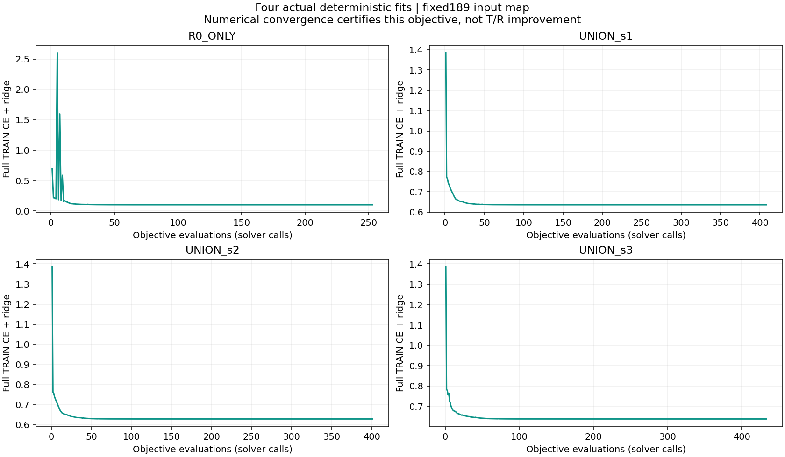
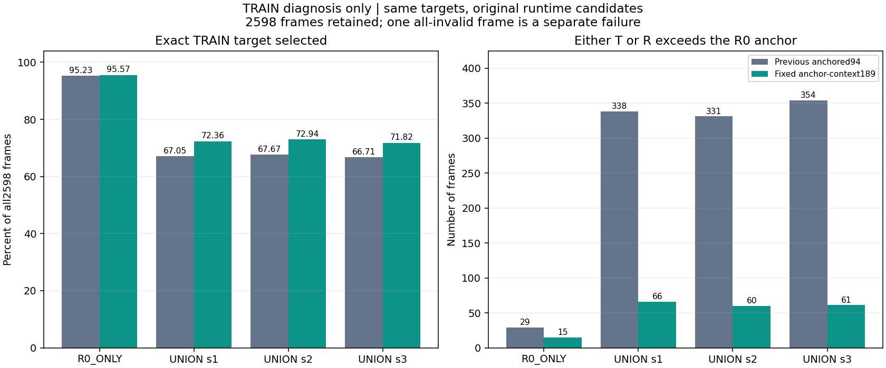
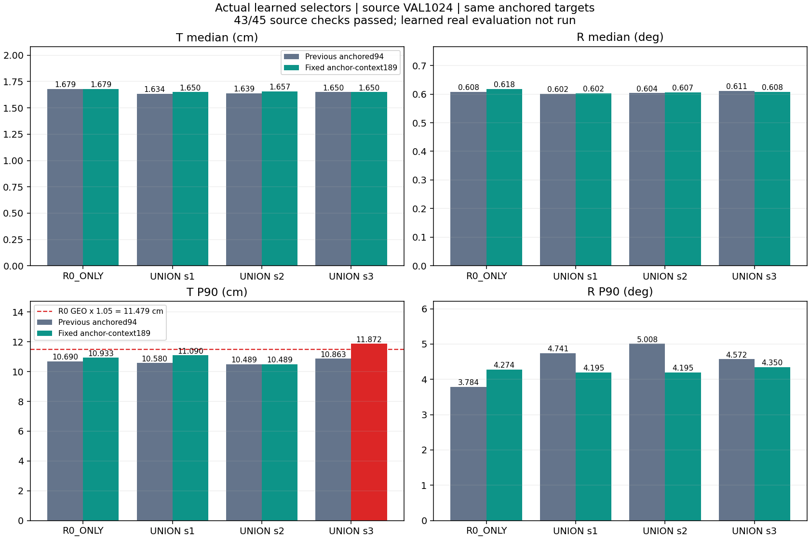

# R0 기준 후보 관계를 입력에 추가한 189차원 선택기

**실제 모델의 안정적인 T·R 동시 개선은 아직 달성하지 못했습니다.**

같은 학습 정답과 후보를 유지하고, 각 후보와 기존 R0 운영 후보의 관계를 입력에 추가했습니다. 네 선택기를 실제 학습한 뒤 합성 source VAL1024장에서 확인한 결과는 **43/45 통과·2개 실패**입니다. 직전94차원 방법의38/45보다 통과 수는 늘었지만, seed3의 T P90 비회귀 조건이 두 비교에서 실패해 이 방법의 learned 실사 평가는 실행하지 않았습니다.

T는 위치 오차(cm), R은 회전 오차(°)이며 작을수록 좋습니다. 입력은 **RGB 이미지 한 장 + 팔레트 치수**, 기존 카메라 보정 K입니다. 새 영상·센서·실사 정답을 추가하지 않았습니다.

## 이번에 바꾼 입력

각 후보의 기존94개 특징을 같은 TRAIN 평균·표준편차로 FP32 정규화하고 FP64로 바꾼 값을 `z`라 할 때, 새 입력은 다음189개입니다.

```text
[ z(94), abs(z - z_R0운영후보)(94), 이 후보가 R0운영후보인가(1) ]
```

anchor는 이미지 입력으로 정해진 기존 R0 GEO 후보입니다. 학습된 R0_ONLY가 고른 후보나 정답 오차로 고른 후보를 anchor로 사용하지 않습니다. 절댓값 차이 뒤에 별도 정규화는 없습니다. 유효 후보가 있는데 R0 anchor가 없으면 계약 오류로 중단하고, 모든 후보가 실패한 행은 그대로 유지합니다.

직전 [양축 보존 타깃94 방법](../pallet_pose_pareto_anchor_20261001_v1/REPORT_KO.md)과 **학습 정답·safe mask·원래 유효 후보·정규화·TRAIN2598행·CE+ridge(λ=1e−4)·초깃값0·solver·판정 기준을 동일하게 유지**했습니다. 변경한 것은 입력 표현94→189 하나입니다. 기존94개 가중치 뒤에95개의0을 붙이는 동등성을 검산했으며, 합성 prefit fixture의 점수 차이 최대는1.78e−15였습니다. 합산 순서 차이가 있으므로 score의 byte 일치를 주장하지 않습니다.

학습 정답에는 기존 `T≤R0 anchor T AND R≤R0 anchor R` 조건과 고정 TRAIN 비용을 유지했습니다. **이 조건은 추론 시 후보를 제거하는 마스크가 아닙니다.** 추론은 정답 오차를 모르며, 원래 유효 후보 전체에서 점수가 가장 작은 전체 pose 하나를 고릅니다. 따라서 새 입력도 양축 비회귀를 보장하지 않습니다.

## 실제 네 학습과 TRAIN 검산

네 모델 모두 목적함수 수렴 인증을 통과했습니다. 각 fit의 한계1000 iterations·2000 objective calls와 `||gradient||²/(2λ)≤1e−6` 조건을 변경하지 않았습니다. PyTorch FP64 autograd와 별도 행별189개 특징 구현으로 검산했습니다.

| 모델 | optimizer iterations | objective calls | 수렴 gap 상한 |
|---|---:|---:|---:|
| R0_ONLY | 223 | 253 | 4.681e-12 |
| UNION_s1 | 365 | 408 | 5.012e-12 |
| UNION_s2 | 368 | 401 | 7.349e-12 |
| UNION_s3 | 394 | 433 | 7.646e-12 |

총1495회 목적함수 계산과 1350회 optimizer iteration을 실행했습니다. 이 인증은 CE+ridge의 수치 수렴을 뜻하며 T/R 개선 인증이 아닙니다.



| 동일 TRAIN에서94→189 비교 | 타깃 선택 정확도 | R0보다 한 축 이상 악화한 수 |
|---|---:|---:|
| R0_ONLY | 95.23% → 95.57% | 29 → 15 |
| UNION_s1 | 67.05% → 72.36% | 338 → 66 |
| UNION_s2 | 67.67% → 72.94% | 331 → 60 |
| UNION_s3 | 66.71% → 71.82% | 354 → 61 |

정확도 비율의 분모는 전체2598장입니다. 후보 실패1장은 정답으로 세지 않으며, 위반 여부도 평가할 수 없는 별도 실패로 남깁니다. 위반 수는 유효 anchor2597장 중에서 센 값이고, 전체 T/R 집계에는 실패1개를 +∞로 유지합니다. 조건부2597장 기준 비율도 [TRAIN 검산 JSON](TRAIN_CONVERGENCE.json)에 따로 제공합니다.



타깃 선택 정확도는 높아지고 R0보다 악화하는 선택은 줄었습니다. 그러나 UNION 세 모델의 TRAIN T·R 중앙값은 직전94 방법보다 모두 커졌습니다. 타깃 정답률이나 비회귀 선택 수 개선을 연속적인 위치·회전 오차 개선과 동일시하지 않습니다.

## 합성 source VAL1024: 43/45 통과, 두 조건 실패

학습 종료 후 네 모델의4×1024개 선택을 source 정답 조회 전에 고정했습니다. 모든1024행을 유지해 같은 T/C2 회전 오차를 계산했고, 8개 모델의 pose 실패는 모두0입니다. 실패가0이라는 사실은 pose가 정확하다는 뜻이 아닙니다.

| 모델 | T 중앙값(cm) | R 중앙값(°) | T P90(cm) | R P90(°) | pose 실패 |
|---|---:|---:|---:|---:|---:|
| R0_ONLY | 1.679494 | 0.617946 | 10.932544 | 4.273600 | 0 |
| UNION_s1 | 1.650298 | 0.602370 | 11.089684 | 4.195165 | 0 |
| UNION_s2 | 1.657160 | 0.606635 | 10.488876 | 4.195165 | 0 |
| UNION_s3 | 1.650298 | 0.608127 | 11.871925 | 4.349598 | 0 |
| R0_GEO | 1.674594 | 0.613334 | 10.932544 | 4.328168 | 0 |
| DIVERSE251_s1_GEO | 1.818474 | 0.805513 | 19.343094 | 79.453475 | 0 |
| DIVERSE251_s2_GEO | 1.900040 | 0.775323 | 18.537749 | 73.676611 | 0 |
| DIVERSE251_s3_GEO | 2.051196 | 0.765877 | 18.074773 | 38.153661 | 0 |

| 같은 source VAL의94→189 비교 | T 중앙값(cm) | R 중앙값(°) | T P90(cm) | R P90(°) |
|---|---:|---:|---:|---:|
| R0_ONLY | 1.679494 → 1.679494 | 0.608127 → 0.617946 | 10.689822 → 10.932544 | 3.784231 → 4.273600 |
| UNION_s1 | 1.633590 → 1.650298 | 0.601619 → 0.602370 | 10.579964 → 11.089684 | 4.741256 → 4.195165 |
| UNION_s2 | 1.639399 → 1.657160 | 0.604010 → 0.606635 | 10.488876 → 10.488876 | 5.008210 → 4.195165 |
| UNION_s3 | 1.650298 → 1.650298 | 0.611190 → 0.608127 | 10.863452 → 11.871925 | 4.572355 → 4.349598 |



38/45→43/45는 고정된 source 검사의 통과 수 비교입니다. 모든 T/R 지표가 일괄 개선됐다는 뜻은 아닙니다. UNION 세 모델의 R P90은 직전94보다 낮아졌지만, T 중앙값은 seed1·2에서 커졌고 seed3은 동일했습니다. T P90은 seed1·3에서 커졌습니다. R0_ONLY도 이번 표현으로 다시 학습했으므로 그 대조 결과가 바뀐 점을 표와 그래프에 함께 남깁니다. 고정 R0_GEO 비교 역시 원래45개 조건에 포함됩니다.

| 실패 모델 | 비교 대상 | 실패 조건 | 실제 T P90(cm) | 허용 상한(cm) |
|---|---|---|---:|---:|
| UNION_s3 | R0_ONLY | translation_cm_P90_guard | 11.871925 | 11.479171449 |
| UNION_s3 | R0_GEO | translation_cm_P90_guard | 11.871925 | 11.479171449 |

seed3의 T P90은 11.871925cm로, 동일한 두 기준값 10.932544cm보다 **8.59% 증가**했습니다. 허용치는5% 증가인 11.479171449cm입니다. 두 실패를 남겨두고 일부 seed만 선택하거나 한계를 완화하지 않았습니다.

## 실사 실행 여부와 이미지

**이번189 선택기의 learned 실사 routing·오차 계산은0회입니다.** source45개 조건을 모두 통과해야 실사 평가에 들어가도록 정했으므로 여기서 중단했습니다. 실사 개선 목표의 완료 상태도 false로 유지합니다.

기존 후보에 양축 비회귀 전체 pose 선택 조합이 있는지를 확인한 [이전 실사 oracle 가능성 진단](../pallet_pose_pareto_anchor_20261001_v1/REAL_VERIFICATION_KO.md)은 재계산하지 않았습니다. 그 원래5개 기준 통과는 참조를 보는 진단이며 이번 모델의 실사 실적이 아닙니다.

**아래 세 이미지는 이전 참조 oracle 갤러리를 그대로 연결한 것입니다. 이번 새 모델의 실사 결과가 아닙니다.** 실제 RGB6장과 원래 입력 치수를 보여주며, 왼쪽은 기존 R0, 오른쪽은 참조 기반 보존 oracle입니다. 기존 전체 pose를 K로 투영한 선이며 정답 윤곽을 그린 것이 아닙니다. 각 자연 촬영에서 기존 R0 T 오차가 가장 큰 한 장을 선택한 진단 예시입니다.


## 남은 TRAIN 선택 위험

현재 동결된 선택만 다시 분류한 [TRAIN 위험 진단](TRAIN_RISK_DIAGNOSTIC_KO.md)입니다. 새 점수·정책·학습을 시험한 결과는 아닙니다. 안전 개선은 R0보다 한 축 이상이 엄격히 좋아지고 다른 축이 나빠지지 않는 경우입니다.

| 모델 | target의 non-anchor 안전 개선 | 실제 R0 유지 | 실제 안전 개선 | 실제 악화 | 최대 정규화 초과 |
|---|---:|---:|---:|---:|---:|
| UNION_s1 | 785 | 2400 | 131 | 66 | 64.96 |
| UNION_s2 | 780 | 2401 | 136 | 60 | 79.51 |
| UNION_s3 | 762 | 2450 | 86 | 61 | 138.76 |

정규화 초과는 `max((T−T_anchor)/sT, (R−R_anchor)/sR, 0)`이며 고정 TRAIN 척도를 사용합니다. cm나 degree 단위의 오차가 아닙니다. 유효2597장과 별도 실패1장을 유지했습니다. 선택은 이미 R0 유지에 치우쳐 있지만 남은 소수 악화의 크기는 클 수 있습니다.

후속 검토안은 TRAIN의 `log1p(risk)`를 이용하는 margin CE이며 **이번 보고서에서는 구현·학습·평가하지 않았습니다**. 단순히 R0 선호를 더 높이면 필요한 엄격 개선까지 줄일 수 있어, 이를 자동적인 해결책으로 보지 않습니다.

## 확인할 파일과 해석의 범위

- [학습 전 독립 검토](PREFIT_REVIEW_KO.md), [입력·타깃·solver 계약](TRAIN_PROTOCOL.json), [TRAIN 독립 수렴·성능 검산](TRAIN_CONVERGENCE_KO.md)
- [source VAL 독립 검산](SOURCE_VAL_VERIFICATION_KO.md), [전체8192행 CSV](SOURCE_VAL_FRAME_RESULTS.csv), [45개 판정 CSV](SOURCE_VAL_CHECKS.csv)
- [학습1495행 CSV](TRAINING_OBJECTIVE_LOG.csv), [실제 네 checkpoint JSON](model_parameters/), [실사 미실행 기록](REAL_EVALUATION_NOT_RUN_KO.md)
- [공개 자료 검증](PUBLIC_REVIEW_KO.md), [파일 SHA 목록](PUBLICATION_MANIFEST.json), [그림·원자료 연결 JSON](REPORT_DATA.json)

기존 상대 관계 특징·상대 이득 선택기의 선행 실패가 있으므로, 이189개 입력만으로 새로운 방법의 유효성을 주장하지 않습니다. 이번 작업은 하나의 고정 입력 표현을 비교한 실험입니다. TRAIN 선택 변화는 확인했지만 현재 결과만으로 Linear189 전체가 불가능하다거나 RGB 정보 부족이 원인이라고 확정할 수 없습니다.

source VAL과 실사 DEV는 여러 방법에서 반복 사용했습니다. refiner의 기존 source 노출과 selector TRAIN/VAL/TEST 중복105/26/26건을 제거한 독립 평가라고 주장하지 않습니다. 전체 교사 계보에는 기존 수동 코너38개/이미지9장이 포함되며 이번 학습에 새 실사 정답을 넣지는 않았습니다. 이전 실사 참조도2D 주석·K·치수에서 만든 pose이며 독립 장비 실측 정답이 아닙니다.

R0_ONLY는 결정론적 대조 fit 하나이고 UNION_s1/2/3은 각각 기존 frozen refiner seed를 사용합니다. 네 fit을 네 독립 반복 실험으로 해석하지 않습니다. 정확한 재실행에는 SHA로 연결한 로컬 원본 이미지·특징·pose 캐시가 필요하며, 공개 자료에는 검토용 CSV·checkpoint·실행 코드·그림·판정 기록을 포함합니다.
