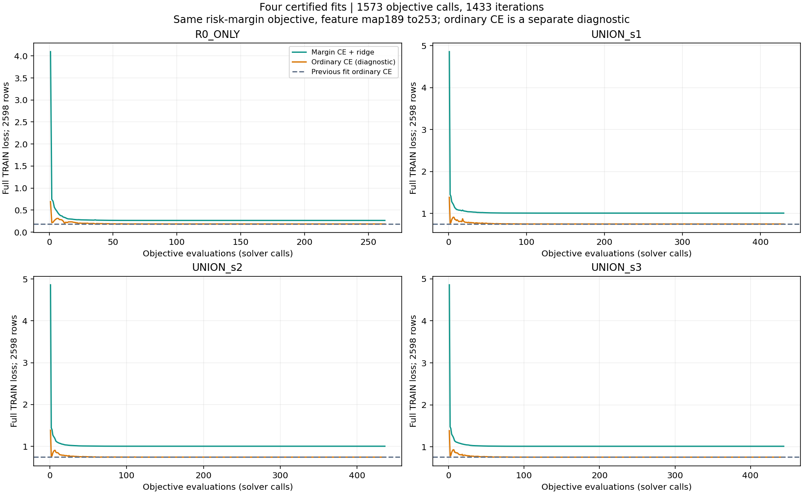
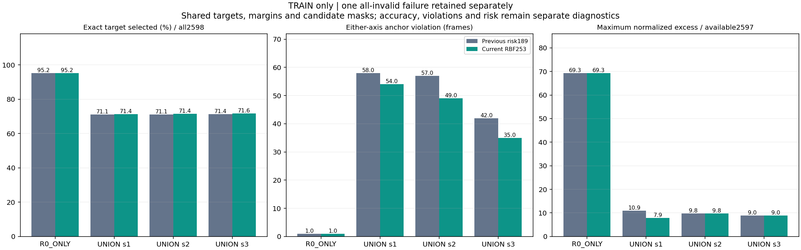
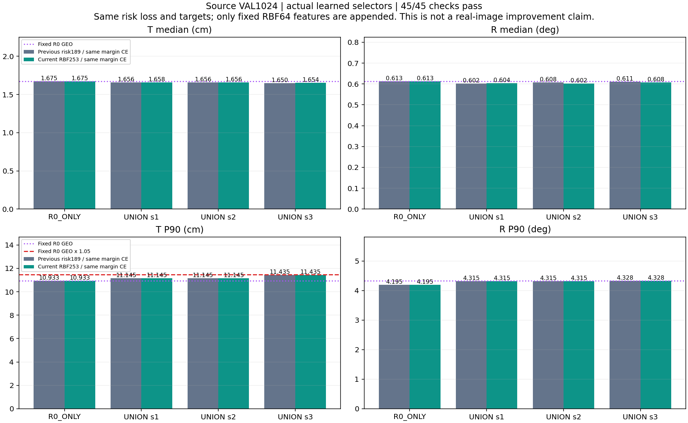
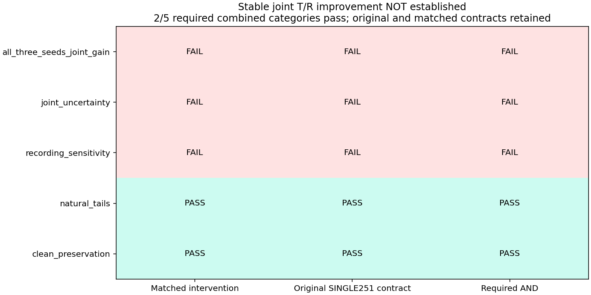
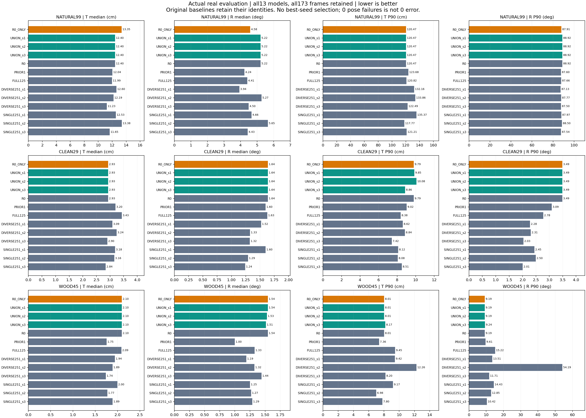
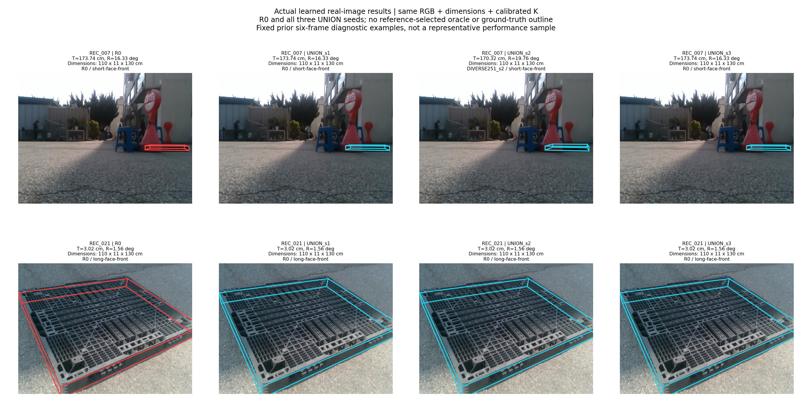
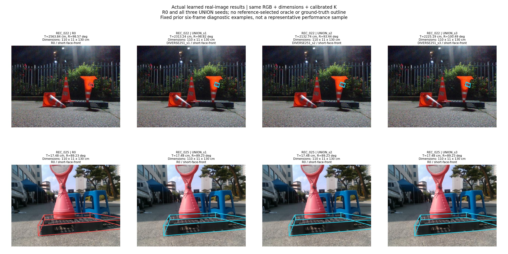

# 고정 RBF64 특징 추가와 실제 실사 T·R 결과

**합성 source 45/45 조건을 통과했습니다. 실제 실사의 안정적인 T·R 동시 개선 판정은 미달성입니다.**

새 선택기 네 개를 실제 학습했고 수렴 검산을 통과했습니다. source VAL1024의 모든 조건을 통과한 뒤, 정답을 보지 않고 실사173장의 네 모델 선택692개를 먼저 동결했습니다. 이후 전체13모델×173장=2249행을 채점했습니다. 원래 목표와 추가 대조 조건을 함께 적용한 최종5개 범주 중 **2개 통과·3개 실패**입니다. 좋은 seed만 골라 성공으로 해석하지 않습니다.

T는 위치 오차(cm), R은 회전 오차(°)이며 작을수록 좋습니다. 실행 입력은 **RGB 이미지 한 장 + 팔레트 치수 + 기존 카메라 보정 K**입니다. 시간 정보·추가 센서·새 실사 정답을 넣지 않았습니다.

## 이번에 바꾼 학습과 바꾸지 않은 추론

직전 [risk189 방법](../pallet_pose_anchor_risk_20261001_v1/REPORT_KO.md)의 risk margin loss, 정규화, R0 기준 양축 보존 정답, 후보 pool, TRAIN2598행, λ=1e−4, 0초깃값, solver를 유지했습니다. 기존189개 context 뒤에 고정 RBF64개를 붙여253차원으로 만든 것이 유일한 변경입니다.

```text
phi253 = [ context189, exp(-||context189-center_j||² / (2 * bandwidth²)), j=1..64 ]
```

센터는 eligible TRAIN의 유효 입력 후보 20,776개를 `(frame ID, expert, hypothesis)` canonical JSON의 SHA256 순서로 정렬한 뒤, float64 context bytes가 서로 다른 최초64개입니다. 반복 R0 identity는 한 번만 포함했습니다. 센터 사이 양의 제곱거리 중앙값으로 정한 bandwidth²는 153.70223741886912이며 별도 정규화·센터 수 탐색·폭 탐색이 없습니다.

센터와 폭을 만들 때 source TRAIN label·VAL 품질·실사 참조는 읽지 않았습니다. 기존 NPZ에는 VAL 입력도 있지만 정규화·센터·폭 계산에는 사전 고정 eligible TRAIN2598행만 사용했습니다. 원래189좌표를 그대로 보존하고, 기존 가중치에0을64개 붙인 실제 TRAIN 점수의 최대 차이는 네 모델 모두0이었습니다. 일반적인 float64 합산에서 byte 동등성이 항상 보장된다는 주장은 하지 않습니다.

아래 loss는 직전과 동일합니다. RBF 출력은 고정되고 학습되는 것은253개 선형 가중치뿐이므로 같은 강볼록 수렴 인증을 적용합니다. 새로운 RGB appearance 정보를 만드는 변화는 아닙니다.

```text
r_c = max((T_c − T_anchor)/sT, (R_c − R_anchor)/sR, 0)
m_c = log1p(r_c)
J = mean_all2598[logsumexp_c(−score_c + m_c) + score_target] + (λ/2)||w||²
sT = 2.4636887551191258 cm; sR = 1.113474019956766 deg
```

정답 후보의 margin은0이며 원래 유효 경쟁자는 제거하지 않습니다. 모든 후보가 실패한1행은 loss0/target−1로 전체2598행 분모에 남습니다. 유효 후보와 유한 anchor에만 뺄셈을 적용해 inf−inf를 피했습니다. **margin·참조 오차·safe mask는 추론에 사용하지 않습니다.** 실제 출력은 고정253차원 입력 점수의 argmin으로 고른 전체 R,t pose 하나입니다.

## 실제 학습과 TRAIN에서 확인된 대가

| 모델 | 반복 | objective 호출 | gap 상한 | 인증 |
|---|---:|---:|---:|---|
| R0_ONLY | 233 | 263 | 5.058e-12 | PASS |
| UNION_s1 | 395 | 430 | 4.434e-12 | PASS |
| UNION_s2 | 398 | 436 | 4.720e-12 | PASS |
| UNION_s3 | 407 | 444 | 4.684e-12 | PASS |

네 fit 합계는 **1433회 반복·1573회 objective 호출**입니다. 모든 fit은 같은 상한(maxiter1000/maxfun2000), optimizer 성공과 `||gradient||²/(2λ)≤1e−6`을 만족했습니다. 수렴 인증은 이 loss를 충분히 최소화했다는 뜻이며 실사 T/R 개선 인증이 아닙니다.

| 모델 | 같은 margin objective 이전→현재 | 일반 CE 이전→현재 | 정답 선택률 이전→현재 |
|---|---:|---:|---:|
| R0_ONLY | 0.266028006 → 0.265702286 | 0.186079205 → 0.185808552 | 95.227% → 95.227% |
| UNION_s1 | 1.018721018 → 1.009413982 | 0.754091348 → 0.749986327 | 71.132% → 71.363% |
| UNION_s2 | 1.009609306 → 1.002915824 | 0.744269197 → 0.742288037 | 71.093% → 71.440% |
| UNION_s3 | 1.025729705 → 1.013874731 | 0.760546300 → 0.754785392 | 71.363% → 71.594% |

같은253 특징·같은 margin loss에서 이전189 weight 뒤에0을64개 붙인 비교값과 현재 weight를 대조했습니다. 네 모델의 margin 목적함수와 일반 CE는 모두 감소했습니다. target 정확도는 UNION 세 seed에서 증가했고 R0_ONLY는 같았습니다. 이전 모델의 원래189차원 인증은 별도로 검산했으며 확장253 gradient를 이전 인증 gradient와 혼동하지 않습니다. 일반 CE·target 정확도·축별 오차는 학습 목적함수와 별도로 표시합니다. 정확도 분모는 전체2598장이며 실패1장을 정답으로 세지 않습니다.



| 모델 | T 위반 이전→현재 | R 위반 이전→현재 | 한 축 이상 위반 이전→현재 | 최대 정규화 초과 이전→현재 |
|---|---:|---:|---:|---:|
| R0_ONLY | 1 → 1 | 1 → 1 | 1 → 1 | 69.333657 → 69.333657 |
| UNION_s1 | 41 → 41 | 29 → 22 | 58 → 54 | 10.936394 → 7.945770 |
| UNION_s2 | 42 → 37 | 32 → 28 | 57 → 49 | 9.826593 → 9.826593 |
| UNION_s3 | 29 → 25 | 25 → 18 | 42 → 35 | 8.953028 → 8.953028 |

위반은 실제 unrestricted 선택이 같은 행 R0 anchor보다 나빠진 경우입니다. 위험 크기의 분모는 유효2597장이며 실패1장의 크기는 미정으로 별도 유지합니다. 전체 정답 선택률·안전 개선·축별 위반·위험 크기는 서로 다른 양입니다. 학습 목적함수 개선만으로 이 모두가 개선되었다고 해석하지 않습니다.

| 모델 | anchor 선택 이전→현재 | safe 개선 이전→현재 | unsafe 선택 이전→현재 | unsafe 정규화 위험 P90 이전→현재 |
|---|---:|---:|---:|---:|
| R0_ONLY | 2575 → 2575 | 21 → 21 | 1 → 1 | 69.333657 → 69.333657 |
| UNION_s1 | 2452 → 2451 | 87 → 92 | 58 → 54 | 4.667201 → 4.266618 |
| UNION_s2 | 2457 → 2463 | 83 → 85 | 57 → 49 | 6.060949 → 6.099458 |
| UNION_s3 | 2498 → 2506 | 57 → 56 | 42 → 35 | 2.535739 → 2.513471 |

safe 개선은 두 축 모두 anchor 이하이며 최소 한 축이 엄격히 좋아진 경우입니다. **seed3의 safe 개선은57→56으로 줄었고, seed2의 unsafe 위험 P90은6.060949→6.099458로 증가했습니다.** 이 P90의 분모는 실제 unsafe 선택행이며 전체2597 유효행의 P90과 다릅니다. 감소한 unsafe 수만으로 모든 개선을 주장하지 않습니다.



## source VAL: 45/45 통과

직전risk189와 이번RBF253은 모두45/45로 모든 사전 조건을 통과했습니다. UNION 세 seed 각각이 학습된 R0_ONLY·기존 R0 GEO·해당 DIVERSE GEO와 비교되며, 양축 중앙값 엄격 개선·각축 P90의5% 이내 보존·실패 수 비증가를 요구합니다. R0_ONLY도 확장된 특징으로 다시 학습했으며, 같은 pass 수가 모든 성능의 동등함이나 우월함을 뜻하지 않습니다. 고정 R0_GEO 수치를 함께 표시합니다.

| 모델 | T 중앙값 cm | R 중앙값 ° | T P90 cm | R P90 ° | 실패 |
|---|---:|---:|---:|---:|---:|
| R0_ONLY | 1.674594 | 0.613334 | 10.932544 | 4.195165 | 0 |
| UNION_s1 | 1.657582 | 0.603517 | 11.145026 | 4.315199 | 0 |
| UNION_s2 | 1.656191 | 0.602370 | 11.145026 | 4.315199 | 0 |
| UNION_s3 | 1.653925 | 0.608127 | 11.434707 | 4.328168 | 0 |
| R0_GEO | 1.674594 | 0.613334 | 10.932544 | 4.328168 | 0 |
| DIVERSE251_s1_GEO | 1.818474 | 0.805513 | 19.343094 | 79.453475 | 0 |
| DIVERSE251_s2_GEO | 1.900040 | 0.775323 | 18.537749 | 73.676611 | 0 |
| DIVERSE251_s3_GEO | 2.051196 | 0.765877 | 18.074773 | 38.153661 | 0 |

seed3의 T P90은 11.434707243cm로 고정 R0 한계 11.479171449cm 안에 들어왔습니다. UNION 세 seed의 두 축 P90은 직전risk189와 동일합니다. seed1의 T/R 중앙값과 seed3의 T 중앙값은 직전보다 증가했고, seed2·3의 R 중앙값은 감소했습니다. 이것은 합성 source에서의 통과이며 실사 개선의 증거를 대신하지 않습니다.



## 실제 실사: 원래 목표와 대조 조건을 모두 적용

새 learned 선택을 참조 오차 접근 전에 동결한 뒤 기존 참조로 채점했습니다. 원래9모델의173행씩1557개 metric이 이전 값과 일치함도 확인했습니다. 새 이미지 forward·새 PnP·추가 fit은0회이며, 이번 실사 metric2249행은 동결 이후 실제 계산한 결과입니다. 보고서 생성은 이를 재계산하지 않습니다.

**평가 계약 유지:** 직전risk 실험은 미실행 learned-real 코드에서 빠졌던 원래 SINGLE251 비교를 실사 실행 전에 복구했습니다. 이번에도 그 복구된 원래5개 조건과 matched5개 조건을 그대로 고정하고 항목별 AND했습니다. 기준 완화나 기존 기록 덮어쓰기는 없습니다.

| 판정 범주 | matched 대조 | 원래 SINGLE251 포함 목표 | 최종 AND |
|---|---|---|---|
| all_three_seeds_joint_gain | FAIL | FAIL | FAIL |
| joint_uncertainty | FAIL | FAIL | FAIL |
| recording_sensitivity | FAIL | FAIL | FAIL |
| natural_tails | PASS | PASS | PASS |
| clean_preservation | PASS | PASS | PASS |



자연 가림99장의 R0 대비 중앙값 차이는 seed1: T 동일(+0.000000cm), R 동일(+0.000000°); seed2: T 동일(+0.000000cm), R 동일(+0.000000°); seed3: T 동일(+0.000000cm), R 동일(+0.000000°). **세 seed 모두의 T·R 엄격 공동 개선 조건은 충족하지 못했습니다.** tail과 clean 보존은 악화를 제한하는 별도 조건이며 새 정확도 향상과 같지 않습니다.

직전risk189와 비교하면 자연99 seed3의 T 중앙값은 11.435624→12.403251cm로 커져 기존의 T 개선이 사라졌습니다. seed2의 R 중앙값은 5.236701→5.217583°로 줄었지만, 이번 세 UNION의 T/R 중앙값은 모두 기존 R0와 같습니다. 표현 확장으로 TRAIN 목적함수가 낮아진 결과를 실사 공동 개선으로 바꿔 해석할 수 없습니다.

| R0 대비 자연99 | 평균 seed 중앙값 차이 | recording×seed bootstrap95% CI |
|---|---:|---:|
| translation_cm | 0.000000000 | [-0.993297264, 0.000000000] |
| rotation_deg | 0.000000000 | [0.000000000, 1.142397365] |

차이는 현재−R0이며 음수가 개선입니다. 촬영6개와 frozen refiner seed3개를 함께 재표본한2000회(seed20261001)의 동일 draw를 사용했습니다. R0 비교에서 두 축 신뢰구간 상한이 모두0미만인 조건은 FAIL이고, 촬영 하나씩 제외해 공동 개선을 보존하는 검사는 FAIL입니다.

아래는 원래 baseline 이름을 그대로 보존한 **13개 모델 전체**입니다. 전부 pose 반환 실패는0이므로 conditional과 full-population T/R가 일치합니다. 실패0은 올바른 pose0오차라는 뜻이 아닙니다.

### 자연 가림99

| 모델 | T 중앙값 cm | R 중앙값 ° | T P90 cm | R P90 ° | 실패 |
|---|---:|---:|---:|---:|---:|
| R0_ONLY | 13.354921 | 4.583047 | 120.471370 | 87.911402 | 0 |
| UNION_s1 | 12.403251 | 5.217583 | 120.471370 | 88.921859 | 0 |
| UNION_s2 | 12.403251 | 5.217583 | 120.471370 | 88.921859 | 0 |
| UNION_s3 | 12.403251 | 5.217583 | 120.471370 | 88.921859 | 0 |
| R0 | 12.403251 | 5.217583 | 120.471370 | 88.921859 | 0 |
| PRIOR1 | 12.042390 | 4.240347 | 123.679073 | 87.596383 | 0 |
| FULL125 | 11.986464 | 4.410692 | 120.824080 | 87.661208 | 0 |
| DIVERSE251_s1 | 12.596471 | 3.937632 | 132.164500 | 87.129970 | 0 |
| DIVERSE251_s2 | 12.188873 | 5.267813 | 133.856992 | 87.765816 | 0 |
| DIVERSE251_s3 | 11.225821 | 4.496204 | 122.486704 | 87.501695 | 0 |
| SINGLE251_s1 | 12.534518 | 4.659375 | 135.371146 | 87.965499 | 0 |
| SINGLE251_s2 | 13.378309 | 5.649557 | 117.765410 | 88.495232 | 0 |
| SINGLE251_s3 | 11.650727 | 4.433469 | 121.211038 | 87.541516 | 0 |

### clean29

| 모델 | T 중앙값 cm | R 중앙값 ° | T P90 cm | R P90 ° | 실패 |
|---|---:|---:|---:|---:|---:|
| R0_ONLY | 2.929862 | 1.637392 | 9.785404 | 3.490641 | 0 |
| UNION_s1 | 2.929862 | 1.637392 | 9.849148 | 3.490641 | 0 |
| UNION_s2 | 2.929862 | 1.637392 | 10.080432 | 3.490641 | 0 |
| UNION_s3 | 2.929862 | 1.637392 | 8.858203 | 3.490641 | 0 |
| R0 | 2.929862 | 1.637392 | 9.785404 | 3.490641 | 0 |
| PRIOR1 | 3.198106 | 1.597354 | 9.022312 | 3.092060 | 0 |
| FULL125 | 3.432615 | 1.630004 | 8.380100 | 2.776969 | 0 |
| DIVERSE251_s1 | 3.088247 | 1.521042 | 8.615760 | 2.280042 | 0 |
| DIVERSE251_s2 | 3.239798 | 1.325712 | 8.836137 | 2.305704 | 0 |
| DIVERSE251_s3 | 2.901072 | 1.322691 | 7.418256 | 2.034899 | 0 |
| SINGLE251_s1 | 3.184873 | 1.596762 | 8.121869 | 2.446955 | 0 |
| SINGLE251_s2 | 3.160370 | 1.292028 | 8.078158 | 2.495904 | 0 |
| SINGLE251_s3 | 2.838004 | 1.241256 | 8.514937 | 2.008042 | 0 |

### wood45 반복 DEV stress

| 모델 | T 중앙값 cm | R 중앙값 ° | T P90 cm | R P90 ° | 실패 |
|---|---:|---:|---:|---:|---:|
| R0_ONLY | 2.095130 | 1.544559 | 8.011072 | 9.189687 | 0 |
| UNION_s1 | 2.095130 | 1.544559 | 8.011072 | 9.189687 | 0 |
| UNION_s2 | 2.095130 | 1.528768 | 8.011072 | 9.189687 | 0 |
| UNION_s3 | 2.095130 | 1.514463 | 8.173537 | 9.240203 | 0 |
| R0 | 2.095130 | 1.544559 | 8.011072 | 9.189687 | 0 |
| PRIOR1 | 1.753943 | 0.999982 | 7.356778 | 9.608164 | 0 |
| FULL125 | 2.087589 | 1.327260 | 9.451519 | 15.222109 | 0 |
| DIVERSE251_s1 | 1.941168 | 1.189435 | 9.423097 | 13.514849 | 0 |
| DIVERSE251_s2 | 1.888524 | 1.324231 | 12.255334 | 54.187506 | 0 |
| DIVERSE251_s3 | 1.735648 | 1.439471 | 8.198203 | 11.705414 | 0 |
| SINGLE251_s1 | 1.997635 | 1.251096 | 9.169999 | 14.432180 | 0 |
| SINGLE251_s2 | 1.772290 | 1.269066 | 6.980392 | 12.851432 | 0 |
| SINGLE251_s3 | 1.890309 | 1.287983 | 7.802606 | 10.418871 | 0 |



FULL128=자연 가림99+clean29이며 wood45는 별도 반복 DEV stress입니다. FULL128 및 severity별 나머지 집계도 [원본 결과 JSON](REAL_RESULTS.json)에 보존했습니다. wood 결과나 특정 seed를 기본 성공 판정으로 대체하지 않습니다.

## 같은 실제 이미지와 치수에서 본 learned 결과

**이번 네 열은 기존 R0와 실제 학습된 UNION seed1·2·3의 선택 결과입니다. oracle 선택 그림이 아닙니다.** 이전 보고서에서 이미 고정한 자연 촬영별6개 이미지 ID를 그대로 사용했습니다. 선정 규칙은 각 촬영의 기존 R0 T 오차 최대 예시였으므로 대표 표본이나 평균 개선의 증거로 해석하지 않습니다.

선은 저장된 전체 pose의 R_cf·centroid·camera-facing extents를 기존 K로 투영했습니다. 정답 윤곽선은 표시하지 않았고 새 PnP를 실행하지 않았습니다. 각 칸에는 원본 입력 치수·실제 선택 expert/hypothesis·현재 T/R를 넣었습니다. 크게 잘못된 pose도 축척이나 프레임을 바꾸어 숨기지 않았습니다.






6개 이미지·K·치수·24개 실제 pose·투영좌표·선택 ID와 SHA는 [갤러리 원자료](GALLERY_SELECTION.json)에 있습니다. 이전 [참조 기반 oracle 가능성](../pallet_pose_pareto_anchor_20261001_v1/REAL_VERIFICATION_KO.md)은 이번에 재계산하지 않았으며 현재 학습 모델의 성공으로 사용하지 않습니다.

## 남은 원인과 검증 자료

이번에는 fixed RBF라는 비선형 특징을 추가한 하나의 제한된 비교입니다. [직전 risk 선택의 source→실사 이전 진단](../pallet_pose_anchor_risk_20261001_v1/SELECTOR_TRANSFER_DIAGNOSTIC_KO.md)이 동기였으며, 그 과거 수치를 이번 모델 결과로 재사용하지 않습니다. 기존 상대 관계·RGB context 비선형 선택기의 음성 선행도 유지합니다. 현재 결과만으로 모든 비선형 표현의 가능성이나 단일 원인을 확정하지 않습니다.

[이번 RBF 선택·전이 진단](SELECTOR_TRANSFER_DIAGNOSTIC_KO.md)은 이미 동결된 선택과 score 항의 설명용 분석입니다. 새 routing 정책이나 counterfactual 성능 실험으로 해석하지 않습니다.

자연99에서 UNION 세 seed의 anchor 유지 수는94/90/93장, 안전 개선은2/4/3장이며 기존 참조 oracle의 안전 개선 기회 중49/47/50개를 놓쳤습니다. RBF 최대 활성의 중앙값은 TRAIN 약0.913, 자연 실사 약0.825–0.829여서 kernel 전체가 실사에서 사라졌다는 설명은 뒷받침되지 않습니다. 전체 실사173장에서 실제 non-anchor 선택의 chosen−anchor score를 분해하면 RBF64항은 seed별9/9·11/13·11/11건에서 양수였습니다. 점수를 최소화하는 선택에서는 이 항이 해당 후보에 불리하지만, 기존189개 가중치도 재학습됐으므로 RBF가 성능 악화의 원인이라는 인과 결론은 아닙니다.

- [basis 생성 계약](BASIS_PROTOCOL.json), [센터64·폭·입력 provenance](RBF_BASIS.json), [입력 전용 basis 코드](../../../scripts/research/pallet_pose_anchor_rbf_20261001_v1/basis.py)
- [학습 전 독립 검산](PREFIT_REVIEW_KO.md), [학습 계약](TRAIN_PROTOCOL.json), [TRAIN 독립 수렴·위험 검산](TRAIN_CONVERGENCE_KO.md)
- [source 독립 검산](SOURCE_VAL_VERIFICATION_KO.md), [source8192행 CSV](SOURCE_VAL_FRAME_RESULTS.csv), [45개 조건 CSV](SOURCE_VAL_CHECKS.csv)
- [실사 계약](REAL_PROTOCOL.json), [정답 접근 전 선택 잠금](REAL_ROUTING_LOCK.json), [실사 독립 검산](REAL_VERIFICATION_KO.md), [실사2249행 CSV](REAL_FRAME_RESULTS.csv), [전체 비교와 recording 분석](REAL_DETAILED_COMPARISONS.json)
- [학습1573행 CSV](TRAINING_OBJECTIVE_LOG.csv), [공개 checkpoint4개](model_parameters/), [그림·원자료 연결](REPORT_DATA.json)
- [공개 파일 검산](PUBLIC_REVIEW_KO.md), [공개 SHA 목록](PUBLICATION_MANIFEST.json)
- [학습 코드](../../../scripts/research/pallet_pose_anchor_rbf_20261001_v1/convex_train.py), [source 평가 코드](../../../scripts/research/pallet_pose_anchor_rbf_20261001_v1/evaluate_source.py), [실사 평가 코드](../../../scripts/research/pallet_pose_anchor_rbf_20261001_v1/evaluate_real.py), [보고서 생성 코드](../../../scripts/research/pallet_pose_anchor_rbf_20261001_v1/report.py)

source VAL과 실사 DEV는 여러 방법에서 반복 사용했습니다. refiner의 기존 source 노출과 selector TRAIN/VAL/TEST 중복105/26/26건이 있어 독립적인 일반화 시험으로 주장하지 않습니다. 전체 교사 계보에는 기존 수동 코너38개/이미지9장이 포함됩니다. 이번 학습에 새 실사 정답은0개이며, 실사 참조는2D 주석·K·치수에서 만든 pose로 독립 장비 실측6D 정답이 아닙니다.

R0_ONLY는 결정론적 fit 하나이고 UNION_s1/2/3은 서로 다른 기존 frozen refiner seed를 사용합니다. 네 fit을 네 독립 반복 실험으로 해석하지 않습니다. 이전 상대 관계·상대 이득 선택기의 선행 실패도 있으므로 고정 RBF 특징 하나로 보편적 transfer가 해결됐다고 주장하지 않습니다. 현재 사전 고정 안정성 목표는 **미달성**입니다.

공개 자료는 판정·전 행 오차·가중치·코드·실제 이미지 결과를 검토할 수 있게 구성했습니다. 정확한 재실행에는 SHA로 연결된 로컬 원본 이미지·특징·pose 캐시가 필요합니다.
