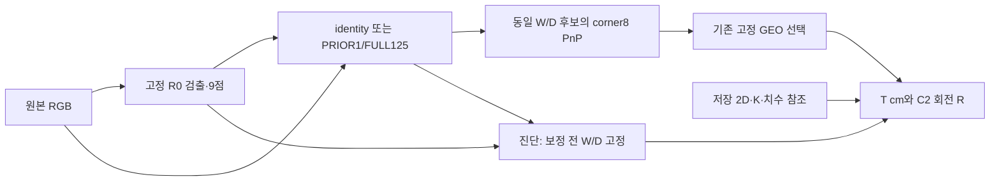

# 입력·모델·평가 계약

이번 실행의 목적은 clean에서 배운 보정이 자연 가림의 6D pose 개선으로 이어지지 않는 이유를 분리하고 다음 개입 하나를 고르는 것이다. 새 학습은 0회다. 실제 실행 명령, 패키지 환경, 입력 및 체크포인트 SHA256은 [manifest](RUN_MANIFEST.json)와 [모델 계보](MODEL_LINEAGE.json)에 있다.

| 집합 | 이미지 수 | recording 수 | 역할 |
|---|---:|---:|---|
| full128 | 128 | 모집단별 아래 참조 | 동일 평가 계약의 전체 파이프라인 |
| natural99 | 99 = Moderate21 + Severe78 | 6 | 자연 가림 주 결과 |
| clean29 | 29 | 3 | clean 손상, 인공 가림, RGB×좌표 실험 |
| 기존 natural93 | 93 | 과거 집합 | current99와 공통92, old-only1/current-only7 |
| FULL125 학습 | 253 | 1, REC_001 | 실제 학습 의사 타깃 추종 |
| E5-B TRAIN 부분집합 | 29 | 1, REC_001 | ID 정렬 등간격 선택, 새 고정 마스크 |
| Source256 | 256 | 합성 | renderer 기하 계약 확인; 자연 정확도 증명 아님 |

clean29와 ST 학습 clean78은 다르다. natural99마다 대응하는 clean 사진이나 teacher 타깃이 있는 것은 아니다. REC_021/REC_041에는 clean과 natural 이미지가 함께 있어 recording 표에서도 모집단을 먼저 나눈다.

| 모델 | 입력·학습 계보 | 이번 실행에서의 역할 |
|---|---|---|
| identity / R0 | 기존 합성 팔레트 기준 pose 모델; upstream COCO 사전학습 존재 | 보정 없이 통과 |
| PRIOR1 | 고정 synthetic PoseFix prior seed1 last6000 | 사전학습 보정 기준 |
| FULL125 | PRIOR1에서 실제253 짝 입력·의사 타깃으로 기존 적응; BN 고정 | 비교 대상 보정기; 이름125가 학습 이미지 수를 뜻하지 않음 |
| OLD_REF217 | 별도 ST 학생, 기존 REF_LR5 체크포인트 | 별도 현재 성능 기준 |
| REALFT_A | 실사157×20, negative259×6, 합성12000; R0와 다른 초기화 | 실사 지도 참고 모델; 순수 보정 효과 아님 |

이미지 SHA 중복과 recording 중복은 별도로 검사했다. REALFT_A는 학습 recording과 평가10/128장이 겹치며 natural9/clean1이다. 해당 natural9를 제외한90장에서도 개선은 남지만 이 역시 반복 사용 DEV다. 정확한 checkpoint hash는 확인했지만 과거 epoch60 last 설명과 파일 내부 선택 이력은 불일치하여 미해결로 남긴다.

좌표는 원본 영상 pixel xy다. R0는 기존 reflect padding100 경로를 사용하고, 보정기는 bbox 배율1.25·RGB288×384·inverse affine을 따른다. confidence·bbox·invalid point·중심 index8 처리 규칙을 유지한다. index0–7은 camera-facing cuboid 코너, index8은 중심이다. 유효 좌표를 가시점이라고 간주하지 않는다.

T는 팔레트 중심의 카메라 좌표 오차이며 `100 * ||t_pred - t_ref||` cm다. 자연 R은 physical registry 기준으로 I와 Ry180 중 작은 전체 회전각이다. W/D90 교환은 허용 대칭이 아니다. 같은 W/D를 고정해도 연속 R/t와 PnP 내부 해는 달라질 수 있다. 기존 solvePnP/RefineLM의 distortion=None을 그대로 따른다.

평가 참조는 저장된 2D 주석·K·알려진 치수로 만든 geometry-resolved pose다. 독립 장비로 측정한 물리 6D 정답이 아니다. 원클릭·투영점 출처 및 재클릭 공분산이 없어서 경험적 noise floor는 BLOCKED다. 2px 가정이나 CI 폭을 noise floor/MDE라고 부르지 않는다.

Pose 평가는 IoU gate를 새로 적용하지 않는다. 전체 분모, 실패/미검출, 매칭 성공 부분집합, 공통 유효 pose를 구별한다. 표의 실패는 무한대 정책과 조건부 통계를 함께 보존한다. 2D의 기존 IoU≥0.5 매칭은 pose 실패 제외 규칙이 아니다.

E3에서 CC=(clean RGB,qC), CO=(clean RGB,qO), OC=(가림 RGB,qC), OO=(가림 RGB,qO)다. controlled 네 조건은 clean bbox·affine·score·confidence를 공유한다. nativeOO는 실제 가림 검출 경로다. 마스크 seed42와 크기/색/형태는 출력 확인 전에 고정했고 위치만 cover/avoid로 바꾸었다. qC 기반 배치라 참조 기준 cover1장은0코너, avoid3장은1코너와 겹친다. 58개 조건은29개의 원촬영 반복이며 독립58장으로 세지 않는다.

E1 캐시는 기존 GPU 결과를 재사용했다. E3 최초 CPU R0와 기존 GPU cache의 최대 좌표차0.025px가 사전 tolerance0.01px를 넘어서, threshold를 완화하지 않고 E3 clean/가림을 모두 CPU로 맞췄다. 따라서 E1과 E3 clean의 작은 차이를 모델 효과로 해석하지 않는다. [CPU 정합 기록](E3_CPU_CONSISTENCY_ADDENDUM.json).
