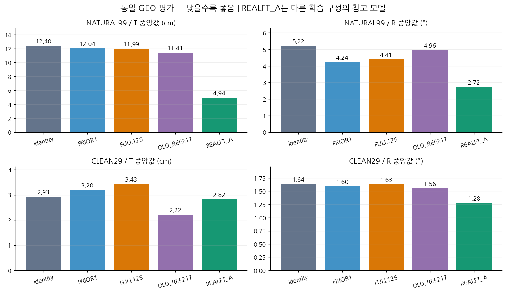
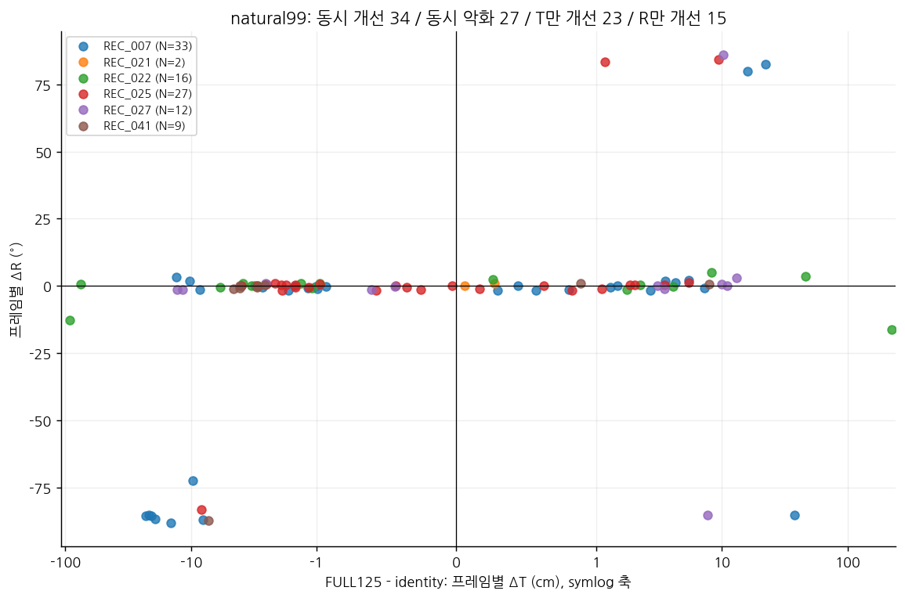
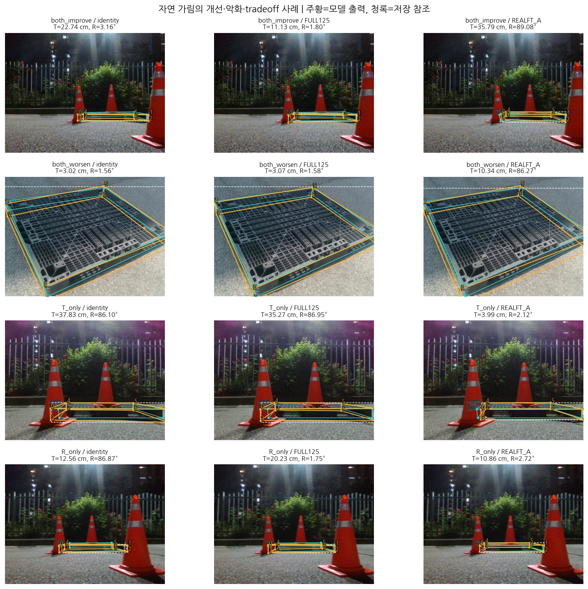
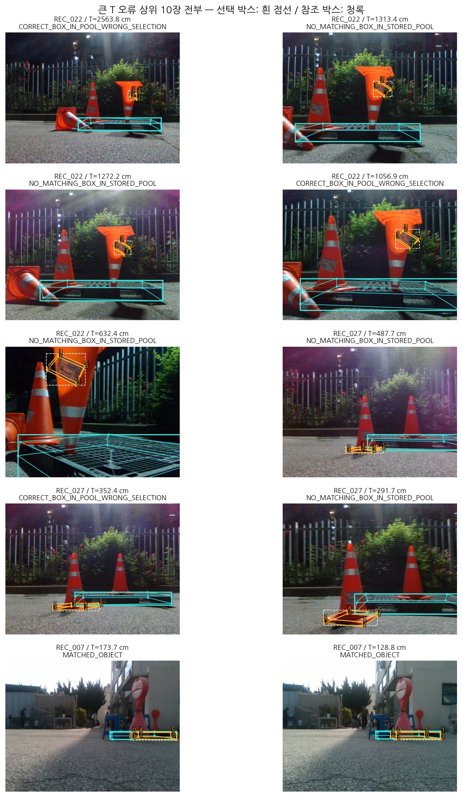
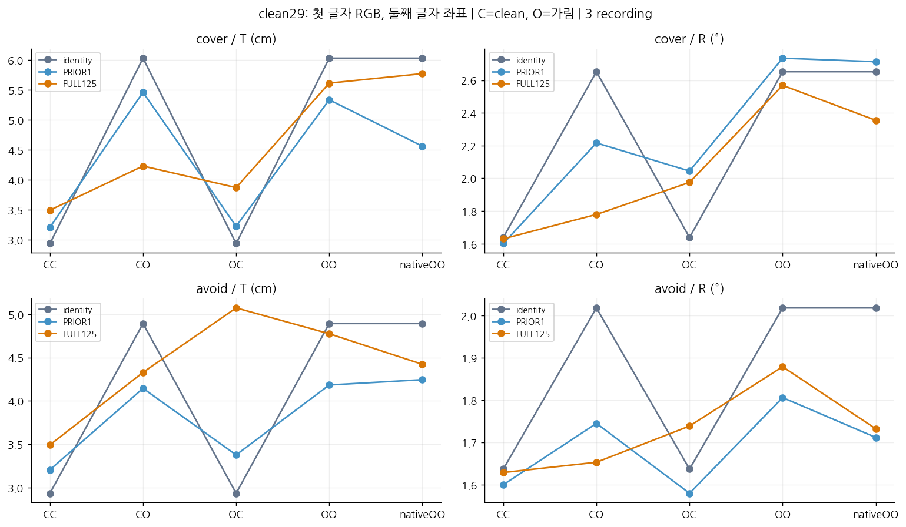
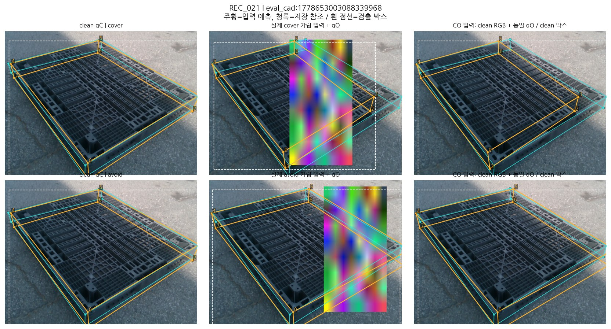
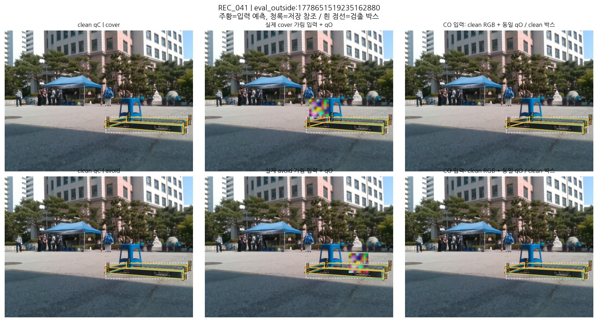
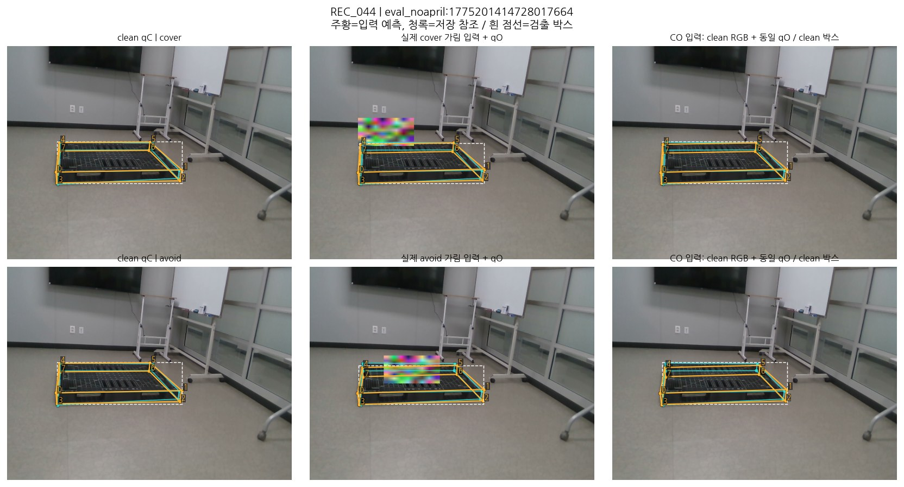
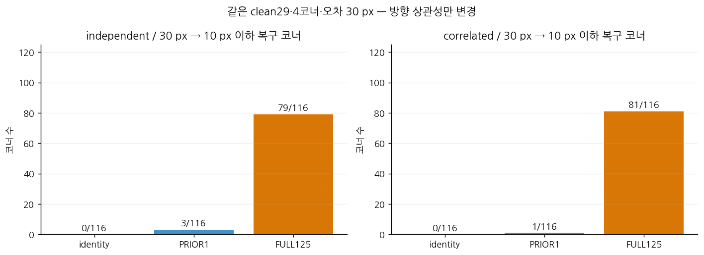
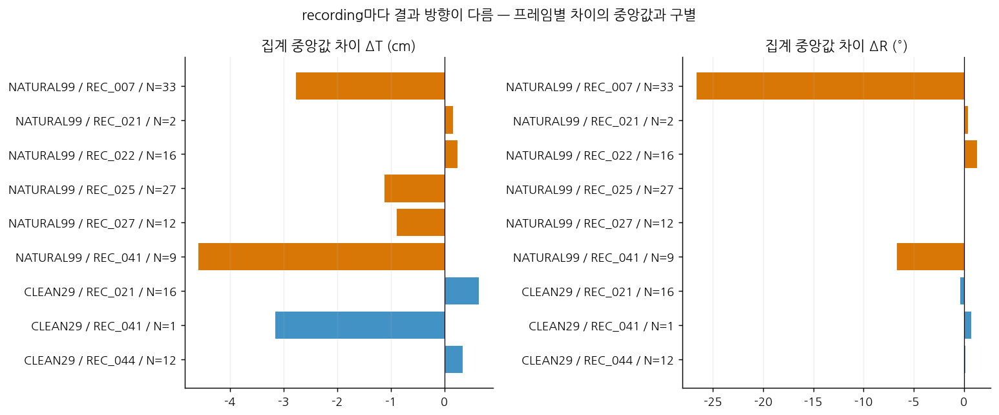

# 팔레트 6D pose: clean→가림 전이 진단 결과

**[확인] 핵심 실험을 수행했고, GitHub 검토판에서 재감사로 발견한 분석 누락과 표기 오류를 보완했다. 새 학습 0회, 고정 모델 CPU image-forward 1,027회.** 기존 FULL125·PRIOR1·R0·OLD_REF217 캐시 512개를 재사용하고, 현재 full128/natural99/clean29의 같은 GEO·T/R 계약으로 재계산했다. E3, E5-B, 좌표 stress, REALFT_A 고정 추론을 수행했다. 원본 GT·체크포인트·기존 보고서·사용자 변경은 유지했다. 방법 논문 목표도 유지한다.

**[추정] 가장 강한 남은 가설은 가림 RGB에서 보정의 이득이 약해지고, 그 출력과 W/D 선택이 결합해 자연99의 작은 집계 개선을 만든다는 것이다.** 큰 T 꼬리는 별도로 검출/박스 매칭 실패에 집중한다. 방향 상관성만을 주 원인으로 삼는 학습은 이번 결과가 지지하지 않는다. 다만 RGB 비교의 recording CI는 0을 포함하므로 보편적 원인으로 확정하지 않는다.

**다음 하나: 학습을 보류하고 고정 12 pose의 clean→가림→clean 36장 짝 촬영으로, 동일 qO에서 clean RGB 대 가림 RGB 비교를 한다.** 이번 실행에서는 촬영·재클릭·새 학습을 하지 않았다. 상세는 [NEXT_COMPARISON.json](NEXT_COMPARISON.json).

## 이 보고서를 확인하는 순서

[입력·모델·평가 계약](INPUTS_AND_METHOD_KO.md) → 아래 결과와 그림 → [자연 가림 99장 전체 갤러리](GALLERY_NATURAL99.md) → [모든 비교의 통계](STATISTICS_KO.md) → [지시문 이행·수정 내역](REVIEW_CORRECTIONS_KO.md) 순서로 확인할 수 있다. [재현·파일 안내](REPRODUCE_KO.md), [프레임 CSV](FRAME_RESULTS.csv), [현재 질문 상태](QUESTION_STATUS.json)도 함께 제공한다.

막대는 집계 중앙값이며 신뢰구간이 아니다. REALFT_A는 초기화·검출기·실사 감독이 다른 참고 모델이다. 순수 보정기 효과와 구별한다.

## 무엇이 문제였고 어떻게 구별했나

기존 FULL125의 2D 결과만으로 자연 가림 6D 개선을 판단할 수 없었다. 같은 좌표를 기존 두 W/D 후보의 최종 corner8 SQPnP/LM으로 풀고, 고정된 GEO_LINEAR 선택기를 재사용했다. 보정 전 GEO가 고른 W/D를 유지하는 진단도 함께 수행했다. 동일 W/D는 동일 연속 R/t나 동일 PnP 내부 해를 뜻하지 않는다. OLD_REF217은 별도 ST 학생이므로 FULL125와의 차이를 순수 보정기 효과로 해석하지 않는다.

현재 full128=clean29+Moderate21+Severe78, natural99=Moderate21+Severe78이다. 실제 old93과 current99의 교집합은 92, old-only 1/current-only 7이다. clean29는 ST clean78과 다르다. FULL125는 별도의 DAY253/REC_001 학습 이력이 있다. [모델 계보](MODEL_LINEAGE.json), [초기 계약](RUN_MANIFEST.json), private POPULATIONS.json에 실제 ID·SHA를 연결했다.

T는 원점 중심 cuboid의 카메라 좌표 중심 오차 cm, R은 physical registry frame의 C2(I,Ry180) 전체 회전 오차°다. 90° W/D 교환은 허용 대칭이 아니다. 기존 solver의 왜곡계수 None, K·치수·corner 순서·중심 8 보존·invalid 복원·confidence 보존을 유지했다. Pose에는 IoU gate를 추가하지 않았다. 전체/매칭 성공/공통 유효 pose 분모는 따로 보존한다.

## E1: 자연99의 2D 이득과 실제 T/R

| 모델+동일 GEO | T 중앙값 cm | R 중앙값 ° | T P90 cm | R P90 ° | 유효/실패/미검출 | 매칭 | 매칭 코너 2D 중앙값 px |
|---|---:|---:|---:|---:|---|---|---:|
| identity | 12.403 | 5.218 | 120.471 | 88.922 | 99/0/0 | 91/99 | 10.692 |
| PRIOR1 | 12.042 | 4.240 | 123.679 | 87.596 | 99/0/0 | 91/99 | 9.541 |
| FULL125 | 11.986 | 4.411 | 120.824 | 87.661 | 99/0/0 | 91/99 | 8.566 |
| OLD_REF217 | 11.410 | 4.955 | 127.143 | 88.820 | 99/0/0 | 91/99 | 10.059 |

FULL125는 R0 대비 2D 중앙값을 10.692→8.566 px로 낮췄지만, T/R 이득은 −0.417 cm/−0.807°이며 T P90은 줄지 않았다. PRIOR1 대비 FULL125는 T −0.056 cm, R +0.170°의 tradeoff다. **FULL125가 PRIOR1보다 두 pose 축 모두 우수하다는 결론은 성립하지 않는다.**

| 경로 | identity T/R | PRIOR1 T/R | FULL125 T/R |
|---|---|---|---|
| 같은 GEO 재선택 | 12.403 / 5.218 | 12.042 / 4.240 | 11.986 / 4.411 |
| 보정 전 W/D 고정 | 12.403 / 5.218 | 12.042 / 5.568 | 12.549 / 5.558 |

GEO 후보 전환은 PRIOR1 13/99, FULL125 18/99다. FULL125의 동일 프레임 동시 개선 34/99, 동시 악화 27/99, T만 개선 23, R만 개선 15다. 집계 중앙값 차이와 프레임별 차이의 중앙값은 [E1_SUMMARY.json](E1_SUMMARY.json)에 별도 저장했다.

FULL125−identity의 paired recording bootstrap 95% 구간은 T [−2.354,+4.942]cm, R [−12.367,+0.395]°다. 두 구간 모두 0을 포함한다. 새 recording 일반화, 효과 없음, 측정 불가능 중 어느 것으로도 자동 변환하지 않는다.

clean29에서도 2D 중앙값 7.258→5.600px와 달리 T 중앙값 2.930→3.433cm로 악화한다(R 1.637→1.630°). clean 성능 저하로 clean/가림 gap이 줄어드는 것을 성공으로 세지 않았다.

왼쪽 아래는 같은 프레임의 T/R 동시 개선, 오른쪽 위는 동시 악화다. T축은 큰 꼬리와 0 근처를 함께 보이기 위한 symlog 축이다. 점 하나가 프레임 하나이며 recording을 색으로 구분했다.

각 방향 집단에서 ID 사전순 첫 프레임을 표시했다. 최상의 개선 사례를 골랐다는 의미가 아니며, 네 사례의 빈도는 위 99장 집계로 판단한다. 주황=모델 코너, 청록=저장 참조, 흰 점선=선택 검출 박스. 원본 이미지와 ID는 [사례 선택 기록](FIGURE_CASE_SELECTION.json), 모든 프레임은 [전체 갤러리](GALLERY_NATURAL99.md)에 있다.

## E2: 후보 선택 여지와 검출 꼬리

| 입력 | 실제 GEO T/R | T-best 전체 pose T/R | R-best 전체 pose T/R | 한 후보가 T/R 동시 개선 가능한 프레임 |
|---|---|---|---|---:|
| identity | 12.403 / 5.218 | 9.208 / 3.832 | 10.131 / 3.162 | 22/99 |
| PRIOR1 | 12.042 / 4.240 | 7.747 / 3.046 | 8.671 / 2.983 | 20/99 |
| FULL125 | 11.986 / 4.411 | 7.687 / 3.342 | 7.708 / 3.162 | 20/99 |
| OLD_REF217 | 11.410 / 4.955 | 9.222 / 3.364 | 9.412 / 3.151 | 23/99 |

각 oracle은 후보 하나의 전체 (R,t)를 선택한다. 서로 다른 후보의 최소 T·최소 R를 합치지 않았다. 동률은 해당 오차→hypothesis name 순이고 개선 방향 수치 동률 허용은 1e−7이다. 현재 pool의 여지만 뜻하며 배포 성능이 아니다.

R0/FULL125 모두 T 상위 10장 중 8장이 기존 IoU 0.5 매칭 실패다: 맞는 박스가 저장 pool에 있으나 선택하지 않은 3장, 모든 저장 박스가 참조와 미매칭인 5장. 나머지 2장은 매칭됐어도 코너/PnP/W-D 문제가 남는다. 미검출은 0이며, 검출과 매칭은 다르다. “다른 실제 물체 검출”인지 “같은 물체 일부/배경”인지는 확정하지 않았다.

T-best로도 R0/FULL125 T P90은 120.471/120.824cm로 유지된다. W/D 후보 선택만으로 큰 위치 오류가 해결되지 않는다. 기존 박스 중 참조 IoU 최대 선택의 진단도 실행했으며 FULL125 T/R은 11.655cm/3.626°다. 누락된 박스를 생성한 결과가 아니다. [후보 요약](E2_ORACLE_SUMMARY.json), [모든 박스 분석](E2_DETECTION_SUMMARY.json).

보완한 recording 분석에서 FULL125 T-best의 현재 GEO 대비 95% 구간은 ΔT [-8.284, -0.305] cm, ΔR [-2.159, -0.413]°다. 이는 참조를 아는 후보 선택의 진단적 여지를 지지하지만 배포 가능한 선택기를 얻었다는 뜻은 아니다. best-box의 ΔT 구간 [-4.210, 0.106] cm는 0을 포함한다. LORO와 모든 후보 비교는 [통계 설명](STATISTICS_KO.md)을 참조한다.

상위 10장 모두를 표시했다. 흰 점선과 청록 참조 박스가 어긋나는 경우를 직접 확인할 수 있다. 이 그림만으로 다른 실제 팔레트를 검출했는지 확정하지 않는다.

## E3: clean29 동일 이미지 RGB×좌표

C/O 첫 글자는 RGB, 둘째는 좌표다. CC=(clean,qC), CO=(clean,qO), OC=(가림,qC), OO=(가림,qO). controlled 네 조건은 clean bbox/crop/affine/score/confidence를 공유하고, nativeOO는 실제 가림 검출 경로다. qO 누락/다른 객체를 qC로 대체하지 않았고 58/58쌍이 기존 박스 IoU 0.5 조건을 만족했다. 아래 T/R 단위는 cm/°다.

| 마스크 | 모델 | CC | CO | OC | OO | nativeOO |
|---|---|---|---|---|---|---|
| cover | identity | 2.935 / 1.637 | 6.034 / 2.652 | 2.935 / 1.637 | 6.034 / 2.652 | 6.034 / 2.652 |
| cover | PRIOR1 | 3.206 / 1.601 | 5.464 / 2.216 | 3.223 / 2.044 | 5.338 / 2.735 | 4.563 / 2.713 |
| cover | FULL125 | 3.493 / 1.629 | 4.231 / 1.779 | 3.870 / 1.975 | 5.616 / 2.568 | 5.775 / 2.355 |
| avoid | identity | 2.935 / 1.637 | 4.892 / 2.019 | 2.935 / 1.637 | 4.892 / 2.019 | 4.892 / 2.019 |
| avoid | PRIOR1 | 3.206 / 1.601 | 4.145 / 1.746 | 3.378 / 1.580 | 4.184 / 1.807 | 4.245 / 1.712 |
| avoid | FULL125 | 3.493 / 1.629 | 4.329 / 1.654 | 5.072 / 1.739 | 4.774 / 1.879 | 4.422 / 1.733 |

FULL125의 cover CO→OO 집계 중앙값 변화는 +1.386cm/+0.790°이고, 프레임별 변화 중앙값은 +0.528cm/+0.379°다. 같은 입력 좌표에서 RGB 가림이 보정을 약화시키는 관찰이다. 그러나 3 recording bootstrap 구간은 T [−40.614,+1.396], R [−86.978,+2.082]로 매우 넓고 0을 포함한다. 이 신호를 모집단 전체의 확정 원인으로 부르지 않는다. avoid에서도 +0.446cm/+0.226°지만 역시 불확실성이 남는다.

FULL125 cover OO는 identity OO 대비 T −0.418cm/R −0.084°지만, nativeOO와 controlledOO는 T/R tradeoff다. 따라서 crop/검출 경로가 일관되게 더 나쁘다는 주장도 하지 않는다. qO−qC 평균 코너 오차의 프레임 중앙값은 cover 5.267 px/avoid 4.239 px로 실제 stress가 있었으나, 자연99의 큰 오류와 같은 분포는 아니다.

**마스크 해석 제한:** seed42, 기존 rectangle 크기/종횡비/8×8 noise fill 규칙을 사용하고 같은 크기·색·형태를 위치만 바꿨다. 배치는 사전 고정 qC 예측 코너 기준이다. 저장 평가 코너 위치로 점검하면 cover 1장은 0코너, avoid 3장은 1코너와 겹친다. 모든 29장을 유지했고 결과를 보고 재배치하지 않았다. 따라서 완벽한 참조 코너 가림/비가림 대조라고 부르지 않는다. 실제 사각형·qC/참조 중첩·RGB hash는 E3_MASK_COVERAGE.json에 있다. 가시성이 확인되지 않은 점을 실제 visible point라고 부르지 않는다. 58개 조건은 29개 원촬영의 반복이다.

CPU R0와 기존 GPU 캐시 사이 최대 0.025 px 차이가 최초 0.01 px 재사용 smoke 기준을 넘었다. 기존 tolerance를 완화하지 않고 clean·가림 R0와 보정기 양쪽을 CPU로 재계산했다. 최초 clean smoke는 재사용했다. 따라서 E1 기존 GPU 캐시와 E3 CPU clean 값은 미세하게 다르며 이를 모델의 성능 개선으로 해석하지 않는다. affine roundtrip, invalid/center 보존, 모델 state 불변을 확인했다. [E3 결과](E3_SUMMARY.json), [CPU 정합 조치](E3_CPU_CONSISTENCY_ADDENDUM.json).

각 clean recording의 ID 사전순 첫 프레임이다. 가운데는 실제 가림 RGB와 native qO, 오른쪽은 같은 qO를 clean RGB·clean 박스에 넣는 CO 입력이다. 그림의 코너는 입력 예측이고 보정기 출력으로 혼동하지 않는다. 원래 mask seed·사각형·실제 참조 겹침은 바꾸지 않았다.

## E4: 사람 가시성의 부분 참조 교체

current99의 8코너 792슬롯 중 사람 검토 174=occluded 125+visible 49, unknown 618이다. matched·canonical 대응·유효 좌표 조건에서 교체 가능한 것은 occluded 110코너/74장, visible 47코너/33장이다. old93의 169를 복사하지 않았다. 외부/자기 가림 subtype은 분리되지 않았다.

| 참조 교체 | GEO 재선택 T/R | baseline W/D 고정 T/R |
|---|---|---|
| baseline | 12.403 / 5.218 | 12.403 / 5.218 |
| occluded | 8.718 / 2.977 | 9.978 / 6.669 |
| visible | 10.883 / 4.727 | 10.883 / 5.686 |
| both | 7.951 / 2.482 | 9.208 / 5.434 |

가림 점의 수정과 후보 재선택이 결합하면 개선 여지가 있으나, W/D 고정 R은 악화할 수 있다. unknown·중심 8·미매칭 입력은 유지했다. 참조를 사용하는 진단이며 각 효과를 더해 원인 비율로 만들거나 보정기 전체의 상한이라고 해석하지 않는다. 참조점 제외 PnP는 추가 의사결정을 바꾸지 않아 생략했다. [E4 결과](E4_SUMMARY.json).

## E5: 타깃 추종·전이·오류 구조

[재사용] 기존 TRAIN253의 실제 의사 타깃 기준 hard>20 px는 50/2024, FULL125는 49/50을 ≤10 px로 복구했다. 기존 TRAIN 20/30/40 px 단일점 probe를 반복하지 않았다. 이 수치는 TRAIN 타깃 추종이며 자연 참조 정확도가 아니다. [기존 보고서](../pallet_posefix_target_data_diagnosis_v1/RESULTS_KO.md).

[이번 current99] 매칭 91장/702코너 중 >20 px 203개, >40 px 97개, hard 보유 60장, 4개 이상 동시 오류 26장이다. TRAIN의 타깃과 DEV의 참조가 달라 두 분포를 같은 실측 GT 기준이라고 해석하지 않는다. [current99 구조](CURRENT99_ERROR_STRUCTURE.json).

[E5-B] TRAIN253을 ID 정렬한 등간격 29장, 새 고정 마스크×2, nativeOO만 174회 추론했다. 모두 같은 객체지만 >20 px 입력 오류는 0이다. stress 부족으로 어려운 오류의 전이는 미해결이다. cover의 실제 학습 의사 타깃 중앙 오차는 identity 1.867→FULL125 0.640 px로 줄지만, clean R0 복원 오차는 0.638→1.829px로 늘었다. **학습 타깃 추종, clean 예측 복원, 평가 정확도는 서로 다른 기준**이다. DEV natural99의 대응 clean teacher 타깃을 새로 만들거나 가정하지 않았다. [E5-B](E5B_SUMMARY.json).

[E5 좌표 stress] clean29의 qC를 고정 복원 참조로 삼아 같은 4코너·30px·RGB·crop을 유지했다. 각 코너 순번의 주변 방향 분포는 정확히 같은 29개 각도를 사용하고, 독립 permutation 대 프레임 내 동일 방향으로 상관성만 바꿨다. qC는 학습 의사 타깃 또는 물리 정답이 아니다.

| 모델 | 방향 | qC 복원 중앙 오차 px | 30→≤10 복구 코너 | 평가T/R |
|---|---|---:|---|---|
| identity | independent | 30.000 | 0/116 | 5.513 / 3.628 |
| identity | correlated | 30.000 | 0/116 | 7.035 / 4.881 |
| PRIOR1 | independent | 25.984 | 3/116 | 4.999 / 3.205 |
| PRIOR1 | correlated | 26.736 | 1/116 | 5.473 / 3.658 |
| FULL125 | independent | 7.099 | 79/116 | 3.766 / 1.860 |
| FULL125 | correlated | 6.937 | 81/116 | 3.555 / 2.133 |

FULL125는 학습하지 않은 clean29에서도 큰 4코너 오류를 상당수 복구한다. 이 결과는 용량/새 이미지 전이가 원리적으로 불가능하다는 설명에 반대 근거다. 독립 79/116 대 동반 81/116으로, 이 크기·코너 조합에서 방향 상관성만이 주 병목이라는 근거는 약하다. 자연 가림 RGB·검출·참조 차이는 여전히 남는다. size/point-count sweep은 하지 않았다. [좌표 stress](E5_STRESS_SUMMARY.json).

복구 분모 116은 29장×4코너이며 독립 이미지 116장이 아니다. clean R0 복원을 측정하며 자연 가림의 물리 타깃 정확도를 뜻하지 않는다.

## E6: 기존 실사 지도 모델 기준

REALFT_A는 정확한 e14c59e… 체크포인트를 128장 CPU 추론했다. natural99 T/R=4.937 / 2.723, 매칭 98/99이며 R0/보정기 91/99보다 높다. R0 대비 bootstrap 95% 구간은 T [−12.974,−2.792]cm/R [−11.942,−1.372]°다. 이 고정 모델에서 개선 가능하다는 근거이며 감독 정보의 단독 인과효과는 아니다.

학습 구성은 실사 157×20, negative 259×6, 합성 12,000이며 validation은 합성 1,000장이다. 초기 모델도 R0 G38과 다르고 detector를 포함한 학습 구성이 다르다. 실제 이미지 SHA 중복은 0이지만 학습 recording과 평가 10/128장(자연 9/clean 1)이 겹친다. 겹치지 않는 natural90에서도 R0 T/R 11.919/5.045→REALFT_A 6.141/2.822로 개선한다. 이 90장도 반복 사용 DEV이며 새 독립 TEST가 아니다.

기존 REALFT_A 보고서의 “epoch60 last” 설명은 요청된 best.pt 내부 args의 epochs40, stripped epoch−1, 기록된 train_results 16 epoch와 맞지 않는다. 이번에는 지정된 정확한 hash만 사용했고 유사 모델로 대체하지 않았다. 과거 정확한 checkpoint 선택 경위는 UNRESOLVED다. [계보](MODEL_LINEAGE.json), [checkpoint 내부 확인](REALFT_A_SELECTION_HISTORY.json), [중복 분리](E7_SUBGROUP_SUMMARY.json).

## E7: recording·참조 신뢰성과 반론

| 모집단 | recording | N | FULL125−identity T 중앙값차 cm | R 중앙값차 ° |
|---|---|---:|---:|---:|
| NATURAL99 | REC_007 | 33 | -2.775 | -26.658 |
| NATURAL99 | REC_021 | 2 | 0.164 | 0.433 |
| NATURAL99 | REC_022 | 16 | 0.247 | 1.283 |
| NATURAL99 | REC_025 | 27 | -1.116 | 0.061 |
| NATURAL99 | REC_027 | 12 | -0.889 | 0.024 |
| NATURAL99 | REC_041 | 9 | -4.588 | -6.693 |
| CLEAN29 | REC_021 | 16 | 0.648 | -0.343 |
| CLEAN29 | REC_041 | 1 | -3.160 | 0.757 |
| CLEAN29 | REC_044 | 12 | 0.337 | 0.126 |

natural99는 6 recording, clean29는 3 recording이다. paired recording bootstrap은 기존 2,000회/seed20260929를 재사용했고 같은 draw를 모든 paired 모델에 적용했다. undefined draw 수를 보존하며 이번 주 비교에서는 0회다. 각 recording의 N과 절대 T/R·차이는 [BY_RECORDING.json](BY_RECORDING.json), 전체 69개 비교의 모집단별 LORO·CI는 [E7 전체 결과](E7_ALL_COMPARISONS.json), 읽기용 표는 [STATISTICS_KO.md](STATISTICS_KO.md)에 있다. 가림·앙각·거리·bbox 크기·W/D·매칭 조건은 기존 metadata 범주 그대로 [층별 결과](E7_SUBGROUP_SUMMARY.json)에 있다. 전체 비교로 확대한 [recording 표](E7_BY_RECORDING_ALL.csv)와 [metadata 층별 표](E7_METADATA_STRATA_ALL.csv)를 추가했다. 작은 집단을 교차한 회귀는 추가하지 않았다.

모든 128장/1,024코너의 source 필드가 unknown이고 migration은 MANUAL_REVIEW_REQUIRED다. 이것이 1,024좌표가 틀렸다는 뜻은 아니다. manual이라는 파일명/객체 필드, 사람의 visible/occluded 판정, 직접 원클릭/투영점 출처, 독립적인 물리 축 정답은 서로 다르다. geometry-resolved 참조는 기존 2D·K·치수에서 유도되며 독립 장비로 실측한 6D가 아니다.

**경험적 noise floor는 BLOCKED:** 독립 반복 원클릭·annotator/repeat 연결·공분산 자료를 찾지 못했다. 가정한 2 px 잡음이나 CI 폭으로 noise floor/MDE를 만들지 않았다. 새 재클릭, GT 수정, 물리 앵커 지표 추가도 하지 않았다. [참조 한계](E7_REFERENCE_LIMITS.json).

Source256의 image/label/renderer 768개 hash 연결과 side table·K/padding·pose·인덱스·대칭 계약을 별도로 확인했다. Source는 C1 62장/C2 194장이고 자연 참조는 C2다. [기하 계약 검증](SOURCE_CONTRACT_REVIEW.json). 기존 SOURCE_BASE/FULL/SOURCE_ROWS는 오차 스칼라를 저장하며 operational xy가 없어 동일 출력의 T/R을 복원할 수 없다. E1/E3에서 현재 출력 계약을 직접 검증했으므로 1,024회 추가 source 추론은 SKIPPED했다. 과거 source R을 현재 C2로 복사하지 않았다. source 좌표 stress를 RGB 가림 실험이라고 부르지 않는다.

## 선행연구의 원리와 이번 적용의 경계

[FixMatch](https://arxiv.org/abs/2001.07685)는 약한 증강의 고신뢰 타깃을 강한 증강 입력과 연결하고, [Noisy Student](https://arxiv.org/abs/1911.04252)는 학생에 noise를 주면서 의사 라벨로 학습한다. 분류 결과는 팔레트 pose 전이의 보장이 아니다. 이번 E1/E3처럼 타깃 추종과 실제 정확도를 별도로 검증해야 한다.

[PoseFix](https://arxiv.org/abs/1812.03595)의 오류 분포를 반영한 refinement 원리를 E5에 연결했지만, 팔레트의 W/D·검출 실패를 사람 pose의 특정 오류 유형과 동일시하지 않는다. [OpenCV PnP](https://docs.opencv.org/4.x/d5/d1f/calib3d_solvePnP.html)는 대응점으로 pose를 구하는 절차다. 작은 재투영 잔차가 올바른 물체/대응점을 보장하지 않는 것은 이번 박스 진단에서도 확인된다.

[Self6D++](https://arxiv.org/abs/2203.10339)는 가림을 고려한 자기지도 pose 개선의 근거다. 실제 CAD/K/mask가 확보되면 같은 후보의 렌더링·마스크/RGB 정합 점수가 참조에 가까운 후보를 구분하는지부터 검증할 수 있다. RGB-only 경로에 외부 depth가 필수라고 가정하지 않았고, 렌더러를 새로 구축하거나 논문을 재학습하지 않았다. 이는 이번에 선택한 후속 실험에 추가하는 묶음이 아니다.

[SLAM-supported self-training](https://arxiv.org/abs/2203.04424)은 연속 관측과 카메라 운동 정보를 활용할 수 있다는 원리다. 해당 정보가 있을 때에만 후보의 다중 프레임 일관성과 T/R 관계를 검증한다. 동일한 90° 오답도 시간적으로 일관될 수 있다. SLAM을 구축하지 않았다.

[JCGM101](https://www.bipm.org/en/doi/10.59161/jcgm101-2008)의 분포 전파에는 정의된 입력 불확실성이 필요하다. 이번에는 실측 반복 클릭 분포가 없어 이를 가정으로 채우지 않았다. [Cameron–Miller](https://faculty.econ.ucdavis.edu/faculty/cameron/research/Cameron_Miller_JHR_2015_February.pdf)의 작은 cluster 수에 대한 주의를 반영해 6/3 recording 구간을 탐색적으로 표시하며 특정 검정의 보장이나 MDE로 해석하지 않는다.

## 다음 최소 비교: 한 가지 데이터 개입

가림 RGB와 clean RGB를 같은 실제 pose·같은 qO에서 비교하는 짝 자료를 우선한다. 임시 예산은 새 6 recording×고정 2 pose×clean-before/occluded/clean-after=36장이다. 검정력으로 정한 표본 수가 아니다. 카메라·팔레트·K를 triplet 내에서 고정하고 occluder 위치를 출력 확인 전에 한 번 정한다. clean-after는 pose 고정 가정의 점검용이며 독립 표본으로 세지 않는다.

고정 PRIOR1/FULL125에 같은 qO·clean bbox·affine·confidence를 주고 RGB만 clean-before/occluded로 바꾼다. 동일 GEO와 held-W/D를 함께 보고, nativeOO·검출 실패·원래 12개 분모를 보존한다. clean 주석의 직접 클릭/투영 출처와 기하 참조의 한계를 명시한다. pose가 움직인 쌍은 그대로 표시하고 성공 쌍으로 대체하지 않는다.

이 비교에서 RGB 가림 손실이 recording을 넘어 일관되면 다음 학습 요인은 오류 방향 상관성보다 촬영/가림 구성으로 좁힌다. 일관되지 않으면 학습을 보류하고 참조·후보·검출 설명을 유지한다. 이번 진단만으로 6 fit 또는 9 fit 학습을 동시에 제안하지 않는다. ST/보정기의 불가능이나 현재 99장의 일반화 성공을 선언하지 않는다.

## 질문별 완료 상태

아래 최초 질문 판정은 유지하되, Source 계약 확인과 결과 필드 수정은 추가로 완료했다. 최신 기계 판독 상태는 [QUESTION_STATUS.json](QUESTION_STATUS.json)에 있다. 이 표의 ANSWERED는 해당 진단 질문에 답했다는 뜻이며 자연 가림 일반화가 입증되었다는 뜻이 아니다.

| 질문 | 상태 | 근거/이유 |
|---|---|---|
| E0 | ANSWERED | 현재 ID·모델·좌표·평가 계약과 hash 일치 확인. |
| E1 | ANSWERED | 동일 R0 입력에 identity/PRIOR1/FULL125, 같은 GEO와 W/D 고정 비교 완료. |
| E1_target_accuracy | UNRESOLVED | natural99의 대응 clean view/실제 teacher 타깃이 없어 물리적 타깃 정확도는 미확정. |
| E1_interpolation | SKIPPED | endpoint로 2D·pose·후보 효과를 구분했고 자연99 타깃이 없어 추가 보간 생략. |
| E1_source | SKIPPED | 768개 연결 확인. 출력 xy 부재와 의사결정 필요성에 따라 추가 1,024회 추론 생략. |
| E2 | ANSWERED | 후보 전체 pose oracle과 모든 저장 박스 분석 완료. T 상위10장 중 매칭 실패8장. |
| E2_wrong_instance | UNRESOLVED | 박스 불일치만으로 다른 실물인지 물체 일부/배경인지 확정할 수 없음. |
| E2_ROI | SKIPPED | 박스 pool의 회복 가능3장/후보 누락5장이 구분돼 추가 crop 재추론 생략. |
| E3 | ANSWERED | 29장×2마스크×2보정기의 2×2/nativeOO 완료. 실제 코너 중첩과 3 recording 한계 기록. |
| E3_general_effect | UNRESOLVED | CO→OO 악화 신호는 있으나 recording CI가 0을 포함해 일반적 효과는 미확정. |
| E4 | ANSWERED | 사람 검토174코너를 현재99에 연결. 교체 가능110+47코너로 두 선택 경로 비교. |
| E5_A | ANSWERED | 기존 TRAIN253의 hard50/2024, FULL125 복구49/50 재사용. 과거DEV93와 구분. |
| E5_B | UNRESOLVED | 새 고정 TRAIN29 마스크에서 >20px 오류가 0개여서 어려운 오류 전이는 미해결. |
| E5_stress | ANSWERED | 주변 오차 분포가 같은 4코너·30px 비교 완료. 복구79/116 대81/116. |
| E6 | ANSWERED | 지정 REALFT_A 128장 및 동일 GEO 평가 완료. 중복 recording을 분리해도 개선 유지. |
| E6_selection_history | UNRESOLVED | 정확한 체크포인트 hash는 확인했지만 과거 epoch60 last 설명과 내부 기록 불일치. |
| E7_statistics | ANSWERED | 전체/실패 분모, paired recording bootstrap, LORO, 모집단별 recording·조건 집계 완료. |
| E7_noise_floor | BLOCKED | 독립 반복 클릭·annotator/repeat 연결·실측 공분산 자료 부재. |
| next_intervention | ANSWERED | 고정 12 pose의 clean→가림→clean 36장 비교 하나로 계획을 좁힘. 실행하지 않음. |

## 실제 비용·검증·산출물

신규 학습/optimizer update 0회, GPU 시간 0초. CPU image-forward 총 1,027회 = E3 609(R0 87+보정기 522)+E5-B 174+E5 stress 116+REALFT_A 128이다. E1 추론은 0회다. 모델별 최초 smoke는 최종 clean 출력으로 재사용했다. CPU 측정 합은 2193.5초(36.6 CPU분), stage wall 합은 602.3초다. 병렬 단계 wall은 겹치므로 전체 경과시간으로 해석하지 않는다. 단일 process peak RSS는 1891.0 MiB이며 동시 총 메모리는 미측정이다. 조사·작성·웹 열람 시간은 stage 계측에 포함되지 않는다.

독립 T/R 재계산 2,964행, 기존 R0/OLD_REF same-GEO 256행 parity, 원본 입력/code hash, source 768개 binding, 모델 state/BN 불변, 좌표 roundtrip·center/invalid 보존을 검증했다. [VALIDATION.json](VALIDATION.json), [RESOURCE_LEDGER.json](RESOURCE_LEDGER.json), [실행 명령](EXECUTION_COMMANDS.md).

프레임·recording·모델·조건·valid/matching·T/R·2D·기준 대비 변화는 [FRAME_RESULTS.csv](FRAME_RESULTS.csv), 후보별 전체 pose 오차는 [CANDIDATE_RESULTS.csv](CANDIDATE_RESULTS.csv)다. 전체 좌표/이미지 hash/변환/마스크/참조/후보 상세는 `data/pallet/results/pallet_pose_diagnosis_20260930_v1/`에 보존했다. 이 검토판은 Markdown·표·실제 이미지 비교·코드를 GitHub에서 함께 검토할 수 있도록 구성했다. 원본 데이터와 가중치는 로컬 입력으로 유지하며 파일 hash와 필요 경로를 명시했다. CSV 수정 내역과 E7 보완은 [검증 내역](REVIEW_CORRECTIONS_KO.md), 공개 파일 전체 hash는 PUBLICATION_MANIFEST.json에 있다.
