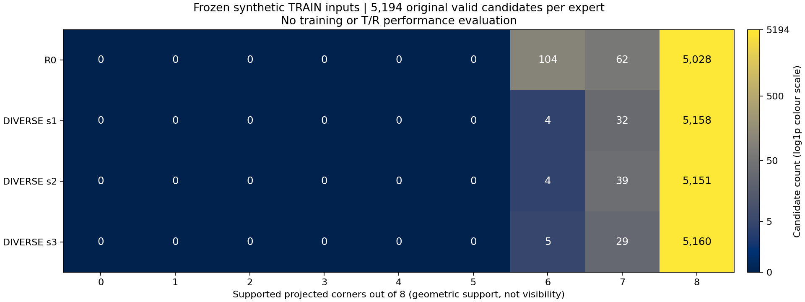

# DINO 외형 입력의 TRAIN 감사

**새 모델 학습 0회 · 새 T/R 성능 평가 0회 · 실사 실행 0회. 원래의 안정적인 T/R 동시 개선 목표는 아직 달성하지 못했다.**

이번 단계는 고정된 합성 TRAIN RGB와 기존 후보 pose에서 외형 특징을 만들고, 저장된 입력을 독립적으로 검산했다. 입력 감사의 PASS는 개선 성능의 PASS가 아니다. 직전 비대칭 손실 모델(Q)의 source 판정은 **43/45 조건 통과, 전체 FAIL(2개 실패)**로 그대로이며, 이번 입력으로 재학습하거나 새 후보 선택 정책을 평가하지 않았다.

적격 TRAIN **2,598행**을 전부 유지했다. 기존 후보가 모두 실패한 1행은 0으로 남겼고, 고정 DINO backbone 순전파는 **2,597회**였다. 4개 expert의 유효 후보는 합계 **20,776개**이며, 새 pose 추정·PnP·GT 오류 계산은 없었다.

## 기존 캐시 재사용 감사

기존 diversity 캐시 8,505개는 source TRAIN 8,192개·source held 64개·실사 249개로 구성되어 있다. 아래는 tail 캐시까지 합친 wide-cache 합집합과 현재 source 집합의 대응이다. 실사 캐시값과 GT 배열은 이번 감사에서 읽지 않았다.

| 현재 집합 | 전체 행 | 이미지 ID·SHA 일치 | 현재 crop 행렬까지 정확히 일치 |
|---|---:|---:|---:|
| 고정 source 전체 | 5,120 | 710 | 0 |
| 적격 TRAIN | 2,598 | 376 | 0 |
| source VAL | 1,024 | 140 | 0 |

이미지가 같아도 기존 역변환 box로 만든 crop과 현재 고정 R0 box의 crop 행렬이 정확히 같지 않았다. 토큰 격자와 전처리까지 동일해야 한다는 재사용 계약에 따라 기존 토큰은 재사용하지 않았다. 이 차이가 성능을 바꾼다는 결론은 내리지 않는다. VAL 140행은 캐시 식별·입력 메타데이터 대응만 확인했으며, 새 VAL 특징이나 품질 수치는 계산하지 않았다.

## 고정 입력 구성과 지원점 분포

현재 R0의 선택 box로 만든 동일한 wide crop(576×768)을 모든 후보가 공유한다. 고정 DINOv2 ViT-S/14의 384×56×42 FP16 token 격자에서 기존 pose의 8개 모서리 투영 위치를 bilinear 방식으로 읽는다. 양의 깊이·준비된 이미지 경계·crop 경계 안의 점만 지원점이며, 이는 **가시성·가림 여부의 정답이 아니다**. 중심점은 사용하지 않는다.

지원점의 384개 채널을 채널별 정렬 후 평균하고 지원점 수/8을 붙여 385차원을 만든다. 정렬은 코너 순서에 따른 부동소수점 합산 차이를 막는다. R0의 원래 유효 TRAIN 후보 5,194개로만 FP32 mean/std(최솟값 1e-6)를 고정했다. 기존 candidate valid mask는 바꾸지 않았다.

| Expert | 유효 후보 | 지원점 0–5개 | 6개 | 7개 | 8개 |
|---|---:|---:|---:|---:|---:|
| R0 | 5,194 | 0 | 104 | 62 | 5,028 |
| DIVERSE251_s1 | 5,194 | 0 | 4 | 32 | 5,158 |
| DIVERSE251_s2 | 5,194 | 0 | 4 | 39 | 5,151 |
| DIVERSE251_s3 | 5,194 | 0 | 5 | 29 | 5,160 |

### 준비된 이미지의 반사 padding: 학습 전 입력 계약 보완 필요

현재 지원점 검사는 원영상이 아니라 이미 사방 100 px 반사 padding을 포함한 prepared canvas를 기준으로 한다. 지원점 위치가 원래 영상 영역 밖의 반사 띠에 들어가는 경우가 확인되었다. 아래 숫자는 현재 입력을 바꾸지 않고 집계한 값이다.

| Expert | 지원점 전체 | 반사 padding 내 지원점 | 영향을 받는 후보 / 5,194 |
|---|---:|---:|---:|
| R0 | 41,282 | 3,618 | 2,002 |
| DIVERSE251_s1 | 41,512 | 3,390 | 1,890 |
| DIVERSE251_s2 | 41,505 | 3,418 | 1,893 |
| DIVERSE251_s3 | 41,513 | 3,395 | 1,882 |

다음 학습은 원본 영상 영역을 구분한 입력 수정·독립 검산 후 진행한다. 기존 pad 메타데이터로 원영상 밖의 샘플 위치를 제외하는 계약을 먼저 고정하고, 보존된 token으로 다시 pooling한다. 이 단계는 입력 계약 보완이며 GT·성능 문턱 탐색이 아니다. 이 보고서의 현재 descriptor·지원 mask·정규화는 수정하지 않았다. 원영상 안에서 읽는 token도 receptive field를 통해 padding 문맥의 영향을 받을 수 있어, 위치 제외만으로 문맥 영향까지 제거된다고 보장할 수 없다.

## 독립 검산과 두 가설의 입력 차이

독립 검산은 저장된 token을 한 프레임씩 읽고 별도 scalar 투영과 Torch CPU float64 grid_sample로 20,776개 descriptor를 다시 구성했다. 사전 허용오차는 atol=rtol=2e-6이다. 모든 token 파일·프레임 hash, 유효성, 지원점, 정규화를 확인했다. **backbone 순전파와 RGB 전처리 전체를 독립적으로 다시 실행한 검산은 아니다.**

| Expert | 서로 다른 W/D 가설 입력 행 / 2,597 | raw 차이 L2 중앙값 | 정규화 차이 L2 중앙값 | 검산 최대 절대차 |
|---|---:|---:|---:|---:|
| R0 | 2,597 | 3.6293146 | 3.35564051 | 1.51511843e-06 |
| DIVERSE251_s1 | 2,597 | 3.5521023 | 3.29350704 | 1.33539335e-06 |
| DIVERSE251_s2 | 2,597 | 3.57225615 | 3.30701418 | 1.62586729e-06 |
| DIVERSE251_s3 | 2,597 | 3.57452939 | 3.30314399 | 1.7091793e-06 |

W/D는 고정 long-face-front/short-face-front 가설을 뜻한다. 위 값은 각 expert 내부 두 가설의 입력 차이이며, 서로 다른 expert 사이의 성능 비교가 아니다. 입력이 달라진다는 사실만으로 올바른 T/R 방향이나 안전한 개선 후보를 구별할 수 있다고 결론 내릴 수 없다. 정답 오류·새 selector 점수·학습 가중치는 읽지 않았다.

## 합성 TRAIN RGB 6장과 물리 치수

정렬된 성능으로 고르지 않고, 봉인된 적격 TRAIN 배열의 **첫 6행**을 그대로 사용했다. 왼쪽은 원래 준비된 합성 RGB, 오른쪽은 기존 R0 anchor pose의 8개 모서리와 입력 지원점이다. 자홍색 점선 안은 원영상이고 바깥은 기존 반사 padding이다. 추가 padding은 0이며, GT 윤곽·T/R 오류·새 모델 결과는 표시하지 않는다. 치수는 입력 메타데이터의 물리 W/H/D(m)에 100을 곱한 cm이고, 투영에는 별도로 저장된 camera-facing extents를 사용한다.

| TRAIN ID | source index | W (cm) | H (cm) | D (cm) |
|---|---:|---:|---:|---:|
| G38__G__f21300 | 0 | 99.10 | 14.26 | 134.67 |
| G38__G__f35222 | 1 | 84.23 | 15.88 | 104.91 |
| TEX__shard_04_f0941 | 2 | 102.80 | 14.94 | 109.95 |
| TEX__shard_05_f0852 | 4 | 95.31 | 9.76 | 112.98 |
| TEX__shard_04_f0184 | 5 | 102.70 | 9.58 | 148.38 |
| P0__shard_01_f0173 | 6 | 108.96 | 15.56 | 111.59 |

## 재현 범위와 증거

공유 source metadata·pose·feature 컨테이너에는 VAL 행도 들어 있지만, 새 descriptor 생성과 수치 검산에는 적격 TRAIN 행만 사용했다. 기존 캐시 대응 감사의 VAL 입력 메타데이터 확인과 새로운 VAL 특징 추출은 구분한다. 공개 그림은 모두 합성 TRAIN 입력이며 실사 결과가 아니다.

전체 FP16 token 파일은 로컬에 보존했다(4,692,861,056 bytes). 약 4.7 GB token, 원본 RGB, NPZ와 backbone 가중치는 GitHub 공개 번들에 넣지 않는다. 공개 영수증에는 경로·SHA가 남지만, 전체 재현에는 해당 로컬 자료가 필요하다. 이 보고서 생성은 저장 token이나 backbone을 다시 읽거나 실행하지 않는다.

[입력 프로토콜](INPUT_PROTOCOL.json) · [캐시 계약 감사](CACHE_CONTRACT.json) · [추출 영수증](TRAIN_APPEARANCE_INPUTS.json) · [독립 입력 검산](INPUT_VERIFICATION_KO.md) · [독립 검산 JSON](INPUT_VERIFICATION.json) · [전처리 순수 검산](PREPROCESSING_PURE_CHECK.json) · [반사 padding 감사](PADDING_SUPPORT_AUDIT.json)

[보고서 수치·그림 provenance](REPORT_DATA.json) · [입력 설계 검토](FEATURE_DESIGN_REVIEW_KO.md) · [선행 방법 검토](PRIOR_METHODS_KO.md) · [공개 검토](PUBLIC_REVIEW_KO.md) · [공개 파일 목록](PUBLICATION_MANIFEST.json)

[재현 코드](../../../scripts/research/pallet_pose_dino_input_audit_20261001_v1/report.py) · [직전 Q 결과](../pallet_pose_signed_axes_asymmetric_20261001_v1/REPORT_KO.md)
