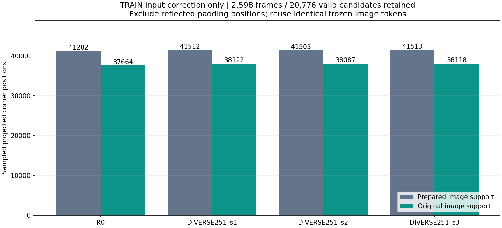
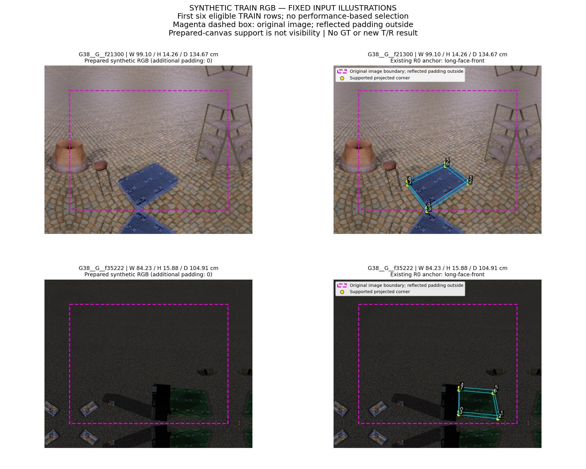
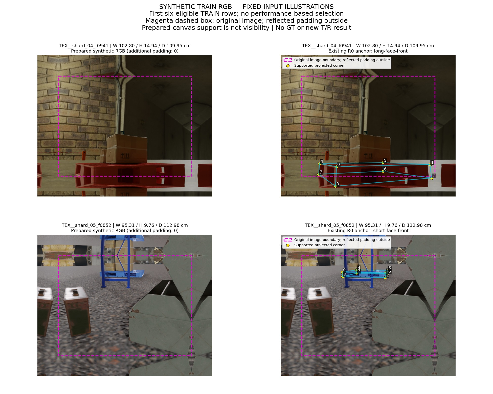
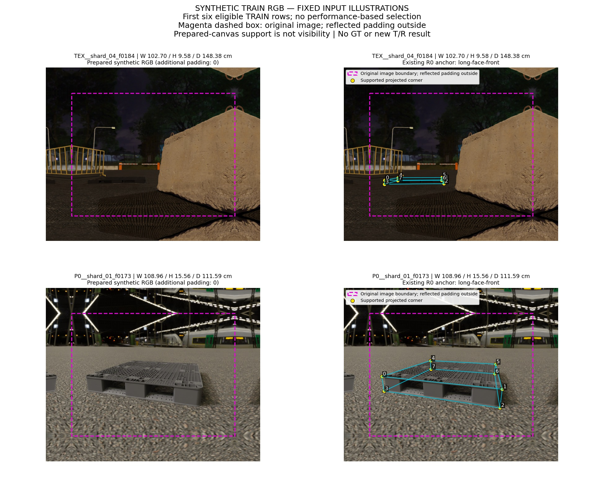

# 원본 이미지 영역의 특징 검산 결과

**입력 검산 PASS. 이 단계에서 새 학습과 T/R 성능 평가는 하지 않았다.** 기존 합성 TRAIN 2,598행과 실패 1행, 유효 후보 20,776개를 유지했다. 반사 패딩 위치만 표본에서 제외했다.

| 후보 | 기존 지원점 | 원본 영역 지원점 | 제외한 패딩점 | 특징이 바뀐 후보 |
|---|---:|---:|---:|---:|
| R0 | 41282 | 37664 | 3618 | 2002 |
| DIVERSE251_s1 | 41512 | 38122 | 3390 | 1890 |
| DIVERSE251_s2 | 41505 | 38087 | 3418 | 1893 |
| DIVERSE251_s3 | 41513 | 38118 | 3395 | 1882 |



지원점은 고정 pose와 실제 W/H/D 치수, 기존 K로 투영한 8개 꼭짓점 중 양의 깊이·crop 범위·원본 영상 범위를 만족하는 점이다. 가시성 정답이 아니다. 원본 영상의 반열린 범위는 준비된 source 좌표에서 `[100, width−100) × [100, height−100)`이다. 실제 사진에는 padding을 추가하지 않는다.

기존 4.69GB token을 그대로 재사용했다. 새 GPU forward·학습·PnP·정답 조회는 0회다. FP32 정규화는 원래 R0 유효 TRAIN 후보 5,194개로 다시 계산했다. 지원점이 0인 유효 후보도 삭제하지 않는 구현이며, 이번 실제 TRAIN에는 그런 후보가 없었다.

독립 구현은 전체 descriptor와 지원점, token 해시, 정규화를 확인했다. FP64 표본화 비교의 최대 절대 차이는 1.7091793e-06이며 고정 허용오차 atol=rtol=2e−6을 통과했다. 정규화와 지원점은 정확히 일치했다.

생산 직후 저장한 [생성 기록](CONSTRUCTION_KO.md)의 “독립 검산 전” 상태는 당시 기록으로 보존했다. 이후 [독립 검산](INPUT_VERIFICATION_KO.md)이 완료되었으며 현재 상태는 PASS다.

## 사용 이미지와 치수

아래는 이전 입력 감사와 같은 첫 6개 적격 합성 TRAIN 이미지다. 각 이미지에 W/H/D(cm), 원래 영상 경계, 기존 R0 투영이 표시되어 있다. 이번 학습 결과나 실사 성능 예시가 아니다. 순서를 고정했고 성능으로 고르지 않았다.





## 한계와 재현

원본 영역의 token도 DINO의 전역 문맥을 통해 반사 패딩의 영향을 받을 수 있다. backbone forward 자체를 별도 구현으로 재실행한 검증은 아니다. 꼭짓점 평균은 순열에 불변이지만 순서 정보도 버린다. 입력 검산은 T/R 개선 증거가 아니다.

[설계](DESIGN_KO.md) · [프로토콜](INPUT_PROTOCOL.json) · [생성 영수증](TRAIN_APPEARANCE_INPUTS.json) · [전체 검산](INPUT_VERIFICATION.json) · [렌더링 데이터](REPORT_DATA.json)

대용량 token/NPZ/원본 데이터는 로컬에 보존하며 GitHub에는 올리지 않는다. 공개 코드와 해시만으로 원본 데이터 없이 전체 실험을 재실행할 수는 없다.

```bash
MPLBACKEND=Agg OPENBLAS_NUM_THREADS=1 OMP_NUM_THREADS=1 python -B -m scripts.research.pallet_pose_dino_native_inputs_20261001_v1.report
```
