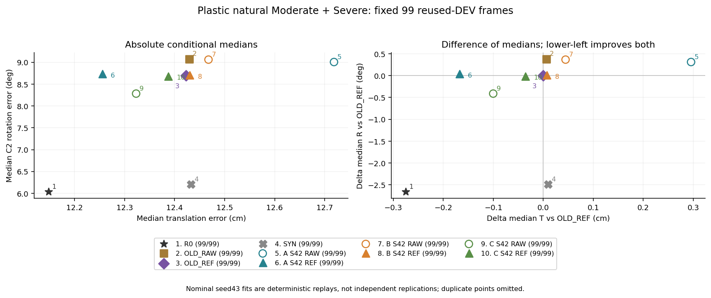
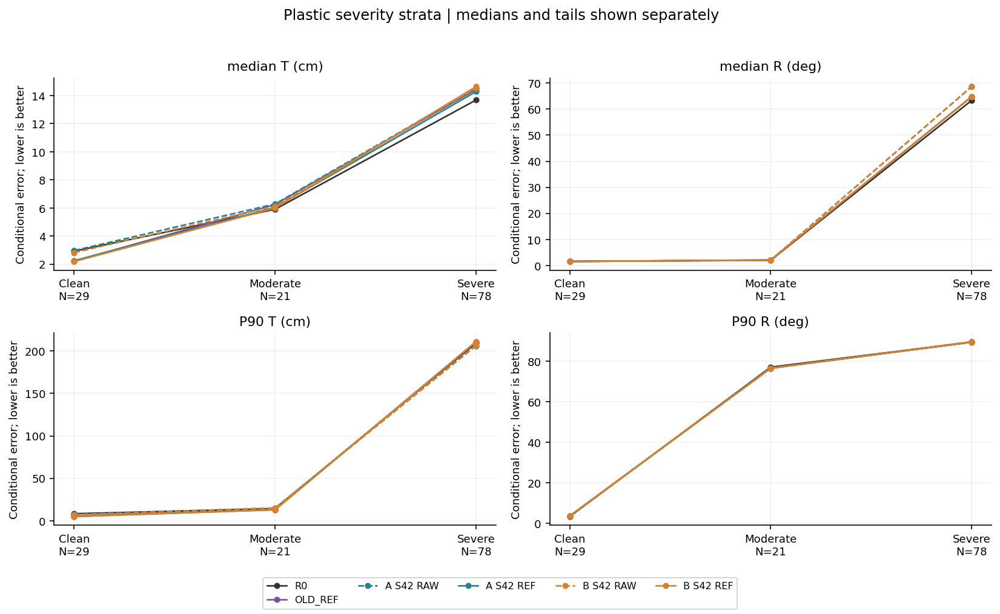
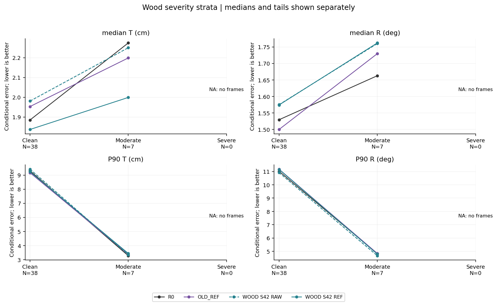
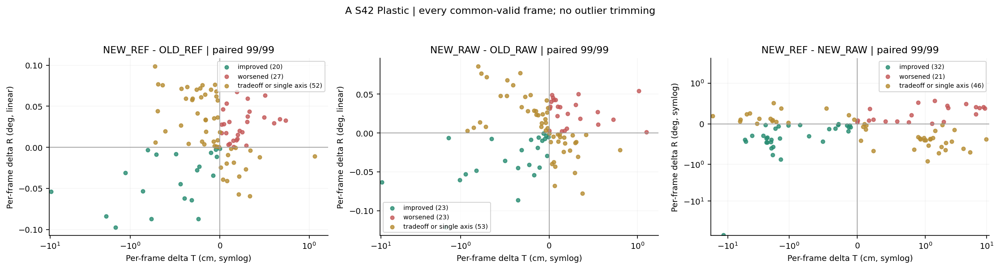
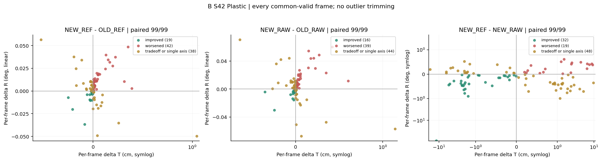
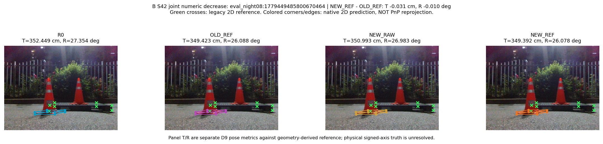
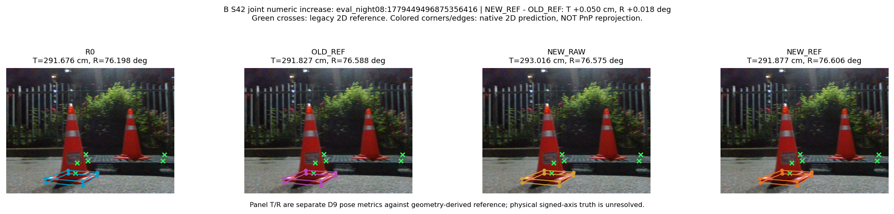

# Measured figure index

All labels/captions are English. These are reused-DEV diagnostics, not independent generalization or physical signed-axis validation.

## objective99_tr_scatter

Lower T and R are better. Conditional medians with full99 pose coverage in legend; no T/R weighted sum, no independent-test claim. Right panel is difference of medians, not median frame delta.

## plastic_severity_tr

Natural severity labels fixed before fits. P90 is not median. Missing Wood Severe is NA, not zero. Valid-pose conditional summaries retain full-stratum denominators in bound result JSON.

## wood_severity_tr

Natural severity labels fixed before fits. P90 is not median. Missing Wood Severe is NA, not zero. Valid-pose conditional summaries retain full-stratum denominators in bound result JSON.

## a_input_occlusion_plastic_s42_paired_frame_tr_delta

Posthoc descriptive frame deltas. Symlog linear interval +/-1 in each axis is a display setting, not an improvement threshold. Numeric parity tolerance1e-7; no pose failures silently become zero.

## b_coordinate_supplement_plastic_s42_paired_frame_tr_delta

Posthoc descriptive frame deltas. Symlog linear interval +/-1 in each axis is a display setting, not an improvement threshold. Numeric parity tolerance1e-7; no pose failures silently become zero.

## a_input_occlusion_plastic_s42_improved

Already-public RGB only. Joint numeric T/R change against OLD_REF is not a practical-significance claim and is not native2D visual improvement. R0 panels are separate descriptive baseline, not the example selection comparator.

## a_input_occlusion_plastic_s42_worsened

Already-public RGB only. Joint numeric T/R change against OLD_REF is not a practical-significance claim and is not native2D visual improvement. R0 panels are separate descriptive baseline, not the example selection comparator.

## b_coordinate_supplement_plastic_s42_improved

Already-public RGB only. Joint numeric T/R change against OLD_REF is not a practical-significance claim and is not native2D visual improvement. R0 panels are separate descriptive baseline, not the example selection comparator.

## b_coordinate_supplement_plastic_s42_worsened

Already-public RGB only. Joint numeric T/R change against OLD_REF is not a practical-significance claim and is not native2D visual improvement. R0 panels are separate descriptive baseline, not the example selection comparator.

## Unavailable example categories

- A_INPUT_OCCLUSION PLASTIC S42 unchanged: No already-public, common-valid frame in the requested population meets the same two-axis rule.
- B_COORDINATE_SUPPLEMENT PLASTIC S42 unchanged: No already-public, common-valid frame in the requested population meets the same two-axis rule.
