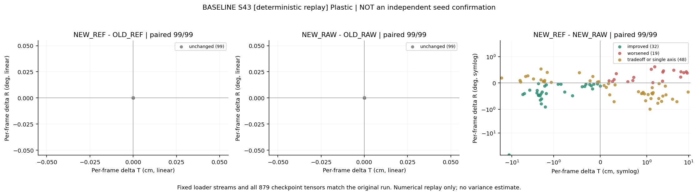
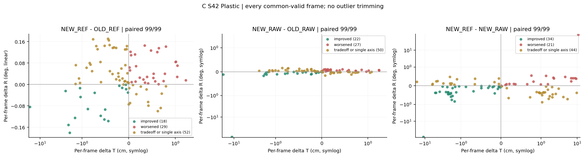
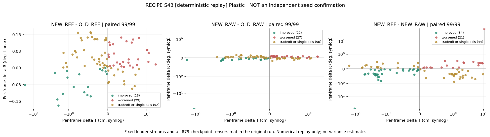
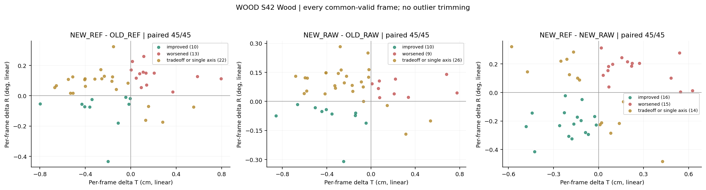
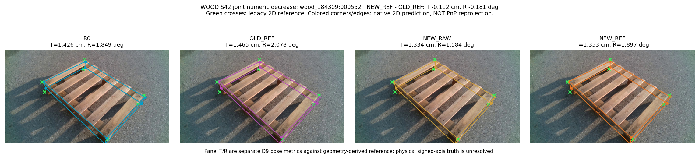
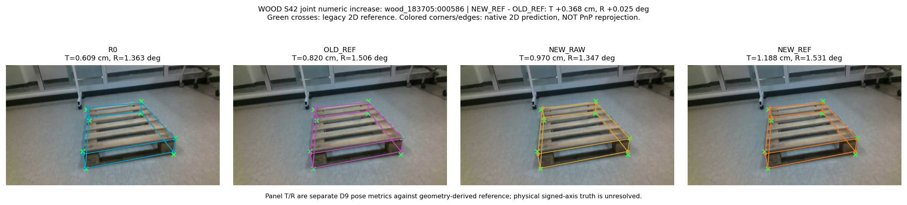

# Measured figure index

All labels/captions are English. These are reused-DEV diagnostics, not independent generalization or physical signed-axis validation.

Nominal seed43 fits reproduced identical loader streams and all879 tensors. They are numerical replays, **not independent training-seed replications**. Effective replication is NOT_RUN; final scope remains PARTIAL_BUDGET. Duplicate replay points/curves are omitted from the objective/severity overviews, while separately labeled replay plots remain visible. Historical FINAL_SELECTION wording does not override [the correction](REPLICATION_VALIDITY_CORRECTION.md).

## objective99_tr_scatter

Lower T and R are better. Conditional medians with full99 pose coverage in legend; no T/R weighted sum, no independent-test claim. Right panel is difference of medians, not median frame delta. Seed43 has identical streams/state: duplicate reruns omitted from overview; see separate replay plots and REPLICATION_VALIDITY_CORRECTION.

## plastic_severity_tr

Natural severity labels fixed before fits. P90 is not median. Missing Wood Severe is NA, not zero. Valid-pose conditional summaries retain full-stratum denominators in bound result JSON. Identical seed43 replay curves omitted; no independent robustness inferred.

## wood_severity_tr

Natural severity labels fixed before fits. P90 is not median. Missing Wood Severe is NA, not zero. Valid-pose conditional summaries retain full-stratum denominators in bound result JSON. Identical seed43 replay curves omitted; no independent robustness inferred.

## a_input_occlusion_plastic_s42_paired_frame_tr_delta

Posthoc descriptive frame deltas. Symlog linear interval +/-1 in each axis is a display setting, not an improvement threshold. Numeric parity tolerance1e-7; no pose failures silently become zero.

## baseline_repeat_plastic_s43_paired_frame_tr_delta

Posthoc descriptive frame deltas. Symlog linear interval +/-1 in each axis is a display setting, not an improvement threshold. Numeric parity tolerance1e-7; no pose failures silently become zero. Deterministic replay only, NOT independent training variation or evidence of robustness.

## b_coordinate_supplement_plastic_s42_paired_frame_tr_delta

Posthoc descriptive frame deltas. Symlog linear interval +/-1 in each axis is a display setting, not an improvement threshold. Numeric parity tolerance1e-7; no pose failures silently become zero.

## c_exposure_plastic_s42_paired_frame_tr_delta

Posthoc descriptive frame deltas. Symlog linear interval +/-1 in each axis is a display setting, not an improvement threshold. Numeric parity tolerance1e-7; no pose failures silently become zero.

## recipe_repeat_plastic_s43_paired_frame_tr_delta

Posthoc descriptive frame deltas. Symlog linear interval +/-1 in each axis is a display setting, not an improvement threshold. Numeric parity tolerance1e-7; no pose failures silently become zero. Deterministic replay only, NOT independent training variation or evidence of robustness.

## wood_applicability_wood_s42_paired_frame_tr_delta

Posthoc descriptive frame deltas. Symlog linear interval +/-1 in each axis is a display setting, not an improvement threshold. Numeric parity tolerance1e-7; no pose failures silently become zero.

## selected_c_exposure_plastic_s42_improved

Already-public RGB only. Joint numeric T/R change against OLD_REF is not a practical-significance claim and is not native2D visual improvement. R0 panels are separate descriptive baseline, not the example selection comparator.

## selected_c_exposure_plastic_s42_worsened

Already-public RGB only. Joint numeric T/R change against OLD_REF is not a practical-significance claim and is not native2D visual improvement. R0 panels are separate descriptive baseline, not the example selection comparator.

## wood_applicability_wood_s42_improved

Already-public RGB only. Joint numeric T/R change against OLD_REF is not a practical-significance claim and is not native2D visual improvement. R0 panels are separate descriptive baseline, not the example selection comparator.

## wood_applicability_wood_s42_worsened

Already-public RGB only. Joint numeric T/R change against OLD_REF is not a practical-significance claim and is not native2D visual improvement. R0 panels are separate descriptive baseline, not the example selection comparator.

## Unavailable example categories

- C_EXPOSURE PLASTIC S42 unchanged: No already-public, common-valid frame in the requested population meets the same two-axis rule.
- WOOD_APPLICABILITY WOOD S42 unchanged: No already-public, common-valid frame in the requested population meets the same two-axis rule.
