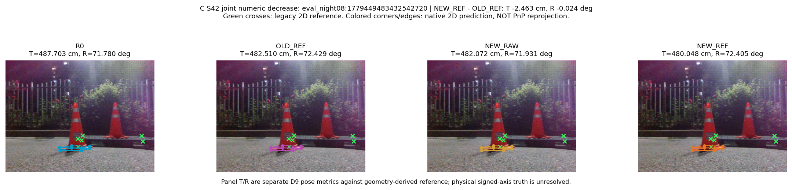
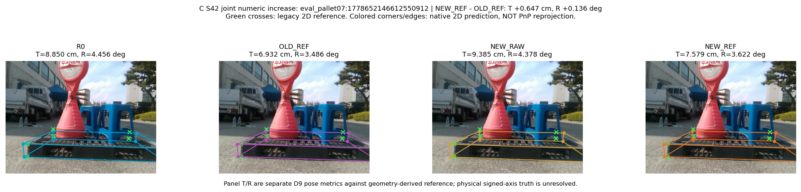

# Translation / rotation 우선 후속 실험

상태: **FINAL**. EXECUTION=PARTIAL_BUDGET; POSE_OUTCOME=MIXED; REPEAT=NOT_RUN.

## 문제

기존 REF의 보조 지표 향상이 실제 위치와 방향의 동시 개선인지 다시 묻는다. 주 모집단은 자연 가림 Plastic Moderate + Severe의 고정 frame 집합이며, 전체 Plastic 및 Wood의 난도·recording도 함께 공개한다. OLD_RAW / OLD_REF는 과거 원 recipe, NEW_RAW / NEW_REF는 각 실행의 matched 좌표 조건이다.

## 왜 이 개입인가

A는 입력에만 가림을 추가하여 보이는/가려지는 감독점의 학습 신호를 유지하는 가설이다. B는 기존 location 항의 큰 오차 감쇠를 보완하는 정규화 좌표 SmoothL1 항이다. C는 A의 실제 가림 노출이 제한적이었다는 관측에서 schedule만 높인 대조다. B가 두 주 지표를 모두 개선하지 못하여 A+B 결합은 실행하지 않았다. C 선택은 기존 REF 대비 두 부호가 아주 조금 좋아진 사실만을 근거로 한 반복 대상 지정이며 성능 승격이 아니다.

## 선행연구와 다른 점

가림과 easy–hard 학습 원리, 좌표 regression과 heatmap 손실을 구분했다. 현재 head의 RLE는 이미 존재하며 optical flow가 아니다. dense detector Focal과 heatmap Adaptive Wing을 현재 pose 좌표에 그대로 이식하지 않았다. 원문·공식 구현의 열람 범위와 전제 차이는 [RELATED_WORK](RELATED_WORK.md), [SOURCE_REGISTRY](SOURCE_REGISTRY.json)에 남겼다.

| 아이디어 | 실제 처리와 해석 |
| --- | --- |
| A | 입력 가림: paired fit 및 평가 완료. 결과는 tradeoff. |
| B | 좌표 보완: TRAIN runtime/gradient 진단 후 paired fit. 기존 REF 대비 두 중앙값 모두 악화. |
| C | 유효 가림 노출 증가: paired fit. 작은 joint sign만 있어 같은 seed의 원 recipe 대조군을 둔 추가 반복 대상으로 지정. |
| D | 동결 detector의 Focal은 적용 대상 아님. kobj/GHMR은 별도 가설로 보류; 실패로 기록하지 않음. |
| E | soft-target 경계·질량·ignore CPU fixture만 확인. heatmap/teacher 전이 fit은 실행하지 않음. |
| F | 과거 저장 refiner의 제한된 자산 재사용 가능성만 CPU 확인. 현재 pool의 새 teacher/student 전이는 실행하지 않음. |

## 사용한 정보

기존 TRAIN 이미지·동결 pseudo target·source replay만 사용한다. 평가 reference는 paired native prediction 및 공통 D9 pose가 저장·잠긴 뒤에만 점수 계산에 사용한다. 2D click과 기존 geometry reference는 독립적인 물리 축 검증과 같지 않다. 새 manual 감독이나 sealed TEST 개봉은 없다. frame 좌표·K·pose 배열·checkpoint는 비공개 data 경로에 남기고, 공개 JSON은 집계 및 해시/경로 메타데이터만 담는다. 기존 teacher 노출과 재료 pool 차이는 [POOL_AND_SUPERVISION_AUDIT](POOL_AND_SUPERVISION_AUDIT.md)에 명시했다.

## 공정 대조와 지표 계약

각 RAW/REF 쌍은 같은 R0 초기화, RGB·이름 순서·box, source 비율, update 수 및 pose/flow 학습 범위를 공유한다. detector/backbone과 BN·buffer는 고정한다. 기존 augmentation의 경계 clipping 때문에 좌표 조건에 따라 최종 지원점이 소수 batch에서 다르므로 “모든 최종 mask가 완전히 같다”고 주장하지 않는다. 실제 batch trace 및 차이 수를 [EXPERIMENT_LOG](EXPERIMENT_LOG.md)에 공개한다.

실제 R0 구조와 trainer 선택식을 CPU로 확인한 학습 범위는 재료별 539514 scalar parameters / 132 parameter tensors이며, 전체 879 state tensors 중 747개를 동결한다. [정확한 재료별 inventory](TRAINABLE_PARAMETER_INVENTORY.json).

T는 같은 pallet centroid의 유클리드 거리(cm), R은 object→camera full rotation의 물리 C2 대칭 최소 geodesic(deg)이다. yaw는 보조이고 camera x/z는 차량 좌표가 아니다. 실패를 삭제한 conditional 값만 보지 않고 valid/N와 실패를 +∞로 보존한 full-population quantile을 확인한다. severity 중앙값의 평균이 아니라 실제 frame들을 합쳐 primary를 계산한다. 계약: [METRIC_CONTRACT](METRIC_CONTRACT.md).

## 실제 T · R 결과

| 조건 / 모델 | valid / N | T cm median / P90 | R deg median / P90 | yaw deg median / P90 | axis 오류 | pose 실패 |
| --- | --- | --- | --- | --- | --- | --- |
| BASE/PLASTIC/R0 | 99/99 | 12.147922 / 120.471370 | 6.037944 / 89.218262 | 5.563436 / 88.888879 | 45 | 0 |
| BASE/PLASTIC/OLD_RAW | 99/99 | 12.429008 / 119.308678 | 9.074374 / 89.309873 | 8.998087 / 89.150269 | 47 | 0 |
| BASE/PLASTIC/OLD_REF | 99/99 | 12.423010 / 127.143068 | 8.694696 / 89.197272 | 7.694101 / 88.913988 | 46 | 0 |
| BASE/PLASTIC/SYN | 99/99 | 12.432426 / 121.105137 | 6.203132 / 88.986411 | 5.533137 / 88.842928 | 45 | 0 |
| A_INPUT_OCCLUSION/PLASTIC/S42/NEW_RAW | 99/99 | 12.718668 / 119.144619 | 9.006389 / 89.319711 | 8.933738 / 89.163342 | 47 | 0 |
| A_INPUT_OCCLUSION/PLASTIC/S42/NEW_REF | 99/99 | 12.255720 / 127.174973 | 8.730257 / 89.215186 | 7.740697 / 88.941932 | 46 | 0 |
| BASELINE_REPEAT/PLASTIC/S43/NEW_RAW | 99/99 | 12.429008 / 119.308678 | 9.074374 / 89.309873 | 8.998087 / 89.150269 | 47 | 0 |
| BASELINE_REPEAT/PLASTIC/S43/NEW_REF | 99/99 | 12.423010 / 127.143068 | 8.694696 / 89.197272 | 7.694101 / 88.913988 | 46 | 0 |
| B_COORDINATE_SUPPLEMENT/PLASTIC/S42/NEW_RAW | 99/99 | 12.467667 / 119.254773 | 9.061617 / 89.312663 | 8.984703 / 89.153948 | 47 | 0 |
| B_COORDINATE_SUPPLEMENT/PLASTIC/S42/NEW_REF | 99/99 | 12.430253 / 127.116991 | 8.704029 / 89.203264 | 7.707125 / 88.925986 | 46 | 0 |
| C_EXPOSURE/PLASTIC/S42/NEW_RAW | 99/99 | 12.322978 / 118.880869 | 8.283290 / 89.297929 | 7.235244 / 89.188717 | 46 | 0 |
| C_EXPOSURE/PLASTIC/S42/NEW_REF | 99/99 | 12.387281 / 126.911220 | 8.682595 / 89.266298 | 7.688518 / 88.999830 | 46 | 0 |
| RECIPE_REPEAT/PLASTIC/S43/NEW_RAW | 99/99 | 12.322978 / 118.880869 | 8.283290 / 89.297929 | 7.235244 / 89.188717 | 46 | 0 |
| RECIPE_REPEAT/PLASTIC/S43/NEW_REF | 99/99 | 12.387281 / 126.911220 | 8.682595 / 89.266298 | 7.688518 / 88.999830 | 46 | 0 |

| 조건 / after − before | common / N | Δ T 중앙값 cm | Δ R 중앙값 deg | median frame ΔT cm | median frame ΔR deg | valid→fail | fail→valid |
| --- | --- | --- | --- | --- | --- | --- | --- |
| A_INPUT_OCCLUSION/PLASTIC/S42/PRIMARY_MODERATE_PLUS_SEVERE/NEW_REF-minus-OLD_REF | 99/99 | -0.167291 | +0.035561 | -0.038043 | +0.008702 | 0 | 0 |
| A_INPUT_OCCLUSION/PLASTIC/S42/PRIMARY_MODERATE_PLUS_SEVERE/NEW_REF-minus-R0 | 99/99 | +0.107798 | +2.692313 | -0.310078 | -0.245130 | 0 | 0 |
| A_INPUT_OCCLUSION/PLASTIC/S42/PRIMARY_MODERATE_PLUS_SEVERE/NEW_REF-minus-NEW_RAW | 99/99 | -0.462948 | -0.276132 | +0.002275 | -0.073442 | 0 | 0 |
| BASELINE_REPEAT/PLASTIC/S43/PRIMARY_MODERATE_PLUS_SEVERE/NEW_REF-minus-OLD_REF | 99/99 | +0.000000 | +0.000000 | +0.000000 | +0.000000 | 0 | 0 |
| BASELINE_REPEAT/PLASTIC/S43/PRIMARY_MODERATE_PLUS_SEVERE/NEW_REF-minus-R0 | 99/99 | +0.275089 | +2.656752 | -0.227048 | -0.237309 | 0 | 0 |
| BASELINE_REPEAT/PLASTIC/S43/PRIMARY_MODERATE_PLUS_SEVERE/NEW_REF-minus-NEW_RAW | 99/99 | -0.005997 | -0.379678 | -0.033378 | -0.096520 | 0 | 0 |
| B_COORDINATE_SUPPLEMENT/PLASTIC/S42/PRIMARY_MODERATE_PLUS_SEVERE/NEW_REF-minus-OLD_REF | 99/99 | +0.007242 | +0.009333 | +0.004626 | +0.003940 | 0 | 0 |
| B_COORDINATE_SUPPLEMENT/PLASTIC/S42/PRIMARY_MODERATE_PLUS_SEVERE/NEW_REF-minus-R0 | 99/99 | +0.282331 | +2.666084 | -0.193857 | -0.231524 | 0 | 0 |
| B_COORDINATE_SUPPLEMENT/PLASTIC/S42/PRIMARY_MODERATE_PLUS_SEVERE/NEW_REF-minus-NEW_RAW | 99/99 | -0.037415 | -0.357588 | -0.057479 | -0.082482 | 0 | 0 |
| C_EXPOSURE/PLASTIC/S42/PRIMARY_MODERATE_PLUS_SEVERE/NEW_REF-minus-OLD_REF | 99/99 | -0.035730 | -0.012101 | -0.055007 | +0.019063 | 0 | 0 |
| C_EXPOSURE/PLASTIC/S42/PRIMARY_MODERATE_PLUS_SEVERE/NEW_REF-minus-R0 | 99/99 | +0.239359 | +2.644651 | -0.195561 | -0.238403 | 0 | 0 |
| C_EXPOSURE/PLASTIC/S42/PRIMARY_MODERATE_PLUS_SEVERE/NEW_REF-minus-NEW_RAW | 99/99 | +0.064303 | +0.399305 | -0.052887 | -0.065493 | 0 | 0 |
| RECIPE_REPEAT/PLASTIC/S43/PRIMARY_MODERATE_PLUS_SEVERE/NEW_REF-minus-OLD_REF | 99/99 | -0.035730 | -0.012101 | -0.055007 | +0.019063 | 0 | 0 |
| RECIPE_REPEAT/PLASTIC/S43/PRIMARY_MODERATE_PLUS_SEVERE/NEW_REF-minus-R0 | 99/99 | +0.239359 | +2.644651 | -0.195561 | -0.238403 | 0 | 0 |
| RECIPE_REPEAT/PLASTIC/S43/PRIMARY_MODERATE_PLUS_SEVERE/NEW_REF-minus-NEW_RAW | 99/99 | +0.064303 | +0.399305 | -0.052887 | -0.065493 | 0 | 0 |
| C-minus-A/NEW_RAW/PRIMARY_MODERATE_PLUS_SEVERE | 99/99 | -0.395690 | -0.723098 | +0.004938 | +0.004192 | 0 | 0 |
| C-minus-A/NEW_REF/PRIMARY_MODERATE_PLUS_SEVERE | 99/99 | +0.131561 | -0.047662 | -0.007634 | +0.007467 | 0 | 0 |
| 명목 추가 seed 재실행/RECIPE−BASELINE/NEW_RAW/PRIMARY_MODERATE_PLUS_SEVERE | 99/99 | -0.106030 | -0.791084 | -0.011640 | +0.016637 | 0 | 0 |
| 명목 추가 seed 재실행/RECIPE−BASELINE/NEW_REF/PRIMARY_MODERATE_PLUS_SEVERE | 99/99 | -0.035730 | -0.012101 | -0.055007 | +0.019063 | 0 | 0 |

C의 기존 REF 대비 변화는 수치 부호상의 작은 개선에 불과하다. R0 및 같은 C recipe의 RAW보다 두 축이 나쁘다는 반증을 함께 둔다. C−A는 T가 악화하고 R이 개선하는 tradeoff이므로 노출 증가 자체의 joint 개선으로 읽을 수 없다. 반복 recipe는 동일 추가 seed의 BASELINE_REPEAT와 비교해야 하며 과거 seed의 OLD_REF와 비교한 수치만으로 recipe 효과를 주장하지 않는다.

전체 Plastic/Wood, CLEAN/Moderate/Severe, recording별 N·valid·T/R/yaw·P90·full-population·camera 성분, 보조 PCK/ADD 및 source validation은 [FINAL_TABLES](FINAL_TABLES.md)에 모두 있다. Wood의 없는 Severe를 영점 성능으로 채우지 않는다. 과거 C2/C3는 사후 참고선이며 새 후보 선정에 재사용하지 않는다.

Wood 적용성은 선택 후의 기술적 보조 검사다. 전체 45 frame에서 기존 REF T 2.071426 → 1.867061 cm, R 1.604867 → 1.593281 deg였다. 기존 REF 및 matched RAW 대비 두 중앙값의 부호가 개선되지만 R0 대비는 T 개선·R 악화이며, Plastic 결과의 독립적 재현으로 취급하지 않는다.

Wood를 자연 난도로 나누면 기존 REF 대비 R 중앙값은 CLEAN에서 +0.074132 deg, Moderate에서 +0.032418 deg로 둘 다 악화한다. 전체 pooled 중앙값의 작은 개선을 난도 전반의 회전 개선으로 해석하면 안 된다.

| 조건 / after − before | common / N | Δ T 중앙값 cm | Δ R 중앙값 deg | median frame ΔT cm | median frame ΔR deg | valid→fail | fail→valid |
| --- | --- | --- | --- | --- | --- | --- | --- |
| WOOD_APPLICABILITY/WOOD/S42/ALL/NEW_REF-minus-OLD_REF | 45/45 | -0.204365 | -0.011585 | -0.126886 | +0.071505 | 0 | 0 |
| WOOD_APPLICABILITY/WOOD/S42/ALL/NEW_REF-minus-R0 | 45/45 | -0.228069 | +0.048722 | -0.088065 | +0.048552 | 0 | 0 |
| WOOD_APPLICABILITY/WOOD/S42/ALL/NEW_REF-minus-NEW_RAW | 45/45 | -0.150489 | -0.039785 | -0.025781 | +0.005068 | 0 | 0 |

## 큰 실패와 손익

| 조건 / 대비 | T_↓__R_↓ | T_↓__R_= | T_↓__R_↑ | T_=__R_↓ | T_=__R_= | T_=__R_↑ | T_↑__R_↓ | T_↑__R_= | T_↑__R_↑ |
| --- | --- | --- | --- | --- | --- | --- | --- | --- | --- |
| A_INPUT_OCCLUSION/PLASTIC/S42/PRIMARY_MODERATE_PLUS_SEVERE/NEW_REF-minus-OLD_REF | 20 | 0 | 37 | 0 | 0 | 0 | 15 | 0 | 27 |
| A_INPUT_OCCLUSION/PLASTIC/S42/PRIMARY_MODERATE_PLUS_SEVERE/NEW_REF-minus-R0 | 44 | 0 | 13 | 0 | 0 | 0 | 22 | 0 | 20 |
| A_INPUT_OCCLUSION/PLASTIC/S42/PRIMARY_MODERATE_PLUS_SEVERE/NEW_REF-minus-NEW_RAW | 32 | 0 | 17 | 0 | 0 | 0 | 29 | 0 | 21 |
| BASELINE_REPEAT/PLASTIC/S43/PRIMARY_MODERATE_PLUS_SEVERE/NEW_REF-minus-OLD_REF | 0 | 0 | 0 | 0 | 99 | 0 | 0 | 0 | 0 |
| BASELINE_REPEAT/PLASTIC/S43/PRIMARY_MODERATE_PLUS_SEVERE/NEW_REF-minus-R0 | 42 | 0 | 12 | 0 | 0 | 0 | 24 | 0 | 21 |
| BASELINE_REPEAT/PLASTIC/S43/PRIMARY_MODERATE_PLUS_SEVERE/NEW_REF-minus-NEW_RAW | 32 | 0 | 19 | 0 | 0 | 0 | 29 | 0 | 19 |
| B_COORDINATE_SUPPLEMENT/PLASTIC/S42/PRIMARY_MODERATE_PLUS_SEVERE/NEW_REF-minus-OLD_REF | 19 | 0 | 22 | 0 | 0 | 0 | 16 | 0 | 42 |
| B_COORDINATE_SUPPLEMENT/PLASTIC/S42/PRIMARY_MODERATE_PLUS_SEVERE/NEW_REF-minus-R0 | 42 | 0 | 12 | 0 | 0 | 0 | 24 | 0 | 21 |
| B_COORDINATE_SUPPLEMENT/PLASTIC/S42/PRIMARY_MODERATE_PLUS_SEVERE/NEW_REF-minus-NEW_RAW | 32 | 0 | 19 | 0 | 0 | 0 | 29 | 0 | 19 |
| C_EXPOSURE/PLASTIC/S42/PRIMARY_MODERATE_PLUS_SEVERE/NEW_REF-minus-OLD_REF | 18 | 0 | 39 | 0 | 0 | 0 | 13 | 0 | 29 |
| C_EXPOSURE/PLASTIC/S42/PRIMARY_MODERATE_PLUS_SEVERE/NEW_REF-minus-R0 | 43 | 0 | 13 | 0 | 0 | 0 | 23 | 0 | 20 |
| C_EXPOSURE/PLASTIC/S42/PRIMARY_MODERATE_PLUS_SEVERE/NEW_REF-minus-NEW_RAW | 34 | 0 | 17 | 0 | 0 | 0 | 27 | 0 | 21 |
| RECIPE_REPEAT/PLASTIC/S43/PRIMARY_MODERATE_PLUS_SEVERE/NEW_REF-minus-OLD_REF | 18 | 0 | 39 | 0 | 0 | 0 | 13 | 0 | 29 |
| RECIPE_REPEAT/PLASTIC/S43/PRIMARY_MODERATE_PLUS_SEVERE/NEW_REF-minus-R0 | 43 | 0 | 13 | 0 | 0 | 0 | 23 | 0 | 20 |
| RECIPE_REPEAT/PLASTIC/S43/PRIMARY_MODERATE_PLUS_SEVERE/NEW_REF-minus-NEW_RAW | 34 | 0 | 17 | 0 | 0 | 0 | 27 | 0 | 21 |
| C-minus-A/NEW_RAW/PRIMARY_MODERATE_PLUS_SEVERE | 27 | 0 | 22 | 0 | 0 | 0 | 17 | 0 | 33 |
| C-minus-A/NEW_REF/PRIMARY_MODERATE_PLUS_SEVERE | 19 | 0 | 36 | 0 | 0 | 0 | 13 | 0 | 31 |
| 명목 추가 seed 재실행/RECIPE−BASELINE/NEW_RAW/PRIMARY_MODERATE_PLUS_SEVERE | 22 | 0 | 29 | 0 | 0 | 0 | 21 | 0 | 27 |
| 명목 추가 seed 재실행/RECIPE−BASELINE/NEW_REF/PRIMARY_MODERATE_PLUS_SEVERE | 18 | 0 | 39 | 0 | 0 | 0 | 13 | 0 | 29 |

Lower T and R are better. Conditional medians with full99 pose coverage in legend; no T/R weighted sum, no independent-test claim. Right panel is difference of medians, not median frame delta. Seed43 has identical streams/state: duplicate reruns omitted from overview; see separate replay plots and REPLICATION_VALIDITY_CORRECTION.

Natural severity labels fixed before fits. P90 is not median. Missing Wood Severe is NA, not zero. Valid-pose conditional summaries retain full-stratum denominators in bound result JSON. Identical seed43 replay curves omitted; no independent robustness inferred.

Natural severity labels fixed before fits. P90 is not median. Missing Wood Severe is NA, not zero. Valid-pose conditional summaries retain full-stratum denominators in bound result JSON. Identical seed43 replay curves omitted; no independent robustness inferred.

C_EXPOSURE / improved / 기존 공개 승인 ID `eval_night08:1779449483432542720`: T 변화 -2.462596 cm, R 변화 -0.023751 deg. 모델 출력은 원래 검출 keypoint이며, 초록색 reference는 독립적인 물리 pose 정답 검증을 의미하지 않는다.

| 해당 예시 모델 | T cm | R deg |
| --- | --- | --- |
| C_EXPOSURE/improved/R0 | 487.702731 | 71.779759 |
| C_EXPOSURE/improved/OLD_REF | 482.510101 | 72.428684 |
| C_EXPOSURE/improved/NEW_RAW | 482.071829 | 71.930745 |
| C_EXPOSURE/improved/NEW_REF | 480.047505 | 72.404933 |

C_EXPOSURE / worsened / 기존 공개 승인 ID `eval_pallet07:1778652146612550912`: T 변화 +0.646708 cm, R 변화 +0.136285 deg. 모델 출력은 원래 검출 keypoint이며, 초록색 reference는 독립적인 물리 pose 정답 검증을 의미하지 않는다.

| 해당 예시 모델 | T cm | R deg |
| --- | --- | --- |
| C_EXPOSURE/worsened/R0 | 8.850474 | 4.456218 |
| C_EXPOSURE/worsened/OLD_REF | 6.932318 | 3.486193 |
| C_EXPOSURE/worsened/NEW_RAW | 9.385043 | 4.378194 |
| C_EXPOSURE/worsened/NEW_REF | 7.579026 | 3.622477 |

개선 예시라도 절대 오류가 클 수 있으므로 정상 작동 사례로 보지 않는다. 악화 예시도 동일 기준으로 공개한다. 전체 출처·승인·실제 패널 수치는 [FIGURE_INDEX](FIGURE_INDEX.md)와 [FIGURE_MANIFEST](FIGURE_MANIFEST.json)에 연결된다.

평균적인 작은 변화는 큰 절대 실패가 사라졌다는 뜻이 아니다. paired 사분면과 tie를 분리하고, recording 하나를 제외한 민감도 및 P90를 전체 표에서 함께 본다. point 기준의 검증된 visible 보조 평가는 pose의 물리적 참조 정확도를 대신하지 않는다.

독립 재집계에서는 C REF의 R 중앙값 차이가 -0.012101 deg인 것과 달리 frame별 R 변화의 중앙값은 +0.019063 deg였다. recording REC_007을 제외하면 ΔT +0.182852 cm, ΔR +0.034645 deg로 두 부호 모두 악화한다. 이 민감도는 강한 성능 주장과 맞지 않는다. [독립 해석 검토](DISCUSSION_REVIEW.json).

## 원인 판정

원인은 COMPETING_EXPLANATIONS이다. 실제 TRAIN probe는 location 감쇠와 일부 branch의 RLE clamp를 구분했고, 큰 오류에서도 합산 좌표 신호가 남는 반례를 확인했다. 따라서 “모든 큰 오답에서 전체 gradient가 사라진다”는 원인 설명은 성립하지 않는다. B의 부정 결과는 이 보완이 현 조건에서 유익하다는 가설을 약화하지만 모든 강건 손실의 실패를 뜻하지 않는다.

저장 후보의 branch 분해에서 C REF−기존 REF는 Plastic primary 99/99, Wood 45/45 frame 모두 같은 branch였다. 이 recipe 변화는 router branch 전환이 아니라 같은 branch에서의 해 변화다. matched C RAW→REF의 branch 전환은 2 frame이다. PCK10 정답점 수가 늘어난 23 frame 중 3개는 T와 R이 모두 악화했다. 2D 향상만으로 pose 향상을 추론할 수 없다. [CPU branch 진단](BRANCH_DIAGNOSTIC.md)은 고정 출력의 사후 분해이며 새 selector·fit이 아니다.

단일 동결 TRAIN batch에서 보완 후 원 objective 대비 gradient norm 비율은 1.099067, 방향 cosine은 0.991067였다. 크기 변화가 완전히 통제된 fit은 아니며 이 비율이 학습 전체에서 유지된다고 주장하지 않는다. [LOSS_SIGNAL_AUDIT](LOSS_SIGNAL_AUDIT.md), [LOSS_SCALE_PROBE](LOSS_SCALE_PROBE.json).

고정 D9 후보 oracle은 T 최소와 R 최소가 서로 다른 pose일 수 있음을 그대로 남긴다. GT 의존적인 진단 상한을 배포 selector로 사용하거나 두 최적값을 한 pose의 실현 가능한 성능으로 합치지 않았다. 기존 geometry/ID와 actual image cue의 불일치, noisy pseudo target, head 표현력은 아직 경쟁 설명이다.

| 기존 REF 고정 후보 진단 / Plastic primary | T median cm | R median deg |
| --- | --- | --- |
| 기존 선택 | 12.423010 | 8.694696 |
| T 최적 후보의 완전한 pose | 9.221832 | 3.364443 |
| R 최적 후보의 완전한 pose | 9.412364 | 3.151069 |

같은 한 후보가 T와 R을 모두 개선하는 frame은 29, T 최적과 R 최적 후보가 다른 frame은 20이다. 기존 후보 집합의 GT-dependent 진단이며 새 학생의 실제 달성 성능이나 oracle gap 회복률이 아니다.

## 기존 REF 및 R0 대비 가치

실행·진단 완료와 성능 개선 성공은 별개다. A는 tradeoff, B는 기존 REF 대비 양 축 NO_GAIN이다. C는 작은 joint sign 때문에 반복했지만 그 사실만으로 실용적 개선을 인정하지 않는다. 좌표 보정의 가치는 각 실행의 NEW_REF−NEW_RAW로 따로 보며, 기존 REF−R0 비교를 숨기지 않는다. 추가 teacher inference나 별도 deployment component는 없다; train-only augmentation/손실 변경과 같은 학생·D9 추론 구조다.

유효한 학습 변동성 반복 판정: NOT_RUN. 명목 추가 seed 재실행의 원 recipe 대비 수치 분류: JOINT_GAIN_ON_REUSED_DEV. 최종 해석: NO_NEW_RECIPE_PROMOTED. 명목 trainer seed를 바꿨지만 data loader의 실제 worker 난수가 동일해 trace와 모든 model state가 같았다. 학습 비용을 소비한 결정론적 수치 재실행이지 training-seed 변동성 검증이 아니다. 독립적인 pretrained seed나 독립 DEV 검증도 아니다. [반복 유효성 정정](REPLICATION_VALIDITY_CORRECTION.json).

이 실패한 반복 설계에도 실제 4 fits / 1280 updates가 소모되었으며 비용을 지우지 않았다. 최초 재실행 전에 실제 loader stream 차이를 확인하지 않은 실행 검증 누락이며, 프레임워크 탓만으로 돌리지 않는다. 남은 fit 예산이 없어 유효한 학습 변동성 반복은 미완료다.

## 한계

고정 예산 안의 재사용 DEV 탐색이며 독립적 의미 있는 효과 크기나 배포 안전성을 확증하지 않는다. 자연 가림 TRAIN severity를 별도로 검증하지 않은 점, synthetic source 보조 validation과 물리 pose 평가의 차이, manual 정보의 기존 노출, Wood의 다른 원 pool을 유지한 적용성 검사를 공개한다. 이전 원고와 과거 실험 산출물은 바꾸지 않는다.

## 다음 결정 하나

새 방법을 더 탐색하지 않고, 대표적인 큰 pose 실패가 좌표 오차인지 reference/물리 축 오차인지 구분할 독립 확인 근거를 확보할지 결정한다.

마지막 수치: Plastic Moderate + Severe의 실제 99 frame에서 기존 REF → 선택 반복 대상 C_EXPOSURE REF의 T 중앙값은 12.423010 → 12.387281 cm, R 중앙값은 8.694696 → 8.682595 deg이며, 실용적 joint gain으로 승격하지 않는다.
