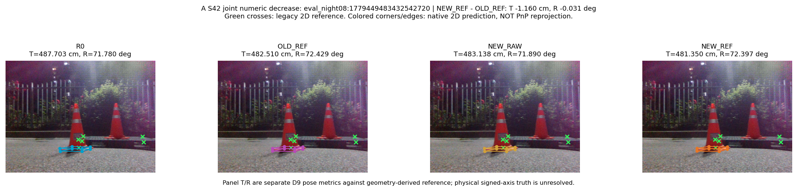
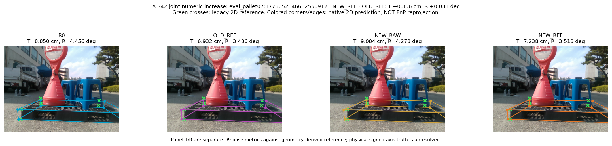

# A 입력 가림 — Plastic seed42 결과

결론: **기존 REF 대비 T/R 동시 개선 없음**. 사전 고정 주집합 자연 Moderate+Severe99에서 NEW_REF는 기존 REF보다 translation median이0.1673cm 낮지만 full-rotation median이0.0356° 높아 `TRADEOFF`다. 같은 가림을 쓴 NEW_RAW 대비 두 median은 개선되지만, R0 대비는 둘 다 악화된다. A만으로 목표 달성을 선언하지 않고 별도 손실 신호 진단에 근거한 B 대조를 계속한다. 이 판단에서 PCK/AUC를 tie-breaker로 쓰지 않았다.

모든 수치의 원본은 [RESULTS_PLASTIC_S42.json](RESULTS_PLASTIC_S42.json), 사전 변경축은 [SPEC](SPEC.md)와 [PROTOCOL](PROTOCOL.json), 공통 metric은 [METRIC_CONTRACT](../../METRIC_CONTRACT.md)다. 반복 DEV 결과이며 reference는 기존 geometry-derived pose/xy다. 독립 물리6D 정확도나 forklift 좌표계 정확도라는 주장이 아니다. NEW는 입력 가림을 추가한 학생, OLD는 기존 같은 기본 recipe의 역사적 학생이다. RAW/REF의 pseudo 좌표만 다르고 현재 NEW 쌍은 RGB/순서/box/가림 계획이 실제 전수 동일했다.

## 주 결과와 coverage

T는 translation cm, R은 symmetry-aware full rotation degree다. 수치가 작을수록 좋다. ADD AUC/IoU/axis/yaw는 보조이며 full rotation을 yaw로 대체하지 않는다. 모든 arm의 유효 pose는 주집합99/99, 전체128/128로 동일하여 아래 T/R conditional과 full-population 값이 같다. 별개인 2D detector match는 전체120/128이며 pose 유효율100%를 검출 매칭100%로 부르지 않는다.

| 집합 | Arm | T median | T P90 | R median | R P90 | yaw median | axis mismatch | ADD AUC | IoU3D median |
| --- | --- | ---: | ---: | ---: | ---: | ---: | ---: | ---: | ---: |
| 주99 | R0 | 12.1479 | 120.4714 | 6.0379 | 89.2183 | 5.5634 | 45 | 0.2276 | 0.5391 |
| 주99 | OLD_RAW | 12.4290 | 119.3087 | 9.0744 | 89.3099 | 8.9981 | 47 | 0.2188 | 0.5397 |
| 주99 | OLD_REF | 12.4230 | 127.1431 | 8.6947 | 89.1973 | 7.6941 | 46 | 0.2353 | 0.5351 |
| 주99 | SYN | 12.4324 | 121.1051 | 6.2031 | 88.9864 | 5.5331 | 45 | 0.2226 | 0.5507 |
| 주99 | NEW_RAW | 12.7187 | 119.1446 | 9.0064 | 89.3197 | 8.9337 | 47 | 0.2160 | 0.5380 |
| 주99 | NEW_REF | 12.2557 | 127.1750 | 8.7303 | 89.2152 | 7.7407 | 46 | 0.2325 | 0.5377 |
| 전체128 | R0 | 9.3531 | 79.1224 | 3.5301 | 88.7334 | 2.7557 | 45 | 0.3380 | 0.5865 |
| 전체128 | OLD_RAW | 9.2261 | 77.8839 | 3.9420 | 89.0524 | 2.6256 | 47 | 0.3347 | 0.5808 |
| 전체128 | OLD_REF | 9.1859 | 78.9382 | 3.7662 | 88.8094 | 2.5502 | 46 | 0.3590 | 0.5928 |
| 전체128 | SYN | 9.2028 | 78.6053 | 3.5069 | 88.6814 | 2.5901 | 45 | 0.3389 | 0.5948 |
| 전체128 | NEW_RAW | 9.1571 | 77.1728 | 3.9463 | 89.0222 | 2.6415 | 47 | 0.3306 | 0.5765 |
| 전체128 | NEW_REF | 9.5156 | 78.2470 | 3.7452 | 88.8634 | 2.5187 | 46 | 0.3541 | 0.5928 |

전체128의 NEW_REF−OLD_REF는 주99와 반대로 T median 악화/R median 소폭 개선이다. Clean을 섞어 주 목표의 부호를 바꾸지 않는다. 주99에서 OLD_REF 대비 T/R P90은127.1431→127.1750cm,89.1973→89.2152°로 둘 다 소폭 높아졌고, 큰 tail은 그대로 남았다.

## 서로 다른 세 대조와 paired frame 변화

Δ는 항상 NEW_REF−비교 arm이며 음수가 개선이다. **median의 차이**와 **frame별 차이의 median**은 서로 다른 통계라서 분리한다. 사전 선택은 전자의 T/R 쌍을 사용한다. 특히 R0 대비 paired median 둘 다 음수여도 조건부 median의 차이가 양수인 결과를 성공으로 바꾸지 않는다.

| 비교 arm, 주99 | Δ median T/R | median paired Δ T/R | 두 축 개선 | T만 개선 | R만 개선 | 두 축 악화 | axis correct→wrong / wrong→correct | 고정 판정 |
| --- | --- | --- | ---: | ---: | ---: | ---: | --- | --- |
| OLD_REF | −0.1673 / +0.0356 | −0.0380 / +0.0087 | 20 | 37 | 15 | 27 | 0 / 0 | TRADEOFF |
| R0 | +0.1078 / +2.6923 | −0.3101 / −0.2451 | 44 | 13 | 22 | 20 | 2 / 1 | NO_GAIN |
| NEW_RAW | −0.4629 / −0.2761 | +0.0023 / −0.0734 | 32 | 17 | 29 | 21 | 0 / 1 | JOINT_GAIN_ON_REUSED_DEV |

모든 대조의 common-valid99, available→failed0/failed→available0이고 위4방향 합은99다. matched NEW_RAW 대비 부호 개선은 “같은 가림에서 REF 좌표의 상대적 가치”이며, 입력 가림의 기존 REF 대비 성공이나 R0 초과 성능과 같지 않다. 유의성·실용성 또는 재현성은 이 단일 seed 부호로 확정하지 않는다.

## 난도와 recording

다음 표의 `ΔT/ΔR`은 각 그룹의 median 차이다. 모든 행 NEW_REF pose coverage는 n/n이며 분모를 어려운 사례 제외로 줄이지 않았다. 원본 JSON에는 각 그룹·6arm의 전체 분포와2D 지표가 있다.

| 그룹 | n | NEW_REF T/R median | T/R P90 | Δ vs OLD_REF | Δ vs R0 | Δ vs NEW_RAW |
| --- | ---: | --- | --- | --- | --- | --- |
| CLEAN | 29 | 2.2517 / 1.6008 | 5.6438 / 3.7406 | +0.0333/+0.0444 | −0.6782/−0.0100 | −0.7239/+0.0077 |
| MODERATE | 21 | 6.0402 / 2.1392 | 13.3474 / 76.4936 | −0.2023/+0.0367 | +0.1331/+0.1417 | −0.2475/+0.0946 |
| SEVERE | 78 | 14.2790 / 64.6841 | 210.4345 / 89.3657 | −0.1520/−0.0644 | +0.6017/+1.3867 | −0.2333/−3.8780 |
| REC_007 | 33 | 20.1595 / 87.2415 | 99.8887 / 89.5922 | −0.0409/+0.0761 | +0.9995/−0.5203 | +1.3256/−0.3508 |
| REC_021 | 18 | 1.8882 / 2.3381 | 3.0879 / 3.7995 | +0.1502/+0.0490 | −0.2784/−0.0939 | −0.1494/−0.0360 |
| REC_022 | 16 | 15.9566 / 7.6627 | 1276.6705 / 84.4021 | −0.1516/−0.0150 | −0.1739/+0.2373 | −0.2672/+0.1999 |
| REC_025 | 27 | 7.2295 / 4.8823 | 13.9177 / 88.2078 | +0.2971/+0.0418 | −0.2524/+0.4261 | −0.2600/+0.0827 |
| REC_027 | 12 | 18.7873 / 3.4700 | 342.9671 / 76.1742 | +0.6223/+0.0197 | −0.7514/−0.5475 | −2.1411/−0.4203 |
| REC_041 | 10 | 10.3031 / 2.5003 | 31.0168 / 86.1965 | +0.0072/+0.0006 | −1.2376/+0.4488 | −1.3041/+0.2362 |
| REC_044 | 12 | 4.0980 / 0.9718 | 6.6223 / 1.5911 | +0.4945/−0.0255 | −1.9792/+0.1666 | −1.5054/+0.1296 |

주99에서 recording 하나를 뺀 민감도 검사(LORO)도 부호가 바뀐다. 이는 새로운 independent split/재학습이 아니다. REC_044는 주99에 포함된 frame이0이므로 제거 후99가 그대로다.

| 제외 recording | 남은 n | ΔT/ΔR vs OLD_REF | vs R0 | vs NEW_RAW |
| --- | ---: | --- | --- | --- |
| REC_007 | 66 | +0.0880/+0.0154 | +0.6115/−0.4253 | +0.6058/−0.4608 |
| REC_021 | 97 | +0.2568/−0.0341 | +0.8687/+1.0538 | +0.3798/−0.2908 |
| REC_022 | 83 | −0.1423/+0.0356 | +0.1994/+2.7197 | +0.3313/−0.6693 |
| REC_025 | 72 | +0.0549/+0.0510 | −0.4431/−0.2955 | −2.6257/−7.1848 |
| REC_027 | 87 | +0.0193/−0.0641 | +0.1880/+0.7198 | −0.4502/−7.1953 |
| REC_041 | 90 | +0.1387/−0.0143 | +1.1023/+2.0849 | +0.7210/−3.7357 |
| REC_044 | 99 | −0.1673/+0.0356 | +0.1078/+2.6923 | −0.4629/−0.2761 |

## Tail와 카메라 축 보조 진단

주99 기준이다. 큰 translation tail은 삭제·winsorize하지 않았다. x/z는 camera 축의 reference-relative 오차이며 forklift 횡/종방향 오차가 아니다. 실제 camera→forklift 변환을 새로 얻지 않았다.

| Arm | T P95/P99/max cm | R P95/P99/max ° | abs x median/P90 cm | abs z median/P90 cm | signed x mean/median cm | signed z mean/median cm |
| --- | --- | --- | --- | --- | --- | --- |
| R0 | 492.1629/1338.3643/2563.8368 | 89.8460/90.1805/98.5739 | 3.1905/27.2590 | 10.6331/116.5526 | 11.5559/0.3424 | 85.3039/2.4983 |
| OLD_RAW | 489.5074/1329.5550/2539.9792 | 89.7004/90.1106/97.3310 | 3.1008/27.5246 | 10.9992/115.2981 | 11.5393/0.5039 | 84.5487/1.8452 |
| OLD_REF | 487.5790/1323.8400/2522.4381 | 89.5040/90.0121/97.5200 | 2.8200/28.0622 | 10.9236/123.1887 | 11.1332/−0.2087 | 85.7550/3.0085 |
| SYN | 489.5936/1333.1828/2539.3176 | 89.6773/90.0311/97.9903 | 3.1906/27.3371 | 11.3143/117.1826 | 11.4160/0.2545 | 83.6004/1.4074 |
| NEW_RAW | 488.0752/1328.5543/2530.2844 | 89.7341/90.1406/97.2679 | 3.1305/27.5373 | 10.7034/115.1283 | 11.4483/0.4990 | 84.1569/1.7572 |
| NEW_REF | 486.3823/1323.2149/2512.8028 | 89.5049/90.0213/97.4662 | 2.8556/28.0886 | 10.9477/123.2164 | 11.0609/−0.2105 | 85.3827/2.8829 |

## 2D와 직접 가시66 보조 결과

전체128의 corner 분모985, 모든 arm의 common matched frame120이다. 아래 median/P90은 실패 penalty를 포함한 전체 분모 점오차다. 별도의 matched-only median/P90도 혼합하지 않고 같이 적었다. Plastic의 symmetry-aware와 fixed-ID `correct5/10/20` 수는 동일함을 원본에서 확인했다. verified66은16frame의 직접 가시 fixed-ID 보조이며 독립 calibration/학습 감독으로 쓰지 않았다. Wood verified는 `NA_REFERENCE_NOT_VERIFIED`; 이번 A에서 Wood fit/eval은 하지 않았다.

| Arm | correct5/10/20 /985 | full-penalty median/P90 px | >20/>50/>100 px 수 | matched-only median/P90 px | verified correct10/20 /66 | verified median/P90 px |
| --- | --- | --- | --- | --- | --- | --- |
| R0 | 205/484/716 | 10.1780/70.6261 | 269/127/81 | 9.5653/40.9022 | 44/60 | 7.1439/18.3897 |
| OLD_RAW | 200/468/715 | 10.4576/70.1358 | 270/123/82 | 9.9614/41.9578 | 43/60 | 7.0457/19.5739 |
| OLD_REF | 243/507/728 | 9.6420/70.3591 | 257/122/82 | 8.9537/42.0854 | 43/63 | 7.0968/17.3435 |
| SYN | 203/479/717 | 10.2993/70.2872 | 268/126/82 | 9.7414/41.7761 | 44/61 | 7.5594/18.7892 |
| NEW_RAW | 198/466/709 | 10.5914/70.0513 | 276/122/83 | 9.9853/42.1773 | 42/61 | 7.5932/19.3206 |
| NEW_REF | 237/502/727 | 9.6858/70.3245 | 258/122/82 | 9.0534/42.1420 | 44/64 | 7.4971/17.0951 |

verified66의 correct10이 OLD_REF43→NEW_REF44가 되어도 주 T/R 불성립을 성공으로 바꾸지 않는다. 반대로 주99에서 matched RAW를 상회했다는 결과만으로 큰 오류점 전반이 회복됐다고도 할 수 없다.

## Source32·학습 비용·실제 개입량

기존 framework synthetic validation32의 최종CSV 행을 사용했고 checkpoint를 다시 선택하지 않았다. 이는 독립 source 물리6D 시험이 아니다. 4arm에서 box mAP50/50–95=.995/.94734, pose mAP50/50–95=.995/.98863, precision=.99444, recall=1.0, box loss=.3275, class loss=.12107, DFL=.00253은 같았다. 기존CSV의 반올림 정밀도에서 동률이며 모든 source 동작의 bit-exact 동등성을 뜻하지 않는다.

| Arm | val pose loss | val kobj loss | val RLE loss |
| --- | ---: | ---: | ---: |
| OLD_RAW | 0.09621 | 0.00111 | 0.0 |
| NEW_RAW | 0.09699 | 0.00107 | 0.0 |
| OLD_REF | 0.09624 | 0.00112 | 0.0 |
| NEW_REF | 0.09672 | 0.00108 | 0.0 |

이 cycle은 동일한 사전학습 R0에서 각각 시작한2fit×320update=640update, seed42, last-only다. 서로 다른 사전학습 seed의 독립 R0가 아니다. 계측 fit 시간 RAW70.6805초/REF71.4231초, 합계142.1035초다. 추론6.1172초, CPU 채점3.4991초다. 이는 중앙 resource ledger에 계상하는 원래 작업 비용이며 이 보고서를 만들기 위해 새 fit/추론을 수행하지 않았다. 신규 annotation0, teacher 적응0, 추론 시 teacher 추가0, D9 solver 변경0이다.

[독립 입력 감사](../../AUDIT_A_INPUT_OCCLUSION.md)에서320batch의 RGB/순서/box/계획이 일치했다. real2,560 occurrence 중 scheduled1,302, 적용542(21.17%), 위치후보32회 내 불성립760이었다. masked supervised는 RAW781/REF824, 원래 affine에 의한 support 차이는3batch(v2 총수 RAW21,819/REF21,823), ignore1,185는 같았다. source2,560 occurrence에 추가 가림은 없었다. 이를 “예정50%이므로 실제50%”, “같은 RGB이므로 같은 masked supervision”으로 바꾸어 말하지 않는다.

## 해석과 다음 판단

입력만 가리는 random occlusion의 실행 가능성은 확인했지만, 이번 pool/강도/320step에서 기존 REF 및 R0를 동시에 상회하는 T/R 효과를 보이지 못했다. pseudo 자체 오류, 자연 가림과 rectangle overlay의 차이, 국소 학습 신호의 약함은 모두 후보 설명이며 이 결과만으로 원인을 확정하지 않는다. RAW/REF는 filtered unknown-quality pool이고 RAW도 REF-conditioned 위치 선택을 공유한다. [pool 감사](../../POOL_AND_SUPERVISION_AUDIT.md)와 [문헌 차이](../../RELATED_WORK.md)를 유지한다.

별도의 TRAIN loss 진단이 뒷받침한 B의 최소 SmoothL1 대조로 진행한다. A가 실패했다고 모든 후보를 중단하거나 A와 B를 즉시 합쳐 단독 효과를 잃지 않는다. seed 재현이나 Wood 적용은 중앙의 잔여 예산·선택 규칙으로 판단하며 이 단일 seed 보고서에서 승자를 자동 승격하지 않는다. 이는 A 결과 시점의 다음 결정이며 후속 cycle의 최종 판정은 중앙 보고서가 관리한다.

## 실제 개선·악화 사례

선정 규칙과 원본 수치 binding은 [그림 index](../../FIGURE_INDEX.md)에 있다. 아래는 전체 성능을 대신하지 않는 paired 사례이며 reference의 성격과 개선/악화 양쪽을 함께 보여준다.

