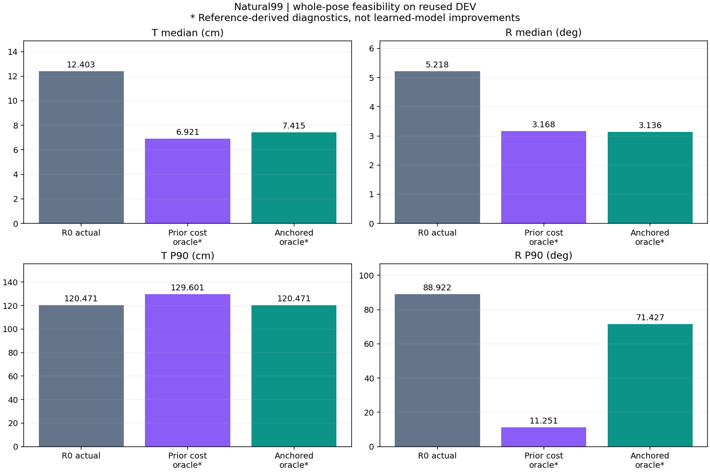
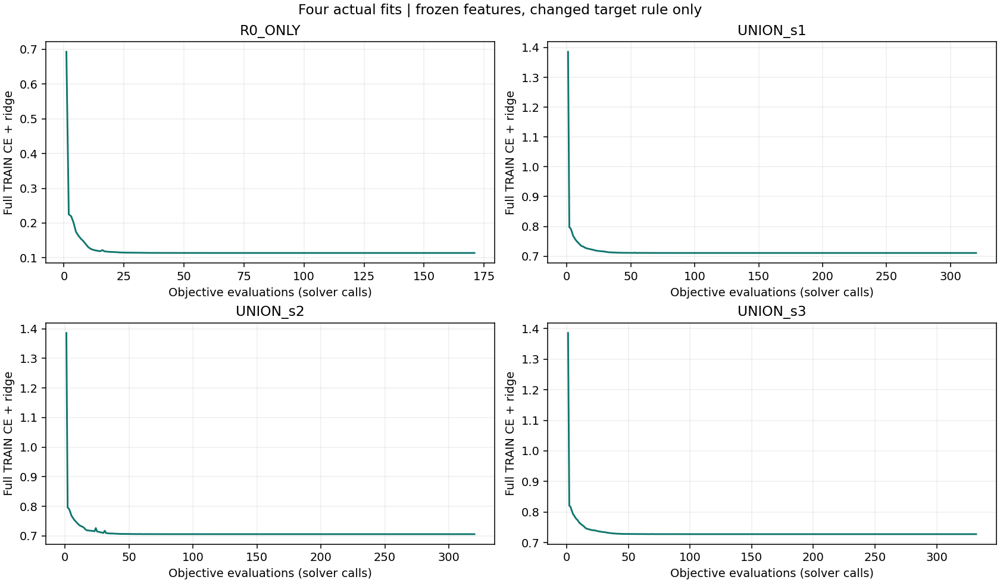
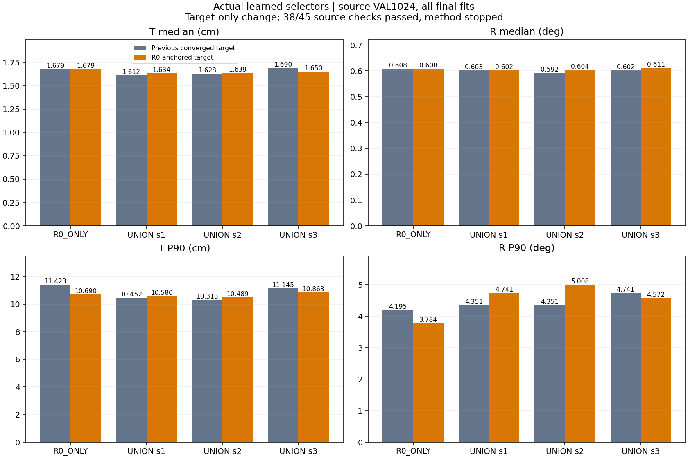
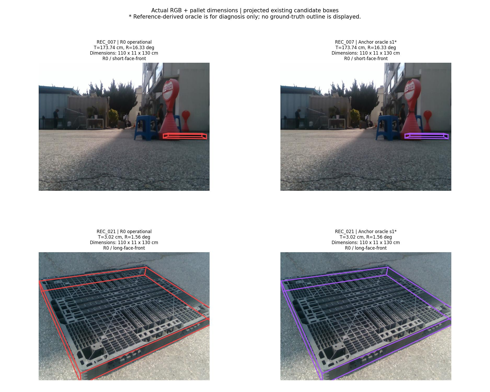
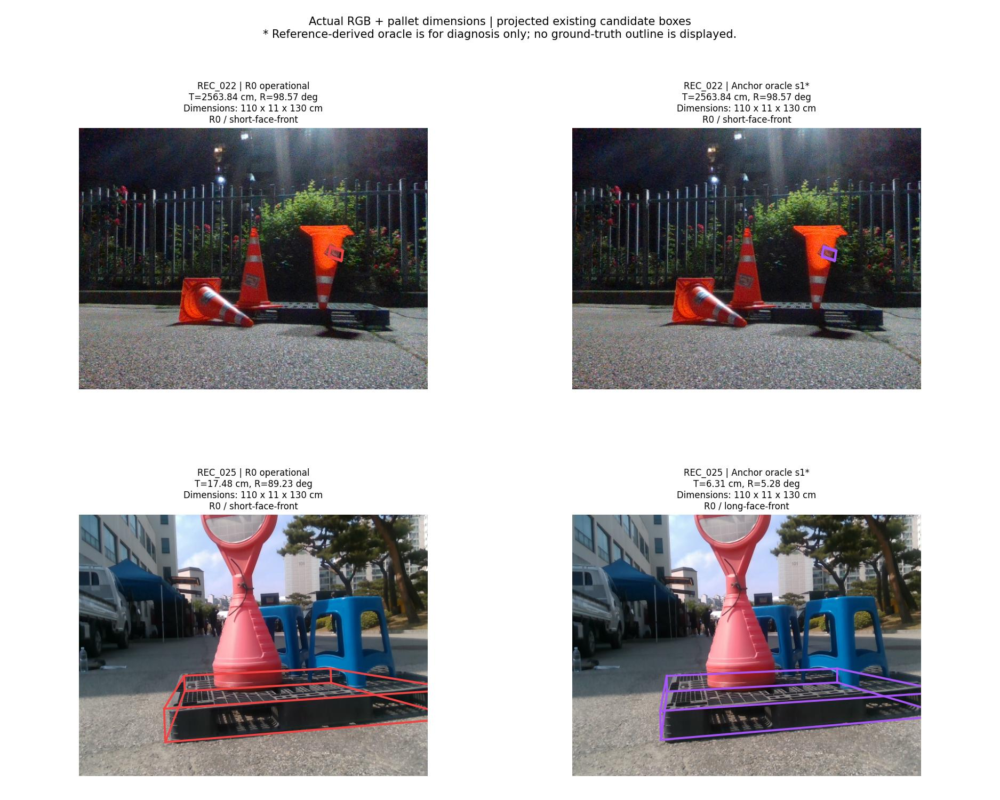
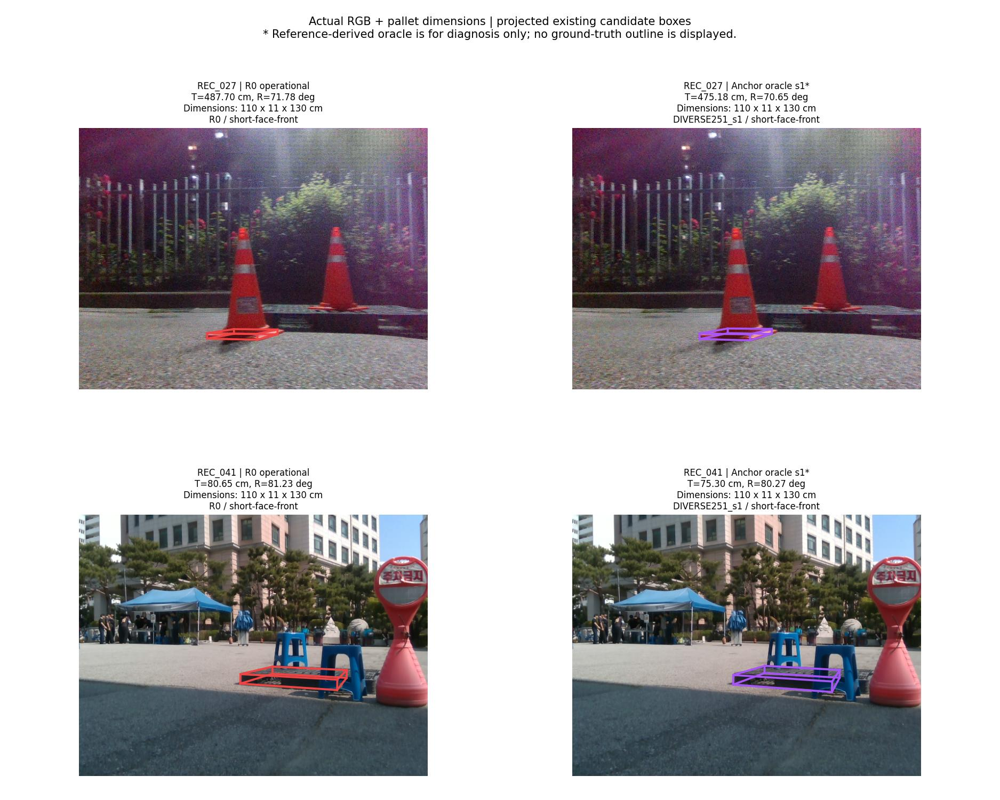

# R0 양축 보존 타깃: 가능성 진단과 실제 학습 결과

**실제 모델의 안정적인 T·R 동시 개선은 아직 달성하지 못했습니다.**

R0보다 T와 R을 모두 악화시키지 않는 후보로 학습 정답을 제한했습니다. 참조를 이용하는 실사 가능성 진단은 원래5개 안정성 조건을 모두 통과했고, 합성 TRAIN 진단도45/45를 통과했습니다. 그러나 실제 선택기4개를 학습해 합성 VAL1024장에서 검증하니 **38/45 통과·7개 실패**였습니다. 이 방법의 learned 실사 평가·적용은 중단했습니다.

입력은 **RGB 이미지 한 장 + 팔레트 치수**, 기존 카메라 보정 K입니다. 원래 이미지·치수·후보·참조는 유지했으며 동영상이나 새 센서를 추가하지 않았습니다.

## 변경한 것과 실제 추론의 차이

기준 anchor는 같은 이미지의 기존 R0 운영 GEO 전체 pose입니다. 학습 데이터의 참조 오차로 `T(candidate) ≤ T(R0)` 및 `R(candidate) ≤ R(R0)`를 만족하는 후보만 정답 후보로 허용하고, 그 안에서 기존 `max(T/2.4636887551191258, R/1.113474019956766)` 비용과 정확한 동률 규칙으로 전체 pose 하나를 고릅니다.

**이 제약은 학습 정답 생성에만 적용됩니다.** CE의 경쟁 후보와 실제 추론 후보는 원래 유효 후보 전체입니다. 실제 추론은 참조 T/R를 모르므로 이 제약으로 후보를 지울 수 없습니다. 따라서 안전한 학습 타깃이 학습된 선택기의 안전성을 보장하지 않습니다.

직전 수렴 통제와 비교해 바꾼 요인은 target 적격조건 하나입니다. 기존94개 기하 특징·선형 점수·FP32 정규화 후 FP64 계산·전체2598행 CE+L2(λ=1e−4)·초깃값0·solver·후보·TRAIN 척도를 유지했습니다. R0_ONLY의 타깃도 바뀔 수 있으므로 대조 모델까지4개 모두 새로 학습했습니다.

## 실사 후보 가능성: 정답을 보는 진단

전체173장(자연 가림99·clean29·wood45)과 세 frozen refiner seed를 그대로 사용했습니다. 원래5개 기준, SINGLE251/R0/PRIOR1/FULL125 비교, recording×seed bootstrap2,000회, 촬영6개 제외 검사, 자연·clean1.05배 비회귀 한계와 실패 수 기준을 유지했습니다. 새 학습 모델을 실사에 실행한 결과가 아닙니다.

| 진단 | 원래 기준 | 자연 T 중앙값(cm) | R 중앙값(°) | T P90(cm) | R P90(°) |
|---|---|---:|---:|---:|---:|
| 직전 비용 oracle | 4/5 | 6.920516 | 3.168166 | 129.601419 | 11.250853 |
| R0 양축 보존 oracle | 5/5 | 7.414874 | 3.136052 | 120.471370 | 71.426586 |

표는 seed별 모집단 중앙값/P90을 구한 뒤 세 seed를 평균한 값입니다. **T 꼬리를 보존하는 대신 직전 비용 oracle보다 R P90은 증가했습니다.** 그래도 원래 R0와 비교하는 전체 기준은 통과합니다. 두 oracle 모두 배포 가능한 개선 수치가 아닙니다.

519개 frame×seed에서 양축 비증가를 확인했습니다. 그중 291개는 R0를 그대로 유지했습니다. 독립 검산으로 후보 선택·원래5개 기준을 재현했습니다.

## 합성 TRAIN과 실제 학습

선언된 C2 대칭·정상 rigid pose 조건의 TRAIN2598장을 그대로 사용했습니다. 유효 anchor2597개와 원래 후보 실패1개를 유지했고, 실패 행은 전체2598행 CE 분모에서0 loss로 남겼습니다. 제약된 TRAIN oracle은45/45를 통과했으며, 별도 scalar-loop 구현으로 모든 target·적격 후보 mask를 대조했습니다.

| 모델 | optimizer iterations | objective calls | 수렴 gap 상한 |
|---|---:|---:|---:|
| R0_ONLY | 155 | 171 | 5.666e-12 |
| UNION_s1 | 295 | 320 | 1.456e-12 |
| UNION_s2 | 279 | 320 | 4.997e-12 |
| UNION_s3 | 298 | 332 | 2.493e-12 |

네 fit은 총1143회 목적함수 계산과 1027회 optimizer iteration을 실행했습니다. 수치 수렴은 별도 PyTorch autograd로 검산했습니다. 이는 해당 CE+ridge 목적함수의 인증이며 T/R 개선 인증이 아닙니다.

| 동일 새 TRAIN 타깃에서 비교 | 이전→새 선택 정확도 | 이전→새 R0 양축 중 하나 이상 악화 |
|---|---:|---:|
| UNION_s1 | 64.61% → 67.08% | 487 → 338 / 2597 |
| UNION_s2 | 64.04% → 67.69% | 525 → 331 / 2597 |
| UNION_s3 | 64.38% → 66.73% | 513 → 354 / 2597 |

정답 후보를 고르는 비율은 올라갔고 악화 선택은 줄었지만, TRAIN에서도 제약 위반이 남았습니다. 정확도와 악화율의 분모는 유효2597장이며 실패1개를 제외했다고 숨기지 않습니다. 전체 T/R 집계에는2598행을 모두 유지합니다.

## 합성 VAL1024: 실제 학습한 선택기의 결과

학습 종료·checkpoint 동결 후4×1024개 선택을 정답 조회 전에 고정했습니다. 이후 동일한 물리 좌표계 T/C2 회전 오차로 전체8모델을 평가했습니다. 모든 모델의 pose 실패는0입니다. T 단위 cm, R 단위 °입니다.

| 모델 | T 중앙값 | R 중앙값 | T P90 | R P90 | 실패 |
|---|---:|---:|---:|---:|---:|
| R0_ONLY | 1.679494 | 0.608127 | 10.689822 | 3.784231 | 0 |
| UNION_s1 | 1.633590 | 0.601619 | 10.579964 | 4.741256 | 0 |
| UNION_s2 | 1.639399 | 0.604010 | 10.488876 | 5.008210 | 0 |
| UNION_s3 | 1.650298 | 0.611190 | 10.863452 | 4.572355 | 0 |
| R0_GEO | 1.674594 | 0.613334 | 10.932544 | 4.328168 | 0 |
| DIVERSE251_s1_GEO | 1.818474 | 0.805513 | 19.343094 | 79.453475 | 0 |
| DIVERSE251_s2_GEO | 1.900040 | 0.775323 | 18.537749 | 73.676611 | 0 |
| DIVERSE251_s3_GEO | 2.051196 | 0.765877 | 18.074773 | 38.153661 | 0 |

**실패한7개 조건을 모두 남깁니다.** 회전 P90 비회귀6개와 seed3의 회전 중앙값 엄격 개선1개입니다.

| 모델 | 비교 대상 | 실패 조건 |
|---|---|---|
| UNION_s1 | R0_ONLY | rotation_deg_P90_guard |
| UNION_s1 | R0_GEO | rotation_deg_P90_guard |
| UNION_s2 | R0_ONLY | rotation_deg_P90_guard |
| UNION_s2 | R0_GEO | rotation_deg_P90_guard |
| UNION_s3 | R0_ONLY | rotation_deg_median_strict |
| UNION_s3 | R0_ONLY | rotation_deg_P90_guard |
| UNION_s3 | R0_GEO | rotation_deg_P90_guard |

좋은 seed나 성공한 지표만 채택하지 않았습니다. source 기준 실패로 이 방법의 learned 실사 routing·실사 오차 계산은0회입니다. 앞의 실사 oracle 진단과 이 미실행을 혼동하지 않아야 합니다.

## 실제 이미지와 입력 치수

각 자연 촬영에서 기존 R0 T 오류가 가장 큰 한 장을 고정해 보여줍니다. 오른쪽은 고정 seed1의 **참조 기반 보존 oracle**이며 새로 학습한 선택기의 실사 결과가 아닙니다. 치수는 원본 입력값(cm)이고, 기존 전체 pose를 K로 투영했습니다. 전체 판정에는 모든173장을 사용합니다.

## 확인한 것과 남은 문제

기존 후보 안에 원래 안정성 기준을 만족하는 전체 pose 선택 조합이 존재함을 확인했습니다. 타깃의 양축 보존 조건도 source TRAIN에 구현하고 네 모델을 실제 학습했습니다. 다만 현재94개 특징과 선형 점수의 CE 학습은 그 조건을 정확히 재현하지 못했고, source VAL의 전체 기준도 통과하지 못했습니다.

이 결과만으로 Linear94의 모든 방법이 불가능하다거나 RGB 정보 부족이 원인이라고 확정할 수 없습니다. 다음에는 기준 R0와의 관계가 현재 점수 함수에 어떻게 전달되는지와 기존 상대 이득 선택기의 실패 전례를 확인한 뒤 입력 표현 또는 선택 구조의 최소 변경을 정해야 합니다. 단순히 같은 특징에서 anchor 값을 빼는 선형 변경은 argmin에서 상쇄될 수 있으므로 새 정보가 되는지도 확인해야 합니다.

## 검증·원자료·한계

- [실사 가능성 전체519행](REAL_FEASIBILITY_ROWS.csv), [실사 독립 검산](REAL_VERIFICATION_KO.md), [유효 입력과 결측 경계 검토](REAL_METHOD_REVIEW_KO.md)
- [source TRAIN 가능성](SOURCE_FEASIBILITY.json), [실제 TRAIN 수렴·악화 선택 검산](TRAIN_CONVERGENCE_KO.md)
- [VAL 전체8192행](SOURCE_VAL_FRAME_RESULTS.csv), [45개 판정](SOURCE_VAL_CHECKS.csv), [source VAL 독립 검산](SOURCE_VAL_VERIFICATION_KO.md)
- [학습 log CSV](TRAINING_OBJECTIVE_LOG.csv), [실제 네 checkpoint JSON](model_parameters/), [실사 미실행 증거](REAL_EVALUATION_NOT_RUN_KO.md)
- [선행 실패와 이번 변경의 구분](PRIOR_METHOD_AUDIT_KO.md), [공개 검증](PUBLIC_REVIEW_KO.md), [파일 해시 목록](PUBLICATION_MANIFEST.json)
- [기존 자연 가림99장 전체 이미지](../pallet_pose_stable_improvement_20261001_v1/GALLERY_NATURAL99.md)

실사 참조는 기존2D 주석·K·치수에서 만든 pose이며 독립 장비 실측 정답이 아닙니다. DEV와 source VAL은 여러 방법에서 반복 사용했습니다. 기존 refiner source 노출과 selector TRAIN/VAL/TEST의 중복105/26/26건을 제거한 새로운 평가라고 주장하지 않습니다. 전체 교사 계보에는 기존 수동 코너38개/이미지9장이 포함되며 이번 학습에는 새 실사 정답을 사용하지 않았습니다.

R0_ONLY는 결정론적 대조 모델 하나이고 UNION_s1/2/3은 기존 refiner seed를 각각 사용합니다. 이를 네 개 독립 반복 실험이나 새 촬영 일반화로 해석하지 않습니다. 동일 입력·정규화·solver를 유지한 target 변경의 효과와 실제 성능 판정을 구분했습니다.

정확한 재실행에는 프로토콜에 SHA로 연결한 로컬 원본 이미지·feature·pose 캐시가 필요합니다. 공개 커밋에는 전체 원본 데이터셋 대신 검토용 CSV·체크포인트·실행 코드·이미지·판정 자료를 포함했습니다.
