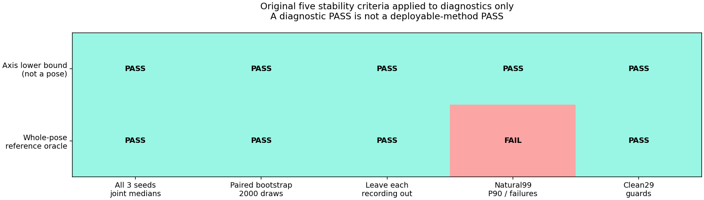
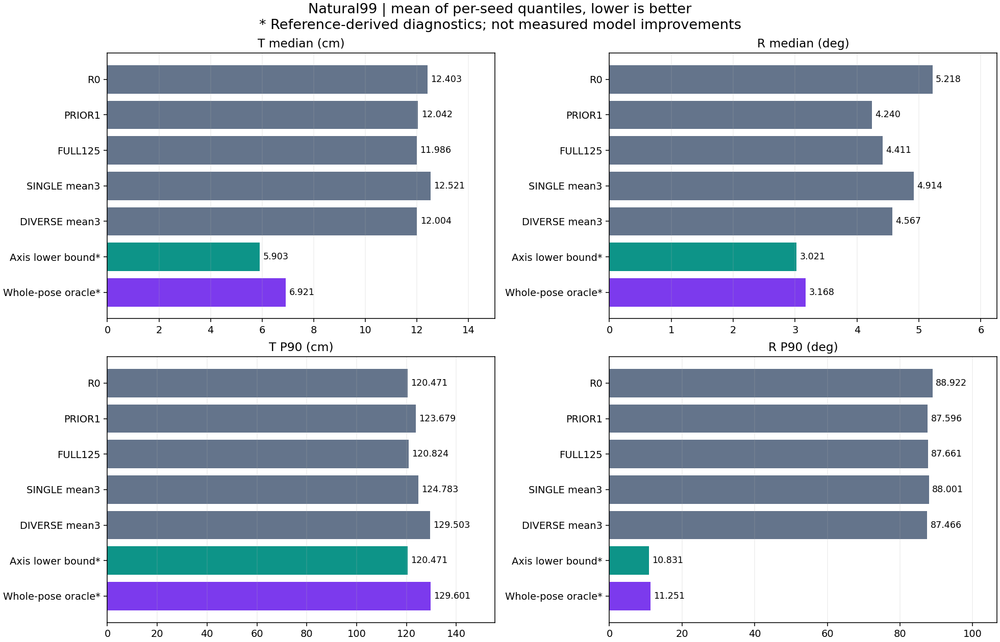
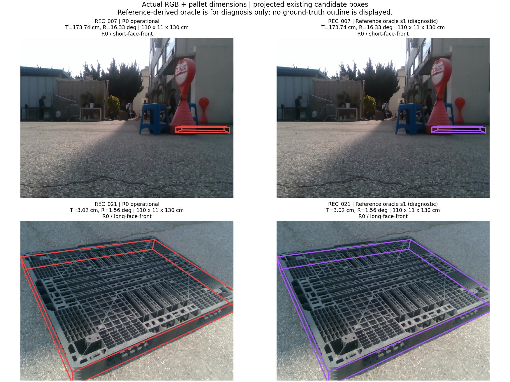
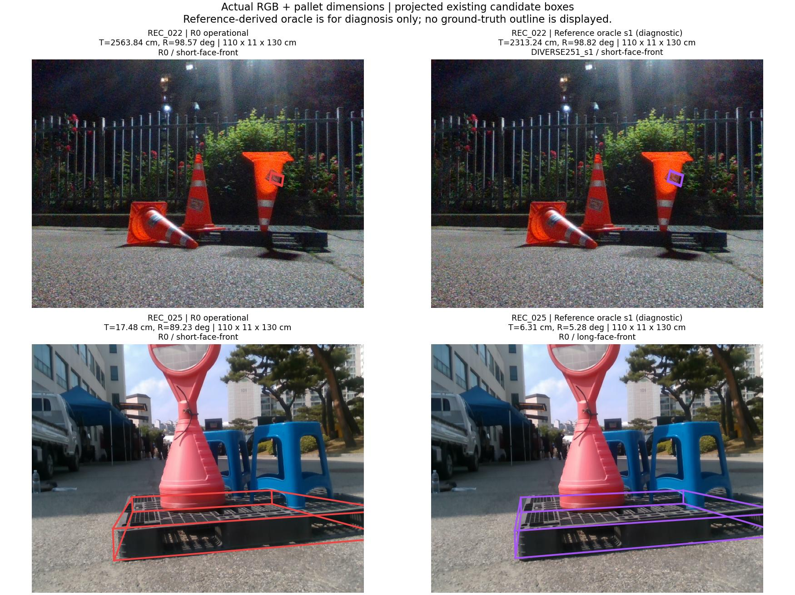
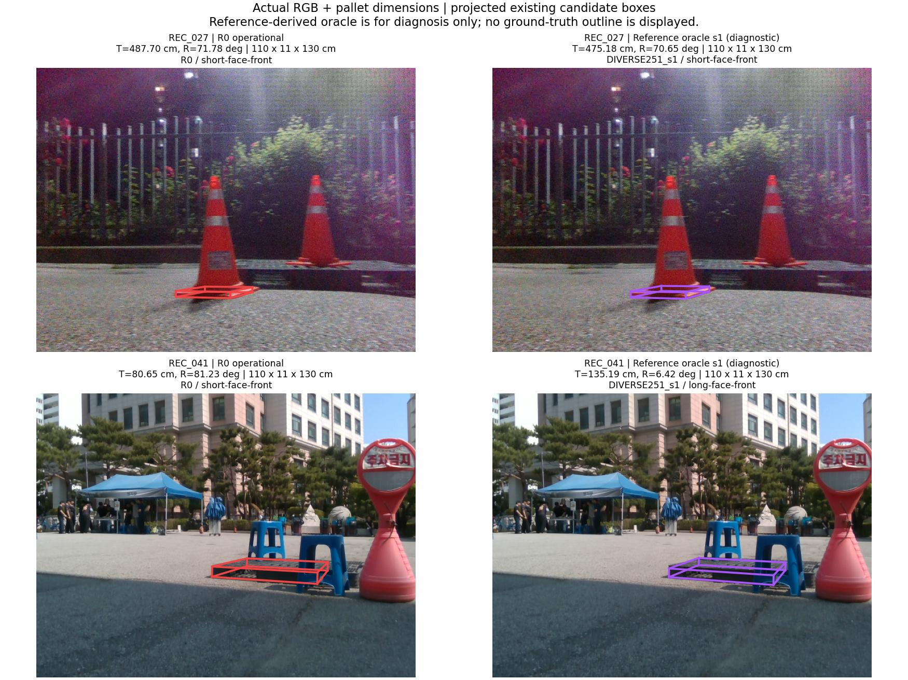

# 기존 실사 후보의 T·R 개선 가능성 진단

**실제로 사용할 수 있는 모델의 안정적인 T·R 동시 개선은 아직 달성하지 못했습니다.**

축별 낙관적 하한은 통과했지만, 사전에 고정한 TRAIN 비용으로 고르는 전체 pose oracle은 실패했습니다. 이 고정 선택 규칙의 실패이며 다른 전체 pose 선택 조합까지 불가능하다고 단정할 수 없습니다.

## 입력과 이번 진단이 답하는 질문

입력은 **RGB 이미지 한 장과 팔레트 치수**이며 기존 카메라 내부 보정 K를 유지합니다. 동영상·여러 시점·새 센서를 추가하지 않았습니다. 최신 선택기의 합성 검증 실패 이후, 같은 후보를 더 학습하기 전에 후보 집합 자체에 원래 목표를 만족할 여지가 있는지 확인했습니다.

원래 R0와 DIVERSE251의 세 seed를 각각 짝지어 W/D 전체 pose 후보를 합칩니다. 기존 실사173장 = 자연 가림99 + 깨끗한29 + 목재45를 모두 유지하며 새 학습·추론·PnP·참조 오차 재계산은 각각0회입니다. 이전에 계산하고 공개한 후보별 T/R 오류를 사용했습니다.

## 두 진단의 차이

| 진단 | 선택 규칙 | 해석 |
|---|---|---|
| 축별 낙관적 하한 | 같은 후보 집합에서 최소 T와 최소 R을 각각 취함 | 서로 다른 후보일 수 있는 수학적 하한. 실제 pose나 동시 성능이 아님 |
| 고정 TRAIN 비용 oracle | max(T/2.4636887551191258, R/1.113474019956766)를 최소화하는 전체 pose 하나 | 참조를 보고 고르는 진단. 실제 추론 선택기가 아님 |

비용 척도는 기존 합성 TRAIN에서 고정한 값입니다. 실사에서 재조정하지 않았습니다. 정확한 비용 동률은 Pareto 지배 후보 제거 → R0 우선 → 가설 이름 → 모델 이름 순으로 처리했습니다. 모델당 가설이 정확히2개이므로 기존 T-best/R-best 두 행의 합집합이 필요한 비지배 후보를 보존합니다.

## 원래 안정성 기준

seed 세 개 각각의 자연 가림 T/R 중앙값을 paired SINGLE251 및 고정 R0/PRIOR1/FULL125와 비교합니다. SINGLE251/R0 대비 recording×seed paired bootstrap2,000회(seed20261001)의 양축95% 상단이0 미만이어야 하고, 자연 촬영6개를 각각 제외해도 양축 개선이 유지되어야 합니다. 자연 P90과 clean 중앙값/P90에는 원래1.05배 제한 및 실패 수 비증가 기준을 유지했습니다. 3seed를 합쳐 중앙값 하나로 바꾸지 않았습니다.

- 축별 낙관적 하한: **PASS**
- 고정 TRAIN 비용 전체 pose oracle: **FAIL**
- 배포 가능한 방법의 성능 성공: **확인되지 않음**

## 실패한 조건과 다음 변경의 근거

전체 pose oracle은 seed별 중앙값 개선·bootstrap·촬영 제외·clean 보존을 통과했습니다. 실패는 자연 가림 **T P90의 R0 대비 비회귀 제한 한 가지**입니다. 평균 T/R 개선과 큰 T 오류의 억제를 동시에 만족시키지 못했습니다.

| 자연 가림 T P90 | cm |
|---|---:|
| R0 | 120.471370 |
| 원래 허용 한계 (R0×1.05) | 126.494939 |
| 고정 비용 전체 pose oracle | 129.601419 |

자연 가림 중앙값 차이의95% 구간은 다음과 같습니다. 단위는 T cm / R °이며, 같은 recording과 seed를 짝지어2,000회 재표집했습니다. 전부0 미만이어도 위의 T 꼬리 조건을 대신할 수 없습니다.

| Oracle − 기준 | T 차이95% 구간 | R 차이95% 구간 |
|---|---:|---:|
| SINGLE251 | [-8.692977, -0.603987] | [-7.925976, -0.861761] |
| R0 | [-8.809782, -2.360113] | [-12.937264, -1.097912] |

**확인:** 현재 TRAIN 척도의 scalar 비용을 정확하게 최소화하는 선택도 이 DEV의 전체 안정성 기준을 만족하지 않습니다. 같은 정답 후보를 맞히는 학습 정확도만 높여도 전체 목표가 자동 달성되지는 않습니다.

**다음 개입:** R0의 큰 T 오류를 더 키우지 않는 제약을 후보 선택의 학습 목표에 반영할 수 있는지 먼저 검토합니다. 기존 R0를 보존하는 제약 아래 전체 pose 개선 후보가 존재하는지 별도 고정 진단으로 확인한 뒤, 실사 정답 없이 학습·추론할 수 있는 신호로 연결해야 합니다. 이번 결과에서 새 제약이나 임계값을 탐색하거나 새 개선 성능으로 보고하지 않았습니다.

축별 하한은 모든 조건을 통과했으므로 전체 후보 집합이 불가능하다고 결론 내릴 수 없습니다. 다만 서로 다른 후보의 최소 T/R를 합친 하한은 실제 pose가 아니므로, 전체 pose로 가능한지도 추가 증명이 필요합니다.

## 전체 수치

T 단위는 cm, R은 현재 물리 좌표계 C2 대칭 회전 오차(°)입니다. SINGLE/DIVERSE 및 진단 평균은 **seed별 모집단 중앙값 또는 P90을 구한 뒤 세 seed를 평균**한 값입니다. R0/PRIOR1/FULL125는 고정 모델 하나입니다. 원래 운영 결과와 참조를 이용한 진단 값을 명시적으로 구분합니다.

### NATURAL99

| 모델/진단 | T 중앙값 | R 중앙값 | T P90 | R P90 | 실패 |
|---|---:|---:|---:|---:|---:|
| R0 | 12.403251 | 5.217583 | 120.471370 | 88.921859 | 0 |
| PRIOR1 | 12.042390 | 4.240347 | 123.679073 | 87.596383 | 0 |
| FULL125 | 11.986464 | 4.410692 | 120.824080 | 87.661208 | 0 |
| SINGLE251 (3seed 평균) | 12.521185 | 4.914134 | 124.782532 | 88.000749 | 0 |
| DIVERSE251 운영 (3seed 평균) | 12.003722 | 4.567216 | 129.502732 | 87.465827 | 0 |
| 축별 하한 (진단, 3seed 평균) | 5.902935 | 3.021268 | 120.471370 | 10.830830 | 0 |
| 축별 하한 s1 | 6.209690 | 3.041114 | 120.471370 | 10.250647 | 0 |
| 축별 하한 s2 | 5.644767 | 2.981576 | 120.471370 | 11.061340 | 0 |
| 축별 하한 s3 | 5.854349 | 3.041114 | 120.471370 | 11.180504 | 0 |
| 전체 pose oracle (진단, 3seed 평균) | 6.920516 | 3.168166 | 129.601419 | 11.250853 | 0 |
| 전체 pose oracle s1 | 7.469821 | 3.041114 | 130.102844 | 10.250647 | 0 |
| 전체 pose oracle s2 | 6.640758 | 3.227134 | 130.814976 | 11.865942 | 0 |
| 전체 pose oracle s3 | 6.650970 | 3.236251 | 127.886437 | 11.635971 | 0 |

### CLEAN29

| 모델/진단 | T 중앙값 | R 중앙값 | T P90 | R P90 | 실패 |
|---|---:|---:|---:|---:|---:|
| R0 | 2.929862 | 1.637392 | 9.785404 | 3.490641 | 0 |
| PRIOR1 | 3.198106 | 1.597354 | 9.022312 | 3.092060 | 0 |
| FULL125 | 3.432615 | 1.630004 | 8.380100 | 2.776969 | 0 |
| SINGLE251 (3seed 평균) | 3.061082 | 1.376682 | 8.238321 | 2.316967 | 0 |
| DIVERSE251 운영 (3seed 평균) | 3.076372 | 1.389815 | 8.290051 | 2.206882 | 0 |
| 축별 하한 (진단, 3seed 평균) | 2.761648 | 1.302180 | 7.066758 | 2.206882 | 0 |
| 축별 하한 s1 | 2.803836 | 1.420445 | 6.799470 | 2.280042 | 0 |
| 축별 하한 s2 | 2.803836 | 1.198918 | 7.164517 | 2.305704 | 0 |
| 축별 하한 s3 | 2.677272 | 1.287177 | 7.236287 | 2.034899 | 0 |
| 전체 pose oracle (진단, 3seed 평균) | 2.822001 | 1.431808 | 7.066758 | 2.206882 | 0 |
| 전체 pose oracle s1 | 2.858331 | 1.506338 | 6.799470 | 2.280042 | 0 |
| 전체 pose oracle s2 | 2.803836 | 1.451187 | 7.164517 | 2.305704 | 0 |
| 전체 pose oracle s3 | 2.803836 | 1.337899 | 7.236287 | 2.034899 | 0 |

### WOOD45

| 모델/진단 | T 중앙값 | R 중앙값 | T P90 | R P90 | 실패 |
|---|---:|---:|---:|---:|---:|
| R0 | 2.095130 | 1.544559 | 8.011072 | 9.189687 | 0 |
| PRIOR1 | 1.753943 | 0.999982 | 7.356778 | 9.608164 | 0 |
| FULL125 | 2.087589 | 1.327260 | 9.451519 | 15.222109 | 0 |
| SINGLE251 (3seed 평균) | 1.886745 | 1.269382 | 7.984332 | 12.567495 | 0 |
| DIVERSE251 운영 (3seed 평균) | 1.855113 | 1.317713 | 9.958878 | 26.469256 | 0 |
| 축별 하한 (진단, 3seed 평균) | 1.432724 | 1.092041 | 6.462493 | 5.898215 | 0 |
| 축별 하한 s1 | 1.432314 | 1.138846 | 6.378056 | 6.039664 | 0 |
| 축별 하한 s2 | 1.397939 | 1.082738 | 6.345417 | 6.039664 | 0 |
| 축별 하한 s3 | 1.467920 | 1.054539 | 6.664005 | 5.615316 | 0 |
| 전체 pose oracle (진단, 3seed 평균) | 1.770372 | 1.111341 | 7.341142 | 6.113013 | 0 |
| 전체 pose oracle s1 | 1.818567 | 1.138846 | 6.899582 | 6.496655 | 0 |
| 전체 pose oracle s2 | 1.756902 | 1.112955 | 8.011072 | 6.227068 | 0 |
| 전체 pose oracle s3 | 1.735648 | 1.082223 | 7.112773 | 5.615316 | 0 |

## 실제 RGB·치수·후보 투영

각 자연 촬영에서 **기존 R0 T 오류가 가장 큰 한 장**을 표시했습니다. 같은 값이면 ID 순으로 고릅니다. 모든 수치 판정에는 전체173장을 사용합니다. 오른쪽은 미리 고정한 seed1의 oracle 예시이며 좋은 seed를 고른 결과가 아닙니다. 그림에는 각 이미지의 실제 입력 치수(cm)가 들어 있습니다. 다른 seed의 결과는 전체 CSV에 남겼습니다.

왼쪽 빨강은 R0 운영 pose, 오른쪽 보라는 평가 참조를 이용해 고른 기존 전체 pose입니다. 저장된 camera-facing R·중심·치수를 원래 K로 직접 투영했으며 새 PnP나 정답 외곽선은 사용하지 않았습니다. 영상의 다른 물체를 잡은 후보가 남을 수 있습니다.

## 검증 자료와 한계

- [사전 동결 프로토콜](PROTOCOL.json), [입력·후보 구조 감사](INPUT_AUDIT_KO.md)
- [전체 프레임1038행 CSV](FRAME_RESULTS.csv), [모든 gate·bootstrap·촬영별 결과 JSON](RESULTS.json)
- [독립 수치 검증](VERIFICATION_KO.md), [공개 파일 해시 목록](PUBLICATION_MANIFEST.json)
- [직전 실제 선택기 학습·검증 실패](../pallet_pose_selector_pairwise_20261001_v1/REPORT_KO.md)
- [기존 자연 가림99장 전체 비교 갤러리](../pallet_pose_stable_improvement_20261001_v1/GALLERY_NATURAL99.md)

현재 진단은 원래 안정성 계약의 SINGLE251/R0/PRIOR1/FULL125 비교를 재현합니다. 후속 UNION 실험의 learned R0_ONLY는 source 검증 실패로 실사 routing을 실행하지 않았으므로, 그 확장 비교 계약 전체를 충족했다는 주장을 하지 않습니다.

기존2D 주석·K·치수로 만든 참조 pose를 반복 사용한 DEV 진단입니다. 독립 장비 실측 정답이나 새 촬영 일반화 검증이 아닙니다. 기존 교사 모델 계보에는 수동 코너38개/이미지9장이 포함됩니다. 이번 계산에서 새 실사 정답을 학습에 사용하지 않았습니다.

계산 코드는 같은 이름의 scripts/research 경로에 공개했습니다. 정확한 로컬 재실행에는 프로토콜에 SHA로 연결한 기존 이미지·예측·메타데이터 캐시가 필요합니다. 이 공개 커밋은 전체 원본 데이터셋을 복제하지 않으며, 검토용 CSV·판정·6장의 실제 이미지 비교를 제공합니다.

이 결과는 다음 변경의 범위를 결정하는 근거입니다. 그림·oracle·수학적 하한을 실제 모델의 개선 수치로 바꾸어 보고하지 않습니다.
