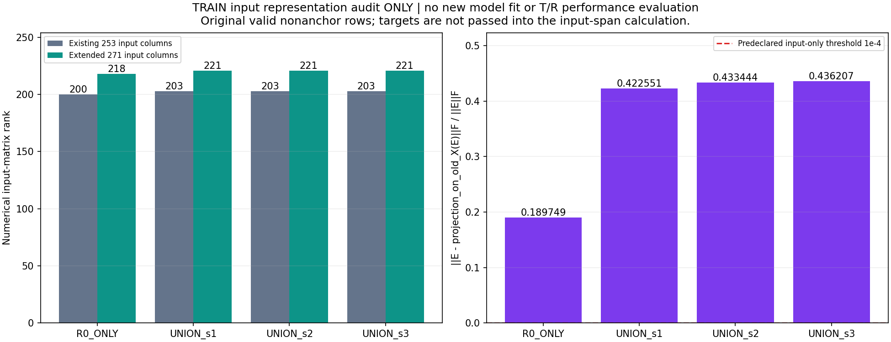
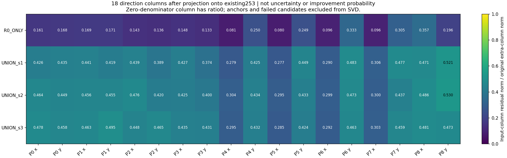
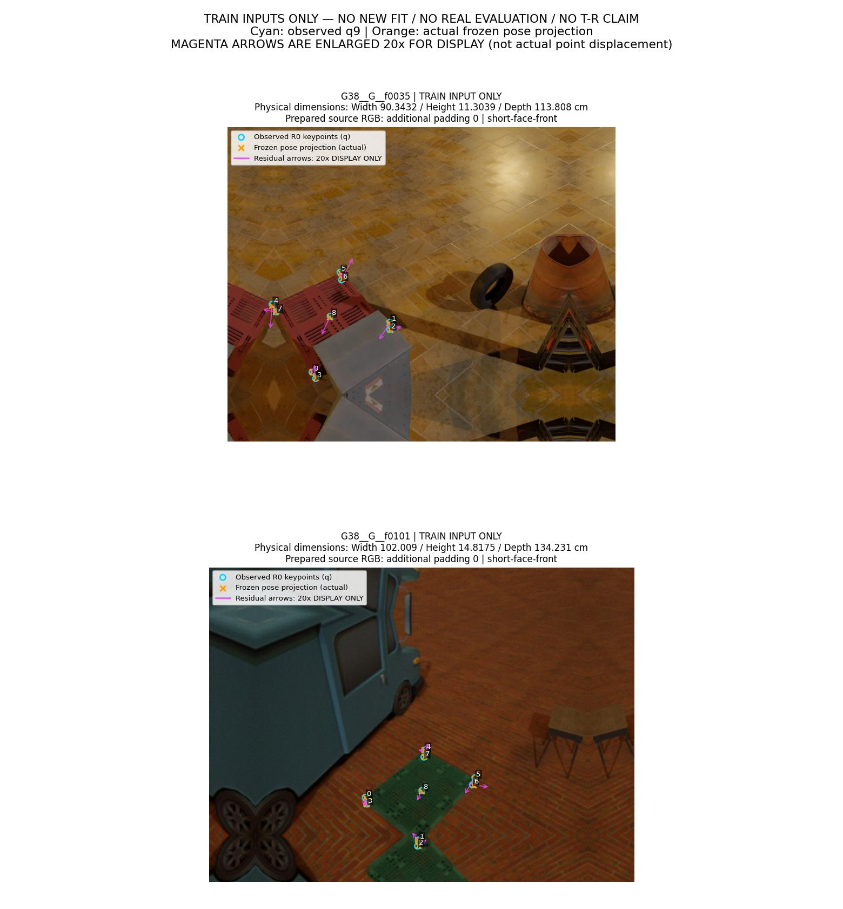
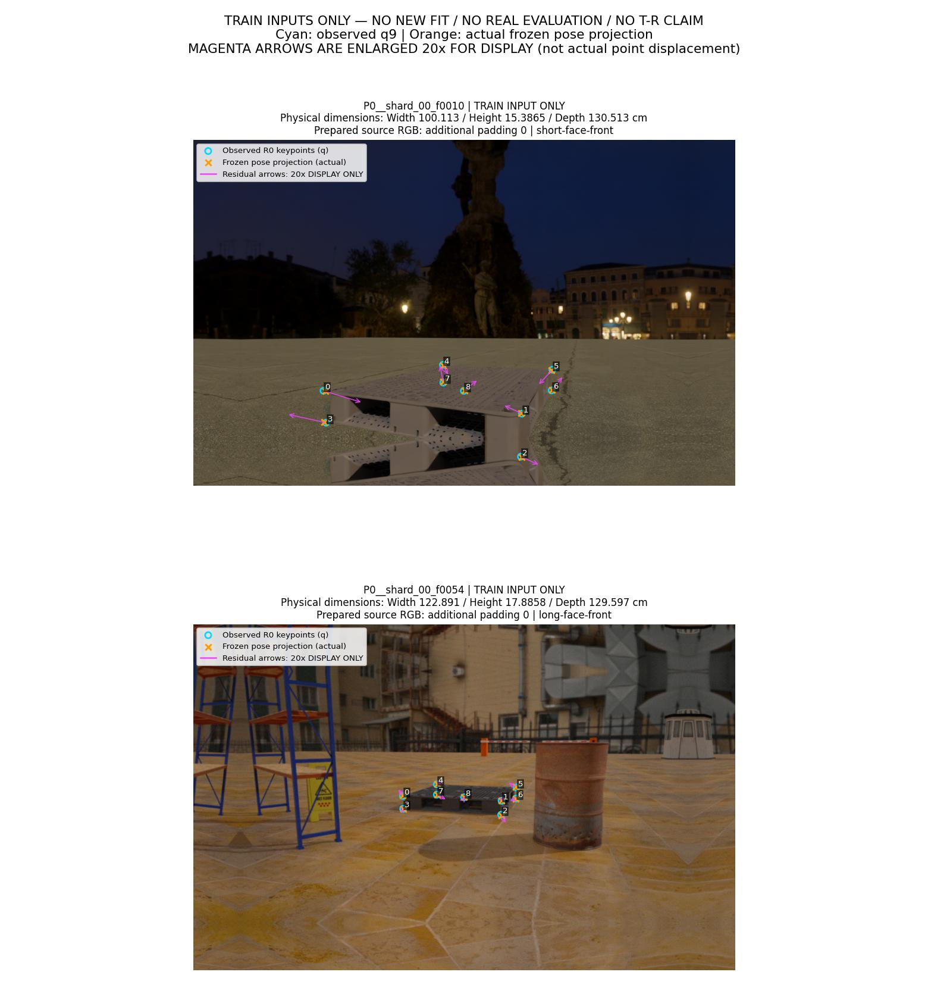
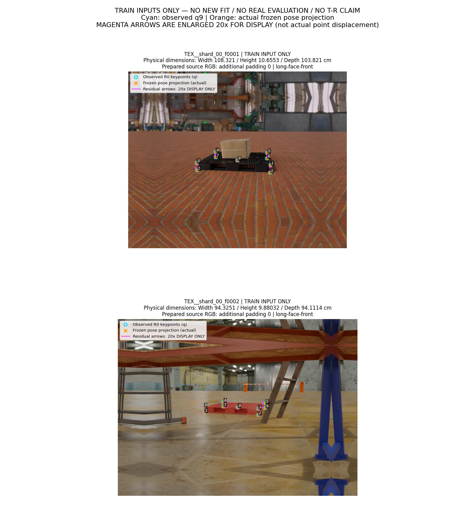

# 잔차 방향 18개 입력의 TRAIN 표현 감사

**새 학습 0회 · 새 VAL 성능 평가 0회 · 실사 평가 0회. T/R 개선 효과는 측정하지 않았다.** 입력 감사와 독립 검산의 PASS는 성능 성공을 뜻하지 않는다. 원래 목표는 아직 달성되지 않았다.

이번 단계는 고정된 모델이 보는 입력에 어떤 정보가 빠져 있는지 검사했다. 기존 253차원 입력을 그대로 재현하고, 9개 점의 `투영 위치 − 관측 위치`를 x/y 방향으로 분리한 18개 값을 추가했을 때 기존 입력의 선형 조합으로 설명되는지 확인했다. 최종 모델 가중치를 읽거나 적용하지 않았고, 후보를 새로 선택하지 않았다.

사전 적격 TRAIN **2,598행**을 전부 유지했다. 유효 anchor 2,597행과 전체 후보 실패 1행을 포함한다. 4개 expert의 유효 후보는 합계 20,776개이며, 추가 정규화는 R0의 유효 TRAIN 후보 5,194개만 사용했다.

## 실제로 확인한 것

기존 94개 특징에는 각 점의 잔차 크기가 들어 있지만 x/y 부호가 별도 열로 들어 있지 않다. 다만 다른 PnP 기반 특징에도 정보가 들어 있으므로 이 사실만으로 전체 표현의 부족을 증명할 수는 없다. 이번에는 기존 전체 253차원과 새 방향 18차원을 직접 대조했다.

추가 입력은 `d18 = flatten((project(R_cf, centroid, cf_extents, K) − q9) / bbox_diagonal)`이다. 코너 0–7과 중심 8을 사용한다. 원래 q9·bbox·K·동결 pose를 재사용했으며 새 PnP, 이미지 추론, 참조 pose 계산을 하지 않았다. 방향 부호는 투영값에서 관측값을 뺀 값으로 고정했다.

R0 TRAIN 유효 후보의 float32 평균·표준편차를 구하고 표준편차를 최소 1e−6으로 제한했다. 후보를 float32로 정규화한 뒤 float64로 변환하고 원래 anchor의 18차원을 뺐다. 기존 253차원과 기존 타깃의 6개 해시는 직전 단계와 정확히 같다. anchor 입력은 정확히 0이며 invalid 후보와 실패 행도 그대로 유지했다.

| Expert | TRAIN 행 | 유효 후보 | 실패 행 | 기존 9점 잔차 크기와 최대 차이(px) | bbox 정규화 잔차 최대 차이 | 기존 코너 8개 캐시 최대 차이(px) |
|---|---:|---:|---:|---:|---:|---:|
| R0 | 2598 | 5194 | 1 | 6.59988183e-06 | 7.41958409e-09 | 0 |
| DIVERSE251_s1 | 2598 | 5194 | 1 | 7.61014405e-06 | 1.44829579e-08 | 0 |
| DIVERSE251_s2 | 2598 | 5194 | 1 | 6.22474383e-06 | 1.46528773e-08 | 0 |
| DIVERSE251_s3 | 2598 | 5194 | 1 | 7.16141182e-06 | 1.47182329e-08 | 0 |

위 차이는 이미 저장된 특징과 투영 재구성의 수치 차이이며 팔레트의 위치·회전 정답 오차가 아니다. 허용오차와 전체 4행은 [FEATURE_PARITY.csv](FEATURE_PARITY.csv)와 [FEATURE_AUDIT.json](FEATURE_AUDIT.json)에 있다.

## 입력 열의 비중복성

SVD는 유효 nonanchor 후보만 사용했다. 기존 차분 입력을 X, 새 정규화 방향 차분을 E라고 하면 `E − U_r U_rᵀ E`를 계산한다. r은 `max(X.shape) × float64 eps × 최대 singular value`보다 큰 singular value의 개수다. 데이터 중심화, 절편, 프레임 가중치가 없으며 이 계산에는 타깃을 전달하지 않았다. 전체 singular spectrum과 허용오차도 JSON에 남겼다.

| 모델 | nonanchor 후보 | 기존 253열 rank | 확장 271열 rank | rank 증가 | 추가 입력 잔차 Frobenius 비율 | ≤ 1e−4 |
|---|---:|---:|---:|---:|---:|---|
| R0_ONLY | 2597 | 200 | 218 | 18 | 0.189748594 | False |
| UNION_s1 | 7791 | 203 | 221 | 18 | 0.422550821 | False |
| UNION_s2 | 7791 | 203 | 221 | 18 | 0.433444381 | False |
| UNION_s3 | 7791 | 203 | 221 | 18 | 0.436207306 | False |

두 그림은 입력 배열의 구조를 나타낸다. 신뢰도, 개선 확률, T/R 오차 또는 성능 그래프가 아니다. 분모가 0인 추가 열의 비율은 사전 규칙대로 0이다. [REP_SUMMARY.csv](REP_SUMMARY.csv)의 4행과 [EXTRA18_COLUMN_RESIDUAL.csv](EXTRA18_COLUMN_RESIDUAL.csv)의 72행이 그림 원자료다.

사전 판정: `INPUT_NONREDUNDANCY_ONLY_NOT_PERFORMANCE_EVIDENCE`. 4개 모델의 비율이 모두 1e−4 이하인지: **False**. 이 기준은 입력 추가의 비중복성 근거만 판단하며 성능 gate가 아니다.

## 동일 입력의 타깃 충돌

float64 벡터의 +0/−0만 +0으로 통일한 뒤 byte가 정확히 같은 후보를 묶었다. 반올림하거나 유사한 입력을 같은 것으로 간주하지 않았다. 동결 TRAIN 캐시의 타깃은 이 그룹의 값 범위·부호 충돌을 설명하는 데만 사용했다. 부호 충돌에는 0과 양수/음수의 차이도 포함하며, strict opposite는 같은 그룹에 음수와 양수가 모두 있는 경우다.

| 모델 | 기존 반복 그룹 | anchor/nonanchor 혼합 그룹 | T 부호 충돌 기존→271 | R 부호 충돌 기존→271 | T 양·음 충돌 기존→271 | R 양·음 충돌 기존→271 |
|---|---:|---:|---:|---:|---:|---:|
| R0_ONLY | 1 | 0 | 0→0 | 0→0 | 0→0 | 0→0 |
| UNION_s1 | 1 | 0 | 0→0 | 0→0 | 0→0 | 0→0 |
| UNION_s2 | 1 | 0 | 0→0 | 0→0 | 0→0 | 0→0 |
| UNION_s3 | 1 | 0 | 0→0 | 0→0 | 0→0 | 0→0 |

anchor의 차분 입력과 타깃은 정의상 모두 0이다. 이 반복은 nonanchor 충돌과 따로 집계했으며, anchor/nonanchor 혼합 그룹도 별도로 기록했다. 확장 입력이 나눈 그룹과 남은 충돌의 전체 목록은 [REPRESENTATION_AUDIT.json](REPRESENTATION_AUDIT.json)에 있다. 정확한 충돌이 없더라도 표현이 충분하거나 선형 모델이 올바른 순서를 배울 수 있다는 결론은 나오지 않는다.

## 고정 TRAIN 입력 사진과 물리 치수

**다음 6장은 실사 성능 결과가 아닌 source TRAIN 입력 예시다.** G38/P0/TEX별 사전 적격 ID의 사전순 첫 2장을 프로토콜에서 추출 전에 고정했다. 오류 크기나 결과를 보고 고르거나 실패 사례를 교체하지 않았다. 이미 준비된 이미지 크기와 metadata가 일치하며 **추가 padding은 0픽셀**이다.

파란 원은 R0에서 관측한 q9, 주황 X는 동결된 R0 운영 pose의 실제 투영 위치다. **자홍 화살표는 보기 쉽게 20배 확대한 방향 표시이며 실제 점 간 거리와 다르다.** 참조 정답 윤곽, GT pose, T/R 개선 수치를 표시하지 않았다. 박스에 사용한 camera-facing extents와 원래 물리 Width/Height/Depth는 좌표계가 다를 수 있어 각각 metadata에 보존했다.

| TRAIN ID | 이미지 H×W(px) | Width(cm) | Height(cm) | Depth(cm) | R0 anchor 사용 가능 |
|---|---:|---:|---:|---:|---|
| G38__G__f0035 | 680×840 | 90.3432 | 11.3039 | 113.808 | True |
| G38__G__f0101 | 680×920 | 102.009 | 14.8175 | 134.231 | True |
| P0__shard_00_f0010 | 740×1160 | 100.113 | 15.3865 | 130.513 | True |
| P0__shard_00_f0054 | 740×1160 | 122.891 | 17.8858 | 129.597 | True |
| TEX__shard_00_f0001 | 680×840 | 108.321 | 10.6553 | 103.821 | True |
| TEX__shard_00_f0002 | 680×920 | 94.3251 | 9.88032 | 94.1114 | True |

[GALLERY_SELECTION.json](GALLERY_SELECTION.json)에 원본 이미지·예측 SHA, K, 물리 치수, cf_extents/R_cf/centroid, 관측 q9, bbox, 실제 투영점과 확대 표시점을 모두 남겼다. [TRAIN_ROW_MEMBERSHIP.csv](TRAIN_ROW_MEMBERSHIP.csv)는 그림에 보이지 않는 행까지 포함한 전체 TRAIN 2,598행과 실패 1행을 공개한다.

## 읽은 데이터와 검산 범위

기존 source 컨테이너에는 TRAIN/VAL 합계 5,120행이 들어 있지만 실제 방향 재구성·표현 진단 대상은 사전에 적격으로 고정한 TRAIN 2,598행이다. VAL 품질, 실사 참조, 기존 모델 가중치, 새 후보 선택은 읽거나 실행하지 않았다. 원래 TRAIN 정답 캐시는 표현 감사의 해시·충돌 설명에만 사용했으며 입력 열공간 투영에는 전달하지 않았다. 이 보고서 생성 과정은 해당 정답 NPZ와 진단 배열 NPZ를 다시 열지 않고 동결된 JSON 집계와 방향 NPZ의 행·유효성 metadata만 사용한다.

독립 검산은 좌표별 투영, float32 정규화, 기존 253차원과 6개 해시, 모든 동일 입력 그룹의 범위·부호, 확장 그룹 분할을 재구성했다. 입력 열공간은 pivoted QR와 작은 행렬의 GESVD로 별도 계산해 생산자의 직접 SVD와 비교했다. 검산 PASS는 이 재현성 검사에 대한 판정이다.

실행 중 두 번의 파일 접근 중단도 보존했다. 첫 시도는 threadpool 런타임 초기화가 `/dev/null`을 쓰기 모드로 여는 데서 계산 전에 멈췄다. 두 번째는 4개 모델 계산과 진단 NPZ 저장 뒤, 자체 출력 파일을 해시하려는 읽기가 guard에 막혔다. 생산자 코드를 수정하지 않은 초기화·출력 확정 복구 경로, 남아 있던 NPZ와 실제 실행 내역은 [EXECUTION_KO.md](EXECUTION_KO.md)에 기록한다. 실패 시도를 삭제하거나 단일 성공 시도처럼 취급하지 않았다.

## 해석과 다음 단계의 범위

이번 감사는 18개 방향 열이 기존 입력의 선형 열공간과 완전히 중복된다는 설명을 기각할 근거를 제공한다. 이 정보가 물리 오차의 부호를 예측하거나 새 데이터로 전이된다는 증거는 아직 없다. 후속 후보는 기존 253차원에 이 고정 18차원만 붙인 271차원 입력으로 4개 모델을 학습하는 한 가지 실험이다. 이 보고서에서는 그 학습을 실행하지 않았다.

후속 실험을 한다면 원래 TRAIN 행·valid mask·anchor·signed T/R 타깃·정규화·RBF basis·Huber+sign 목적식·λ·zero 초기화·Newton/Armijo 예산과 수렴 인증을 유지한다. R0_ONLY 1개와 UNION 3개를 모두 남기고 최고 seed를 고르지 않는다. source 45/45 조건과 원래 및 matched 실사 5개 조건도 유지하며, source 실패 시 실사 learned route를 실행하지 않는다. 입력 18개 추가 외의 가중치·임계값·추가 탐색을 이 감사에서 선택하지 않았다.

재사용 source VAL과 과거 실사 관측, 원래 teacher 및 수동 참조의 계보 제약은 없어지지 않는다. 이번 TRAIN 내부 감사는 독립 시험집합을 새로 만들거나 이전의 불안정한 T/R 성과를 개선 결과로 바꾸지 않는다. 이전 실험 결과는 [직전 Huber+sign 보고서](../pallet_pose_signed_axes_sign_20261001_v1/REPORT_KO.md), 근거는 [설계 문서](DESIGN_KO.md)에서 확인할 수 있다.

## 파일과 재현 근거

- [FEATURE_AUDIT.json](FEATURE_AUDIT.json): 방향 재구성과 기존 특징 수치 일치.
- [REPRESENTATION_AUDIT_KO.md](REPRESENTATION_AUDIT_KO.md) / [JSON](REPRESENTATION_AUDIT.json): 전체 입력 진단.
- [VERIFICATION_KO.md](VERIFICATION_KO.md) / [JSON](VERIFICATION.json): 독립 수치 검산.
- [AUDIT_PROTOCOL.json](AUDIT_PROTOCOL.json) / [REPRESENTATION_PROTOCOL.json](REPRESENTATION_PROTOCOL.json): 추출·진단 전 고정 계약.
- [REPORT_DATA.json](REPORT_DATA.json): 표·그림 값과 원본 SHA 연결.
- [PUBLIC_REVIEW_KO.md](PUBLIC_REVIEW_KO.md) / [PUBLIC_REVIEW.json](PUBLIC_REVIEW.json): 공개물 검산.
- [PUBLICATION_MANIFEST.json](PUBLICATION_MANIFEST.json): 최종 공개 파일 목록과 SHA.
- [report.py](../../../scripts/research/pallet_pose_residual_direction_audit_20261001_v1/report.py), [direction_features.py](../../../scripts/research/pallet_pose_residual_direction_audit_20261001_v1/direction_features.py), [representation_audit.py](../../../scripts/research/pallet_pose_residual_direction_audit_20261001_v1/representation_audit.py), [verify_audit.py](../../../scripts/research/pallet_pose_residual_direction_audit_20261001_v1/verify_audit.py).

새 모델 checkpoint나 성능 CSV는 없다. 공개 CSV 4개는 특징 일치·입력 rank/잔차·행 소속을 담으며 T/R 성능표가 아니다. 원본 캐시·이미지의 로컬 가용성 및 재현 한계는 실행 기록을 따른다.
