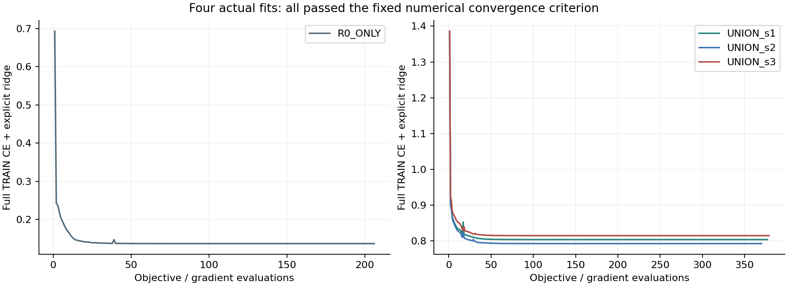
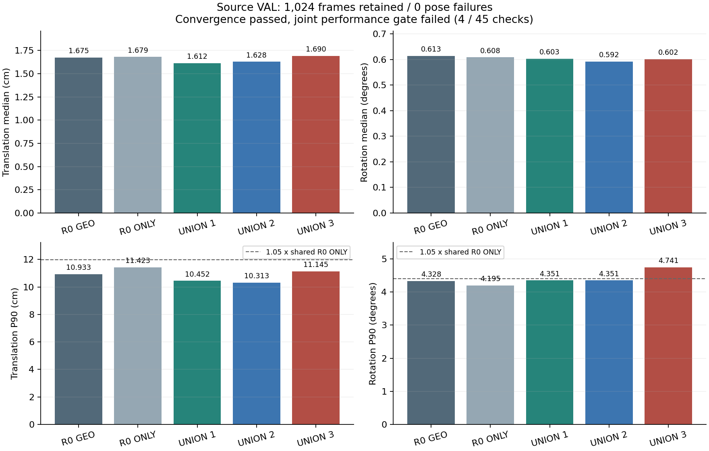

# 선택기 수렴 통제: 실제4회 학습과 합성 검증 결과

**학습 목적함수의 수렴은 확인했지만 T·R의 안정적 동시 개선은 달성하지 못했다.** 네 선택기 모두 수렴 인증을 통과했고, 합성 VAL1024장에서는45개 조건 중41개가 통과했다. 세 번째 refiner 후보를 사용하는 UNION_s3에서 T 중앙값과 R P90 조건4개가 실패했다. 사전 조건에 따라 이 모델의 새 실사 routing·평가는 실행하지 않았다. 따라서 이번 결과로 기존 실사 T·R 수치가 좋아졌다고 보고하지 않는다.

입력은 사용자가 지정한 **RGB 이미지 한 장과 팔레트 치수**다. 기존 카메라 보정 K와 기하 계약을 그대로 사용한다. temporal 입력, 새 실사 정답 학습, GT를 사용하는 실제 후보 선택은 추가하지 않았다. 기존 모델 계보에는 과거 real supervision이 있으므로 전체 계보를 real-GT-free라고 부르지 않는다.

## 왜 이 실험을 했는가

[직전 원인 감사](../pallet_pose_selector_objective_audit_20261001_v1/REPORT_KO.md)에서 현재 후보 집합 안의 GT oracle은 합성 T/R을 함께 개선할 수 있었으나, 기존 선택기는 놓치는 사례가 많았다. 기존6개 AdamW scorer는 NaN이나 정규화 오류는 없었지만 수렴 완료라고 판정할 근거가 부족했다. 그래서 feature·후보·target을 유지한 채 충분히 수렴시킨 통제를 실행했다.

**이 실험은 optimizer만 바꾼 인과 비교가 아니다.** 명시적 ridge penalty, float64 연산, full-batch L-BFGS-B가 함께 바뀐다. 기존 AdamW의 decoupled weight decay를 동일한 ridge objective였다고 해석하지 않는다. 새 ridge objective에 대해 수렴했음은 확인할 수 있지만, 모든 가능한 loss나 model capacity의 한계를 증명하지 않는다.

## 사전 고정한 실행 조건

| 항목 | 실제 조건 |
|---|---|
| TRAIN | 기존 declared-C2·proper-rigid 적격2598행, 후보 없는1행 유지 |
| source VAL | 기존1024장, 제외0·실패0 |
| 모델 | 공유 R0_ONLY1개 + 기존 DIVERSE251 seed1/2/3 UNION3개 |
| 특징 | 기존94개, R0 TRAIN 정규화 float32 연산 후 float64로 변환 |
| 파라미터 | weight94개, 모든 weight0 초기화, 공통 bias0 고정 |
| target | 기존 whole-pose min max(T/sT,R/sR), 같은 tie rule |
| loss | 전체2598행 평균 CE(-score) + 0.5×1e−4×||w||² |
| solver | CPU1thread, L-BFGS-B, bounds없음, maxiter1000/maxfun2000 |
| 정지 설정 | ftol1e−15, gtol1e−8, objective closure2001번째 호출 차단 |
| 수렴 인증 | optimizer success AND ||gradient||²/(2×1e−4)≤1e−6 |
| 모델 선택 | 최종 결과만 사용, best-seed·best-iteration 선택 없음 |

[PROTOCOL.json](PROTOCOL.json)과 [SHA 봉인](PROTOCOL_SHA.json)은 fit 전에 저장됐다. s1/s2/s3는 기존 보정기 seed이며 새 optimizer의 세 독립 반복이 아니다. 결정적인 R0_ONLY fit은 한 번만 수행했다. YOLO와 보정기 weight는 바꾸지 않았다.

## 실제 학습과 수렴 확인

| 모델 | iteration | objective 호출 | 최종 CE | gradient L2 | objective gap 상한 | 인증 |
|---|---:|---:|---:|---:|---:|---|
| R0_ONLY | 181 | 206 | 0.132509697 | 3.648e-08 | 6.656e-12 | PASS |
| UNION_s1 | 346 | 377 | 0.797014070 | 3.412e-08 | 5.821e-12 | PASS |
| UNION_s2 | 340 | 370 | 0.785397125 | 1.820e-08 | 1.657e-12 | PASS |
| UNION_s3 | 341 | 379 | 0.807586635 | 2.992e-08 | 4.477e-12 | PASS |

총4회 fit,1332회 objective/gradient 계산,1208회 optimizer iteration을 수행했다. CPU에서 실행한 fit 경과시간의 합은3.793초다. 기존 feature와 pose 캐시를 사용했으므로 이 수렴 실험의 새 이미지 모델 forward와 PnP 계산은0회다. 학습을 하지 않은 분석 결과를 학습 성공으로 기록한 것이 아니다.

명시적 ridge가 모든 weight 방향에 양의 곡률을 주므로 gradient norm으로 objective gap의 수치적 상한을 계산할 수 있다. **이는 pose 오류나 미관측 촬영의 일반화 보장이 아니다.** [독립 재계산 상세](TRAIN_CONVERGENCE_KO.md), [실행 완료 기록](TRAINING_COMPLETE.json), [모든 objective 호출 CSV](TRAINING_OBJECTIVE_LOG.csv), [실제 최종 파라미터4개](model_parameters/)를 제공한다. 공개 JSON은 로컬 최종 checkpoint와 byte 단위로 동일하다.

## source VAL 결과

정답을 읽기 전에4×1024개 선택을 [SOURCE_VAL_ROUTING_LOCK.json](SOURCE_VAL_ROUTING_LOCK.json)으로 동결했다. 이후 고정 source geometry에서 같은 C2 회전 오차와 중심 이동 오차를 계산했다. 전체1024장을 유지했고, IoU에 따른 평가 제외는 없다.

| 모델 | T 중앙값 cm | R 중앙값 ° | T P90 cm | R P90 ° | 실패 |
|---|---:|---:|---:|---:|---:|
| R0_ONLY | 1.679494 | 0.608127 | 11.423340 | 4.195165 | 0 |
| UNION_s1 | 1.611612 | 0.602646 | 10.452371 | 4.350842 | 0 |
| UNION_s2 | 1.628308 | 0.591965 | 10.313350 | 4.350842 | 0 |
| UNION_s3 | 1.689666 | 0.601619 | 11.145026 | 4.741256 | 0 |
| R0_GEO | 1.674594 | 0.613334 | 10.932544 | 4.328168 | 0 |
| DIVERSE251_s1_GEO | 1.818474 | 0.805513 | 19.343094 | 79.453475 | 0 |
| DIVERSE251_s2_GEO | 1.900040 | 0.775323 | 18.537749 | 73.676611 | 0 |
| DIVERSE251_s3_GEO | 2.051196 | 0.765877 | 18.074773 | 38.153661 | 0 |

| 실패 항목 | UNION_s3 | 비교 기준 | 허용값/조건 |
|---|---:|---:|---|
| T 중앙값 vs R0_ONLY | 1.689666cm | 1.679494cm | 엄격하게 더 작아야 함 |
| T 중앙값 vs R0_GEO | 1.689666cm | 1.674594cm | 엄격하게 더 작아야 함 |
| R P90 vs R0_ONLY | 4.741256° | 4.195165° | 기준×1.05 이하(4.404923°) |
| R P90 vs R0_GEO | 4.741256° | 4.328168° | 기준×1.05 이하(4.544576°) |

s1/s2는 각15개 비교를 모두 통과했지만 s3를 버릴 수 없다. 사전에 고정한 조건은 모든 seed의 통과다. T 중앙값 차이가 작더라도 허용 범위를 사후 변경하지 않았고, R P90은 공유 대조보다약13.02% 커졌다. 학습 CE를 더 낮추는 것과 원하는 T/R 분포를 함께 개선하는 것은 다르다.

[전체8192행 결과 CSV](SOURCE_VAL_FRAME_RESULTS.csv), [45개 검사 CSV](SOURCE_VAL_CHECKS.csv), [원본 gate JSON](SOURCE_VAL_GATE.json), [독립 검증·선택 변화 분석](SOURCE_VAL_ANALYSIS_KO.md)에 근거가 있다. 이전 실험의 실패 기록도 보존했다. 숫자를 골라 통과한 조합만 결과로 제시하지 않았다.

## 현재 실사 T·R 상태와 결론의 범위

이번 모델의 실사173장 선택과 평가는0회다. [기존 실사99장 결과](../pallet_pose_stable_improvement_20261001_v1/REPORT_KO.md)는 그대로이며, 다음 수치는 이번 수렴 모델의 결과가 아니다.

| 기존 모델 | natural99 T 중앙값 cm | R 중앙값 ° | T P90 cm |
|---|---:|---:|---:|
| R0 | 12.403251 | 5.217583 | 120.471370 |
| PRIOR1 | 12.042390 | 4.240347 | 123.679073 |
| FULL125 | 11.986464 | 4.410692 | 120.824080 |
| DIVERSE251 세 seed 통계의 평균 | 12.003722 | 4.567216 | 129.502732 |

마지막 행은 seed별 중앙값/P90의 평균이며 하나의 배포 모델 성능이나 모든행을 합친 통계가 아니다. 기존 실사 평가는 반복 사용한 DEV, 2D 주석·K·치수에서 유도한 reference pose를 사용하므로 독립 실측 TEST와도 구분해야 한다.

확인된 것은 이 **고정 후보·94특징·one-hot CE+ridge**를 충분히 최적화하는 것만으로 원래 joint gate를 해결하지 못한다는 점이다. loss weighting, 다른 특징, RGB evidence 또는 새 데이터의 모든 가능성을 배제한 것은 아니다. 다음 개입을 정할 때는 CE 분류오류와 실제 pose 피해의 차이, 합성·실사 검출 실패 분포 차이를 다뤄야 한다. 이미 본 VAL의 작은 수치를 맞추도록 임계값을 조절하는 후속 작업은 수행하지 않았다.

## 재현 및 공개 범위

구현: [학습](../../../scripts/research/pallet_pose_selector_convergence_20261001_v1/convex_train.py), [source 선택·평가](../../../scripts/research/pallet_pose_selector_convergence_20261001_v1/evaluate_source.py), [프로토콜 봉인](../../../scripts/research/pallet_pose_selector_convergence_20261001_v1/seal.py), [보고서 생성](../../../scripts/research/pallet_pose_selector_convergence_20261001_v1/report.py).

실행 순서는 `seal → convex_train all → evaluate_source freeze → evaluate_source score`였다. 학습·평가 원본 artifact는 overwrite하지 않으며 동일 경로의 partial fit을 자동 재시작하지 않는다. 대형 원본 이미지·YOLO/PoseFix weight·캐시는 이 commit에 포함하지 않는다. 공개 CSV·작은 scorer JSON·hash와 코드는 제공하지만 GitHub만 clone해 모든 이미지 추론을 재현할 수 있다고 주장하지 않는다. [공개 파일 manifest](PUBLICATION_MANIFEST.json)에 실제 업로드 범위를 기록한다.
