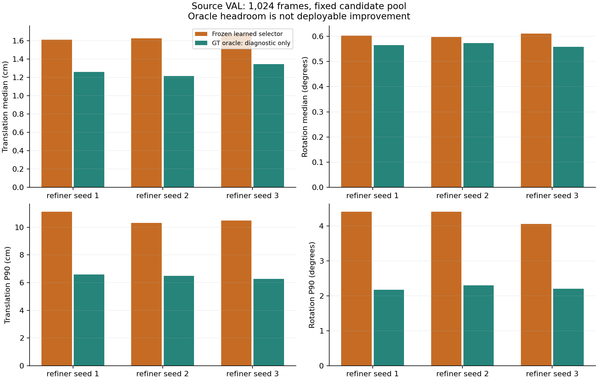
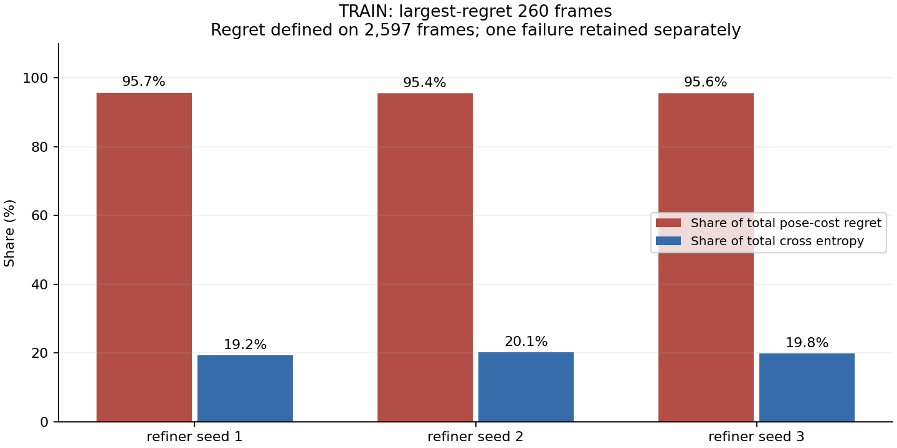
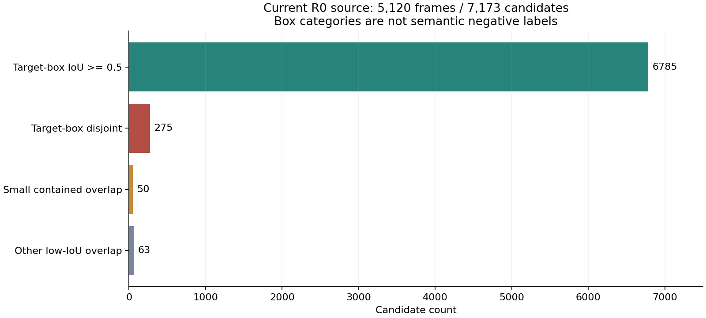
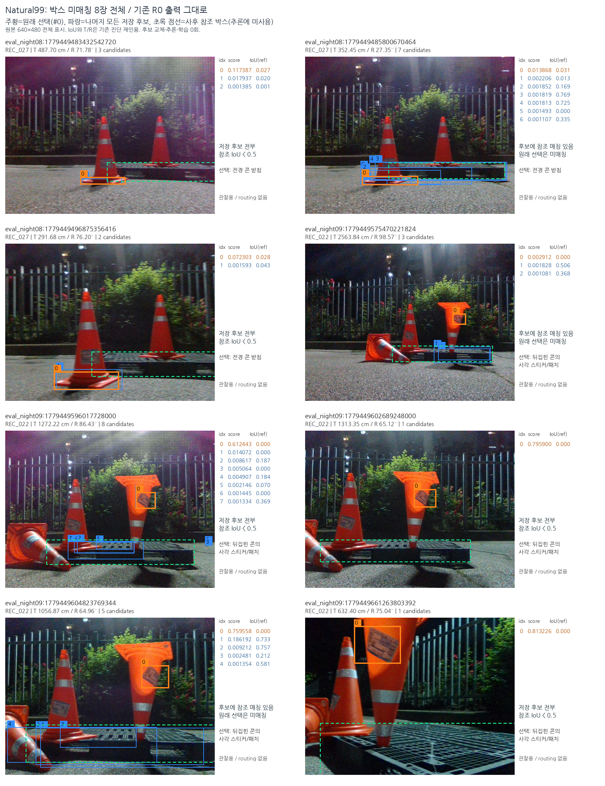

# T·R 동시 개선 실패 원인: 선택기 objective·수렴·검출 데이터 감사

**실사 T·R의 안정적 개선은 아직 입증되지 않았다.** 이 단계는 이미 실패한 선택기 실험의 원인을 검증한 진단이다. 새 모델 학습과 새 실사 routing은0회다. 입력은 **RGB 이미지 한 장과 팔레트 치수**이며 기존 카메라 보정 K/기하 계약을 유지한다. temporal 입력이나 새 실사 정답 학습을 추가하지 않았다.

## 후보가 없어서 실패한 것인가

이미 완료된 합성 VAL1024장의 고정 후보에서 TRAIN과 같은 `max(T/sT,R/sR)` 규칙의 oracle을 계산했다. 각 행의 T와 R을 별도 후보에서 가져오지 않고 하나의 완전한 pose를 선택했다. 세 refiner seed 모두 R0-only oracle보다 T/R 중앙값을 함께 낮출 수 있었다. 아래 oracle은 **정답을 알아야 가능한 진단이며 배포 성능이 아니다.** 같은 후보 안에 기회가 남았다는 의미다.

| 선택 | T 중앙값 cm | R 중앙값 ° | T P90 cm | R P90 ° |
|---|---:|---:|---:|---:|
| s1 기존 학습 선택 | 1.611612 | 0.602150 | 11.118373 | 4.408687 |
| s1 GT를 아는 oracle | 1.258929 | 0.564820 | 6.581710 | 2.169442 |
| s2 기존 학습 선택 | 1.627041 | 0.597564 | 10.313350 | 4.408687 |
| s2 GT를 아는 oracle | 1.217382 | 0.572522 | 6.478297 | 2.303674 |
| s3 기존 학습 선택 | 1.679494 | 0.611123 | 10.488876 | 4.061537 |
| s3 GT를 아는 oracle | 1.346179 | 0.557657 | 6.258391 | 2.202189 |

[VAL_ORACLE.json](VAL_ORACLE.json), [전체3072행 CSV](VAL_ORACLE_ROWS.csv), [사전 진단 조건](VAL_ORACLE_PROTOCOL.json)에 후보 선택과 수치를 기록했다. 저장된 기존 pose·선택의7168개 오차 재계산은 원래 결과와 일치했다. 기존 VAL gate는 그대로 보존했다. seed3는 평균 regret가 가장 작아도 원래 joint-median gate는 실패했다. 따라서 평균 scalar regret만 줄이는 새 loss를 바로 채택할 근거는 부족하다.

## 선택기 학습이 끝까지 수렴했는가

기존6개 scorer의 전체 TRAIN gradient와 Hessian을 조사했다. 모든 정규화 값은 일치하고 NaN/∞ 발산은 없었다. 하지만 UNION의 CE gradient L2는0.053–0.057, local Newton decrement는0.36–0.42였다. 마지막 몇 epoch의 작은 loss 변화만으로 수렴 완료나 선형 표현력의 한계를 선언할 수 없다.

한편 큰 long/short 가설 오류가 regret의 대부분을 차지한다. 가장 큰260행은 regret의95% 이상이지만 CE의약20%다. 이는 CE와 pose 비용의 차이를 보여 주지만, regret loss가 T/R 중앙값을 함께 개선한다는 증명은 아니다.

분모2598행 중 후보 없는1행은 실패로 유지했다. regret만 두 cost가 정의되는2597행을 사용했다. [TRAIN 진단 상세](TRAIN_DIAGNOSTIC_KO.md)와 [전체 수치·행별 선택](TRAIN_DIAGNOSTIC.json)에 실패 수, Hessian, epoch loss, cross-pool 진단을 공개한다. [기존 objective 실험 감사](PRIOR_OBJECTIVE_AUDIT_KO.md)는 과거 soft-cost·relative-gain 실험의 음성 결과와 현재 physical T/R 과제의 차이를 구분한다.

## 잘못된 물체 검출을 현재 합성 데이터로 고칠 수 있는가

현재 R0의 TRAIN4096+VAL1024, 전체7173후보를 확인했다. 선택 검출이 target box와 IoU≥0.5인 것은5113장이고, 잘못 선택했지만 대체 매칭 후보가 있는 것은6장, 검출 자체가 없는 것은1장이다. IoU가 낮은388후보도 모두 positive-depth PnP를 만들었다. 그러므로 pose 계산 성공만으로 팔레트라는 의미적 판단을 대신할 수 없다.

IoU가 낮은 후보는 비팔레트 정답이 아니다. 라벨 box는 가려지지 않은 표면 mask가 아니라 투영점의 envelope이며 reflect padding도 포함한다. VAL의 target-box-disjoint42개는 모두 confidence0.1 미만이다. 실사에서 확인된 높은 confidence의 콘 오검출과 분포가 다르다. Negative9K도4385장의 원본 생성 이력을 확인할 수 없어 모두 검증된 semantic negative라고 부를 수 없다. [검출 데이터 상세 감사](DETECTION_SOURCE_FEASIBILITY_KO.md), [전체 후보 근거](DETECTION_SOURCE_FEASIBILITY.json)를 함께 제공한다.

다음은 이전 단계에서 확인하고 공개한 실사 오검출8장의 이미지다. 이번 단계의 새 예측이나 개선 결과가 아니며, 합성 데이터가 다뤄야 할 실패 유형을 보여 주기 위해 연결했다.

## 실행할 후속 통제

동일94특징·후보·TRAIN target에 명시적 `CE + 1e-4/2 · ||w||²`를 사용해 수렴 여부를 인증하는 한정 실험을 진행한다. R0-only공통 대조1개와 기존 refiner seed1/2/3의 UNION3개, 총4개만 fit한다. 기존 AdamW의 decoupled decay와 이 ridge loss는 같지 않으며, 정밀도·solver·regularization이 함께 바뀌는 실험이라는 한계를 공개한다.

수렴 인증은 objective에 대한 것이며 pose 개선 인증이 아니다. 기존 source VAL의45개 검사와 실사173장의 joint T/R·bootstrap·촬영별·tail·clean 보호 조건을 유지한다. [후속 실험 결과](../pallet_pose_selector_convergence_20261001_v1/REPORT_KO.md)에서 실제 실행 여부와 결과를 확인할 수 있다.
