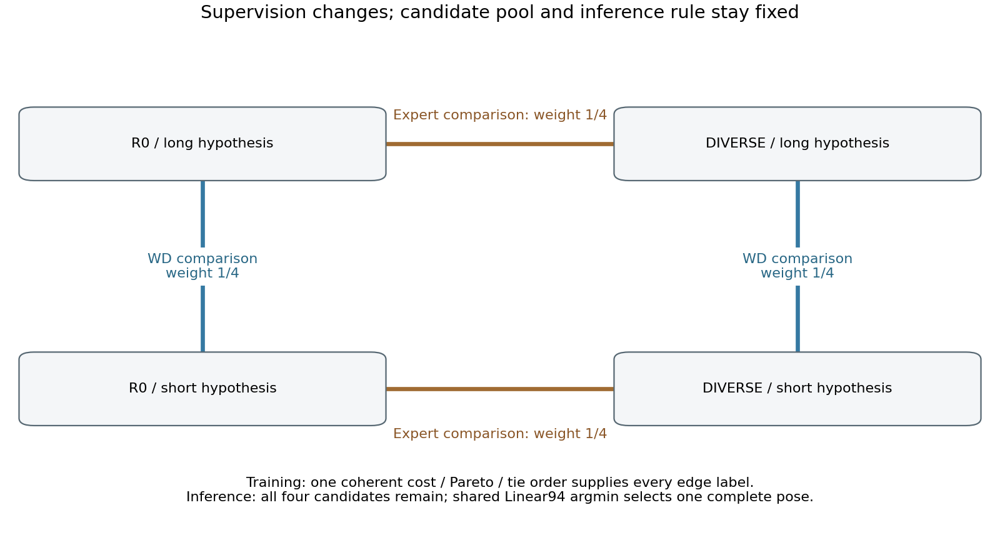
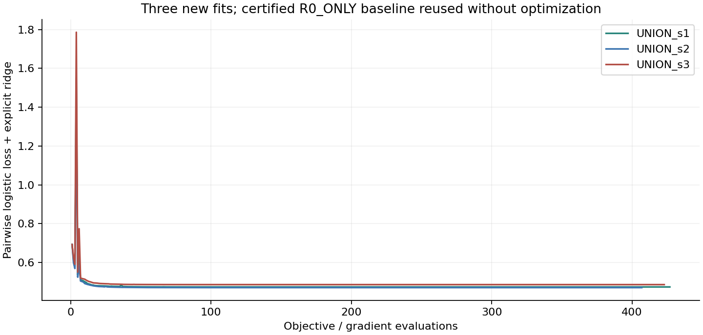
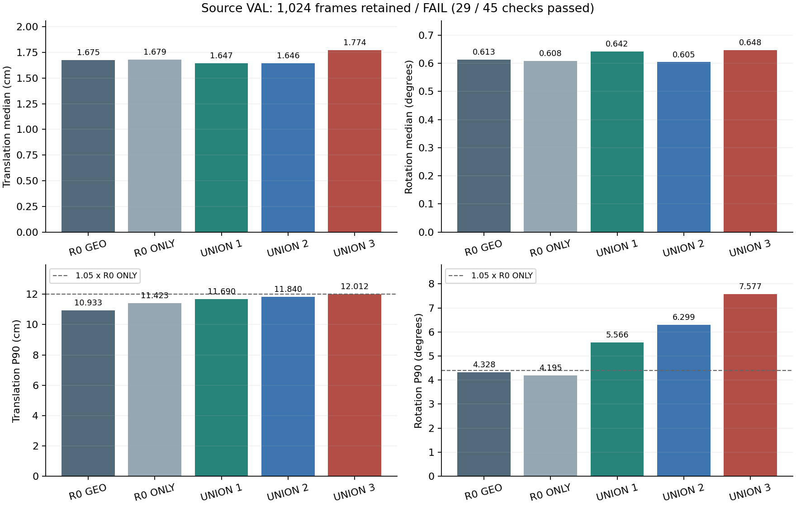

# W/D·expert pairwise 감독: 전체 실행 결과

**이번 방법도 안정적 T·R 개선에 실패했다.** 신규 선택기3개를 실제 학습해 수렴을 확인했지만, 합성 VAL45개 조건 중29개만 통과했다. 기존 R0_ONLY 대조는 같은 목적함수임을 확인하고 재사용했다. 사전 중단 조건에 따라 새 실사 선택·평가는0회다.

입력은 **이미지 한 장과 팔레트 치수**, 기존 보정 K/기하 계약이다. 시간 정보나 새 실사 GT 학습을 추가하지 않았다. 이 보고서는 합성·실사 결과, 실제 학습·재사용, 수렴·성능 판정을 구분한다.

## 바꾼 것과 검증하려는 설명

[직전 수렴 실험](../pallet_pose_selector_convergence_20261001_v1/REPORT_KO.md)에서는 기존 one-hot CE 선택기를 충분히 수렴시켜도 source gate4개가 실패했다. 이번에는 기존94특징·후보4개·최종 전체 argmin을 유지하면서 감독 구조만 바꾼다. 최상위 후보 하나만 분류하던 방식에서, 각 expert 안의 long/short 비교2개와 같은 가설 안의 R0/DIVERSE 비교2개를 함께 학습한다.

각 edge의 정답은 기존 `max(T/sT,R/sR)`가 작은 후보다. W/D group이라는 이름은 비교하는 후보의 종류를 뜻하며 renderer의 축 parity 자체를 정답으로 삼았다는 뜻이 아니다. T와 R을 서로 다른 후보에서 가져오지 않는다. 런타임에서 W/D를 먼저 제거하는 계단식 router도 아니다.

네 edge에 각각¼의 binary logistic loss를 주고, 전체2598행 평균에 명시적 ridge `0.5×1e−4×||w94||²`를 더한다. 비용 차이에 비례하는 가중이나 VAL을 보고 정한 임계값은 없다. 후보가 없거나 한쪽이 invalid인 edge의 loss는0으로 유지하고 분모를 재정규화하지 않는다.

## 학습 전에 확인한 정답 계약

[TARGET_CONTRACT_AUDIT_KO.md](TARGET_CONTRACT_AUDIT_KO.md)와 [원본 JSON](TARGET_CONTRACT_AUDIT.json)에 모든 TRAIN2598행을 검증했다. seed마다2597행은 네 후보가 모두 유효하고1행은 모두 invalid다. 실제 TRAIN의 exact-cost tie와 cycle은0이며, 새 전역 순서의 최상위 후보는 기존 target과2598/2598행에서 같다.

이론적으로는 pair마다 Pareto 동점을 따로 처리할 때 순환 순서가 생길 수 있다. 학습 전에 비용→동일 비용 내 Pareto front→기존 R0/가설 tie key라는 하나의 전역 순서를 고정했다. 실제 TRAIN의 edge label 변경은0이다. 존재하지 않은 실제 데이터 오류를 수정한 성과로 포장하지 않는다.

네 edge는 대각 비교2개를 포함하지 않는다. 따라서 모든 edge를 정확히 맞혀도 전체 cost-best를 항상 식별하는 것은 아니다. 실제 TRAIN에서 두 후보가 동시에 zero-indegree인 행은 seed별4/5/2개다. 이 한계를 유지한 채 원래 전체 pose 성능 기준으로 판정한다. edge 정확도 상승을 T/R 개선으로 대신하지 않는다.

## 실제 실행량과 수렴

| 모델 | 실행 | 새 iteration | 새 objective 호출 | gradient L2 | objective gap 상한 |
|---|---|---:|---:|---:|---:|
| R0_ONLY | 기존 weight 재사용 | 0 | 0 | 3.648e-08 | 6.656e-12 |
| UNION_s1 | 신규 학습 | 385 | 427 | 2.900e-08 | 4.205e-12 |
| UNION_s2 | 신규 학습 | 363 | 407 | 3.461e-08 | 5.991e-12 |
| UNION_s3 | 신규 학습 | 387 | 423 | 2.885e-08 | 4.163e-12 |

신규 fit3회, objective/gradient 호출1257회, optimizer iteration1135회다. CPU에서 실행한 세 fit의 경과시간 합은1.988초다. 기존 이미지 예측·pose 캐시를 사용해 새 이미지 forward와 PnP 계산은0회다.

R0_ONLY의 한 long/short pair logistic loss는 기존 두 후보 CE와 같은 수학적 함수다. 기존 weight와 정규화는 bit 단위로 유지하고, 독립 objective/gradient 동등성 검사 후 새 protocol metadata wrapper에 원본 계보를 기록했다. 이 wrapper 작성은 새 학습이 아니다. 공개 wrapper JSON과 원래 checkpoint JSON 전체가 byte-identical하다고 주장하지 않는다.

세 신규 fit은 모두0 초기화, float32 정규화 후 float64, CPU1thread, L-BFGS-B 최대1000iteration/2000closure를 사용한다. optimizer success와 `||gradient||²/(2λ)≤1e−6`를 동시에 요구한다. 이 수렴 인증은 새로운 pairwise objective에 대한 것이며 T/R나 일반화 보장이 아니다. 서로 다른 one-hot CE와 pairwise loss의 숫자 크기를 직접 비교해 성능 향상이라고 해석하지 않는다.

[사전 protocol](PROTOCOL.json), [SHA](PROTOCOL_SHA.json), [실행 완료](TRAINING_COMPLETE.json), [전체 학습 로그 CSV](TRAINING_OBJECTIVE_LOG.csv), [실제 최종 파라미터](model_parameters/)를 공개한다.

## 작은 비교의 정확도가 최종 선택으로 이어졌는가

별도 PyTorch float64 softplus/autograd로 저장 weight의 objective와 gradient를 검산했다. 세 모델의 수렴 인증과 R0 재사용은 모두 통과했다. 이전에 수렴시킨 one-hot CE weight도 같은 TRAIN 후보의 새 pairwise objective에 적용해 비교했다. 이 비교는 서로 다른 loss의 숫자를 직접 비교한 것이 아니다.

| 모델 | 최선 후보 정확도: 이전→신규 | 평균 regret: 이전→신규 | 최종 가설 오류: 이전→신규 |
|---|---:|---:|---:|
| UNION_s1 | 59.41% → 56.14% | 5.1467 → 5.9879 | 173 → 199 |
| UNION_s2 | 59.92% → 56.18% | 5.3636 → 5.7790 | 181 → 197 |
| UNION_s3 | 58.99% → 54.10% | 5.3102 → 6.2193 | 177 → 210 |

새 pairwise objective는 내려갔고 W/D edge 정확도도 조금 올라갔지만, 최종 전체 argmin이 올바른 최선 후보를 고르는 비율은 세 경우 모두 낮아졌다. 위의 가설 오류는 renderer parity가 아니라 cost-best 후보와 다른 long/short를 고른 수다. 평균 regret는 비용이 정의되는2597행의 값이며 후보 없는1행은 별도 실패로 유지했다. TRAIN에서도 작은 비교의 개선이 전체 pose 선택의 개선으로 연결되지 않았으므로, 이번 실패를 합성 VAL 전이 문제만으로 설명할 수 없다.

[독립 TRAIN 검산과 상세 해석](TRAIN_CONVERGENCE_KO.md), [전체 수치](TRAIN_CONVERGENCE.json)에 같은 pool의 local edge·global 선택·T/R 차이를 기록했다. 이 결과는 이번 고정 네-edge 목적함수를 지지하지 않으며 모든 pairwise 또는 RGB 방법의 불가능성을 증명하지 않는다.

## 합성 VAL1024장 결과

모든 학습과 baseline 재사용 검증이 끝난 뒤4×1024개 선택을 동결하고 source 참조를 읽었다. 전체 분모와 기존 C2 회전·중심 이동 오차를 유지한다. source VAL은 반복 사용한 개발 자료이며 독립 TEST가 아니다.

| 모델 | T 중앙값 cm | R 중앙값 ° | T P90 cm | R P90 ° | 실패 |
|---|---:|---:|---:|---:|---:|
| R0_ONLY | 1.679494 | 0.608127 | 11.423340 | 4.195165 | 0 |
| UNION_s1 | 1.646522 | 0.642442 | 11.689974 | 5.565992 | 0 |
| UNION_s2 | 1.646305 | 0.604725 | 11.839805 | 6.299050 | 0 |
| UNION_s3 | 1.774253 | 0.647675 | 12.012423 | 7.577450 | 0 |
| R0_GEO | 1.674594 | 0.613334 | 10.932544 | 4.328168 | 0 |
| DIVERSE251_s1_GEO | 1.818474 | 0.805513 | 19.343094 | 79.453475 | 0 |
| DIVERSE251_s2_GEO | 1.900040 | 0.775323 | 18.537749 | 73.676611 | 0 |
| DIVERSE251_s3_GEO | 2.051196 | 0.765877 | 18.074773 | 38.153661 | 0 |

45개 검사 중29개 통과, 16개 실패다. 다음 실패 목록은 전체 목록이다.

- `UNION_s1/R0_ONLY/rotation_deg_median_strict`
- `UNION_s1/R0_ONLY/rotation_deg_P90_guard`
- `UNION_s1/R0_GEO/translation_cm_P90_guard`
- `UNION_s1/R0_GEO/rotation_deg_median_strict`
- `UNION_s1/R0_GEO/rotation_deg_P90_guard`
- `UNION_s2/R0_ONLY/rotation_deg_P90_guard`
- `UNION_s2/R0_GEO/translation_cm_P90_guard`
- `UNION_s2/R0_GEO/rotation_deg_P90_guard`
- `UNION_s3/R0_ONLY/translation_cm_median_strict`
- `UNION_s3/R0_ONLY/translation_cm_P90_guard`
- `UNION_s3/R0_ONLY/rotation_deg_median_strict`
- `UNION_s3/R0_ONLY/rotation_deg_P90_guard`
- `UNION_s3/R0_GEO/translation_cm_median_strict`
- `UNION_s3/R0_GEO/translation_cm_P90_guard`
- `UNION_s3/R0_GEO/rotation_deg_median_strict`
- `UNION_s3/R0_GEO/rotation_deg_P90_guard`

[전체8192행 CSV](SOURCE_VAL_FRAME_RESULTS.csv), [45개 판정 CSV](SOURCE_VAL_CHECKS.csv), [원본 gate](SOURCE_VAL_GATE.json), [선택 동결 기록](SOURCE_VAL_ROUTING_LOCK.json)에서 모든 모델과 seed를 확인할 수 있다.

[독립 source 검산과 이전 선택 대비 변화](SOURCE_VAL_ANALYSIS_KO.md), [검산 JSON](SOURCE_VAL_VERIFICATION.json)을 함께 제공한다.

## 실사 T·R와 목표 상태

이번 모델의 새 실사 routing·평가는 실행하지 않았다. 기존 natural99/clean29/wood45의 결과는 그대로다. source 실패를 실사 성능이 개선됐다는 근거로 사용하지 않는다. [실사 미실행 근거](REAL_EVALUATION_NOT_RUN_KO.md), [기존 전체 실사 결과](../pallet_pose_stable_improvement_20261001_v1/REPORT_KO.md), [자연 가림99장 이미지](../pallet_pose_stable_improvement_20261001_v1/GALLERY_NATURAL99.md)를 연결한다.

## 공개와 재현

구현: [학습](../../../scripts/research/pallet_pose_selector_pairwise_20261001_v1/train.py), [source 평가](../../../scripts/research/pallet_pose_selector_pairwise_20261001_v1/evaluate_source.py), [protocol 봉인](../../../scripts/research/pallet_pose_selector_pairwise_20261001_v1/seal.py), [보고서 생성](../../../scripts/research/pallet_pose_selector_pairwise_20261001_v1/report.py).

원본 학습·평가 artifact는 덮어쓰지 않는다. 대형 이미지·YOLO/PoseFix weight·캐시는 이번 GitHub commit에 포함하지 않고 작은 scorer 파라미터·CSV·MD·이미지·코드와 hash를 공개한다. [공개 manifest](PUBLICATION_MANIFEST.json)는 실제 게시 범위를 기록한다.
