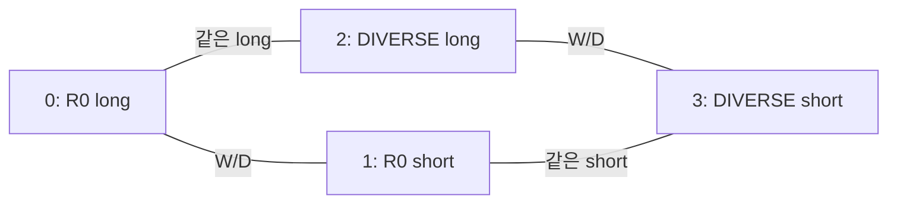

# 네 후보 비교의 source TRAIN 정답 일관성 감사

**세 refiner seed 모두 기존 whole-pose 정답과 전역 순서의 최상위 후보가 2,598/2,598장 일치했고, 새 네 비교 관계에서 선호 순환은 없었다.** 단, 네 관계만으로 최선 후보가 유일하게 결정되지 않는 영상은 seed별 4·5·2장이다. 이는 감독의 모순이 아니라 생략된 비교가 남기는 정보의 한계다. 이 결과는 label 계약에 대한 PASS이며, 새 모델의 VAL·실사 T/R 개선에 대한 PASS가 아니다.

[수치·입력·label 배열 SHA](TARGET_CONTRACT_AUDIT.json)와 [독립 감사 코드](../../../scripts/research/pallet_pose_selector_pairwise_20261001_v1/target_audit.py)를 공개한다. 기존 guarded TRAIN loader만 사용했다. 새 fit·optimizer 호출·scorer forward·image inference·PnP는 모두 0회이고, VAL label 값과 실사 GT를 읽지 않았다.

## 1. 고정된 네 후보와 네 비교

후보는 `0=R0 long`, `1=R0 short`, `2=DIVERSE_s long`, `3=DIVERSE_s short`다. 같은 입력 영상에 대한 기존 완전한 R,t 후보다. T와 R의 정답을 서로 다른 후보에서 골라 결합하지 않는다. 모델·입력·94차원 특징·기존 normalization·source physical pose 비용을 새로 만들지 않았다.

| 비교 그룹 | 두 관계 | 질문 |
|---|---|---|
| W/D | (0,1), (2,3) | 같은 좌표 예측에서 long/short 중 어느 전체 pose가 나은가 |
| 같은 W/D의 모델 비교 | (0,2), (1,3) | 같은 long 또는 short에서 R0/DIVERSE 중 어느 전체 pose가 나은가 |



그림은 비교하는 쌍을 보여 주며 실제 선호 방향은 영상마다 다르다. 대각선 `(0,3)`과 `(1,2)`는 학습 loss에 넣지 않는다. 아래 여섯 비교의 전수 검사는 정답 계약을 설명하는 추가 진단이며, 비교를 추가하는 코드 변경이 아니다.

전체 후보의 scalar cost는 이미 고정된 `max(T_cm / sT_cm, R_deg / sR_deg)`다. TRAIN에서 고정됐던 scale은 `sT=2.4636887551191258 cm`, `sR=1.113474019956766°`다. 새 실험을 위해 scale·cost·정답 pose를 다시 조정하지 않았다. 정규화된 비용 차이는 무차원이며 T cm나 R° 차이와 같은 수가 아니다.

## 2. 학습 전 발견한 동점 계약 문제와 명시적 수정

기존 whole-best 규칙은 최소 cost 후보를 찾고, exact-cost 동점 후보 중 Pareto 지배당한 후보를 제거한 뒤 R0·hypothesis 이름 순서로 하나를 정한다. 이 규칙을 **각 쌍에 따로** 적용하는 것이 일반적인 전순서를 보장하지는 않는다. 같은 비용에서도 Pareto 지배와 우선순위가 섞이면 순환할 수 있다.

독립 코드에 넣은 인공 반례는 다음과 같다. 실제 TRAIN에서 고른 사례가 아니며, scale은 `[1,1]`이다.

| 후보 index | 두 error 값 | max cost |
|---|---|---:|
| 0 | (0.9, 1.0) | 1 |
| 1 | (1.0, 0.5) | 1 |
| 2 | (0.8, 1.0) | 1 |
| 3 | (0.7, 1.0) | 1 |

쌍마다 기존 규칙을 적용하면 `0→1→3→2→0` 순환이 생긴다. 여기서 화살표는 더 선호되는 후보에서 덜 선호되는 후보로 향한다. 기존 네 후보 whole-best는 1이지만, `(0,1)`만 보면 0을 선택한다. 따라서 pair-local 규칙이 언제나 무순환이라는 설명은 사용하지 않는다.

root는 **새 학습·protocol 봉인 전에** 아래 전역 규칙을 정했다.

1. 영상의 유효 후보를 exact scalar cost 오름차순으로 나눈다.
2. 같은 cost 집합에서는 Pareto 비지배 frontier를 반복해서 벗겨 layer를 만든다.
3. 각 layer 안에서는 기존 `OLD.tie_key`의 R0→hypothesis 이름→expert 이름 순서를 사용한다.
4. 모든 pair label은 이 한 전역 순서에서 앞선 후보를 winner로 정한다.

반례의 새 순서는 `[1,3,2,0]`이고 기존 whole-best 1을 보존한다. `(0,1)`의 label만 바뀌어 순환이 사라진다. **낮은 순위의 exact-cost tie label은 옛 pair-local 방식과 달라질 수 있다.** 이 차이를 숨긴 동일 규칙이라고 설명하지 않는다.

새 순서는 유효 후보마다 서로 다른 rank를 하나씩 부여한다. 모든 감독 화살표가 작은 rank에서 큰 rank로 향하므로 순환은 불가능하다. rank 0은 최소 cost 집합의 첫 Pareto frontier에서 기존 tie key로 고른 후보이므로 기존 whole-best와 같다. 두 성질을 실제 모든 TRAIN 행에서도 확인했다.

## 3. 실제 TRAIN 전수 결과

source 모집단은 기존 declared-C2·proper-rigid 적격 TRAIN 2,598장이다. 적격성·행 순서·source ID를 고정한 기존 loader를 사용했으며 성능을 보고 제외하거나 보충하지 않았다.

| 항목 | seed 1 | seed 2 | seed 3 |
|---|---:|---:|---:|
| 전체 행 | 2,598 | 2,598 | 2,598 |
| 후보 4개 모두 유효 | 2,597 | 2,597 | 2,597 |
| 후보 0개 유효 | 1 | 1 | 1 |
| 후보 1~3개 유효 | 0 | 0 | 0 |
| 전역 rank 0과 원 whole-best 일치 | 2,598 | 2,598 | 2,598 |
| 네 비교의 exact-cost 동점 | 0 | 0 | 0 |
| 여섯 비교 전체의 exact-cost 동점 | 0 | 0 | 0 |
| 옛 pair-local 규칙의 실제 순환 | 0 | 0 | 0 |
| 전역 규칙의 실제 순환 | 0 | 0 | 0 |
| 옛 pair-local→전역 규칙의 실제 label 변경 | 0 | 0 | 0 |
| 전역 whole-best가 자신을 포함한 edge에서 패배 | 0 | 0 | 0 |
| 더 큰 strict cost를 앞 rank로 정한 위반 | 0 | 0 | 0 |

공통 무효 1장은 `TEX__shard_04_f0110`이다. 삭제하지 않았고, 해당 행의 네 edge loss는 0, 전체 평균의 분모는 2,598 그대로다. 두 후보가 모두 유효하지 않은 edge는 inactive다. 유효 후보 수에 따라 남은 edge를 재가중하거나 resampling하지 않는다.

실제 TRAIN에는 exact-cost tie가 없어 명시적 전역 tie 수정으로 바뀐 실제 label은 없다. 이 관찰은 동점 반례가 잘못됐다는 뜻이 아니다. 새 규칙은 향후 동점이 생겼을 때의 수학적 모순을 학습 전에 방지한다.

## 4. 무순환과 유일한 최선 식별은 다른 조건

네 edge를 winner→loser로 향하게 했을 때 기존 whole-best에서 다른 모든 유효 후보로 경로가 이어지는 영상은 seed별 2,593·2,592·2,595장이다. 나머지 4·5·2장에는 incoming edge가 없는 후보가 두 개 있다. 둘의 직접 비교가 생략된 대각선에 해당하므로 네 label만으로 둘 중 어느 것이 전역 1위인지 결정할 수 없다.

| graph 성질 | seed 1 | seed 2 | seed 3 |
|---|---:|---:|---:|
| 네 edge에서 유일한 zero-indegree 후보 | 2,593 | 2,592 | 2,595 |
| 네 edge에서 zero-indegree 후보 2개 | 4 | 5 | 2 |
| 여섯 edge 진단에서 whole-best가 모두에 도달 | 2,597 | 2,597 | 2,597 |

해당 ID를 JSON에 전부 남겼다. 이 결과를 보고 대각선을 추가하거나 어려운 행을 제거하지 않았다. 하나의 shared linear94 scorer가 다른 영상의 감독을 통해 차이를 학습할 수도 있지만, 이 감사는 그것을 증명하지 않는다. 영상별 DAG의 일관성은 여러 영상 전체의 선호를 같은 선형 가중치로 만족시킬 수 있다는 선형 분리 가능성의 증명도 아니다.

## 5. 두 loss 그룹의 비교 수와 비용 차이

각 seed의 W/D 그룹과 같은 W/D 모델 비교 그룹에는 각각 5,194개의 active edge가 있다. 각 그룹의 2개 edge를 산술평균하고 그룹별로 0.5를 곱하므로, 각 active edge의 고정 계수는 0.25다. 전체 2,598장으로 나눈 그룹별 유효 계수 합은 둘 다 `0.4998075442648191`이다. 희소한 한 그룹을 더 많이 복제하거나 비용 차이로 가중하지 않는다.

| scalar cost 차이 | s1 W/D | s1 모델 비교 | s2 W/D | s2 모델 비교 | s3 W/D | s3 모델 비교 |
|---|---:|---:|---:|---:|---:|---:|
| edge 수 | 5,194 | 5,194 | 5,194 | 5,194 | 5,194 | 5,194 |
| 중앙값 | 75.656831 | 0.529223 | 75.597630 | 0.505517 | 75.648780 | 0.518634 |
| P90 | 79.465624 | 3.197290 | 79.451548 | 3.460090 | 79.449922 | 3.150560 |
| 평균 | 73.388385 | 3.034163 | 73.307398 | 3.208218 | 73.312201 | 2.960229 |
| 0보다 크고 0.1 이하 | 0 | 630 | 1 | 636 | 0 | 613 |
| 10 초과 | 5,161 | 212 | 5,156 | 228 | 5,161 | 211 |

W/D 비교는 대부분 비용 차이가 크고, 같은 W/D에서 두 모델을 비교하는 차이는 훨씬 작다. 두 그룹을 균등하게 감독하는 동기를 설명하지만 이것만으로 0.5/0.5가 최적이라고 증명하지 않는다. 작은 비용 차이를 소음이라고 판단해 제거하거나 다른 threshold를 고르지 않았다. 진단 구간은 label eligibility와 무관하다.

같은 W/D 비교에는 T와 R이 서로 다른 방향으로 변하는 tradeoff도 많다. 두 후보 중 어느 쪽도 상대를 T/R 모두에서 지배하지 않는 edge는 모델 비교 long/short 각각 s1 `1,160/1,218`, s2 `1,121/1,167`, s3 `1,169/1,272`개다. 이때도 기존 단일 min-max cost로 전체 pose를 택한다. T·R을 따로 분리한 새 oracle 정답을 만들지 않았다.

네 edge 중 whole-best가 포함되지 않은 비교도 감독한다. 모든 유효 4후보 영상에서 whole-best는 두 edge에만 포함되고, 나머지 두 edge는 다른 후보끼리의 순서를 제공한다. 이는 기존 four-way one-hot CE와 다른 목적함수다. 전체 logits가 0일 때 기존 four-way CE 평균은 `1.3857607605189974`, 새 균등 pairwise 평균은 `0.6928803802594988`이다. 초기 loss 값이 작아진 것을 성능 개선이라고 해석할 수 없으며, loss scale이 달라졌다는 사실을 공개한다.

## 6. 비교 대상과 감사 범위

공통 `R0_ONLY`에는 `(0,1)` 하나만 있고 계수는 1이다. 원래 두 후보 CE와 같은 이진 비교가 된다. 이 감사는 기존 whole-best target과 두 후보 전역 순서의 최상위가 2,598장 모두 일치함을 확인했다. 재사용할 frozen R0 scorer의 실제 loss/gradient 동등성 검사는 trainer의 별도 책임이며, 이 감사에서 scorer를 실행했다고 보고하지 않는다.

최종 JSON의 seed별 hash는 `global_rank` int64 `[2598,4]`, `edge_winners` int64 `[2598,4]`, `edge_active` bool `[2598,4]`, `original_whole_best` int64 `[2598]`를 바인딩한다. winner는 pair의 0/1 class가 아닌 **원래 후보 index 0~3**이고, inactive는 `-1`이다. 행 순서는 기존 TRAIN loader의 ID 순서다. trainer 구현과 독립적으로 계산한 값이므로 학습 전 배열 정합성 검증에 사용할 수 있다.

```bash
MPLCONFIGDIR=/tmp/pallet-stability-mpl python -m scripts.research.pallet_pose_selector_pairwise_20261001_v1.target_audit
```

기존 감사 JSON이 있으면 덮어쓰지 않는다. 두 번의 CPU 진단 중 두 번째 실행은 `PASS` 스키마와 여섯 edge의 동점 수·희소 graph 한계를 명시한 최종 영수증을 만들기 위한 것이며, 실제 core count는 같았다. guard는 source TRAIN label container만 허용하고 source VAL quality·실사 참조 경로를 차단한다. GPU 작업과 학습은 수행하지 않았다. **일관된 정답 graph가 확보됐다는 사실을 source VAL 또는 실사 T/R 개선으로 대신하지 않는다.**
