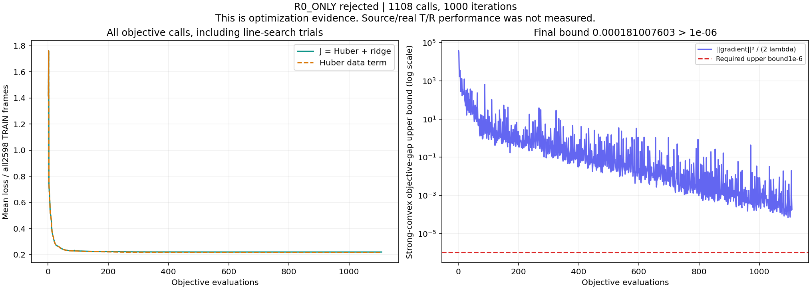
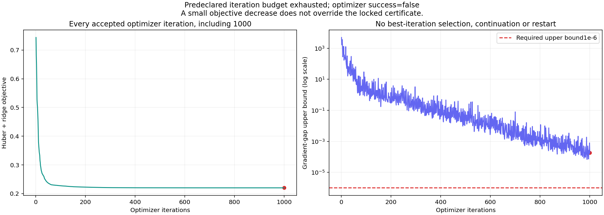
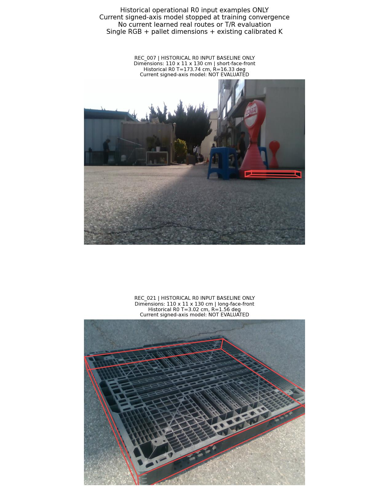
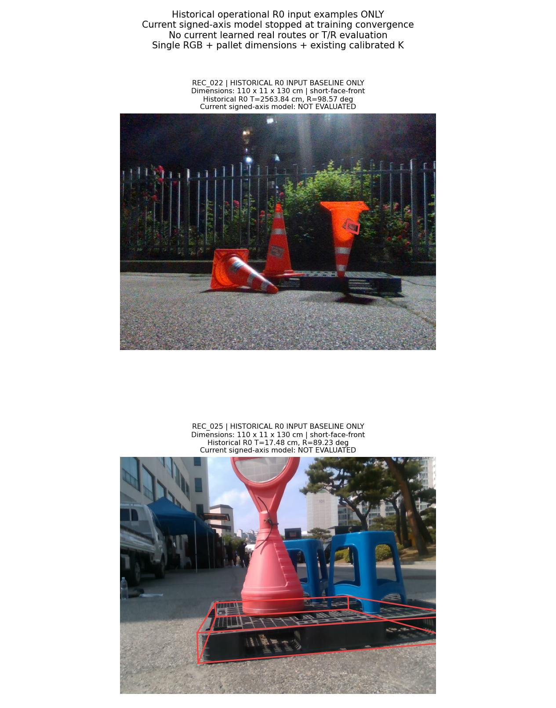
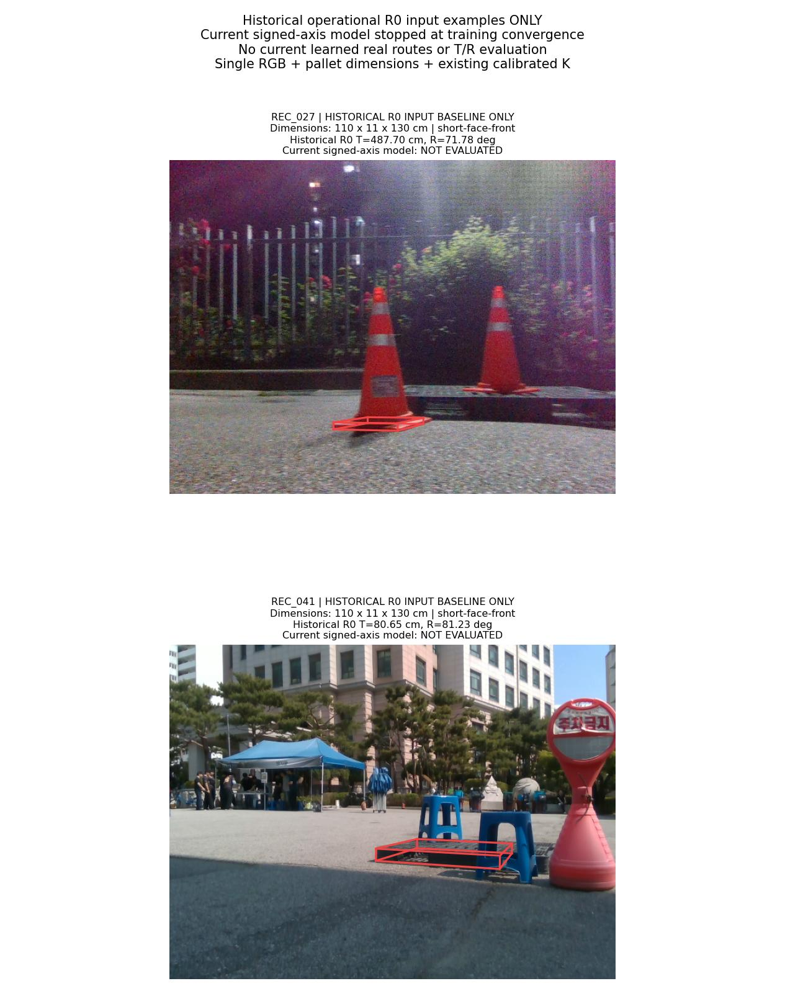

# Signed T/R 회귀: 학습 수렴 단계에서 중단

**이번 방법의 T/R 개선 효과는 측정하지 않았습니다.** 첫 R0_ONLY 학습이 사전 수렴 조건을 충족하지 못해 거부됐고, 나머지 UNION 세 모델의 학습·source VAL·실사 평가를 실행하지 않았습니다. 안정적인 T·R 동시 개선 목표는 아직 미달성입니다.

실제 수행은 **학습 시도1회 / 거부1회 / 인증 모델0개**, objective 호출1108회·optimizer 반복1000회입니다. 이는 구현·synthetic 검산 실패도, 측정된 T/R 성능 악화도 아닌 **고정 예산 내 수렴 인증 실패**입니다.

운영 입력 계약은 **단일 RGB 이미지 + 팔레트 치수 + 기존 카메라 보정 K**입니다. 아래 실제 사진은 이 입력을 보여주는 이전 R0 예시이며, 현재 회귀 모델의 실사 결과가 아닙니다.

## 실행된 단계와 실행되지 않은 단계

| 단계 | 실제 상태 |
|---|---|
| 입력·수학 사전 독립 검산 | PASS |
| R0_ONLY 학습 시도 | 반복 한도에서 종료, 인증 FAIL |
| UNION_s1 / s2 / s3 학습 | 모두 미실행 |
| 승인된 final checkpoint | 0개 |
| source VAL 선택·45개 조건 | 미실행; PASS/FAIL 판정 없음 |
| 실사 learned 선택·5범주 안정성 | 미실행; PASS/FAIL 판정 없음 |

[미실행 영수증](EVALUATION_NOT_RUN_KO.md)은 승인된 FIT·TRAINING_COMPLETE·source/real 산출물의 부재를 확인합니다. 이 문서의 검산 PASS는 미실행 사실 확인을 뜻하며 방법의 성능 통과를 뜻하지 않습니다.

## 이번에 시도한 변경

직전 [고정 RBF253 선택기](../pallet_pose_anchor_rbf_20261001_v1/REPORT_KO.md)의 입력 특징·raw94 정규화·context189·RBF64 센터와 폭·후보 pool·기존 TRAIN2598행·물리적 T/R 참조와 scale을 유지했습니다. 선택 후보 하나를 맞히는 margin CE 대신, R0 운영 anchor에 대한 두 축 변화량을 signed-log1p target으로 회귀하는 Huber 목적함수를 사용했습니다. 변경 동기와 음성 선행은 [설계 문서](DESIGN_KO.md)에 고정했습니다.

```text
x_c = phi253(candidate_c) − phi253(R0 GEO anchor)
e_c = [(T_c − T_anchor)/sT, (R_c − R_anchor)/sR]
y_c = sign(e_c) * log1p(abs(e_c))
prediction_c = x_c @ W; W shape = (253, 2); bias = 0
J = mean_all2598[mean_valid_candidates_and_2axes Huber(prediction_c − y_c, delta=1)]
    + (lambda/2) * ||W||_F²
sT = 2.4636887551191258 cm; sR = 1.113474019956766 deg; lambda = 1e-4
planned runtime: choose whole pose with minimum max(predicted T change, predicted R change)
```

기존 유효 후보를 유지하며 모든 후보가 실패한1행은 손실0으로 전체2598행 분모에 남습니다. 유효·유한 쌍에만 차분을 계산해 inf−inf를 피합니다. anchor의 입력 차분과 target은 정확히0입니다. 추론에는 실제 T/R 참조 오차·학습 margin·정답으로 만든 safe mask를 넣지 않도록 구현했습니다. 이 추론 규칙의 실제 데이터 성능은 이번 중단으로 평가하지 않았습니다.

예측 기준에서 anchor 점수가0인 것은 실제 pose의 두 축이 개선된다는 보장이 아닙니다. 동률에는 원래 R0→가설명 순서를 유지하므로 운영 anchor가 두 번째 가설이면 다른 R0 가설의 동률 선택도 허용됩니다. 새 anchor 우선 규칙이나 실제 정답 기반 routing은 추가하지 않았습니다.

## 실제 중단 수치

| 항목 | 기록 값 | 요구 조건 / 해석 |
|---|---:|---|
| optimizer 반복 | 1000 | 최대1000회 도달 |
| objective 호출 | 1108 | 최대2000회 이내; 반복 한도가 먼저 종료 |
| optimizer success | False | True 필요 |
| 최종 J = Huber + ridge | 0.220023167576 | 실사 오차 단위 아님 |
| Huber data term | 0.216019825149 | 유효 후보×2축 평균 후 전체2598행 평균 |
| L2 penalty | 0.00400334242657 | 모든506개 계수에 적용 |
| gradient L2 | 0.00019026697172 | 마지막 파라미터의 기울기 |
| 목적함수 gap 상한 | 0.000181007602637 | 1e-06 이하 필요 |
| 요구 상한 대비 | 181.007603배 | 수렴 인증 FAIL |

solver 메시지는 `STOP: TOTAL NO. of ITERATIONS REACHED LIMIT`입니다. 첫 J=1.41532268548에서 마지막 J=0.220023167576로 84.454% 감소했지만, 감소 사실만으로 사전 인증 조건을 대신하지 않습니다. 마지막 상태를 채택하지 않았고, 중간의 가장 유리한 반복·추가 학습·재시작도 선택하지 않았습니다.

`J(W)−min J ≤ ||gradient J(W)||²/(2λ)`는 강볼록 목적함수의 **최적값과의 차이에 대한 상한**입니다. 상한이1e−6보다 크다는 것은 필요한 보증을 얻지 못했다는 뜻이며, 실제 최적값과의 차이가 그 수치만큼 크다고 확정하는 뜻은 아닙니다. 별도로 optimizer 성공 조건도 실패했습니다.



objective 호출에는 line search의 trial도 포함하므로 이 곡선의 각 점이 승인된 optimizer 반복은 아닙니다. 아래에는 승인된1000개 optimizer 반복을 전부 보존했고 마지막 반복을 강조했습니다.



**이전 margin CE와 이번 Huber는 서로 다른 목적함수이므로 loss 값의 직접 우열 비교를 하지 않습니다.** 이번 거부 파라미터로 TRAIN 후보 argmin, 선택 정확도, T/R 효과, source·실사 효과도 계산하지 않았습니다. 독립 검산은 저장된 마지막 상태의 Huber·기울기·Hessian·기록 연결을 확인하는 범위입니다.

[거부 상태의 독립 수학 검산](REJECTED_FIT_VERIFICATION_KO.md)은 원래 인증 FAIL을 그대로 재현합니다. 검산 PASS를 optimizer 인증 PASS나 학습 성공으로 바꾸어 해석하지 않습니다.

| 독립 재계산 | 값 |
|---|---:|
| Huber + ridge J | 0.220023167575816 |
| gradient L2 | 0.000190266971719783 |
| 목적함수 gap 상한 | 0.000181007602637083 |
| 506×506 Hessian 최소 고유값 | 9.99999999978e-05 |
| Hessian 최대 고유값 | 27.6286413484 |
| Hessian condition number | 276286.413490339 |
| 정확히 Huber 경계인 잔차 수 | 0 |

마지막 지점의 Hessian은 양의 정부호였고 두 축 사이 블록은0이었습니다. 큰 condition number는 이 지점의 수치적 곡률 차이를 나타내는 관측이며, 이것만으로 반복 한도 도달의 유일한 원인을 확정하지 않습니다. 더 큰 예산이나 다른 solver를 이 결과에 섞지 않았습니다.

## 실제 RGB와 치수: 기존 R0 입력 예시

**아래6장은 이전 보고서에서 이미 정한 동일한 실제 RGB입니다. 현재 signed-axis 모델의 learned 결과는 하나도 포함하지 않습니다.** 자연 촬영별 기존 R0 T 오차가 가장 컸던 예시라서 대표 표본이나 개선 근거로 볼 수 없습니다. 입력 치수에는 실제 `110 × 11 × 130 cm` 등이 포함됩니다.

빨간 선은 이전 운영 R0의 저장된 camera-facing extents·R_cf·centroid를 기존 K로 투영한 것입니다. 새 PnP나 참조 오차 계산은 하지 않았고, 표기된 T/R는 이전 R0의 기록입니다. 현재 모델의 수치로 대체하지 않았습니다.







이미지 SHA·원본 크기·치수·K·기존 R0 pose6개·투영좌표는 [갤러리 원자료](GALLERY_SELECTION.json)에 연결했습니다. 최신 **실제로 측정된** learned 실사 결과는 [직전 RBF 보고서](../pallet_pose_anchor_rbf_20261001_v1/REPORT_KO.md)에 있으며, 그 단계에서도 안정적 T·R 공동 개선은 미달성이었습니다. 그 과거 결과를 이번 방법의 성능으로 재사용하지 않습니다.

## 공개 검증 자료와 한계

- [사전 설계](DESIGN_KO.md), [학습 프로토콜](TRAIN_PROTOCOL.json), [사전 입력·수학 독립 검산](PREFIT_REVIEW_KO.md)
- [원본 거부 영수증](REJECTED_R0_ONLY.json), [독립 거부 상태 검산](REJECTED_FIT_VERIFICATION_KO.md), [평가 미실행 확인](EVALUATION_NOT_RUN_KO.md)
- [objective 전체1108행 CSV](TRAINING_OBJECTIVE_LOG.csv), [optimizer 반복 전체1000행 CSV](TRAINING_ITERATION_LOG.csv)
- [거부 파라미터506개 — 비운영 상태](rejected_optimizer_state/R0_ONLY.json), [파라미터의 사용 범위](rejected_optimizer_state/README.md)
- [그림·데이터 SHA 연결](REPORT_DATA.json), [공개물 독립 검산](PUBLIC_REVIEW_KO.md), [공개 SHA 목록](PUBLICATION_MANIFEST.json)
- [학습 코드](../../../scripts/research/pallet_pose_signed_axes_20261001_v1/convex_train.py), [미실행 source 평가 코드](../../../scripts/research/pallet_pose_signed_axes_20261001_v1/evaluate_source.py), [미실행 실사 평가 코드](../../../scripts/research/pallet_pose_signed_axes_20261001_v1/evaluate_real.py), [보고서 생성 코드](../../../scripts/research/pallet_pose_signed_axes_20261001_v1/report.py)

source VAL과 실사 DEV는 이전 방법들에서 반복 사용됐습니다. refiner의 기존 source 노출과 selector TRAIN/VAL/TEST 중복105/26/26건이 있어 독립 일반화 시험으로 주장하지 않습니다. 전체 교사 계보에는 기존 이미지9장의 수동 코너38개가 포함됩니다. 이번 새 실사 정답 학습은0개이며, 기존 실사 pose 참조는2D 주석·K·치수로 만든 값으로 독립 장비에서 측정한6D 정답이 아닙니다.

이번 시도는 동일한 solver 예산에서 수렴 단계가 먼저 중단됐습니다. 방법이 실사 T/R를 개선하거나 악화한다는 결론은 낼 수 없습니다. 반복 수나 tolerance를 바꾼 새 시도를 이번 결과로 합치지 않았습니다. 재현에는 공개 코드·프로토콜과 SHA로 연결된 로컬 원본 특징·참조 캐시가 필요합니다.
