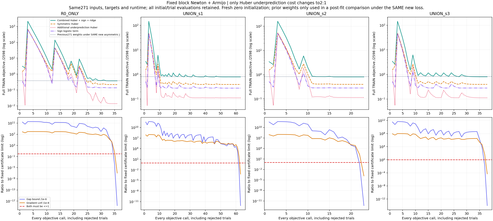
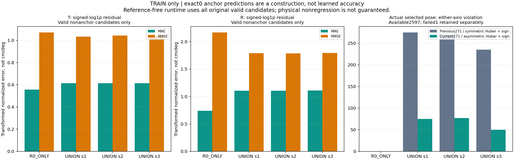
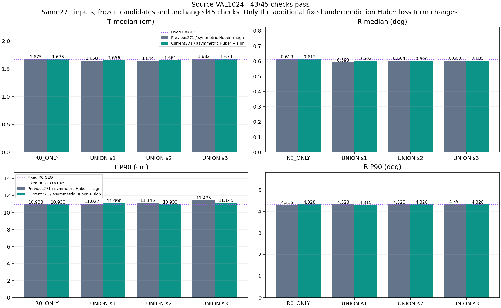
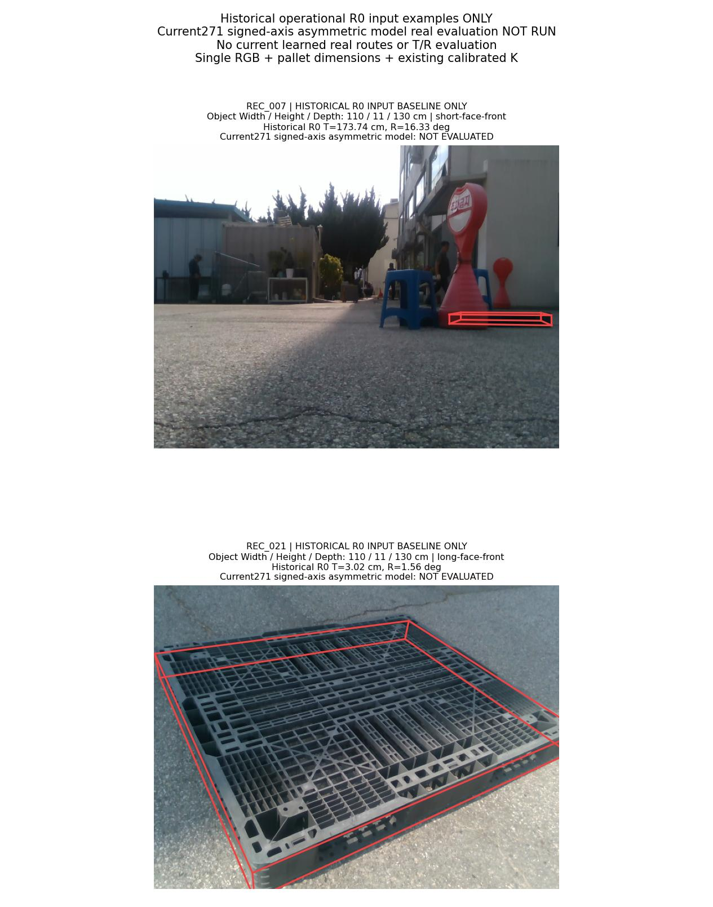
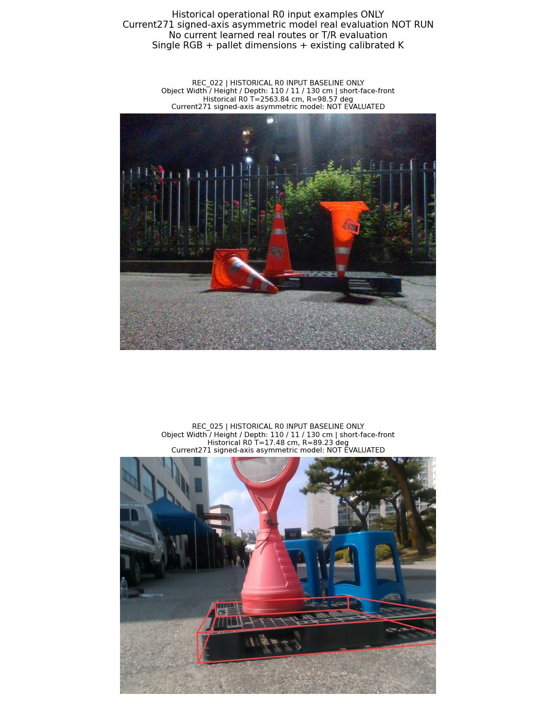
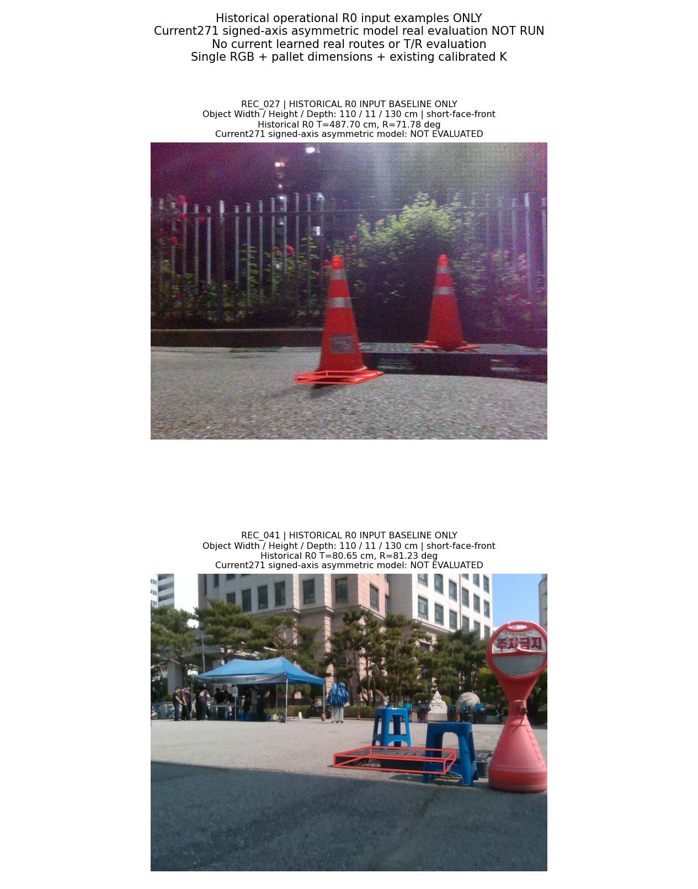

# 과소예측 비용2:1: 비대칭 Huber 목적식 실험

**4개 학습의 수렴 인증은 통과했지만 source 43/45로 실패했습니다. 사전 조건에 따라 이번 모델의 실사 선택·T/R 평가는 미실행이며, 안정적 공동 개선 목표는 달성하지 못했습니다.**

새 zero 초기화로 4개 모델을 학습했습니다. objective 호출 160회와 승인 Newton 반복 57회를 모두 보존했습니다. 바꾼 요인은 과소예측에 추가하는 Huber 항 하나뿐이며, 이전 가중치를 이어 학습하지 않았습니다.

운영 입력은 **단일 RGB + 팔레트 치수 + 기존 카메라 보정 K**입니다. 시간 정보, 추가 센서, 새 실사 정답을 넣지 않았습니다. 수렴 인증·source 조건·실사 안정성은 서로 다른 판정입니다.

## 바꾼 목적식과 유지한 조건

[직전 271차원 단계](../pallet_pose_signed_axes_direction_20261001_v1/REPORT_KO.md)는 수렴했으나 source 조건을 통과하지 못했습니다. 고정 선택 중 예측 두 축이 모두0이하인데 실제 오차가 anchor보다 커진 사례가 남았습니다. 이번에는 대칭 Huber가 과소·과대예측을 같은 비용으로 벌하던 조건에, 과소예측 Huber 항을 계수1로 더했습니다. 이는 원인 확정이나 성공 예측이 아니며 사전 고정한 단일 비교입니다.

[TRAIN 입력 감사](../pallet_pose_residual_direction_audit_20261001_v1/REPORT_KO.md)에서 확인한 방향18의 비중복성은 성능 증거가 아닙니다. 이번 입력은 직전과 동일한271개입니다. 방향18은 고정 pose의 투영값에서 관측 q9를 빼고 bbox 대각선으로 나눈 뒤, 기존 R0 TRAIN 유효5,194후보의 float32 정규화로 처리합니다. RBF·정규화·투영·padding을 다시 선택하지 않았습니다.

```text
base253_c = phi253(candidate_c) − phi253(R0 GEO anchor)
d18_c = flatten((project(frozen_pose_c, K) − observed_q9) / bbox_diagonal)
extra18_c = float64(normalize_FP32(d18_c)) − float64(normalize_FP32(d18_anchor))
x271_c = concatenate(base253_c, extra18_c)
e_c = ((T_c − T_anchor)/sT, (R_c − R_anchor)/sR)
y_c = sign(e_c) * log1p(abs(e_c)); prediction_c = x271_c @ W271x2
residual = prediction − y
Huber_symmetric = Huber(residual, delta=1)
Huber_underprediction = Huber(min(residual, 0), delta=1)
Huber_combined = Huber_symmetric + Huber_underprediction
J = mean_all_2598_frames(mean_original_valid_candidates_and_2_axes(
      Huber_combined + 1{y != 0} softplus(−sign(y)*prediction)))
    + (1e−4/2) * ||W||F²
runtime_score = max(predicted_T_axis, predicted_R_axis)
whole_pose_choice = old_tie_argmin(runtime_score over original valid candidates)
```

음의 residual은 실제 signed 오차 초과를 작게 예측한 경우입니다. 같은 절댓값에서 Huber 비용은 과소예측2:과대예측1입니다. target이0이어도 이 추가 비용은 적용하며 sign logistic만 생략합니다. 추가항은 residual0에서 연속미분 가능하고, 그 점의 generalized curvature는0으로 고정했습니다. 두 Huber 항은 |residual|=1에서 곡률0을 선택하고 logistic 곡률과 ridge는 유지합니다.

기존 raw94·context189·고정RBF64·방향18·차분271·타깃·scale·valid mask·TRAIN2,598행과 기존9개 해시는 그대로입니다. invalid 후보와 전체 실패1행은 제거하지 않으며 anchor 입력·타깃은 정확히0입니다. sign 계수1, bias0, λ1e−4, zero 초기화, 최대1,000승인 반복/2,000objective 호출, Armijo 및 두 수렴 조건도 바꾸지 않았습니다. 계수·threshold sweep이나 warm start는 없습니다.

추론은 정답·margin·safe mask를 읽지 않습니다. 양 축 예측의 최댓값으로 원래 whole pose 하나를 선택하며 anchor에 새 동률 우선권을 주지 않습니다. 예측상 비악화는 실제 T/R 비악화 보장이 아닙니다.

## 실제 학습과 수렴

| 모델 | objective 호출 | 승인 반복 | 최종 J | Huber 합계 | 대칭 Huber | 과소예측 추가 Huber | Sign logistic | L2 penalty | gradient Linf | gap 상계 |
|---|---:|---:|---:|---:|---:|---:|---:|---:|---:|---:|
| R0_ONLY | 36 | 13 | 0.371675472395 | 0.230985890783 | 0.217409617292 | 0.013576273491 | 0.135222130358 | 0.005467451255 | 1.20266481e-15 | 2.68164419e-25 |
| UNION_s1 | 63 | 18 | 0.801800523030 | 0.508074793316 | 0.395419275277 | 0.112655518039 | 0.280274451141 | 0.013451278574 | 6.48825107e-12 | 8.13499747e-19 |
| UNION_s2 | 23 | 13 | 0.804028871963 | 0.509127424321 | 0.396000407253 | 0.113127017068 | 0.280286684283 | 0.014614763359 | 1.47123538e-12 | 4.86586348e-19 |
| UNION_s3 | 38 | 13 | 0.804845394002 | 0.508817498886 | 0.395944825014 | 0.112872673872 | 0.281128654812 | 0.014899240304 | 4.96755127e-13 | 1.01386114e-20 |

마지막 승인점에서 `||gradient||∞ ≤ 1e−8`와 `||gradient||²/(2λ) ≤ 1e−6`를 함께 요구했습니다. 모든 초기·trial 호출을 기록했고 거절 trial을 마지막 checkpoint로 쓰지 않았습니다. 이 인증은 고정 목적식의 float64 수치 검산이며 구간 연산의 절대 증명이나 T/R 성능 인증은 아닙니다.

| 모델 | 직전271 가중치의 새 비대칭 J | 현재271 가중치의 같은 J | 이전−현재 |
|---|---:|---:|---:|
| R0_ONLY | 0.384176450855 | 0.371675472395 | 0.012500978460 |
| UNION_s1 | 0.833983260730 | 0.801800523030 | 0.032182737699 |
| UNION_s2 | 0.835554037249 | 0.804028871963 | 0.031525165286 |
| UNION_s3 | 0.836772135778 | 0.804845394002 | 0.031926741777 |

이 표는 같은 새 비대칭 loss·타깃·frame 분모로 직전271 가중치와 현재271 가중치를 비교합니다. 직전의 원래 대칭 Huber 목적식 값·수렴 인증은 별도 재현하며, 서로 다른 loss 값이나 gradient를 직접 성능 우열로 비교하지 않습니다. 이전 가중치는 독립 사후 비교에만 사용했고 학습 초기화나 새 정책 탐색에는 쓰지 않았습니다.



## TRAIN 회귀와 실제 선택 진단

| 모델 | nonanchor T MAE | T RMSE | T 부호 정확도 | nonanchor R MAE | R RMSE | R 부호 정확도 | nonanchor 후보 수 |
|---|---:|---:|---:|---:|---:|---:|---:|
| R0_ONLY | 0.556407 | 1.070739 | 0.906430 | 0.740733 | 2.167150 | 0.927994 | 2597 |
| UNION_s1 | 0.612899 | 1.033530 | 0.790784 | 1.107157 | 1.790297 | 0.810551 | 7791 |
| UNION_s2 | 0.614188 | 1.043521 | 0.795918 | 1.105742 | 1.785160 | 0.810679 | 7791 |
| UNION_s3 | 0.613889 | 1.040443 | 0.796303 | 1.107398 | 1.792215 | 0.805160 | 7791 |

MAE/RMSE는 signed-log1p 정규화 공간의 값이며 cm/도 단위가 아닙니다. 정의상 정확히0인 anchor는 위 회귀 표에서 제외했습니다. 전체 후보·실제 선택 후보의 별도 통계와 부호 confusion matrix는 [TRAIN_CONVERGENCE.json](TRAIN_CONVERGENCE.json)에 있습니다.

| 모델 | T 위반 이전→현재 | R 위반 이전→현재 | unsafe 이전→현재 | 안전 개선 이전→현재 | anchor 이전→현재 | 최대 정규화 초과 이전→현재 |
|---|---:|---:|---:|---:|---:|---:|
| R0_ONLY | 0→0 | 0→0 | 0→0 | 9→4 | 2588→2593 | 0.000000→0.000000 |
| UNION_s1 | 198→54 | 149→39 | 275→75 | 212→66 | 2110→2456 | 78.783595→4.661528 |
| UNION_s2 | 189→51 | 155→47 | 270→77 | 191→65 | 2136→2455 | 79.720142→79.720142 |
| UNION_s3 | 165→33 | 130→27 | 235→50 | 144→41 | 2218→2506 | 9.771535→2.543161 |

unsafe는 실제 선택의 T 또는 R가 원래 anchor보다 커진 행입니다. 유효2,597행과 실패1행을 구분하며, TRAIN 개선이나 평균 loss 감소만으로 source·실사 안정성을 대신하지 않습니다.



## source VAL 전체 결과

현재 **43/45**, 직전 대칭 Huber271은 **43/45**입니다. 각 모델의 원래1,024행을 유지했습니다. 새 loss로 다시 학습한 R0_ONLY도 비교군으로 바뀌므로 pass 개수만으로 전체 성능 우열을 정하지 않습니다. 고정 R0_GEO와 세 DIVERSE_GEO의 수치는 직전과 동일함을 확인했습니다.

| 모델 | T 중앙값 cm | R 중앙값 ° | T P90 cm | R P90 ° | 실패 |
|---|---:|---:|---:|---:|---:|
| R0_ONLY | 1.674594 | 0.613334 | 10.932544 | 4.328168 | 0 |
| UNION_s1 | 1.656191 | 0.602370 | 11.089684 | 4.315199 | 0 |
| UNION_s2 | 1.660625 | 0.599713 | 10.932544 | 4.328168 | 0 |
| UNION_s3 | 1.679494 | 0.604827 | 11.145026 | 4.328168 | 0 |
| R0_GEO | 1.674594 | 0.613334 | 10.932544 | 4.328168 | 0 |
| DIVERSE251_s1_GEO | 1.818474 | 0.805513 | 19.343094 | 79.453475 | 0 |
| DIVERSE251_s2_GEO | 1.900040 | 0.775323 | 18.537749 | 73.676611 | 0 |
| DIVERSE251_s3_GEO | 2.051196 | 0.765877 | 18.074773 | 38.153661 | 0 |

각 UNION seed는 새 R0_ONLY·고정 R0_GEO·paired DIVERSE_GEO와 비교합니다. 두 중앙값은 엄격히 감소, 각 P90은1.05배 이하, 실패는 증가하지 않아야 하며 총45조건 모두를 요구합니다. 평균 또는 가장 좋은 seed로 실패 조건을 대체하지 않습니다.



실패 조건은 다음과 같습니다.

- `UNION_s3/R0_ONLY/translation_cm_median_strict`
- `UNION_s3/R0_GEO/translation_cm_median_strict`

| 모델 | 선택 변경 | safe 이전→현재 | unsafe 이전→현재 | anchor 이전→현재 | 최대 정규화 초과 이전→현재 |
|---|---:|---:|---:|---:|---:|
| R0_ONLY | 2 | 3→1 | 0→0 | 1021→1023 | 0.000000→0.000000 |
| UNION_s1 | 95 | 42→18 | 108→37 | 874→969 | 79.446442→2.333971 |
| UNION_s2 | 93 | 43→17 | 106→39 | 875→968 | 6.669771→3.218170 |
| UNION_s3 | 96 | 34→12 | 101→27 | 889→985 | 29.334076→5.120580 |

이 표는 source 독립 검산에서 기존 고정 선택과 저장된 오차만 집계한 값입니다. safe는 anchor보다 두 오차 모두 비악화이고 한 축 이상 엄격히 개선된 선택, unsafe는 한 축이라도 악화된 선택입니다. unsafe 감소가 anchor 복귀나 safe 소실을 동반할 수 있으므로 세 수치를 함께 봅니다. 정규화 초과는 기존 TRAIN scale로 나눈 양의 anchor 초과 최댓값이며 참조 확률이 아닙니다. 새 argmin·임계값·정책·참조 오차를 계산하지 않았습니다.

이번 UNION seed1/2/3의 변경 95/93/96행은 모두 이전 비anchor 선택에서 anchor로 복귀한 경우입니다. 이 중 unsafe 회피는 71/67/74행이지만 안전 개선 포기도 24/26/22행입니다. 새 비anchor 후보를 더 정확히 구별한 결과로 해석할 수 없으며, 관측된 변화는 보수적인 anchor 복귀입니다. 최대 초과 감소만으로 엄격한 두 축 개선 조건을 대체하지 않습니다.

## 실사 미실행과 역사적 R0 입력 사진

**현재271 모델의 실사 T/R 효과는 미측정입니다.** [미실행 영수증](REAL_EVALUATION_NOT_RUN_KO.md)은 current learned route·실사 metric 산출물의 부재를 확인합니다.

아래 실제 RGB6장은 이전에 고정했던 동일한 입력 예시이며 **빨간 pose와 T/R는 역사적 R0 결과만** 표시합니다. 현재 모델의 성능 그림이 아닙니다. 과거 촬영별 R0 T가 가장 컸던 사례이므로 대표 표본도 아닙니다.

**110 × 11 × 130 cm는 물리 Width110 / Height11 / Depth130 cm**입니다. 원본 이미지·물리 치수·기존 K를 유지하고, W/D 가설의 camera-facing `cf_extents`와 원래 치수를 구분했습니다.







[GALLERY_SELECTION.json](GALLERY_SELECTION.json)에 원본 RGB SHA·크기·치수·K·pose·투영좌표를 저장했습니다. 보고서는 저장된 pose를 표시하며 새 PnP·이미지 추론·물리 오차 계산을 하지 않습니다.

## 검산·자료·한계

- [설계](DESIGN_KO.md) · [학습 계약](TRAIN_PROTOCOL.json) · [사전 검산](PREFIT_REVIEW_KO.md) · [실행 기록](EXECUTION_KO.md)
- [독립 TRAIN 검산](TRAIN_CONVERGENCE_KO.md) · [독립 source 검산](SOURCE_VAL_VERIFICATION_KO.md)
- [source 전체8,192행](SOURCE_VAL_FRAME_RESULTS.csv) · [45개 조건](SOURCE_VAL_CHECKS.csv) · [objective 160행](TRAINING_OBJECTIVE_LOG.csv) · [승인 반복 57행](TRAINING_ITERATION_LOG.csv)
- [271×2 최종 파라미터4개](model_parameters/) · [그림·수치·SHA](REPORT_DATA.json) · [공개 검산](PUBLIC_REVIEW_KO.md) · [공개 manifest](PUBLICATION_MANIFEST.json)
- [학습 코드](../../../scripts/research/pallet_pose_signed_axes_asymmetric_20261001_v1/convex_train.py) · [방향 입력 코드](../../../scripts/research/pallet_pose_signed_axes_asymmetric_20261001_v1/direction_features.py) · [source 평가 코드](../../../scripts/research/pallet_pose_signed_axes_asymmetric_20261001_v1/evaluate_source.py) · [실사 평가 코드](../../../scripts/research/pallet_pose_signed_axes_asymmetric_20261001_v1/evaluate_real.py) · [보고서 코드](../../../scripts/research/pallet_pose_signed_axes_asymmetric_20261001_v1/report.py)

source 독립 검산의 첫 실행은 이전 choices의 protocol 키를 잘못 가정해 영수증 생성 전에 중단됐습니다. 원본 검산기와 incident 기록을 보존하고 이미 봉인된 routing-lock의 protocol 연결로만 교정한 뒤 독립 검산을 완료했습니다. 학습·source 평가를 다시 실행하거나 결과를 변경하지 않았으며 자세한 경위는 [실행 기록](EXECUTION_KO.md)에 있습니다.

source VAL과 실사 DEV는 이전 방법에서도 반복 사용했습니다. refiner의 source 노출과 selector TRAIN/VAL/TEST 중복105/26/26건, 교사 계보의 기존 이미지9장·수동 코너38개를 독립 시험 결과로 바꾸지 않습니다. 실사 pose 참조도2D 주석·K·치수에서 유도했으며 독립 장비로 측정한6D GT가 아닙니다.

방향18은 기존 예측과 pose로 만든 입력이며 독립적인 새 RGB 관측이 아닙니다. 입력 감사의 비중복성, 강볼록 목적식의 수렴, TRAIN 회귀 변화가 전이 성공을 보장하지 않습니다. 이번 단일 비교의 결과로 표현·데이터 지원범위·감독 가운데 유일한 원인을 확정하지 않습니다.
