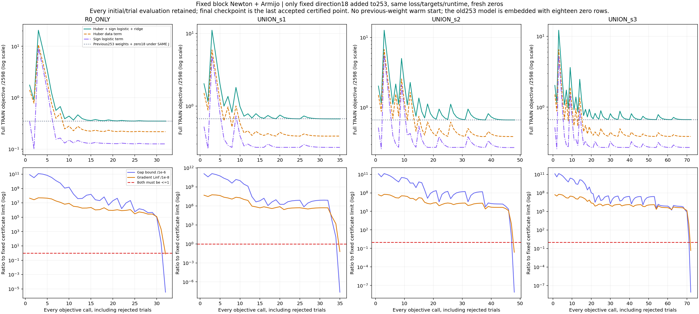
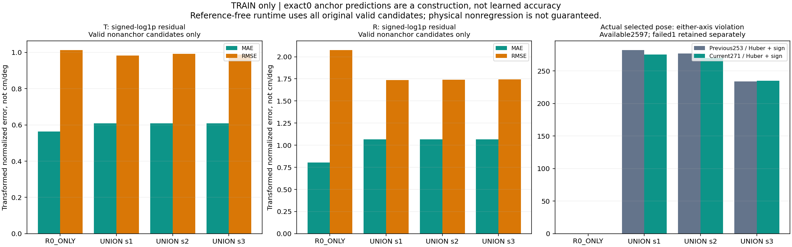
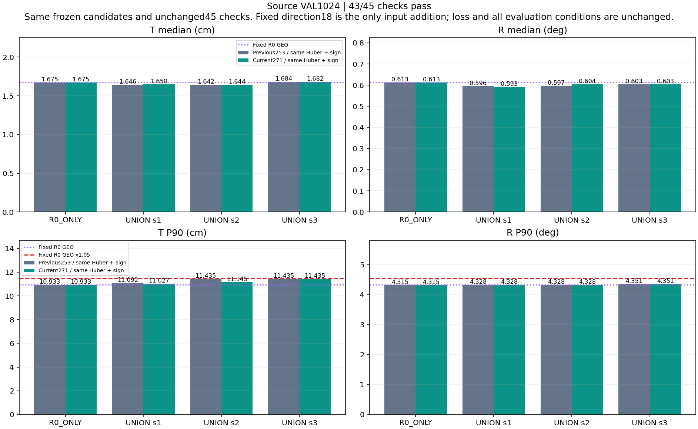
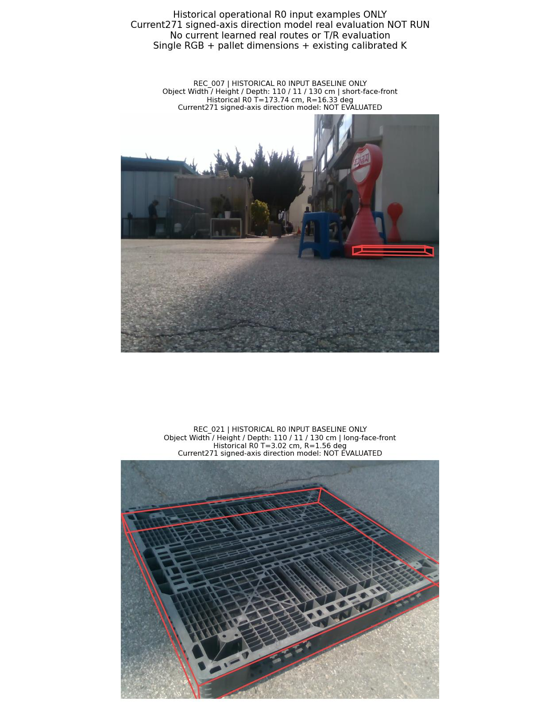
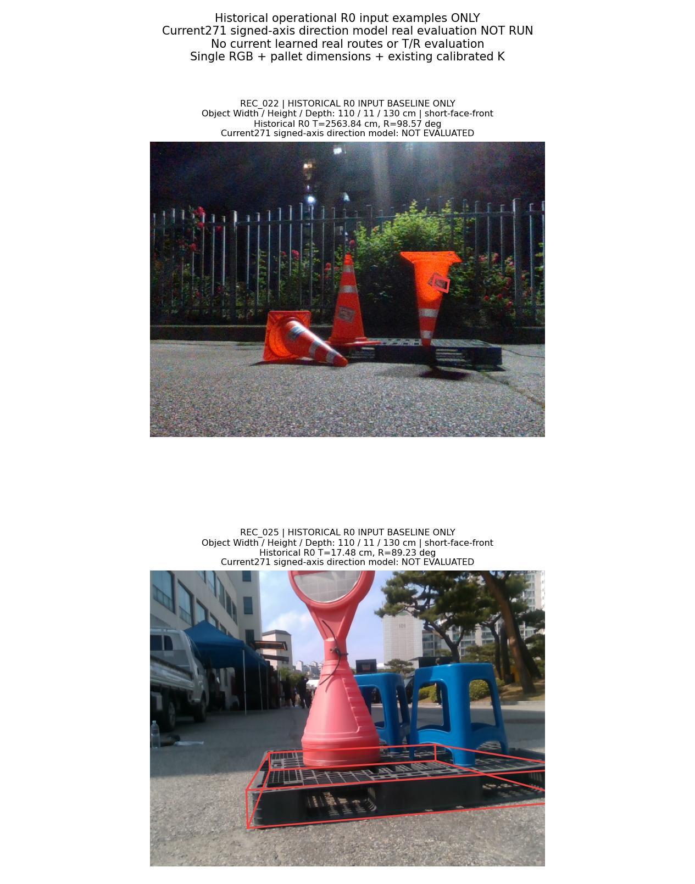
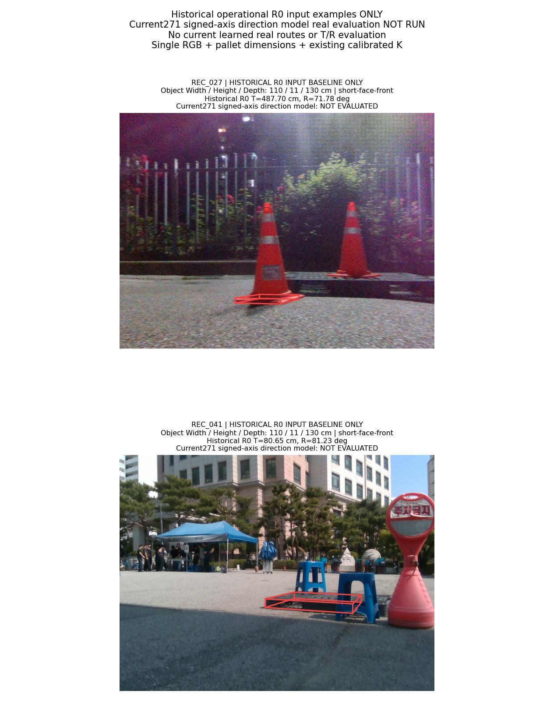

# 고정 잔차 방향18 추가: 253→271 입력 실험

**4개 학습의 수렴 인증은 통과했지만 source 43/45로 실패했습니다. 사전 조건에 따라 이번 모델의 실사 선택·T/R 평가는 미실행이며, 안정적 공동 개선 목표는 달성하지 못했습니다.**

새 zero 초기화로 4개 모델을 학습했습니다. objective 호출 187회와 승인 Newton 반복 60회를 모두 보존했습니다. 바꾼 요인은 입력 18개의 추가뿐이며, 이전 가중치를 이어 학습하지 않았습니다.

운영 입력은 **단일 RGB + 팔레트 치수 + 기존 카메라 보정 K**입니다. 시간 정보, 추가 센서, 새 실사 정답을 넣지 않았습니다. 수렴 인증·source 조건·실사 안정성은 서로 다른 판정입니다.

## 바꾼 입력과 유지한 조건

[직전 253차원 Huber+sign 단계](../pallet_pose_signed_axes_sign_20261001_v1/REPORT_KO.md)는 수렴했으나 source 조건을 통과하지 못했습니다. 뒤이어 실시한 [TRAIN 입력 감사](../pallet_pose_residual_direction_audit_20261001_v1/REPORT_KO.md)는 고정 pose의 투영점과 관측 q9 사이의 x/y 방향 18개 열이 기존 입력의 선형 열공간과 중복되지 않음을 확인했습니다. 그 감사는 성능 개선이나 표현 충분성의 증거가 아니며 새 학습도 하지 않았습니다.

이번에는 그 감사에서 고정한 방향18과 정규화만 추가했습니다. 투영값에서 관측값을 빼고 bbox 대각선으로 나누며, 기존 R0 TRAIN 유효5,194후보의 float32 평균·표준편차를 그대로 사용합니다. 다시 정규화를 선택하거나 RBF를 학습하지 않았습니다. 이미 준비된 source 좌표에 추가 padding도 하지 않습니다.

```text
base253_c = phi253(candidate_c) − phi253(R0 GEO anchor)
d18_c = flatten((project(frozen_pose_c, K) − observed_q9) / bbox_diagonal)
extra18_c = float64(normalize_FP32(d18_c)) − float64(normalize_FP32(d18_anchor))
x271_c = concatenate(base253_c, extra18_c)
e_c = ((T_c − T_anchor)/sT, (R_c − R_anchor)/sR)
y_c = sign(e_c) * log1p(abs(e_c)); prediction_c = x271_c @ W271x2
J = mean_all_2598_frames(mean_original_valid_candidates_and_2_axes(
      Huber(prediction−y, delta=1) + 1{y != 0} softplus(−sign(y)*prediction)))
    + (1e−4/2) * ||W||F²
runtime_score = max(predicted_T_axis, predicted_R_axis)
whole_pose_choice = old_tie_argmin(runtime_score over original valid candidates)
```

기존 raw94·context189·고정RBF64·원래 253차원 차분·타깃·scale·valid mask·TRAIN2,598행은 유지했습니다. 이전 6개 해시는 원래 253차원 의미와 값을 보존하고, 방향 원값·방향 차분·확장 입력의 해시3개를 추가했습니다. invalid 후보와 전체 실패1행은 제거하지 않으며 anchor 입력·타깃은 정확히0입니다. sign 계수1, bias0, λ1e−4, zero 초기화, 최대1,000승인 반복/2,000objective 호출, Armijo 및 두 수렴 조건도 바꾸지 않았습니다.

추론은 정답·margin·safe mask를 읽지 않습니다. 양 축 예측의 최댓값으로 원래 whole pose 하나를 선택하며 anchor에 새 동률 우선권을 주지 않습니다. 예측상 비악화는 실제 T/R 비악화 보장이 아닙니다.

## 실제 학습과 수렴

| 모델 | objective 호출 | 승인 반복 | 최종 J | Huber | Sign logistic | L2 penalty | gradient Linf | gap 상계 |
|---|---:|---:|---:|---:|---:|---:|---:|---:|
| R0_ONLY | 32 | 13 | 0.350751831215 | 0.218209316902 | 0.126375759919 | 0.006166754394 | 7.59337401e-09 | 3.52802015e-12 |
| UNION_s1 | 35 | 12 | 0.664632551248 | 0.385407879011 | 0.269140478960 | 0.010084193277 | 6.06946577e-10 | 2.36263582e-14 |
| UNION_s2 | 48 | 14 | 0.666946001735 | 0.386669353244 | 0.269508050809 | 0.010768597682 | 2.4079548e-10 | 8.25733978e-15 |
| UNION_s3 | 72 | 21 | 0.667821303242 | 0.386660366781 | 0.270399954516 | 0.010760981945 | 4.68626706e-10 | 8.52130019e-15 |

마지막 승인점에서 `||gradient||∞ ≤ 1e−8`와 `||gradient||²/(2λ) ≤ 1e−6`를 함께 요구했습니다. 모든 초기·trial 호출을 기록했고 거절 trial을 마지막 checkpoint로 쓰지 않았습니다. 이 인증은 고정 목적식의 float64 수치 검산이며 구간 연산의 절대 증명이나 T/R 성능 인증은 아닙니다.

| 모델 | 직전253 가중치+zero18의 동일 J | 현재271 가중치의 동일 J | 이전−현재 |
|---|---:|---:|---:|
| R0_ONLY | 0.352123901986 | 0.350751831215 | 0.001372070771 |
| UNION_s1 | 0.667962977981 | 0.664632551248 | 0.003330426733 |
| UNION_s2 | 0.670587373249 | 0.666946001735 | 0.003641371514 |
| UNION_s3 | 0.670432603895 | 0.667821303242 | 0.002611300653 |

이 표는 동일한 loss·타깃·frame 분모에 직전253 가중치와 zero18을 넣은 값과 현재 값을 비교합니다. 이전 네이티브253의 수렴 인증과 확장271의 gradient는 구분합니다. 이전 가중치는 독립 사후 비교에만 사용했고 학습 초기화나 새 정책 탐색에는 쓰지 않았습니다.



## TRAIN 회귀와 실제 선택 진단

| 모델 | nonanchor T MAE | T RMSE | T 부호 정확도 | nonanchor R MAE | R RMSE | R 부호 정확도 | nonanchor 후보 수 |
|---|---:|---:|---:|---:|---:|---:|---:|
| R0_ONLY | 0.563904 | 1.012806 | 0.909511 | 0.804891 | 2.075582 | 0.929919 | 2597 |
| UNION_s1 | 0.608088 | 0.981918 | 0.799512 | 1.066814 | 1.737237 | 0.828135 | 7791 |
| UNION_s2 | 0.608747 | 0.992848 | 0.807470 | 1.065527 | 1.738680 | 0.823899 | 7791 |
| UNION_s3 | 0.608250 | 0.987841 | 0.805031 | 1.068205 | 1.743206 | 0.819407 | 7791 |

MAE/RMSE는 signed-log1p 정규화 공간의 값이며 cm/도 단위가 아닙니다. 정의상 정확히0인 anchor는 위 회귀 표에서 제외했습니다. 전체 후보·실제 선택 후보의 별도 통계와 부호 confusion matrix는 [TRAIN_CONVERGENCE.json](TRAIN_CONVERGENCE.json)에 있습니다.

| 모델 | T 위반 이전→현재 | R 위반 이전→현재 | unsafe 이전→현재 | 안전 개선 이전→현재 | anchor 이전→현재 | 최대 정규화 초과 이전→현재 |
|---|---:|---:|---:|---:|---:|---:|
| R0_ONLY | 0→0 | 0→0 | 0→0 | 8→9 | 2589→2588 | 0.000000→0.000000 |
| UNION_s1 | 204→198 | 151→149 | 282→275 | 211→212 | 2104→2110 | 78.783595→78.783595 |
| UNION_s2 | 191→189 | 163→155 | 277→270 | 191→191 | 2129→2136 | 79.720142→79.720142 |
| UNION_s3 | 164→165 | 127→130 | 234→235 | 144→144 | 2219→2218 | 9.320918→9.771535 |

unsafe는 실제 선택의 T 또는 R가 원래 anchor보다 커진 행입니다. 유효2,597행과 실패1행을 구분하며, TRAIN 개선이나 평균 loss 감소만으로 source·실사 안정성을 대신하지 않습니다.



## source VAL 전체 결과

현재 **43/45**, 직전253은 **43/45**입니다. 각 모델의 원래1,024행을 유지했습니다. 서로 다른 입력으로 새로 학습한 R0_ONLY도 비교군으로 바뀌므로 pass 개수만으로 전체 성능 우열을 정하지 않습니다. 고정 R0_GEO와 세 DIVERSE_GEO의 수치는 직전과 동일함을 확인했습니다.

| 모델 | T 중앙값 cm | R 중앙값 ° | T P90 cm | R P90 ° | 실패 |
|---|---:|---:|---:|---:|---:|
| R0_ONLY | 1.674594 | 0.613334 | 10.932544 | 4.315199 | 0 |
| UNION_s1 | 1.650298 | 0.592584 | 11.027495 | 4.328168 | 0 |
| UNION_s2 | 1.644266 | 0.603744 | 11.145026 | 4.328168 | 0 |
| UNION_s3 | 1.682087 | 0.603443 | 11.434707 | 4.350842 | 0 |
| R0_GEO | 1.674594 | 0.613334 | 10.932544 | 4.328168 | 0 |
| DIVERSE251_s1_GEO | 1.818474 | 0.805513 | 19.343094 | 79.453475 | 0 |
| DIVERSE251_s2_GEO | 1.900040 | 0.775323 | 18.537749 | 73.676611 | 0 |
| DIVERSE251_s3_GEO | 2.051196 | 0.765877 | 18.074773 | 38.153661 | 0 |

각 UNION seed는 새 R0_ONLY·고정 R0_GEO·paired DIVERSE_GEO와 비교합니다. 두 중앙값은 엄격히 감소, 각 P90은1.05배 이하, 실패는 증가하지 않아야 하며 총45조건 모두를 요구합니다. 평균 또는 가장 좋은 seed로 실패 조건을 대체하지 않습니다.



실패 조건은 다음과 같습니다.

- `UNION_s3/R0_ONLY/translation_cm_median_strict`
- `UNION_s3/R0_GEO/translation_cm_median_strict`

[고정 source 선택 진단](SOURCE_FIXED_CHOICE_DIAGNOSTIC_KO.md)에서 UNION seed1/2/3의 선택은 직전 대비 36/31/25행 바뀌었습니다. anchor 대비 두 축이 모두 비악화이고 한 축 이상이 개선된 safe 선택은 41/47/33→42/43/34, 한 축 이상 악화된 unsafe 선택은 111/109/105→108/106/101였습니다. unsafe 수는 세 seed에서 줄었지만 seed2의 safe도 줄었고, seed3의 unsafe 정규화 초과 최댓값은 5.120580→29.334076로 커졌습니다. 이는 안정적 공동 개선 성공이 아닙니다.

이 비교는 이미 고정한 선택·오류·축 예측의 집계입니다. 모든 계수를 함께 다시 학습했으므로 바뀐 선택을 추가18계수만의 인과효과로 분리하지 않습니다. 부분 후보에서 찾은 기회 하한을 전체 후보 oracle로 해석하지 않으며, 진단의 후속 목적식 제안은 미실행입니다. 진단 산출물 저장 후 마지막 출력 로그가 파일 접근 제한으로 중단된 경위와 산출물 검증은 [실행 기록](EXECUTION_KO.md)에 보존합니다.

## 실사 미실행과 역사적 R0 입력 사진

**현재271 모델의 실사 T/R 효과는 미측정입니다.** [미실행 영수증](REAL_EVALUATION_NOT_RUN_KO.md)은 current learned route·실사 metric 산출물의 부재를 확인합니다.

아래 실제 RGB6장은 이전에 고정했던 동일한 입력 예시이며 **빨간 pose와 T/R는 역사적 R0 결과만** 표시합니다. 현재 모델의 성능 그림이 아닙니다. 과거 촬영별 R0 T가 가장 컸던 사례이므로 대표 표본도 아닙니다.

**110 × 11 × 130 cm는 물리 Width110 / Height11 / Depth130 cm**입니다. 원본 이미지·물리 치수·기존 K를 유지하고, W/D 가설의 camera-facing `cf_extents`와 원래 치수를 구분했습니다.







[GALLERY_SELECTION.json](GALLERY_SELECTION.json)에 원본 RGB SHA·크기·치수·K·pose·투영좌표를 저장했습니다. 보고서는 저장된 pose를 표시하며 새 PnP·이미지 추론·물리 오차 계산을 하지 않습니다.

## 검산·자료·한계

- [설계](DESIGN_KO.md) · [학습 계약](TRAIN_PROTOCOL.json) · [사전 검산](PREFIT_REVIEW_KO.md) · [실행 기록](EXECUTION_KO.md)
- [독립 TRAIN 검산](TRAIN_CONVERGENCE_KO.md) · [독립 source 검산](SOURCE_VAL_VERIFICATION_KO.md)
- [source 전체8,192행](SOURCE_VAL_FRAME_RESULTS.csv) · [45개 조건](SOURCE_VAL_CHECKS.csv) · [objective 187행](TRAINING_OBJECTIVE_LOG.csv) · [승인 반복 60행](TRAINING_ITERATION_LOG.csv)
- [271×2 최종 파라미터4개](model_parameters/) · [그림·수치·SHA](REPORT_DATA.json) · [공개 검산](PUBLIC_REVIEW_KO.md) · [공개 manifest](PUBLICATION_MANIFEST.json)
- [학습 코드](../../../scripts/research/pallet_pose_signed_axes_direction_20261001_v1/convex_train.py) · [방향 입력 코드](../../../scripts/research/pallet_pose_signed_axes_direction_20261001_v1/direction_features.py) · [source 평가 코드](../../../scripts/research/pallet_pose_signed_axes_direction_20261001_v1/evaluate_source.py) · [실사 평가 코드](../../../scripts/research/pallet_pose_signed_axes_direction_20261001_v1/evaluate_real.py) · [보고서 코드](../../../scripts/research/pallet_pose_signed_axes_direction_20261001_v1/report.py)

source VAL과 실사 DEV는 이전 방법에서도 반복 사용했습니다. refiner의 source 노출과 selector TRAIN/VAL/TEST 중복105/26/26건, 교사 계보의 기존 이미지9장·수동 코너38개를 독립 시험 결과로 바꾸지 않습니다. 실사 pose 참조도2D 주석·K·치수에서 유도했으며 독립 장비로 측정한6D GT가 아닙니다.

방향18은 기존 예측과 pose로 만든 입력이며 독립적인 새 RGB 관측이 아닙니다. 입력 감사의 비중복성, 강볼록 목적식의 수렴, TRAIN 회귀 변화가 전이 성공을 보장하지 않습니다. 이번 단일 비교의 결과로 표현·데이터 지원범위·감독 가운데 유일한 원인을 확정하지 않습니다.
