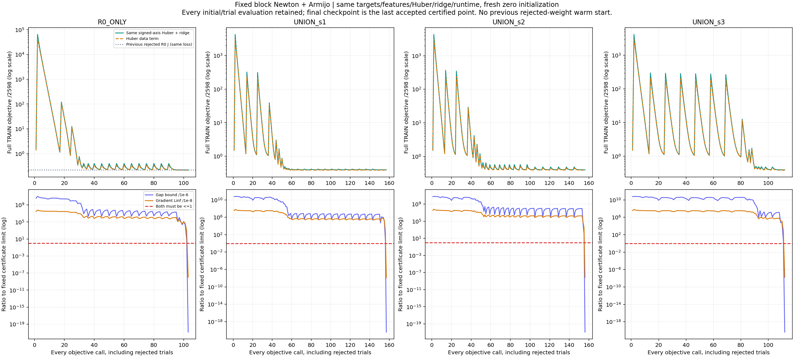
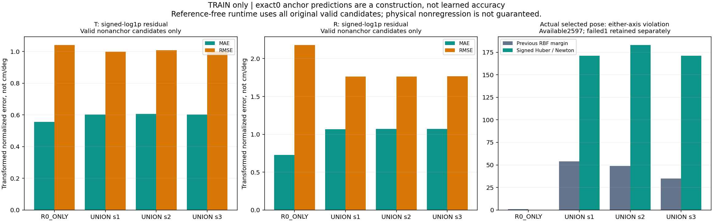
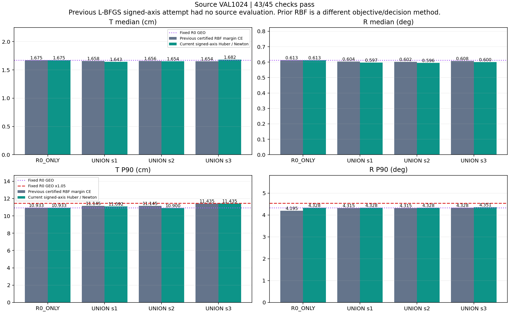
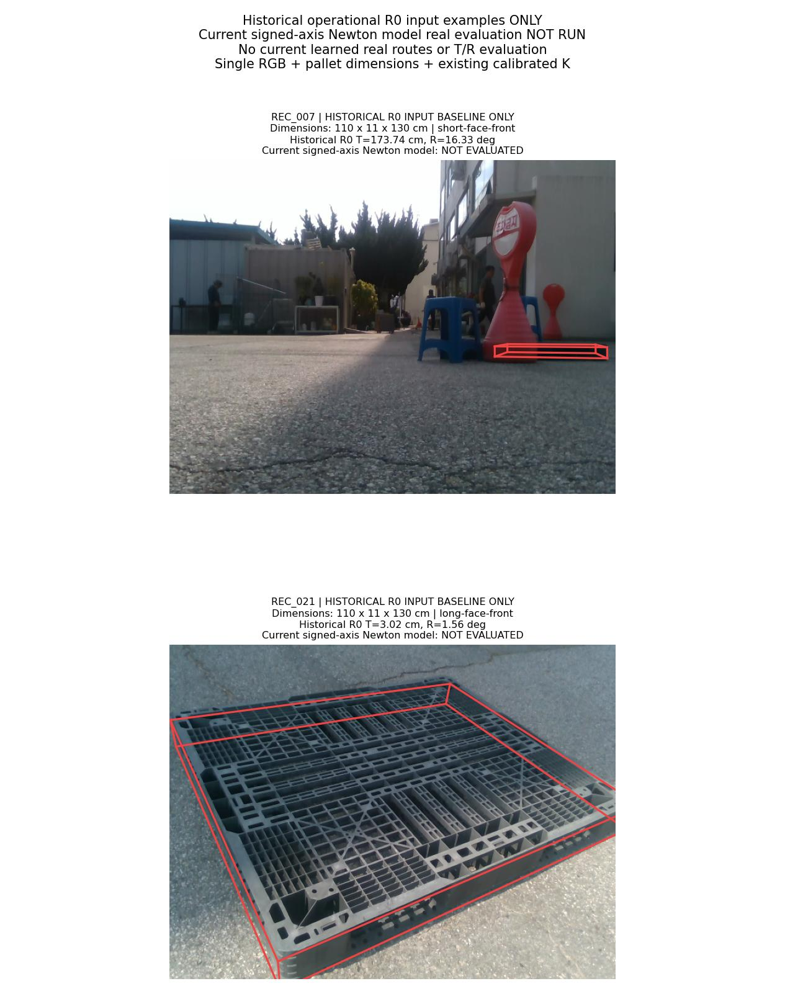
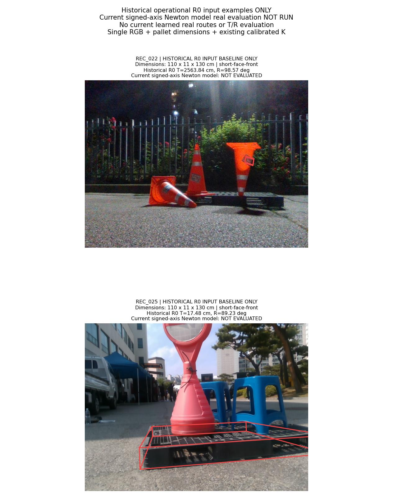
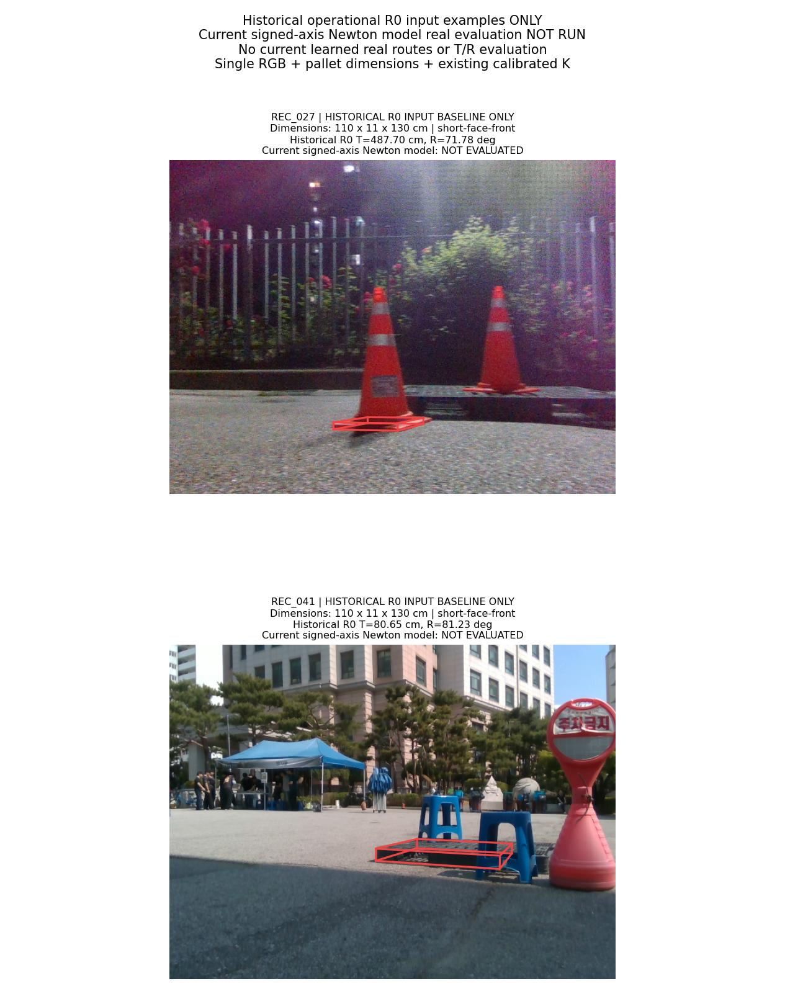

# Signed T/R Newton: 수렴은 통과, source 검증은 실패

**네 모델의 수렴 인증은 통과했지만, source 검증은 45개 중 43개 통과·2개 실패입니다.** 사전 조건을 모두 만족하지 않아 현재 모델의 실사 선택·T/R 평가를 실행하지 않았습니다. 안정적인 T·R 공동 개선 목표는 여전히 미달성입니다.

이번 실제 학습은 **새로운 zero 초기화4회**, objective 호출528회·승인된 Newton 반복94회입니다. [직전 L-BFGS 시도](../pallet_pose_signed_axes_20261001_v1/REPORT_KO.md)의 거부 파라미터로 이어서 학습하지 않았습니다. 최적화기의 수렴 문제를 해결했다는 증거와, source·실사 정확도 검증은 분리합니다.

운영 입력은 **단일 RGB + 팔레트 치수 + 기존 카메라 보정 K**입니다. 시간 정보·새 센서·새 실사 정답은 추가하지 않았습니다. 아래6장은 동일한 원본 실제 입력을 보여주는 이전 R0 예시이며 이번 모델의 실사 결과가 아닙니다.

## 변경 범위: 목적함수는 같고 최적화기만 변경

직전 signed-axis 구현의 objective·Hessian·anchor 차분·signed target·추론8개 함수가 AST 기준으로 동일함을 사전 검산했습니다. raw94 정규화, context189+고정RBF64, 이전 TRAIN 입력으로 정한 센터64개와 폭, 후보·valid mask·기존 TRAIN2598행·물리적 T/R 참조·scale·λ를 유지했습니다. 변경은 두 축의 SPD Hessian block을 푸는 generalized Newton과 고정 Armijo backtracking입니다. [설계](DESIGN_KO.md)와 [프로토콜](TRAIN_PROTOCOL.json)은 실제 fit 전에 봉인했습니다.

```text
x_c = phi253(candidate_c) − phi253(R0 GEO anchor)
e_c = [(T_c − T_anchor)/sT, (R_c − R_anchor)/sR]
target_c = sign(e_c) * log1p(abs(e_c))
prediction_c = x_c @ W; W shape=(253,2); bias=0
J = mean_all2598[mean_valid_candidates_and_2axes Huber(prediction_c−target_c, delta=1)]
    + (lambda/2)||W||_F²
sT=2.4636887551191258 cm; sR=1.113474019956766 deg; lambda=1e-4
runtime: choose whole pose minimizing max(predicted T change, predicted R change)
```

모든 후보가 실패한1행은 데이터 손실0으로 전체2598행 분모에 남습니다. 유효·유한 쌍에만 차분을 계산하며 anchor의 target/feature difference는0입니다. 추론은 원래 모든 유효 후보를 비교하고 실제 T/R 참조·TRAIN margin·GT-safe mask를 사용하지 않습니다. anchor 예측0과 선택 점수≤0은 예측 공간의 성질이며 실제 양축 비악화를 보장하지 않습니다. 동률은 원래 R0→가설명 순서를 유지합니다.

각 Newton 방향은 두 개의253×253 SPD block을 Cholesky로 풀었습니다. Huber 잔차가 정확히±1이면 데이터 곡률0에 기존λI만 더하는 고정 generalized Hessian 규칙을 씁니다. alpha1에서 시작해0.5씩 줄이며 c1=1e−4 Armijo 조건을 적용했습니다. damping·warm start·재시작·step 탐색 정책 변경·예산 확대는 없습니다. 초기 평가와 거부된 모든 trial도2000회 한도에 포함하고 승인된 반복은1000회 이내로 제한했습니다.

## 실제 학습과 수렴 인증

| 모델 | objective 호출 | 승인 반복 | 거부 trial | Huber | J | gradient Linf | gap 상한 |
|---|---:|---:|---:|---:|---:|---:|---:|
| R0_ONLY | 103 | 22 | 80 | 0.216026019 | 0.220022577 | 1.090e-16 | 1.626e-27 |
| UNION_s1 | 157 | 27 | 129 | 0.386049295 | 0.394591254 | 1.043e-16 | 2.717e-27 |
| UNION_s2 | 156 | 26 | 129 | 0.387978628 | 0.396978862 | 1.301e-16 | 1.852e-27 |
| UNION_s3 | 112 | 19 | 92 | 0.386856372 | 0.396047982 | 2.046e-16 | 5.443e-27 |

모든 최종 모델은 optimizer 성공과 `gradient Linf≤1e−8`, `||gradient||²/(2λ)≤1e−6`을 만족했습니다. 최종 checkpoint는 마지막 승인 지점이며, 거부된 탐색 trial이나 가장 좋아 보이는 중간 반복을 고른 것이 아닙니다. 독립 검산은 초기/최종 목적함수·기울기·506×506 Hessian과 모든 trace의 count·Armijo 산술·선택된 지점 연결을 확인했습니다. 저장하지 않은 중간 가중치와 Newton 방향까지 독립 재계산했다는 주장은 하지 않습니다.

| 같은 R0_ONLY Huber 목적함수 비교 | 직전 L-BFGS 거부 상태 | 이번 zero-init Newton 인증 상태 |
|---|---:|---:|
| J | 0.220023167575816 | 0.220022576571307 |
| gradient-gap 상한 | 0.000181007602637057 | 1.34719512474751e-27 |
| 호출 / 반복 | 1108 / 1000 | 103 / 22 |

같은 J의 감소량은 약 **5.91004508582e-07**입니다. 직전 gap 상한1.81e−4가 실패했다는 사실은 실제 최적값과의 차이가1e−6보다 컸다는 증명이 아니며, 이번 작은 J 차이와 모순되지 않습니다. 수치 인증은 float64로 계산한 gradient에 근거하며, 아주 작은 보고 상한을 부동소수점 오차까지 포함하는 엄밀한 interval 최적성 증명으로 해석하지 않습니다.



위 그래프는 초기 평가와 모든 Armijo trial을 포함합니다. 위 행은 큰 거부 trial과 작은 최종 J를 함께 볼 수 있도록 로그 축을 사용합니다. 아래 행은 gap과 gradient Linf를 각각 자신의 한계로 나눈 비율이므로 두 곡선 모두1 이하이어야 합니다. **이전 RBF margin CE와 이번 Huber loss의 값은 직접 비교하지 않습니다.** R0에만 표시한 이전 수평선은 동일한 signed Huber 목적함수의 거부 상태입니다.

## TRAIN의 두 축 회귀와 실제 선택

| 모델 | 비-anchor 후보 수 | T MAE | T RMSE | T 부호 정확도 | R MAE | R RMSE | R 부호 정확도 |
|---|---:|---:|---:|---:|---:|---:|---:|
| R0_ONLY | 2597 | 0.555766 | 1.041547 | 90.720% | 0.727744 | 2.180201 | 92.799% |
| UNION_s1 | 7791 | 0.603477 | 0.999442 | 79.682% | 1.068557 | 1.764764 | 81.658% |
| UNION_s2 | 7791 | 0.605806 | 1.009189 | 79.977% | 1.070961 | 1.765318 | 81.337% |
| UNION_s3 | 7791 | 0.602772 | 1.002716 | 79.977% | 1.070295 | 1.767804 | 81.158% |

MAE/RMSE는 signed-log1p 정규화 target 공간의 값이며 cm/degree가 아닙니다. anchor는 구성상 target과 예측이 항상0이므로 이 표에서는 제외했습니다. 부호 정확도의 높은 수치만으로 드문 안전 개선 후보를 잘 찾는다고 결론내릴 수 없습니다. true negative/zero/positive별 혼동행렬과 실제 선택 후보만의 회귀 오차도 [TRAIN 원자료](TRAIN_CONVERGENCE.json)에 보존했습니다.

| 모델 | T 위반 이전→현재 | R 위반 이전→현재 | 한 축 이상 위반 이전→현재 | 안전 개선 이전→현재 | anchor 선택 이전→현재 |
|---|---:|---:|---:|---:|---:|
| R0_ONLY | 1 → 0 | 1 → 0 | 1 → 0 | 21 → 4 | 2575 → 2593 |
| UNION_s1 | 41 → 124 | 22 → 89 | 54 → 171 | 92 → 135 | 2451 → 2291 |
| UNION_s2 | 37 → 131 | 28 → 107 | 49 → 183 | 85 → 120 | 2463 → 2294 |
| UNION_s3 | 25 → 119 | 18 → 94 | 35 → 171 | 56 → 106 | 2506 → 2320 |

이전 비교 대상은 실제 인증됐던 RBF margin 모델이며, 실패한 signed L-BFGS 상태의 선택/T/R는 계산하지 않았습니다. 위반은 해당 행의 실제 선택 오차가 운영 R0 anchor보다 커진 경우입니다. 유효2597행과 실패1행을 구분하고, 전체2598행 분모도 유지합니다. 안전 개선과 한 축 이상 악화가 함께 늘 수 있으므로 개선 수 하나만 성공으로 해석하지 않습니다.



## source VAL: 43/45, 전체 gate FAIL

고정된1024행을 모두 평가했습니다. UNION 세 seed 각각을 학습된 R0_ONLY·고정 R0 GEO·짝지은 DIVERSE GEO와 비교하며 양축 중앙값 엄격 개선·P90의5% 이내 보존·실패 수 비증가를 요구합니다. 모든45개가 통과해야 실사 routing을 허용하는 기존 규칙을 유지했습니다.

| 모델 | T 중앙값 cm | R 중앙값 ° | T P90 cm | R P90 ° | 실패 |
|---|---:|---:|---:|---:|---:|
| R0_ONLY | 1.674594 | 0.613334 | 10.932544 | 4.328168 | 0 |
| UNION_s1 | 1.642545 | 0.597255 | 11.091849 | 4.328168 | 0 |
| UNION_s2 | 1.653925 | 0.595754 | 10.899587 | 4.328168 | 0 |
| UNION_s3 | 1.682087 | 0.599713 | 11.434707 | 4.350842 | 0 |
| R0_GEO | 1.674594 | 0.613334 | 10.932544 | 4.328168 | 0 |
| DIVERSE251_s1_GEO | 1.818474 | 0.805513 | 19.343094 | 79.453475 | 0 |
| DIVERSE251_s2_GEO | 1.900040 | 0.775323 | 18.537749 | 73.676611 | 0 |
| DIVERSE251_s3_GEO | 2.051196 | 0.765877 | 18.074773 | 38.153661 | 0 |

실패 조건은 다음과 같습니다.

- `UNION_s3/R0_ONLY/translation_cm_median_strict`
- `UNION_s3/R0_GEO/translation_cm_median_strict`

seed3 T 중앙값은 1.682086665cm이며, R0_ONLY 1.674594149cm와 R0_GEO 1.674594149cm보다 엄격히 작지 않아 두 비교가 실패했습니다. 나머지 조건이 통과해도 이 gate를 성공으로 간주하지 않습니다.



이전 signed L-BFGS 단계는 source 미평가였으므로 그 단계와 정확도 비교값은 없습니다. 그림의 이전 수치는 별도의 RBF margin 방법입니다. R0_ONLY도 새 목표로 다시 학습되므로 pass 수나 학습된 control 변화만으로 전체 우월성을 주장하지 않고 고정 R0_GEO를 함께 표시했습니다.

## 고정 source 선택에서 확인된 한계

[실패 원인 진단](SOURCE_TRANSFER_DIAGNOSTIC_KO.md)은 기존 고정 선택·예측·오차만 비교했으며 새 argmin 정책이나 실사 평가를 실행하지 않았습니다. 연속 회귀의 수렴과 실제 양축 보존이 같지 않다는 점을 다음 관측에서 확인할 수 있습니다.

| 모델 | 안전 개선 이전 RBF→현재 | unsafe 이전 RBF→현재 | 현재 anchor 유지 | 알려진 기회 | 놓친 기회 하한 |
|---|---:|---:|---:|---:|---:|
| UNION_s1 | 15 → 30 | 24 → 72 | 922 | 226 | 196 |
| UNION_s2 | 14 → 33 | 26 → 72 | 919 | 238 | 205 |
| UNION_s3 | 14 → 26 | 18 → 73 | 925 | 219 | 193 |

safe 개선은 양축 모두 anchor 이하이며 최소 한 축이 엄격히 좋아진 경우입니다. 개선 수와 함께 unsafe 선택도 증가했습니다. 알려진 기회·miss는 **이미 채점된 일부 후보 캐시가 증명하는 하한**이며 전체 네 후보 pool의 recall이나 전체 false-negative 수가 아닙니다. 새로운 oracle나 누락 후보의 오차를 계산하지 않았습니다.

현재 R0_ONLY는 source1024행에서 anchor1023개와 안전 개선1개를 선택했습니다. R0_GEO와 중앙값이 같아도 전체 오차 배열이 동일한 것은 아닙니다. UNION에서 W/D 분기를 바꾼 선택은 seed별2/0/1개였고 대부분 같은 분기에서 expert를 바꾼 경우입니다. 표현·감독 손실·합성 지원범위 가운데 유일한 원인을 이 관측만으로 확정할 수 없습니다.

진단 문서에는 같은 두 축 Huber에 물리 변화 sign의 logistic 보조항을 추가하는 단일 TRAIN 비교를 **미실행 제안**으로 남겼습니다. 이번 보고서의 성과가 아니며 구현·학습·새 routing을 실행하지 않았습니다. 과거 분류·회귀 혼합 및 상대 이득 학습의 음성 선행도 유지했습니다.

## 실사 평가 미실행과 같은 실제 입력 사진

**현재 Newton 모델의 실사 learned 선택·T/R 채점·5범주 안정성 판정은 미실행입니다.** [실사 미실행 영수증](REAL_EVALUATION_NOT_RUN_KO.md)에 새 REAL_PROTOCOL·선택·실사 결과의 부재를 기록했습니다. 과거 oracle나 RBF 실사 결과를 이번 모델 성능으로 재사용하지 않았습니다.

아래6장은 이전에 고정한 같은 실제 RGB와 원본 치수입니다. `110 × 11 × 130 cm`를 포함한 치수·기존 K를 보여주며, 빨간 선과 T/R는 **이전 운영 R0 baseline만** 표시합니다. 현재 모델의 실사 그림이 아닙니다. 각 자연 촬영에서 과거 R0 T 오차가 가장 컸던 예시여서 대표 표본이나 이번 성능의 근거로 볼 수 없습니다.







이미지6장·K·치수·R0 pose6개·투영좌표·이전 수치 출처는 [갤러리 원자료](GALLERY_SELECTION.json)에 연결했습니다. 새 이미지 forward·PnP·실사 참조 계산은0회입니다. 직전 [실제로 측정된 RBF 실사 결과](../pallet_pose_anchor_rbf_20261001_v1/REPORT_KO.md)도 안정적인 T·R 공동 개선은 미달성이었으며, 이번 source 실패와는 별도 기록입니다.

## 검산 자료와 해석의 범위

- [사전 설계](DESIGN_KO.md), [학습 계약](TRAIN_PROTOCOL.json), [입력·목적식·solver 독립 사전 검산](PREFIT_REVIEW_KO.md)
- [TRAIN 독립 수렴·선택·회귀 검산](TRAIN_CONVERGENCE_KO.md), [source 독립 검산](SOURCE_VAL_VERIFICATION_KO.md), [실사 미실행 확인](REAL_EVALUATION_NOT_RUN_KO.md)
- [source8192행 CSV](SOURCE_VAL_FRAME_RESULTS.csv), [45개 조건 CSV](SOURCE_VAL_CHECKS.csv), [objective528행 CSV](TRAINING_OBJECTIVE_LOG.csv), [승인 반복94행 CSV](TRAINING_ITERATION_LOG.csv)
- [인증 checkpoint4개](model_parameters/), [그림·데이터 SHA 연결](REPORT_DATA.json), [공개물 독립 검산](PUBLIC_REVIEW_KO.md), [공개 SHA 목록](PUBLICATION_MANIFEST.json)
- [Newton 학습 코드](../../../scripts/research/pallet_pose_signed_axes_newton_20261001_v1/convex_train.py), [source 평가 코드](../../../scripts/research/pallet_pose_signed_axes_newton_20261001_v1/evaluate_source.py), [미실행 실사 평가 코드](../../../scripts/research/pallet_pose_signed_axes_newton_20261001_v1/evaluate_real.py), [보고서 생성 코드](../../../scripts/research/pallet_pose_signed_axes_newton_20261001_v1/report.py)

source VAL과 실사 DEV는 이전 방법들에서 반복 사용됐고, refiner의 기존 source 노출과 selector TRAIN/VAL/TEST 중복105/26/26건이 있어 독립 일반화 시험이라고 주장하지 않습니다. 교사 계보에는 기존 이미지9장의 수동 코너38개가 포함됩니다. 이번 새 실사 정답 학습은0개이며, 기존 실사 pose 참조는2D 주석·K·치수로 만든 것으로 독립 장비의6D 실측 정답이 아닙니다.

R0_ONLY는 결정론적 fit 하나이고 UNION 세 모델은 서로 다른 기존 frozen refiner seed의 후보를 사용합니다. 네 fit을 네 독립 데이터 반복 시험으로 해석하지 않습니다. 이번에는 동일 loss의 수렴 문제를 해결했지만 source의 모든 사전 조건을 만족하지 못했습니다. 현재 모델의 실사 T/R 효과는 측정되지 않았으며 원래 안정성 목표는 미달성입니다.
