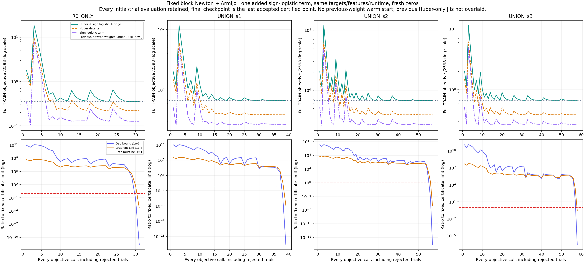
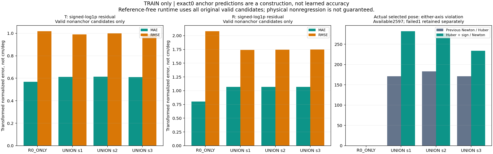
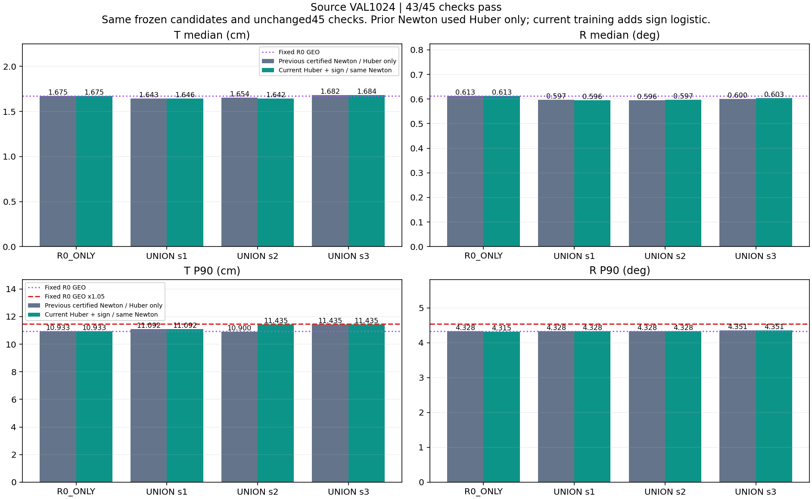
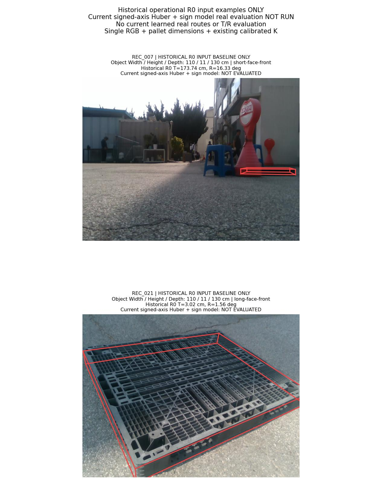
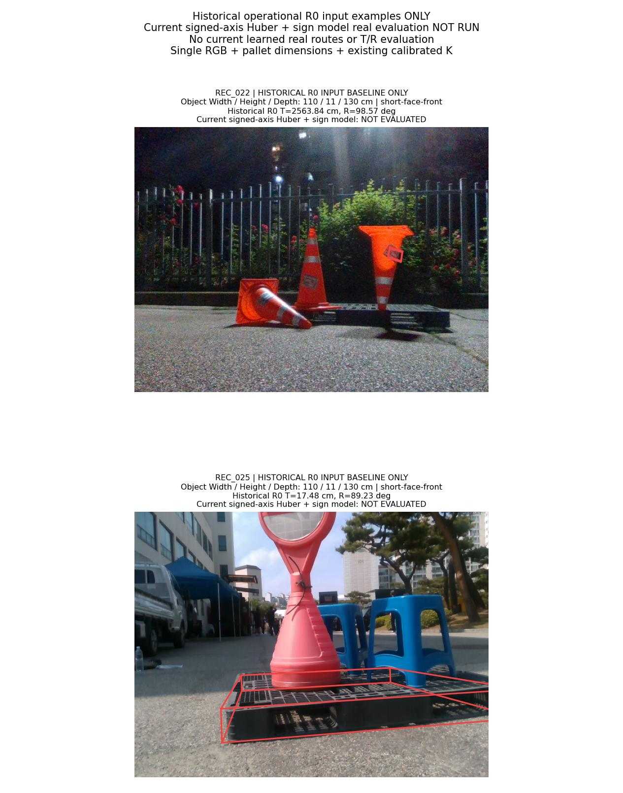
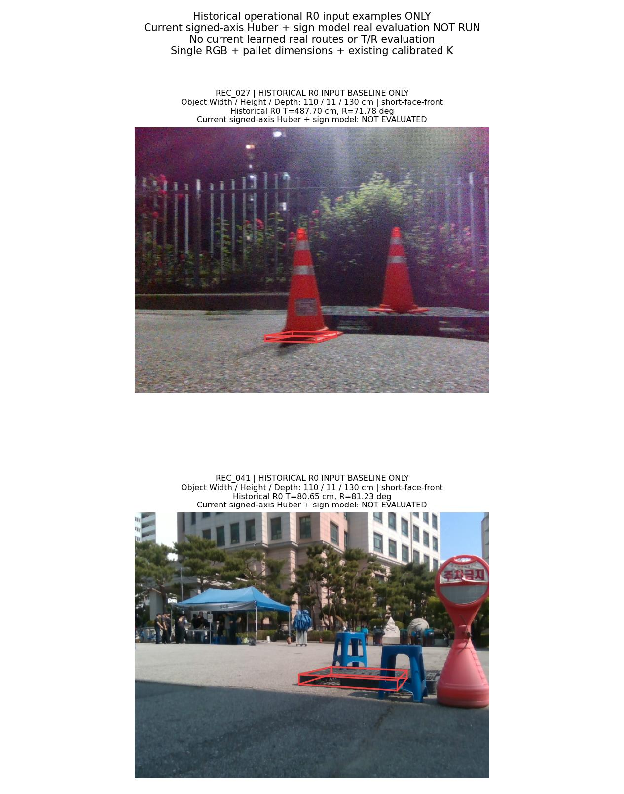

# 두 축 Huber + sign logistic: 실제 학습·평가 결과

**수렴 인증4개는 통과했지만 source는43/45로 실패했습니다. 사전 규칙에 따라 이번 모델의 실사 선택·T/R 평가를 실행하지 않았고, 안정적 공동 개선 목표는 미달성입니다.**

실제 학습은 새 zero 초기화4회, objective 호출185회, 승인된 Newton 반복60회입니다. 모든 초기·Armijo trial을 기록했고 이전 가중치를 warm start로 쓰지 않았습니다. 이번에 바꾼 것은 TRAIN sign 보조 손실 한 항입니다.

운영 입력은 **단일 RGB 이미지 + 팔레트 치수 + 기존 카메라 보정 K**입니다. 시간 정보·새 센서·새 실사 정답은 추가하지 않았습니다. 수렴, source 검증, 실사 안정성은 각각 별도 판정입니다.

## 바꾼 것과 유지한 것

직전 [signed-axis Newton](../pallet_pose_signed_axes_newton_20261001_v1/REPORT_KO.md)은 네 목적식의 수렴을 인증했지만 source43/45로 실패했습니다. 고정 선택 진단에서 안전 개선과 unsafe 선택이 함께 늘었고, TRAIN에서도 두 물리 축의 부호 오류가 남았습니다. 이 관측만으로 표현력·합성 지원범위·손실 가운데 유일 원인을 확정하지 않습니다. 이번에는 연속 크기 감독을 유지하면서 운영의0 경계에 부호 감독을 더하는 한 비교를 사전에 고정했습니다.

raw94 정규화, context189+고정RBF64, 센터64개와 폭, 후보 pose·valid mask·TRAIN2598행·anchor·물리 T/R 참조와 scale, 두 축253×2 가중치·bias0·λ1e−4, Newton/Armijo 예산과 runtime은 유지했습니다. [설계](DESIGN_KO.md)·[프로토콜](TRAIN_PROTOCOL.json)은 실제 fit 전에 봉인했습니다.

```text
x_c = phi253(candidate_c) − phi253(R0 GEO anchor)
e_c = [(T_c−T_anchor)/sT, (R_c−R_anchor)/sR]
y_c = sign(e_c) * log1p(abs(e_c)); p_c = x_c @ W
L_c,axis = Huber(p_c,axis−y_c,axis, delta=1)
         + 1{y_c,axis!=0} * softplus(−sign(y_c,axis)*p_c,axis)
J = mean_all2598[mean_original_valid_candidates_and_2axes L] + (1e−4/2)||W||²
sign coefficient=1; W shape=(253,2); bias=0
sT=2.4636887551191258 cm; sR=1.113474019956766 deg
runtime: choose whole pose minimizing max(predicted T change,predicted R change)
```

target가 정확히0이면 logistic 항 전체를 제외하므로 log2 상수도 남기지 않습니다. 원래 유효 후보×2축 분모를 그대로 사용하며 nonzero sign 개수로 재정규화하지 않습니다. 모든 후보가 실패한1행은 데이터 손실0으로 전체2598행 분모에 남습니다. 계수·threshold·margin·seed를 source VAL에서 탐색하지 않았습니다.

추론 출력은 혼합 손실로 학습한 signed-axis 점수이며 cm/degree 오차나 보정된 확률이 아닙니다. 추론에는 실제 T/R 오차·sign 정답·TRAIN margin·GT-safe mask를 넣지 않습니다. anchor 예측0과 선택 점수≤0은 예측 공간의 성질이며 실제 물리오차 비증가의 증명이 아닙니다. 정확 동률은 원래 R0→가설명 순서를 유지합니다.

## 실제 수렴 인증과 손실 성분

solver는 이전과 같은 block generalized Newton + Armijo(alpha1, 반감0.5, c1=1e−4)이며 한 fit당 초기 포함 최대2000호출·승인1000반복입니다. Huber kink에서는 Huber 곡률만0이고 logistic 곡률과λI는 유지합니다. 봉인 후 목적식·규제·후보를 바꾸거나 예산을 확장·재시작하지 않고 마지막 승인 지점을 인증합니다.

| 모델 | 호출 | 승인 반복 | Huber | Sign logistic | L2 | 새 J | gradient Linf | gap 상한 |
|---|---:|---:|---:|---:|---:|---:|---:|---:|
| R0_ONLY | 31 | 11 | 0.219129014 | 0.127047809 | 0.005947079 | 0.352123902 | 4.663e-12 | 2.172e-18 |
| UNION_s1 | 39 | 13 | 0.387551164 | 0.270181855 | 0.010229959 | 0.667962978 | 1.379e-13 | 6.391e-22 |
| UNION_s2 | 57 | 19 | 0.389282648 | 0.270574980 | 0.010729746 | 0.670587373 | 2.185e-15 | 7.572e-25 |
| UNION_s3 | 58 | 17 | 0.388112477 | 0.271336860 | 0.010983267 | 0.670432604 | 2.763e-09 | 2.609e-13 |

모든 최종 모델에 optimizer 성공, `gradient Linf≤1e−8`, `||gradient||²/(2λ)≤1e−6`을 요구했습니다. 독립 Torch64 autograd·506×506 Hessian·scalar target 재구성은 실행 코드와 일치했습니다. 초기/모든 trial의 count·Armijo 산술·accepted 상태 연결을 확인했으며, 저장하지 않은 모든 중간 가중치까지 독립 재계산했다는 주장은 하지 않습니다. 매우 작은 float64 gap 값을 반올림 오차를 포함한 interval 인증으로 해석하지 않습니다.

| 모델 | 이전 Newton 가중치의 같은 새 J | 현재 가중치의 새 J | 감소 |
|---|---:|---:|---:|
| R0_ONLY | 0.357646153 | 0.352123902 | 0.005522251 |
| UNION_s1 | 0.671792298 | 0.667962978 | 0.003829320 |
| UNION_s2 | 0.674244713 | 0.670587373 | 0.003657339 |
| UNION_s3 | 0.674083924 | 0.670432604 | 0.003651320 |

위 비교는 **두 고정 가중치에 동일한 새 Huber+sign+ridge**를 평가한 값입니다. 과거 보고서에 적힌 Huber-only J와 새 J를 직접 비교하지 않습니다. 원래 Huber-only 목적식과 인증값은 TRAIN JSON에서 별도 provenance로 남겼습니다. 동일 J가 줄어도 T/R 안정성의 보장은 아닙니다.



위쪽 곡선은 초기·거부된 trial까지 모두 포함하며 로그 축입니다. 회색 선은 이전 Newton 가중치를 **새 J**로 평가한 값입니다. 아래쪽은 gap과 gradient Linf를 각 한계로 나눈 비율로, 두 곡선 모두1 이하여야 합니다.

## TRAIN의 회귀 부호와 실제 선택

| 모델 | 비-anchor 후보 수 | T MAE | T RMSE | T 부호 정확도 | R MAE | R RMSE | R 부호 정확도 |
|---|---:|---:|---:|---:|---:|---:|---:|
| R0_ONLY | 2597 | 0.567928 | 1.018384 | 90.874% | 0.803903 | 2.081112 | 92.953% |
| UNION_s1 | 7791 | 0.611461 | 0.989795 | 80.015% | 1.069207 | 1.741860 | 82.698% |
| UNION_s2 | 7791 | 0.613237 | 0.998516 | 80.542% | 1.070605 | 1.745239 | 82.262% |
| UNION_s3 | 7791 | 0.610439 | 0.990938 | 80.298% | 1.069542 | 1.748366 | 82.018% |

MAE/RMSE는 signed-log1p target 공간의 값으로 cm/degree가 아닙니다. 구성상 항상 정답·예측0인 anchor는 이 표에서 제외했습니다. exact0 class와 부호별 confusion·실제 선택만의 별도 회귀 통계는 JSON에 있습니다.

| 모델 | T 위반 이전→현재 | R 위반 이전→현재 | 한 축 이상 위반 이전→현재 | 안전 개선 이전→현재 | anchor 선택 이전→현재 |
|---|---:|---:|---:|---:|---:|
| R0_ONLY | 0 → 0 | 0 → 0 | 0 → 0 | 4 → 8 | 2593 → 2589 |
| UNION_s1 | 124 → 204 | 89 → 151 | 171 → 282 | 135 → 211 | 2291 → 2104 |
| UNION_s2 | 131 → 191 | 107 → 163 | 183 → 277 | 120 → 191 | 2294 → 2129 |
| UNION_s3 | 119 → 164 | 94 → 127 | 171 → 234 | 106 → 144 | 2320 → 2219 |

이전은 인증된 Newton Huber-only 모델이며 후보·TRAIN 데이터는 같습니다. 위반은 실제 선택 오차가 해당 frame의 운영 R0 anchor보다 커진 경우입니다. 유효2597행/실패1행을 구분하고 전체2598행 분모를 유지합니다. 안전 개선은 양축 비증가와 최소 한 축 엄격 개선을 모두 만족한 실제 선택입니다.



## source VAL: 43/45, 전체 FAIL

고정1024행을 모두 유지합니다. UNION 세 seed 각각을 새 R0_ONLY·고정 R0 GEO·짝지은 DIVERSE GEO와 비교하고 양축 중앙값 엄격 개선·각축P90의5% 이내 보존·실패 수 비증가를 요구합니다. 좋은 seed를 따로 선택하지 않으며45개 모두 통과해야 실사로 진행합니다.

| 모델 | T 중앙값 cm | R 중앙값 ° | T P90 cm | R P90 ° | 실패 |
|---|---:|---:|---:|---:|---:|
| R0_ONLY | 1.674594 | 0.613334 | 10.932544 | 4.315199 | 0 |
| UNION_s1 | 1.645743 | 0.595754 | 11.091849 | 4.328168 | 0 |
| UNION_s2 | 1.642082 | 0.597255 | 11.434707 | 4.328168 | 0 |
| UNION_s3 | 1.683872 | 0.603443 | 11.434707 | 4.350842 | 0 |
| R0_GEO | 1.674594 | 0.613334 | 10.932544 | 4.328168 | 0 |
| DIVERSE251_s1_GEO | 1.818474 | 0.805513 | 19.343094 | 79.453475 | 0 |
| DIVERSE251_s2_GEO | 1.900040 | 0.775323 | 18.537749 | 73.676611 | 0 |
| DIVERSE251_s3_GEO | 2.051196 | 0.765877 | 18.074773 | 38.153661 | 0 |

실패한 원래 조건:

- `UNION_s3/R0_ONLY/translation_cm_median_strict`
- `UNION_s3/R0_GEO/translation_cm_median_strict`



직전 Newton은 43/45였고 이번은 43/45입니다. 비교 그림은 이전 **Huber-only Newton**과 현재 Huber+sign의 실제 고정 source 결과이며, 이전 RBF나 거부 L-BFGS의 값으로 대체하지 않았습니다. R0_ONLY도 새 목적식으로 학습하므로 고정 R0 GEO를 함께 보존합니다.

실패한 조건은 직전과 동일합니다. UNION_s3의 T 중앙값은 1.682086665→1.683872412cm로 더 커졌습니다. 동일한43/45를 향상으로 표현하지 않으며, source 공동 개선 조건은 여전히 미달성입니다.

## 고정 source 선택 진단

[추가 진단](SOURCE_TRANSFER_DIAGNOSTIC_KO.md)은 이미 동결된 선택·예측·채점값만 분석했다. 새 argmin·threshold·후보 오차 재계산이나 실사 routing은 없다.

| 모델 | safe 개선 이전 Newton→현재 | unsafe 이전 Newton→현재 | 현재 anchor | 알려진 기회 | 놓친 기회 하한 |
|---|---:|---:|---:|---:|---:|
| UNION_s1 | 30 → 41 | 72 → 111 | 872 | 226 | 185 |
| UNION_s2 | 33 → 47 | 72 → 109 | 868 | 238 | 191 |
| UNION_s3 | 26 → 33 | 73 → 105 | 886 | 219 | 186 |

안전 개선은 두 축이 모두 anchor 이하이면서 적어도 한 축이 엄격 개선된 실제 선택이다. 개선 수와 함께 unsafe 선택도 증가하므로 개선 수 하나만 성공으로 읽지 않는다. 알려진 기회·miss는 이미 채점된 부분 후보 캐시가 증명하는 하한이며 전체 pool recall이나 전체 false-negative 수가 아니다. 데이터·표현·감독 가운데 유일한 원인을 이 관측으로 확정하지 않는다.

## 실사 미실행과 실제 RGB 입력 예시

**이번 모델의 실사 learned 선택·T/R 평가·5범주 안정성은 미실행입니다.** [미실행 영수증](REAL_EVALUATION_NOT_RUN_KO.md)은 금지된 실사 산출물의 부재를 확인합니다. 과거 oracle와 다른 방법의 실사 결과를 이번 성능으로 재사용하지 않습니다.

아래6장은 이전에 고정한 실제 RGB입니다. 원본 물체의 x/y/z는 Width/Height/Depth 순서입니다. 치수 예시 **110 × 11 × 130 cm는 Width 110 / Height 11 / Depth 130 cm**를 뜻하며, 원본 dimensions와 기존 K를 사용합니다. 투영용 camera-facing `cf_extents`는 W/D 가설에 따른 축 재배열로 원본 physical dimensions와 구분됩니다. 빨간 선과 T/R는 이전 운영 **R0 입력 예시만** 표시하며 현재 모델 결과가 아닙니다. 자연 촬영별 과거 R0 T가 가장 컸던 예시여서 대표 표본이나 개선 근거가 아닙니다.







원본 이미지 SHA·크기·치수·K·저장된 pose와 투영좌표는 [갤러리 자료](GALLERY_SELECTION.json)에 연결했습니다. 보고서는 기존 pose를 직접 투영할 뿐 새 image forward·PnP·물리 오차 계산을 하지 않았습니다.

## 검산과 한계

- [사전 설계](DESIGN_KO.md), [학습 계약](TRAIN_PROTOCOL.json), [사전 검산](PREFIT_REVIEW_KO.md)
- [실행 기록과 재현 범위](EXECUTION_KO.md)
- [독립 TRAIN 검산](TRAIN_CONVERGENCE_KO.md), [독립 source 검산](SOURCE_VAL_VERIFICATION_KO.md)
- [source8192행](SOURCE_VAL_FRAME_RESULTS.csv), [45개 조건](SOURCE_VAL_CHECKS.csv), [objective185행](TRAINING_OBJECTIVE_LOG.csv), [승인반복60행](TRAINING_ITERATION_LOG.csv)
- [최종 checkpoint4개](model_parameters/), [그림·원자료 연결](REPORT_DATA.json), [공개 검산](PUBLIC_REVIEW_KO.md), [SHA 목록](PUBLICATION_MANIFEST.json)
- [학습 코드](../../../scripts/research/pallet_pose_signed_axes_sign_20261001_v1/convex_train.py), [source 코드](../../../scripts/research/pallet_pose_signed_axes_sign_20261001_v1/evaluate_source.py), [실사 코드](../../../scripts/research/pallet_pose_signed_axes_sign_20261001_v1/evaluate_real.py), [보고서 코드](../../../scripts/research/pallet_pose_signed_axes_sign_20261001_v1/report.py)

source VAL·실사 DEV는 이전 방법에서 반복 사용했습니다. 기존 refiner source 노출과 selector TRAIN/VAL/TEST 중복105/26/26건이 있어 새로운 독립 일반화 시험이 아닙니다. 교사 계보에는 기존 이미지9장의 수동 코너38개가 포함됩니다. 이번 새 실사 GT 학습은0이며, 기존 실사 pose 참조는2D 주석·K·치수로 만든 것으로 독립 장비의6D 실측 GT가 아닙니다.

분류+회귀 혼합, signed2D gain, RGB MLP의 음성 선행을 유지하며 단순 loss 변경이 전이를 해결한다고 주장하지 않습니다. 네 fit은 공유 R0_ONLY 하나와 서로 다른 기존 refiner seed의 UNION 세 개이며 네 독립 촬영 반복 시험이 아닙니다. 수렴이나 TRAIN 부호 변화만으로 source·실사 안정성을 대체하지 않습니다.
