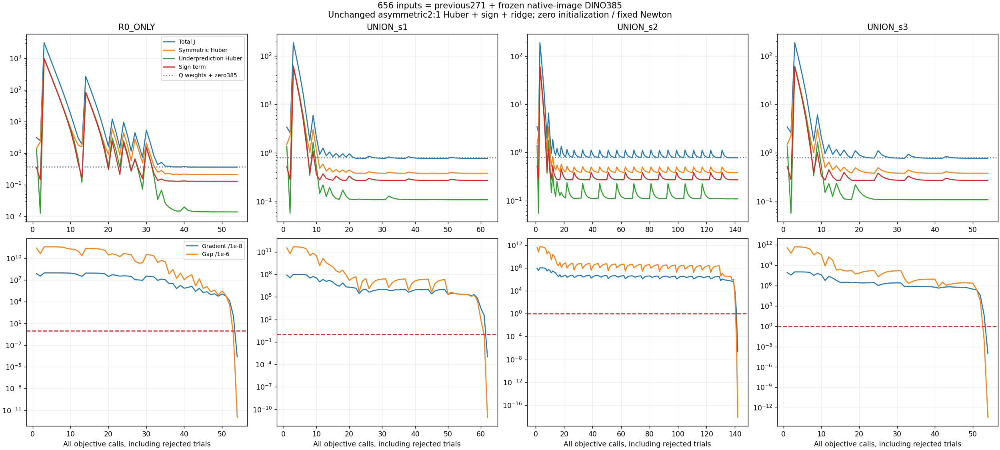
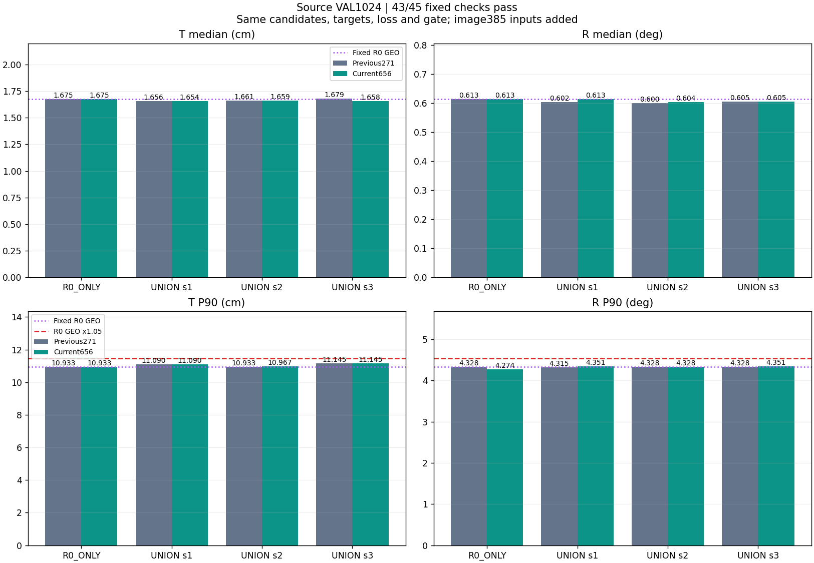
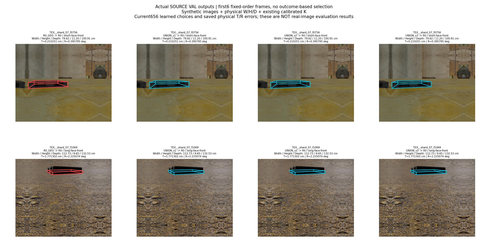
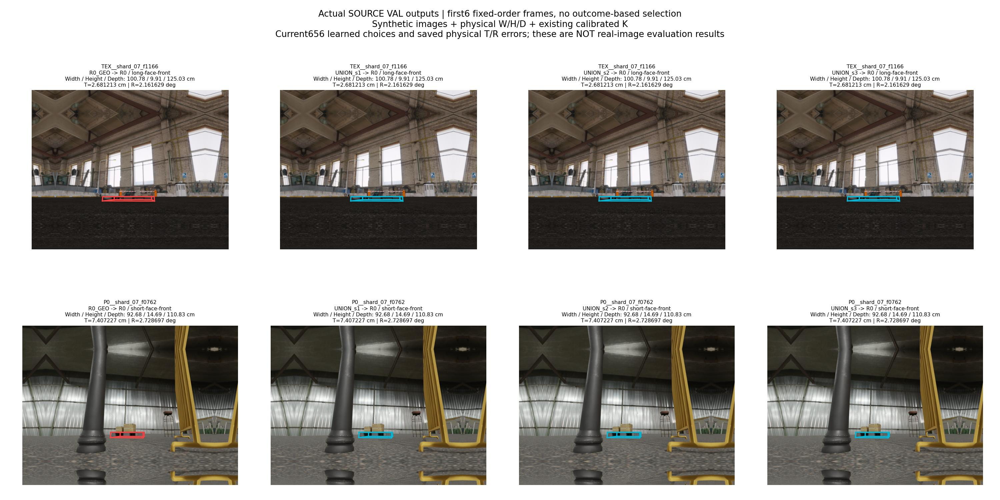
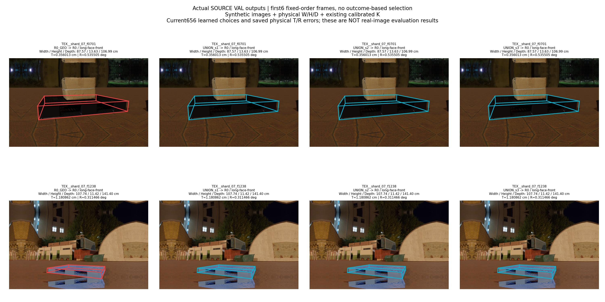

# 이미지·치수 기반 T/R 공동 개선 실험

**source VAL 43/45 조건 통과. 실사 안정적 T/R 공동 개선은 아직 입증되지 않았다.**

입력은 RGB 한 장과 팔레트 실제 W/H/D 치수, 기존에 보정된 K다. 이미 존재하는 R0/DIVERSE의 whole-pose 후보 중 하나를 선택한다. 새 주석·시간 정보·센서를 받지 않는다.

## 무엇을 바꿨는가

직전 Q의 271개 기하/잔차 입력에 고정 DINO의 후보별 이미지 특징385개만 추가했다. 8개 투영 꼭짓점의 원본 영상 영역 token384 평균과 지원 비율1이며, 모든 후보는 같은 R0 crop을 공유한다. 이전 271개 입력과 9개 해시를 보존했다. source의 반사 padding100을 표본 위치에서 제외하고 실제 사진은 pad0을 사용한다.

가중치는 656×2=1,312개다. bias0, ridge1e−4, 비대칭 Huber 과소:과대 비용2:1, sign계수1, 타깃 스케일·유효 후보·동률 규칙·평가 조건을 유지했다. 4개 모델 모두 0부터 학습했다. 모델 용량 증가도 포함된 비교이며, backbone은 학습하지 않았다.

[상세 설계](DESIGN_KO.md) · [원본 영상 입력 검산](../pallet_pose_dino_native_inputs_20261001_v1/REPORT_KO.md) · [이전 DINO 시도 및 한계](../pallet_pose_dino_input_audit_20261001_v1/PRIOR_METHODS_KO.md)

## 학습과 독립 검산

TRAIN 2,598행(실패1행 포함), 고정4fits. 수렴 기준은 gradient∞≤1e−8, gradient²/(2λ)≤1e−6이다. 이것은 학습 목적식의 수렴이며 T/R 일반화 성능 보장이 아니다.

| 모델 | 최종 J | Q 가중치+추가385=0의 동일 J | gradient∞ | gap 상계 | objective 호출 | 승인 반복 |
|---|---:|---:|---:|---:|---:|---:|
| R0_ONLY | 0.358772422 | 0.371675472 | 2.38e-12 | 1.03e-18 | 54 | 19 |
| UNION_s1 | 0.774957642 | 0.801800523 | 1.04e-11 | 8.68e-18 | 62 | 19 |
| UNION_s2 | 0.776579818 | 0.804028872 | 2.34e-15 | 7.56e-25 | 142 | 30 |
| UNION_s3 | 0.777541943 | 0.804845394 | 9.79e-13 | 3.77e-20 | 54 | 16 |

TRAIN에서 R0 anchor 대비 안전 개선 선택과 어느 한 축이라도 악화된 선택을 함께 확인했다. 안전 개선이 늘어도 위험한 선택이 동시에 늘 수 있으므로 목적식 감소를 T/R 공동 개선으로 해석하지 않는다.

| 모델 | 안전 개선 Q→656 | 어느 축이든 악화 Q→656 |
|---|---:|---:|
| R0_ONLY | 4 → 7 | 0 → 0 |
| UNION_s1 | 66 → 81 | 75 → 87 |
| UNION_s2 | 65 → 74 | 77 → 78 |
| UNION_s3 | 41 → 58 | 50 → 67 |



[학습 독립 검산](TRAIN_CONVERGENCE_KO.md) · [전체 학습 trace](TRAIN_TRACE.csv) · [최종 인증 수치](TRAIN_CERTIFICATES.csv)

## Source VAL 전체 결과

원래 1,024행을 전부 유지하며 실패는 T/R 모두 +∞다. UNION 각 seed를 shared R0_ONLY, 고정 R0_GEO, 대응 DIVERSE_GEO와 비교한다. T/R 중앙값 각각 엄격 감소, P90 각각 1.05배 이내, 실패 비증가의 45조건을 모두 요구한다.

| 모델 | T 중앙값 cm | R 중앙값 ° | T P90 cm | R P90 ° | 실패 |
|---|---:|---:|---:|---:|---:|
| R0_ONLY | 1.674594 | 0.613334 | 10.932544 | 4.273600 | 0 |
| UNION_s1 | 1.653925 | 0.613334 | 11.089684 | 4.350842 | 0 |
| UNION_s2 | 1.658631 | 0.603744 | 10.966828 | 4.328168 | 0 |
| UNION_s3 | 1.657582 | 0.604827 | 11.145026 | 4.350842 | 0 |
| R0_GEO | 1.674594 | 0.613334 | 10.932544 | 4.328168 | 0 |
| DIVERSE251_s1_GEO | 1.818474 | 0.805513 | 19.343094 | 79.453475 | 0 |
| DIVERSE251_s2_GEO | 1.900040 | 0.775323 | 18.537749 | 73.676611 | 0 |
| DIVERSE251_s3_GEO | 2.051196 | 0.765877 | 18.074773 | 38.153661 | 0 |

직전 Q와 비교한 새 UNION의 중앙값 변화:

| 모델 | T 중앙값 이전→현재 cm | R 중앙값 이전→현재 ° |
|---|---:|---:|
| UNION_s1 | 1.656191 → 1.653925 | 0.602370 → 0.613334 |
| UNION_s2 | 1.660625 → 1.658631 | 0.599713 → 0.603744 |
| UNION_s3 | 1.679494 → 1.657582 | 0.604827 → 0.604827 |

세 UNION 모두 T 중앙값은 기준 R0보다 낮다. 그러나 seed1의 R 중앙값은 R0와 동일하여 엄격한 감소 조건을 충족하지 못했다. 직전의 seed3 T 미달은 해소됐지만 seed1 R 조건이 새로 미달했다. 같은 43/45라도 실패 원인은 바뀌었다. 이미지 특징 추가는 이번 합성 검증의 T에는 도움이 됐지만, 안정적인 T/R 동시 개선은 확인되지 않았다.

고정된 선택을 사후 진단한 결과다. 정답 기반 안전 판정을 추론의 필터로 사용하지 않았다. 한 축이라도 R0 anchor보다 나빠진 선택은 그대로 포함했다.

| 모델 | VAL 안전 개선 Q→656 | VAL 어느 축이든 악화 Q→656 | 바뀐 선택 |
|---|---:|---:|---:|
| R0_ONLY | 1 → 4 | 0 → 0 | 3 |
| UNION_s1 | 18 → 15 | 37 → 45 | 25 |
| UNION_s2 | 17 → 18 | 39 → 38 | 26 |
| UNION_s3 | 12 → 16 | 27 → 33 | 20 |



실패한 조건 2개:

```json
[
  "UNION_s1/R0_ONLY/rotation_deg_median_strict",
  "UNION_s1/R0_GEO/rotation_deg_median_strict"
]
```

[전체 판정](SOURCE_VAL_GATE.json) · [입력 독립 검산](SOURCE_VAL_APPEARANCE_VERIFICATION.json) · [route/오차/판정 독립 검산](SOURCE_VAL_VERIFICATION_KO.md) · [전체8모델×1,024행 수치·치수](SOURCE_VAL_METRICS.csv)

## 이미지와 실제 치수

기존 VAL 순서의 첫 6행이다. 결과로 선별하지 않았다. 빨강은 R0_GEO, 청록은 각 새 UNION이 고정 선택한 pose다. 각 패널에 W/H/D(cm), 선택 후보, 저장된 T/R를 표시했다. 합성 VAL이며 실사 성능 예시가 아니다.





## 실사 평가와 결론

source 조건을 모두 통과하지 못해 이번 모델의 실사 입력 추출·선택·T/R 평가는 실행하지 않았다. 기존 실사 수치를 이번 모델의 결과로 옮겨 쓰지 않았다. 이미지 특징 추가의 학습 수렴만으로 개선됐다고 결론낼 수 없다.

[실사 미실행 기록](REAL_EVALUATION_NOT_RUN.json) · [기존 실제 사진6장·팔레트 치수110×11×130cm](../pallet_pose_signed_axes_asymmetric_20261001_v1/REPORT_KO.md) — 해당 사진은 이전 R0 입력 예시이며 이번 모델의 실사 결과가 아니다.

source VAL과 실사 DEV는 기존 시도에서 반복 사용했다. 실사 참조 pose는 기존2D 주석/K/치수에서 도출된 것으로 새 물리 계측 정답이 아니다. 기존 teacher 계보에 실사9장/수동 코너38개가 있으므로 전체 시스템을 real-GT-free라고 표현하지 않는다. 꼭짓점 평균은 순서 정보를 잃으며, 원본 영역 token에도 전역 문맥의 패딩 영향이 남을 수 있다.

## 코드·파라미터·재현

[봉인 프로토콜](TRAIN_PROTOCOL.json) · [PREFIT](PREFIT_REVIEW_KO.md) · [656×2 파라미터4개](model_parameters/) · [그림·수치 출처](REPORT_DATA.json) · [실행 기록](EXECUTION_KO.md)

[학습 코드](../../../scripts/research/pallet_pose_signed_axes_visual_20261001_v1/convex_train.py) · [이미지 입력](../../../scripts/research/pallet_pose_signed_axes_visual_20261001_v1/appearance_features.py) · [source 평가](../../../scripts/research/pallet_pose_signed_axes_visual_20261001_v1/evaluate_source.py) · [실사 평가](../../../scripts/research/pallet_pose_signed_axes_visual_20261001_v1/evaluate_real.py)

원본 RGB·대용량 token/NPZ·사전학습 backbone은 로컬에 보존한다. GitHub에는 코드·최종 선형 파라미터·수치·이미지·SHA 영수증을 게시한다. 전체 재실행에는 해시가 일치하는 로컬 원본 자료가 필요하다.
