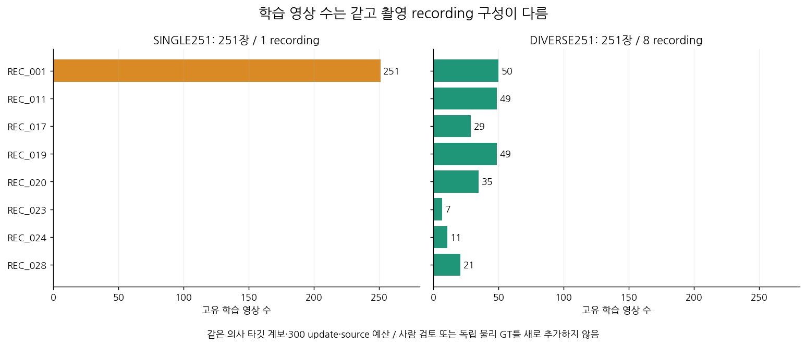
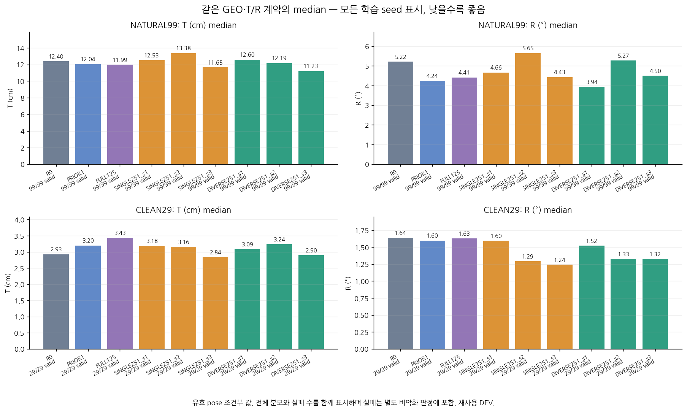
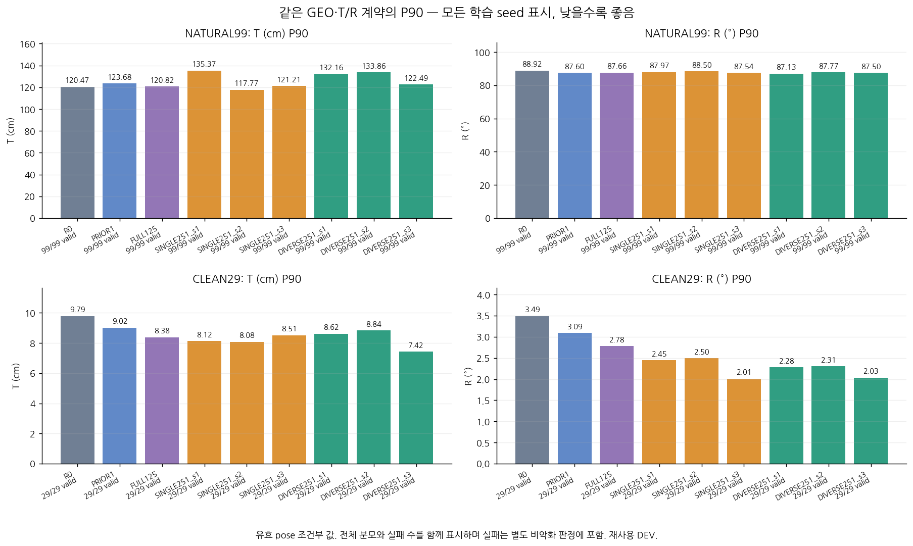
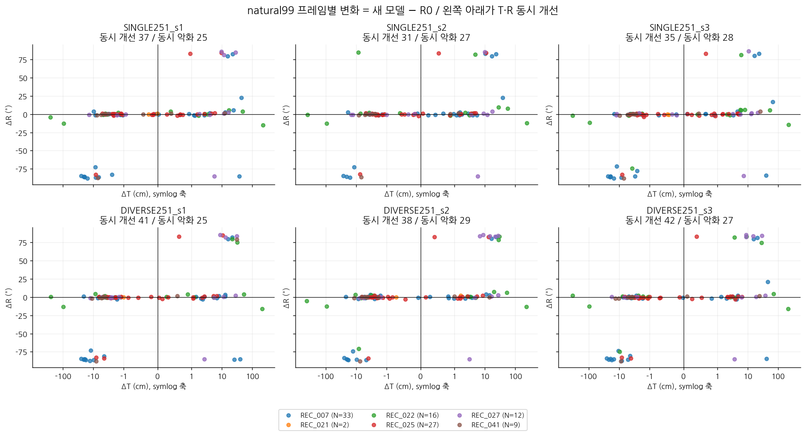
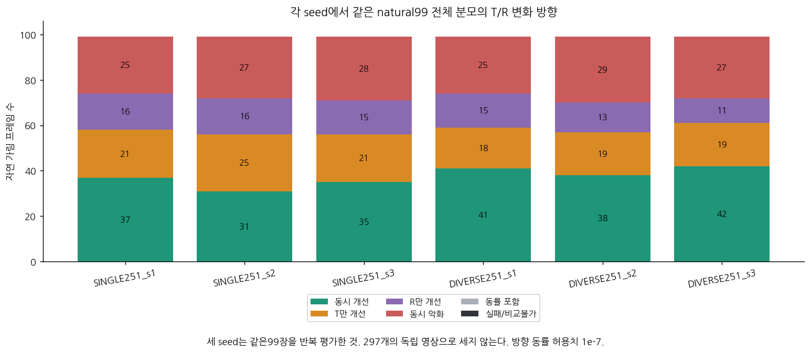
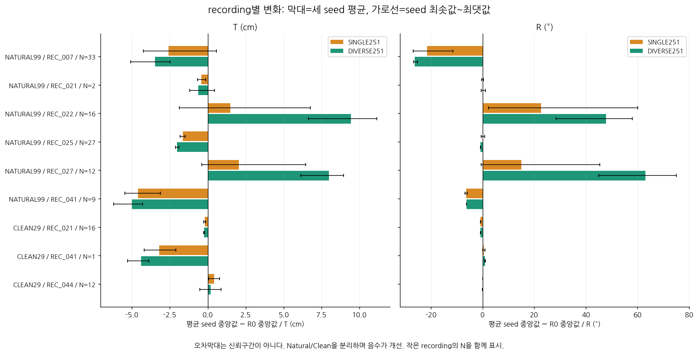
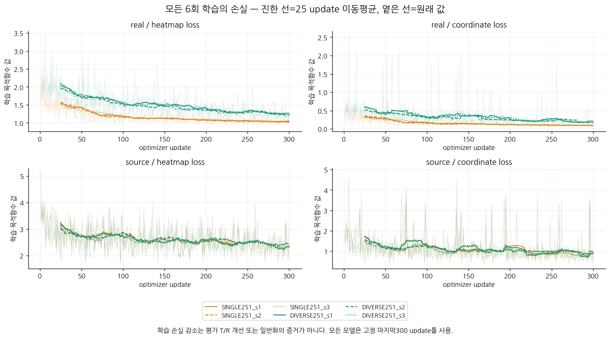

# T·R 안정적 개선 대조 실험 — 2026-10-01

**이번 변경으로 T와 R이 함께 안정적으로 개선됐다는 근거는 확보하지 못했습니다.** 아래 미통과 기준을 유지하며 개선 완료로 처리하지 않습니다.

자연 가림99장의 DIVERSE **seed별 중앙값 평균**은 T 12.004cm·R 4.567°입니다. R0보다 낮지만 기존 FULL125보다 T와 R 모두 개선되지 않았습니다. T P90의 seed 평균은 129.503cm로 R0의120.471cm보다 높습니다. 따라서 평균의 일부 개선만으로 새 모델을 채택하지 않습니다.

이 보고서는 실제 학습 6회와 고정된 173장 평가 결과입니다. 예측값·checkpoint를 먼저 동결하고 평가 참조를 읽었습니다. 모델을 잘 나온 seed로 고르거나 평가 결과로 학습 입력을 교체하지 않았습니다. 코드 검증 통과와 성능 개선 통과를 구별합니다.

## 결과를 바로 확인하기

- [프레임별 전체 결과 CSV](FRAME_RESULTS.csv): 9모델 × 173장 = 1,557행.
- [자연 가림 99장 전체 이미지 비교](GALLERY_NATURAL99.md): R0 / SINGLE seed1 / DIVERSE seed1. seed1은 결과 확인 전에 그림용으로 고정했습니다.
- [전체 수치·안정성 판정 JSON](RESULTS.json), [세부 recording·seed 비교](DETAILED_COMPARISONS.json), [학습 1,800 step 로그 CSV](TRAINING_LOG.csv).
- [좌표 보정과 GEO 선택 효과를 나눈 진단](MECHANISM_RESULTS_KO.md): 동일 R0 가설 유지 시의 변화와 고정 검출 오류 꼬리를 별도로 확인합니다.
- [실행 순서·환경·재현 조건](REPRODUCTION_KO.md).
- [기존 진단 보고서](../pallet_pose_diagnosis_20260930_v1/REPORT_KO.md): 이번 시도의 출발점이며, 이전 FULL125를 개선 완료로 판정하지 않았습니다.

## 무엇을 바꿨는가

기존 FULL125의 실사 입력은 하나의 촬영 recording에 집중돼 있었습니다. 같은 251장·300 updates·8 real + 8 synthetic batch·최종 checkpoint 조건으로 **단일 recording 데이터와 여러 recording의 데이터 구성**을 비교했습니다. 기존 synthetic PRIOR1에서 시작하며, FULL convolution 파라미터만 학습하고 모든 BN affine·running statistics를 고정했습니다. TFAdam lr=1e-4, 원래 heatmap+coordinate 손실과 convolution L2, 기존 source replay를 유지했습니다.

각 군을 seed1·2·3으로 반복했습니다. 3회 모두 같은 사전 학습 가중치에서 시작하고 real 순서와 source corruption 난수만 바꿉니다. 같은 seed의 두 군은 real 샘플 index, synthetic 이미지 순서와 좌표 corruption이 같습니다. 다른 recording의 RGB·박스·가림·난이도·유효 코너 수는 함께 달라집니다. 따라서 recording 개수 하나만의 순수한 인과 효과라고 해석하지 않습니다.

| 군 | 이미지 | recording | 인공 가림 이미지 | 감독 코너 | 입력 pseudo 오차 중앙값 px | P90 px | >20px 코너 |
| --- | --- | --- | --- | --- | --- | --- | --- |
| SINGLE251 | 251 | 1 | 184 | 2008 | 1.972 | 7.814 | 50 |
| DIVERSE251 | 251 | 8 | 181 | 1913 | 3.481 | 14.659 | 122 |

학습 입력의 pseudo 오차는 고정된 교사 타깃에 대한 차이이며 독립 실사 정답 오차가 아닙니다. DIVERSE는 이 좌표 차이가 더 크고 감독 코너는 적습니다. 이를 실제 3D 오차나 자연 가림 난도로 대신 해석하지 않습니다. 동일 이미지/업데이트 예산과 동일 감독 코너 수는 다릅니다.

[입력 scale 감사](TRAIN_INPUT_SCALE_AUDIT.json)에서 두 군의 모든 원본 RGB는640×480임을 확인했습니다. 공통 crop 좌표에서 pseudo 차이 중앙값은 SINGLE2.046px / DIVERSE3.231px, P90은8.095px /11.552px였습니다. 박스 대각선으로 정규화한 중앙값도0.848% /1.389%로 차이가 남았습니다. 다만 native P90 비율1.88배는 crop 정규화 후1.43배로 줄므로, native20px 개수만으로 학습 난도를 단정하지 않습니다.

기존 DAY253에서 확장 평가셋 PAPER194/319의 RGB와 SHA가 같은 `DAY264__005516`을 제거해 252장 계획을 먼저 잠갔습니다. 이 중복은 이번 주 평가128장이 아닌 추가 plastic66장에 있었습니다. 새 인공 가림 입력 검증에서 1쌍이 사전 IoU≥0.5 기준에 실패했습니다(IoU 0.462). 이를 교체하지 않고 제외했으며, 단일 recording 군에서도 `(image SHA,id)` 최대값인 `DAY264__005627`을 제거했습니다. **학습 시작 전** 251장으로 명시적으로 수정했습니다. [원래 계약](GOAL_PROTOCOL.json), [수정 기록](PROTOCOL_AMENDMENT_01.json), [실행 계약](PROTOCOL_EFFECTIVE.json), [실제 입력 검증](DATA_PREPARATION_FINAL.json)에 이력이 남아 있습니다.

## 평가 범위와 T·R의 의미

주 평가는 기존 plastic128 중 자연 가림99장(6 recording)과 clean29장(3 recording)입니다. 별도로 wood45장(38 clean+7 moderate, 2 recording)을 형태 전이 stress로 평가했습니다. 모든 집합은 이미 반복 사용된 DEV이며 새 독립 TEST가 아닙니다. 추가 plastic66장은 기존 학생/Replay 교사가 사용한 recording과 겹쳐 독립 확인셋에서 제외했습니다.

T는 물체 중심 translation 오차(cm), R은 physical frame과 C2 대칭을 적용한 전체 3차원 회전 오차(°)입니다. yaw만의 오차가 아닙니다. 두 값 모두 낮을수록 좋습니다. 기존 frozen GEO 선택, W/D 가설, SQPnP+LM과 카메라 K·치수 계약을 그대로 유지했습니다. 검출 박스/score/중심점/무효점/비선택 후보를 바꾸지 않았으며, IoU가 낮은 프레임도 주 T·R 평가에서 제거하지 않았습니다.

표의 중앙값/P90은 유효 pose 조건부 통계이고 실패 수를 같이 제공합니다. 전체 모집단의 pose 실패를 +∞로 둔 분포는 JSON에 별도로 남겼습니다. 실패가 늘면 안정성 기준을 통과할 수 없습니다. 저장 참조는 2D·K·치수로 연결된 geometry reference이며 독립 장비로 측정한 실제 6D pose가 아닙니다.

## 자연 가림 99장

| 모델 | T 중앙값 cm ↓ | R 중앙값 ° ↓ | T P90 cm ↓ | R P90 ° ↓ | pose 실패 |
| --- | --- | --- | --- | --- | --- |
| R0 | 12.403 | 5.218 | 120.471 | 88.922 | 0 |
| PRIOR1 | 12.042 | 4.240 | 123.679 | 87.596 | 0 |
| FULL125 | 11.986 | 4.411 | 120.824 | 87.661 | 0 |
| SINGLE251_s1 | 12.535 | 4.659 | 135.371 | 87.965 | 0 |
| SINGLE251_s2 | 13.378 | 5.650 | 117.765 | 88.495 | 0 |
| SINGLE251_s3 | 11.651 | 4.433 | 121.211 | 87.542 | 0 |
| DIVERSE251_s1 | 12.596 | 3.938 | 132.165 | 87.130 | 0 |
| DIVERSE251_s2 | 12.189 | 5.268 | 133.857 | 87.766 | 0 |
| DIVERSE251_s3 | 11.226 | 4.496 | 122.487 | 87.502 | 0 |

아래 표는 3개 seed 각각의 모집단 중앙값을 구한 뒤 평균한 값의 차이입니다. 프레임별 오차 차이의 중앙값이나 3개 seed 예측을 합친 median과 다릅니다. 음수는 DIVERSE 개선 방향입니다. 같은 recording과 대응 seed를 함께 재표집한 2,000회 bootstrap이며, 6개 촬영 군집과 3개 학습 seed라는 제한이 있습니다.

| DIVERSE 비교 기준 | 지표 | 평균 seed 중앙값 차이 ↓ | 95% 구간 | 정의 불가 draw |
| --- | --- | --- | --- | --- |
| SINGLE251 | T cm | -0.517 | [-1.898, 6.405] | 0 |
| SINGLE251 | R ° | -0.347 | [-4.695, 43.482] | 0 |
| R0 | T cm | -0.400 | [-3.099, 8.781] | 0 |
| R0 | R ° | -0.650 | [-11.855, 46.257] | 0 |
| PRIOR1 | T cm | -0.039 | [-3.444, 7.484] | 0 |
| PRIOR1 | R ° | 0.327 | [-0.514, 45.907] | 0 |
| FULL125 | T cm | 0.017 | [-2.651, 5.656] | 0 |
| FULL125 | R ° | 0.157 | [-0.548, 46.367] | 0 |

## Clean 29장 보존

| 모델 | T 중앙값 cm ↓ | R 중앙값 ° ↓ | T P90 cm ↓ | R P90 ° ↓ | pose 실패 |
| --- | --- | --- | --- | --- | --- |
| R0 | 2.930 | 1.637 | 9.785 | 3.491 | 0 |
| PRIOR1 | 3.198 | 1.597 | 9.022 | 3.092 | 0 |
| FULL125 | 3.433 | 1.630 | 8.380 | 2.777 | 0 |
| SINGLE251_s1 | 3.185 | 1.597 | 8.122 | 2.447 | 0 |
| SINGLE251_s2 | 3.160 | 1.292 | 8.078 | 2.496 | 0 |
| SINGLE251_s3 | 2.838 | 1.241 | 8.515 | 2.008 | 0 |
| DIVERSE251_s1 | 3.088 | 1.521 | 8.616 | 2.280 | 0 |
| DIVERSE251_s2 | 3.240 | 1.326 | 8.836 | 2.306 | 0 |
| DIVERSE251_s3 | 2.901 | 1.323 | 7.418 | 2.035 | 0 |

자연 가림 수치가 좋아져도 clean에서 큰 악화가 생기면 성공으로 채택하지 않습니다. 중앙값과 P90이 R0의 1.05배 이내여야 한다는 기준을 학습 전에 고정했습니다. 5%는 잠정적인 공학적 허용치이며 실측 noise floor·최소 검출 효과·통계적 동등성의 증거가 아닙니다.

이번 clean T 중앙값 기준은 실제 평균 3.076372365cm가 허용값 3.076355407cm를 불과 0.000016957cm 초과해 계산상 미통과입니다. 이 경계 차이를 물리적으로 의미 있는 악화로 해석할 수는 없습니다. 기준을 사후 변경하지 않고 기록하되, 안정적 개선 미입증 결론은 자연 가림의 seed·불확실성·recording·T 꼬리 기준 미통과에도 독립적으로 뒷받침됩니다.

## 별도 wood45 형태 전이 stress

| 모델 | T 중앙값 cm ↓ | R 중앙값 ° ↓ | T P90 cm ↓ | R P90 ° ↓ | pose 실패 |
| --- | --- | --- | --- | --- | --- |
| R0 | 2.095 | 1.545 | 8.011 | 9.190 | 0 |
| PRIOR1 | 1.754 | 1.000 | 7.357 | 9.608 | 0 |
| FULL125 | 2.088 | 1.327 | 9.452 | 15.222 | 0 |
| SINGLE251_s1 | 1.998 | 1.251 | 9.170 | 14.432 | 0 |
| SINGLE251_s2 | 1.772 | 1.269 | 6.980 | 12.851 | 0 |
| SINGLE251_s3 | 1.890 | 1.288 | 7.803 | 10.419 | 0 |
| DIVERSE251_s1 | 1.941 | 1.189 | 9.423 | 13.515 | 0 |
| DIVERSE251_s2 | 1.889 | 1.324 | 12.255 | 54.188 | 0 |
| DIVERSE251_s3 | 1.736 | 1.439 | 8.198 | 11.705 | 0 |

wood45는 기존 학습/교사 recording과 분리되지만 재사용 DEV입니다. 두 recording뿐이고 참조 코너 출처가 unknown/migration review 상태이므로 일반화 성공을 확정하는 시험으로 사용할 수 없습니다. 기존 wood 결과의 다른 selector 수치를 복사하지 않고 현재 GEO로 다시 계산했습니다.

DIVERSE seed2의 wood R P90은54.188°이며 R0의9.190°보다 크게 높습니다. 작은 중앙값 개선과 별개로 큰 회전 오류가 남는 사례입니다. 이 seed를 표나 그림 통계에서 제외하지 않았습니다.

## 수치와 데이터 구성 그림

## 사전 안정성 기준

| 사전 고정 기준 | 판정 |
| --- | --- |
| 3개 seed 모두 T·R 동시 개선 | **미통과** |
| 군집·seed bootstrap에서 T·R 모두 95% 상한 <0 | **미통과** |
| 각 recording을 하나씩 제외해도 동시 개선 | **미통과** |
| 자연 가림 P90·실패 수 보존 | **미통과** |
| clean 중앙값·P90·실패 수 보존 | **미통과** |

첫 기준은 DIVERSE의 **모든 seed**가 대응 SINGLE과 고정 R0·PRIOR1·FULL125보다 T·R 중앙값 모두 작아야 합니다. 불확실성과 recording 제외 검사는 SINGLE과 R0 각각에 대해 수행합니다. 자연 가림 P90도 SINGLE과 R0 대비 5% 이내여야 합니다. 상세한 미통과 값과 각 recording을 제외한 결과는 [RESULTS.json](RESULTS.json)에 있습니다. 성공 기준을 결과에 맞춰 바꾸지 않았습니다.

## 실제 실행과 검증

| 모델 | seed | updates | 실사/source 노출 | 시간 초 | 최종 checkpoint SHA256 |
| --- | --- | --- | --- | --- | --- |
| SINGLE251 | 1 | 300 | 2400/2400 | 284.525 | `ae6413be2e5ddd8cfc9a17a60416bf8723d3361376be12d1dc958379951e7736` |
| DIVERSE251 | 1 | 300 | 2400/2400 | 284.517 | `d4e05c7260e1acd58dc0c674e27fba12343eac942f71bcfd60a79a18afe80331` |
| SINGLE251 | 2 | 300 | 2400/2400 | 284.835 | `3efa4d6152a096b8bc2e1831cc1ebbb7f416e71b69efbbf44253c6a38fec806f` |
| DIVERSE251 | 2 | 300 | 2400/2400 | 283.400 | `16e543b4bd865180cc5070a4f4eeef53d93ce9a15fc21f5603bb81bd54351fea` |
| SINGLE251 | 3 | 300 | 2400/2400 | 283.737 | `e52862e54da5bdb32736ca7d7352526427ed231996db58b5d12b8e957e18bc2d` |
| DIVERSE251 | 3 | 300 | 2400/2400 | 283.994 | `044301ccd6fda61a154b852ff1fe83224b0b4af63efa7cdabbf12e22668f3266` |

총 optimizer updates 1,800회, real 노출 14,400회와 synthetic 노출 14,400회입니다. 위 학습 시간 합계는 1705.0초이며 자료 준비·검증·추론·보고서 작성 시간은 포함하지 않습니다. GPU는 호스트 RTX3080 10GB를 사용했습니다. 샌드박스에서 GPU가 보이지 않던 문제는 호스트 접근으로 해결했고 드라이버는 변경하지 않았습니다.

새 masked R0 준비 추론은 실패 입력과 parity smoke를 포함해 203회였습니다. 고정 PRIOR1/FULL125는 wood45 각각 45장, 새 6모델은 각각 173장을 처리했습니다. 실제 forward 여부와 실행 시간은 [예측 동결 기록](PREDICTIONS_LOCK.json)과 각 receipt에 기록했습니다. 검출 실패로 refiner 입력이 없으면 이미지 수와 실제 model forward 수가 다를 수 있습니다.

[학습 전 검증](PRETRAIN_TESTS.json)은 원본 초기 tensor 일치, wrapper 출력 일치, 중앙점 감독 제외, crop 역변환, 공통 mask, BN·고정 파라미터 gradient 보호, source TRAIN/heldout 분리를 확인합니다. [학습 완료 검증](TRAINING_COMPLETE.json)은 6회 완료와 대응 seed의 입력 순서·source corruption 일치를 확인합니다. 실제 학습 입력·원본 캐시·code·checkpoint는 SHA256으로 연결했습니다. model weight와 큰 crop tensor는 로컬에 보존하며 GitHub에는 감사 가능한 경로·hash·표·그림·코드를 올립니다.

## 남아 있는 한계

새 실사 정답을 학습에 추가하지 않았습니다. 다만 기존 Replay 교사는 실사 9장의 수동 코너 38개를 사용했으므로 전체 방법이 실사 GT를 전혀 사용하지 않았다고 표현할 수 없습니다. 과거 모델 선택에도 DEV 재사용 이력이 있습니다.

반복 원본 클릭이나 독립 실측 pose가 없어 참조 노이즈 하한을 확정할 수 없습니다. 새 독립 recording 확인과 자연 static clean/occluded pair도 확보되지 않았습니다. 이번 기록은 이 한계를 숨기거나 학습 완료를 성능 개선 완료로 바꾸지 않습니다.

자료·방법 감사: [DATA_AUDIT_KO](DATA_AUDIT_KO.md), [METHOD_AUDIT_KO](METHOD_AUDIT_KO.md), [TRAINING_AUDIT_KO](TRAINING_AUDIT_KO.md).

독립 검토: [학습 코드](TRAIN_REVIEW_KO.md), [평가 코드](EVAL_REVIEW_KO.md), [실제 결과 해석](RESULT_REVIEW_KO.md).

[다음 방법의 과거 실험 감사](NEXT_METHOD_AUDIT_KO.md): 후보 선택기 재학습의 이전 성공·실패와 현재 출력 cache의 부재를 함께 기록했습니다. 아직 새 개선 방법을 검증한 결과는 아닙니다.
