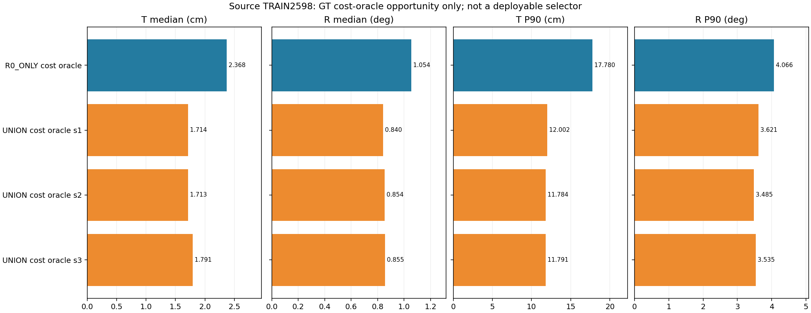
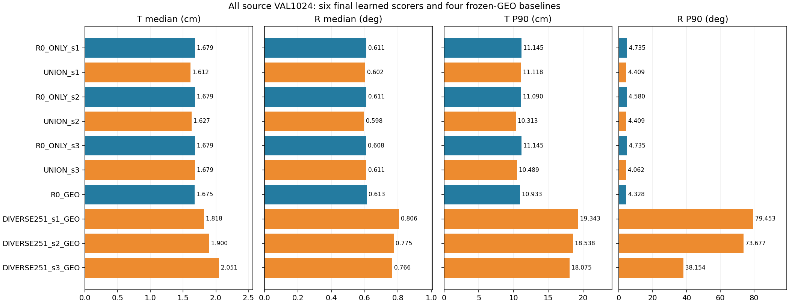
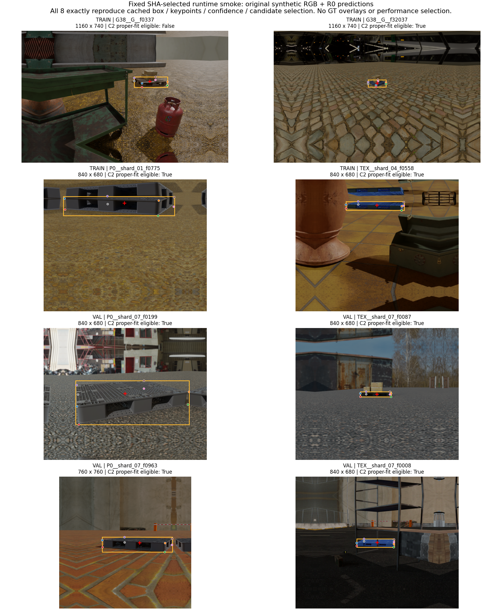

# 원래 pose와 보정 pose를 함께 선택하는 방법 — 합성 검증 결과

**실사 T·R의 안정적 동시 개선은 아직 달성하지 못했습니다.** 이번에는 원래 예측을 보존하면서 좋은 보정을 사용할 수 있는지, 합성 데이터로만 학습하는 후보 선택기를 검사했습니다. 합성 학습 데이터에는 개선 여지가 있었지만, 실제 학습한 선택기는 합성 VAL의 동시 개선 기준을 통과하지 못했습니다.

## 현재 실사 결과와 구분

현재까지 확정된 자연 가림99 결과는 [앞선 6회 보정 모델 학습 보고서](../pallet_pose_stable_improvement_20261001_v1/REPORT_KO.md)의 값입니다.

| 방법 | T 중앙값 cm ↓ | R 중앙값 ° ↓ | T P90 cm ↓ | 의미 |
| --- | ---: | ---: | ---: | --- |
| R0 | 12.403251 | 5.217583 | 120.471370 | 초기 모델 |
| FULL125 | 11.986464 | 4.410692 | 120.824080 | 기존 보정 모델 |
| DIVERSE251 3개 seed의 통계 평균 | 12.003722 | 4.567216 | 129.502732 | FULL125보다 T·R 모두 개선되지 않음 |

세 번째 행은 각 seed의 중앙값/P90을 먼저 구한 후 평균한 값입니다. 모든 예측을 합친 중앙값이 아닙니다. 학습 완료, 코드 검사 통과, GitHub 반영은 성능 개선 통과와 다릅니다. [실제 자연 가림99장 이미지](../pallet_pose_stable_improvement_20261001_v1/GALLERY_NATURAL99.md)와 [잘못 검출한 8개 장면](../pallet_pose_joint_recovery_20261001_v1/ASSOCIATION_AUDIT_KO.md)도 확인할 수 있습니다.

## 이번 비교가 필요한 이유

고정된 DIVERSE 좌표의 W/D 두 후보만 바꾸는 방법은 T P90 기준을 통과할 수 없었습니다. [이전 후보 한계 분석](../pallet_pose_joint_recovery_20261001_v1/REPORT_KO.md). 이번 후보 집합은 원래 R0 pose까지 추가하므로 그 고정 집합의 한계 밖에 있습니다. 동일 seed에서 R0의 2개 W/D 후보만 고르는 R0_ONLY와, 여기에 보정 모델의 2개를 추가한 UNION을 비교합니다.

한 후보의 회전과 위치를 통째로 선택합니다. 서로 다른 후보의 좋은 T와 좋은 R을 합쳐 결과를 만들지 않습니다. 검출 박스·카메라·치수·corner8 SQPnP+LM은 동일합니다. 새 실사 정답을 학습에 넣지 않지만, 상속한 Replay 교사가 과거 실사9장·수동 코너38개를 사용한 계보는 남아 있습니다.

이전 student routing, RGB-GAP, view 선택 등의 음성 결과와 이번 차이는 [선행 실험 감사](PRIOR_AND_METHOD_AUDIT_KO.md)에 기록했습니다. 기존 결과를 새로운 성공으로 다시 해석하지 않았습니다.

## 데이터와 정답 유효성

기존 합성 split의 TRAIN4,096·VAL1,024 전체에서 R0와 세 보정 모델의 출력을 생성했습니다. 대칭성 선언이 C2이고, 정규 cuboid에서 저장된 3D 점으로 가는 변환이 유효한 회전·이동인 자료에만 학습 자격을 부여했습니다. 최종 TRAIN2,598·VAL1,024입니다. 두 비교군에 같은 목록을 사용하며 실사173장은 바꾸지 않았습니다.

C1의 앞뒤 방향을 임의로 C2로 바꾸지 않았습니다. 또한 C2 한 행의 점 순서가 반사 변환(det=-1)이어서 실제 회전으로 표현할 수 없었습니다. 최초 실패·원본 자료·제외 사유를 보존하고, 성능 수치 대신 메타데이터 기하 규칙을 모든 행에 적용했습니다. 전수 유효성 검사의 거의0 오차는 완벽한 합성 정답 점을 넣은 좌표계 검산이며 모델 정확도가 아닙니다. [상세 계약](SOURCE_CONTRACT_KO.md), [최초 FAIL](SOURCE_CONTRACT_PRE_AMENDMENT_01.json), [학습 전 수정 기록](SOURCE_CONTRACT_AMENDMENT_01.json).

기존 refiner 학습 source와 selector TRAIN/VAL은105/26개가 겹칩니다. 따라서 모든 모델에 완전히 새 데이터라고 할 수 없습니다. 새 독립 TEST 및 신규 촬영·재클릭은 실행하지 않았습니다.

## TRAIN에서 같은 pose로 T와 R을 줄일 여지가 있는가

합성 TRAIN의 고정 R0+GEO 중앙값을 각각 scale로 두고, `max(T/sT, R/sR)`가 가장 작은 **whole-pose 후보**를 진단적으로 고릅니다. sT=2.463688755cm, sR=1.113474020°입니다. 정확히 같은 cost일 때만 Pareto 비교→R0→고정 가설명 순서를 적용합니다.

아래는 정답으로 고르는 oracle 진단이며 실제 실행 가능한 성능이 아닙니다. 세 seed 모두 R0_ONLY oracle 대비 T·R 중앙값을 낮추고, 양쪽 P90은1.05배 이내이며 실패를 늘리지 않아야 다음 학습으로 진행합니다. 판정은 **PASS**입니다. 실패가 모든 union 방법의 불가능성을 뜻하지는 않습니다.

| 방법 | T 중앙값 cm ↓ | R 중앙값 ° ↓ | T P90 cm ↓ | R P90 ° ↓ | pose 실패 |
| --- | ---: | ---: | ---: | ---: | ---: |
| R0_ONLY cost oracle | 2.368040 | 1.053725 | 17.779679 | 4.065868 | 1 |
| UNION cost oracle s1 | 1.714084 | 0.839936 | 12.002438 | 3.620801 | 1 |
| UNION cost oracle s2 | 1.712778 | 0.853847 | 11.783572 | 3.485348 | 1 |
| UNION cost oracle s3 | 1.790902 | 0.855460 | 11.790738 | 3.535235 | 1 |

[모든 TRAIN 후보의 T/R·cost CSV](SOURCE_TRAIN_CANDIDATES.csv), [세 seed의 후보 선택 CSV](SOURCE_TRAIN_COST_CHOICES.csv), [TRAIN 사전 기준](TRAIN_FEASIBILITY_PROTOCOL.json), [TRAIN 상세 판정](SOURCE_TRAIN_GATE.json).

## 학습과 VAL 판정

선택기 **6회 학습·총 1,980 updates**를 완료하고 최종 가중치 6개를 모두 동결한 뒤 VAL 1,024장을 평가했습니다. 검증 기준 45개 중 **3개가 미통과**했습니다. 모든 seed가 모든 기준을 통과해야 하므로 이 방법을 채택하지 않습니다.

| 방법 | T 중앙값 cm ↓ | R 중앙값 ° ↓ | T P90 cm ↓ | R P90 ° ↓ | pose 실패 |
| --- | ---: | ---: | ---: | ---: | ---: |
| R0_ONLY_s1 | 1.679494 | 0.610614 | 11.145026 | 4.735187 | 0 |
| UNION_s1 | 1.611612 | 0.602150 | 11.118373 | 4.408687 | 0 |
| R0_ONLY_s2 | 1.679494 | 0.610614 | 11.089684 | 4.579689 | 0 |
| UNION_s2 | 1.627041 | 0.597564 | 10.313350 | 4.408687 | 0 |
| R0_ONLY_s3 | 1.679494 | 0.608127 | 11.145026 | 4.735187 | 0 |
| UNION_s3 | 1.679494 | 0.611123 | 10.488876 | 4.061537 | 0 |
| R0_GEO | 1.674594 | 0.613334 | 10.932544 | 4.328168 | 0 |
| DIVERSE251_s1_GEO | 1.818474 | 0.805513 | 19.343094 | 79.453475 | 0 |
| DIVERSE251_s2_GEO | 1.900040 | 0.775323 | 18.537749 | 73.676611 | 0 |
| DIVERSE251_s3_GEO | 2.051196 | 0.765877 | 18.074773 | 38.153661 | 0 |

seed1·2는 세 비교 기준에 대해 T·R 중앙값을 함께 낮췄고 tail·실패 기준도 통과했습니다. seed3의 미통과는 대조군 R0_ONLY 대비 **T 중앙값 동일**, R 중앙값0.608126750→0.611122982°이며, 기존 R0+GEO 대비 T 중앙값1.674594149→1.679493903cm입니다. 차이는 작지만 사전에 고정한 엄격한 개선 조건에는 해당하지 않습니다. 모든 방법이 크게 나빠졌다는 뜻으로 해석하지 않습니다. 개선된 두 seed만 선택하지 않았습니다.

[VAL 전체 프레임 CSV](SOURCE_VAL_FRAME_RESULTS.csv), [45개 기준의 개별 판정](SOURCE_VAL_CHECKS.csv), [정확한 수치와 판정 JSON](SOURCE_VAL_GATE.json), [정답을 읽기 전에 잠근 선택 결과](SOURCE_VAL_ROUTING_LOCK.json), [실제 학습 완료 기록](TRAINING_COMPLETE.json).

이 단계에서 실패하면 실사로 진행하지 않는 규칙을 학습 전에 정했습니다. 따라서 새 선택기의 실사 T/R 결과는 없으며, 기존 실사 수치를 새 방법의 성능으로 재사용하지 않습니다. seed·epoch·특징·threshold를 결과에 맞춰 다시 선택하지 않았습니다.

| 조건 | seed | updates | 시간 초 | 최종 checkpoint SHA256 |
| --- | ---: | ---: | ---: | --- |
| R0_ONLY | 1 | 330 | 0.400 | `6f5e977c7809407b98db3a32b839848a2ecaeef218e3ec5269eaf8379b61eb5d` |
| UNION | 1 | 330 | 0.413 | `6a553a5913d6a35730eb3f7b61c14a1d8e4eba62709ca1416807d774da1299aa` |
| R0_ONLY | 2 | 330 | 0.403 | `a3102a5beb084587f4bb3c5489a152225de7be266de435982c66c8dcae8ea080` |
| UNION | 2 | 330 | 0.410 | `60332559ba2f65d28e2746a2ce4388a63cd638d0101fc8224f94a375506cb305` |
| R0_ONLY | 3 | 330 | 0.399 | `c59b6de4d60f13e7c2e2e9835ae776a4ffc0f4952069840d3bbdfd18a3851509` |
| UNION | 3 | 330 | 0.409 | `b65818ccf3f34d963c2b849e5b097f2a913d6778b38e54a2278eccf03a2f23b7` |

[전체 1,980 update의 학습 로그](TRAINING_LOG.csv). 각 군의 입력 순서·초기화·정규화 일치는 [학습 완료 기록](TRAINING_COMPLETE.json)에 있습니다.

설계는94개 기존 기하 특징의 공유 선형 점수(학습 파라미터95개), 두 조건×seed1·2·3, 같은 초기값·행 순서·R0 TRAIN 정규화입니다. 학습을 진행하는 경우 AdamW lr0.001·weight decay0.0001, batch256·30epochs·330updates, 마지막 가중치만 사용합니다. 회전이나 위치 정답을 입력 특징에 추가하지 않습니다. 원래 YOLO와 PoseFix 가중치는 고정합니다.

학습 타깃은 TRAIN whole-pose cost 최소 후보이며 손실은 무효 후보를 가린 cross entropy입니다. 추론 동점에는 정답을 사용하지 않고 R0와 고정 가설명 순서를 씁니다. 유효 후보가 전혀 없으면 양 군 모두 같은 기존 R0 GEO pose로 돌아가고, 그것도 없으면 실패(+∞)로 남깁니다. 1.05배는 사전 공학적 허용치이며 측정 노이즈 하한이나 통계적 동등성의 증거가 아닙니다.

## 재현 검사와 실제 실행 비용

초기화의 CPU/GPU fusion 순서 차이로 첫 smoke1회가0.00390625px 차이를 보여 즉시 중단했습니다. 기존 CPU fusion→GPU 이동 순서를 복원한 뒤 같은8장·같은 허용오차에서 모든 후보의 좌표·박스·score·confidence·선택이 정확히 일치했습니다. 실패 기록을 지우거나 허용오차를 늘리지 않았습니다. [실패 기록](R0_SMOKE_FAILURE_01.json), [명시적 runtime 수정](SOURCE_RUNTIME_AMENDMENT_01.json), [최종 smoke](R0_SMOKE.json), [실행 경로 설명](RUNTIME_AND_SOURCE_METHOD_KO.md).

| 항목 | 실제 수행 |
| --- | ---: |
| R0 신규 합성 이미지 | 4,942 |
| 인증된 R0 캐시 재사용 | 178 |
| R0 smoke 이미지 forward | 9 (최초 실패1 + 재검사8) |
| 보정 모델 합성 이미지 forward | 15,357 |
| 총 신규 이미지 forward | 20,308 |
| 새 선형 선택기 학습 | 6회 / 1,980 updates |
| 선택기 CPU 학습 loop 기록 합계 | 2.435초 |
| GPU 추론 loop 기록 합계 | 564.359초 |
| 새 실사/TEST 이미지 forward·신규 수동 정답 | 0 |

loop 기록은 import·준비·초기 smoke·보고서 작성 등을 포함한 전체 작업 시간이 아닙니다. GPU는RTX3080, 선택기 학습 장치는CPU입니다. 모델 상태 tensor가 추론 전후 같은지도 확인했습니다. [동결된 합성 예측](SOURCE_PREDICTIONS_LOCK.json), [동결된 특징·pose](SOURCE_FEATURE_LOCK.json).

위8장은 RGB SHA로 결과 확인 전에 선정한 runtime 확인용 이미지입니다. 이미지 안에 보이는 반사 테두리는 기존 prepared canvas에 포함된 입력입니다. 성능이 좋은 장면을 고른 그림이나 실사 개선 사례가 아닙니다.

## 재현 경로와 남은 일

실행 코드는 [`scripts/research/pallet_pose_union_selection_20261001_v1`](../../../scripts/research/pallet_pose_union_selection_20261001_v1/)에 있습니다. 순서는 source_infer prepare→detector→refiners, source_features freeze→train_gate이며, TRAIN 통과 때만 seal_training→train all→source_val freeze→score입니다. 기존 완료 파일은 검증해 재사용하고 불완전한 실행을 자동 재학습하지 않습니다. 최초 실행의 runtime 실패와 수정 이력을 재현하려는 경우 두 코드 버전과 수정 계약을 먼저 확인해야 합니다.

**목표는 여전히 미달성입니다.** 이번 결과는 합성 데이터에서 얻을 수 있는 후보 개선 여지와 실제 선택기가 이를 학습·전이하는 능력을 구분합니다. 실사에서의 안정적 개선으로 해석할 수 없습니다. 다음 개입은 이 실패가 후보 정보 부족인지, 점수 표현·타깃이 구별하지 못하는 문제인지 남은 근거를 확인한 후 정해야 합니다. 같은 모델·seed·threshold를 결과에 맞춰 반복하지 않습니다.
