# Crop support 1.25 → 1.50 — E0에서 중단

**STATUS: COMPLETED_E0_STOP / FIXED_EXPANSION_INSUFFICIENT.** 기존 도달 불가 29개 중 14개가 도달 가능해졌지만, 사전 gate를 통과하지 못해 새 학습은 **0회**다.

| 항목 | 결과 |
|---|---:|
| 고정 residual hard | 163 코너 |
| 1.25에서 10px 이내 도달 불가 | 29 |
| 1.50에서 10px 이내 도달 불가 | 15 |
| 기존 불가 집합 중 새 도달 가능 | 14 |
| 도달 불가 감소율 | 48.28% |
| 사전 진행 기준 | ≥15개 새 도달 가능 **또는** ≥50% 감소 |
| Gate | **FAIL — 두 조건 모두 미달** |

14개를15개로 반올림하거나48.28%를50%로 처리하지 않았다. 1.75/다른 배율 재시도·gate 완화·추가 학습 없음. GPU 상태는 확인했으나 E0는 기하 계산만 필요하므로 GPU 학습을 시작하지 않았다.

## 확인된 사실과 아직 알 수 없는 것

- 기존 hard 163개와 unreachable 29개 ID 및 baseline crop count/행렬을 재현했다. 기존 29개 reference 중 원영상 안인 것은 29개다.
- 같은 R0 bbox 중심/종횡비를 유지한 배율 변화만으로 일부 출력 범위 제한은 줄었다. 정답 부근 후보 생성이나 실제 정확도 개선은 측정하지 않았다.
- 1.50이 전혀 효과 없다는 결과도, 14개가 실제 복구됐다는 결과도 아니다. 15개가 여전히 구조적으로 제한되고 이 값은 사전 실행 기준에 미달한다.
- 기존 비초록 reference 좌표의 provenance와 external/self-occlusion 구분은 사람검토 미완료다. 결과는 기존 reference에 대한 기하 진단이며 외부가림 복구의 입증이 아니다.
- 전체 PRIMARY는93장/713코너, 이 중 matched659코너와 match-failure54코너를 모두 보존했다. 잘못 매칭된 검출 crop에 대한 전체 기하 수치는 가상 support일 뿐이며 핵심 gate는 matched 고정 hard 집합만 사용한다.

## 요청한 성능 질문에 대한 답

| 질문 | 답 |
|---|---|
| 1. 기존29 중 reachable10 전환 | 14개 |
| 2. 실제 ≤10px 복구 | 미측정 — EXP150 모델을 학습/추론하지 않음 |
| 3. FULL 대비 PRIMARY PCK10 | FULL 기존값 50.35%; EXP150/차이 N/A |
| 4. clean/GREEN 손상 | 미측정 |
| 5. B3/B4 복구 증가 | 미측정; FULL 기존 B3 6개는 참고값 |
| 6. 넓힌 뒤 no-own-candidate 수 | E1 미실행 |
| 7. argmax 실패 지속 여부 | E1 미실행 |
| 8. top5 candidate-present 변화 | E1 미실행 |
| 9. 다른 채널 후보와 allowed symmetry 연결 | 새 감사 미실행; E0의 native↔canonical 전체순열 대응만 테스트 |
| 10. 최종 병목 | **INCONCLUSIVE** — 학습 효과/후보 생성 비교 전 사전 gate에서 중단 |

## 다음 분기

[ROUTE E: C2 point-aware union crop의 무학습 설계만 후속 계획](NEXT_STAGE_PLAN.md). 이번에는 C2/C3를 실행하지 않았다. 기존 최종 모델·논문표 유지, 학생 self-training 없음.

## 실제 사례 이미지

초록 x는 진단 reference, 청록 점은 **기존 FULL의 frozen 추론**이다. 노랑은1.25 crop, 자홍은1.50 crop. 새 crop은 새 모델의 보정 결과가 아니다. crop 밖 reference를 보여주려고 패널 축을 넓힌 검은 여백은 네트워크 출력 영역이 아니다. 점선/실선 영역과 최소 가능 거리를 함께 확인한다.

대표 사례 CASE029/034의 렌더링을 직접 확인했다. 기존 reference가 가림 물체 위에 표시되는 사례도 있어, 그 위치가 실제 hidden corner의 물리적 정답인지 이번 육안 확인만으로 확정하지 않는다. 기존 좌표를 그대로 표시했으며 정답을 새로 만들거나 수정하지 않았다.

[HTML 갤러리](E0_SUPPORT_GALLERY.html). 아래 그룹은 새 도달가능5, 여전히불가5, 고정seed 무작위hard10이며 그룹간 중복은 허용한다. 사례를 오류나 성능 gate 변경에 사용하지 않았다.

### newly_reachable

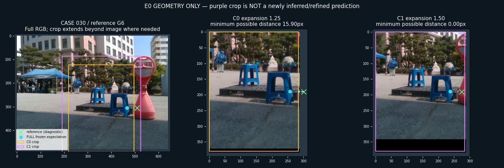

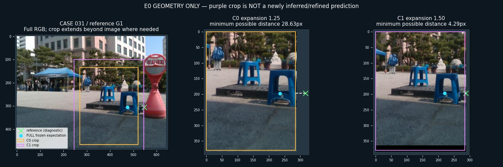

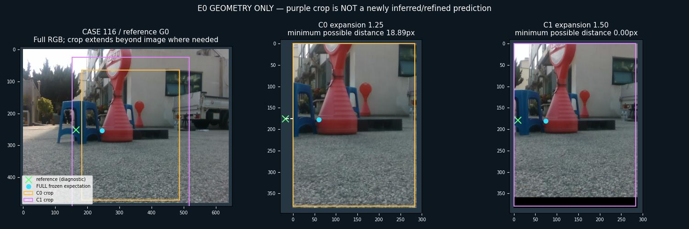

### still_unreachable

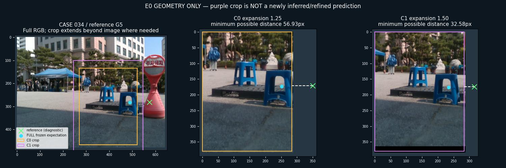

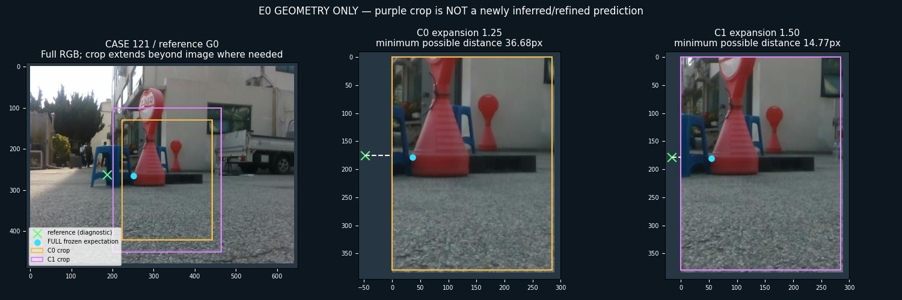

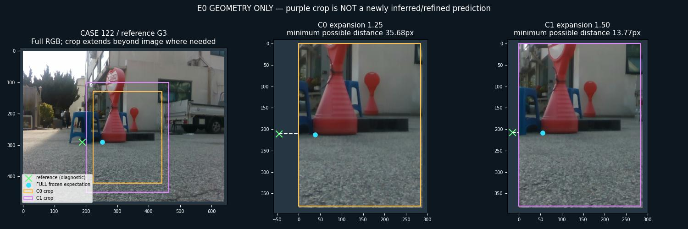

### deterministic_random_hard

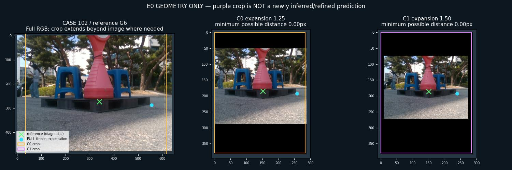

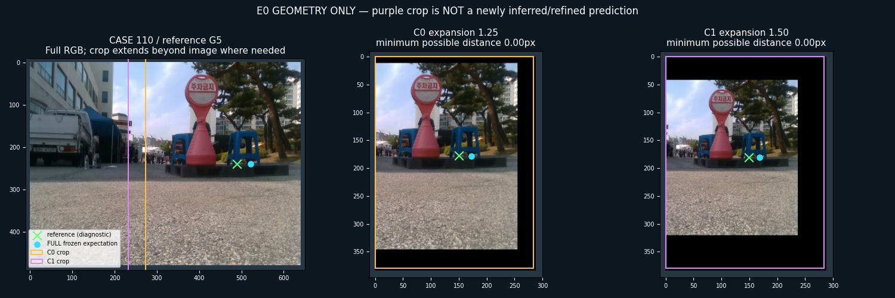

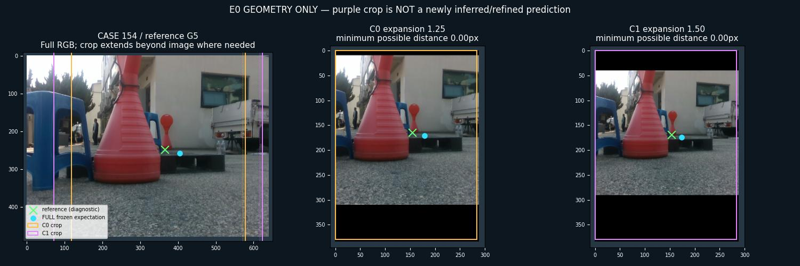

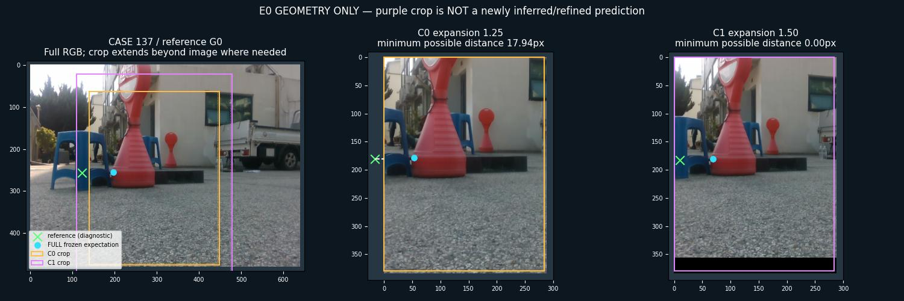

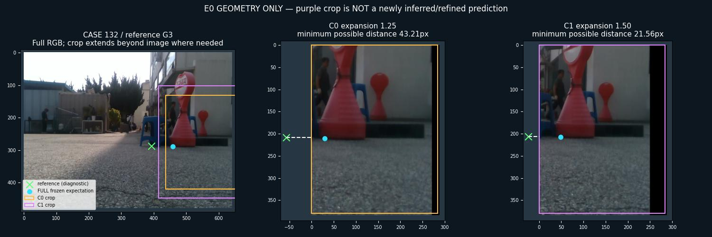

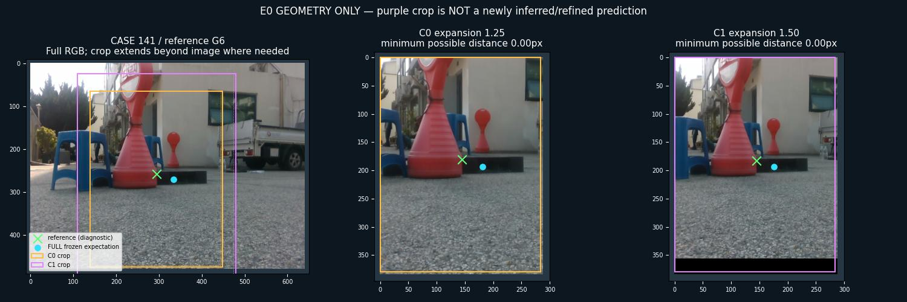

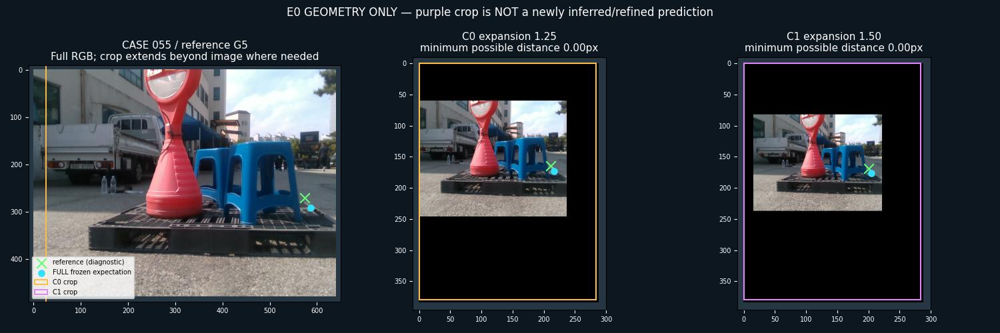

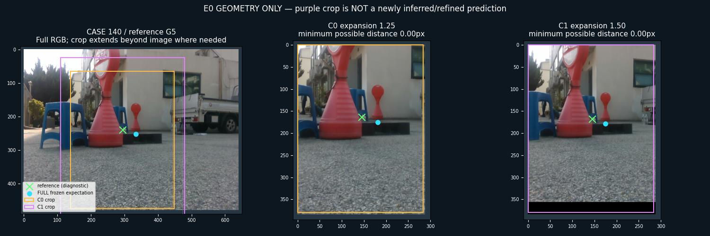

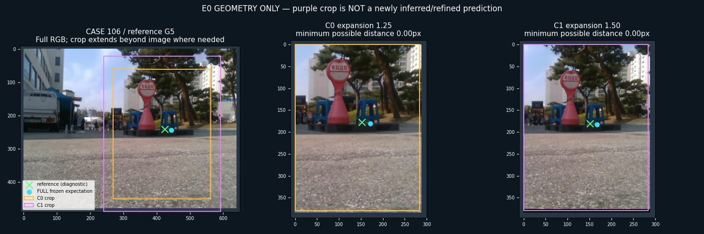

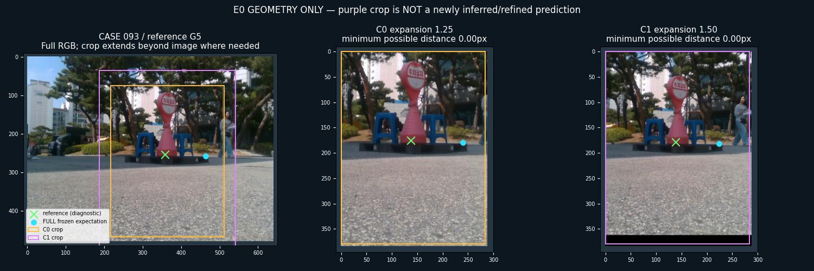

## 검증 및 미실행 범위

.............                                                            [100%]
13 passed in 6.02s

기존 보호 파일 1385개 SHA 불변. baseline parity, centered crop, inverse roundtrip, support 최소거리/단조성, old IDs, whole-object symmetry, native↔canonical mapping, frozen cache parity, 실패 분모 유지, 정확한 gate 및 overwrite 방지를 검사했다.

C1 training/source recrop 입력 검증·BN/update·새 출력평가 테스트는 gate 실패로 **NOT_RUN**이다. 통과로 표시하지 않는다. FIT/TRACE/새 예측/학습 후 heatmap 지표를 생성하지 않았다. 전체실험 완료는 E0-stop 경로 완료를 뜻한다.
