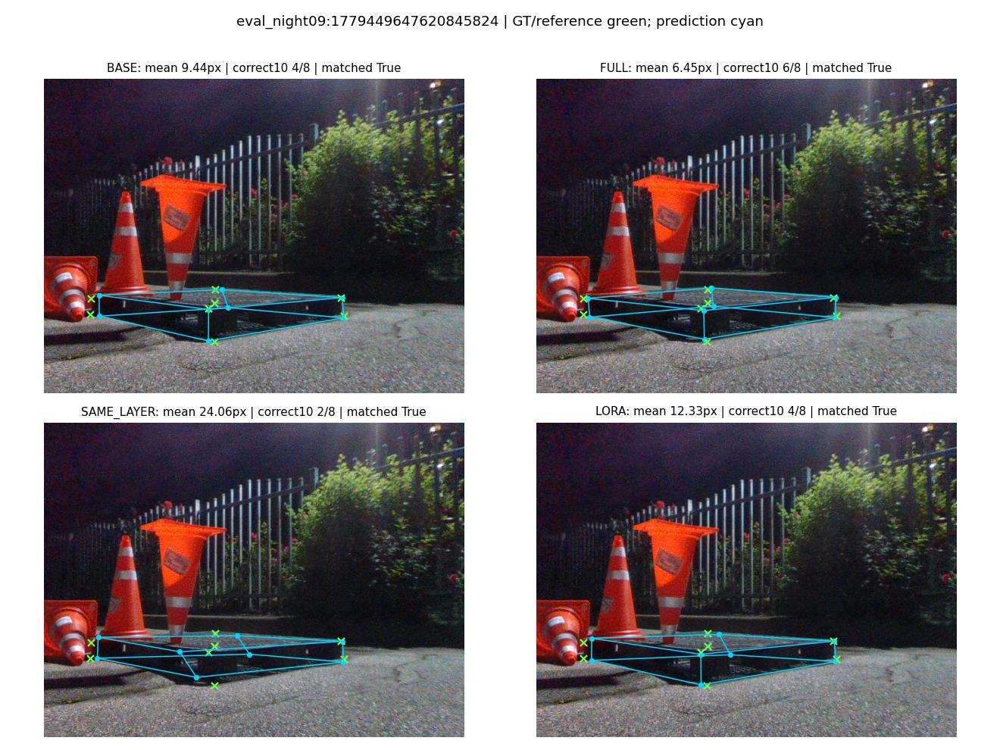
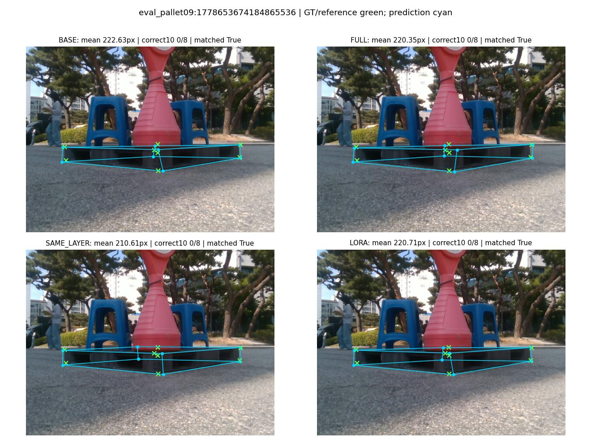
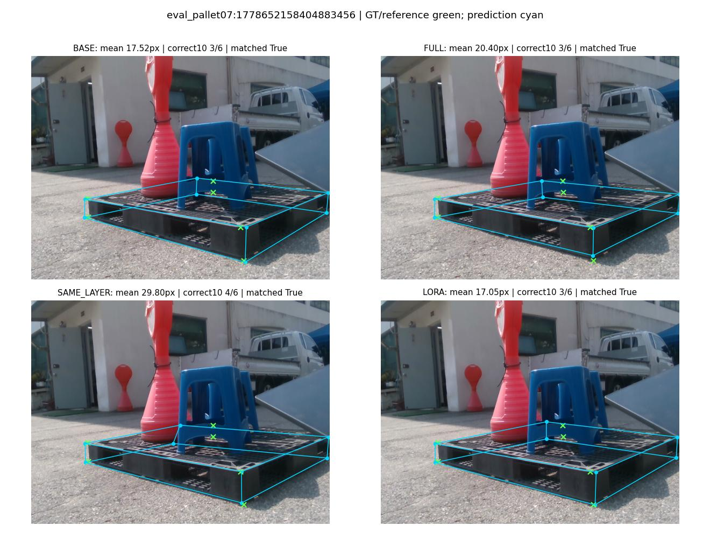
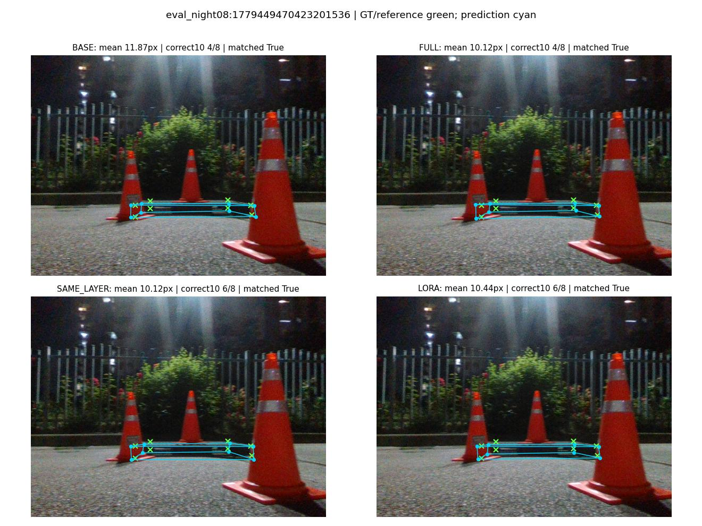
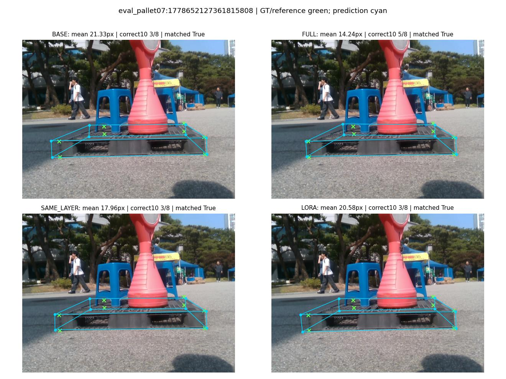
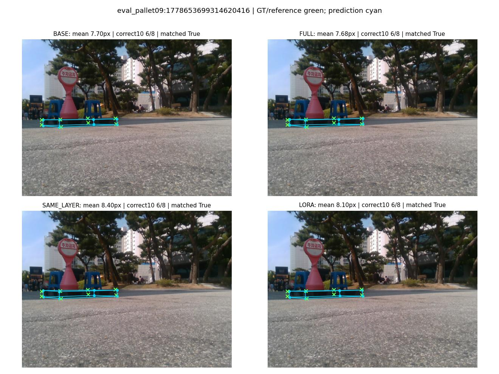
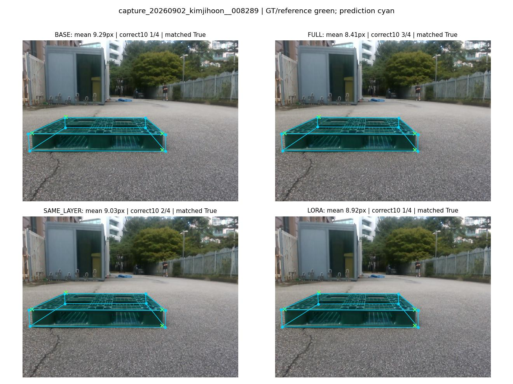

# FULL / SAME_LAYER / LoRA 결정 파일럿 결과

**결론: INCONCLUSIVE**. No predeclared positive route is supported; no rescue LR/rank run authorized.

이번 설정에서 **LoRA 계속 진행 gate는 실패**했다. FULL 대비 손실은 일부 줄었지만 hard recovery를 유지하지 못했다. 최종 route INCONCLUSIVE는 학습·평가를 못했다는 뜻이 아니라, 후속 원인을 보존 목표·표현/기하·데이터 다양성 중 하나로 확정할 근거가 부족하다는 뜻이다.

## 설정과 해석 범위

실제 세 조건 각각300updates, real2400/source2400노출을 수행했다. 같은PRIOR1, seed1, TFAdam1e-4, real8/source8/micro2, 동일253개OCC 입력·clean pseudo target·mask·augmentation·순서다. LoRA r4/alpha4, preserve/HEAD_ONLY/selector/student self-training 미사용. BN 통계·affine은모두고정했다.

253장은한촬영본의인접프레임이다. Replay teacher의동일recording노출이있고,학습이미지SHA와평가recording제외는기존E2그대로다. 실사가림대응은occlusion-tagged image population수준이다. 사람검토REVIEW_PENDING, 외부가림코너복원주장금지. GREEN은manual, 비초록은legacy reference이며합치지않는다.

원래 Conv weight L2는FULL/SAME_LAYER의trainable W에gradient를준다. LoRA base는frozen이며A/B penalty0이다. 원래losses의Conv순회는A/B도포함하므로명시적으로제외했다. 따라서same regularization strength실험이아니며single seed/reused DEV/LR비최적조건과함께한계다. 과거A11은참조전용이다.

## PRIMARY_OCC96 — 실제 93장

| method | PCK10% | PCK20% | matched median | P90 | >20px | 20–40→≤10 | BASE 정답 손실 | N2 정답 손실 | 검출/매칭/전체 |
|---|---|---|---|---|---|---|---|---|---|
| R0 | 43.20 | 64.94 | 10.962 | 51.536 | 250/713 | 0/99 | 52 | 50 | 93/85/93 |
| BASE | 47.69 | 67.04 | 9.638 | 52.649 | 235/713 | 0/99 | 0 | 29 | 93/85/93 |
| N2 | 49.09 | 68.02 | 9.448 | 51.193 | 228/713 | 0/99 | 19 | 0 | 93/85/93 |
| A11 | 49.09 | 67.46 | 9.098 | 53.536 | 232/713 | 9/99 | 26 | 41 | 93/85/93 |
| FULL | 50.35 | 67.88 | 8.554 | 53.178 | 229/713 | 6/99 | 17 | 31 | 93/85/93 |
| SAME_LAYER | 47.41 | 64.80 | 9.774 | 55.151 | 251/713 | 1/99 | 29 | 41 | 93/85/93 |
| LORA | 47.83 | 66.90 | 9.450 | 52.170 | 236/713 | 0/99 | 14 | 31 | 93/85/93 |

## PLASTIC194 — 실제 128장

| method | PCK10% | PCK20% | matched median | P90 | >20px | 20–40→≤10 | BASE 정답 손실 | N2 정답 손실 | 검출/매칭/전체 |
|---|---|---|---|---|---|---|---|---|---|
| R0 | 49.14 | 72.69 | 9.565 | 40.902 | 269/985 | 0/118 | 86 | 96 | 128/120/128 |
| BASE | 54.82 | 75.13 | 8.353 | 40.653 | 245/985 | 0/118 | 0 | 57 | 128/120/128 |
| N2 | 57.66 | 76.45 | 8.311 | 40.793 | 232/985 | 0/118 | 29 | 0 | 128/120/128 |
| A11 | 57.46 | 75.53 | 7.659 | 41.302 | 241/985 | 10/118 | 37 | 59 | 128/120/128 |
| FULL | 57.56 | 75.53 | 7.526 | 41.265 | 241/985 | 6/118 | 32 | 56 | 128/120/128 |
| SAME_LAYER | 52.79 | 72.49 | 8.514 | 45.413 | 271/985 | 1/118 | 51 | 88 | 128/120/128 |
| LORA | 53.91 | 74.72 | 8.474 | 41.641 | 249/985 | 0/118 | 29 | 69 | 128/120/128 |

## GREEN150_MANUAL — 실제 150장

| method | PCK10% | PCK20% | matched median | P90 | >20px | 20–40→≤10 | BASE 정답 손실 | N2 정답 손실 | 검출/매칭/전체 |
|---|---|---|---|---|---|---|---|---|---|
| R0 | 82.23 | 88.99 | 4.580 | 9.213 | 75/681 | 0/3 | 8 | 5 | 150/134/150 |
| BASE | 80.18 | 89.43 | 3.953 | 10.172 | 72/681 | 0/3 | 0 | 17 | 150/134/150 |
| N2 | 81.35 | 89.28 | 4.122 | 9.749 | 73/681 | 0/3 | 9 | 0 | 150/134/150 |
| A11 | 79.74 | 88.84 | 3.982 | 10.273 | 76/681 | 0/3 | 18 | 26 | 150/134/150 |
| FULL | 79.15 | 88.84 | 4.042 | 10.387 | 76/681 | 0/3 | 19 | 29 | 150/134/150 |
| SAME_LAYER | 77.97 | 85.90 | 3.972 | 11.621 | 96/681 | 1/3 | 30 | 36 | 150/134/150 |
| LORA | 79.74 | 89.28 | 3.742 | 10.357 | 73/681 | 1/3 | 9 | 18 | 150/134/150 |

## DEV72_REFERENCE_UNKNOWN — 실제 72장

| method | PCK10% | PCK20% | matched median | P90 | >20px | 20–40→≤10 | BASE 정답 손실 | N2 정답 손실 | 검출/매칭/전체 |
|---|---|---|---|---|---|---|---|---|---|
| R0 | 53.51 | 71.89 | 9.381 | 51.375 | 156/555 | 0/79 | 39 | 39 | 72/72/72 |
| BASE | 57.84 | 75.68 | 7.684 | 50.524 | 135/555 | 0/79 | 0 | 20 | 72/72/72 |
| N2 | 59.46 | 75.14 | 7.831 | 50.910 | 138/555 | 0/79 | 11 | 0 | 72/72/72 |
| A11 | 60.72 | 75.68 | 7.566 | 52.851 | 135/555 | 9/79 | 16 | 24 | 72/72/72 |
| FULL | 60.90 | 75.68 | 7.244 | 52.362 | 135/555 | 6/79 | 13 | 22 | 72/72/72 |
| SAME_LAYER | 59.10 | 74.59 | 7.424 | 53.604 | 141/555 | 1/79 | 15 | 22 | 72/72/72 |
| LORA | 58.56 | 75.32 | 7.775 | 50.280 | 137/555 | 0/79 | 6 | 19 | 72/72/72 |

## CLEAN_NONCAD69 — 실제 17장

| method | PCK10% | PCK20% | matched median | P90 | >20px | 20–40→≤10 | BASE 정답 손실 | N2 정답 손실 | 검출/매칭/전체 |
|---|---|---|---|---|---|---|---|---|---|
| R0 | 88.24 | 97.06 | 4.394 | 10.401 | 4/136 | 0/4 | 8 | 8 | 17/17/17 |
| BASE | 92.65 | 97.79 | 3.991 | 8.636 | 3/136 | 0/4 | 0 | 2 | 17/17/17 |
| N2 | 93.38 | 97.06 | 3.750 | 8.642 | 4/136 | 0/4 | 1 | 0 | 17/17/17 |
| A11 | 91.91 | 97.79 | 4.064 | 8.783 | 3/136 | 1/4 | 3 | 4 | 17/17/17 |
| FULL | 90.44 | 98.53 | 4.221 | 9.434 | 2/136 | 0/4 | 4 | 5 | 17/17/17 |
| SAME_LAYER | 93.38 | 97.79 | 3.923 | 8.808 | 3/136 | 0/4 | 0 | 1 | 17/17/17 |
| LORA | 93.38 | 98.53 | 4.010 | 8.553 | 2/136 | 0/4 | 0 | 1 | 17/17/17 |

## CAD18 — 실제 18장

| method | PCK10% | PCK20% | matched median | P90 | >20px | 20–40→≤10 | BASE 정답 손실 | N2 정답 손실 | 검출/매칭/전체 |
|---|---|---|---|---|---|---|---|---|---|
| R0 | 41.18 | 88.97 | 10.990 | 20.279 | 15/136 | 0/15 | 26 | 38 | 18/18/18 |
| BASE | 54.41 | 94.85 | 9.829 | 18.584 | 7/136 | 0/15 | 0 | 26 | 18/18/18 |
| N2 | 66.91 | 100.00 | 8.690 | 13.891 | 0/136 | 0/15 | 9 | 0 | 18/18/18 |
| A11 | 66.91 | 95.59 | 7.954 | 17.185 | 6/136 | 0/15 | 8 | 14 | 18/18/18 |
| FULL | 62.50 | 92.65 | 7.861 | 18.544 | 10/136 | 0/15 | 11 | 20 | 18/18/18 |
| SAME_LAYER | 40.44 | 87.50 | 12.154 | 20.893 | 17/136 | 0/15 | 22 | 46 | 18/18/18 |
| LORA | 46.32 | 91.91 | 10.743 | 19.083 | 11/136 | 0/15 | 15 | 37 | 18/18/18 |

## PRIMARY 복구–보존 비교

| method | PCK10 ΔBASE pp | >20→≤10 | 20–40→≤10 | >40→≤10 | BASE 유지/손실 | N2 유지/손실 | R0<5→>10 | B1 BASE 손실 | B2 BASE 손실 |
|---|---|---|---|---|---|---|---|---|---|
| BASE | +0.000 | 0 | 0 | 0 | 340/0 | 321/29 | 0 | 0 | 0 |
| N2 | +1.403 | 0 | 0 | 0 | 321/19 | 350/0 | 0 | 5 | 14 |
| FULL | +2.665 | 6 | 6 | 0 | 323/17 | 319/31 | 1 | 12 | 4 |
| SAME_LAYER | -0.281 | 1 | 1 | 0 | 311/29 | 309/41 | 6 | 14 | 9 |
| LORA | +0.140 | 0 | 0 | 0 | 326/14 | 319/31 | 0 | 7 | 7 |

B1=(5,10], B2=(10,20], B3=(20,40], B4>40 matched, B5는매칭실패우선. R1의>20분모에는실패벌점도포함하며B3/B4복구분모에서는제외한다. P4인R0 B1전체>10수와각reference의B1/B2손실, recovery rate·평균/중앙오차변화는JSON에모두있다.

| R0 band | corners | FULL 정답10 | SAME 정답10 | LoRA 정답10 |
|---|---|---|---|---|
| B0 | 116 | 115 | 110 | 116 |
| B1 | 192 | 166 | 166 | 171 |
| B2 | 155 | 72 | 61 | 54 |
| B3 | 99 | 6 | 1 | 0 |
| B4 | 97 | 0 | 0 | 0 |
| B5_MATCH_FAILURE | 54 | 0 | 0 | 0 |

## 합성 heldout256 — 학습행과분리

| method | input | PCK10% | PCK20% | median | P90 | 복구/hard |
|---|---|---|---|---|---|---|
| BASE | clean | 94.02 | 97.53 | 1.346 | 6.655 | 1/64 |
| BASE | stress | 19.54 | 47.77 | 21.186 | 49.928 | 56/1292 |
| FULL | clean | 91.35 | 96.44 | 1.878 | 9.123 | 1/64 |
| FULL | stress | 67.71 | 85.36 | 5.025 | 25.453 | 743/1292 |
| SAME_LAYER | clean | 92.38 | 97.03 | 1.605 | 8.020 | 2/64 |
| SAME_LAYER | stress | 36.45 | 65.13 | 13.978 | 38.515 | 239/1292 |
| LORA | clean | 93.52 | 97.33 | 1.415 | 6.936 | 3/64 |
| LORA | stress | 23.10 | 52.82 | 18.733 | 46.814 | 88/1292 |

## 사전 gate 및 질문별 답

| gate | SAME_LAYER | LORA |
|---|---|---|
| PCK10_within_half_pp | False | False |
| B3_recovery_at_least_80pct | False | False |
| fewer_BASE_correct_losses | False | True |
| source_clean_within_one_pp | False | True |
| P90_within_5pct | True | True |
| GREEN_BASE_correct_losses_no_worse | False | True |

- FULL: B3 복구 6개, FULL 대비 100.0%; BASE 정답 손실 17, N2 정답 손실 31.

- SAME_LAYER: B3 복구 1개, FULL 대비 16.7%; BASE 정답 손실 29, N2 정답 손실 41.

- LORA: B3 복구 0개, FULL 대비 0.0%; BASE 정답 손실 14, N2 정답 손실 31.

SAME_LAYER는 FULL이 잃은 BASE 정답 중 11개를 보존했고, 반대로 FULL이 유지한 BASE 정답 23개를 새로 잃었다.

LORA는 FULL이 잃은 BASE 정답 중 14개를 보존했고, 반대로 FULL이 유지한 BASE 정답 11개를 새로 잃었다.

LoRA−SAME_LAYER PCK10 +0.421pp, B3 복구차 -1, BASE 정답 손실차 -15. 강한후보신호=False, 사전근사동등=False. 단일seed에서low-rank인과효과나일반우월성을확정하지않는다.

손상감소만으로성공이아니다. FULL대비복구80%유지gate와전체PCK/P90/source/GREEN을동시에적용했다. 이gate를못넘으면덜적응한효과를배제하지못한다. 다음route는위결론한개뿐이며LR/rank구제실험을실행하지않는다.

## 좋은·나쁜·고정랜덤 이미지

[전체 갤러리](GALLERY.html). 초록× GT/reference, 청록 예측. 모든arm은같은이미지이며오차는고정whole-object분기의canonical좌표다. 대표선정은사후진단이고학습/선정gate에는사용하지않았다.

### FULL_better

### SAME_LAYER_better

### LORA_better

### LORA_preservation_win

### LORA_recovery_loss

### random_primary_seed1

### random_GREEN_seed1

## 재현·감사

상세 원본 JSON과 감사 메타데이터는 로컬에 보존한다. 이 공개 보고서에는 집계 표와 비교 이미지를 포함했으며 checkpoint·비공개 검토 매핑·개별 응답은 포함하지 않았다.

모든예측을먼저동결한뒤GT평가했다. center/bbox/score/candidate보존, source/real실제순서·타깃·mask·corruption해시일치, BN및frozen parameter불변, checkpoint마지막300만검증했다. 기존 artifact 변경 0은 진단 종료 시점에 검증했다. 이후 사용자의 명시적 공개 요청에 따라 이 보고서·갤러리·이미지만 commit/push한다. 기존 감사 기록은 덮어쓰지 않는다.
