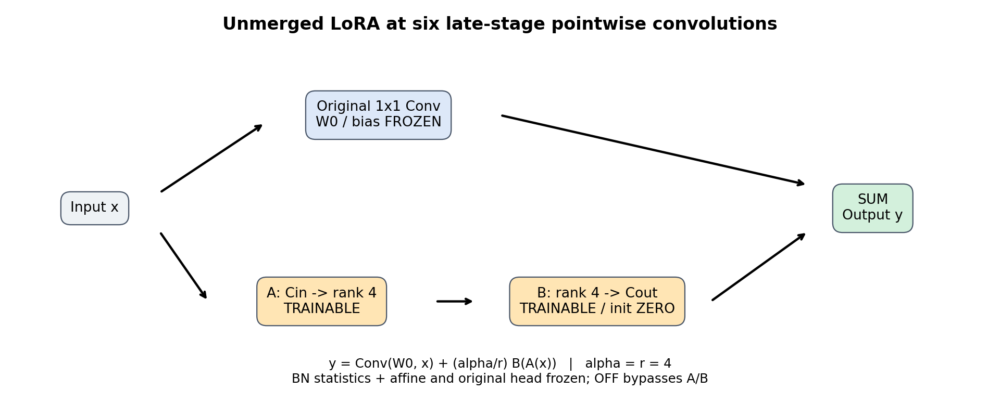
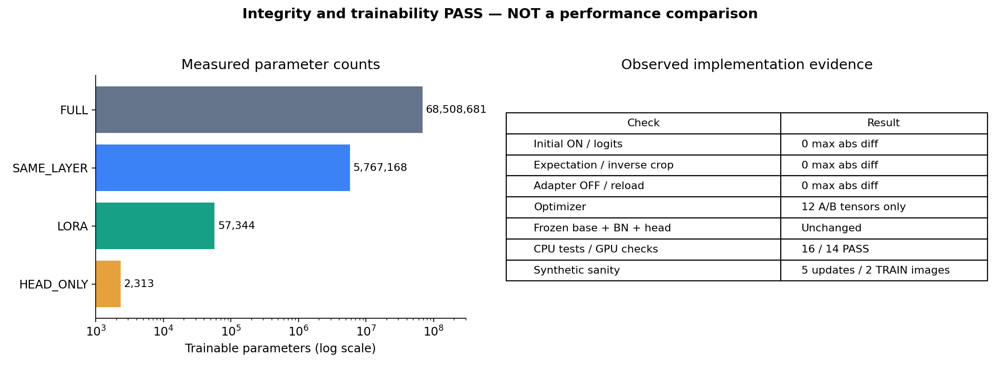
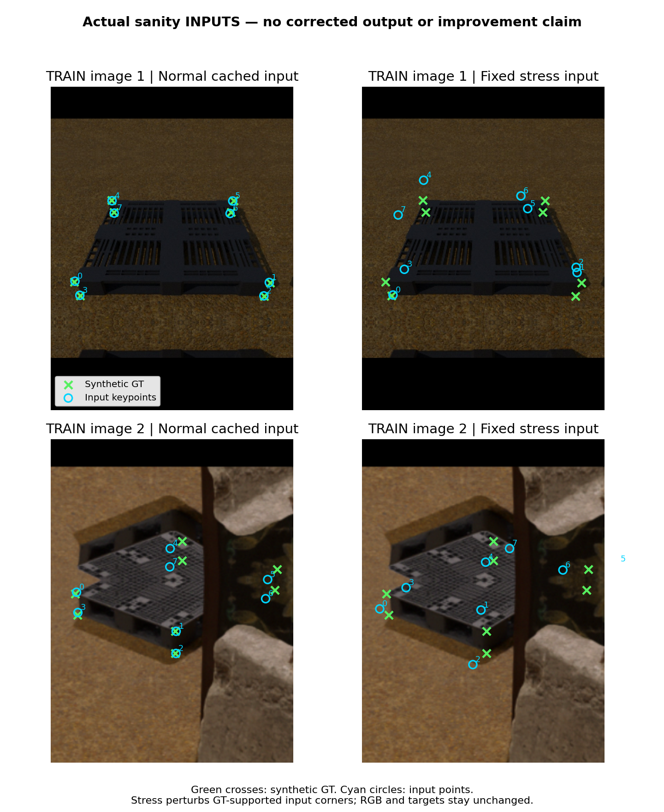

# PoseFix LoRA 구현·검증 결과 — 이미지 보고

**LoRA performance not evaluated yet.** 이번에 확인한 것은 구현 무결성과 소량 합성 데이터에서의 학습 가능성이다. 실사 적응이나 fullFT 대비 성능 비교는 아직 하지 않았다.

## 1. 무엇을 만들었나

기존 synthetic-only PRIOR1 PoseFix의 후기 1×1 Conv2d 여섯 개에 unmerged LoRA를 넣었다. 원래 Conv를 그대로 참조하며 base weight를 재초기화하거나 merge하지 않는다.

- 대상: `blocks.3.{0,1,2}.{conv1,conv3}.conv` — 총 6개 층.
- A는 비영 초기화, B는 0 초기화. r=4, alpha=4이므로 scale=1.
- LoRA 조건에서는 A/B만 학습하며, 원래 weight·bias·head·BN 통계와 affine은 고정한다.
- 여섯 층은 첫 제한적 후보 집합이지 최적 조합으로 입증된 것이 아니다.

## 2. 검사 결과

| 검사 | 실제 결과 |
|---|---|
| 원본 checkpoint CPU strict load | tensor equality 통과 |
| LoRA 초기 ON logits / expectation / 역변환 좌표 | 최대 차이 **0** |
| 임의 adapter 값에서 OFF | 원본 출력과 차이 **0** |
| 학습된 adapter 저장·복원 | 출력 차이 **0** |
| optimizer | A/B 12개 tensor만 포함 |
| BN 158개, base, head | 최종 상태 hash 동일 |
| gradient | 처음 B 양수·A=0, 1-step 후 A/B 모두 양수 |
| 자동 검사 | CPU 16개 + 전체 GPU 14항목 통과 |

center·bbox·score·candidate pass-through도 production predict 함수에 합성 RGB와 cached 예측 fixture를 넣어 확인했다. 검출기를 새로 실행한 검사는 아니다.

| 비교 조건 | 실제 trainable parameter 수 |
|---|---:|
| FULL — 원래 convolution/head, BN 고정 | 68,508,681 |
| SAME_LAYER — 같은 6개 층의 원래 W | 5,767,168 |
| LoRA — 같은 6개 층의 A/B | **57,344** |
| HEAD_ONLY — out W+bias | 2,313 |

작은 파라미터 수나 adapter OFF 복원은 adapter ON 성능 보존을 보장하지 않는다. SAME_LAYER 대조군을 통해 학습 위치 제한과 low-rank 제약의 효과를 분리할 계획이다.

## 3. 실제 합성 mini-sanity에 사용한 이미지

아래는 잠긴 source order에서 선택한 **합성 TRAIN 2장**의 실제 입력이다. 초록 ×는 합성 GT, 하늘색 ○는 입력 keypoint다. 오른쪽 stress는 RGB나 GT를 바꾸지 않고 입력점을 교란한 경우다.

**이 그림은 보정 전후 비교가 아니다.** 구현 검사에서 어떤 데이터를 넣었는지 보여주는 그림이며, 실사 개선이나 LoRA 성능 향상을 뜻하지 않는다.

| 소량 검사 항목 | 결과 |
|---|---|
| optimizer updates | 5회, LoRA-only |
| 입력 노출 | normal 5회 + stress 5회 |
| 실사 노출 | 0회 |
| loss | 전 step finite |
| adapter | 파라미터 변경 확인 |
| normal / stress 최대 logit 변화 | 0.005493 / 0.007449 |
| base·BN·head | 변경 없음 |
| OFF 복원·저장/재로드 | exact |

이 검사의 PASS는 **학습 경로가 살아 있다**는 의미다. loss 감소나 평가 정확도 향상을 성공 조건으로 삼지 않았다. preserve loss도 이 검사에는 사용하지 않았다.

## 4. 검사 중 발견해 수정한 문제

첫 두 진단에서는 adapter-only state를 전체 모델에 `load_state_dict(..., strict=False)`로 불러올 때 BN의 호환 처리로 `num_batches_tracked`가 6000에서 0으로 초기화됐다. eval 출력은 같아서 출력만 비교하면 놓칠 수 있는 문제였다.

A/B key·shape·dtype을 확인한 뒤 해당 tensor에만 직접 복사하도록 수정했다. BN 카운터가 6000인 회귀검사를 추가했고 세 번째 전체 GPU 검사는 상태 hash까지 통과했다. 원래 disk checkpoint는 변경되지 않았다.

총 optimizer 실행은 실패 진단 2회 + 성공 진단 1회 + 합성 sanity 5회 = **8회**다. 이를 실사 학습이나 성능 실험 횟수로 세지 않는다.

## 5. 보존 손실과 다음 실행 조건

보존 대상은 **normal synthetic TRAIN에서 frozen base의 오차가 ≤5px인 유효 corner0..7**이다. T=1 spatial KL(teacher distribution || student distribution), teacher stop-gradient, center 제외, 빈 mask는 0이다. heldout/eval·실사·stress 입력은 보존 mask에서 거부한다. 기존 source GT replay와는 별도 손실이다.

| 항목 | 상태 |
|---|---|
| rank / alpha / LR | 4 / 4 / 1e-4, 사전 고정 pilot 제안 |
| 보존 손실 lambda | **미정** |
| source-native GT의 whole-object 매핑 승인 | **미완료** |
| 사람 블라인드 검토 | **REVIEW_PENDING** |
| 실사·전체 파일럿 | **NO-GO**, 별도 RUN_APPROVED 필요 |

기존 A11은 BN affine을 학습했으므로 이번 BN 전체 고정 FULL 대조군으로 재사용하지 않는다. 다음 비교는 같은 PRIOR1에서 FULL / SAME_LAYER / LoRA, 각각의 preserve 유무, HEAD_ONLY로 설계했다. 같은 DEV를 보고 LR·rank·lambda를 바꾸는 구제 탐색은 하지 않는다.

## 6. 공개 범위와 근거

[공개용 수치 요약](publication/PUBLIC_EVIDENCE.json)은 이미 완료된 검사에서 가져왔다. 이번 이미지 제작 과정에서는 모델 forward·새 학습을 실행하지 않았다. 이미지와 도표는 저장된 검사 결과 및 잠긴 합성 입력을 사용했다.

원본 641개 보호 파일의 변경 없음은 이전 종료 감사에서 확인했다. 당시 `commit=false/push=false` 기록은 그대로 보존하고, 이후 사용자의 명시적 요청에 따라 이 이미지 보고서를 공개한다. 이번 push는 보고서·그림·공개용 수치만 포함한다. checkpoint·비공개 매핑·원본 경로 및 개인 응답 관련 감사 메타데이터·관련 없는 작업은 포함하지 않는다.
