# Recording-disjoint CLEAN→NATURAL-HARD transfer

## 1. 한 줄 결론

TRANSFER_DECISION: **SEVERE_ONLY_TRANSFER_SIGNAL**. ROLE_CONVENTION_STATUS: **ROLE_MISMATCH_REPEATED**.

**S1의 추가 랜덤 가림은 다른 recording의 심한 가림에서 평균적인 2D·후보·실제 자세 성능을 개선했지만, 중간 가림과 Clean까지 좋아지는 방법은 아니었다.** 심한 가림의 matched P90도 악화했으므로 모든 꼬리 오류가 줄었다고 하지 않는다.

기존 frozen 모델 재사용: 신규 학습0 / 재현 fit0 / 신규 신경망 추론0. 128장×3모델의 production D9 자세와 두 W/D 후보를 GT 없이 재계산·잠근 뒤 채점했다.

## 2. 왜 이 실험이 필요한가

기존 ALL300은 같은 training recording도 포함한 반복 DEV였다. 이번 비교는 기존 고정 HELDOUT128을 그대로 사용한다. 학습에 쓰지 않은 recording으로의 전이를 묻지만, 이미 열람된 재사용 DEV이며 독립 final TEST가 아니다. 원본319장·기존 결과·어노테이션·checkpoint를 고치지 않았다.

## 3. causal pair integrity

상태 `CAUSAL_PAIR_VERIFIED`. PLASTIC S0/S1은 original R0 초기값, Clean10 이미지, 교사 좌표·mask, synthetic512, epoch/slot/출처 순서, 초기 trainable inventory, AdamW/학습률/seed/업데이트를 공유한다. 각각5epoch·320update·batch/nbs16·640·seed42·lr1e-4/lrf0.1/cosine·last checkpoint다.

학습 실제 trace와 cache **5120개**를 전수 재검증했다. S0/S1 RGB를 기존 코드로 재구성해 실제 입력 SHA와 대조했다. 변경은 실사2560회 중 **730회(28.52%)**에만 있었고 합성2560회는 같았다. 좌표·visibility mask·bbox는 같았다.

중요한 구현 범위: S1은 감독점 coverage 조건과 기존 S2 placement와의 짝짓기 가능 조건을 통과한 위치에만 랜덤 사각형 fill을 넣는다. 따라서 **무조건적인 랜덤 erasing 전체의 효과가 아니라 이 고정 조건부 정책의 효과**다. S2를 새로 실행하거나 평가하지 않았다. 실제 저장 args도 name/save_dir 이외 동일함을 별도 감사했다.

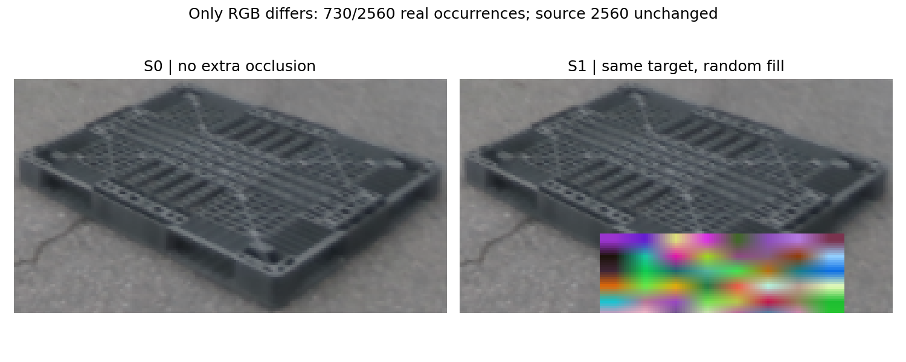

[pair 감사](PAIR_INTEGRITY.json) · [checkpoint 해시](CHECKPOINT_PROVENANCE.json) · [실제 runtime args 감사](PAIR_RUNTIME_ARGS.json)

## 4. recording disjointness

| 역할 | 고유 이미지 | recording |
|---|---|---|
| 학습 | 10 | REC_001, REC_002 |
| 평가 | 128 | REC_007, REC_021, REC_022, REC_025, REC_027, REC_041, REC_044 |

recording 교집합 0, image SHA 교집합 0. 기존 grayscale64×48 MAD≤2/255 검사 재확인: 최소MAD 33.5176, 겹침0. 근접중복 검사는 장면 독립성의 완전한 증명이 아니다.

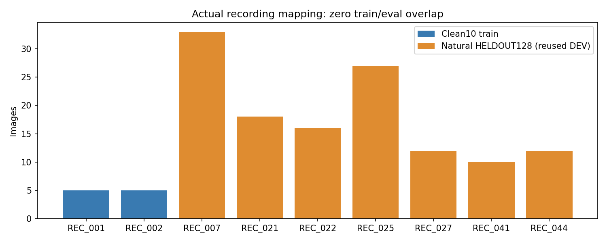

## 5. H10 role prevalence

기존 H10, common/direct support 총36점만 검사했다. 사전 규칙은 n≥3 AND 같은ID 평균>20px AND 전체 C4 최소평균≤10px. 점별 free matching·threshold sweep·GT수정은 없다.

| 프레임 | 공통점 | 모델 | 같은ID 평균px | 전체 C4 최소 | 최소 평균px | strong |
|---|---|---|---|---|---|---|
| plastic_day_01:011067 | 3 | TEACHER | 174.412 | YAW_90 | 3.462 | True |
| plastic_day_01:011067 | 3 | T1 | 174.143 | YAW_90 | 2.568 | True |
| plastic_day_01:011067 | 3 | T2 | 169.360 | YAW_90 | 4.461 | True |
| plastic_day_01:020954 | 4 | TEACHER | 65.763 | YAW_270 | 3.705 | True |
| plastic_day_01:020954 | 4 | T1 | 65.672 | YAW_270 | 5.052 | True |
| plastic_day_01:020954 | 4 | T2 | 0.912 | YAW_0 | 0.912 | False |

강한 신호 **2/10장**: plastic_day_01:011067, plastic_day_01:020954. 020954는 teacher/T1에 신호가 있고 T2는 같은ID로 맞춘다. 그러므로 모든 모델·GT가 동일 원인이라고 단정할 수 없다. 이 표는 학습 진단 표본이지 전체 평가셋의 오류 빈도가 아니다.

**180도 규약:** 직사각 팔레트의 물리적 C2(yaw180) 동치와 90/270 역할 좌표 변환(W/D swap)은 별개다. 앞서 A/B, C/D 각각180도 동치 쌍이라는 사용자 확인 내용을 유지한다. C4 사후 최소를 정답 수정이나 배포 성능으로 사용하지 않았다. 같은ID/6D 결과에는 convention warning을 남긴다.

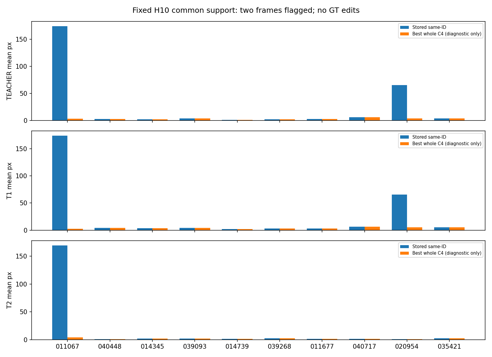

[H10 전수 표·metadata](H10_ROLE_PREVALENCE_KO.md)

## 6. Natural CLEAN

| 모델 | 장 / 점 | PCK5/10/20 % | PCK10 맞은점 | matched med/P90 px | >20 % | 검출/매칭 | CURRENT AUC | ORACLE AUC* | 선택손실 |
|---|---|---|---|---|---|---|---|---|---|
| R0 | 29 / 229 | 36.24/65.94/94.76 | 151/229 | 7.26 / 17.49 | 5.24 | 29/29 | 0.7147 | 0.7147 | 0.0000 |
| S0 | 29 / 229 | 37.99/60.26/89.96 | 138/229 | 7.66 / 19.56 | 10.04 | 29/29 | 0.7119 | 0.7119 | 0.0000 |
| S1 | 29 / 229 | 37.55/58.95/85.59 | 135/229 | 7.70 / 21.90 | 14.41 | 29/29 | 0.6986 | 0.6986 | 0.0000 |

| 모델 | R med/P90 ° | Yaw med/P90 ° | t med/P90 cm | IoU3D med/P90 | W/D parity | pose coverage |
|---|---|---|---|---|---|---|
| R0 | 1.611 / 3.461 | 0.633 / 1.191 | 2.930 / 8.400 | 0.697 / 0.820 | 29/29 | 29/29 |
| S0 | 1.513 / 3.043 | 0.648 / 1.172 | 4.297 / 7.409 | 0.663 / 0.800 | 29/29 | 29/29 |
| S1 | 1.573 / 3.172 | 0.408 / 1.337 | 4.707 / 7.038 | 0.619 / 0.755 | 29/29 | 29/29 |

S1−S0: PCK10 **-1.31%p**, CURRENT AUC **-0.01324**, ORACLE AUC **-0.01324**. 같은 정답ID 기준 ≤10→>10 손실 14점, >10→≤10 획득 11점, >20→≤10 복구 0점, <5→>10 손상 1점.

Clean에서 작은 정상 성능 손상을 지불했다. 추가 가림이 Clean을 보존했다고 단정하지 않는다. 합성source256 PCK10은 아래와 같이 개선됐지만 PCK5·PCK20은 조금 감소했다. 분모2028점은 source 유효점이며 실사와 합치지 않는다.

| 합성256 | PCK5 | PCK10 | PCK20 | median/P90 px |
|---|---|---|---|---|
| S0 | 78.01 | 90.68 | 96.70 | 2.44 / 9.53 |
| S1 | 76.63 | 91.47 | 96.65 | 2.46 / 9.07 |

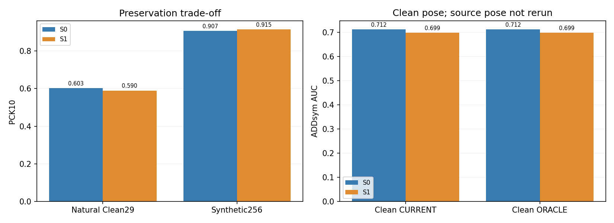

## 7. Natural MODERATE

| 모델 | 장 / 점 | PCK5/10/20 % | PCK10 맞은점 | matched med/P90 px | >20 % | 검출/매칭 | CURRENT AUC | ORACLE AUC* | 선택손실 |
|---|---|---|---|---|---|---|---|---|---|
| R0 | 21 / 154 | 16.23/58.44/86.36 | 90/154 | 9.12 / 24.12 | 13.64 | 21/21 | 0.4795 | 0.5631 | 0.0836 |
| S0 | 21 / 154 | 15.58/55.84/83.77 | 86/154 | 9.17 / 25.20 | 16.23 | 21/21 | 0.4641 | 0.5120 | 0.0479 |
| S1 | 21 / 154 | 17.53/55.84/85.06 | 86/154 | 9.35 / 22.48 | 14.94 | 21/21 | 0.4357 | 0.5406 | 0.1049 |

| 모델 | R med/P90 ° | Yaw med/P90 ° | t med/P90 cm | IoU3D med/P90 | W/D parity | pose coverage |
|---|---|---|---|---|---|---|
| R0 | 1.998 / 77.020 | 1.490 / 77.018 | 5.907 / 14.380 | 0.711 / 0.805 | 17/21 | 21/21 |
| S0 | 1.816 / 5.167 | 1.144 / 4.445 | 7.037 / 15.097 | 0.732 / 0.805 | 18/21 | 21/21 |
| S1 | 1.817 / 83.038 | 1.238 / 82.961 | 6.904 / 19.134 | 0.615 / 0.847 | 16/21 | 21/21 |

S1−S0: PCK10 **+0.00%p**, CURRENT AUC **-0.02843**, ORACLE AUC **+0.02862**. 같은 정답ID 기준 ≤10→>10 손실 10점, >10→≤10 획득 10점, >20→≤10 복구 0점, <5→>10 손상 0점.

후보 oracle은 좋아졌지만 실제 자세는 악화했다. 선택손실이 0.04786→0.10490으로 증가하고 W/D parity는18/21→16/21이다. PCK10은 동률이며 P90은 개선됐다. **현재 선택기의 이득 전달 실패 신호**이지, oracle 성능을 달성한 것이 아니다.

## 8. Natural SEVERE

| 모델 | 장 / 점 | PCK5/10/20 % | PCK10 맞은점 | matched med/P90 px | >20 % | 검출/매칭 | CURRENT AUC | ORACLE AUC* | 선택손실 |
|---|---|---|---|---|---|---|---|---|---|
| R0 | 78 / 602 | 16.11/40.37/60.80 | 243/602 | 11.42 / 53.73 | 39.20 | 78/70 | 0.1598 | 0.2653 | 0.1056 |
| S0 | 78 / 602 | 15.45/40.86/65.45 | 246/602 | 11.88 / 48.45 | 34.55 | 78/72 | 0.1448 | 0.2425 | 0.0977 |
| S1 | 78 / 602 | 16.78/43.52/66.61 | 262/602 | 11.25 / 54.31 | 33.39 | 78/73 | 0.1954 | 0.2799 | 0.0845 |

| 모델 | R med/P90 ° | Yaw med/P90 ° | t med/P90 cm | IoU3D med/P90 | W/D parity | pose coverage |
|---|---|---|---|---|---|---|
| R0 | 63.297 / 89.370 | 28.821 / 89.253 | 13.677 / 209.118 | 0.487 / 0.762 | 37/78 | 78/78 |
| S0 | 12.542 / 88.463 | 10.091 / 88.442 | 15.080 / 118.633 | 0.481 / 0.751 | 41/78 | 78/78 |
| S1 | 5.630 / 88.398 | 4.721 / 88.394 | 13.407 / 111.264 | 0.504 / 0.783 | 47/78 | 78/78 |

S1−S0: PCK10 **+2.66%p**, CURRENT AUC **+0.05062**, ORACLE AUC **+0.03745**. 같은 정답ID 기준 ≤10→>10 손실 17점, >10→≤10 획득 33점, >20→≤10 복구 9점, <5→>10 손상 2점.

2D PCK·candidate·current의 집계 방향은 모두 개선됐다. 다만 matched P90은48.45→54.31px로 악화했다. matched 집합도 변하므로 같은 점들 전체가 나빠졌다는 뜻은 아니며, [전체 벌점 포함 P90 및 매칭 분모](RESULTS.json)도 함께 보존했다. 통계적 유의성이나 모든 hard 이미지 개선을 주장하지 않는다.

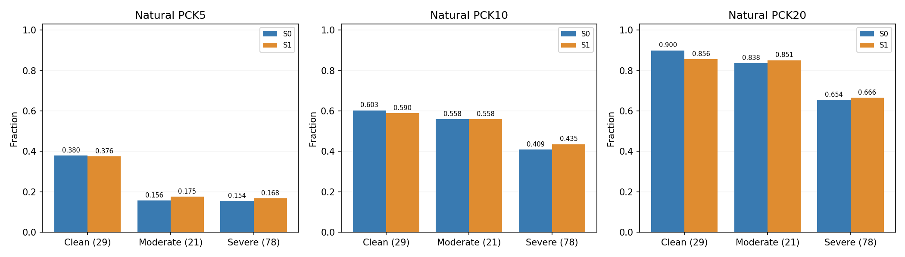


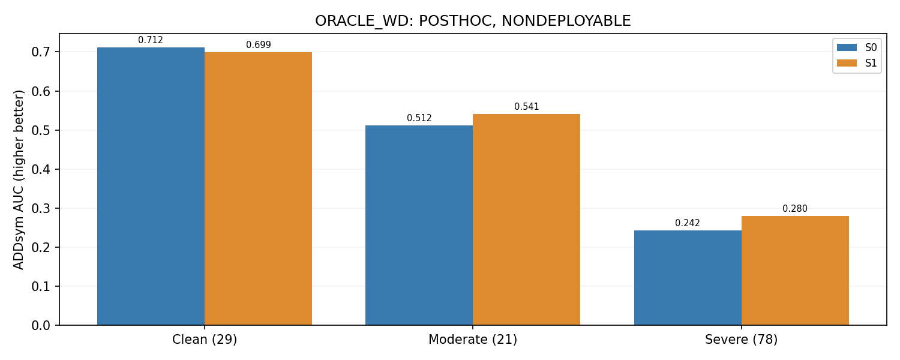

## 9. verified visible anchor

실제2점 QA를 완료한 FINAL_V2, HELDOUT 안의16장66개 DIRECT_VISIBLE만 사용했다. 미확인·PnP보완점을 정답으로 끼워 넣지 않았다. P0..P7 고정ID, symmetry-min 없음. PnP 보조 first pass와 선택 편향이 있는 작은 보조 표본으로 전체 운영분포나 독립6D GT가 아니다.

| 집단 | 모델 | PCK5 | PCK10 | PCK20 | median px | P90 px | >20점 |
|---|---|---|---|---|---|---|---|
| ALL | R0 | 21/66 | 44/66 | 60/66 | 7.144 | 18.390 | 6 |
| ALL | S0 | 22/66 | 42/66 | 59/66 | 7.365 | 20.358 | 7 |
| ALL | S1 | 22/66 | 41/66 | 61/66 | 7.033 | 17.453 | 5 |
| ALL | TEACHER | 30/66 | 54/66 | 63/66 | 5.202 | 13.409 | 3 |
| CLEAN | R0 | 13/30 | 22/30 | 29/30 | 5.648 | 12.391 | 1 |
| CLEAN | S0 | 12/30 | 22/30 | 29/30 | 5.987 | 14.711 | 1 |
| CLEAN | S1 | 13/30 | 22/30 | 29/30 | 5.645 | 13.949 | 1 |
| CLEAN | TEACHER | 22/30 | 28/30 | 30/30 | 3.948 | 6.839 | 0 |
| MODERATE | R0 | 5/22 | 15/22 | 21/22 | 7.673 | 16.824 | 1 |
| MODERATE | S0 | 6/22 | 12/22 | 19/22 | 9.345 | 21.125 | 3 |
| MODERATE | S1 | 5/22 | 11/22 | 21/22 | 9.114 | 16.511 | 1 |
| MODERATE | TEACHER | 6/22 | 18/22 | 21/22 | 5.662 | 10.252 | 1 |
| SEVERE | R0 | 3/14 | 7/14 | 10/14 | 12.459 | 56.616 | 4 |
| SEVERE | S0 | 4/14 | 8/14 | 11/14 | 8.261 | 28.905 | 3 |
| SEVERE | S1 | 4/14 | 8/14 | 11/14 | 7.533 | 23.374 | 3 |
| SEVERE | TEACHER | 2/14 | 8/14 | 12/14 | 9.623 | 50.465 | 2 |
| HARD | R0 | 8/36 | 22/36 | 31/36 | 8.571 | 21.535 | 5 |
| HARD | S0 | 10/36 | 20/36 | 30/36 | 9.091 | 22.321 | 6 |
| HARD | S1 | 9/36 | 19/36 | 32/36 | 7.931 | 19.445 | 4 |
| HARD | TEACHER | 8/36 | 26/36 | 33/36 | 7.313 | 13.977 | 3 |

Hard visible36점에서 S0 20→S1 19점(10px 이내), teacher26점이다. S1은 median/P90/>20은 개선됐으나 PCK10은1점 감소했다. 작은 보조표에서 전반적 우월을 선언하지 않는다. Severe14점은8→8로 동률이다.

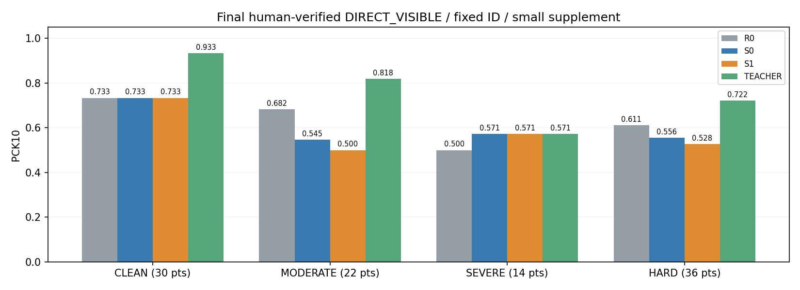

## 10. historical ALL300와 비교

기존 RESULTS.json에서 자동으로 읽었다. 전체300에는 목재가 포함되므로 plastic184의 방향도 병기한다. recording-heldout128은 그 일부이자 반복 DEV이다. 아래는 **방향 비교**이지 새 데이터에서의 독립 재현이나 동일 분모 성능 차이가 아니다.

| 난도 | 집단 | 장 | S1−S0 PCK10 %p | S1−S0 CURRENT AUC | 방향판정 |
|---|---|---|---|---|---|
| ALL | historical | 300 | 1.619 | 0.01271 | 문맥용 |
| ALL | historical plastic | 184 | 2.442 | 0.01992 | 문맥용 |
| ALL | heldout | 128 | 1.320 | 0.02318 | REPLICATED_ACROSS_RECORDINGS |
| CLEAN | historical | 132 | 0.190 | 0.01884 | 문맥용 |
| CLEAN | historical plastic | 59 | 0.640 | 0.00097 | 문맥용 |
| CLEAN | heldout | 29 | -1.310 | -0.01324 | SAME_SESSION_ONLY_OR_UNSTABLE |
| MODERATE | historical | 87 | 2.981 | -0.03109 | 문맥용 |
| MODERATE | historical plastic | 44 | 4.734 | -0.00962 | 문맥용 |
| MODERATE | heldout | 21 | 0.000 | -0.02843 | MIXED |
| SEVERE | historical | 81 | 2.556 | 0.04977 | 문맥용 |
| SEVERE | historical plastic | 81 | 2.556 | 0.04977 | 문맥용 |
| SEVERE | heldout | 78 | 2.658 | 0.05062 | REPLICATED_ACROSS_RECORDINGS |

중간 가림은 기존 PCK 개선이 heldout에서 사라졌고 실제 자세 악화 방향은 남았다. 심한 가림의 PCK·CURRENT 개선 방향은 다른 recording에서도 유지됐다. Clean은 기존의 개선 방향이 하락으로 바뀌었다. “방향 재현”에는 악화 방향의 재현도 포함하며 성공이라는 뜻이 아니다.

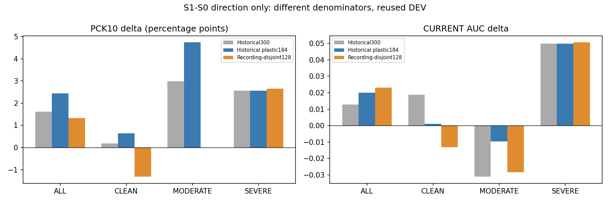

## 11. 병목 분해

L1: 심한 가림 PCK 개선은 남지만 중간 PCK10은 동률, Clean은 손상. L2: 중간·심함의 oracle 후보 품질은 개선. L3: 심함에서는 이득이 전달되지만 중간에서는 선택손실 증가가 후보 이득을 상쇄한다. 따라서 모든 실패를 학생 표현력이나 selector 하나로 환원할 수 없다.

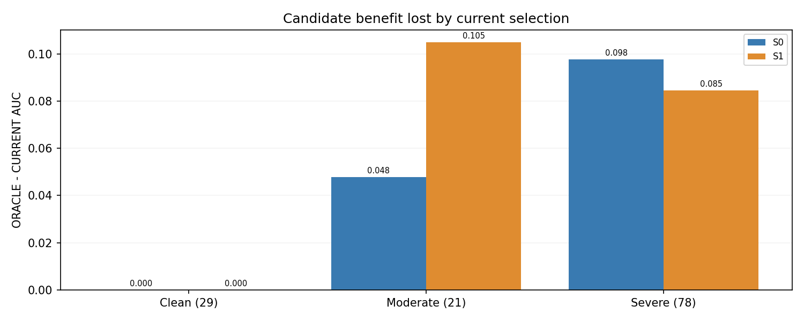

주2D는 기존 HELDOUT의 허용 대칭 whole-object 대응 계약을 유지했다. transition은 canonical GT ID 정렬과 native fixed-ID 무대칭을 둘 다 계산했고 **이번128장에서는 두 결과가 같다**. H10 C4진단은 이 평가에 적용하지 않았다. CURRENT PnP는 검출 bbox의 GT 매칭 gate를 사용하지 않는다. axis parity는 W/D extents 일치율이지 완전한 회전 정답률이 아니다. ORACLE은 GT로 두 후보 중 ADDnorm 최소를 고른 사후 진단이고 배포 불가다.

### Recording별 같은 S1−S0 대조

| recording | 장 | PCK10 %p | CURRENT Δ | ORACLE Δ |
|---|---|---|---|---|
| REC_007 | 33 | -0.76 | 0.0218 | 0.0054 |
| REC_021 | 18 | -3.68 | -0.0421 | -0.0421 |
| REC_022 | 16 | 4.92 | 0.0544 | 0.0528 |
| REC_025 | 27 | 3.05 | 0.0400 | 0.0673 |
| REC_027 | 12 | 1.09 | 0.0161 | 0.0161 |
| REC_041 | 10 | 8.75 | 0.0705 | 0.0705 |
| REC_044 | 12 | 0.00 | 0.0130 | 0.0130 |

### 전체128장 집계 (R0 보조 / S1−S0 주대조)

| 모델 | PCK5/10/20 % | PCK10 맞은점 | matched med/P90 px | CURRENT AUC | ORACLE AUC | W/D parity | 검출/매칭 |
|---|---|---|---|---|---|---|---|
| R0 | 20.81/49.14/72.69 | 484/985 | 9.57 / 40.90 | 0.3380 | 0.4160 | 83/128 | 128/120 |
| S0 | 20.71/47.72/74.01 | 470/985 | 10.03 / 40.34 | 0.3257 | 0.3930 | 88/128 | 128/122 |
| S1 | 21.73/49.04/73.91 | 483/985 | 9.83 / 34.46 | 0.3488 | 0.4176 | 92/128 | 128/123 |

### 사례: CURRENT normalized ADD로 사후 선택

중간 개선4·악화4, 심함 개선4·악화4, fixed SHA random6. 원본 전체가 아닌 팔레트 ROI만 표시했고 얼굴 감지 영역을 모자이크했다. 같은 이미지/ROI를 RGB·R0·S0·S1에 사용한다. **노랑 raw2D / 빨강 실제 PnP / 하늘 점선 대안 PnP / 초록 legacy GT**. 개선·악화 극단 사례는 모집단 평균의 대체 근거가 아니다.

#### MODERATE · improved · eval_outside:1778651579029250816

S1−S0 CURRENT ADDnorm: -0.01987 (음수=개선).

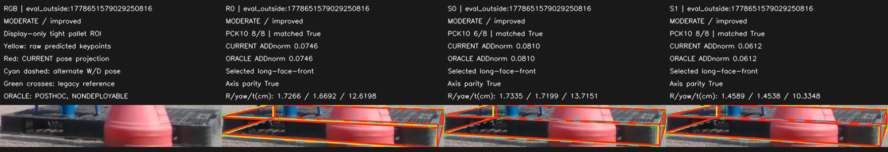

#### MODERATE · improved · eval_pallet07:1778652138515809024

S1−S0 CURRENT ADDnorm: -0.01702 (음수=개선).

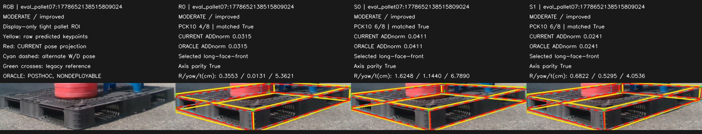

#### MODERATE · improved · eval_night08:1779449499143611648

S1−S0 CURRENT ADDnorm: -0.01534 (음수=개선).

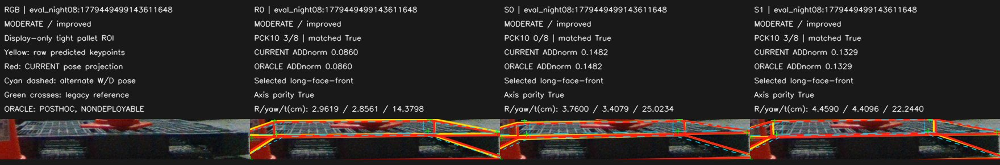

#### MODERATE · improved · eval_pallet07:1778652166837872128

S1−S0 CURRENT ADDnorm: -0.01459 (음수=개선).

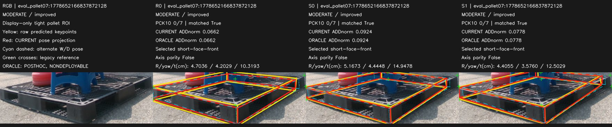

#### MODERATE · harmed · eval_pallet07:1778652142480077056

S1−S0 CURRENT ADDnorm: 0.66534 (음수=개선).


#### MODERATE · harmed · eval_pallet07:1778652168786111744

S1−S0 CURRENT ADDnorm: 0.61730 (음수=개선).

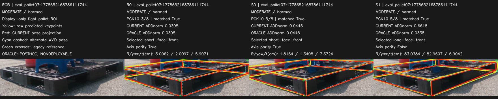

#### MODERATE · harmed · eval_night08:1779449488068910592

S1−S0 CURRENT ADDnorm: 0.05945 (음수=개선).

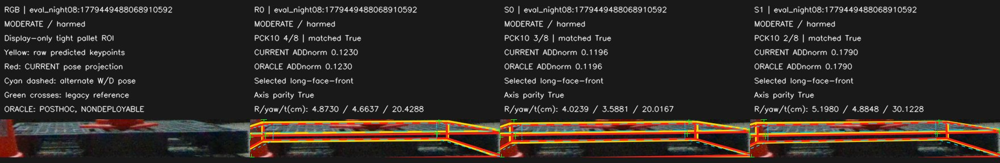

#### MODERATE · harmed · eval_cad:1778653017736058368

S1−S0 CURRENT ADDnorm: 0.00947 (음수=개선).

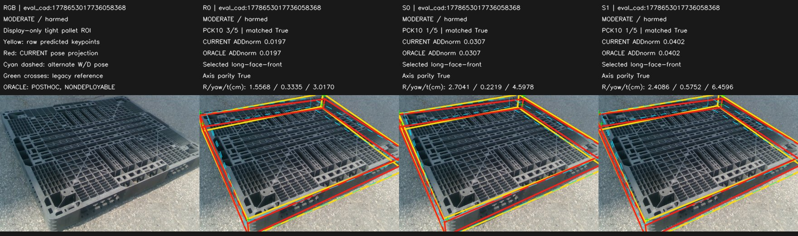

#### SEVERE · improved · eval_night09:1779449604823769344

S1−S0 CURRENT ADDnorm: -6.31117 (음수=개선).


#### SEVERE · improved · eval_pallet09:1778653738858078976

S1−S0 CURRENT ADDnorm: -0.65987 (음수=개선).

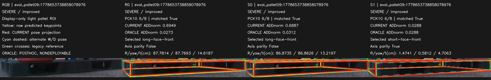

#### SEVERE · improved · eval_pallet07:1778652128369383168

S1−S0 CURRENT ADDnorm: -0.65194 (음수=개선).

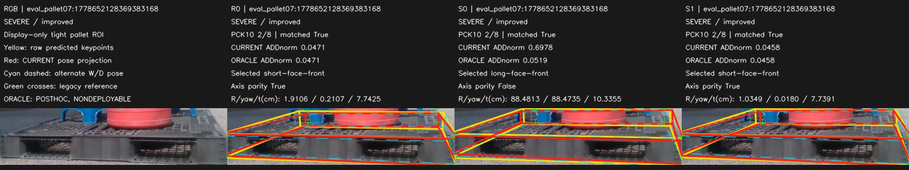

#### SEVERE · improved · eval_pallet07:1778652154608392192

S1−S0 CURRENT ADDnorm: -0.64463 (음수=개선).

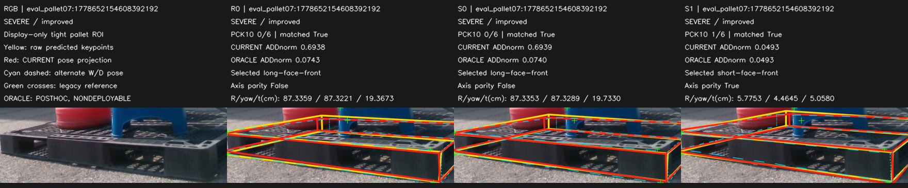

#### SEVERE · harmed · eval_night09:1779449602689248000

S1−S0 CURRENT ADDnorm: 7.30298 (음수=개선).

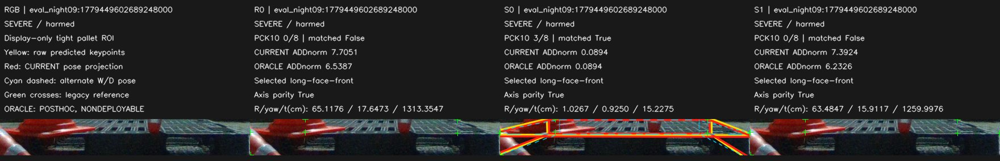

#### SEVERE · harmed · eval_pallet09:1778653693804927232

S1−S0 CURRENT ADDnorm: 0.54283 (음수=개선).

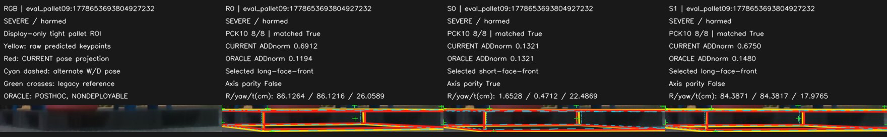

#### SEVERE · harmed · eval_night08:1779449496875356416

S1−S0 CURRENT ADDnorm: 0.14505 (음수=개선).

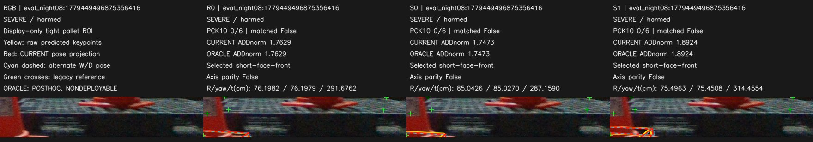

#### SEVERE · harmed · eval_night08:1779449485800670464

S1−S0 CURRENT ADDnorm: 0.05590 (음수=개선).

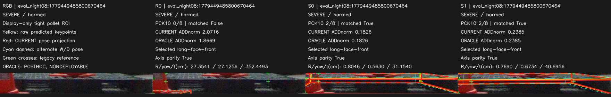

#### RANDOM · fixed_hash_control · eval_pallet07:1778652140531310080

S1−S0 CURRENT ADDnorm: -0.00225 (음수=개선).

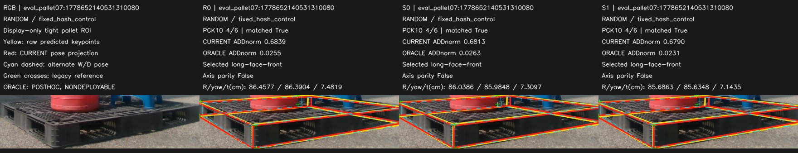

#### RANDOM · fixed_hash_control · eval_pallet09:1778653632188551424

S1−S0 CURRENT ADDnorm: 0.00933 (음수=개선).

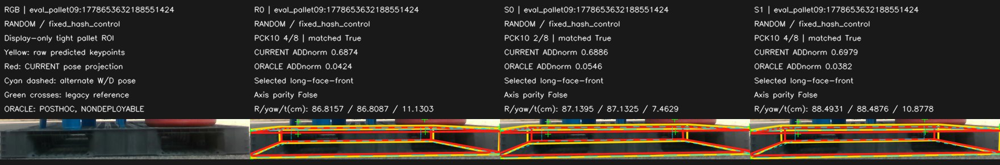

#### RANDOM · fixed_hash_control · eval_outside:1778653545299653120

S1−S0 CURRENT ADDnorm: -0.00412 (음수=개선).

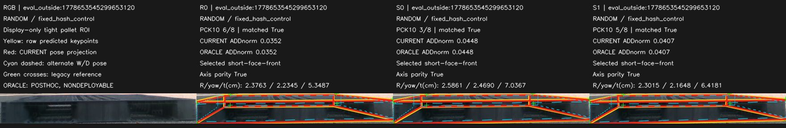

#### RANDOM · fixed_hash_control · eval_pallet09:1778653704118966272

S1−S0 CURRENT ADDnorm: 0.01801 (음수=개선).

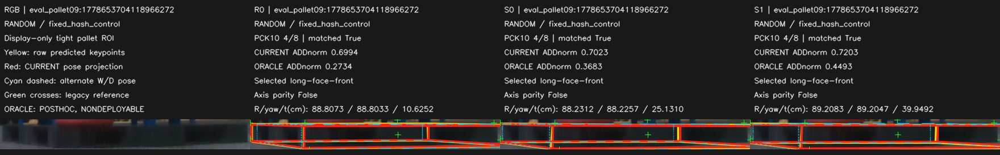

#### RANDOM · fixed_hash_control · eval_night09:1779449593782795264

S1−S0 CURRENT ADDnorm: 0.00114 (음수=개선).

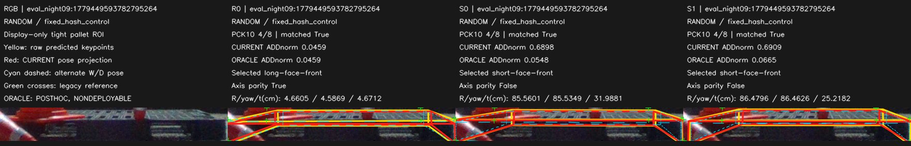

#### RANDOM · fixed_hash_control · eval_pallet09:1778653798391620864

S1−S0 CURRENT ADDnorm: 0.01075 (음수=개선).

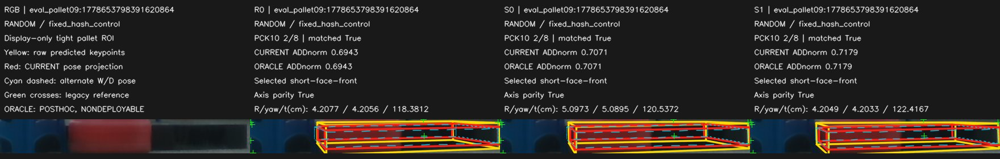

## 12. 객관적 판정

PRIMARY: `SEVERE_ONLY_TRANSFER_SIGNAL`. SECONDARY: `CANDIDATE_GAIN_SELECTOR_LIMIT_IN_MODERATE`.

균일한 전이 성공은 아니다. Severe 집계 개선을 보존하되 Clean 손상·중간 selector 병목·visible PCK10 감소·H10 역할 불일치 반복을 함께 보고한다. H10 신호 때문에 전이 평가를 중단하지 않았고, 반대로 좋은 severe 평균으로 contract 문제를 덮지도 않았다.

- 추가 hard annotation의 필요성: 이번 결과만으로 확정하지 못한다. teacher hard26/36은 S1 19/36보다 낫지만 Severe teacher8/14는 한계가 있다.
- selector 후속 검토: 중간 난도에서 근거가 있다. 다만 아래 contract 분기 이후이며 이번에는 바꾸지 않았다.
- 새 representation: 현 결과로 최우선 변경이라고 특정할 수 없다.

## 13. 다음 딱 한 실험

**BOUNDED_ROLE_CONTRACT_NORMALIZATION_PILOT — 설계만, 실행0.**

지시문 CASE F에 따라 고정 H10의 기존 출처와 명시적인 paper camera-facing 규약 사이의 결정적 mapping을 좁게 검증한다. 물리적180도 C2 동치와 역할90/270 변환을 분리한 versioned mapping 제안·계약 테스트를 만들도록 설계한다. 현재 두 flagged 사례의 C4 minimum을 정답으로 채택하지 않는다.

원본 주석·frozen prediction·모델·split·PnP를 대조군으로 보존한다. 기존 provenance만으로 역할을 유일하게 뒷받침하지 못하면 UNRESOLVED로 멈춘다. 새 촬영·human review·GT 자동수정·추가 학습은 이번에 실행하지 않는다. 다른 실험 후보를 동시에 추가하지 않는다.

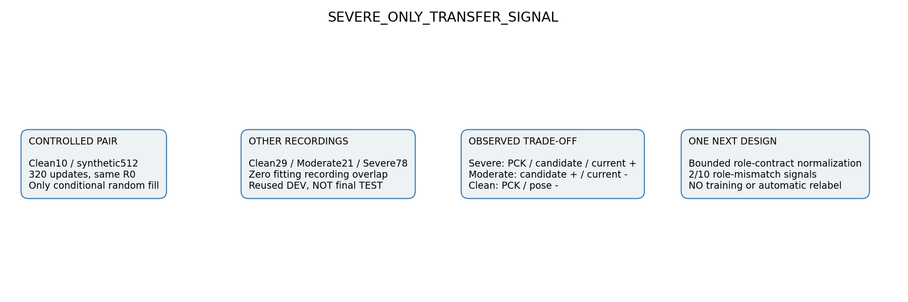

## 14. 한계

single seed42, plastic-only pilot,7개 recording의 재사용 DEV, 이미 본 HELDOUT, 조건부 인공가림 정책, geometry-derived6D reference, 작은 visible anchor·PnP보조 first-pass·P6 부재·선택편향. H10 역할 신호는 학습 진단의2/10이지 evaluation 전체 GT 오류율이 아니다. CI/통계적 유의성·목재 일반화·독립 final TEST를 주장하지 않는다. synthetic256은 고정 기존 source이고 source6D는 추가 계산하지 않았다.

## 15. 재현

HEAD_BEFORE: `ac5e27bba1e40973efbe7707d3ef2515fa32e9ad`. branch: `main`. 새 commit은 이 보고서가 포함된 Git commit이다. `git log -1 --format=%H -- _docs/experiments/pallet_recording_disjoint_transfer_v1/REPORT_KO.md`로 확인한다. push 검증 출력은 로컬 `outputs/pallet_recording_disjoint_transfer_v1/COMMIT_PUSH_RESULT.txt`에 보존한다.

| 모델 | SHA256 |
|---|---|
| S0 | 1dae620fd9117566ce2a9feee76a8cff9a0bfa021279753b3750cd48d605864f |
| S1 | 1f01806829b1a68518c7120c0583a86ea81a5e785ee78bf1ffe68bf31dea6d01 |
| R0 | 970a0913b38ed4c9e3662837abccbf9d91b8b0858deafae854c1055e477644f7 |

[모든 입력·코드·cache SHA](INPUT_BINDINGS.json) · [예측잠금](PREDICTIONS_LOCK.json) · [PnP잠금](POSE_PREDICTIONS_LOCK.json) · [결과JSON](RESULTS.json) · [전이점수](TRANSITIONS.json) · [자동 검사](AUDIT.json)

학습 checkpoint·원본 이미지·개별 좌표·private per-frame cache는 Git에 올리지 않는다. 보고서는 작은 ROI 그림과 집계값만 사용한다. 로컬 재현에는 해시로 묶인 기존 private 데이터/cache가 필요하다.

```bash
python -m scripts.research.pallet_recording_disjoint_transfer_v1.preflight
python -m scripts.research.pallet_recording_disjoint_transfer_v1.role_scan
python -m scripts.research.pallet_recording_disjoint_transfer_v1.infer
python -m scripts.research.pallet_recording_disjoint_transfer_v1.evaluate
python -m scripts.research.pallet_recording_disjoint_transfer_v1.report decision
python -m scripts.research.pallet_recording_disjoint_transfer_v1.render
python -m scripts.research.pallet_recording_disjoint_transfer_v1.report
python -m scripts.research.pallet_recording_disjoint_transfer_v1.audit
```

preflight/infer/evaluate는 기존 완료 잠금을 덮어쓰지 않는다. 이미 완료한 작업의 확인은 audit만 실행한다.
