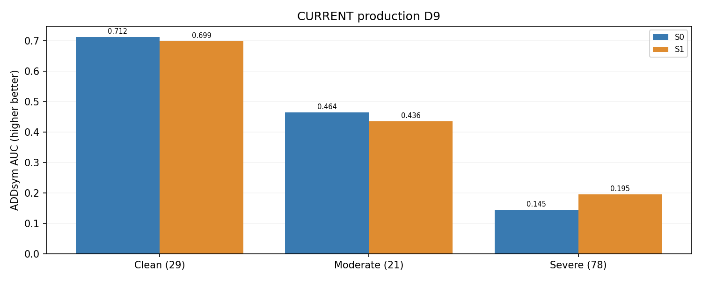
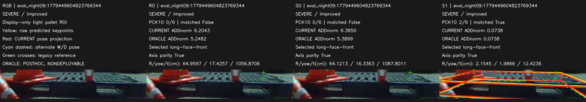
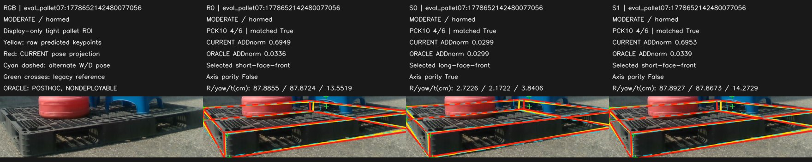

# Recording-disjoint transfer 요약

SEVERE_ONLY_TRANSFER_SIGNAL

기존 모델 재사용, 새 학습0. Clean29/Moderate21/Severe78, 다른recording128장 평가.

| 난도 | S0 PCK10 % | S1 PCK10 % | S0 CURRENT | S1 CURRENT | S0 ORACLE | S1 ORACLE |
|---|---|---|---|---|---|---|
| CLEAN | 60.26 | 58.95 | 0.7119 | 0.6986 | 0.7119 | 0.6986 |
| MODERATE | 55.84 | 55.84 | 0.4641 | 0.4357 | 0.5120 | 0.5406 |
| SEVERE | 40.86 | 43.52 | 0.1448 | 0.1954 | 0.2425 | 0.2799 |

심함은 개선, 중간 실제자세·Clean은 악화. hard visible PCK10 20/36→19/36. H10역할 신호2/10; GT수정 없음.

[22개 사례와 전체 과정·수치 보고서](REPORT_KO.md)
