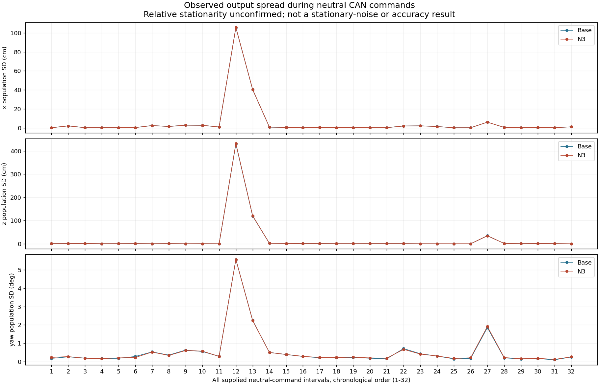
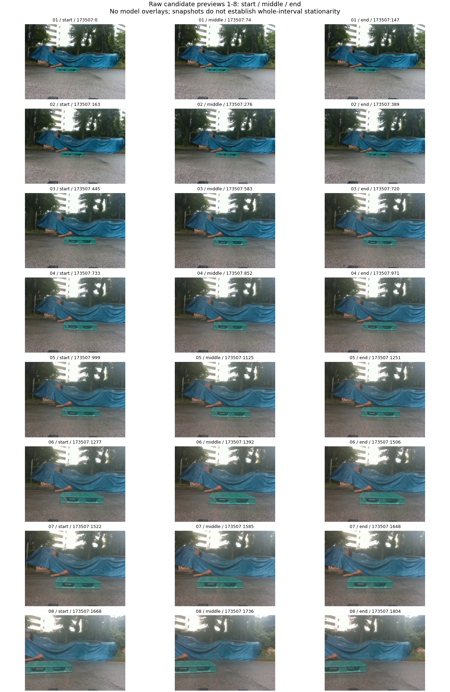
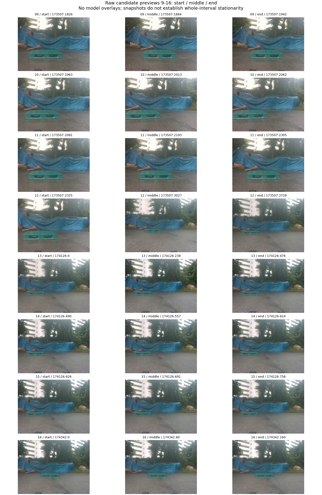
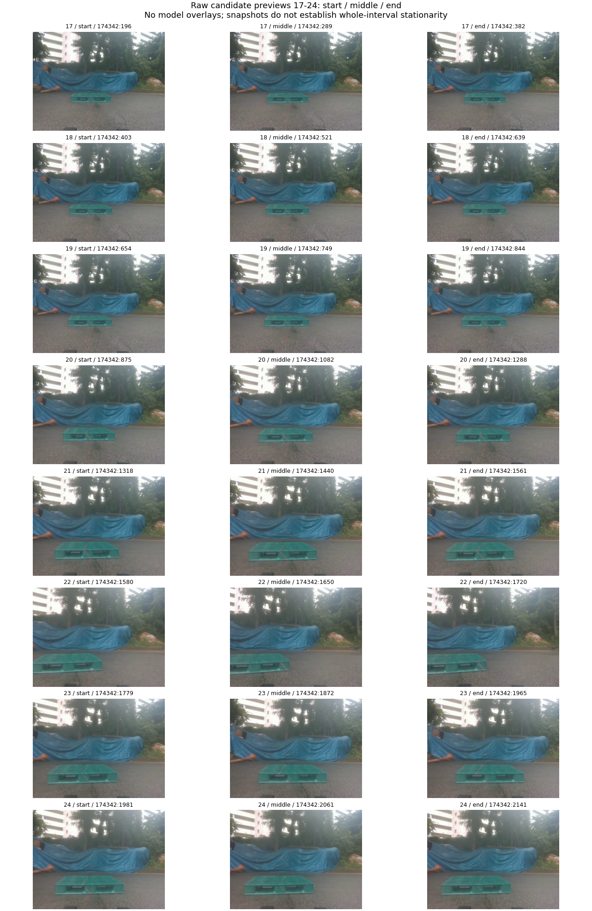
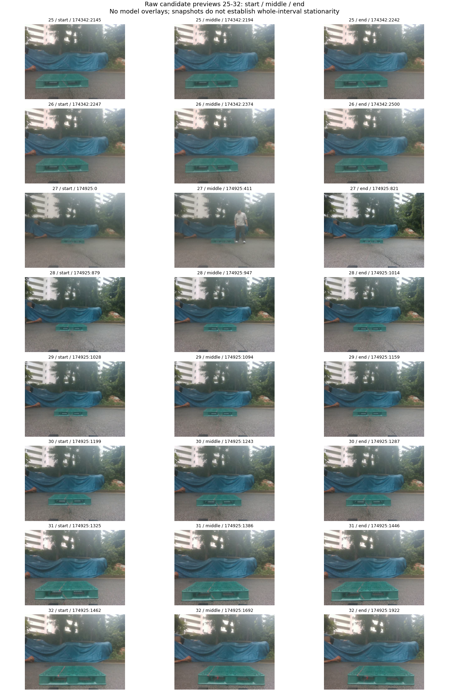

# 중립 명령 32구간의 저장 출력 대조

중립 CAN 명령이 기록된 모든 32구간의 저장 예측을 재집계했습니다. **카메라–팔레트 상대 정지는 확인되지 않았습니다. 아래 표와 그림은 명령 조건에서 관측한 출력 분산이며 정지 잡음·정확도·실제 물리 움직임의 정답이 아닙니다.** 기존 정지 평가의 x를 교체하지 않았습니다.

| 항목 | 실제 계산 |
| --- | --- |
| 시간·frame ID 전수 대조 | 8,910프레임 |
| 중립 명령 구간 / 저장 프레임 | 32 / 8,263 |
| 구간 밖 저장 프레임 | 647 |
| 구간별 관측 센서 시간 합 | 775.673346초 |
| 구간 내 중복 센서 시각 | 28행, 삭제하지 않음 |
| Base / N3 유효 자세 | 각각 8,125 / 8,263 |
| Base / N3 no-pose / held | 각각 138 / 0 |
| 확인된 상대 정지 구간 | 0 |
| 기존 계약 정지 잡음 | x |

[원시 재집계 JSON](../../../../data/pallet/results/pallet_remaining_evidence_connection_20261006_v1/neutral_intervals/NEUTRAL_COMMAND_RESULT.json) · [64행 CSV](../../../../data/pallet/results/pallet_remaining_evidence_connection_20261006_v1/neutral_intervals/ALL_32_INTERVALS.csv) · [CPU 실행 비용](../../../../data/pallet/results/pallet_remaining_evidence_connection_20261006_v1/neutral_intervals/EXECUTION_COST.json) · [그림 출처](FIGURE_PROVENANCE.json)

같은 구간에서 x/z의 모집단 표준편차(ddof=0), 360° wrapping만 제거한 yaw 표준편차를 계산했습니다. 90°/180° 가지 변경은 남겼으며, 서로 다른 구간·세션은 이어 붙이지 않았습니다. 유효 출력에 대한 조건부 분산과 전체 저장 분모를 구분합니다. 시간 가중치 대신 저장 행 하나를 한 관측으로 사용했고 중복 저장도 유지했습니다. 큰 분산 구간을 제거하지 않고 32개 모두 제시했습니다.



## 원사진 확인용 미리보기

아래 96장은 모델 점·박스를 넣지 않은 원사진으로 파일·디코딩 픽셀 SHA-256을 검산했습니다. 시작·중간·끝 사진만으로 전체 구간의 정지를 증명할 수 없습니다. **새 검수나 클릭을 요구하는 화면이 아닙니다.** 전체 영상 구간·64개 짧은 영상은 전달받은 ZIP의 stops 자료에서 보존합니다.









## 재현

GitHub clone에서 원시 예측 gzip과 공개 입력 gzip만으로 결과가 같은지 검산할 수 있습니다. 모델·장치 코드를 불러오지 않습니다.

```bash
python3 scripts/research/pallet_remaining_evidence_connection_20261006_v1/neutral_interval_analysis.py --verify-only
```

최초 실행은 동일 명령에 `--handoff /tmp/pallet-remaining-evidence-handoff-20261006`을 주어 인계 원문을 무손실 압축하고 계산했습니다. 입력 해시는 [inputs/INPUT_MANIFEST.json](inputs/INPUT_MANIFEST.json)에 남겼습니다. 기록 당시 기존 frozen evaluator SHA-256은 `ff4b9fbb8b383a8cc6072860a31d746bcd90cf4fadd648d3b4d733b6883571c8`이며 원본은 수정하지 않았습니다. 이 새로운 기술 패널은 frozen 정지 evaluator를 호출하거나 승인된 구간으로 등록하지 않습니다.

실제 수신 측 `metrics_l4/LIFTER_METRICS.json`도 `reviewed_stop_variation.status=WAITING_HUMAN`이었습니다. 해당 결과·review 디렉터리에서 station/stop 이름의 추가 입력 파일을 찾지 못했습니다. 이는 기록한 범위의 검색 결과이며 모든 곳에 정지 기록이 없다는 결론이 아닙니다.

전체 구간의 선택 객체에 대한 사람 대응·추적 참조는 없습니다. 고정된 최고 신뢰도 객체 선택의 저장 출력이며, 출력 분산을 같은 물체의 실제 움직임이나 정지 잡음으로 해석하지 않습니다.
