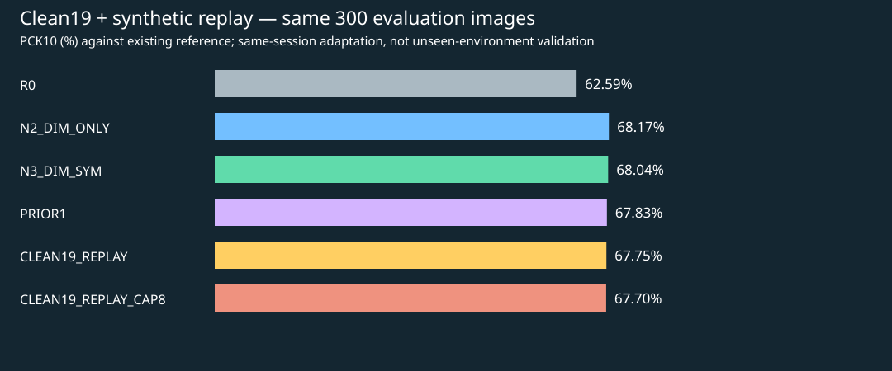

# Clean19/300 최종 요약

같은 촬영 세션을 허용한 소량 수동지도 적응. 학습19장·87개 직접클릭 코너, 평가300장. 데이터319장 중 실제 이미지 교차0. 사전근접중복검사 통과는 새로운 환경 독립성을 뜻하지 않는다.

| 대비 기준 | 새 RAW Replay PCK10 차이(pp) | 탐색적 촬영그룹 bootstrap 95% CI |
|---|---:|---|
| PRIOR1 | -0.09 | [-3.06, +4.37] |
| N2_DIM_ONLY | -0.43 | [-2.33, +2.25] |
| N3_DIM_SYM | -0.30 | [-2.42, +2.61] |
| R0 | +5.16 | [+0.93, +12.01] |

단일seed·반복개발평가·소수촬영그룹이므로 CI는 참고용이고 확정적 유의성/새환경 일반화 주장이 아니다. cap8은 사전등록 보조출력이며 평가 후 더 좋은 것을 골라 최종 모델로 바꾸지 않았다.

[전체 수치](RESULTS_KO.md)

로컬 비교 이미지: outputs/pallet_replay_clean19_v1/GALLERY.html

원본·기존모델·기존319장표 보존. 신규 모델 자동 승격 없음. 추가 학습·하이퍼파라미터 탐색 없음. commit/push 없음.
