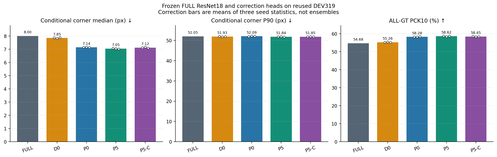
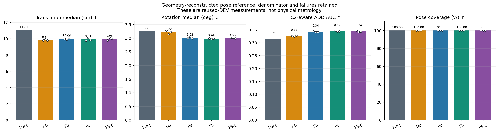
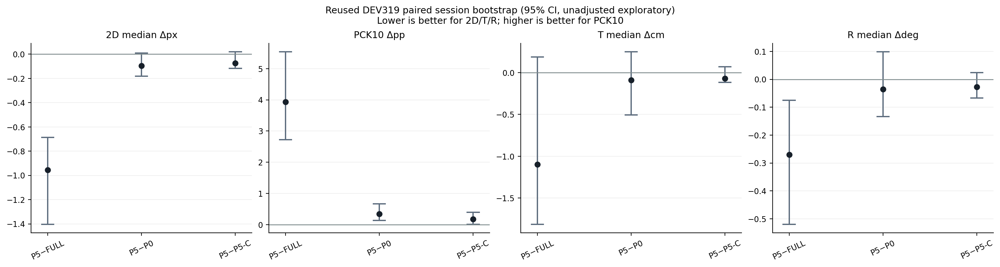
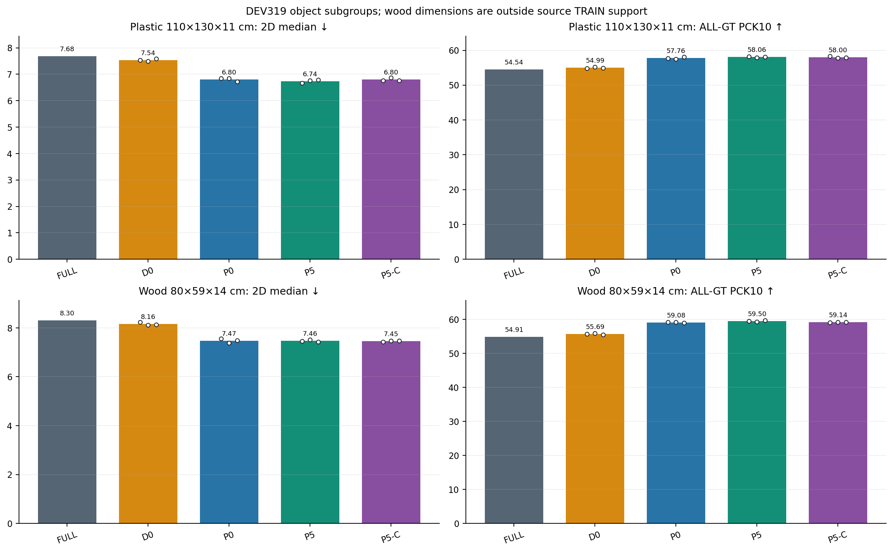
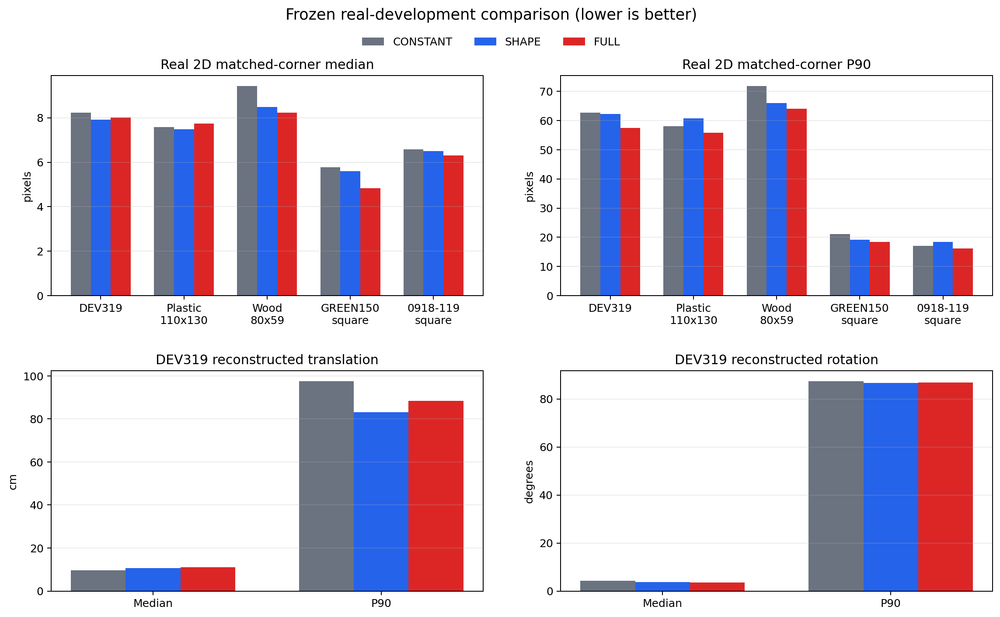

# 치수 입력 ResNet18 보정기 결과

P5−P5_CONSTANT 비교에서 치수 5값의 추가 입력이 2D와 T·R을 함께 안정적으로 개선했다는 근거는 확보되지 않았다.

이 보고서는 동결된 `FULL` ResNet18 추정기 뒤에 붙인 작은 보정 head의 결과다. 합성 TRAIN만으로 학습한 네 arm을 각각 3 seed로 평가했다. 모든 arm은 동일한 FULL baseline, 동일 seed 내 source 행 순서, 동일한 동결 layer2/layer3 특징을 사용한다.

## 비교가 뜻하는 것

- `D0`: 동결 특징과 기존 점/box에서 직접 residual을 회귀한다.
- `P0`: 치수 벡터 없이 local probability stencil로 보정한다.
- `P5`: `logW`, `logD`, `logH`, `log(W/D)`, `log(H/√WD)`의 정규화 5값을 보정 head에 넣는다.
- `P5_CONSTANT`: P5와 구조·초기값이 같고 5값만 head 내부에서 0으로 고정한다.

치수 5값 자체의 증분 효과는 `P5−P5_CONSTANT`가 답한다. `P5−P0`는 경로와 용량도 함께 바뀌는 package 비교다. `P5−FULL`은 보정기 전체의 전후 비교다. FULL baseline 자체가 이미 치수 조건부로 학습됐으므로 이 실험은 이미지-only 전체 시스템과 치수 조건부 전체 시스템의 비교가 아니다.

## 실행 계약

- 합성 분할: TRAIN 55,980 / calibration 1,004 / selection 1,031 / heldout 1,985. 실사 학습·선택은 0장이다.
- 각 arm·seed: 6,000 updates × batch 16 = 96,000 nominal exposures. 총 12 fits와 72,000 head updates를 완료했다.
- 실제 TRAIN usable 행: 55,804 / 55,980.
- calibration temperature와 correction λ/cap은 합성 calibration/selection에서만 정했고, source heldout은 규칙을 고정한 뒤 열었다.
- 실사 평가는 재사용 DEV319장, 13세션, 감독 landmark 2,818점이다. box·score·instance·center·결측 mask는 보존했다.

[고정 protocol](../pallet_resnet18_dim_refiner_20261002_v1/PROTOCOL.json) · [학습 완료](../pallet_resnet18_dim_refiner_20261002_v1/TRAINING_COMPLETE.json) · [합성 선택](../pallet_resnet18_dim_refiner_20261002_v1/SELECTION.json) · [합성 heldout](../pallet_resnet18_dim_refiner_20261002_v1/SYNTHETIC_HELDOUT.json) · [DEV 전체 결과](../pallet_resnet18_dim_refiner_20261002_v1/DEV_RESULTS.json)

## DEV319 전체

| 방법 | 2D median px↓ | P90 px↓ | ALL-GT PCK10 %↑ | matched | T median cm↓ | R median °↓ | C2-aware ADD AUC full↑ | pose coverage %↑ |
|---|---:|---:|---:|---:|---:|---:|---:|---:|
| FULL baseline | 8.001 | 52.054 | 54.68 | 299.0/319 | 11.007 | 3.252 | 0.31296 | 100.00 |
| D0 (3-seed 통계 평균) | 7.852 | 51.928 | 55.26 | 299.0/319 | 9.837 | 3.218 | 0.32604 | 100.00 |
| P0 (3-seed 통계 평균) | 7.143 | 52.086 | 58.28 | 299.0/319 | 10.001 | 3.018 | 0.34219 | 100.00 |
| P5 (3-seed 통계 평균) | 7.048 | 51.839 | 58.62 | 299.0/319 | 9.911 | 2.982 | 0.34499 | 100.00 |
| P5_CONSTANT (3-seed 통계 평균) | 7.122 | 51.848 | 58.45 | 299.0/319 | 9.982 | 3.009 | 0.34396 | 100.00 |

보정 행은 세 seed 예측을 합친 앙상블이 아니라 각 seed에서 계산한 통계의 산술평균이다. 2D median/P90은 고정 baseline box IoU≥0.5이며 9점이 모두 유한한 프레임의 감독점에 조건부다. ALL-GT PCK는 제외점과 실패점을 실패로 남긴다. Pose 오차는 성공한 PnP에 조건부이고 coverage와 full-population C2-aware corresponding-point ADD AUC가 실패 질량을 보존한다. 이 지표는 unrestricted nearest-neighbor ADD-S가 아니다.

## Seed별 결과

| method | 2D median | P90 | PCK10 % | T cm | R ° | pose coverage % |
|---|---:|---:|---:|---:|---:|---:|
| FULL | 8.001 | 52.054 | 54.68 | 11.007 | 3.252 | 100.00 |
| D0_S1 | 7.868 | 52.065 | 55.18 | 9.784 | 3.283 | 100.00 |
| D0_S2 | 7.809 | 51.823 | 55.46 | 9.927 | 3.145 | 100.00 |
| D0_S3 | 7.880 | 51.897 | 55.15 | 9.798 | 3.227 | 100.00 |
| P0_S1 | 7.141 | 51.923 | 58.23 | 9.963 | 3.009 | 100.00 |
| P0_S2 | 7.157 | 52.198 | 58.16 | 9.884 | 3.052 | 100.00 |
| P0_S3 | 7.129 | 52.139 | 58.45 | 10.154 | 2.994 | 100.00 |
| P5_S1 | 7.078 | 51.877 | 58.73 | 9.780 | 2.993 | 100.00 |
| P5_S2 | 7.042 | 51.931 | 58.45 | 10.112 | 2.967 | 100.00 |
| P5_S3 | 7.022 | 51.710 | 58.69 | 9.841 | 2.988 | 100.00 |
| P5_CONSTANT_S1 | 7.114 | 51.825 | 58.59 | 9.785 | 3.013 | 100.00 |
| P5_CONSTANT_S2 | 7.157 | 51.884 | 58.34 | 10.138 | 3.020 | 100.00 |
| P5_CONSTANT_S3 | 7.094 | 51.836 | 58.41 | 10.022 | 2.995 | 100.00 |

## 사전에 정한 paired 비교

아래 값은 앞 방법−뒤 방법이다. 2D/T/R은 음수가 개선이고 PCK10은 양수가 개선이다. 13세션 단위 10,000 bootstrap, seed 20260914의 95% 구간이며 다중비교 보정은 없다.

| 비교 | Δ2D median px [95% CI] | ΔPCK10 pp [95% CI] | ΔT cm [95% CI] | ΔR ° [95% CI] |
|---|---:|---:|---:|---:|
| P5_minus_FULL | -0.954 [-1.403, -0.687] | 3.939 [2.728, 5.537] | -1.096 [-1.814, 0.189] | -0.270 [-0.520, -0.076] |
| P5_minus_P0 | -0.095 [-0.182, 0.009] | 0.343 [0.139, 0.666] | -0.089 [-0.507, 0.248] | -0.036 [-0.133, 0.098] |
| P5_minus_P5_CONSTANT | -0.074 [-0.116, 0.019] | 0.177 [0.011, 0.397] | -0.071 [-0.115, 0.071] | -0.027 [-0.067, 0.025] |

## 직사각형 물체별 결과

| 집단 | 방법 | 2D median px↓ | P90 px↓ | PCK10 %↑ | T cm↓ | R °↓ |
|---|---|---:|---:|---:|---:|---:|
| Plastic 110×130×11 cm | FULL | 7.681 | 50.304 | 54.54 | 12.494 | 2.852 |
| Plastic 110×130×11 cm | D0_SEED_MEAN | 7.539 | 50.118 | 54.99 | 12.112 | 2.778 |
| Plastic 110×130×11 cm | P0_SEED_MEAN | 6.804 | 51.059 | 57.76 | 11.471 | 2.582 |
| Plastic 110×130×11 cm | P5_SEED_MEAN | 6.741 | 50.584 | 58.06 | 11.495 | 2.633 |
| Plastic 110×130×11 cm | P5_CONSTANT_SEED_MEAN | 6.797 | 50.581 | 58.00 | 11.562 | 2.662 |
| Wood 80×59×14 cm | FULL | 8.301 | 55.187 | 54.91 | 5.901 | 4.180 |
| Wood 80×59×14 cm | D0_SEED_MEAN | 8.163 | 55.538 | 55.69 | 5.827 | 3.999 |
| Wood 80×59×14 cm | P0_SEED_MEAN | 7.470 | 55.630 | 59.08 | 5.261 | 3.805 |
| Wood 80×59×14 cm | P5_SEED_MEAN | 7.463 | 56.285 | 59.50 | 5.161 | 3.796 |
| Wood 80×59×14 cm | P5_CONSTANT_SEED_MEAN | 7.455 | 56.341 | 59.14 | 5.134 | 3.777 |

Plastic 110×130×11 cm는 source TRAIN의 축별 W·D·H 및 정규화 5D 범위 안이다. Wood 80×59×14 cm는 D=0.59 m가 source TRAIN D 최소값보다 작고 정규화 문맥도 여러 축에서 범위를 벗어난다. 이 wood 결과는 외삽이며 직사각형 전체 일반화의 근거로 단독 사용하지 않는다.

| 집단 | canonical W,D,H m | normalized 5D | raw TRAIN 밖 축 | normalized TRAIN 밖 feature |
|---|---|---|---|---|
| Plastic 110×130×11 cm | 1.100, 1.300, 0.110 | +1.166, +0.846, -1.246, +0.375, -1.869 | 없음 | 없음 |
| Wood 80×59×14 cm | 0.800, 0.590, 0.140 | -1.487, -6.458, -0.096, +4.025, +2.074 | D | logD, log(W/D) |

## 정사각형 자료는 별도 direct-ResNet 문맥

이번 보정기 실행은 GREEN150 또는 0918 정사각형 세트에서 correction head를 평가하지 않았다. 아래 그림과 링크는 이미지+치수를 처음부터 입력한 full-image direct ResNet18의 별도 결과다. GREEN150 150장과 0918 119장은 각각 집단 안에서 W·D·H가 1.10×1.10×0.15 m로 고정돼 있으므로 정사각형 전이는 볼 수 있어도 프레임별 치수 변화의 인과 효과는 식별할 수 없다.

[direct ResNet18 상세 보고서](../pallet_resnet18_dimension_20261002_v1/REPORT_KO_V2.md) · [RGB 사례 gallery](../pallet_resnet18_dimension_20261002_v1/GALLERY.md) · [gallery 선택 규칙](../pallet_resnet18_dimension_20261002_v1/DSNT_GALLERY_MANIFEST.json)

Gallery는 결과를 보고 고른 개선/악화 양끝 사례다. 시각 설명용이며 집계 성능이나 보정기 근거가 아니다.

## 엄격한 한계와 원고 표현

- 실사 역할은 `REUSED_DEV`다. 독립 TEST 확인이 없고 반복 개발 사용을 일반화 성능으로 표현할 수 없다.
- T/R reference는 2D 주석·camera K·등록 치수에서 재구성했다. 독립 물리 계측 6D GT가 아니다.
- paired 구간은 탐색적이며 다중비교 보정이 없다. 단일 지표의 유리한 결과만 골라 broad claim을 만들지 않는다.
- `P5−P5_CONSTANT`만 이 head에서 치수 5값의 증분 인과 비교다. FULL baseline 자체의 치수 조건은 모든 arm에 공통이다.
- wood는 source dimension support 밖 외삽이고, square 데이터는 이 correction head로 평가하지 않았다.
- 이 실행에는 동일 장치·동일 범위 latency 측정이 없다. 속도·정확도 주장은 만들지 않는다.
- 이 ResNet 결과 하나로 YOLO·DOPE까지 backbone-agnostic이라고 주장하지 않는다. 각 backbone의 별도 결과와 통합 기준이 필요하다.
- 이 보고서는 안정적 T·R 공동 개선, IEEE Sensors 투고 성공, 또는 논문 목표 완료를 자동 선언하지 않는다.

[claim audit](CLAIM_AUDIT.json) · [전체 집계표](AGGREGATE_TABLES.json) · [method CSV](DEV_METHOD_TABLE.csv) · [subgroup CSV](DEV_SUBGROUP_TABLE.csv) · [paired CSV](DEV_PAIRED_TABLE.csv) · [report manifest](REPORT_MANIFEST.json)
