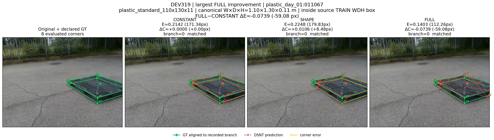
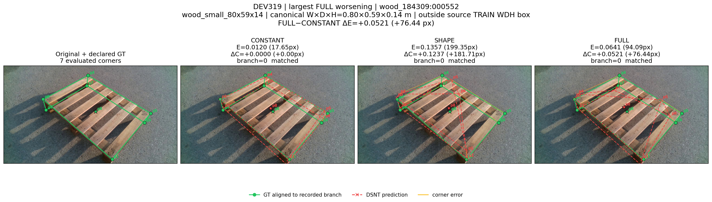
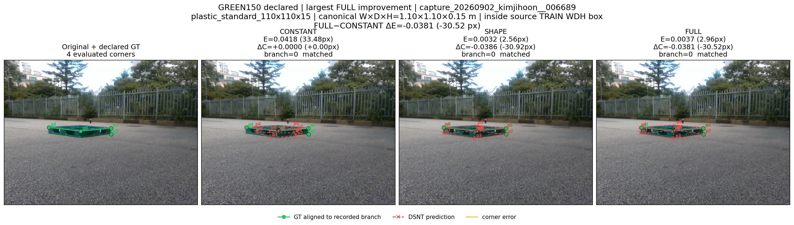
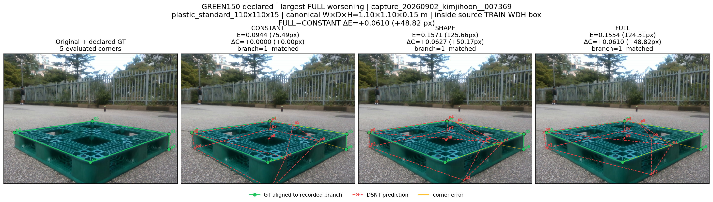
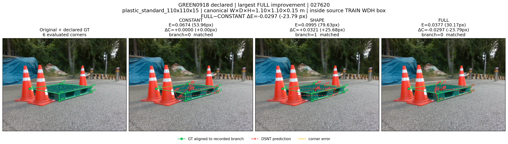
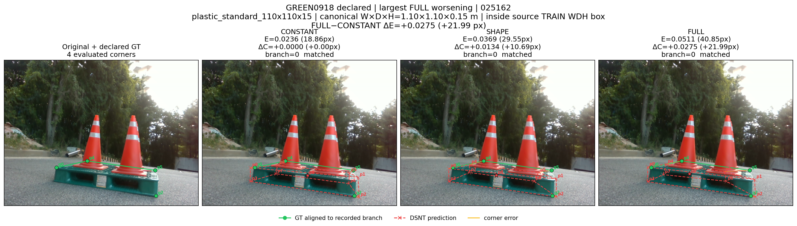

# ResNet18 DSNT 실사 극단 사례 갤러리

이 갤러리는 모든 CONSTANT·SHAPE·FULL 실사 예측과 고정 평가 결과가 완료된 뒤 생성한다. DEV319, GREEN150 manual-declared, GREEN0918 manual-declared에서 CONSTANT·FULL이 모두 evaluable·matched인 같은 ID만 남긴 뒤 `FULL E_sym − CONSTANT E_sym`의 최소·최대를 하나씩 고른다. `E_sym`은 이미지 대각선으로 정규화되어 DEV319의 640×480과 1280×720을 공정하게 비교한다. SHAPE는 사례 선택에 영향을 주지 않고 선택된 사례에서만 표시한다. 총 여섯 장이며 학습이나 모델 선택에는 사용하지 않는다.

각 모델 패널의 초록 GT는 해당 arm 결과에 기록된 whole-object symmetry branch로 다시 배열했다. 빨간 점과 점선은 아홉 DSNT 출력이고, 노란 선은 평가 대상 corner의 대응 오차다. 패널의 `E`는 고정 scorer의 symmetry-aware `E_sym`, 괄호는 같은 값의 pixel 표현이다. `ΔC`는 같은 프레임 CONSTANT 대비 차이다. SHAPE가 unmatched인 경우에는 각 평가 corner에 이미지 대각선 penalty가 적용된 고정 scorer 결과를 그대로 표시한다.

## 선택된 사례

| 데이터 | 사례 | frame ID | eligible | W×D×H (m) | support | CONSTANT E | SHAPE E | FULL E | FULL−CONSTANT E | pixel Δ | branch C/S/F |
|---|---|---|---:|---|---|---:|---:|---:|---:|---:|---|
| DEV319 | 최대 개선 | `plastic_day_01:011067` | 286 | 1.10×1.30×0.11 | inside | 0.21418 | 0.22478 | 0.14032 | -0.07385 | -59.083 | 0/0/0 |
| DEV319 | 최대 악화 | `wood_184309:000552` | 286 | 0.80×0.59×0.14 | OOD axis 1 | 0.01202 | 0.13574 | 0.06407 | +0.05205 | +76.443 | 0/0/0 |
| GREEN150 declared | 최대 개선 | `capture_20260902_kimjihoon__006689` | 127 | 1.10×1.10×0.15 | inside | 0.04185 | 0.00320 | 0.00370 | -0.03815 | -30.519 | 0/0/0 |
| GREEN150 declared | 최대 악화 | `capture_20260902_kimjihoon__007369` | 127 | 1.10×1.10×0.15 | inside | 0.09436 | 0.15708 | 0.15539 | +0.06103 | +48.823 | 1/1/1 |
| GREEN0918 declared | 최대 개선 | `027620` | 116 | 1.10×1.10×0.15 | inside | 0.06744 | 0.09954 | 0.03771 | -0.02973 | -23.786 | 0/1/0 |
| GREEN0918 declared | 최대 악화 | `025162` | 116 | 1.10×1.10×0.15 | inside | 0.02358 | 0.03694 | 0.05106 | +0.02748 | +21.986 | 0/0/0 |

## 비교 이미지

### DEV319 · 최대 개선

`plastic_day_01:011067` · FULL−CONSTANT ΔE=-0.07385 (-59.083px)

### DEV319 · 최대 악화

`wood_184309:000552` · FULL−CONSTANT ΔE=+0.05205 (+76.443px)

### GREEN150 declared · 최대 개선

`capture_20260902_kimjihoon__006689` · FULL−CONSTANT ΔE=-0.03815 (-30.519px)

### GREEN150 declared · 최대 악화

`capture_20260902_kimjihoon__007369` · FULL−CONSTANT ΔE=+0.06103 (+48.823px)

### GREEN0918 declared · 최대 개선

`027620` · FULL−CONSTANT ΔE=-0.02973 (-23.786px)

### GREEN0918 declared · 최대 악화

`025162` · FULL−CONSTANT ΔE=+0.02748 (+21.986px)

## 해석 범위

- 이 여섯 장은 분포를 대표하도록 뽑은 표본이 아니라 최대 변화 사례다. 평균 성능이나 일반화 근거로 단독 사용하면 안 된다.
- GREEN의 declared 기준은 `manual_click`이며 이미지 밖으로 선언된 점도 고정 평가 오차에 남을 수 있다. 화면에는 이미지 범위 안 좌표만 보인다.
- GREEN150은 저장 label을 재사용한 development 집합이다. 150장 중 128장에 camera metadata 불일치가 기록되어 있으며, 여기서는 PnP 투영점을 제외한 manual click만 쓴다.
- GREEN0918_119는 `population_role=DEV`이고 canonical pose가 없으며 signed-axis가 확정되지 않은 2D development 집합이다.
- 정사각형 두 집단은 모든 프레임에서 W·D·H가 같으므로 프레임별 치수 변화의 인과 효과를 식별하지 않는다.
- wood `0.80×0.59×0.14 m`의 D=0.59 m는 source TRAIN의 axis-aligned WDH 최소보다 작아 OOD로 표시한다. inside 표시도 분포 동일성을 입증하지 않는다.
- DEV319와 두 GREEN 집단은 재사용 development 자료이며 독립 test가 아니다.

[갤러리 manifest](DSNT_GALLERY_MANIFEST.json)
