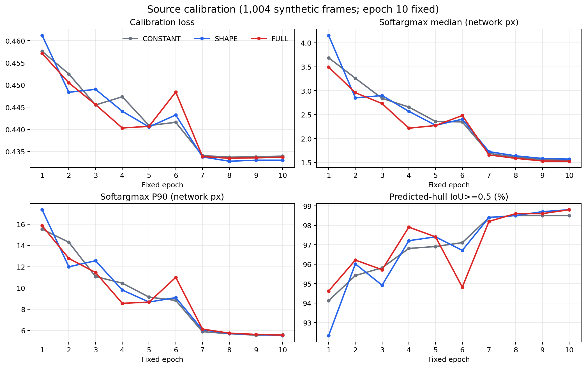

# 치수 조건부 ResNet18 DSNT 3-arm 결과

이 보고서는 동일한 ResNet18 구조와 학습 순서에서 입력만 `CONSTANT`, `SHAPE`, `FULL`로 바꾼 고정 epoch 10 결과를 비교한다. `FULL`은 이미지와 canonical W·D·H 및 두 비율을 함께 받고, `SHAPE`은 두 비율만, `CONSTANT`는 치수 문맥을 0으로 받는다. 세 arm의 학습 완료 영수증, 전수 예측, 2D 결과와 pose 결과의 SHA-256 바인딩을 이 보고서 생성 시 다시 검증했다.

## 실행 및 고정 상태

| arm | epochs | updates | images seen | elapsed min | final checkpoint SHA-256 |
|---|---:|---:|---:|---:|---|
| CONSTANT | 10 | 34990 | 559800 | 63.29 | `a94e55f028b704057c77fd045d96dd2dbb2ae6be2a49e945b23c821a30d8e1c4` |
| SHAPE | 10 | 34990 | 559800 | 63.76 | `742ea3330f8d753ef786dd6e88f3c28460d757c4a431b7b95c30dbacae4417d9` |
| FULL | 10 | 34990 | 559800 | 63.13 | `0a6b664f126ef72449ed917917177b3c1c03306fdd1a4bd5aa827228b98633ac` |

실사 이미지는 학습 또는 checkpoint 선택에 사용하지 않았다. 세 arm 모두 동일한 합성 TRAIN 55,980장과 calibration 1,004장을 사용했고 최종 epoch를 사전에 고정했다.

## 최종 합성 calibration

| arm | train loss | calibration loss | soft median px | soft P90 px | argmax median px | matched/1004 |
|---|---:|---:|---:|---:|---:|---:|
| CONSTANT | 0.42357 | 0.43397 | 1.549 | 5.593 | 2.334 | 989/1004 (98.51%) |
| SHAPE | 0.42365 | 0.43304 | 1.570 | 5.516 | 2.371 | 992/1004 (98.80%) |
| FULL | 0.42358 | 0.43374 | 1.525 | 5.561 | 2.368 | 992/1004 (98.80%) |

## 실사 2D 결과

중앙값과 P90은 predicted-hull IoU≥0.5로 matched 된 관측 corner를 모아 계산한다. PCK와 `E_sym`에는 미검출·unmatched penalty가 포함된다. 이 ResNet은 한 팔레트가 있다고 가정해 항상 9점을 출력하므로 여기의 coverage는 detector recall이 아니라 predicted-hull match 비율이다.

| 집단 | arm | frames | median px | P90 px | PCK5 | PCK10 | PCK20 | matched | E_sym |
|---|---|---:|---:|---:|---:|---:|---:|---:|---:|
| DEV319 전체 | CONSTANT | 319 | 8.222 | 62.639 | 28.09% | 52.26% | 70.35% | 292/319 | 0.11187 |
| DEV319 전체 | SHAPE | 319 | 7.908 | 62.278 | 27.97% | 56.38% | 73.19% | 299/319 | 0.09034 |
| DEV319 전체 | FULL | 319 | 8.012 | 57.501 | 29.13% | 54.62% | 73.15% | 299/319 | 0.08891 |
| 직사각형 플라스틱 110×130×11 cm | CONSTANT | 194 | 7.587 | 57.984 | 31.06% | 54.53% | 69.27% | 174/194 | 0.12879 |
| 직사각형 플라스틱 110×130×11 cm | SHAPE | 194 | 7.483 | 60.696 | 29.35% | 57.37% | 72.24% | 179/194 | 0.10339 |
| 직사각형 플라스틱 110×130×11 cm | FULL | 194 | 7.732 | 55.824 | 31.39% | 54.26% | 72.04% | 182/194 | 0.08711 |
| 직사각형 목재 80×59×14 cm | CONSTANT | 125 | 9.430 | 71.826 | 23.53% | 48.78% | 72.01% | 118/125 | 0.08561 |
| 직사각형 목재 80×59×14 cm | SHAPE | 125 | 8.492 | 66.030 | 25.86% | 54.87% | 74.65% | 120/125 | 0.07009 |
| 직사각형 목재 80×59×14 cm | FULL | 125 | 8.234 | 64.010 | 25.66% | 55.17% | 74.85% | 117/125 | 0.09171 |
| GREEN150 정사각형·declared | CONSTANT | 150 | 5.785 | 21.079 | 38.18% | 64.90% | 78.71% | 132/150 | 0.13537 |
| GREEN150 정사각형·declared | SHAPE | 150 | 5.601 | 19.112 | 38.91% | 67.25% | 81.06% | 134/150 | 0.12107 |
| GREEN150 정사각형·declared | FULL | 150 | 4.826 | 18.361 | 45.96% | 68.72% | 80.62% | 133/150 | 0.12914 |
| GREEN150 정사각형·in-frame | CONSTANT | 150 | 5.706 | 21.009 | 38.29% | 65.10% | 78.79% | 132/150 | 0.13534 |
| GREEN150 정사각형·in-frame | SHAPE | 150 | 5.601 | 19.099 | 38.88% | 67.30% | 81.15% | 134/150 | 0.12105 |
| GREEN150 정사각형·in-frame | FULL | 150 | 4.815 | 18.320 | 46.10% | 68.78% | 80.71% | 133/150 | 0.12912 |
| 0918 정사각형 119장·declared | CONSTANT | 119 | 6.584 | 17.073 | 31.89% | 72.43% | 91.03% | 117/119 | 0.02876 |
| 0918 정사각형 119장·declared | SHAPE | 119 | 6.497 | 18.432 | 34.72% | 73.75% | 90.03% | 117/119 | 0.02998 |
| 0918 정사각형 119장·declared | FULL | 119 | 6.298 | 16.195 | 35.55% | 73.26% | 90.86% | 118/119 | 0.02094 |
| 0918 정사각형 119장·in-frame | CONSTANT | 119 | 6.595 | 17.078 | 31.67% | 72.33% | 91.00% | 117/119 | 0.02878 |
| 0918 정사각형 119장·in-frame | SHAPE | 119 | 6.497 | 18.498 | 34.67% | 73.67% | 90.00% | 117/119 | 0.03000 |
| 0918 정사각형 119장·in-frame | FULL | 119 | 6.301 | 16.247 | 35.50% | 73.17% | 90.83% | 118/119 | 0.02097 |

GREEN의 `declared` 행은 visible로 선언된 수동점을 유지하며 이미지 밖 수동점도 오차 분모에 포함한다. `in-frame` 행은 그 점을 제외한 민감도 결과다. 두 경우 모두 matching hull은 기존 계약과 같이 all-known in-image annotation point로 만든다.

## FULL 대조군 paired 결과

각 프레임의 symmetry-aware `frame_mean_px`를 같은 ID끼리 뺀 결과다. 개선은 FULL 오차가 대조군보다 작은 프레임, 악화는 큰 프레임이다. 통계적 신뢰구간이나 독립 반복 seed는 없다.

| 대조군 | 집단 | pairs | 개선 | 악화 | 동률 | 평균 Δpx | 중앙 Δpx |
|---|---|---:|---:|---:|---:|---:|---:|
| CONSTANT | DEV319 전체 | 319 | 183 | 122 | 14 | -18.519 | -0.408 |
| CONSTANT | 직사각형 플라스틱 110×130×11 cm | 194 | 103 | 84 | 7 | -33.344 | -0.147 |
| CONSTANT | 직사각형 목재 80×59×14 cm | 125 | 80 | 38 | 7 | +4.488 | -0.867 |
| CONSTANT | GREEN150 정사각형·declared | 150 | 99 | 39 | 12 | -4.983 | -0.691 |
| CONSTANT | GREEN150 정사각형·in-frame | 150 | 99 | 39 | 12 | -4.976 | -0.691 |
| CONSTANT | 0918 정사각형 119장·declared | 119 | 59 | 60 | 0 | -6.254 | +0.031 |
| CONSTANT | 0918 정사각형 119장·in-frame | 119 | 59 | 60 | 0 | -6.247 | +0.031 |
| SHAPE | DEV319 전체 | 319 | 150 | 160 | 9 | -1.357 | +0.002 |
| SHAPE | 직사각형 플라스틱 110×130×11 cm | 194 | 93 | 97 | 4 | -13.028 | +0.034 |
| SHAPE | 직사각형 목재 80×59×14 cm | 125 | 57 | 63 | 5 | +16.757 | +0.002 |
| SHAPE | GREEN150 정사각형·declared | 150 | 82 | 56 | 12 | +6.456 | -0.199 |
| SHAPE | GREEN150 정사각형·in-frame | 150 | 82 | 56 | 12 | +6.460 | -0.199 |
| SHAPE | 0918 정사각형 119장·declared | 119 | 61 | 58 | 0 | -7.227 | -0.158 |
| SHAPE | 0918 정사각형 119장·in-frame | 119 | 61 | 58 | 0 | -7.221 | -0.158 |

## DEV319 pose 결과

T·R은 기존 DEV319의 재구성 reference와 등록 치수, 동일 SQPnP/LM 계약으로 계산했다. 물리 계측 GT가 아니다. 모든 점을 강제로 출력하므로 coverage는 PnP solver가 유효 해를 반환한 비율이며 YOLO·DOPE의 detector coverage와 직접 같은 뜻이 아니다.

| arm | PnP available | ADDsym AUC full | T median cm | T P90 cm | R median ° | R P90 ° | yaw median ° | IoU3D median |
|---|---:|---:|---:|---:|---:|---:|---:|---:|
| CONSTANT | 319/319 (100.00%) | 0.33400 | 9.739 | 97.545 | 4.342 | 87.412 | 2.031 | 0.5243 |
| SHAPE | 319/319 (100.00%) | 0.31070 | 10.717 | 83.061 | 3.740 | 86.630 | 2.059 | 0.5003 |
| FULL | 319/319 (100.00%) | 0.31628 | 11.007 | 88.392 | 3.581 | 86.815 | 1.879 | 0.5095 |

## 치수 입력 지원 범위

합성 TRAIN 55,980장의 axis-aligned W·D·H 범위는 W 0.590–1.363m, D 0.818–1.720m, H 0.064–0.244m이다. 범위 안이라는 사실만으로 분포가 같다는 뜻은 아니다.

| 물체 | canonical W,D,H m | normalized 5D context | TRAIN WDH 범위 밖 축 |
|---|---|---|---|
| Plastic 110x130x11 cm | 1.100, 1.300, 0.110 | +1.166, +0.846, -1.246, +0.375, -1.869 | 없음 |
| Wood 80x59x14 cm | 0.800, 0.590, 0.140 | -1.487, -6.458, -0.096, +4.025, +2.074 | D |
| Square 110x110x15 cm | 1.100, 1.100, 0.150 | +1.166, -0.699, +0.233, +1.668, +0.083 | 없음 |

목재 80×59×14cm의 D=0.59m가 합성 TRAIN의 D 최소값보다 작으면 FULL의 목재 결과는 외삽 결과다. 이 경우 직사각형 전체 평균만으로 치수 입력의 일반적 효과를 주장해서는 안 된다.

## 보수적 해석

- FULL−CONSTANT 2D median: DEV319 -0.210px, Plastic 110x130 +0.145px, Wood 80x59 -1.196px, GREEN150 square -0.959px, 0918-119 square -0.286px; DEV319 pose median ΔT=+1.269cm, ΔR=-0.760°.
- FULL−SHAPE 2D median: DEV319 +0.104px, Plastic 110x130 +0.249px, Wood 80x59 -0.258px, GREEN150 square -0.775px, 0918-119 square -0.199px; DEV319 pose median ΔT=+0.291cm, ΔR=-0.159°.
- FULL은 CONSTANT, SHAPE 대비 모든 주요 2D 및 T·R 지표를 동시에 개선하지 못했다. 따라서 이 결과만으로 치수 입력이 T·R을 안정적으로 함께 개선한다고 주장할 수 없다.
- GREEN150과 0918 119장은 각 집단 안에서 W·D·H가 모두 1.10×1.10×0.15m로 일정하다. 따라서 정사각형 결과는 모델 전체의 전이를 보여주지만 프레임별 치수 변화의 인과 효과를 식별하지 못한다.
- 이 실험은 full-image 직접 ResNet 추정기다. 기존 YOLO/DOPE 출력 뒤의 동일 보정 모듈을 검증한 실험이 아니므로 backbone-agnostic 보정기 근거와 구분해야 한다.
- 실사 세 집단은 독립 test가 아니라 재사용 development 자료다. GREEN 주석의 QA 상태와 DEV pose reference의 재구성 한계를 유지한다.
- 이 실행에는 latency 측정이 없다. 속도·정확도 비교는 같은 장치, batch, warm-up, 전처리·후처리 범위를 고정한 별도 측정이 필요하다.

## 산출물과 재현 경로

- [Calibration figure](DSNT_CALIBRATION_CURVES.png)
- [Real comparison figure](DSNT_REAL_COMPARISON_V2.png)
- [Report manifest](DSNT_REPORT_MANIFEST_V2.json)
- 각 arm의 전수 2D 행과 pose 행은 같은 폴더의 `DSNT_FULL_<ARM>_REAL_RESULTS.json` 및 `DSNT_FULL_<ARM>_POSE_RESULTS.json`에 있다.
