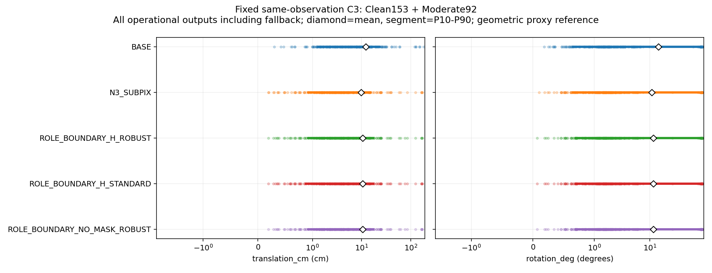
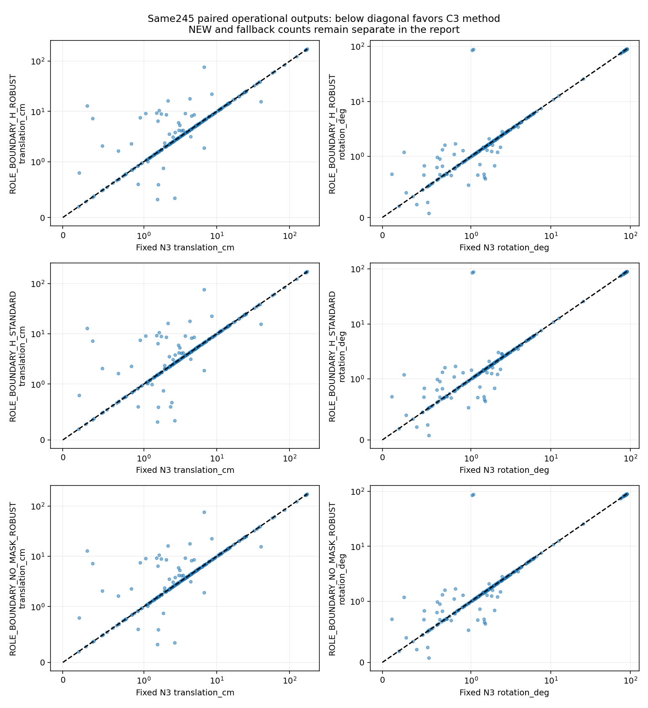
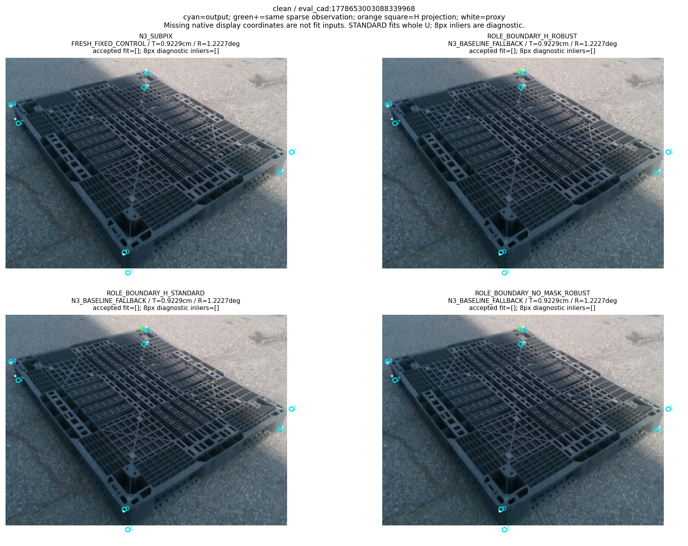
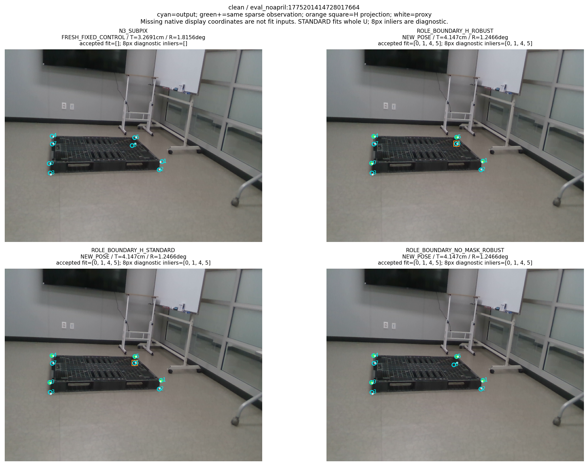
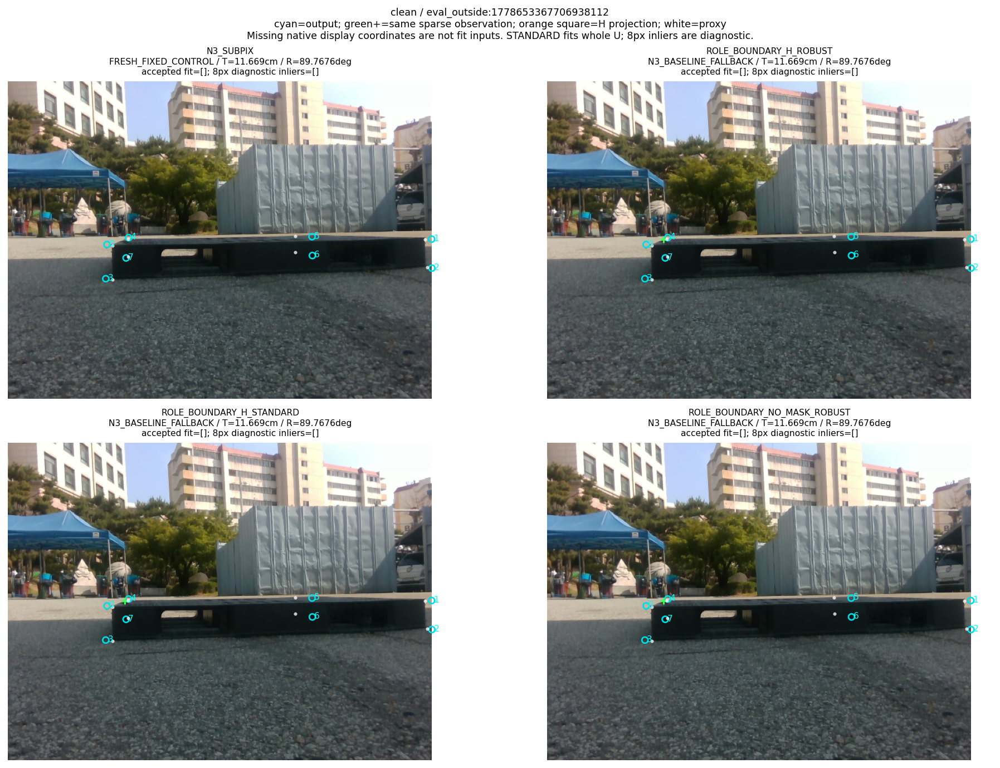
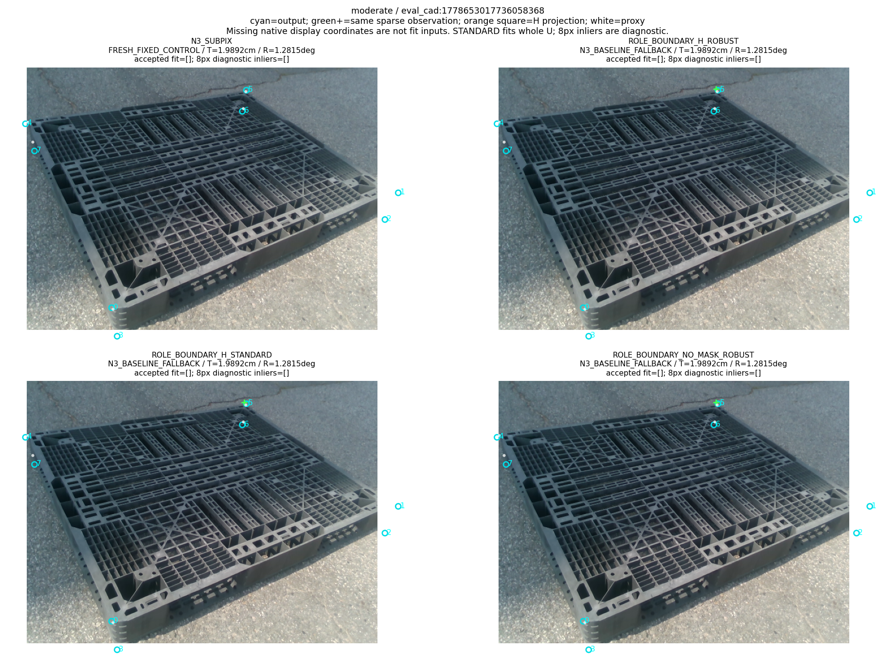
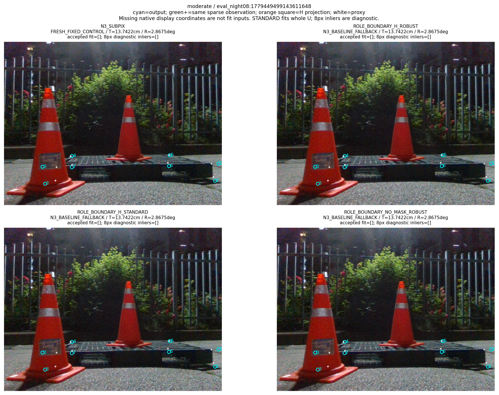
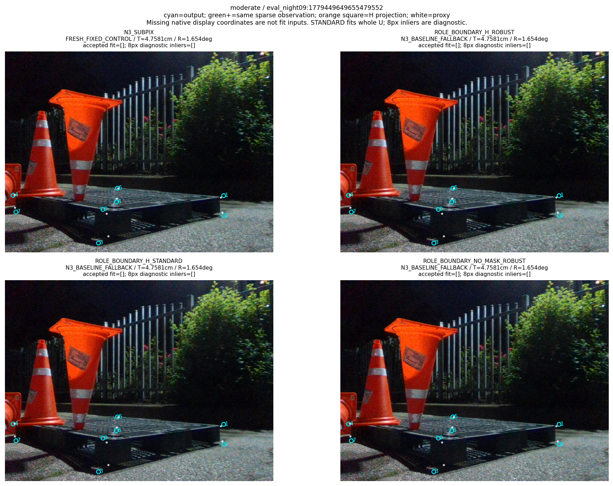

“가림 판단이 일부 틀려도 다른 유효 대응점으로 자세를 구하고 자기 가림 코너를 재투영했을 때, 기존 단순 대조보다 실제 위치·회전이 좋아졌는가?”

**고정 N3→cornerSubPix와 비교하면 아직 아니다.** 이번 V8은 같은 IMAGE_ROLE 경계 관측을 고정하고, 자기 가림 제외와 일반/강건 PnP의 기여를 실제로 분리한 진단이다. 쉬움153+중간92의 전체245장 운용 결과에서 H+강건은 위치10.461850cm·회전11.611525°이고, 고정 N3는9.754548cm·10.914842°다. H+일반도10.446592cm·11.618746°로 두 지표를 함께 개선하지 못했다. Base보다는 평균오차가 낮지만, 더 강한 기존 N3 대조를 이기지 못한 상태다. `goal_complete=false`를 유지한다.

이번에는 가림 마스크를 적용한 강건 PnP와 적용하지 않은 강건 PnP의 **실제 fit 대응집합 U가245/245장에서 같았고**, sparse 대응에서 추가로 제거된 H ID는0개였다. 두 경로의 최종 물리 자세와 위치·회전·ADDsym은 같았다. H를 제외한 경로는 NEW가 나오면 H 초기 좌표를 최종 자세의 재투영으로 교체하며, 마스크 없는 진단은 별도 비교용으로 H=[]를 사용한다. 마스크 없는 진단을 배포 경로로 승격하거나 최상위 목표의 H 교체 정책으로 바꾸지 않았다.

# V8 실제 비교 결과와 공개 감사 자료

## 1. 현재 확인된 문제는 어느 부분인가

남은 문제는 **가림 분류 하나의 정답률이 아니라, 관측 선택 후 남는 대응의 수·배치·상대 좌표 정확도**다. 동일 관측에서 sparse 유효 대응 U의 수는 0점45장, 1점68장, 2점67장, 3점22장, 4점36장, 5점7장이다. 따라서202/245장은 원래 이 sparse 공급만으로 최소4점에 못 미친다. 일반 PnP는 남은43장에서 NEW를 산출했다. 강건 PnP는43장 중3장을 합의 부족으로 N3 기본 출력으로 돌려40 NEW를 산출했다. 보이는 점을 조금 잘못 제외하더라도 남은 대응이 충분하면 풀지만, 부족한 경우를 NEW 성공으로 부풀리지 않았다.

현재 decoder가 채택한447개 경계 대응 가운데 기존 기하 proxy 기준으로8px 이내365개, 초과82개이며, 고정 N3 대응보다 좌표오차가 개선된 것은192개, 악화된 것은255개다. 이 진단에서 선택된 경계점의 상대 정확도가 충분하지 않다. 실제 물리 경계와 그 코너에 속한 두 선의 소유관계를 잘못 선택했을 가능성은 중요한 원인이지만, 이 표만으로 그 오류의 정확한 인과 비율을 확정하지 않는다. [이전 인과 감사](../pallet_three_head_observation_20261010_v7/METHOD_CAUSAL_AUDIT_KO.md), [V7 전체 결과](../pallet_three_head_observation_20261010_v7/RESULT_KO.md)와 함께 봐야 한다.

`self-occ` 초기 좌표를 fit에서 제외하고 NEW가 나오면 재투영으로 교체하는 구현과, hybrid 관측의 LOO 검증은 이미 존재한다. 이번 V8은 **V7의 boundary-only sparse q를 그대로 사용한 별도 C3 절제**이며 새 LOO를 실행하지 않았다. 표준/강건 차이는 같은 q 위에서 관측 부족과 합의의 효과를 확인한다. U<4에서 같은 sparse q와 아직 점 관측으로 소비하지 않은 실제 partial line 관측을 함께 사용하는 원래 남은 local C2 진단은 V9 별도 단계로 이어진다. native N3 대응을 fit에 보충하는 실험은 아니다. 이 V8 보고서에는 실행한 것처럼 넣지 않는다.

## 2. 과거 감독 오류, 수정 완료, 이번 결과를 구분한다

별도 연구 selector의 역사적 [training.py targets()](../../../scripts/research/pallet_observation_refiner_20261009_v1/training.py#L59)는 실제 물리 경계의 ray 교차가 수치적으로 miss되었을 때 NONE/no_match로 처리했다. source-test128에서 실제 대응이 있었던2164개 query가 잘못 NONE으로 감독됐고, 이후 실제 소유 메쉬 경계·마스크·깊이 증거로 POSITIVE/NONE/IGNORE 준비와 CPU gradient 검증을 완료했다. main의 N3→cornerSubPix 오류가 아니다. 역사 코드를 덮어쓰는 대신 [corrected READY loader](../../../scripts/research/pallet_kp_supervision_repair_20261010_v1/retrain.py#L100)가 수정 감독을 읽는 경로를 사용했다.

오류 인수인계 당시에는 수정 감독 재학습0이었다. 그 뒤 [corrected 학습 완료 영수증](../pallet_kp_corrected_supervision_20261010_v1/TRAINING_COMPLETION.json)의 세 조건 각3000update·batch16, 같은 초기화·배치 순서·학습량으로 총9000update가 실제 완료됐다. 수정 전9000과 수정 후9000은 별도 이력이다. **수정 전 IMAGE_ROLE의0/319 NEW를 수정 후 결과로 재사용하지 않는다.** [수정 감독 보고서](../pallet_kp_supervision_repair_20261010_v1/RESULT_KO.md)와 [corrected 후단 결과](../pallet_kp_corrected_supervision_20261010_v1/RESULT_KO.md)에 각 시점의 근거가 있다.

V8 신규 학습·합성 RGB·추가 seed·head/N3 forward는 모두0이다. 기존 P0 합성 학습이 네 가지 외부 가림/비가림 방해물/저대비 통제 변형을 별도로 검증하지 않았다는 제한도 그대로 남는다. 이미 수리된 감독을 다시 고치거나, 감독 수리만으로 실사 보정 성공을 주장하지 않았다.

## 3. 고정 비교의 범위와 기하 정책

[PROTOCOL.json](PROTOCOL.json)의 SHA는 `d7c66ec796622370fba2d7ca01c06894f3c28dfa6ec76c6e13bccbdf7d159c48`이다. 관측·solver·코드·부모 원행·평가 계약을735개 새 기하 실행 이전에 byte-bind했다. 이번 평가는 이미 결과를 본 known DEV245이며 unseen 일반화 평가가 아니다. 역사적 main/연구 브랜치319장은 Clean153·Moderate92·Severe74를 포함한다. 사용자의 이후 지시에 따라 **이번 새 실행은 쉬움153·중간92만245장**, Severe74 제외다. 역사319장 결과를 덮어쓰지 않았다.

| 방법 | 관측 | 초기 H 적용 | 최종 fit | NEW 이후 H 표시 |
| --- | --- | --- | --- | --- |
| Base | 고정 Base 좌표 | 기존 대조 | 기존 대조 | 기존 대조 |
| N3→cornerSubPix | 고정 N3 좌표 | 기존 대조 | 기존 대조 | 기존 대조 |
| H+강건 | 고정 V7 sparse IMAGE_ROLE q | 적용 | 유한4점 부분집합 합의·최종 inlier | 최종 R,t 재투영으로 교체 |
| H+일반 | 동일 q | 적용 | 전체 U의 표준 SSE·다중해 처리 | 최종 R,t 재투영으로 교체 |
| 마스크 없음+강건 | 동일 q | H=[] 진단 | 같은 유한4점 합의 | H=[] 진단이므로 교체 없음 |

[controls.py solve_controls()](../../../scripts/research/pallet_same_observation_controls_20261010_v8/controls.py#L234)는 동일 q/K/xyz의 단일 PoseBank를 프레임마다 만들고3경로를 순서대로 비교한다. 부모 H+강건 경로의 numerical/status parity를 먼저 확인한 후 나머지2경로를 실행한다. 모든 mask에서 동일4점 ID 가설을 공유하며 최대8점이면 최대70개 부분집합이라는 유한 정책을 유지한다. 이번 sparse q의 최대 U는5점이므로 실제 검토한 부분집합 수는 별도 원장에 기록된다.

H 초기 좌표는 H가 적용된 경로의 generator·fit·잔차 합의에 들어가지 않는다. NEW가 생기면 제외한 H를 최종 R,t 재투영으로 바꾼다. 재투영을 독립 관측으로 다시 PnP에 넣지 않는다. 표시에 남는 missing non-H native 좌표도 fit 입력으로 채우지 않는다. 마스크가 한 점 틀렸거나 fit 전후 H가 달라졌다는 이유로 프레임 전체를 실패시키지 않는다. 반면 관측 부족·수치 실패·다중해·기본 출력 반환은 구분한다.

일반 PnP는 전체 U의 SSE로 해를 정한다. `<=8px` inlier는 진단값이며 강건 합의의 NEW 조건을 일반 PnP에 강제로 적용하지 않는다. 실제 일반 NEW43장 가운데2장은 진단 inlier가4개보다 적었다. 이를 뒤늦게 실패로 바꾸지 않았다. 4·5점 표준해와 자연 IPPE 다중 반환, 의도적으로 주입한 SSE tie, rank witness 및 모호한 해의 반환을 CPU 계약에서 각각 확인했다. 단순히 과거6점 상수를4로 바꾸는 변경이 아니다.

## 4. 전체 운용 산출과 실패를 먼저 본다

다음 표는 [METRICS.json](METRICS.json)의 원행 집계를 그대로 표시한다. fixed control은 NEW 보정이나 fallback과 별도다. 출력이 없어서 큰오차 프레임이 평균에서 사라지는 상황은 이번 표에 없다. 새3방법 모두 전체245장 출력이 있으며, NEW만의 낮은 평균을 전체245장 성공으로 읽으면 안 된다.

| 집합 | 방법 | 전체 | 산출 | NEW | 기본 반환 | 완전 실패 | 평균 위치cm | 평균 회전° | 평균 ADDsym cm |
| --- | --- | --- | --- | --- | --- | --- | --- | --- | --- |
| combined | Base | 245 | 245 | 0 | 0 | 0 | 12.188351 | 14.232844 | 22.431946 |
| combined | N3→cornerSubPix | 245 | 245 | 0 | 0 | 0 | 9.754548 | 10.914842 | 17.028647 |
| combined | H+강건 | 245 | 245 | 40 | 205 | 0 | 10.461850 | 11.611525 | 18.328033 |
| combined | H+일반 | 245 | 245 | 43 | 202 | 0 | 10.446592 | 11.618746 | 18.320335 |
| combined | 마스크 없음+강건 | 245 | 245 | 40 | 205 | 0 | 10.461850 | 11.611525 | 18.328033 |
| easy | Base | 153 | 153 | 0 | 0 | 0 | 12.846348 | 10.628205 | 17.938605 |
| easy | N3→cornerSubPix | 153 | 153 | 0 | 0 | 0 | 10.107073 | 7.584578 | 12.915132 |
| easy | H+강건 | 153 | 153 | 37 | 116 | 0 | 11.267165 | 8.696357 | 15.024686 |
| easy | H+일반 | 153 | 153 | 39 | 114 | 0 | 11.254075 | 8.705036 | 15.021631 |
| easy | 마스크 없음+강건 | 153 | 153 | 37 | 116 | 0 | 11.267165 | 8.696357 | 15.024686 |
| medium | Base | 92 | 92 | 0 | 0 | 0 | 11.094074 | 20.227517 | 29.904567 |
| medium | N3→cornerSubPix | 92 | 92 | 0 | 0 | 0 | 9.168284 | 16.453215 | 23.869600 |
| medium | H+강건 | 92 | 92 | 3 | 89 | 0 | 9.122577 | 16.459576 | 23.821642 |
| medium | H+일반 | 92 | 92 | 4 | 88 | 0 | 9.103713 | 16.464374 | 23.806223 |
| medium | 마스크 없음+강건 | 92 | 92 | 3 | 89 | 0 | 9.122577 | 16.459576 | 23.821642 |

combined의 Base보다 H+강건 평균이 낮다는 관찰은 유지한다. 그러나 고정 N3 대조보다 평균 위치+0.707302cm, 회전+0.696683°로 나쁘다. 일반 PnP는 NEW를3장 더 산출하고 위치 평균은 강건보다0.015258cm 작지만 회전은0.007221° 커진다. 이것이 강건 솔버가 이 문제를 해결했다는 증거가 아니다.

## 5. 같은 프레임 쌍과 고정 CI

모든 차이는 `앞 방법 − 뒤 대조`이며 음수가 개선이다. `common_operational`은 둘 다 최종 출력이 있는 같은 프레임, `candidate_new_pose`는 그중 앞 방법이 NEW인 프레임, `both_new_pose`는 둘 다 NEW인 프레임이다. fixed Base/N3는 보정 NEW가 아니므로 이들과의 `both_new_pose`는 빈 집합이며 None을0으로 채우지 않았다. NEW 집합은 출력 정책에 따라 선택된 조건부 집합이므로 그 평균만으로 전체 운용 성능을 주장하지 않는다.

기존13 session의 동일10000 draw를 사용했다. 새 draw·seed는0이다.8 contrasts×3strata×3paired scopes=72그룹,3metrics의216CI 가운데162개는 비어 있지 않고54개는 None이다. 부모 primary 결과는 알려진 상태에서 사후 진단을 더한 것이므로 새 unseen primary 검정으로 해석하지 않는다.

### combined / common_operational

| 차이 | 같은 산출n | 앞 NEW | 뒤 NEW | Δ위치cm | CI95 | Δ회전° | CI95 | ΔADDsym cm | CI95 |
| --- | --- | --- | --- | --- | --- | --- | --- | --- | --- |
| H+강건 − Base | 245 | 40 | 0 | -1.726501 | [-2.940254, -0.233939] | -2.621319 | [-4.498662, -0.259599] | -4.103913 | [-7.480937, -0.654896] |
| H+강건 − N3→cornerSubPix | 245 | 40 | 0 | 0.707302 | [-0.205038, 2.145884] | 0.696683 | [-0.026588, 1.944100] | 1.299386 | [-0.213307, 3.808537] |
| H+일반 − Base | 245 | 43 | 0 | -1.741759 | [-2.947579, -0.256534] | -2.614098 | [-4.496724, -0.252486] | -4.111611 | [-7.481162, -0.664792] |
| H+일반 − N3→cornerSubPix | 245 | 43 | 0 | 0.692044 | [-0.220655, 2.137507] | 0.703905 | [-0.021626, 1.953314] | 1.291688 | [-0.219812, 3.804110] |
| 마스크 없음+강건 − Base | 245 | 40 | 0 | -1.726501 | [-2.940254, -0.233939] | -2.621319 | [-4.498662, -0.259599] | -4.103913 | [-7.480937, -0.654896] |
| 마스크 없음+강건 − N3→cornerSubPix | 245 | 40 | 0 | 0.707302 | [-0.205038, 2.145884] | 0.696683 | [-0.026588, 1.944100] | 1.299386 | [-0.213307, 3.808537] |
| H+일반 − H+강건 | 245 | 43 | 40 | -0.015258 | [-0.047621, 0.000000] | 0.007221 | [0.000000, 0.019876] | -0.007698 | [-0.029684, 0.004958] |
| 마스크 없음+강건 − H+강건 | 245 | 40 | 40 | 0.000000 | [0.000000, 0.000000] | 0.000000 | [0.000000, 0.000000] | 0.000000 | [0.000000, 0.000000] |

### combined / candidate_new_pose

| 차이 | 같은 산출n | 앞 NEW | 뒤 NEW | Δ위치cm | CI95 | Δ회전° | CI95 | ΔADDsym cm | CI95 |
| --- | --- | --- | --- | --- | --- | --- | --- | --- | --- |
| H+강건 − Base | 40 | 40 | 0 | -0.665453 | [-2.489382, 0.007174] | 0.251350 | [-0.316140, 0.526270] | -1.477346 | [-2.578097, -0.424259] |
| H+강건 − N3→cornerSubPix | 40 | 40 | 0 | 4.332224 | [-2.471638, 8.255802] | 4.267185 | [-0.234844, 7.488056] | 7.958741 | [-2.593899, 14.659139] |
| H+일반 − Base | 43 | 43 | 0 | -0.706511 | [-2.384687, -0.041183] | 0.213556 | [-0.337492, 0.506772] | -1.442273 | [-2.465671, -0.506967] |
| H+일반 − N3→cornerSubPix | 43 | 43 | 0 | 3.943042 | [-2.290119, 7.981779] | 4.010619 | [-0.171404, 7.354773] | 7.359618 | [-2.355594, 14.248493] |
| 마스크 없음+강건 − Base | 40 | 40 | 0 | -0.665453 | [-2.489382, 0.007174] | 0.251350 | [-0.316140, 0.526270] | -1.477346 | [-2.578097, -0.424259] |
| 마스크 없음+강건 − N3→cornerSubPix | 40 | 40 | 0 | 4.332224 | [-2.471638, 8.255802] | 4.267185 | [-0.234844, 7.488056] | 7.958741 | [-2.593899, 14.659139] |
| H+일반 − H+강건 | 43 | 43 | 40 | -0.086934 | [-0.343559, 0.000000] | 0.041144 | [0.000000, 0.145927] | -0.043862 | [-0.209127, 0.036957] |
| 마스크 없음+강건 − H+강건 | 40 | 40 | 40 | 0.000000 | [0.000000, 0.000000] | 0.000000 | [0.000000, 0.000000] | 0.000000 | [0.000000, 0.000000] |

### combined / both_new_pose

| 차이 | 같은 산출n | 앞 NEW | 뒤 NEW | Δ위치cm | CI95 | Δ회전° | CI95 | ΔADDsym cm | CI95 |
| --- | --- | --- | --- | --- | --- | --- | --- | --- | --- |
| H+강건 − Base | 0 | 0 | 0 | None | None | None | None | None | None |
| H+강건 − N3→cornerSubPix | 0 | 0 | 0 | None | None | None | None | None | None |
| H+일반 − Base | 0 | 0 | 0 | None | None | None | None | None | None |
| H+일반 − N3→cornerSubPix | 0 | 0 | 0 | None | None | None | None | None | None |
| 마스크 없음+강건 − Base | 0 | 0 | 0 | None | None | None | None | None | None |
| 마스크 없음+강건 − N3→cornerSubPix | 0 | 0 | 0 | None | None | None | None | None | None |
| H+일반 − H+강건 | 40 | 40 | 40 | 0.000000 | [0.000000, 0.000000] | 0.000000 | [0.000000, 0.000000] | 0.000000 | [0.000000, 0.000000] |
| 마스크 없음+강건 − H+강건 | 40 | 40 | 40 | 0.000000 | [0.000000, 0.000000] | 0.000000 | [0.000000, 0.000000] | 0.000000 | [0.000000, 0.000000] |

### easy / common_operational

| 차이 | 같은 산출n | 앞 NEW | 뒤 NEW | Δ위치cm | CI95 | Δ회전° | CI95 | ΔADDsym cm | CI95 |
| --- | --- | --- | --- | --- | --- | --- | --- | --- | --- |
| H+강건 − Base | 153 | 37 | 0 | -1.579184 | [-3.139913, 0.657378] | -1.931848 | [-3.829615, 1.340016] | -2.913919 | [-6.773573, 1.435510] |
| H+강건 − N3→cornerSubPix | 153 | 37 | 0 | 1.160092 | [-0.042274, 3.172131] | 1.111779 | [-0.045938, 3.153621] | 2.109554 | [-0.050602, 5.860688] |
| H+일반 − Base | 153 | 39 | 0 | -1.592274 | [-3.148983, 0.640059] | -1.923169 | [-3.825936, 1.352824] | -2.916974 | [-6.776117, 1.426446] |
| H+일반 − N3→cornerSubPix | 153 | 39 | 0 | 1.147002 | [-0.068016, 3.161702] | 1.120457 | [-0.038666, 3.161178] | 2.106498 | [-0.055602, 5.864503] |
| 마스크 없음+강건 − Base | 153 | 37 | 0 | -1.579184 | [-3.139913, 0.657378] | -1.931848 | [-3.829615, 1.340016] | -2.913919 | [-6.773573, 1.435510] |
| 마스크 없음+강건 − N3→cornerSubPix | 153 | 37 | 0 | 1.160092 | [-0.042274, 3.172131] | 1.111779 | [-0.045938, 3.153621] | 2.109554 | [-0.050602, 5.860688] |
| H+일반 − H+강건 | 153 | 39 | 37 | -0.013090 | [-0.041133, 0.000000] | 0.008679 | [0.000000, 0.023979] | -0.003056 | [-0.018130, 0.008296] |
| 마스크 없음+강건 − H+강건 | 153 | 37 | 37 | 0.000000 | [0.000000, 0.000000] | 0.000000 | [0.000000, 0.000000] | 0.000000 | [0.000000, 0.000000] |

### easy / candidate_new_pose

| 차이 | 같은 산출n | 앞 NEW | 뒤 NEW | Δ위치cm | CI95 | Δ회전° | CI95 | ΔADDsym cm | CI95 |
| --- | --- | --- | --- | --- | --- | --- | --- | --- | --- |
| H+강건 − Base | 37 | 37 | 0 | -0.581065 | [-1.012871, 0.534658] | 0.273091 | [-0.312742, 0.579317] | -1.455976 | [-2.468143, 0.392980] |
| H+강건 − N3→cornerSubPix | 37 | 37 | 0 | 4.797138 | [-0.285461, 8.312013] | 4.597355 | [-0.268342, 8.312815] | 8.723290 | [-0.343501, 15.410532] |
| H+일반 − Base | 39 | 39 | 0 | -0.614068 | [-1.025108, 0.411797] | 0.242162 | [-0.340920, 0.564561] | -1.428316 | [-2.424521, 0.300943] |
| H+일반 − N3→cornerSubPix | 39 | 39 | 0 | 4.499778 | [-0.392398, 8.114604] | 4.395640 | [-0.199572, 8.171430] | 8.263954 | [-0.316427, 15.055784] |
| 마스크 없음+강건 − Base | 37 | 37 | 0 | -0.581065 | [-1.012871, 0.534658] | 0.273091 | [-0.312742, 0.579317] | -1.455976 | [-2.468143, 0.392980] |
| 마스크 없음+강건 − N3→cornerSubPix | 37 | 37 | 0 | 4.797138 | [-0.285461, 8.312013] | 4.597355 | [-0.268342, 8.312815] | 8.723290 | [-0.343501, 15.410532] |
| H+일반 − H+강건 | 39 | 39 | 37 | -0.051353 | [-0.201879, 0.000000] | 0.034047 | [0.000000, 0.120712] | -0.011988 | [-0.086639, 0.040653] |
| 마스크 없음+강건 − H+강건 | 37 | 37 | 37 | 0.000000 | [0.000000, 0.000000] | 0.000000 | [0.000000, 0.000000] | 0.000000 | [0.000000, 0.000000] |

### easy / both_new_pose

| 차이 | 같은 산출n | 앞 NEW | 뒤 NEW | Δ위치cm | CI95 | Δ회전° | CI95 | ΔADDsym cm | CI95 |
| --- | --- | --- | --- | --- | --- | --- | --- | --- | --- |
| H+강건 − Base | 0 | 0 | 0 | None | None | None | None | None | None |
| H+강건 − N3→cornerSubPix | 0 | 0 | 0 | None | None | None | None | None | None |
| H+일반 − Base | 0 | 0 | 0 | None | None | None | None | None | None |
| H+일반 − N3→cornerSubPix | 0 | 0 | 0 | None | None | None | None | None | None |
| 마스크 없음+강건 − Base | 0 | 0 | 0 | None | None | None | None | None | None |
| 마스크 없음+강건 − N3→cornerSubPix | 0 | 0 | 0 | None | None | None | None | None | None |
| H+일반 − H+강건 | 37 | 37 | 37 | 0.000000 | [0.000000, 0.000000] | 0.000000 | [0.000000, 0.000000] | 0.000000 | [0.000000, 0.000000] |
| 마스크 없음+강건 − H+강건 | 37 | 37 | 37 | 0.000000 | [0.000000, 0.000000] | 0.000000 | [0.000000, 0.000000] | 0.000000 | [0.000000, 0.000000] |

### medium / common_operational

| 차이 | 같은 산출n | 앞 NEW | 뒤 NEW | Δ위치cm | CI95 | Δ회전° | CI95 | ΔADDsym cm | CI95 |
| --- | --- | --- | --- | --- | --- | --- | --- | --- | --- |
| H+강건 − Base | 92 | 3 | 0 | -1.971497 | [-3.578363, -0.584697] | -3.767941 | [-7.561854, -0.190934] | -6.082925 | [-10.823412, -1.548963] |
| H+강건 − N3→cornerSubPix | 92 | 3 | 0 | -0.045708 | [-0.753870, 0.596271] | 0.006362 | [0.000000, 0.015014] | -0.047958 | [-0.754382, 0.588725] |
| H+일반 − Base | 92 | 4 | 0 | -1.990360 | [-3.586119, -0.614739] | -3.763143 | [-7.558702, -0.179917] | -6.098344 | [-10.830275, -1.566719] |
| H+일반 − N3→cornerSubPix | 92 | 4 | 0 | -0.064571 | [-0.770645, 0.573489] | 0.011159 | [0.000000, 0.023382] | -0.063376 | [-0.763398, 0.569237] |
| 마스크 없음+강건 − Base | 92 | 3 | 0 | -1.971497 | [-3.578363, -0.584697] | -3.767941 | [-7.561854, -0.190934] | -6.082925 | [-10.823412, -1.548963] |
| 마스크 없음+강건 − N3→cornerSubPix | 92 | 3 | 0 | -0.045708 | [-0.753870, 0.596271] | 0.006362 | [0.000000, 0.015014] | -0.047958 | [-0.754382, 0.588725] |
| H+일반 − H+강건 | 92 | 4 | 3 | -0.018863 | [-0.064274, 0.000000] | 0.004798 | [0.000000, 0.016347] | -0.015419 | [-0.052538, 0.000000] |
| 마스크 없음+강건 − H+강건 | 92 | 3 | 3 | 0.000000 | [0.000000, 0.000000] | 0.000000 | [0.000000, 0.000000] | 0.000000 | [0.000000, 0.000000] |

### medium / candidate_new_pose

| 차이 | 같은 산출n | 앞 NEW | 뒤 NEW | Δ위치cm | CI95 | Δ회전° | CI95 | ΔADDsym cm | CI95 |
| --- | --- | --- | --- | --- | --- | --- | --- | --- | --- |
| H+강건 − Base | 3 | 3 | 0 | -1.706245 | [-24.737275, 9.809270] | -0.016799 | [-0.597007, 0.273304] | -1.740908 | [-24.710360, 9.743818] |
| H+강건 − N3→cornerSubPix | 3 | 3 | 0 | -1.401710 | [-24.478349, 10.136610] | 0.195088 | [0.086125, 0.413012] | -1.470700 | [-24.428750, 10.008324] |
| H+일반 − Base | 4 | 4 | 0 | -1.607836 | [-24.737275, 9.809270] | -0.065357 | [-0.597007, 0.273304] | -1.578351 | [-24.710360, 9.743818] |
| H+일반 − N3→cornerSubPix | 4 | 4 | 0 | -1.485133 | [-24.478349, 10.136610] | 0.256661 | [0.086125, 0.441382] | -1.457656 | [-24.428750, 10.008324] |
| 마스크 없음+강건 − Base | 3 | 3 | 0 | -1.706245 | [-24.737275, 9.809270] | -0.016799 | [-0.597007, 0.273304] | -1.740908 | [-24.710360, 9.743818] |
| 마스크 없음+강건 − N3→cornerSubPix | 3 | 3 | 0 | -1.401710 | [-24.478349, 10.136610] | 0.195088 | [0.086125, 0.413012] | -1.470700 | [-24.428750, 10.008324] |
| H+일반 − H+강건 | 4 | 4 | 3 | -0.433851 | [-1.735402, 0.000000] | 0.110346 | [0.000000, 0.441382] | -0.354630 | [-1.418521, 0.000000] |
| 마스크 없음+강건 − H+강건 | 3 | 3 | 3 | 0.000000 | [0.000000, 0.000000] | 0.000000 | [0.000000, 0.000000] | 0.000000 | [0.000000, 0.000000] |

### medium / both_new_pose

| 차이 | 같은 산출n | 앞 NEW | 뒤 NEW | Δ위치cm | CI95 | Δ회전° | CI95 | ΔADDsym cm | CI95 |
| --- | --- | --- | --- | --- | --- | --- | --- | --- | --- |
| H+강건 − Base | 0 | 0 | 0 | None | None | None | None | None | None |
| H+강건 − N3→cornerSubPix | 0 | 0 | 0 | None | None | None | None | None | None |
| H+일반 − Base | 0 | 0 | 0 | None | None | None | None | None | None |
| H+일반 − N3→cornerSubPix | 0 | 0 | 0 | None | None | None | None | None | None |
| 마스크 없음+강건 − Base | 0 | 0 | 0 | None | None | None | None | None | None |
| 마스크 없음+강건 − N3→cornerSubPix | 0 | 0 | 0 | None | None | None | None | None | None |
| H+일반 − H+강건 | 3 | 3 | 3 | 0.000000 | [0.000000, 0.000000] | 0.000000 | [0.000000, 0.000000] | 0.000000 | [0.000000, 0.000000] |
| 마스크 없음+강건 − H+강건 | 3 | 3 | 3 | 0.000000 | [0.000000, 0.000000] | 0.000000 | [0.000000, 0.000000] | 0.000000 | [0.000000, 0.000000] |

## 6. 원행의 전체 평균·분산·표준편차·중앙값·P90

단위는 위치/ADDsym의 평균·중앙값·P90·최대값은cm, 회전은degree다. 표본분산은 각각cm²/degree²이고 분모는n−1이다. 표준편차는cm/degree다. n=0이면 값은None, n=1이면 표본분산·표준편차는None이다. 표의 소수점6자리 반올림 전 값은 [METRICS.json](METRICS.json), [METRICS.csv](METRICS.csv)에 있다. 아래135개 metric 분포의810scalar를 독립 stdlib 검사기가 검산했다. operational/NEW/fallback을 모두 보여 주므로 NEW만 남기는 선택 효과를 확인할 수 있다.

### combined / operational

| 방법 | 지표 | n | 평균 | 표본분산 | 표준편차 | 중앙값 | P90 | 최대 |
| --- | --- | --- | --- | --- | --- | --- | --- | --- |
| Base | translation_cm | 245 | 12.188351 | 538.579067 | 23.207306 | 6.010803 | 23.191872 | 183.078505 |
| Base | rotation_deg | 245 | 14.232844 | 851.384155 | 29.178488 | 1.839738 | 82.810639 | 90.009175 |
| Base | ADDsym_cm | 245 | 22.431946 | 1506.002205 | 38.807244 | 6.405062 | 110.036532 | 188.991522 |
| N3→cornerSubPix | translation_cm | 245 | 9.754548 | 575.936024 | 23.998667 | 3.597350 | 15.085014 | 174.756827 |
| N3→cornerSubPix | rotation_deg | 245 | 10.914842 | 665.180601 | 25.791095 | 1.665993 | 76.095325 | 89.777634 |
| N3→cornerSubPix | ADDsym_cm | 245 | 17.028647 | 1298.810870 | 36.039019 | 3.936935 | 68.431494 | 180.988442 |
| H+강건 | translation_cm | 245 | 10.461850 | 587.300434 | 24.234282 | 4.176240 | 17.382818 | 174.756827 |
| H+강건 | rotation_deg | 245 | 11.611525 | 711.896091 | 26.681381 | 1.633321 | 81.447378 | 89.777634 |
| H+강건 | ADDsym_cm | 245 | 18.328033 | 1379.546028 | 37.142240 | 4.346436 | 71.971885 | 180.988442 |
| H+일반 | translation_cm | 245 | 10.446592 | 587.575737 | 24.239962 | 4.176240 | 17.382818 | 174.756827 |
| H+일반 | rotation_deg | 245 | 11.618746 | 711.760796 | 26.678845 | 1.633321 | 81.447378 | 89.777634 |
| H+일반 | ADDsym_cm | 245 | 18.320335 | 1379.803051 | 37.145700 | 4.346436 | 71.971885 | 180.988442 |
| 마스크 없음+강건 | translation_cm | 245 | 10.461850 | 587.300434 | 24.234282 | 4.176240 | 17.382818 | 174.756827 |
| 마스크 없음+강건 | rotation_deg | 245 | 11.611525 | 711.896091 | 26.681381 | 1.633321 | 81.447378 | 89.777634 |
| 마스크 없음+강건 | ADDsym_cm | 245 | 18.328033 | 1379.546028 | 37.142240 | 4.346436 | 71.971885 | 180.988442 |

### combined / new_pose

| 방법 | 지표 | n | 평균 | 표본분산 | 표준편차 | 중앙값 | P90 | 최대 |
| --- | --- | --- | --- | --- | --- | --- | --- | --- |
| Base | translation_cm | 0 | None | None | None | None | None | None |
| Base | rotation_deg | 0 | None | None | None | None | None | None |
| Base | ADDsym_cm | 0 | None | None | None | None | None | None |
| N3→cornerSubPix | translation_cm | 0 | None | None | None | None | None | None |
| N3→cornerSubPix | rotation_deg | 0 | None | None | None | None | None | None |
| N3→cornerSubPix | ADDsym_cm | 0 | None | None | None | None | None | None |
| H+강건 | translation_cm | 40 | 7.840614 | 149.392430 | 12.222620 | 4.198278 | 15.787048 | 75.868967 |
| H+강건 | rotation_deg | 40 | 5.390290 | 362.908271 | 19.050151 | 0.915155 | 2.161215 | 88.845302 |
| H+강건 | ADDsym_cm | 40 | 11.717162 | 705.582434 | 26.562802 | 4.331863 | 15.848203 | 131.208714 |
| H+일반 | translation_cm | 43 | 7.346269 | 142.059623 | 11.918877 | 4.176240 | 15.173945 | 75.868967 |
| H+일반 | rotation_deg | 43 | 5.186237 | 337.591548 | 18.373665 | 0.989978 | 2.889788 | 88.845302 |
| H+일반 | ADDsym_cm | 43 | 11.029457 | 661.682498 | 25.723190 | 4.239944 | 15.239892 | 131.208714 |
| 마스크 없음+강건 | translation_cm | 40 | 7.840614 | 149.392430 | 12.222620 | 4.198278 | 15.787048 | 75.868967 |
| 마스크 없음+강건 | rotation_deg | 40 | 5.390290 | 362.908271 | 19.050151 | 0.915155 | 2.161215 | 88.845302 |
| 마스크 없음+강건 | ADDsym_cm | 40 | 11.717162 | 705.582434 | 26.562802 | 4.331863 | 15.848203 | 131.208714 |

### combined / fallback

| 방법 | 지표 | n | 평균 | 표본분산 | 표준편차 | 중앙값 | P90 | 최대 |
| --- | --- | --- | --- | --- | --- | --- | --- | --- |
| Base | translation_cm | 0 | None | None | None | None | None | None |
| Base | rotation_deg | 0 | None | None | None | None | None | None |
| Base | ADDsym_cm | 0 | None | None | None | None | None | None |
| N3→cornerSubPix | translation_cm | 0 | None | None | None | None | None | None |
| N3→cornerSubPix | rotation_deg | 0 | None | None | None | None | None | None |
| N3→cornerSubPix | ADDsym_cm | 0 | None | None | None | None | None | None |
| H+강건 | translation_cm | 205 | 10.973311 | 672.286959 | 25.928497 | 3.933522 | 19.076598 | 174.756827 |
| H+강건 | rotation_deg | 205 | 12.825425 | 773.034287 | 27.803494 | 1.873887 | 81.870946 | 89.777634 |
| H+강건 | ADDsym_cm | 205 | 19.617959 | 1504.913086 | 38.793209 | 4.346436 | 79.605855 | 180.988442 |
| H+일반 | translation_cm | 202 | 11.106562 | 681.097894 | 26.097852 | 4.100267 | 19.736844 | 174.756827 |
| H+일반 | rotation_deg | 202 | 12.988043 | 782.750380 | 27.977676 | 1.864431 | 81.962825 | 89.777634 |
| H+일반 | ADDsym_cm | 202 | 19.872353 | 1522.930163 | 39.024738 | 4.423866 | 81.701727 | 180.988442 |
| 마스크 없음+강건 | translation_cm | 205 | 10.973311 | 672.286959 | 25.928497 | 3.933522 | 19.076598 | 174.756827 |
| 마스크 없음+강건 | rotation_deg | 205 | 12.825425 | 773.034287 | 27.803494 | 1.873887 | 81.870946 | 89.777634 |
| 마스크 없음+강건 | ADDsym_cm | 205 | 19.617959 | 1504.913086 | 38.793209 | 4.346436 | 79.605855 | 180.988442 |

### easy / operational

| 방법 | 지표 | n | 평균 | 표본분산 | 표준편차 | 중앙값 | P90 | 최대 |
| --- | --- | --- | --- | --- | --- | --- | --- | --- |
| Base | translation_cm | 153 | 12.846348 | 790.451432 | 28.114968 | 4.668214 | 19.836603 | 183.078505 |
| Base | rotation_deg | 153 | 10.628205 | 616.624794 | 24.831931 | 1.715556 | 50.873619 | 89.479285 |
| Base | ADDsym_cm | 153 | 17.938605 | 1268.885882 | 35.621424 | 5.516163 | 53.332337 | 188.991522 |
| N3→cornerSubPix | translation_cm | 153 | 10.107073 | 859.717470 | 29.320939 | 2.691885 | 12.762646 | 174.756827 |
| N3→cornerSubPix | rotation_deg | 153 | 7.584578 | 435.544581 | 20.869705 | 1.541652 | 5.923153 | 89.767637 |
| N3→cornerSubPix | ADDsym_cm | 153 | 12.915132 | 1130.584507 | 33.624166 | 2.966195 | 14.831169 | 180.988442 |
| H+강건 | translation_cm | 153 | 11.267165 | 882.601543 | 29.708611 | 3.184987 | 14.525877 | 174.756827 |
| H+강건 | rotation_deg | 153 | 8.696357 | 517.599212 | 22.750807 | 1.531943 | 7.363038 | 89.767637 |
| H+강건 | ADDsym_cm | 153 | 15.024686 | 1281.456701 | 35.797440 | 3.477929 | 16.753890 | 180.988442 |
| H+일반 | translation_cm | 153 | 11.254075 | 882.861174 | 29.712980 | 3.184987 | 14.525877 | 174.756827 |
| H+일반 | rotation_deg | 153 | 8.705036 | 517.493255 | 22.748478 | 1.531943 | 7.363038 | 89.767637 |
| H+일반 | ADDsym_cm | 153 | 15.021631 | 1281.539382 | 35.798595 | 3.477929 | 16.753890 | 180.988442 |
| 마스크 없음+강건 | translation_cm | 153 | 11.267165 | 882.601543 | 29.708611 | 3.184987 | 14.525877 | 174.756827 |
| 마스크 없음+강건 | rotation_deg | 153 | 8.696357 | 517.599212 | 22.750807 | 1.531943 | 7.363038 | 89.767637 |
| 마스크 없음+강건 | ADDsym_cm | 153 | 15.024686 | 1281.456701 | 35.797440 | 3.477929 | 16.753890 | 180.988442 |

### easy / new_pose

| 방법 | 지표 | n | 평균 | 표본분산 | 표준편차 | 중앙값 | P90 | 최대 |
| --- | --- | --- | --- | --- | --- | --- | --- | --- |
| Base | translation_cm | 0 | None | None | None | None | None | None |
| Base | rotation_deg | 0 | None | None | None | None | None | None |
| Base | ADDsym_cm | 0 | None | None | None | None | None | None |
| N3→cornerSubPix | translation_cm | 0 | None | None | None | None | None | None |
| N3→cornerSubPix | rotation_deg | 0 | None | None | None | None | None | None |
| N3→cornerSubPix | ADDsym_cm | 0 | None | None | None | None | None | None |
| H+강건 | translation_cm | 37 | 7.333612 | 157.002426 | 12.530061 | 4.176240 | 11.514124 | 75.868967 |
| H+강건 | rotation_deg | 37 | 5.711040 | 391.719118 | 19.791895 | 0.871773 | 2.145233 | 88.845302 |
| H+강건 | ADDsym_cm | 37 | 11.520275 | 762.526667 | 27.613885 | 4.239944 | 11.583552 | 131.208714 |
| H+일반 | translation_cm | 39 | 6.998374 | 150.875076 | 12.283122 | 4.146962 | 11.043068 | 75.868967 |
| H+일반 | rotation_deg | 39 | 5.570599 | 371.477038 | 19.273740 | 0.958537 | 2.932956 | 88.845302 |
| H+일반 | ADDsym_cm | 39 | 11.046230 | 726.680354 | 26.957009 | 4.234964 | 11.112230 | 131.208714 |
| 마스크 없음+강건 | translation_cm | 37 | 7.333612 | 157.002426 | 12.530061 | 4.176240 | 11.514124 | 75.868967 |
| 마스크 없음+강건 | rotation_deg | 37 | 5.711040 | 391.719118 | 19.791895 | 0.871773 | 2.145233 | 88.845302 |
| 마스크 없음+강건 | ADDsym_cm | 37 | 11.520275 | 762.526667 | 27.613885 | 4.239944 | 11.583552 | 131.208714 |

### easy / fallback

| 방법 | 지표 | n | 평균 | 표본분산 | 표준편차 | 중앙값 | P90 | 최대 |
| --- | --- | --- | --- | --- | --- | --- | --- | --- |
| Base | translation_cm | 0 | None | None | None | None | None | None |
| Base | rotation_deg | 0 | None | None | None | None | None | None |
| Base | ADDsym_cm | 0 | None | None | None | None | None | None |
| N3→cornerSubPix | translation_cm | 0 | None | None | None | None | None | None |
| N3→cornerSubPix | rotation_deg | 0 | None | None | None | None | None | None |
| N3→cornerSubPix | ADDsym_cm | 0 | None | None | None | None | None | None |
| H+강건 | translation_cm | 116 | 12.521832 | 1110.854315 | 33.329481 | 2.916066 | 14.676582 | 174.756827 |
| H+강건 | rotation_deg | 116 | 9.648570 | 557.724045 | 23.616182 | 1.761391 | 11.730521 | 89.767637 |
| H+강건 | ADDsym_cm | 116 | 16.142473 | 1449.835909 | 38.076711 | 3.371503 | 30.317303 | 180.988442 |
| H+일반 | translation_cm | 114 | 12.709972 | 1128.439632 | 33.592256 | 2.971398 | 14.722626 | 174.756827 |
| H+일반 | rotation_deg | 114 | 9.777343 | 566.624799 | 23.803882 | 1.728109 | 12.095745 | 89.767637 |
| H+일반 | ADDsym_cm | 114 | 16.381636 | 1472.149804 | 38.368604 | 3.436626 | 32.427963 | 180.988442 |
| 마스크 없음+강건 | translation_cm | 116 | 12.521832 | 1110.854315 | 33.329481 | 2.916066 | 14.676582 | 174.756827 |
| 마스크 없음+강건 | rotation_deg | 116 | 9.648570 | 557.724045 | 23.616182 | 1.761391 | 11.730521 | 89.767637 |
| 마스크 없음+강건 | ADDsym_cm | 116 | 16.142473 | 1449.835909 | 38.076711 | 3.371503 | 30.317303 | 180.988442 |

### medium / operational

| 방법 | 지표 | n | 평균 | 표본분산 | 표준편차 | 중앙값 | P90 | 최대 |
| --- | --- | --- | --- | --- | --- | --- | --- | --- |
| Base | translation_cm | 92 | 11.094074 | 121.849087 | 11.038527 | 7.851390 | 26.036089 | 60.431862 |
| Base | rotation_deg | 92 | 20.227517 | 1194.688456 | 34.564266 | 1.998780 | 86.159213 | 90.009175 |
| Base | ADDsym_cm | 92 | 29.904567 | 1828.214398 | 42.757624 | 8.142242 | 116.222803 | 121.238948 |
| N3→cornerSubPix | translation_cm | 92 | 9.168284 | 107.699997 | 10.377861 | 5.220474 | 23.637317 | 61.923605 |
| N3→cornerSubPix | rotation_deg | 92 | 16.453215 | 1006.400563 | 31.723817 | 1.981300 | 85.510157 | 89.777634 |
| N3→cornerSubPix | ADDsym_cm | 92 | 23.869600 | 1518.314503 | 38.965555 | 5.436086 | 112.131374 | 121.344766 |
| H+강건 | translation_cm | 92 | 9.122577 | 97.600329 | 9.879288 | 5.390664 | 21.910031 | 61.923605 |
| H+강건 | rotation_deg | 92 | 16.459576 | 1006.208894 | 31.720796 | 2.026343 | 85.510157 | 89.777634 |
| H+강건 | ADDsym_cm | 92 | 23.821642 | 1509.689284 | 38.854720 | 5.574611 | 112.131374 | 121.344766 |
| H+일반 | translation_cm | 92 | 9.103713 | 97.889181 | 9.893896 | 5.390664 | 21.910031 | 61.923605 |
| H+일반 | rotation_deg | 92 | 16.464374 | 1006.061143 | 31.718467 | 2.026343 | 85.510157 | 89.777634 |
| H+일반 | ADDsym_cm | 92 | 23.806223 | 1510.377572 | 38.863576 | 5.574611 | 112.131374 | 121.344766 |
| 마스크 없음+강건 | translation_cm | 92 | 9.122577 | 97.600329 | 9.879288 | 5.390664 | 21.910031 | 61.923605 |
| 마스크 없음+강건 | rotation_deg | 92 | 16.459576 | 1006.208894 | 31.720796 | 2.026343 | 85.510157 | 89.777634 |
| 마스크 없음+강건 | ADDsym_cm | 92 | 23.821642 | 1509.689284 | 38.854720 | 5.574611 | 112.131374 | 121.344766 |

### medium / new_pose

| 방법 | 지표 | n | 평균 | 표본분산 | 표준편차 | 중앙값 | P90 | 최대 |
| --- | --- | --- | --- | --- | --- | --- | --- | --- |
| Base | translation_cm | 0 | None | None | None | None | None | None |
| Base | rotation_deg | 0 | None | None | None | None | None | None |
| Base | ADDsym_cm | 0 | None | None | None | None | None | None |
| N3→cornerSubPix | translation_cm | 0 | None | None | None | None | None | None |
| N3→cornerSubPix | rotation_deg | 0 | None | None | None | None | None | None |
| N3→cornerSubPix | ADDsym_cm | 0 | None | None | None | None | None | None |
| H+강건 | translation_cm | 3 | 14.093628 | 23.703005 | 4.868573 | 15.735608 | 17.490256 | 17.928917 |
| H+강건 | rotation_deg | 3 | 1.434371 | 0.389932 | 0.624445 | 1.371800 | 1.944557 | 2.087746 |
| H+강건 | ADDsym_cm | 3 | 14.145431 | 23.815586 | 4.880122 | 15.800485 | 17.546331 | 17.982792 |
| H+일반 | translation_cm | 4 | 10.738247 | 60.836342 | 7.799765 | 12.175984 | 17.270925 | 17.928917 |
| H+일반 | rotation_deg | 4 | 1.438710 | 0.260030 | 0.509931 | 1.411763 | 1.896940 | 2.087746 |
| H+일반 | ADDsym_cm | 4 | 10.865920 | 58.897840 | 7.674493 | 12.226750 | 17.328100 | 17.982792 |
| 마스크 없음+강건 | translation_cm | 3 | 14.093628 | 23.703005 | 4.868573 | 15.735608 | 17.490256 | 17.928917 |
| 마스크 없음+강건 | rotation_deg | 3 | 1.434371 | 0.389932 | 0.624445 | 1.371800 | 1.944557 | 2.087746 |
| 마스크 없음+강건 | ADDsym_cm | 3 | 14.145431 | 23.815586 | 4.880122 | 15.800485 | 17.546331 | 17.982792 |

### medium / fallback

| 방법 | 지표 | n | 평균 | 표본분산 | 표준편차 | 중앙값 | P90 | 최대 |
| --- | --- | --- | --- | --- | --- | --- | --- | --- |
| Base | translation_cm | 0 | None | None | None | None | None | None |
| Base | rotation_deg | 0 | None | None | None | None | None | None |
| Base | ADDsym_cm | 0 | None | None | None | None | None | None |
| N3→cornerSubPix | translation_cm | 0 | None | None | None | None | None | None |
| N3→cornerSubPix | rotation_deg | 0 | None | None | None | None | None | None |
| N3→cornerSubPix | ADDsym_cm | 0 | None | None | None | None | None | None |
| H+강건 | translation_cm | 89 | 8.955013 | 99.518079 | 9.975875 | 5.241362 | 22.427971 | 61.923605 |
| H+강건 | rotation_deg | 89 | 16.966044 | 1032.546928 | 32.133268 | 2.043991 | 85.789824 | 89.777634 |
| H+강건 | ADDsym_cm | 89 | 24.147806 | 1557.315209 | 39.462833 | 5.460732 | 112.708672 | 121.344766 |
| H+일반 | translation_cm | 88 | 9.029417 | 100.163608 | 10.008177 | 5.301653 | 22.600735 | 61.923605 |
| H+일반 | rotation_deg | 88 | 17.147359 | 1041.455774 | 32.271594 | 2.044278 | 85.857350 | 89.777634 |
| H+일반 | ADDsym_cm | 88 | 24.394419 | 1569.740390 | 39.619949 | 5.482266 | 112.730990 | 121.344766 |
| 마스크 없음+강건 | translation_cm | 89 | 8.955013 | 99.518079 | 9.975875 | 5.241362 | 22.427971 | 61.923605 |
| 마스크 없음+강건 | rotation_deg | 89 | 16.966044 | 1032.546928 | 32.133268 | 2.043991 | 85.789824 | 89.777634 |
| 마스크 없음+강건 | ADDsym_cm | 89 | 24.147806 | 1557.315209 | 39.462833 | 5.460732 | 112.708672 | 121.344766 |

## 7. 가림 판단 오류와 실제 자세를 분리한다

사람 가시성은 fit/선택에 쓰지 않고 complete seal·cleanup·독립 geometry validation을 통과한 뒤 사후 진단에만 읽었다. `WRONG_ON_KNOWN`은 알려진 사람 가시성에서 초기 예측 H와 불일치, `MATCHES_ON_KNOWN`은 그 알려진 범위에서 일치라는 뜻이다. 모든 가림 종류의 완벽 분류 인증이 아니다. `MIXED_OR_UNCHANGED`는 위치·회전 중 한쪽만 개선된 경우와 기본 반환에 따른 동일 결과가 함께 들어가므로 NEW/fallback 숫자를 옆에 분리한다.

| 방법 | 마스크 상태 / N3 대비 자세 | n | NEW | 기본 반환 |
| --- | --- | --- | --- | --- |
| H+강건 | WRONG_ON_KNOWN__BOTH_BETTER | 0 | 0 | 0 |
| H+강건 | WRONG_ON_KNOWN__BOTH_WORSE | 3 | 3 | 0 |
| H+강건 | WRONG_ON_KNOWN__MIXED_OR_UNCHANGED | 58 | 2 | 56 |
| H+강건 | WRONG_ON_KNOWN__POSE_UNAVAILABLE | 0 | 0 | 0 |
| H+강건 | MATCHES_ON_KNOWN__BOTH_BETTER | 5 | 5 | 0 |
| H+강건 | MATCHES_ON_KNOWN__BOTH_WORSE | 13 | 13 | 0 |
| H+강건 | MATCHES_ON_KNOWN__MIXED_OR_UNCHANGED | 166 | 17 | 149 |
| H+강건 | MATCHES_ON_KNOWN__POSE_UNAVAILABLE | 0 | 0 | 0 |
| H+강건 | MASK_NOT_APPLIED__BOTH_BETTER | 0 | 0 | 0 |
| H+강건 | MASK_NOT_APPLIED__BOTH_WORSE | 0 | 0 | 0 |
| H+강건 | MASK_NOT_APPLIED__MIXED_OR_UNCHANGED | 0 | 0 | 0 |
| H+강건 | MASK_NOT_APPLIED__POSE_UNAVAILABLE | 0 | 0 | 0 |
| H+일반 | WRONG_ON_KNOWN__BOTH_BETTER | 0 | 0 | 0 |
| H+일반 | WRONG_ON_KNOWN__BOTH_WORSE | 3 | 3 | 0 |
| H+일반 | WRONG_ON_KNOWN__MIXED_OR_UNCHANGED | 58 | 3 | 55 |
| H+일반 | WRONG_ON_KNOWN__POSE_UNAVAILABLE | 0 | 0 | 0 |
| H+일반 | MATCHES_ON_KNOWN__BOTH_BETTER | 5 | 5 | 0 |
| H+일반 | MATCHES_ON_KNOWN__BOTH_WORSE | 13 | 13 | 0 |
| H+일반 | MATCHES_ON_KNOWN__MIXED_OR_UNCHANGED | 166 | 19 | 147 |
| H+일반 | MATCHES_ON_KNOWN__POSE_UNAVAILABLE | 0 | 0 | 0 |
| H+일반 | MASK_NOT_APPLIED__BOTH_BETTER | 0 | 0 | 0 |
| H+일반 | MASK_NOT_APPLIED__BOTH_WORSE | 0 | 0 | 0 |
| H+일반 | MASK_NOT_APPLIED__MIXED_OR_UNCHANGED | 0 | 0 | 0 |
| H+일반 | MASK_NOT_APPLIED__POSE_UNAVAILABLE | 0 | 0 | 0 |
| 마스크 없음+강건 | WRONG_ON_KNOWN__BOTH_BETTER | 0 | 0 | 0 |
| 마스크 없음+강건 | WRONG_ON_KNOWN__BOTH_WORSE | 0 | 0 | 0 |
| 마스크 없음+강건 | WRONG_ON_KNOWN__MIXED_OR_UNCHANGED | 0 | 0 | 0 |
| 마스크 없음+강건 | WRONG_ON_KNOWN__POSE_UNAVAILABLE | 0 | 0 | 0 |
| 마스크 없음+강건 | MATCHES_ON_KNOWN__BOTH_BETTER | 0 | 0 | 0 |
| 마스크 없음+강건 | MATCHES_ON_KNOWN__BOTH_WORSE | 0 | 0 | 0 |
| 마스크 없음+강건 | MATCHES_ON_KNOWN__MIXED_OR_UNCHANGED | 0 | 0 | 0 |
| 마스크 없음+강건 | MATCHES_ON_KNOWN__POSE_UNAVAILABLE | 0 | 0 | 0 |
| 마스크 없음+강건 | MASK_NOT_APPLIED__BOTH_BETTER | 5 | 5 | 0 |
| 마스크 없음+강건 | MASK_NOT_APPLIED__BOTH_WORSE | 16 | 16 | 0 |
| 마스크 없음+강건 | MASK_NOT_APPLIED__MIXED_OR_UNCHANGED | 224 | 19 | 205 |
| 마스크 없음+강건 | MASK_NOT_APPLIED__POSE_UNAVAILABLE | 0 | 0 | 0 |

H+강건에서 mask가 알려진 범위와 달랐던61장 중5장은 NEW를 얻었다. mask 오류가 프레임 차단 조건은 아니었다. 이번 boundary-only 경로에서는 “mask가 틀렸지만 위치·회전 모두 좋아짐”은0장이고, “mask가 맞았지만 위치·회전 모두 나빠짐”은13장이다. WRONG 중3장은 두 지표 모두 나빠졌으며 나머지58장은 혼합/동일이다. 이전 V7 hybrid에서 관찰한 다른 결과를 이 boundary-only 표의 결과로 섞지 않는다. 원행 ID와 각 corner 상태는 [POSTHOC_ROWS.jsonl.gz](POSTHOC_ROWS.jsonl.gz)에 유지된다.

올바른 대응1/2개 제거·잘못된 대응1/2개 유지·동시 오류의 더 넓은 역사 진단은 이전 원행 및 [인과 감사](../pallet_three_head_observation_20261010_v7/METHOD_CAUSAL_AUDIT_KO.md)에 있다. 이번 V8은 같은 q의 mask/solver C3 절제로 범위를 고정했으며 해당 오류 개수 스윕을 새로 실행한 것처럼 보고하지 않는다. CPU의 잘못된1/2좌표 fixture에서도 강건은 해당 오류를 inlier에서 제외했다는 제한된 계약 검증이 있다. 이는 모든 실제 프레임의2오류 회복 보장이 아니다.

## 8. 직접 가시점 손상, 숨은점 재투영, 경계 대응 품질

H+강건에서 실제 재투영된56 corner의 평균 proxy 오차는4.683581→3.141965px로 줄었다. 그러나 전체 위치·회전은 N3보다 나빠졌다. 숨은 corner 오차 감소를 자세 개선으로 대체하지 않는다. 사람 SELF_OCCLUDED335개 전체와 예측 H 중 실제 재투영된56개는 서로 다른 집합이다. 마스크 없는 진단은 H=[]이므로 재투영0개이며 숨은 좌표 표시가 기존 native 좌표에 남는 차이가 있다. 이 진단을 최종 H 교체 정책으로 채택하지 않았다.

| 방법 | corner 집합 | 전체n | N3 n | N3 평균px | 입력n | 입력 평균px | 출력n | 출력 평균px | 직접 가시≤5→>10px |
| --- | --- | --- | --- | --- | --- | --- | --- | --- | --- |
| H+강건 | DIRECT_VISIBLE | 1503 | 1503 | 19.853024 | 438 | 11.426930 | 1503 | 19.863842 | 1 |
| H+강건 | SELF_OCCLUDED | 335 | 335 | 19.654282 | 0 | None | 335 | 19.396579 | 해당 없음 |
| H+강건 | ACTUALLY_REPROJECTED | 56 | 56 | 4.683581 | 0 | None | 56 | 3.141965 | 해당 없음 |
| H+일반 | DIRECT_VISIBLE | 1503 | 1503 | 19.853024 | 438 | 11.426930 | 1503 | 19.891052 | 1 |
| H+일반 | SELF_OCCLUDED | 335 | 335 | 19.654282 | 0 | None | 335 | 19.373639 | 해당 없음 |
| H+일반 | ACTUALLY_REPROJECTED | 61 | 61 | 5.083403 | 0 | None | 61 | 3.542166 | 해당 없음 |
| 마스크 없음+강건 | DIRECT_VISIBLE | 1503 | 1503 | 19.853024 | 438 | 11.426930 | 1503 | 19.863842 | 1 |
| 마스크 없음+강건 | SELF_OCCLUDED | 335 | 335 | 19.654282 | 0 | None | 335 | 19.654282 | 해당 없음 |
| 마스크 없음+강건 | ACTUALLY_REPROJECTED | 0 | 0 | None | 0 | None | 0 | None | 해당 없음 |

채택 경계와 실제 NEW fit/inlier를 구분한 결과:

| 방법 | 제안 | 채택 | H로 추가 제외 | NEW fit | NEW inlier | 채택≤8px | 채택>8px | N3보다 개선 | 악화 | 평균Δpx | 실제 표시 대응 | H 전후 변경장 |
| --- | --- | --- | --- | --- | --- | --- | --- | --- | --- | --- | --- | --- |
| H+강건 | 482 | 447 | 0 | 167 | 167 | 365 | 82 | 192 | 255 | 0.662342 | 167 | 1 |
| H+일반 | 482 | 447 | 0 | 179 | 176 | 365 | 82 | 192 | 255 | 0.662342 | 179 | 1 |
| 마스크 없음+강건 | 482 | 447 | 0 | 167 | 167 | 365 | 82 | 192 | 255 | 0.662342 | 167 | 40 |

강건의167개 최종 fit/inlier와 일반의179개 전체-U fit/176개 진단 inlier를 구별한다. 일반 NEW2장의 진단 inlier<4가 허용되는 이유도 이 차이다. H+강건의 postfit hidden set 변경은1장이지만 이를 자동 실패로 바꾸지 않았다. 마스크 없는 진단의 hidden set 변경40장은 적용H=[]와 후단 진단의 비교가 포함되므로 기존H 예측 오류40장이라는 뜻으로 읽지 않는다.

관측 소유관계와 위치오차는 별개다.8px 품질은 기존 기하 proxy와의 사후 거리 판정이며 실제 선 ownership을 직접 수동 확정한 것이 아니다. source 교점 감독이 유효하고 mesh가 실제 팔레트 형상이어도, 실사에서 어떤 두 물리 경계가 그 corner를 정의하는지 선택하는 문제와 native보다 좌표를 정확히 만드는 문제는 남는다. 이번에 박스 hull을 실제 마스크로 삼거나 물리적으로 없는 경계를 정답으로 새로 만들지 않았다.

## 9. 실제 코드와 원행·검산이 연결되는 지점

| 역할 | 코드 위치 | 실제 공개 증거 |
| --- | --- | --- |
| 고정 q/H 검증·공유 bank·3경로 | [controls.py:234](../../../scripts/research/pallet_same_observation_controls_20261010_v8/controls.py#L234) | [CONTROL_LEDGERS.jsonl.gz](CONTROL_LEDGERS.jsonl.gz)245행 |
| 입력freeze·GT차단·735실행·cleanup 후seal | [runner.py:167](../../../scripts/research/pallet_same_observation_controls_20261010_v8/runner.py#L167) | [CONTROL_RECEIPT.json](CONTROL_RECEIPT.json), [GEOMETRY_SEAL.json](GEOMETRY_SEAL.json), [GEOMETRY_SEALED.jsonl.gz](GEOMETRY_SEALED.jsonl.gz)735행 |
| 독립 geometry 스칼라 검산 | [validation_checks.py:794](../../../scripts/research/pallet_same_observation_controls_20261010_v8/validation_checks.py#L794) | [VALIDATION_PROTOCOL.json](VALIDATION_PROTOCOL.json), [VALIDATION_CHECKS.json](VALIDATION_CHECKS.json) |
| seal/독립검산 후에만 GT score | [evaluator.py:27](../../../scripts/research/pallet_same_observation_controls_20261010_v8/evaluator.py#L27) | [SCORING_RECEIPT.json](SCORING_RECEIPT.json), [SCORING_PARITY.json](SCORING_PARITY.json) |
| 3방법 실제score·2fixed 실제rescore | [evaluator.py:196](../../../scripts/research/pallet_same_observation_controls_20261010_v8/evaluator.py#L196) | [PREDICTIONS.jsonl.gz](PREDICTIONS.jsonl.gz)735행, [FIXED_PREDICTIONS.jsonl.gz](FIXED_PREDICTIONS.jsonl.gz)490행 |
| 고정8contrast·V7 kernel label-only adapter | [statistics.py:42](../../../scripts/research/pallet_same_observation_controls_20261010_v8/statistics.py#L42) | [METRICS.json](METRICS.json), [POSTHOC_ROWS.jsonl.gz](POSTHOC_ROWS.jsonl.gz)735행 |
| production import 없는 moments/CI검산 | [verify.py:220](../../../scripts/research/pallet_same_observation_controls_20261010_v8/verify.py#L220) | [STATISTICS_VERIFICATION_PROTOCOL.json](STATISTICS_VERIFICATION_PROTOCOL.json), [VERIFICATION.json](VERIFICATION.json) |
| 기존case 선택·실제 원행 그림 | [render.py](../../../scripts/research/pallet_same_observation_controls_20261010_v8/render.py) | [FIGURE_BINDINGS.json](FIGURE_BINDINGS.json), [FIGURE_CASE_ROWS.jsonl.gz](FIGURE_CASE_ROWS.jsonl.gz) |

부모 geometry1960/observations735/fixed490 전체가 완성됐다는 [PARENT_POPULATION_CHECKS.json](PARENT_POPULATION_CHECKS.json)를 먼저 확인했다. actual 새 geometry는735행이고, parent primary의 기존 자세245개도 실제 solver replay 후 parity로 확인한 것이다. 단순히 기존 method 이름만 바꿔 새 geometry 실행으로 셈하지 않았다. score에서는735+490행을 실제 unchanged scorer로 평가했고, fixed490행 및 부모 primary245행의 저장 score와 같은 N3 phase 기준 parity를 확인했다.

## 10. 실행량과 실패한 시도도 남긴다

| 단계 | 실제 실행 | 결과/제한 |
| --- | --- | --- |
| CPU fixture 시도A | 10 tests, synthetic 직접pose11; Generic856/LM24/project10 | PALLET_SOURCE_ROOT 누락으로1pass/9error. 실제 수치 작업이 있었으므로0회로 지우지 않음 |
| CPU fixture 시도B | 같은 코드10tests PASS; 직접pose18+control33(기존11/새22), 중단replay1 | Generic2040/LM109/project48. 환경 명시만 수정, 성능 설정 변경0 |
| 코어freeze/quietpreflight | 각1회 | 새geometry 전 code/input/protection 및 quietguard PASS |
| 새geometry | 245frames/245banks/735logical routes1회 | 기존 replay245+새diagnostic490, full735+245ledger,20.865670s; 배포latency 아님 |
| 실제 OpenCV entry | Generic156, LM189, project123, Rodrigues7928 | solvePnP0, cornerSubPix0; 초기det/N3/head/model/CAL/querydecode/initialpose0 |
| 독립 geometry 검산 | ownfreeze1/run1:331660checks PASS/0fail | stored candidate787+chosen recheck129=916scalar arithmetic; unique물리해916개라는 뜻 아님 |
| 실제score | 1회735+490,24.738252s | GT only postseal/cleanup/validation; 새fit/model/GT선택0, 배포latency 아님 |
| 통계CLI 시도A | 입력/출력동일성guard 실패 | --input 누락. STATISTICS_STARTED/원행통계산술/POSTHOC생성0; 보존receipt 있음 |
| 통계CLI 시도B | 같은 코드 실제산술1회 PASS,3.371653s | explicit --input=--output;1225raw+735posthoc/72groups216CI |
| 독립 통계검산 | ownfreeze1/run1 PASS,2.430771s | exact22561/numeric1350;810moments/216CI,max4.547474e−13 |
| 그림생성 | 1회8PNG/24case panels | 사전고정6case, 새model/PnP/GTscore/수동annotation0 |
| 이번 학습·합성·추가seed | 모두0 | 기존 corrected checkpoint/q/K/xyz/H 보존; V9는 현재 코드 준비 단계 |

CPU 실패A는 [원래 receipt](CONTROL_CHECKS.json), [실패 원인](CONTROL_CHECKS_ATTEMPT_A_REASON.json)에 있고 성공B는 [CONTROL_CHECKS_ATTEMPT_B.json](CONTROL_CHECKS_ATTEMPT_B.json)에 있다. 첫 실패에도 synthetic 수치 작업이 있었다. 통계 첫 CLI 실패는 [STATISTICS_CLI_ATTEMPT_A.json](STATISTICS_CLI_ATTEMPT_A.json)에 별도로 남겼다. 잘못된 invocation을 올바른 경로로 고친 뒤 같은 frozen 코드의 최초 통계 산술을 수행했다. 실패가 있었다는 이유로 임계값·q·GT·seed를 바꿔 성능 실험을 반복하지 않았다.

독립 geometry 검산 최대 절대차는9.313226e−10, 고정 허용식은ATOL1e−7+RTOL1e−12×scale이다. stored Jacobian packet123개의 rank6 witness를 재검산했지만 fresh Jacobian/SVD를 다시 구한 것이 아니고 rank6이 global uniqueness를 보장하지 않는다. JSON null로 저장된 original NaN의 bit payload는735 full-bank hash에서 독립 복구할 수 없다는 flag를 명시했다. finite input/scalar, cache ledger, exact inlier membership, H 교체, cleanup 및 상태의 검산과 이 한계를 구분한다.

독립 통계검산은 standard-library만 사용하며 production import0이다. 1225원행의810moment scalar와72paired그룹216CI를 새 draw 없이 검산했다. nonempty162/None54, paired delta14214개, denominator720000개, nonempty resampled mean1591962개를 실제 계산했다. [VERIFICATION.json](VERIFICATION.json)의22561exact+1350numeric 비교 최대차4.547474e−13이다. 공개 순간통계 검사는 후단 별도 도구이며, CI를 중복 실행한 것으로 셈하지 않는다.

실제 quiet/resource snapshot은 [PREFLIGHT.json](PREFLIGHT.json), RESOURCE_000~008에 남겼다. root 외 병행 head/PnP/통계 재실험을 수행하지 않았다. snapshot 사이의 모든 하드웨어 상태를 독립적으로 인증한다는 의미는 아니다. V8의20.865670s solver replay나24.738252s score를 초기 RGB경로 포함 latency로 둔갑시키지 않는다. V8 새 full-path timing0이며 이전 실제 full-path timing은 [V7 runtime](../pallet_three_head_observation_20261010_v7/RUNTIME.json)의 조건과 한계를 그대로 갖는다. 이 replay시간과 기존 단계 시간을 더해 처리시간을 만들지 않는다.

## 11. 실제 이미지와 프레임 원행

그림은 새 결과로 case를 고르지 않고 이전 고정 case protocol의 쉬움3/중간3을 그대로 사용했다.8PNG와24case panel이며 각각 N3와3V8방법을 같은 이미지에서 표시한다. 청록=출력, 초록+=실제 같은 sparse 대응, 주황□=NEW의 H 재투영, 흰점=기존 geometric proxy다. 흰점을 수동 확정 GT라고 부르지 않는다. native 표시의 missing 좌표를 fit으로 채우지 않는다는 문구와 STANDARD의8px inlier가 diagnostic이라는 문구를 넣었다.

같은 프레임 그림의 대각선 위 점은 해당 지표가 N3보다 나빠진 출력이다. 대각선의 많은 점에는 N3기본 반환이 포함된다. 그림만으로 NEW/fallback을 구분하거나 인과 개선을 주장하지 않고 위 상태 표와 원행을 함께 본다.

### 사전 고정 case 01

### 사전 고정 case 02

이 쉬움 프레임은3경로 모두NEW이며 fit IDs=[0,1,4,5]다. N3 위치3.2691cm/회전1.8156°에서3경로 위치4.147cm/회전1.2466°로 위치악화·회전개선이라는 혼합 결과다. H6의 재투영 표시와 마스크 없는 표시 차이를 확인할 수 있지만 물리 자세 개선의 증거는 아니다.

### 사전 고정 case 03

이 프레임에서는3경로 모두N3_BASELINE_FALLBACK이고 accepted fit/inlier IDs=[]이다. 기본좌표 표시가 그럴듯하거나 native좌표가 영상 경계 밖에 있다고 NEW로 바꾸지 않았다. 큰 회전/위치 오차도 그대로 원행과 전체 평균에 남는다.

### 사전 고정 case 04

이 프레임에서는3경로 모두N3_BASELINE_FALLBACK이고 accepted fit/inlier IDs=[]이다. 기본좌표 표시가 그럴듯하거나 native좌표가 영상 경계 밖에 있다고 NEW로 바꾸지 않았다. 큰 회전/위치 오차도 그대로 원행과 전체 평균에 남는다.

### 사전 고정 case 05

이 프레임에서는3경로 모두N3_BASELINE_FALLBACK이고 accepted fit/inlier IDs=[]이다. 기본좌표 표시가 그럴듯하거나 native좌표가 영상 경계 밖에 있다고 NEW로 바꾸지 않았다. 큰 회전/위치 오차도 그대로 원행과 전체 평균에 남는다.

### 사전 고정 case 06

이 프레임에서는3경로 모두N3_BASELINE_FALLBACK이고 accepted fit/inlier IDs=[]이다. 기본좌표 표시가 그럴듯하거나 native좌표가 영상 경계 밖에 있다고 NEW로 바꾸지 않았다. 큰 회전/위치 오차도 그대로 원행과 전체 평균에 남는다.

도구로 실제 열린6개 그림의 byte binding과 읽은 내용은 [VISUAL_REVIEW_6.json](VISUAL_REVIEW_6.json)에 있고, root가 실제로 연 나머지2개는 [VISUAL_REVIEW_ROOT2.json](VISUAL_REVIEW_ROOT2.json)에 있다. 실제8PNG의 검토가 완료됐으며 render재실행/수동annotation0이다. tool resize가 있었으므로 모든 original pixel의 완전 인증이라고 하지 않는다. 산술은 시각검토가 아니라 별도 독립 receipt가 검증한다.

## 12. 다른 사람이 확인하는 공개 감사와 복원

코어 [REPRODUCE.md](REPRODUCE.md)와 [EVALUATION_CONTRACT_KO.md](EVALUATION_CONTRACT_KO.md)는 실행 전 freeze 대상이므로 수정하지 않는다. 후단의 추가 공개 감사 CLI는 [README.md](README.md)에 적는다. 독립 [public_review.py](../../../scripts/research/pallet_same_observation_controls_20261010_v8/public_review.py)는 public byte binding·원행 identity·1225scored/735geometry/245ledger/735posthoc·5methods×245·easy153/moderate92·135moment분모/810scalar/15status그룹을 다시 확인한다. private weights/GT 없이 stdlib로 동작한다. CI는 [verify.py](../../../scripts/research/pallet_same_observation_controls_20261010_v8/verify.py)가 별도로 담당하며 공개 검사의 선택 인자로 완료 receipt의 SHA를 연결할 수 있다.

[archive_evidence.py](../../../scripts/research/pallet_same_observation_controls_20261010_v8/archive_evidence.py)는 실제 원본gzip 크기를 보고50MiB 이상인 파일만40MiB byte parts로 나눈다. 작은 파일은 원본 자체를 게시하고 split0 manifest도 정상 결과로 기록한다. [restore_archives.py](../../../scripts/research/pallet_same_observation_controls_20261010_v8/restore_archives.py)는 ownfreeze에서 destination 원본이 없었는지를 기록하고, 존재하는 동일파일은 unchanged, 없던 파일은 실제생성으로 분리한다. gzip 재압축0이며 exclusive pending의SHA 검증 후 승격한다. fresh restore 성공은 “처음 없었음→실제 복원→동일 SHA” 세 증거가 모두 있어야 말한다.

<!-- SUPPLEMENTAL_ACTUAL_RECEIPTS -->

공개 helper의 실제 실행은 완료됐다. [PUBLIC_REVIEW_PROTOCOL.json](PUBLIC_REVIEW_PROTOCOL.json) ownfreeze1/[PUBLIC_REVIEW_CHECKS.json](PUBLIC_REVIEW_CHECKS.json) run1 PASS이며 공개 core binding49개, scored1225/geometry735/ledger245/posthoc735, moment분모135/810scalar/status15그룹을 확인했다. 최대차4.547474e−13이며 CI 산술은 중복0이다. [PUBLIC_FRAME_METRICS.csv](PUBLIC_FRAME_METRICS.csv)에1225프레임행을 별도로 게시한다. 코어/private GT/model 재실행0이다.

[ARCHIVE_PROTOCOL.json](ARCHIVE_PROTOCOL.json) ownfreeze1/[ARCHIVE_CHECKS.json](ARCHIVE_CHECKS.json) run1 PASS에서 원본gzip6개 총3,493,109B를 실제 확인했다. 모든 파일이50MiB보다 작으므로 split0·part0·direct_original6이며 archives폴더와 .gitignore를 만들지 않았다. [ARCHIVE_MANIFEST.json](ARCHIVE_MANIFEST.json)은 이 no-split 결과와 각 원본SHA를 기록한다. 재압축0이며 원본gzip/seal/receipt는 보존했다. 여섯 번째gzip은 사전고정6case의 표시용FIGURE_CASE_ROWS이며 새 추론·score를 뜻하지 않는다.

독립 공개 dependency bundle은100파일461,684,849B를 실제 복사했다. V7 의존성은 앞서 실제 검증한 fresh V7 bundle을 재사용했으며 **이번에 전체Git을 새로clone하거나 부모V7 archive를 다시복원한것은 아니다.** [PUBLIC_FRESH_BEFORE.json](PUBLIC_FRESH_BEFORE.json)과 [PUBLIC_FRESH_RESTORE_PROTOCOL.json](PUBLIC_FRESH_RESTORE_PROTOCOL.json)은 V8원본gzip6개가 처음 destination에 없었던 상태를 기록한다. [PUBLIC_FRESH_RESTORE_STARTED.json](PUBLIC_FRESH_RESTORE_STARTED.json) 뒤 [PUBLIC_FRESH_RESTORE_CHECKS.json](PUBLIC_FRESH_RESTORE_CHECKS.json)의 actual_created_files6/actual_created_bytes3,493,109/existing_unchanged_files0/all_SHA_identical로 실제 복원을 확인했다.

그 fresh bundle에서 [PUBLIC_FRESH_PUBLIC_REVIEW_PROTOCOL.json](PUBLIC_FRESH_PUBLIC_REVIEW_PROTOCOL.json) 별도ownfreeze1/[PUBLIC_FRESH_PUBLIC_REVIEW_CHECKS.json](PUBLIC_FRESH_PUBLIC_REVIEW_CHECKS.json) public검사2번째실제실행 PASS로 같은49binding/1225row/810moment를 확인했다. [PUBLIC_FRESH_BUNDLE_CHECKS.json](PUBLIC_FRESH_BUNDLE_CHECKS.json)에 묶음복사·실제원본복원·검사연결이 남는다. fresh환경에서 CI를 다시계산하지않았고 별도로완료된 [VERIFICATION.json](VERIFICATION.json)을 byte-bind했다. 두공개moment감사는실제추가산술2회로실행량에포함되며 성능재실험/GT생성/모델forward/PnP0이다.

실사 관측·score·통계·검산·그림·공개복원 감사는 완료됐다. 게시전 소스 보호 검사와 normal commit/push, remote SHA검증은 root의 게시단계이며 이 보고서의 precommit snapshot에서 아직 발생하지 않은 commit SHA를 만들지 않는다. 최종 게시commit과 remoteHEAD 확인이 별도 게시 증거다. main자동병합/forcepush는하지않는다. V7공개commit `29fe2154c672967ade3066dbafe6f7146aa2545f`와 그 문서는 보호 대상이다. V8의 방법성공/goal완료 판정은 여전히false다.

## 13. 확인된 것과 아직 해결되지 않은 것

| 상태 | 판정 | 근거 |
| --- | --- | --- |
| 실제 잘못됐던 것 | 연구 selector의ray miss→NONE2164, mainN3와별개 | 감독복구/과거source-test원행 |
| 이미 고친 것 | READY/POSITIVE/NONE/IGNORE/CPU gradient 및 corrected9000update | 기존복구와학습완료receipt, 이번재학습0 |
| 이번 검증 완료 | 동일q의H+일반/H+강건/no-mask+강건 실제735기하 및1225score | GT-free seal/독립검산/원행/전체통계 |
| 이번 실패한 방법 | boundary-only 보정의 전체245 운용 위치·회전이 고정N3보다악화 | NEW40또는43와fallback202또는205를모두포함 |
| 기여를 제한적으로 확인 | sparse q의추가H제외0, H/noH의fitU245동일·최종물리자세같음 | 전체head/가림/role feature불필요 주장은아님 |
| 재투영 효과 | H재투영proxy오차는일부감소, 최종자세는개선안됨 | DIRECT 손상과H오차별도집계 |
| 남은 문제 | 부족한sparse공급·native대비대응정확도·물리경계ownership | 202/245 U<4;채택447의N3대비악화255 |
| 아직 미검증 | unseen·독립물리6D GT·4통제합성변형·U<4의local C2보충 | 이번fixedscope밖; V9별도코드단계, 결과없음 |

해결을 확인할 다음 최소 단계는 원래 남은 local C2를 같은 sparse q와 저장된 미사용 물리/CAL 지지 partial line 관측으로 분리해 실행하는 것이다. 같은 선에서 만든 점과 선을 중복 관측으로 세지 않는다. 초기 N3 또는 사용 가능한 point pose는 LOCAL optimizer의 시작값에만 사용하고 residual prior로 넣지 않는다. H 초기 2D 좌표와 missing native N3 좌표는 fit에 채우지 않는다. 충분한 올바른 대응을 일부 잃어도 남는 점으로 푸는 조건, 잘못된 대응이 남아도 강건 합의로 제외하는 조건, H 초기좌표 fit 제외와 NEW 후 H 재투영 조건을 유지한다. 성능이 나쁘다는 이유로 threshold·seed·head를 바꿔 동일 실험을 반복하는 계획으로 대체하지 않는다. V8 공개 감사와 수치 실행의 완료는 방법이 실사용 가능해졌다는 뜻이 아니며, 목표는 아직 해결되지 않았다.
