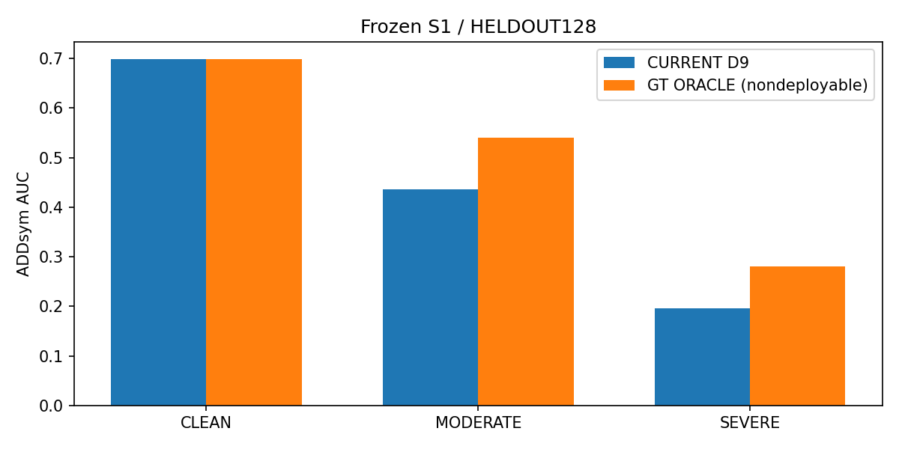
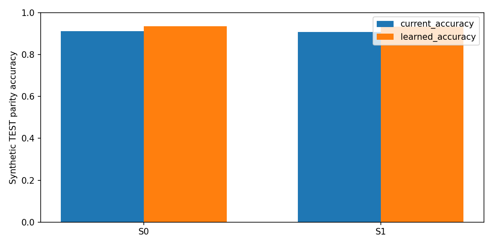
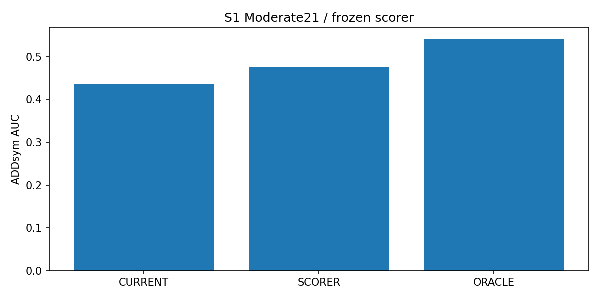
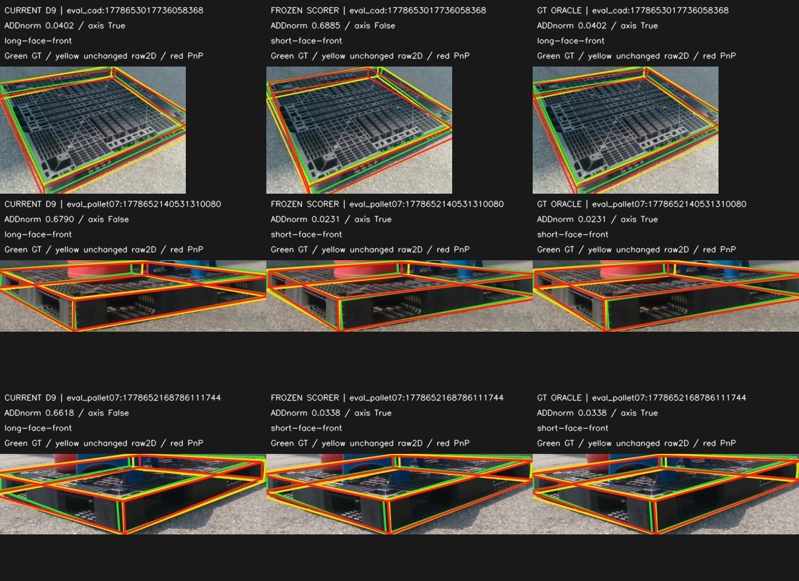
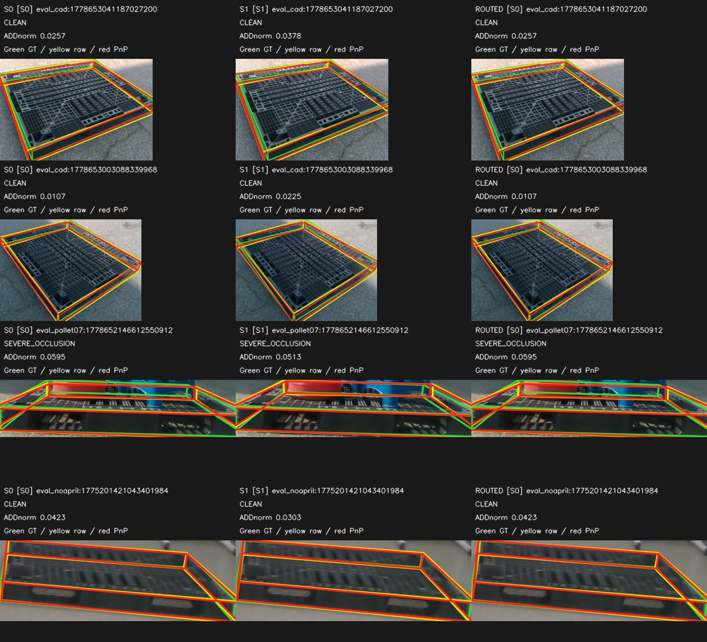
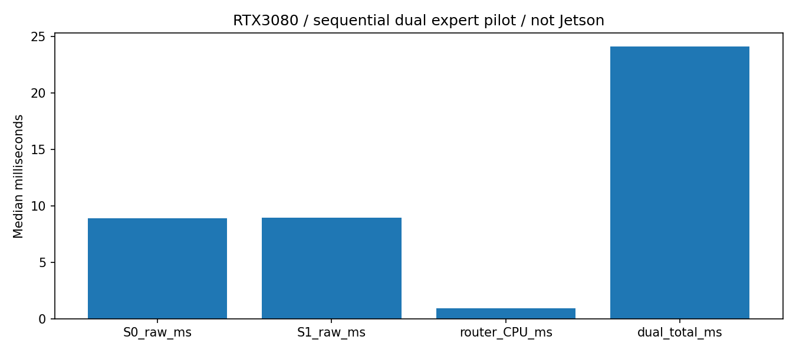

# W/D selector recovery + frozen expert routing — 통합 보고서

## 1. 결론 — Q1~Q4

**선택기 학습은 S1 실사 성능을 개선했다. 하지만 두 모델을 고르는 router는 Clean과 Severe의 장점을 동시에 보존하지 못했다.** 따라서 이번 결과에서 우선 남길 것은 S1+합성 선형 선택기 파일럿이며, router는 최종안으로 채택하지 않는다. base 모델이나 기존 논문 최종 경로를 자동 교체하지 않았다.

|질문|판정|근거|
|---|---|---|
|Q1 좋은 후보를 놓치는가?|YES|Moderate21 중 alternate ADD-better 4장|
|Q2 합성 정답만으로 선택을 배웠나?|YES|TEST 90.92% → 93.36%|
|Q3 실사 Moderate gap을 회수했나?|YES|AUC 0.435690 → 0.475333, gap recovery 37.79%|
|Q4 Clean 회복과 hard 이득 보존을 분리했나?|NO|Clean +0.004207, Severe -0.003218|

Q3 YES는 완전 해결이 아니라 **부분 회복**이다. 21장 중 axis recovery 2장과 regression 1장이 있고 oracle gap은 아직 남는다. Q4 NO 역시 모든 router의 불가능성이 아니라 이번 고정 feature/합성 감독/단일 파일럿의 실패다.

## 2. 출발점 — recording-disjoint S0/S1

동일 frozen S0/S1, 학습 recording과 분리된 HELDOUT128을 그대로 사용했다. Clean29 / Moderate21 / Severe78, 일반 플라스틱만 포함한다. 전체 YOLO 재학습·새 라벨·추가 seed/하이퍼파라미터 탐색·개별 점 remapping은 하지 않았다. R0를 포함한 기존 결과는 hash로 보호했다.

|group|S0 PCK10|S1 PCK10|S0 D9 AUC|S1 D9 AUC|S1 new scorer AUC|
|---|---:|---:|---:|---:|---:|
|CLEAN|0.6026|0.5895|0.711879|0.698638|0.698638|
|MODERATE|0.5584|0.5584|0.464119|0.435690|0.475333|
|SEVERE|0.4086|0.4352|0.144782|0.195397|0.211308|
|ALL|0.4772|0.4904|0.325656|0.348836|0.365035|

## 3. Stage1 — selector diagnosis

현재 axis wrong 5/21장, alternate axis-correct 5장, wrong∩alternate ADD-better 4장. wrong인데 current reprojection이 더 낮은 사례 5장. 두 후보의 invariant violation이 모두0인 사례 21/21장이다. 기하학적 검사 통과나 작은 잔차만으로 올바른 W/D를 보장하지 못한다.

기존 PCK/AUC/axis 통계를 1e-7 이내 재현했다. real GT를 읽기 전 feature 목록을 고정했고, Stage1 결과로 특징을 골라내지 않았다. [전체 프레임 표·분해](stage1_diagnostic/STAGE1_REPORT_KO.md)

## 4. Stage2 — synthetic-only scorer

TRAIN4096 / VAL1024 / TEST1024 프레임. 기존 replay512의 SHA와 같은 renderer 파생 프레임을 제외하고 renderer 그룹을 분리했다. S0/S1 sample은 프레임별 같은 split이다. exact K/R/t/Xcf/치수로 W/D 라벨을 만들며 historical area heuristic은 사용하지 않았다. frozen prediction lock 뒤에 synthetic label을 연결했다.

GEO_LINEAR와 GEO_IMG_MLP(input→64→GELU→32→GELU→1) 두 개만 학습했다. 동일 후보 scorer가 두 후보에 적용되고 작은 score를 택한다. AdamW .001, wd .0001, batch256, max30, seed42, VAL patience5. 두 모델의 best VAL 정확도는 0.9404297로 같아 사전 tie 규칙으로 GEO_LINEAR를 선택했다. 그 후 TEST 한 번만 평가했다.

TEST S0 91.11% → 93.46%, S1 90.72% → 93.26%. Brier·margin 및 elevation/size 계층은 [Stage2 상세표](stage2_synth_scorer/STAGE2_REPORT_KO.md)에 있다.

## 5. Stage3 — frozen scorer real recovery

판정 `SELECTOR_RECOVERY_WITHOUT_COLLATERAL`. S1 Moderate axis 16/21 → 17/21, 선택 변경 3장, axis 회복 2장 / 퇴행 1장. oracle AUC 0.540595. raw keypoint를 건드리지 않아 PCK와 verified visible-anchor PCK는 동일하다.

S1 Clean AUC는 동일하고 Severe도 개선했다. 반면 S0 Moderate는 0.464119→0.401452로 나빠졌다. 따라서 새 scorer가 모든 expert에 통하는 것은 아니며, Stage4에서는 공통 D9 fallback을 사용했다. [전체 R/yaw/t/IoU3D·recording·전이 표](stage3_real_recovery/STAGE3_REPORT_KO.md)

아래는 Moderate에서 선택이 바뀐 **세 장 전부**다. GT는 표시·사후 평가에만 사용했다. 노란 raw keypoints는 그대로이고, 빨간 PnP 후보만 바뀐다. 회복뿐 아니라 잘못 바뀐 사례도 포함한다.

## 6. Stage4 — clean-preservation router

판정 `CLEAN_RECOVERY_BUT_HARD_LOSS`. 두 expert 모두 PRODUCTION_D9로 통일했다. 합성 clean/occluded 쌍과 exact ADDnorm 우열로 router MLP 한 개만 학습했다. TEST accuracy 54.15%, routed AUC 0.674016는 S0 0.675094보다 낮다. 즉 synthetic에서부터 expert 선택이 충분히 학습되지 않았다. 실사 실패를 synthetic→real gap 하나로 단정하지 않는다.

|group|S0 AUC|S1 AUC|routed AUC|GT best expert AUC|route S0/S1|
|---|---:|---:|---:|---:|---|
|CLEAN|0.711879|0.698638|0.702845|0.724879|9/20|
|MODERATE|0.464119|0.435690|0.444548|0.508881|4/17|
|SEVERE|0.144782|0.195397|0.192179|0.206641|6/72|
|ALL|0.325656|0.348836|0.349281|0.373641|19/109|

전체 AUC가 +0.000445라는 작은 양수여도 Severe 손실과 전체 PCK10 감소가 있어 성공으로 판정하지 않는다. Stage4는 D9 기반이므로 Stage3 새 scorer의 이득을 합친 최종 수치가 아니다. [PCK5/10/20·6D 전체 표·가림 정책·비용](stage4_clean_preservation/STAGE4_REPORT_KO.md)

## 7. 병목 계층

|계층|이번에 확인한 것|남은 문제|
|---|---|---|
|keypoint|raw2D는 Stage1–3 불변|큰 raw corner 오차는 이 selector가 직접 복구하지 않음|
|candidate|좋은 W/D 후보가 이미 있는 사례 존재|oracle 자체가 완벽한 pose/정확한 GT를 뜻하지 않음|
|selector|합성 선형 scorer가 S1 Moderate gap 37.8% 회수|남은 gap과 S0 악화; 모든 expert에 일반화 못함|
|preservation|일부 clean 이득을 입력별로 고를 수 있음|Severe를 손상하지 않는 보존에는 실패 — 다음 주 병목|

## 8. Compute cost

RTX3080 dual expert median 24.12ms, P90 25.97ms, peak allocated 200.1MiB / reserved 322.0MiB. batch1, 5회 warmup, 30장, 두 모델 sequential. RGB decode·checkpoint load 제외; GAP transfer·PnP·CPU router 포함. tiny CPU model wrapper 재구성 overhead가 포함된 보수적 pilot이며 Jetson/최적화 배포 수치가 아니다.

합성 clean feature extraction 196.04s, real context extraction 6.59s, occluded synthetic extraction 199.25s. base optimizer step0. GPU temperature/process snapshots와 실측은 [COMPUTE_COST](stage4_clean_preservation/COMPUTE_COST.json)에 보존했다.

## 9. 다음 딱 한 단계

분기 **B**: zero-init single-model preservation 1개: easy/clean 출력을 보존하면서 hard 적응하는 제한된 residual/gate. 이번 실행에서는 학습하지 않음.

S1의 새 selector 부분 회복은 보존하되, 다음에는 clean 출력 보존을 목표로 잡는다. 이번 실패 router를 즉시 distill하거나 새로운 seed/특징/학습량 sweep을 추가하지 않는다. 별도 지시 전 다음 학습은 시작하지 않았다.

## 10. 한계

- HELDOUT128은 recording-disjoint이지만 이미 열람한 DEV이며 독립 final TEST가 아니다. Stage1/3은 같은 Moderate21을 사용했다.
- single seed42 base / small learners, 작은 실제 표본. 통계적 유의성이나 전범위 일반화를 주장하지 않는다.
- real6D reference는 geometry-derived이며 독립 계측 GT가 아니다. camera-facing/180° role-contract warning은 유지했다. C4 remap이나 점별 matching으로 성능을 만들지 않았다.
- 일반 플라스틱만 평가했다. 정사각형·목재·다른 도메인 성능은 이 결과로 판단하지 않는다.
- synthetic TEST는 새 scorer/router의 보류 데이터지만 기존 base R0는 더 넓은 원천 합성을 학습했다. base-unseen TEST라고 부르지 않는다.
- 그룹 분리 결과 합성 VAL/TEST는 P0/TEX 저양각 위주이며 HIGH elevation0장이다. 이 분포 차이를 보고 split을 다시 고르지 않았다.
- 원래 S1 가림 policy는 real 학습용이었다. 이번에는 synthetic에 적용하고 기존 .5 schedule/coverage/paired feasibility를 유지했다. rectangle이 실제 적용되지 않은 쌍도 포함하며 applied-only를 따로 보고했다. random affine 전체 학습 pipeline의 완전 복제는 아니다.
- GT best candidate/expert는 사후 비배포 진단일 뿐이다. real GT는 고정 결정 뒤 scoring/시각화에만 썼고, synthetic 학습 프로세스에는 읽기 금지 guard가 있다.

## 11. 재현·해시·커밋

감사 **PASS / 45개**. 기존 입력 5644개와 선택 합성 이미지 6144개 hash 확인. 가중치·gradient 불변, hook bit-exact, 순서 swap/tie 불변, split/파생 이미지 배제, VAL-only/TEST-once, decision-before-GT, exact population, 모든 그림을 검사했다.

[실행 순서](../../../scripts/research/pallet_selector_recovery_v1/README.md) · [전체 입력 hash](INPUT_BINDINGS.json) · [자동 감사](FINAL_AUDIT.json) · [최종 판정](FINAL_DECISION.json)

|stage|commit|push|
|---|---|---|
|1|`ede7c61a4006991084fbfbb007d0998568852261`|VERIFIED / remote SHA 일치|
|2|`f470e0e8f585b5fedfb6fdf65739fbd9b8d52eef`|VERIFIED / remote SHA 일치|
|3|`6210735a0dc33b2ecec33e09d63fbc04dc400f58`|VERIFIED / remote SHA 일치|
|4|`84d957155b1a5b6e112416adb4a3e81bfcabcbd0`|VERIFIED / remote SHA 일치|

각 push 후 SHA 영수증은 다음 커밋에 넣어 self-reference를 피했다. 통합 보고서 커밋은 별도이며 최종 live remote SHA는 CLI에서 재확인한다. 대형 tensor/checkpoint/원본은 로컬 private namespace에, 작은 보고서·그래프·ROI 이미지는 Git에 보존했다. 다른 기존 작업 파일은 stage/수정하지 않았다.
