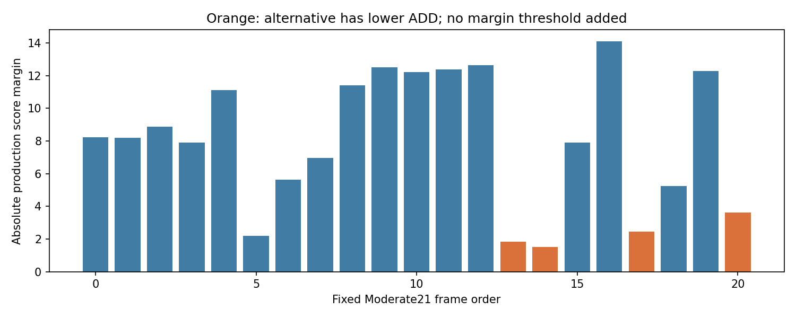
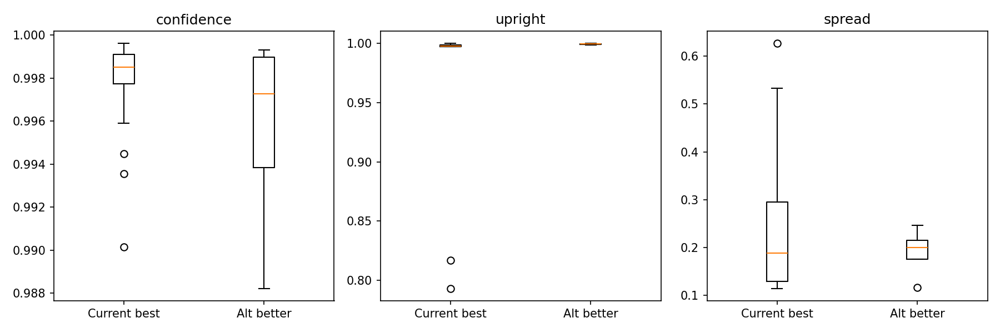
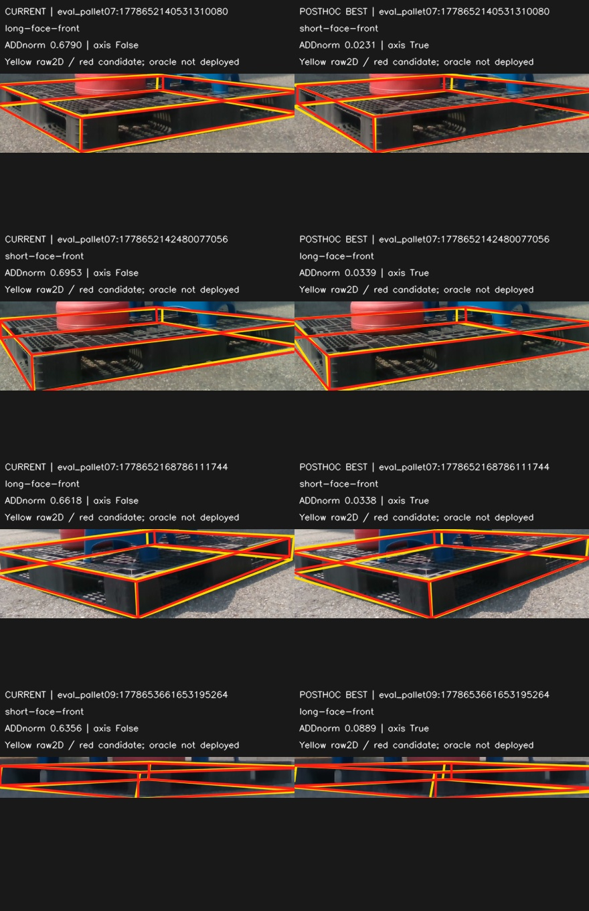
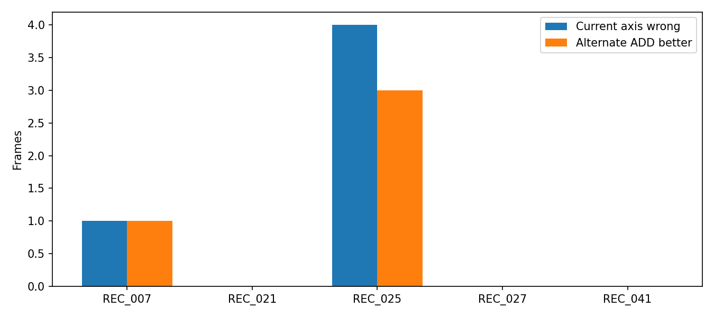

# Stage1 — Moderate W/D 후보 선택 진단

**Q1: YES. 현재 선택기가 더 좋은 후보를 실제로 버리는 사례가 있다.**

고정 Moderate21, S1 PCK10=0.558442. CURRENT ADD AUC=0.43569048, ORACLE=0.54059524, gap=0.10490476. 기존 값을1e-7 이내 재현했다.

W/D parity 16/21. 현재 axis wrong 5장, alternate ADD-better 4장, 둘의 교집합 4장. 현재 wrong인데 재투영오차는 오히려 더 낮은 사례 5장. 두 후보의 invariant violation이 모두0인 사례 21/21장.

재투영 잔차·좌우/상하 규칙만으로 올바른 W/D를 고르기 어려운 사례다. 이것이 synthetic 학습으로 해결된다는 뜻은 아니며 Stage2/3에서 따로 검증한다. real GT를 보고 특징을 고르지 않았고, Stage0 목록을 고정한 뒤 이 결과를 읽었다.

|frame|recording|current|best (사후)|best ADDnorm|ADD gap|category|
|---|---|---|---|---:|---:|---|
|eval_cad:1778653017736058368|REC_021|long-face-front|long-face-front|0.04020|0.00000|CURRENT_BEST|
|eval_cad:1778653018878592768|REC_021|long-face-front|long-face-front|0.04164|0.00000|CURRENT_BEST|
|eval_night08:1779449488068910592|REC_027|long-face-front|long-face-front|0.17903|0.00000|CURRENT_BEST|
|eval_night08:1779449499143611648|REC_027|long-face-front|long-face-front|0.13286|0.00000|CURRENT_BEST|
|eval_night08:1779449501478488320|REC_027|long-face-front|long-face-front|0.02234|0.00000|CURRENT_BEST|
|eval_outside:1778651530691638016|REC_041|long-face-front|long-face-front|0.05837|0.00000|CURRENT_BEST|
|eval_outside:1778651579029250816|REC_041|long-face-front|long-face-front|0.06115|0.00000|CURRENT_BEST|
|eval_outside:1778653540259983104|REC_041|short-face-front|short-face-front|0.06243|0.00000|CURRENT_BEST|
|eval_outside:1778653545299653120|REC_041|short-face-front|short-face-front|0.04072|0.00000|CURRENT_BEST|
|eval_pallet07:1778652130452698368|REC_025|short-face-front|short-face-front|0.04168|0.00000|CURRENT_BEST|
|eval_pallet07:1778652132535256576|REC_025|short-face-front|short-face-front|0.02741|0.00000|CURRENT_BEST|
|eval_pallet07:1778652136533958400|REC_025|short-face-front|short-face-front|0.00978|0.00000|CURRENT_BEST|
|eval_pallet07:1778652138515809024|REC_025|long-face-front|long-face-front|0.02413|0.00000|CURRENT_BEST|
|eval_pallet07:1778652140531310080|REC_025|long-face-front|short-face-front|0.02313|0.65589|ALTERNATE_BETTER|
|eval_pallet07:1778652142480077056|REC_025|short-face-front|long-face-front|0.03385|0.66140|ALTERNATE_BETTER|
|eval_pallet07:1778652150610404864|REC_025|long-face-front|long-face-front|0.04408|0.00000|CURRENT_BEST|
|eval_pallet07:1778652166837872128|REC_025|short-face-front|short-face-front|0.07782|0.00000|CURRENT_BEST|
|eval_pallet07:1778652168786111744|REC_025|long-face-front|short-face-front|0.03379|0.62798|ALTERNATE_BETTER|
|eval_pallet07:1778652170735118080|REC_025|short-face-front|short-face-front|0.01562|0.00000|CURRENT_BEST|
|eval_pallet07:1778652172717607680|REC_025|short-face-front|short-face-front|0.01768|0.00000|CURRENT_BEST|
|eval_pallet09:1778653661653195264|REC_007|short-face-front|long-face-front|0.08893|0.54670|ALTERNATE_BETTER|

H10 role warning은 유지하지만 C4 remapping으로 점수를 만들거나 primary에서 사례를 제외하지 않았다. GT oracle은 비배포용이다. 이미 열람한 recording-disjoint DEV이며 독립 TEST가 아니다. 작은 ROI만 공개하고 원본/좌표캐시는 로컬에 보존한다.
