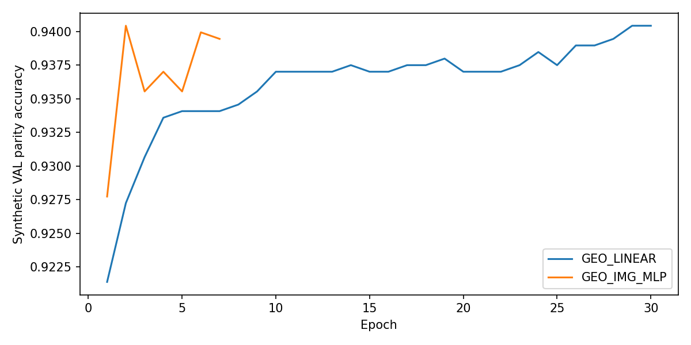

# Stage2 — 합성 전용 W/D shared candidate scorer

선택 모델: **GEO_LINEAR**. VAL 동률이면 LINEAR라는 사전 규칙으로 선택했다. TEST는 선택 완료 후 한 번만 평가했다.

TRAIN 4096 / VAL 1024 / TEST 1024 프레임. 같은 프레임의 S0/S1은 같은 split이다. renderer 그룹 분리, 기존 replay512와 그 파생 이미지까지 제외했다. exact Xcf의 metric width/depth로 라벨을 만들었으며 면적 휴리스틱을 쓰지 않았다.

정답 좌표와 renderer pose 재투영의 최대 차이 0.001226px. GEO + head GAP448의 두 모델만 학습했다. base weight/gradient는 그대로이며 hook 전후 예측은 bit-exact다.

|variant|VAL accuracy|best epoch|epochs|
|---|---:|---:|---:|
|GEO_LINEAR|0.940430|29|30|
|GEO_IMG_MLP|0.940430|2|7|

|expert / TEST strata|N|D9 accuracy|scorer accuracy|Brier|
|---|---:|---:|---:|---:|
|S0 / TEST|1024|0.9111328125|0.9345703125|0.05643437371707716|
|S0 / TEST_LOW|979|0.9090909090909091|0.933605720122574|0.05785788832237955|
|S0 / TEST_MID|45|0.9555555555555556|0.9555555555555556|0.025465022637276215|
|S0 / TEST_HIGH|0|None|None|None|
|S0 / TEST_SMALL|873|0.9198167239404352|0.9369988545246277|0.054868877310832925|
|S0 / TEST_LARGE|151|0.8609271523178808|0.9205298013245033|0.06548522380086005|
|S1 / TEST|1024|0.9072265625|0.9326171875|0.05683835680635825|
|S1 / TEST_LOW|979|0.9050051072522982|0.9305413687436159|0.058426786236133225|
|S1 / TEST_MID|45|0.9555555555555556|0.9777777777777777|0.02228119210080927|
|S1 / TEST_HIGH|0|None|None|None|
|S1 / TEST_SMALL|873|0.9163802978235968|0.9347079037800687|0.0560533116886317|
|S1 / TEST_LARGE|151|0.8543046357615894|0.9205298013245033|0.06137706136116142|

합성 TEST 전체 D9 90.9180% → scorer 93.3594%. Q2는 개선 신호 YES이며 실사 일반화의 증거는 아직 아니다.

주의: 원래 R0는 더 넓은 합성 원천으로 학습되었다. 이 TEST는 새 선택기/router 학습에서만 보류된 TEST이지 base detector가 처음 보는 합성 원천이라는 뜻이 아니다. 그룹 분리로 VAL/TEST는 P0/TEX 저양각 위주이며 HIGH 계층은 0장(N/A)이다.

실사 GT 경로 접근을 runtime guard로 차단한 별도 학습 프로세스. real GT/axis/ADD/oracle로 checkpoint를 고르지 않았다.
